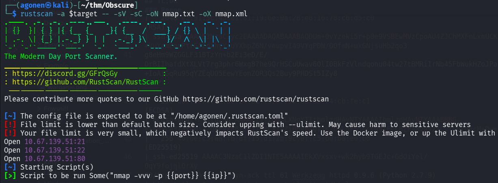

## TL;DR


### Recon

we start with `rustscan`, using this command:
```bash
rustscan -a $target -- -sV -sC -oN nmap.txt -oX nmap.xml
```



We can see port `21` open with ftp, port `22` with ssh and port `80` with Werkzeug httpd server.
```bash
PORT   STATE SERVICE REASON         VERSION                                                                                                                                                  
21/tcp open  ftp     syn-ack ttl 62 vsftpd 3.0.3                                                                                                                                             
| ftp-anon: Anonymous FTP login allowed (FTP code 230)                                                                                                                                       
|_drwxr-xr-x    2 65534    65534        4096 Jul 24  2022 pub                                                                                                                                
| ftp-syst:                                                                                                                                                                                  
|   STAT:                                                                                                                                                                                    
| FTP server status:                                                                                                                                                                         
|      Connected to ::ffff:192.168.164.248                                                                                                                                                   
|      Logged in as ftp                                                                                                                                                                      
|      TYPE: ASCII                                                                                                                                                                           
|      No session bandwidth limit                                                                                                                                                            
|      Session timeout in seconds is 300                                                                                                                                                     
|      Control connection is plain text                                                                                                                      
|      Data connections will be plain text                                                                                                                   
|      At session startup, client count was 2                                                                                                                
|      vsFTPd 3.0.3 - secure, fast, stable                                                                                                                   
|_End of status                                                                                                                                              
22/tcp open  ssh     syn-ack ttl 62 OpenSSH 7.2p2 Ubuntu 4ubuntu2.10 (Ubuntu Linux; protocol 2.0)                                                            
| ssh-hostkey:                                                                                                                                               
|   2048 e2:91:5c:43:c1:81:19:6e:0a:28:e8:16:78:c6:d5:c0 (RSA)                                                                                               
| ssh-rsa AAAAB3NzaC1yc2EAAAADAQABAAABAQDUm+0vYzeki5r+p0e9VSBEwMVzCpoAU4ZJChMXFmLxmUCK5VMiEe1SysKfr+1+eS/f3AGVEGB4FWkGgpy6LY/+VuYcmEosPtrGfEdXhyYjuYXhpZ6N/veupvI49VYgPDN/OOfmN+uxGNjsuHb2qo3
g8eHm9WZGGLF31BTzYn+b2Ei3eD/E/OrBIIhafdXtXLVt7rg3phr6Wxg87he9QrHSCuUwav6QlI0BkFzVlndqonu04tw27tBMRiIrNb45FbWukHZoJPa2pXAuS04wduZBVqVGUhODyZozy+IoAiGqRu95qYZEqUO5EewYEonZOR3Qs2Buy9PHDSt5IZy8
I1eP                                                                                                                                                         
|   256 db:f8:7e:ca:5e:24:31:f9:07:57:8b:8d:74:cb:fe:c1 (ECDSA)                                                                                              
| ecdsa-sha2-nistp256 AAAAE2VjZHNhLXNoYTItbmlzdHAyNTYAAAAIbmlzdHAyNTYAAABBBG+lk85La3T3xvMi1ZQBFyX88tzW77WMCX1AZi0HVEZQTJK2UWLdFSJCctW91FCL8ZPAMvAVz3CvTCQrq6cM+Dw=
|   256 40:6e:c3:a8:fb:df:15:d1:2b:9c:0f:c5:60:ba:e0:b6 (ED25519)                                                                                            
|_ssh-ed25519 AAAAC3NzaC1lZDI1NTE5AAAAIEkXVxsxv+wk2hyb9TGEJc+GdOiYel/OqY9fojqlQrXy                                                                           
80/tcp open  http    syn-ack ttl 61 Werkzeug httpd 0.9.6 (Python 2.7.9)
|_http-title: Site doesn't have a title (text/html; charset=utf-8).                                                                                          
| http-methods:                                                                                                                                              
|_  Supported Methods: GET HEAD OPTIONS                             
| http-cookie-flags:                                                          
|   /:                                                                                                                                                       
|     session_id: 
|_      httponly flag not set                                                 
|_http-server-header: Werkzeug/0.9.6 Python/2.7.9                                                                                                            
Service Info: OSs: Unix, Linux; CPE: cpe:/o:linux:linux_kernel
```

I added `obscure.thm` to my `/etc/hosts`.

### ...

we first can see the ftp service allows anonymous login


So, I fetched all the files using the command:
```bash
wget -m ftp://anonymous@obscure.thm
```

The notice says they've made temporary application program:
```bash
┌──(agonen㉿kali)-[~/thm/Obscure/obscure.thm/pub]
└─$ cat notice.txt 
From antisoft.thm security,


A number of people have been forgetting their passwords so we've made a temporary password application.
```

I execute the binary `password`, and it asks for some number.
Using ltrace I found the number is `971234596`, and then it gave me some password


```bash
┌──(agonen㉿kali)-[~/thm/Obscure/obscure.thm/pub]
└─$ ./password       
Password Recovery
Please enter your employee id that is in your email
971234596
remember this next time 'SecurePassword123!'
```

So, we got the password `SecurePassword123!`, which is the master password we can use in the website.

when going to root page, we are being redirected to this login page:


We can 

### Privilege Escalation to Root


