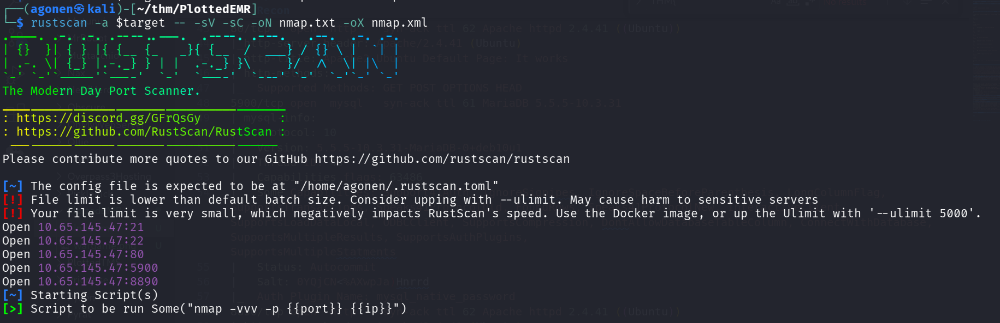
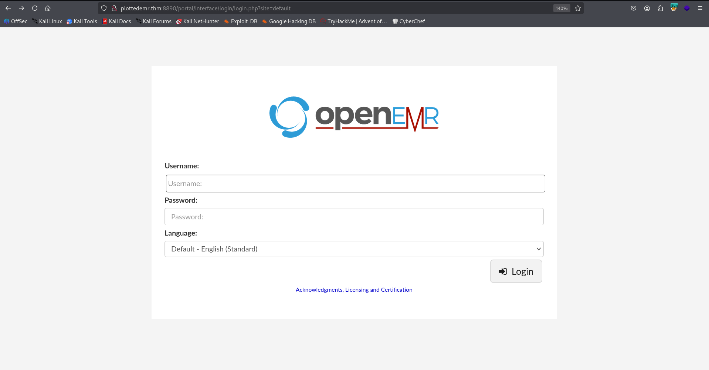
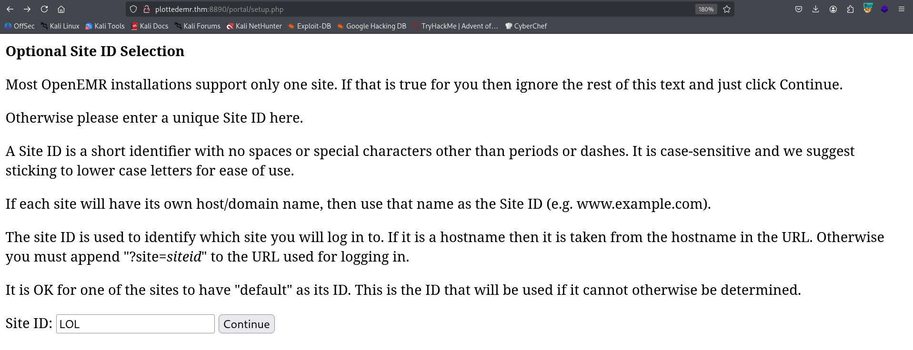
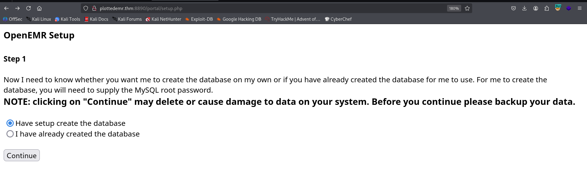

## TL;DR


### Recon

we start with `rustscan`, using this command:
```bash
rustscan -a $target -- -sV -sC -oN nmap.txt -oX nmap.xml
```



we can see port `21` with ftp, port `22` with ssh, port `80` with apache http server, port `5900` with mysql and port `8890` with apache http server.
```bash
PORT     STATE SERVICE REASON         VERSION                                                                                                                                                                     
21/tcp   open  ftp     syn-ack ttl 62 vsftpd 3.0.3                                                                                                                                                                
|_ftp-anon: Anonymous FTP login allowed (FTP code 230)                                                                                                                                                            
| ftp-syst:                                                                                                                                                                                                       
|   STAT:                                                                                                                                                                                                         
| FTP server status:                                                                                                                                                                                              
|      Connected to ::ffff:192.168.138.59                                                                                                                                                                         
|      Logged in as ftp                                                                                                                                                                                           
|      TYPE: ASCII                                                                                                                                                                                                
|      No session bandwidth limit                                                                                                                                                                                 
|      Session timeout in seconds is 300                                                                                                                                                                          
|      Control connection is plain text                                                                                                                                                                           
|      Data connections will be plain text                                                                                                                                                                        
|      At session startup, client count was 2                                                                                                                                                                     
|      vsFTPd 3.0.3 - secure, fast, stable                                                                                                                                                                        
|_End of status                                                                                                                                                                                                   
22/tcp   open  ssh     syn-ack ttl 62 OpenSSH 8.2p1 Ubuntu 4ubuntu0.4 (Ubuntu Linux; protocol 2.0)                                                                                                                
| ssh-hostkey:                                                                                                                                                                                                    
|   3072 aa:63:ae:b3:17:f0:62:09:8d:96:c8:e0:7a:34:ef:5d (RSA)                                           
| ssh-rsa AAAAB3NzaC1yc2EAAAADAQABAAABgQD1C7CSKGRMNQXDhV2bgE3arqVnX/OdfYBX0hoysMhJkGRby5Tw3NLu62iUy3i1hkWkwYsINw0z1aO1DQzBFLtmooy4WQKk1P2f00dv9EaJ3Gl1nArmvWXEL5cGh7fvFry7Rgb9M/ZpOomGFc2mARiKGyXvREnc9TvAqxZJQF9Hs9qg8c8mDatnUMF1u1QQGFITrlUoujRRKHPhuutEhxyDT4ORtoduvTTjgR3gZsJodznBen1SJ0798CPz1l2wR33Pj7pCr+h7Bkm5pXaDuZGrRGERPEqmMJZIteDnJzIEvW0X71DOQdEA9z4fUTlm799uNugr9Hzo3+A1n/LfYtsVSy6IVJksra0DJ0Nvf78sFOSjAAIX6moSp6r83nnzOyjm1KDx6LdRqQt7IC+e7TtzDDGWakKiVisWUEsNHE+VhCActfMQAhkry5Mt5gDYeT70SG7Pduy29Iuwo4xoqiqZABBs4zOhxioMEhnZUX6ombj2VmObVicjhbwdBs04Jck=                                                                            
|   256 d7:4a:34:0a:bc:e4:ce:ca:6f:d2:a8:26:f7:02:2e:4b (ECDSA)                                          
| ecdsa-sha2-nistp256 AAAAE2VjZHNhLXNoYTItbmlzdHAyNTYAAAAIbmlzdHAyNTYAAABBBEVVLyODs01FtCZzmUnBGFRbIlhsM77D+PoYqPfZ3DX0T2JIjr29a3eSPAzrq0U2EbOZ/p1euKnAjHoPNGgld9k=                                                
|   256 10:16:63:fb:c4:b2:8b:41:74:7b:df:bd:2d:fe:32:57 (ED25519)                                        
|_ssh-ed25519 AAAAC3NzaC1lZDI1NTE5AAAAII0gM3YLcX7mj+7sw8mmqo9Z8SU4DTNnMCpKXvdsl9J+                                                                                                                                
80/tcp   open  http    syn-ack ttl 62 Apache httpd 2.4.41 ((Ubuntu))                                     
|_http-server-header: Apache/2.4.41 (Ubuntu)                                                             
|_http-title: Apache2 Ubuntu Default Page: It works                                                      
| http-methods:                                     
|_  Supported Methods: GET POST OPTIONS HEAD                                                             
5900/tcp open  mysql   syn-ack ttl 61 MariaDB 5.5.5-10.3.31                                              
| mysql-info:                                       
|   Protocol: 10                                    
|   Version: 5.5.5-10.3.31-MariaDB-0+deb10u1                                                             
|   Thread ID: 40                                   
|   Capabilities flags: 63486                       
|   Some Capabilities: Support41Auth, IgnoreSigpipes, IgnoreSpaceBeforeParenthesis, LongColumnFlag, SupportsTransactions, Speaks41ProtocolOld, FoundRows, Speaks41ProtocolNew, InteractiveClient, SupportsLoadDataLocal, ODBCClient, SupportsCompression, DontAllowDatabaseTableColumn, ConnectWithDatabase, SupportsMultipleResults, SupportsAuthPlugins, SupportsMultipleStatments                                                
|   Status: Autocommit                              
|   Salt: 0YQjCN<%AXwpJa)Hnrrd                      
|_  Auth Plugin Name: mysql_native_password                                                              
8890/tcp open  http    syn-ack ttl 62 Apache httpd 2.4.41 ((Ubuntu))                                     
|_http-server-header: Apache/2.4.41 (Ubuntu)                                                             
|_http-title: Apache2 Ubuntu Default Page: It works                                                      
| http-methods:                                     
|_  Supported Methods: GET POST OPTIONS HEAD                                                             
Service Info: OSs: Unix, Linux; CPE: cpe:/o:linux:linux_kernel
```

I added `plottedemr.thm` to my `/etc/hosts`.

### ...

First, I logged in to the ftp anonymously:
```bash
ftp anonymous@plottedemr.thm
```

There, after some navigation, I found the file `you_are_determined.txt` hidden inside `.-/../`:
```bash
┌──(agonen㉿kali)-[~/thm/PlottedEMR]
└─$ cat you_are_determined.txt                                              
Sorry, but you wasted your time!

Here is something for you :D
https://www.youtube.com/watch?v=dQw4w9WgXcQ

Wait..I'll give you a hint: see if you can access the `admin` account
```

Went to port `5900`, understand what I have there, and then move on to 8890.

Okay, let's move on to port `8890` for fuzzing:
```bash
┌──(agonen㉿kali)-[~/thm/PlottedEMR]
└─$ ffuf -u 'http://plottedemr.thm:8890/FUZZ' -w /usr/share/SecLists/Discovery/Web-Content/big.txt -fc 403

        /'___\  /'___\           /'___\       
       /\ \__/ /\ \__/  __  __  /\ \__/       
       \ \ ,__\\ \ ,__\/\ \/\ \ \ \ ,__\      
        \ \ \_/ \ \ \_/\ \ \_\ \ \ \ \_/      
         \ \_\   \ \_\  \ \____/  \ \_\       
          \/_/    \/_/   \/___/    \/_/       

       v2.1.0-dev
________________________________________________

 :: Method           : GET
 :: URL              : http://plottedemr.thm:8890/FUZZ
 :: Wordlist         : FUZZ: /usr/share/SecLists/Discovery/Web-Content/big.txt
 :: Follow redirects : false
 :: Calibration      : false
 :: Timeout          : 10
 :: Threads          : 40
 :: Matcher          : Response status: 200-299,301,302,307,401,403,405,500
 :: Filter           : Response status: 403
________________________________________________

80                      [Status: 301, Size: 320, Words: 20, Lines: 10, Duration: 144ms]
portal                  [Status: 301, Size: 324, Words: 20, Lines: 10, Duration: 147ms]
```

and found the `/portal`, which has openEMR portal on it:



Then, I went for under fuzzing on `/portal`, and found `setup.php`:
```bash
┌──(agonen㉿kali)-[~/thm/PlottedEMR]
└─$ ffuf -u 'http://plottedemr.thm:8890/portal/FUZZ' -w /usr/share/SecLists/Discovery/Web-Content/common.txt -fc 403 -e .php,.txt

        /'___\  /'___\           /'___\       
       /\ \__/ /\ \__/  __  __  /\ \__/       
       \ \ ,__\\ \ ,__\/\ \/\ \ \ \ ,__\      
        \ \ \_/ \ \ \_/\ \ \_\ \ \ \ \_/      
         \ \_\   \ \_\  \ \____/  \ \_\       
          \/_/    \/_/   \/___/    \/_/       

       v2.1.0-dev
________________________________________________

 :: Method           : GET
 :: URL              : http://plottedemr.thm:8890/portal/FUZZ
 :: Wordlist         : FUZZ: /usr/share/SecLists/Discovery/Web-Content/common.txt
 :: Extensions       : .php .txt 
 :: Follow redirects : false
 :: Calibration      : false
 :: Timeout          : 10
 :: Threads          : 40
 :: Matcher          : Response status: 200-299,301,302,307,401,403,405,500
 :: Filter           : Response status: 403
________________________________________________

.gitignore              [Status: 200, Size: 35, Words: 1, Lines: 4, Duration: 154ms]
LICENSE                 [Status: 200, Size: 35147, Words: 5836, Lines: 675, Duration: 149ms]
admin.php               [Status: 200, Size: 937, Words: 69, Lines: 36, Duration: 149ms]
admin.php               [Status: 200, Size: 937, Words: 69, Lines: 36, Duration: 146ms]
common                  [Status: 301, Size: 331, Words: 20, Lines: 10, Duration: 160ms]
config                  [Status: 301, Size: 331, Words: 20, Lines: 10, Duration: 145ms]
contrib                 [Status: 301, Size: 332, Words: 20, Lines: 10, Duration: 146ms]
controllers             [Status: 301, Size: 336, Words: 20, Lines: 10, Duration: 142ms]
custom                  [Status: 301, Size: 331, Words: 20, Lines: 10, Duration: 145ms]
images                  [Status: 301, Size: 331, Words: 20, Lines: 10, Duration: 144ms]
index.php               [Status: 302, Size: 0, Words: 1, Lines: 1, Duration: 143ms]
index.php               [Status: 302, Size: 0, Words: 1, Lines: 1, Duration: 145ms]
interface               [Status: 301, Size: 334, Words: 20, Lines: 10, Duration: 164ms]
library                 [Status: 301, Size: 332, Words: 20, Lines: 10, Duration: 154ms]
modules                 [Status: 301, Size: 332, Words: 20, Lines: 10, Duration: 144ms]
public                  [Status: 301, Size: 331, Words: 20, Lines: 10, Duration: 146ms]
services                [Status: 301, Size: 333, Words: 20, Lines: 10, Duration: 143ms]
setup.php               [Status: 200, Size: 1214, Words: 167, Lines: 16, Duration: 150ms]
sites                   [Status: 301, Size: 330, Words: 20, Lines: 10, Duration: 145ms]
sql                     [Status: 301, Size: 328, Words: 20, Lines: 10, Duration: 141ms]
templates               [Status: 301, Size: 334, Words: 20, Lines: 10, Duration: 145ms]
tests                   [Status: 301, Size: 330, Words: 20, Lines: 10, Duration: 150ms]
vendor                  [Status: 301, Size: 331, Words: 20, Lines: 10, Duration: 143ms]
version.php             [Status: 200, Size: 0, Words: 1, Lines: 1, Duration: 151ms]
:: Progress: [14250/14250] :: Job [1/1] :: 256 req/sec :: Duration: [0:00:56] :: Errors: 0 ::
```



We are setting a new site, because we can. Here, press create new db:



```bash
CREATE USER 'openemr'@'%' IDENTIFIED BY 'password123';
GRANT ALL PRIVILEGES ON openemr.* TO 'openemr'@'%';
FLUSH PRIVILEGES;

```
### Privilege Escalation to Root


