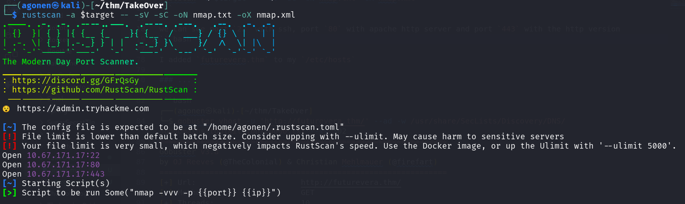
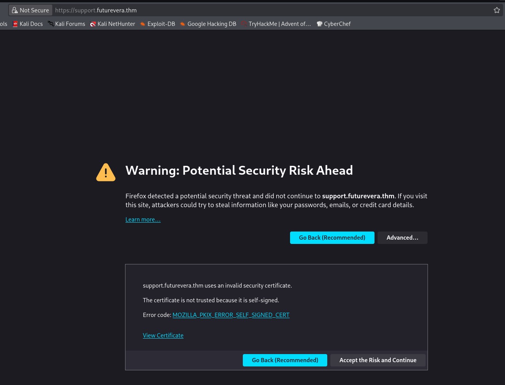
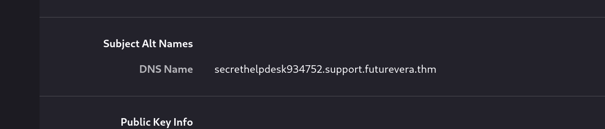

## TL;DR

In this challenge we find subdomain `support.futurevera.thm`, and there we find hidden subdomain that someone took over, which redirects to S3 bucket that is the flag.

### Recon

we start with `rustscan`, using this command:
```bash
rustscan -a $target -- -sV -sC -oN nmap.txt -oX nmap.xml
```



we can see port `22` with ssh, port `80` with apache http server and port `443` with the http version
```bash
PORT    STATE SERVICE  REASON         VERSION                                                                                                                                                                                                                                 
22/tcp  open  ssh      syn-ack ttl 62 OpenSSH 8.2p1 Ubuntu 4ubuntu0.13 (Ubuntu Linux; protocol 2.0)                                                                                                                                                                           
| ssh-hostkey:                                                                                                                                               
|   3072 ce:fa:1b:3f:ac:8f:cf:86:2c:fa:bb:72:a8:e9:44:7e (RSA)                                                                                               
| ssh-rsa AAAAB3NzaC1yc2EAAAADAQABAAABgQDNvLAgKl7ErAn1Aaf2adITaYcwnHcgUjMzCLh4s7ZrIcFTZDm+8dQP1RH4DhRyQuKx/cfIgIPr366FabbRjuyrRD333LReFXThNyVOzEowKTsDvRl4SNlF30+MjixEVZToB69WM+yRievWVak5pIkk5uHfZW0vx5h/OcsaiUbexfhz4vJJOtm9fmFraLETHFtA3mEdIG3TKffWy0OOBXD/GlwPWGFduge/eriE
jNH9wx1KdAnu3+ufIsUufOciqkfRsWoEdAhVkv2/d1eGBn6EMwQHFkO21zblcHVT0XZsKHIzXnXVQ+MfHa7eb+kw7q+UPwos6kNjaEMdpU3yL4KzqbMvcx86ZrogtQOu98J14nMh9LjGnnV0TR41BP23o5AiZFAix7YpXbizynOebvsqf8t0nywSngPDP4V3e+TG85HrYmrlvhe5uIrArt4Hwut3PjAvA9FFDz4ZSIv6DvP05yJ2TXZoFw82G/PsF8qPz4dW1uP51B
WiuE57ZRXMU1E=                                                                                                                                               
|   256 5c:3e:fc:19:13:41:75:3e:fb:2e:33:91:e8:64:1f:f2 (ECDSA)                                                                                              
| ecdsa-sha2-nistp256 AAAAE2VjZHNhLXNoYTItbmlzdHAyNTYAAAAIbmlzdHAyNTYAAABBBDvH4bAeHj7yP3M6j1h+1Z30TxfWmQCwBim3BxN9fNsMtGRYCYr6pxcK/q6djuYQIiWg9H5bdYqFIK61rQ8h3Dc=                                                                                                            
|   256 33:a9:4d:97:f4:be:0e:6e:71:8f:c9:ff:d1:a6:4a:1f (ED25519)                                                                                            
|_ssh-ed25519 AAAAC3NzaC1lZDI1NTE5AAAAIDP5xLAShqIf75HKzoN6jFhIn5xvsNrky+G4+/r/urdC                                                                                                                                                          
80/tcp  open  http     syn-ack ttl 62 Apache httpd 2.4.41 ((Ubuntu))                                                                                         
| http-methods:                                                                                                                                              
|_  Supported Methods: GET HEAD POST OPTIONS                                                                                                                 
|_http-title: Did not follow redirect to https://futurevera.thm/                                                                                                                                                                                                              
|_http-server-header: Apache/2.4.41 (Ubuntu)                                                                                                                 
443/tcp open  ssl/http syn-ack ttl 62 Apache httpd 2.4.41 ((Ubuntu))                                                                                         
| tls-alpn:                                                                                                                                                  
|_  http/1.1                                                                                                                                                 
| http-methods:                                                                                                                                              
|_  Supported Methods: POST OPTIONS HEAD GET                                                                                                                 
|_http-server-header: Apache/2.4.41 (Ubuntu)                                                                                                                 
|_ssl-date: TLS randomness does not represent time                                                                                                           
|_http-title: FutureVera                                                                                                                                     
| ssl-cert: Subject: commonName=futurevera.thm/organizationName=Futurevera/stateOrProvinceName=Oregon/countryName=US/localityName=Portland/organizationalUnitName=Thm                                                                                                         
| Issuer: commonName=futurevera.thm/organizationName=Futurevera/stateOrProvinceName=Oregon/countryName=US/localityName=Portland/organizationalUnitName=Thm   
| Public Key type: rsa                                                                                                                                       
| Public Key bits: 2048                                                       
| Signature Algorithm: sha256WithRSAEncryption                                
| Not valid before: 2022-03-13T10:05:19                                       
| Not valid after:  2023-03-13T10:05:19                                       
| MD5:   2e8d:6097:6b23:188c:06d5:f2cd:8def:dd3a                              
| SHA-1: 8023:fcfc:5e63:a29b:3d5e:eaaf:8f70:8b35:d8eb:c120                    
| -----BEGIN CERTIFICATE-----                                                 
| MIIDuzCCAqOgAwIBAgIUMx0OgCh/xob6nWlsHR+iKDXKZRkwDQYJKoZIhvcNAQEL            
| BQAwbTELMAkGA1UEBhMCVVMxDzANBgNVBAgMBk9yZWdvbjERMA8GA1UEBwwIUG9y            
| dGxhbmQxEzARBgNVBAoMCkZ1dHVyZXZlcmExDDAKBgNVBAsMA1RobTEXMBUGA1UE            
| AwwOZnV0dXJldmVyYS50aG0wHhcNMjIwMzEzMTAwNTE5WhcNMjMwMzEzMTAwNTE5            
| WjBtMQswCQYDVQQGEwJVUzEPMA0GA1UECAwGT3JlZ29uMREwDwYDVQQHDAhQb3J0            
| bGFuZDETMBEGA1UECgwKRnV0dXJldmVyYTEMMAoGA1UECwwDVGhtMRcwFQYDVQQD                                                                                                                           
| DA5mdXR1cmV2ZXJhLnRobTCCASIwDQYJKoZIhvcNAQEBBQADggEPADCCAQoCggEB                            
| AKZio9bT9ebOivcm+9xKKCUAobE2cdU5VFbi1Ve7oxsSGKWWEcsQlUn7tFj1jjKq                                                                                                                           
| hWDMZXxEW6aN3jU5p5zF6ATmwIuvNQqwZOaK8iKjXs8IWEBIQyz/iKBF6deWrN+8                            
| II+whTaSberFaND2G0VchB7OrOu/mlP1KNhm2kEKwak7YHxvFkSp7Nmu2yTQAnyp                            
| WK2CBh3tdeGSq7/lyo8W3la/kPKhb4lmtBMS/tKPFslMxlOv0cSbNsvFVgJQ7jti                                                                                                                                                
| OZKPo/DAeaFIFB/32HocscQXM2VdQNXnQQ6M1cbBNskYWzvwp6di+wYzjjCWtM4o                                       
| Rg+3c/k5hqkEftEiwV7xAXcCAwEAAaNTMFEwHQYDVR0OBBYEFD23WEwlBMTDTpWI                                       
| 0eMU0IMaJyPJMB8GA1UdIwQYMBaAFD23WEwlBMTDTpWI0eMU0IMaJyPJMA8GA1Ud                                                                     
| EwEB/wQFMAMBAf8wDQYJKoZIhvcNAQELBQADggEBACu3W2VV8zRdD4M7oUWN8S6f                                                                     
| lM1z8aCkSckgFDEX7jtyJjWMQVwPizKkX17XQs6EgnWqD/PVt2Tf9dRhUH6FQmTK                                                                     
| qh35hnsSOdO3sQB8CnQ3SnlbeUYXY2mY/aUhz/lAkx6mURGuSen8BSbuL4mcm5Dk                                                                     
| AXxfa+SHc5XAjuYSlXVUSPy8noqFOLxvcGz+zPN2RQYwQkMDgQtUX2n0VcjwgTLN                                                                     
| bEuEm210+IGPX+ZEQWsnSSmz0SyUryBwc5BsjMaFUdAncxEBKCn1p4oN8gm6NQ32                                                                     
| FHFbghTgLgMTahuLWpXdeuVF87+pHUlroRHdgblQtb2wSwqVaDGHaLFiZcUMv/Y=                                                                     
|_-----END CERTIFICATE-----                                                                                                                                                                                                                 
Service Info: OS: Linux; CPE: cpe:/o:linux:linux_kernel
```

I added `futurevera.thm` to my `/etc/hosts`

### Find hidden subdomain at support.futurevera.thm

I fuzzed for subdomains:
```bash
┌──(agonen㉿kali)-[~/thm/TakeOver]
└─$ ffuf -u 'https://10.67.171.17/' -H 'Host: FUZZ.futurevera.thm' -w /usr/share/SecLists/Discovery/Web-Content/common.txt -fw 1511  

        /'___\  /'___\           /'___\       
       /\ \__/ /\ \__/  __  __  /\ \__/       
       \ \ ,__\\ \ ,__\/\ \/\ \ \ \ ,__\      
        \ \ \_/ \ \ \_/\ \ \_\ \ \ \ \_/      
         \ \_\   \ \_\  \ \____/  \ \_\       
          \/_/    \/_/   \/___/    \/_/       

       v2.1.0-dev
________________________________________________

 :: Method           : GET
 :: URL              : https://10.67.171.17/
 :: Wordlist         : FUZZ: /usr/share/SecLists/Discovery/Web-Content/common.txt
 :: Header           : Host: FUZZ.futurevera.thm
 :: Follow redirects : false
 :: Calibration      : false
 :: Timeout          : 10
 :: Threads          : 40
 :: Matcher          : Response status: 200-299,301,302,307,401,403,405,500
 :: Filter           : Response words: 1511
________________________________________________

Blog                    [Status: 200, Size: 3838, Words: 1326, Lines: 81, Duration: 152ms]
Support                 [Status: 200, Size: 1522, Words: 367, Lines: 34, Duration: 147ms]
blog                    [Status: 200, Size: 3838, Words: 1326, Lines: 81, Duration: 151ms]
support                 [Status: 200, Size: 1522, Words: 367, Lines: 34, Duration: 170ms]
:: Progress: [4750/4750] :: Job [1/1] :: 261 req/sec :: Duration: [0:00:19] :: Errors: 0 ::
```

we can see `support` and `blog`. I added those two subdomains to the `/etc/hosts`.
I tried to access `https://support.futurevera.thm/`, we can see error in the certificate



I viewed the full certificate, there is some hidden subdomain we can see
```bash
secrethelpdesk934752.support.futurevera.thm
```



I added `secrethelpdesk934752.support.futurevera.thm` to my `/etc/hosts`. 
I tried to `curl` it, we can see it redirect us to something strange.

```bash
┌──(agonen㉿kali)-[~/thm/TakeOver]
└─$ curl http://secrethelpdesk934752.support.futurevera.thm -i
HTTP/1.1 302 Found
Date: Tue, 27 Jan 2026 20:24:56 GMT
Server: Apache/2.4.41 (Ubuntu)
Location: http://flag{beea0d6edfcee06a59b83fb50ae81b2f}.s3-website-us-west-3.amazonaws.com/
Content-Length: 0
Content-Type: text/html; charset=UTF-8
```

We found the flag:
```bash
flag{beea0d6edfcee06a59b83fb50ae81b2f}
```

What basiclly happend here is subdomain takeover, someone took over the subdomin `support.futurevera.thm`, and host there some malicious subdomain `secrethelpdesk934752`. The PoC of this challenge is the flag, but it could hae been also some phishing content.


