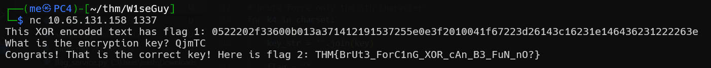

## TL;DR

We can find the key based on the encrypted flag and the source code.

### Recon

In this challenge, it random some 5 digit key, xor the flag with this key, and sends us back the encrypted flag.
Since we know the flag starts with `THM{` and ends with `}`, we can derive the key, without using brute force at all

Just change the secret.
```py

```

the first flag will be:
```bash
THM{p1alntExtAtt4ckcAnr3alLyhUrty0urxOr}
```

```bash
┌──(me㉿PC4)-[~/thm/W1seGuy]
└─$ nc 10.65.131.158 1337
This XOR encoded text has flag 1: 0522202f33600b013a371412191537255e0e3f2010041f67223d26143c16231e146436231222263e
What is the encryption key? QjmTC
Congrats! That is the correct key! Here is flag 2: THM{BrUt3_ForC1nG_XOR_cAn_B3_FuN_nO?}
```



the second flag is:
```bash
THM{BrUt3_ForC1nG_XOR_cAn_B3_FuN_nO?}
```