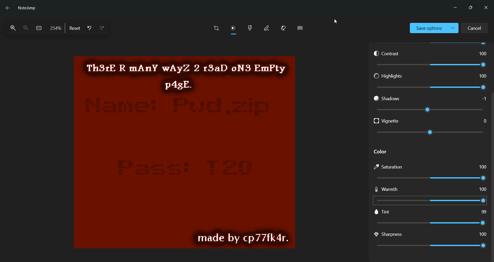

i downloaded the image, and played with the contrast and brightness.

so, we can see that the name: `Pwd.zip` and pass `T20`.

when we download the zip file, and extract it, we get the exe file `Pwd.exe`.

**Flag:** ***`enter flag here`***
