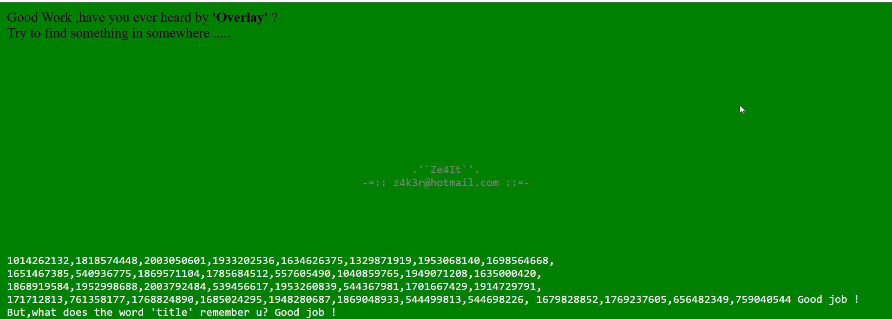
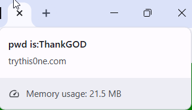

in this challenge you can run the function doit() that will rewrite the page, using decrypting some big array. 
i find in comment this array: 
```
1013478509,1816005180,1651467385,543319907,1869377394,1025668968,1769235746,1040861039,1868832855,1869769504,745038198,1696627055,1965057398,1701978216,1700885092,543324448,1013071399,1333159282,1818327335,1009738302,541015138,1916668500,1920540788,1864394345,1852055667,1869440372,1751740007,543780384,1936682341,2003330418,1696607790,774778378,171733054,171729522,1044144754,1044144754,1044144754,1044144754,1044144754,1040858211,1868850494,1013346158,1948279663,1819243069,577204833,2032287242,1013146990,1952805438,774332506,1697925492,1613180476,1651654189,1027226144,2050255667,1916823663,1953325417,1814979439,1830828602,1026374703,1667591796,1701985802,1013084734,1013084734,1013084734,1013084734,1013084734,171730543,1853104227,1869377394,1025668968,1769235746,1040855344,825504310,842085170,741423153,943011636,875837484,842018867,808792118,808528945,959656754,808596787,908865846,859059762,909326133,741421874,959985457,959527212,825832755,808859697,875572273,909719605,909391414,942410289,909455668,909587256,892089652,809055030,926364972,825767481,892809521,808725553,926430518,942945585,841758005,926298165,876163116,825242672,943012151,909454385,959723824,925970992,942420278,859123760,808727088,738865464,909654321,959789108,741423413,842611000,909654060,842018867,926495284,942943285,859386933,909521207,741423413,858928688,942881068,892613683,909588792,824979767,808531510,926167609,741423409,876032569,926495020,170997553,925971000,825437239,909194037,942749495,741422902,943206964,943271980,825636917,808596530,959786033,959723570,942683704,925643064,909717556,943272755,741684276,876165432,825437237,875836985,942813750,738865462,926496818,943207730,741422902,959591223,909129004,909456948,942814004,959199029,959460400,892613642,168430112
```
so i tried to decode it and run the decode func. 

```
myar = new Array(013478509,1816005180,1651467385,543319907,1869377394,1025668968,1769235746,1040861039,1868832855,1869769504,745038198,1696627055,1965057398,1701978216,1700885092,543324448,1013071399,1333159282,1818327335,1009738302,541015138,1916668500,1920540788,1864394345,1852055667,1869440372,1751740007,543780384,1936682341,2003330418,1696607790,774778378,171733054,171729522,1044144754,1044144754,1044144754,1044144754,1044144754,1040858211,1868850494,1013346158,1948279663,1819243069,577204833,2032287242,1013146990,1952805438,774332506,1697925492,1613180476,1651654189,1027226144,2050255667,1916823663,1953325417,1814979439,1830828602,1026374703,1667591796,1701985802,1013084734,1013084734,1013084734,1013084734,1013084734,171730543,1853104227,1869377394,1025668968,1769235746,1040855344,825504310,842085170,741423153,943011636,875837484,842018867,808792118,808528945,959656754,808596787,908865846,859059762,909326133,741421874,959985457,959527212,825832755,808859697,875572273,909719605,909391414,942410289,909455668,909587256,892089652,809055030,926364972,825767481,892809521,808725553,926430518,942945585,841758005,926298165,876163116,825242672,943012151,909454385,959723824,925970992,942420278,859123760,808727088,738865464,909654321,959789108,741423413,842611000,909654060,842018867,926495284,942943285,859386933,909521207,741423413,858928688,942881068,892613683,909588792,824979767,808531510,926167609,741423409,876032569,926495020,170997553,925971000,825437239,909194037,942749495,741422902,943206964,943271980,825636917,808596530,959786033,959723570,942683704,925643064,909717556,943272755,741684276,876165432,825437237,875836985,942813750,738865462,926496818,943207730,741422902,959591223,909129004,909456948,942814004,959199029,959460400,892613642,168430112)
```
and then execute the follow command: `decode(myar)`, the script rewrite the document and we get this message
```
Good Work ,have you ever heard by 'Overlay' ?
Try to find something in somewhere .....
```

however, we haven't finished yet...
we can find this string in the source code and do the same thing again:
```
1014262132,1818574448,2003050601,1933202536,1634626375,1329871919,1953068140,1698564668, 1651467385,540936775,1869571104,1785684512,557605490,1040859765,1949071208,1635000420, 1868919584,1952998688,2003792484,539456617,1953260839,544367981,1701667429,1914729791, 171712813,761358177,1768824890,1685024295,1948280687,1869048933,544499813,544698226, 1679828852,1769237605,656482349,759040544
```

and then, we can see this:
 
i changed the color of the page to green...

we can see it told us to look on the title, OK
 

**THANK GOD!**


**Flag:** ***`ThankGOD`***

