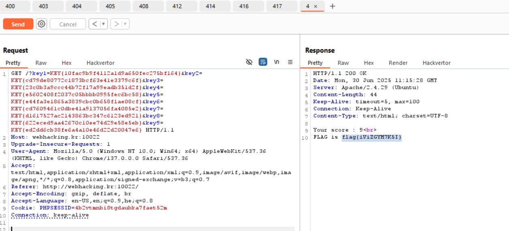

Here we need to send requests that gives us different http codes, each code will give us a key. We need to achieve 9 KEYS at all, and then we can achieve the flag.

#### 400 Bad Request
```
GET /img/ HTTP/1.1
Host: webhacking.kr:10022
Host: webhacking.kr:10022
``` 
> `KEY{10fac9b9f4112a1d9a650fec275bf164}` 


#### 403 Forbidden
```
GET /img/ HTTP/1.1
Host: webhacking.kr:10022
``` 
> `KEY{cd79de80772c1873bcf63e41e3379c6f}` 


#### 404 Not Found
```
GET /not_found HTTP/1.1
Host: webhacking.kr:10022
``` 
> `KEY{23c0b3a9ccc44b72f17a99eadb351d2f}` 

#### 405 Method Not Allowed
```
TRACE / HTTP/1.1
Host: webhacking.kr:10022
``` 
> `KEY{e5602408f2037c05bbbb0995fec6bc58}` 

#### 408 Request Timeout
```
GET / HTTP/1.1
Host:webhacking.kr:10022
``` 
*send without blank lines at the end, so the error will fault* 
> `KEY{e44fa3e1865a3839cbc0b658f1ae08cf}` 

#### 412 Precondition Failed
```
GET /img/flag.png HTTP/1.1
Host: webhacking.kr:10022
If-Match: "invalidetag"
``` 
> `KEY{cd7609461c0dbe41a9137056fa4085e2}` 

#### 414 Request-URI Too Long
```
GET /?key1=[a * 40000] HTTP/1.1
Host: webhacking.kr:10022
``` 
> `KEY{d1617527ac2143863bc347c6123ed921}` 

#### 416 Requested Range Not Satisfiable
```
GET / HTTP/1.1
Host: webhacking.kr:1002
Range: bytes=999999-1000000
``` 
> `KEY{622eced9aa42670c10ee74d29e58e5eb}` 

#### 417 Expectation Failed
```
GET / HTTP/1.1
Host: webhacking.kr:10022
Expect: 1337-mode
``` 
> `KEY{ed2dd6cb38fe6a4a10e46d22d20047e6}` 





**Flag:** ***`FLAG{iViZGYM7K5I}`*** 


