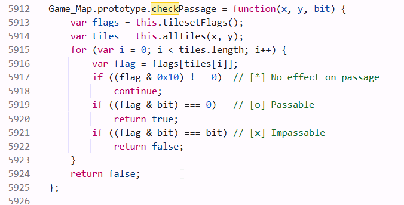
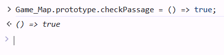

in this challenge i read the code and searched for a function that check the passage, for crossing the river.

i override this function by running this command: `Game_Map.prototype.checkPassage = () => true;`

and then, i was able to cross the river!

**Flag:** ***`FLAG{I_am_a_RPG_Mast3R_}`*** 
