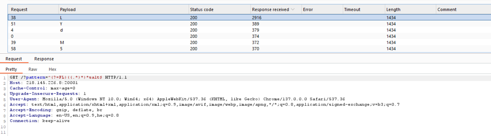

# Webhacking RegexMaster Solution

In this challange we exploit regex injection.

I used this paper [Blind Regex Injection](https://diary.shift-js.info/blind-regular-expression-injection/).

If we'll supply this input: `?pattern=^(?=F)((.*)*)*salt$`, then it first checks whether the first char is `F`, and if so, goes to this loop: `((.*)*)*`, which makes it do backtracking till collapsing in the backend. 

For example: `?pattern=^(?=..A)((.*)*)*salt$` -> *Takes time* (3rd char is `A`)

In our side, all we can see is that on the right char it got delayed:

So, let's write our script: [regexMaster.py](./scripts/regexMaster.py)

**Flag:** ***`FLAG{im_r/e/g/e/x_master//_//}`*** 

