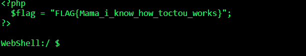

# webhacking baby_toctou Solution

There is some flaw in the api.php file, that can let us inject our payload to the code that will get run, because the server wait for 1 second before executing the system function.
here is the source code: [baby_toctou]
```python
% scripts/baby_toctou.py
```


we need to inject our code using the script, and then just asking for "ls" from the server, while the script is running.



**Flag:** ***`FLAG{Mama_i_know_how_toctou_works}`*** 
